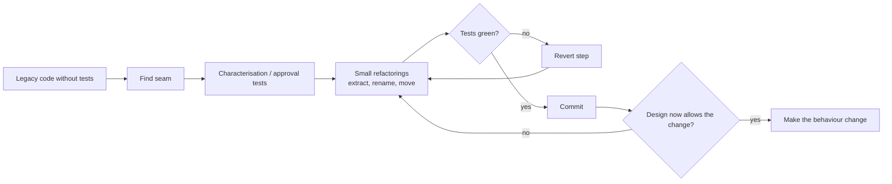

# SOLID, refactoring & code quality at scale

!!! abstract "At a glance"
    **Priority:** P1 · **Complexity:** 2/5 · **Est. time:** 2 h · **Phase:** 1 · **Prereqs:** [Design patterns](design-patterns.md)
    **You're done when:** you can explain each SOLID principle with a violation and fix in Python, describe how the principles scale up to modules and services, run a safe refactoring (characterisation tests first) on a legacy function, and define code-quality guardrails for a multi-team codebase, including for AI-generated code.

## Why it matters

SOLID is the most quoted and least understood set of design principles. Used dogmatically, it produces interface explosions; used as *diagnostic heuristics*, it explains why code is hard to change. At Staff level the useful question is: **how do these principles scale from classes to modules to services?** (SRP becomes bounded contexts; DIP becomes ports & adapters; ISP becomes consumer-driven contracts; OCP becomes plugin architectures and event-driven extension.)

Code quality at scale is also an organisational problem: without shared standards, automated checks and a refactoring culture, 50 engineers plus coding agents produce entropy faster than anyone can review it. In 2026 with AI-generated code, the review bottleneck and "plausible but wrong" code make guardrails (types, tests, linters, architecture tests) more important than ever.

## Core concepts

### SOLID as change-diagnosis heuristics

| Principle | Better phrasing | Smell | Fix | Scaled-up form |
|---|---|---|---|---|
| **S**RP | A module should have one reason to change (one actor/stakeholder) | Class edited for unrelated reasons; "and" in its name | Split by axis of change | Bounded context per team/domain |
| **O**CP | Add behaviour by adding code, not editing stable code | `if/elif` on type edited for each new variant | Polymorphism, registry, plugin | Plugin/microkernel architecture; event subscribers |
| **L**SP | Subtypes must honour the base contract | `raise NotImplementedError` in override; `isinstance` checks | Fix hierarchy; use composition/protocol | API compatibility: new version must accept old clients |
| **I**SP | Clients shouldn't depend on methods they don't use | Fat interface, mocks with 15 stubs | Role interfaces / small Protocols | Consumer-driven contracts; narrow tool schemas for agents |
| **D**IP | Depend on abstractions owned by the high-level policy | Domain imports SDK/ORM | Port + adapter, injection | Hexagonal architecture ([hexagonal](hexagonal-clean.md)) |

```python
# OCP + DIP: adding a new carrier doesn't touch BookingService
from typing import Protocol

class CarrierGateway(Protocol):
    def quote(self, origin: str, dest: str, teu: int) -> float: ...

class BookingService:
    def __init__(self, carriers: dict[str, CarrierGateway]):
        self.carriers = carriers
    def best_quote(self, origin, dest, teu) -> tuple[str, float]:
        return min(((n, c.quote(origin, dest, teu)) for n, c in self.carriers.items()),
                   key=lambda t: t[1])
```

```python
# LSP violation (classic): a subtype that strengthens preconditions
class Order:
    def cancel(self): self.status = "CANCELLED"
class ShippedOrder(Order):
    def cancel(self): raise RuntimeError("cannot cancel shipped order")   # clients of Order break
# Fix: model cancellability explicitly — order.can_cancel(), or return a Result, or state pattern
```

### Beyond SOLID: the principles that matter in practice

- **Tell, don't ask** / Law of Demeter: avoid `a.b().c().d()`; ask the object to do it.
- **Composition over inheritance.**
- **Separation of concerns and Cohesion** — see [coupling & modularity](coupling-modularity.md).
- **Simple Design (Beck)**: passes tests, reveals intention, no duplication, fewest elements — in that order.
- **YAGNI / rule of three** vs premature abstraction; **Wrong abstraction is costlier than duplication** (Sandi Metz).
- **Functional core, imperative shell**: pure decision logic, side effects at the edges — the easiest way to testable code and works in Python/Java alike.
- **Make illegal states unrepresentable**: types (enums, sealed types, NewType, Pydantic) encode invariants.

### Refactoring: safe, small, continuous

Refactoring = changing structure without changing behaviour, in small steps, with tests as the safety net (Fowler, 2nd ed.).

Workflow for legacy code (Feathers, *Working Effectively with Legacy Code*):

1. **Find a seam** — a place to alter behaviour without editing (dependency injection, subclass, parameter, function pointer).
2. **Characterisation tests**: write tests that capture *current* behaviour (even if wrong) — golden master / approval tests.
3. **Break dependencies** minimally (extract interface, parameterise constructor, sprout method/class).
4. **Refactor in tiny steps**; run tests after each; commit frequently.
5. **Then** change behaviour (make the change easy, then make the easy change — Beck).



High-value refactorings: Extract Function, Rename, Introduce Parameter Object, Replace Conditional with Polymorphism, Replace Primitive with Object, Extract Class, Move Function, Introduce Seam, Replace Temp with Query. Code smells that justify them: long function, large class, shotgun surgery, divergent change, feature envy, primitive obsession, data clumps, speculative generality, message chains.

**Tidy First?** (Beck): small structural tidyings are separate from behaviour changes — separate PRs/commits; tidy before, after, later, or never depending on economics (cost of tidying vs benefit to upcoming changes).

### Code quality at scale: mechanisms, not exhortation

| Layer | Mechanism | Tools (Python / Java) |
|---|---|---|
| Style/lint | Automated, non-negotiable, no debates | ruff, formatters / Spotless, Checkstyle |
| Types | Gradual → strict on new code; public APIs typed | mypy/pyright/ty / Java's type system, JSpecify null-safety |
| Tests | Test pyramid, fast unit tests, contract tests; mutation testing on core | pytest, Hypothesis / JUnit 5, Testcontainers, PIT |
| Architecture tests | Enforce layering and dependency rules | import-linter / ArchUnit, jMolecules |
| Complexity gates | Cyclomatic/cognitive complexity thresholds on new code | ruff C901, radon / Sonar |
| Review | Small PRs, checklists, codeowners, trunk-based dev | CODEOWNERS, PR templates |
| Debt tracking | Explicit, ratcheted metrics; "boy scout" rule | SonarQube new-code gates, ratchet scripts |
| Docs-as-code | ADRs, C4, README-per-module | see [ADRs](adrs.md) |

**The ratchet**: don't demand fixing all legacy violations; fail the build if the *count* of violations (mypy errors, complexity hot spots, banned imports) increases. Progress is monotonic without a big-bang cleanup.

### AI-generated code and quality

- Coding agents optimise for "it works" in the visible context: expect duplicated helpers, over-broad exception handling, missing edge cases, and boundary violations.
- Make the rules machine-checkable (import-linter contracts, typed interfaces, tests) and put conventions in `AGENTS.md` so agents get them in context.
- Review shifts from syntax to **intent and design**: does this belong here? What invariants does it assume? Is there a test that fails without the change?
- Small PRs still matter — agent-produced 2,000-line diffs are unreviewable; enforce size limits and stacked PRs.
- Use agents *for* refactoring: they're strong at mechanical transformations when a strong test suite exists (characterisation tests first).

### Senior-level nuance

- SOLID principles often *conflict* with each other and with YAGNI. Decide by the cost of change actually observed.
- Interfaces in Python: prefer `Protocol` (structural) at boundaries; ABCs when you want enforced registration; plain functions where behaviour is a single operation.
- **Cohesion first, then coupling.** Most SRP violations are cohesion problems: code that changes for different reasons sits together.
- "Clean code" isn't a goal; *cost of change* is. A 300-line function that is stable, tested and understood may be cheaper left alone.

## Resources

| Resource | Type | Why this one | Level | Cost |
|---|---|---|---|---|
| [Refactoring, 2nd ed. (Martin Fowler) / online catalog](https://refactoring.com/catalog/) | book/docs | The catalog with mechanics for each refactoring | intermediate | paid/free |
| [Refactoring.Guru — Code smells](https://refactoring.guru/refactoring/smells) | docs | Visual, well-organised smell catalogue linking smells to refactorings | intermediate | free |
| [Working Effectively with Legacy Code (Feathers)](https://www.informit.com/store/working-effectively-with-legacy-code-9780131177055) | book | Seams and characterisation tests: the essential legacy-code technique | intermediate | paid |
| [Understand Legacy Code](https://understandlegacycode.com/) :gem: | article | Practical, modern techniques (approval tests, mikado method, refactoring in Java/JS) | intermediate | free |
| [Tidy First? (Kent Beck)](https://tidyfirst.substack.com/) | newsletter | Economics of small structural improvements | intermediate | freemium |
| [A Philosophy of Software Design (Ousterhout)](https://web.stanford.edu/~ouster/cgi-bin/book.php) :gem: | book | Deep modules, complexity budget — the strongest counterweight to over-abstraction | advanced | paid |
| [Cosmic Python](https://www.cosmicpython.com/) | book | SOLID/DIP applied to real Python services | intermediate | free |
| [import-linter](https://import-linter.readthedocs.io/) | docs | Make layering rules part of CI | intermediate | free |
| [ArchUnit](https://www.archunit.org/) | docs | Java equivalent: test your architecture like code | intermediate | free |

## Hands-on lab

**Goal:** refactor a legacy function safely. 60–90 min.

1. Take a 150-line function mixing parsing, pricing rules, DB writes and notification (write a synthetic one or find one in your repo).
2. Write **characterisation tests** using approval/golden-master style: feed 20 recorded inputs, snapshot outputs.
3. Introduce seams: inject the DB and notifier as parameters/Protocols.
4. Apply Extract Function/Class in ≤ 10 tiny commits; keep tests green after each.
5. Replace primitive obsession with two value objects; replace the type `if/elif` with a registry (OCP).
6. Add a complexity gate and an import-linter contract; set up a ratchet script (fail if violations increase).
7. Ask a coding agent to do steps 3–5 given the tests; review its diff for boundary violations and note what you had to correct.

**Expected output:** commit history showing small green steps, before/after complexity numbers, and a note on agent performance.

## Questions

### L1 — Recall

??? question "Q1. State SRP precisely, and why 'a class should do one thing' is a poor formulation."
    ??? success "Answer"
        SRP: a module should be responsible to one, and only one, actor — it should have one reason to change. "Do one thing" invites arbitrary splitting into tiny classes; the real signal is *reasons to change* driven by different stakeholders (e.g. pricing logic and report formatting change for different people, so they shouldn't share a class).

??? question "Q2. What is the Liskov Substitution Principle in practical terms?"
    ??? success "Answer"
        Code using a base type must work correctly with any subtype without knowing which: subtypes may not strengthen preconditions, weaken postconditions or break invariants. Practical smells: overrides that raise `NotImplementedError`, `isinstance` checks in client code, subclasses that ignore inherited behaviour.

??? question "Q3. What is a characterisation test?"
    ??? success "Answer"
        A test that captures the current observable behaviour of existing code (right or wrong) to serve as a safety net before refactoring. Created by running the code with representative inputs and recording outputs (golden master / approval tests) — it documents what the system *does*, not what it should do.

??? question "Q4. List five code smells and the refactoring associated with each."
    ??? success "Answer"
        Long function → Extract Function. Large class/divergent change → Extract Class. Primitive obsession → Replace Primitive with Object (value objects). Feature envy → Move Function. Switch/if-chains on type → Replace Conditional with Polymorphism. Also: data clumps → Introduce Parameter Object; shotgun surgery → Move/Inline to consolidate.

### L2 — Apply

??? question "Q5. Refactor this: `def price(o): if o.type == 'FCL': ... elif o.type == 'LCL': ... elif o.type == 'REEFER': ...` used in 6 places."
    ??? success "Answer"
        Introduce a `PricingStrategy` protocol (`price(order)`) with `FclPricing`, `LclPricing`, `ReeferPricing`; a registry `{ 'FCL': FclPricing(), ...}` chosen once at the edge (factory from order type) and injected or attached to the order/aggregate. Steps: write characterisation tests for each branch; extract each branch into a function; move into classes/callables; replace call sites one by one. Adding a type becomes adding a class + registration. If the six places all vary differently, consider a sealed type/enum + a single dispatch function instead.

??? question "Q6. You must add a feature to a 3,000-line untested class next week. What's your plan?"
    ??? success "Answer"
        Don't refactor everything. (1) Identify the change points; (2) find/introduce a seam around them (extract the method you need to change into a new class — sprout class — with tests); (3) write characterisation tests around the touched behaviour at the highest available level (API/golden master); (4) implement the feature test-first in the new unit, calling it from the legacy class; (5) tidy only what you touched (boy scout); (6) add the class to a ratchet list for future cleanup. Communicate the risk and the debt entry.

??? question "Q7. Configure a ratchet for mypy strictness on a large codebase with 4,000 existing errors."
    ??? success "Answer"
        Options: enable strict mode only for a growing allowlist of packages (`[[tool.mypy.overrides]]` with `strict = true` for modules already clean, and new modules by default), plus a baseline file (e.g. mypy baseline tooling or store the error count per module and fail CI if it increases). Require all *new* files to be strictly typed. Track the number over time on a dashboard; assign owners per package. Avoid blanket `# type: ignore` — use specific ignores with reasons.

### L3 — Design & trade-offs

??? question "Q8. Is DIP always worth applying? Give a rule of thumb for when to invert dependencies."
    ??? success "Answer"
        Invert where the dependency is *volatile* (vendors, LLM providers, storage engines), *expensive to test* (network, DB, time), or *crosses a team/module boundary*. Don't invert stable, cheap, in-process dependencies (standard library, pure utility functions) or things with one implementation in a small CRUD service. Cost of DIP: extra interfaces, wiring and mapping. Benefit: testability and replaceability. See [hexagonal](hexagonal-clean.md).

??? question "Q9. Duplication vs abstraction: two teams each have similar 60-line validation code. Share or not?"
    ??? success "Answer"
        Determine if they change for the same reason (same rule from the same business owner → share, with one owner) or merely look alike (different rules that may diverge → keep separate; the wrong abstraction is costlier than duplication). If sharing, pick the weakest coupling: a service/API for volatile business rules, a versioned library only for stable technical validation. If two teams must negotiate every change, the shared code is already too expensive.

??? question "Q10. Design the quality gates for a monorepo with 8 teams and heavy coding-agent usage."
    ??? success "Answer"
        Pre-commit and CI: formatter and linter (ruff) with zero-tolerance; type checking strict on new code with ratchet; tests with coverage on changed lines and mutation tests on core packages; import-linter/ArchUnit for module boundaries and forbidden dependencies (e.g. no SDK imports in domain); dependency and secret scanning; PR size limit and required CODEOWNERS review for cross-module changes; AGENTS.md with conventions plus a "definition of done" checklist agents must follow; contract tests for service APIs; performance smoke tests for hot paths. Measure: change failure rate, revert rate, review turnaround, agent-PR acceptance rate. Rely on automation over reviewer vigilance.

### L4 — Staff-level ambiguity

??? question "Q11. The codebase is 'a mess', morale is low, and leadership wants features. How do you make quality investment credible without a rewrite?"
    ??? success "Answer"
        Tie quality to delivery outcomes: identify the 3 hottest files/modules by change frequency × defect density (CodeScene-style hotspots) — the 20% that causes 80% of pain. Propose *targeted* refactoring inside feature work (make-the-change-easy) with an agreed 10–20% capacity allowance, ratchets to prevent regression, and a visible dashboard (lead time, bug rate in hotspots). Pick one win to demonstrate (e.g. cut hotspot cycle time in half). Reject a rewrite: use strangler-style replacement for modules that are irredeemable ([legacy modernization](legacy-modernization.md)). Get leadership to view debt like financial debt: interest paid (slower delivery) vs principal.

??? question "Q12. Engineers complain that AI-generated PRs are exhausting to review and quality is drifting. What changes do you propose?"
    ??? success "Answer"
        Shift verification left and automate: require tests demonstrating the behaviour (fails before, passes after); enforce architecture tests and types in CI so agents get immediate feedback; keep PRs small (stacked); put standards in AGENTS.md and reusable skills so agents follow conventions; have agents self-review against a checklist and produce a summary of design decisions; reviewers focus on design and invariants ("does this belong here?"), not style. Track AI-attributed defect and rework rates to calibrate. Provide guidance on where agents are strong (mechanical refactors with tests, boilerplate) and weak (cross-cutting design, security-sensitive code). Pilot with one team, iterate, then scale.

## Real-world use cases

- **Plugin architectures** (OCP): rules engines, IDEs, payment methods added without touching core.
- **Legacy insurance/banking cores**: characterisation tests + seams to make change safe.
- **Google-style large-scale changes**: automated refactoring tools (codemods) with strong tests across monorepos.
- **Ratchets** in large Python codebases (Dropbox, Instagram-style typing adoption): progressive strictness.
- **AI-assisted refactoring**: agents performing mechanical migrations (API upgrades) behind a test suite.

## Pitfalls & anti-patterns

- SOLID as dogma: interface-per-class, abstraction with one implementation.
- Refactoring without tests, or mixing refactor and behaviour changes in one commit.
- Big-bang rewrites of "messy" code.
- Style debates instead of automated formatters.
- Quality initiatives with no owner or metrics.
- Coverage targets gamed with assertion-free tests.
- Trusting AI-generated changes without behavioural tests.

## Checklist

- [ ] I can explain SOLID as change heuristics and their scaled-up architectural forms without notes
- [ ] I wrote characterisation tests and refactored in small green steps
- [ ] I set up a ratchet and one architecture test in CI
- [ ] I can describe quality guardrails for AI-generated code
- [ ] I answered all L3 questions out loud in < 3 min each
