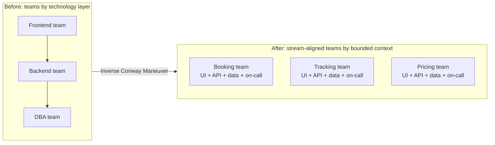

# Team Topologies & Conway's law

!!! abstract "At a glance"
    **Priority:** P0 · **Complexity:** 2/5 · **Est. time:** 2 h · **Phase:** 4 · **Prereqs:** [DDD strategic](ddd-strategic.md), [Coupling & modularity](coupling-modularity.md)
    **You're done when:** you can map a system's teams to the four team types and three interaction modes, diagnose a Conway's-law mismatch in an org you know, apply the Inverse Conway Maneuver to propose team boundaries aligned to bounded contexts, and reason about team cognitive load, including where AI agents fit.

## Why it matters

Melvin Conway (1967): *"Any organization that designs a system will produce a design whose structure is a copy of the organization's communication structure."* Architecture and organisation are the same design problem. Most "architecture failures" at scale are org-design failures: a service boundary that crosses three teams will be a coordination bottleneck no matter how clean the code is. Staff/Principal architects must design **team boundaries and interaction patterns** alongside software boundaries — this is the sociotechnical half of the job and a favourite in senior interviews ("How would you organise 60 engineers to build X?").

*Team Topologies* (Skelton & Pais, 2019; 2nd edition 2025) gives a practical vocabulary: four fundamental team types, three interaction modes, and cognitive load as the design constraint. It underpins platform engineering, enabling teams and the "you build it, you run it" model — and in 2026 it's being extended to human+AI teams.

## Core concepts

### Conway's law and the Inverse Conway Maneuver

- **Conway's law (descriptive)**: system structure mirrors communication structure. Four teams building a compiler → a four-pass compiler.
- **Inverse Conway Maneuver (prescriptive)**: deliberately structure teams to encourage the architecture you want. If you want independent services aligned to bounded contexts, create teams that own those contexts end to end.
- Corollary: **changing architecture without changing team structure usually fails** (the org pulls the design back), and vice versa.

Symptoms of Conway mismatch: every feature needs 3 teams; releases require cross-team coordination; ownership disputes over shared components; an API design that mirrors org charts (e.g. "the DBA API"); services with no clear owner.

### The four fundamental team types

| Type | Purpose | Owns | Success looks like |
|---|---|---|---|
| **Stream-aligned** | Deliver a continuous flow of change for a business stream (product, journey, user segment) | A slice of the domain end to end (usually maps to a bounded context) | Fast flow, low hand-offs; the default and majority of teams |
| **Enabling** | Help stream-aligned teams acquire missing capabilities; time-boxed | Knowledge, not systems (e.g. security, ML, architecture coaching) | Teams become independent; the enabling team moves on |
| **Complicated-subsystem** | Own a subsystem needing deep specialist knowledge | E.g. pricing optimiser, video codec, routing solver | Specialist complexity contained behind a clear API |
| **Platform** | Provide internal services/tools as a product to reduce others' cognitive load | Paved roads: CI/CD, observability, data platform, LLM gateway | Stream-aligned teams ship faster with less effort; measured by adoption/satisfaction |

(Fifth, not a type: teams should avoid becoming *"component teams"* or *"ticket-taking ops teams"* — the anti-patterns.)

### The three interaction modes

| Mode | Description | When | Watch-out |
|---|---|---|---|
| **Collaboration** | Two teams work closely on a shared goal | Discovery, new technology, fuzzy boundaries | Expensive; time-box; blurs ownership |
| **X-as-a-Service** | One team consumes another's service with minimal collaboration | Mature, stable boundary (platform APIs) | Requires a good service/product mindset |
| **Facilitating** | One team helps another learn/overcome obstacle | Enabling team → stream-aligned team | Must have an end date |

Match interaction modes to the **context map**: collaboration ≈ partnership/shared kernel; X-as-a-Service ≈ open host service/published language with customer/supplier; facilitating ≈ enabling relationships. If the org chart says "X-as-a-Service" but the code demands daily collaboration, you have a boundary problem.

### Cognitive load as the design constraint

Team cognitive load types (borrowed from learning science):

- **Intrinsic**: fundamental to the domain/tech (learning Python).
- **Extraneous**: environment/process noise (arcane deployment, unclear ownership) — *eliminate this* (platform teams' job).
- **Germane**: domain-specific learning that's valuable (understanding the customer's problem) — *maximise this*.

Rule: a team should own a **software domain it can fit in its head** — limit the number of contexts/services per team. Signs of overload: long onboarding, on-call burnout, slow response to changes, "hero" engineers, missed context in incidents. A domain too big for one team → split by bounded context; too many services per team → merge or offload to platform.

Practical heuristic: 5–9 engineers per team (two-pizza scale), 1–3 bounded contexts per team, one primary on-call rotation.

### Platform as a product

Platform teams succeed when they behave like product teams:

- Identify users (stream-aligned teams), research pain, maintain a roadmap.
- Thinnest viable platform: start with a documented set of golden paths, not a mandated giant portal.
- Measure adoption voluntariness, time-to-first-deploy, developer satisfaction (DX surveys), DORA metrics of consumers.
- Failure modes: ivory-tower platform building what nobody wants, mandatory but poor tools, platform team as ticket queue.

**AI platform team example**: provides LLM gateway, eval and tracing infrastructure, vector store as a service, guardrail library, and prompt registry. Stream-aligned teams build features and own their agents' prompts, tools and evals. An enabling team (AI guild) coaches on evals and security.

### Fracture planes: how to split teams and domains

Candidate seams for team boundaries (from Team Topologies): business domain/bounded context, regulatory compliance, change cadence, team location/time zone, risk profile, performance isolation, technology, user personas. Prefer *business domain* first; use others when they create strong constraints (e.g. a regulated payments component that requires isolated controls).

### Team-first architecture: worked example

Shipping platform, 45 engineers. Candidate design:

| Team | Type | Owns | Interaction |
|---|---|---|---|
| Booking & Amendments | Stream-aligned | Booking context (UI, API, data) | X-as-a-Service consumer of Pricing; collaboration with Capacity during redesign |
| Tracking & Visibility | Stream-aligned | Ingest, ETA views, customer notifications | Consumes Platform Streaming |
| Pricing & Yield | Complicated-subsystem | Rate engine and optimiser (specialist maths) | Provides API to Booking |
| Customer Onboarding | Stream-aligned | Customer journey and KYC integrations | |
| Platform Engineering | Platform | CI/CD, Kubernetes, observability, event backbone, LLM gateway | X-as-a-Service |
| AI Enablement | Enabling | Coaching on agents/evals/guardrails; templates | Facilitating, 3–6 months per team |

Then check: does each team own ≤ 2 bounded contexts? Are there hand-offs on the main flow? Where is the highest cross-team coupling (co-change analysis)? Adjust.

### AI agents and team design

- **Agents as team members**: coding agents change *throughput per engineer* and shift work toward specification, review and verification; cognitive load changes (more review, more context management).
- **Ownership of agents**: an agent that acts in a domain is owned by the stream-aligned team of that context, with platform providing the runtime. Cross-domain "super-agents" have no natural owner — a Conway smell.
- **Interaction design for human-AI**: define escalation paths (which team gets the human-approval task), on-call for agent incidents, and shared eval ownership.
- **Team size effects**: with agent leverage, smaller teams may own more, but review capacity and accountability remain bounded by humans — don't remove cognitive-load limits, redefine them.

### Senior-level nuance

- **Org changes are expensive and political**: propose the *smallest* team change that unlocks the architecture change; use the Inverse Conway Maneuver incrementally (e.g. carve out one stream-aligned team around a context first).
- **"Team API"**: each team should publish how to work with it — code ownership, APIs, backlog intake, communication channels, on-call, SLAs.
- **Matrix and shared teams** (e.g. shared QA or DBA) create queues; convert to enabling/platform capabilities.
- **Conway also applies to AI systems**: if three teams each own one agent in a chain, the agent handoff schema will mirror the team boundaries — design the contract deliberately.
- Measure with DORA + flow metrics (lead time, handoffs per feature, wait times) and team health/cognitive-load surveys.

## Resources

| Resource | Type | Why this one | Level | Cost |
|---|---|---|---|---|
| [Team Topologies (Skelton & Pais)](https://teamtopologies.com/book) | book | The source; 2nd edition (2025) expands on interaction modes and platforms | intermediate | paid |
| [Team Topologies — Key concepts](https://teamtopologies.com/key-concepts) :gem: | docs | Free concise summary of team types, interaction modes and fracture planes | beginner | free |
| [Conway's Law (Fowler bliki)](https://martinfowler.com/bliki/ConwaysLaw.html) | article | Brief, well-sourced explanation including Inverse Conway | beginner | free |
| [How Do Committees Invent? (Melvin Conway, original paper)](https://www.melconway.com/Home/Committees_Paper.html) | article | The 1968 paper itself — short and surprisingly readable | intermediate | free |
| [Learning Domain-Driven Design (Khononov)](https://vladikk.com/) | book | Connects bounded contexts to team ownership | intermediate | paid |
| [Architecture Modernization (Tune & Perrin)](https://www.manning.com/books/architecture-modernization) | book | Sociotechnical design and team alignment in modernization | advanced | paid |
| [DDD Crew — Context mapping (team relationships)](https://github.com/ddd-crew/context-mapping) | docs | Links context-map patterns to team relationship types | intermediate | free |
| [Software Architecture: The Hard Parts (Ford et al.)](https://nealford.com/books/) | book | Team structure and coupling in decomposition decisions | advanced | paid |
| [StaffEng — Staff archetypes](https://staffeng.com/guides/staff-archetypes/) | article | Where architects fit relative to team structures | intermediate | free |

## Hands-on lab

**Goal:** design team boundaries for a target architecture. 60–90 min.

1. Take the organisation and system from your context (or the shipping platform above). List the teams and what they own today.
2. Compute a rough co-change matrix (git) or list features from the last quarter and which teams each touched; count hand-offs per feature.
3. Map current teams to team types and note anti-patterns (component teams, ticket-driven ops, shared "platform" without product thinking).
4. Design a target: ≤ 8 teams, each a type, each owning ≤ 2 bounded contexts; draw interaction modes between them.
5. Compute expected cognitive load per team (number of contexts, services, on-call scope, technologies) and flag overload.
6. Write a phased transition (which team to create/reshape first, what interaction to change) with risks and a metric for each phase.
7. AI extension: assign owners for two agents and the LLM gateway; define escalation for human-approval tasks.

**Expected output:** current vs target team maps, cognitive-load table, transition plan.

## Questions

### L1 — Recall

??? question "Q1. State Conway's law and the Inverse Conway Maneuver."
    ??? success "Answer"
        Conway's law: organisations produce system designs that copy their communication structures. The Inverse Conway Maneuver: deliberately design the team structure and communication paths to promote the desired system architecture (e.g. cross-functional teams aligned to bounded contexts to get loosely coupled services).

??? question "Q2. Name the four team types in Team Topologies and each one's purpose."
    ??? success "Answer"
        Stream-aligned (deliver flow of change for a business stream), enabling (help other teams gain capabilities, temporarily), complicated-subsystem (own specialist-heavy components), platform (provide internal services as a product to reduce others' cognitive load).

??? question "Q3. Name the three interaction modes and when each is appropriate."
    ??? success "Answer"
        Collaboration (two teams working closely; for discovery/uncertain boundaries, time-boxed), X-as-a-Service (consume with minimal interaction; for stable boundaries and platforms), Facilitating (one team helps another learn/overcome obstacle; typical of enabling teams; time-boxed).

??? question "Q4. What are the three types of cognitive load and which should a platform team target?"
    ??? success "Answer"
        Intrinsic (inherent to the task/domain), extraneous (avoidable friction from environment/process), germane (valuable learning about the domain). Platform teams primarily reduce extraneous load so stream-aligned teams can spend capacity on germane and intrinsic work.

### L2 — Apply

??? question "Q5. A company has FE, BE, QA and DBA teams; each feature takes six hand-offs and 5 weeks. Propose changes."
    ??? success "Answer"
        Move to stream-aligned cross-functional teams aligned to business flows/bounded contexts (Booking, Tracking, Pricing), each with frontend, backend, data and testing skills and responsibility for on-call. QA becomes embedded testing practice plus an enabling function for test strategy; DBAs become an enabling team/platform capability (managed DB service, coaching, review of schema patterns) rather than a gate. Transition incrementally: start with the highest-value flow, form one pilot team, measure hand-offs and lead time. Expect resistance from functional managers — address career paths and communities of practice for each discipline.

??? question "Q6. A platform team of 6 has a queue of 120 tickets from 15 stream-aligned teams and is seen as a bottleneck. What do you do?"
    ??? success "Answer"
        Shift from ticket-taking to product mindset: (1) segment requests — self-service candidates vs true platform work; (2) build self-service golden paths (templates, APIs, docs) for the top 5 request types; (3) reduce collaboration with each team to X-as-a-Service; (4) define a thin platform with a clear roadmap and SLAs, and say no to bespoke work; (5) measure adoption, time-to-first-deploy, and satisfaction; (6) use an enabling team or guild to coach teams to help themselves; (7) consider embedding a platform engineer temporarily (facilitating) where big wins exist.

??? question "Q7. Map these to team types: ML ranking engine with 3 PhDs, security coaching for product teams, checkout journey, internal Kubernetes and CI."
    ??? success "Answer"
        ML ranking engine: complicated-subsystem team (specialist knowledge, clear API). Security coaching: enabling team (facilitating interaction, time-boxed, transfers skills). Checkout journey: stream-aligned team. Kubernetes and CI: platform team (X-as-a-Service). Interaction modes: stream-aligned consumes ranking via X-as-a-Service; security enabling facilitates; platform provides paved road.

### L3 — Design & trade-offs

??? question "Q8. Should every bounded context get its own team? Discuss."
    ??? success "Answer"
        Not necessarily: the constraint is cognitive load. One team can own several small or stable contexts (e.g. supporting subdomains), while a large or complex core context may need a dedicated team or even splitting. Conversely, a context shouldn't be split across teams without an explicit interaction mode. Aim for a mapping where each context has exactly one owner team, and a team's total load (contexts, services, on-call, tech stacks) is manageable. Revisit as volatility and org size change.

??? question "Q9. Design team structure for an AI product organisation: 4 product areas each wanting LLM features. Centralised AI team vs embedded vs platform+enabling?"
    ??? success "Answer"
        Central AI team: consistency and depth but a bottleneck and disconnected from domains. Fully embedded: speed and domain closeness but duplicated infrastructure and uneven quality. Recommended: stream-aligned teams own AI features in their domains (prompts, agents, evals) — platform team provides gateway, eval/observability tooling, vector stores and guardrails as a service — an enabling AI guild/team coaches, curates patterns and rotates into teams for 3–6 months; a complicated-subsystem team only for genuinely specialist components (fine-tuning, search relevance). Interaction: X-as-a-Service for platform, facilitating for enabling.

??? question "Q10. How would you use Team Topologies concepts to decide between microservices and a modular monolith?"
    ??? success "Answer"
        Count stream-aligned teams and their ability to own independent contexts. If teams are few (≤ 4–5) with high collaboration needs, a modular monolith owned collectively (with module ownership) minimises cognitive load from operating many services. If there are many autonomous teams needing independent release cadence, services aligned to each team's context make sense — provided the platform team provides paved roads (extraneous load stays low). Also consider interaction modes: X-as-a-Service boundaries suit services with contracts; collaboration-heavy boundaries suit staying in one codebase until stable.

### L4 — Staff-level ambiguity

??? question "Q11. You want to reorganise teams around bounded contexts, but HR and functional managers resist (reporting lines, career ladders). How do you make progress?"
    ??? success "Answer"
        Separate *reporting lines* from *working structure*: propose stream-aligned team membership with functional managers retaining people-management (a matrix as an interim step) and communities of practice maintaining craft. Demonstrate the cost of current structure with data (hand-offs per feature, lead time, incident coordination). Pilot with one stream and one metric set; get an executive sponsor for the pilot. Address career ladders (Staff engineers' scope spans teams; technical growth paths independent of function). Communicate the why (customer outcomes and autonomy) and keep changes incremental to reduce fear. Use ADR-like "org decision records" to capture the reasoning.

??? question "Q12. Post-acquisition, two teams (from different companies) each own overlapping 'pricing' services. How do you decide ownership and structure?"
    ??? success "Answer"
        First business: is pricing a core differentiator for the merged company? If so, choose one target model deliberately (maybe hybrid: keep both during coexistence behind a facade) and staff a single stream-aligned or complicated-subsystem team with the best combined expertise. Evaluate technical and domain fit (models, performance, extensibility), not politics; run a bounded, time-boxed comparison with shared benchmarks. Create a shared team from both companies to build/converge (collaboration mode for a fixed period) to preserve tacit knowledge and morale; define an explicit end state and ownership date. Use the context map: publish a common pricing API (published language) so consumers migrate once, independent of internal consolidation. Track knowledge-retention risks and communicate transparently.

## Real-world use cases

- **Spotify-style squads/tribes (and their pitfalls)**: popularised stream-aligned autonomy; many copies missed the platform and enabling pieces.
- **Amazon's two-pizza teams and service ownership** ("you build it, you run it") produce service-per-team architectures.
- **Platform engineering** at scale (Backstage-based internal developer platforms) as X-as-a-Service for stream-aligned teams.
- **Regulated fintech** using complicated-subsystem teams for payments/compliance components.
- **AI enablement teams** coaching product teams on evals and guardrails while the platform team runs gateway and tracing.

## Pitfalls & anti-patterns

- Component teams (UI team, DB team) creating hand-offs for every feature.
- A platform team run as a ticket queue, or mandating poor tooling.
- Permanent collaboration between teams (the boundary is unclear, ownership blurred).
- Enabling teams that never hand back (becoming a dependency).
- Overloaded teams owning too many services/contexts.
- Reorganising teams without changing architecture (or vice versa).
- Ignoring the human side: changing structures without career ladders or communication.

## Checklist

- [ ] I can explain Conway's law, Inverse Conway, team types and interaction modes without notes
- [ ] I mapped a real org to team types and diagnosed at least two anti-patterns
- [ ] I designed a target team structure aligned to bounded contexts with cognitive-load checks
- [ ] I can explain ownership of AI agents and platform services in team terms
- [ ] I answered all L3 questions out loud in < 3 min each
