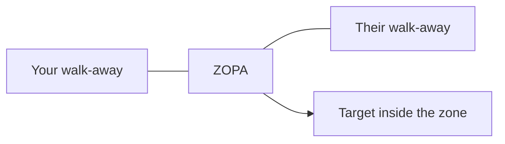

# Negotiation & saying no

!!! abstract "At a glance"
    **Priority:** P0 · **Complexity:** 4/5 · **Est. time:** 3 h · **Phase:** 3 · **Prereqs:** [Feedback, disagreement & conflict](feedback-and-conflict.md) · [Idioms for work](idioms-business.md)
    **You're done when:** you can prepare a one-page negotiation plan (interests, BATNA, ZOPA, options), run a 10-minute negotiation in English without conceding by silence, and decline a request in three different registers while keeping the relationship.

## Why it matters
Staff engineers negotiate every week and rarely call it that: scope versus date with a product owner, platform capacity with another team, headcount and priorities with a director, vendor terms, and their own level and compensation. Almost every "no" you should say (to a low-value project, an unreasonable deadline, an extra on-call rota) is a negotiation. Non-native speakers commonly lose value in two ways: they say "yes, we will try" to avoid conflict, or they over-explain a refusal until it sounds like a negotiable maybe.

## Core concepts

### 1. Positions vs interests
- **Position:** what they say they want ("We need the API by the fifteenth.").
- **Interest:** why ("The customer demo is on the twentieth and the sales team needs a stable endpoint.").

Negotiate interests. Find them with questions: "What is driving that date?", "What happens if it slips a week?", "What would a good outcome look like for you?"

### 2. BATNA, reservation point, ZOPA
- **BATNA:** Best Alternative To a Negotiated Agreement (Fisher and Ury, *Getting to Yes*). What you do if no deal is reached. Your BATNA sets your walk-away power.
- **Reservation point:** the worst outcome you would still accept, derived from your BATNA.
- **ZOPA:** Zone Of Possible Agreement, the overlap between both sides' reservation points. No overlap, no deal unless you change the picture (create new options or change the price of the alternative).
- **Target / aspiration:** where you hope to end; open above it.

Example (internal): You need a platform team to add a feature to their service. Their position: not this quarter. Your BATNA: build a workaround in your service (six engineer-weeks, tech debt). Their BATNA: ignore your request (but their own roadmap depends on your data). ZOPA: a shared design where you build the client library and they review and expose the endpoint next quarter.

### 3. Five phases of a negotiation
1. **Prepare**: interests (yours and theirs), BATNA, ZOPA guess, options, opening, concessions list, who decides.
2. **Open**: set the frame, agenda and tone. "I would like us to leave with a decision on scope and date."
3. **Explore**: ask, listen, label, test assumptions.
4. **Bargain**: trade, never give. Conditional language ("If you can..., then I can...").
5. **Close**: summarise, get commitment, confirm in writing.

### 4. Language of trading (conditional concessions)
Structure: **If you [give], then I [give].** Avoid unconditional gifts.

| Purpose | Phrase |
|---|---|
| Trade | "If we can move the deadline to the thirtieth, I can commit two engineers full time." |
| Test | "Suppose we cut the reporting module, would the original date be feasible?" |
| Anchor | "Based on the scope, we are looking at fourteen weeks." |
| Signal flexibility | "There is some room on timing; there is very little on quality gates." |
| Ask for reciprocity | "I have adjusted on scope. What can you do on the review turnaround?" |
| Label emotion | "It sounds like the date is under a lot of pressure from above." |
| Summarise | "So we have agreed: MVP by June 12, security review in parallel, and a checkpoint on May 20. Is that right?" |
| Not yet | "I cannot agree to that today; let me check with my team and come back by Thursday." |

### 5. Tactics and responses
| Tactic | What it is | Response |
|---|---|---|
| Anchoring | First number sets the frame | Do not react to it; re-anchor with your data: "That is well outside what we see. Our estimate is..." |
| Deadline pressure | "Decide today or lose it" | "I understand the time constraint. What happens if we decide on Monday?" |
| Good cop / bad cop | Another person "is not happy" | "Let us hear from them directly." |
| Nibbling | Small extra asks after agreement | "Happy to add that; what would we take off in return?" |
| Silence | Waiting for you to fill | Wait too; a five-second pause is fine |
| Higher authority | "My director will not accept" | "Can we put the three of us on a call?" |

### 6. Tactical empathy and mirroring (Chris Voss)
- **Mirror:** repeat the last 1-3 words with upward intonation: "Unrealistic?" invites elaboration.
- **Label:** "It seems like..." "It sounds like..." "It looks like..." never "I understand" (which can sound dismissive).
- **Calibrated questions:** open, "how" and "what" not "why": "How am I supposed to do that with this team size?" is a polite way to make the other side solve your problem. Use it sparingly, and warmly.
- **Accusation audit:** name the negatives first: "You probably think we are being difficult about scope."

### 7. Saying no
A good "no" is clear early, respectful, gives a reason where useful, and offers an alternative or a condition. Ladder:

| Type | When | Phrase |
|---|---|---|
| Hard, kind | You will not do it | "I am not able to take that on. My commitments are full through Q3." |
| Explain | Reason helps | "I have to say no to this, because it would push out the resilience work we agreed with Ana." |
| Alternative | Partial yes | "I cannot do the full migration, but I can review your plan and unblock the test environment." |
| Conditional yes ("yes, if") | Trade | "Yes, if we drop the export feature." |
| Not now | Real timing | "This is not the right time. Can we revisit it in the March planning?" |
| Redirect | Someone else better | "Rahul on the data team is closer to this. I will introduce you." |
| Priority question | Manager overload | "I can do A or B by Friday, not both. Which matters more?" |

Say the "no" in the first sentence. Do not bury it after three lines of context, and do not add "sorry" repeatedly. "I would love to, but..." is common and fine, but it can suggest the "no" is negotiable if you do not mean it to be.

Phrases to avoid: "I will try" (means no to many listeners and yes to others), "maybe" for a real no, "possibly", "we will see", "that could be challenging" when you mean no.

### 8. Negotiating scope, date, resources (the iron triangle)
Any request changes at least one of scope, time, resources, quality. Say it plainly: "We can fix two of three: scope, date, or team size. Which one do you want to flex?" Quality is not a lever that quietly moves.

### 9. Career and compensation negotiation
- Research market ranges (levels.fyi, Glassdoor, recruiters) and build a written case: scope, impact, level expectations.
- Talk in ranges and totals: "Based on my scope and the market, I am looking for a total package of X to Y."
- Do not give a number first if you can avoid it: "I would like to understand the band for this level. Can you share it?" (Some regions have pay-transparency rules that require it.)
- Trade beyond salary: title, scope, equity, sign-on, development budget, remote days, start date.
- After the offer, pause: "Thank you, I am excited about this. I would like to take a day to review the details."
- Use the boss as an ally: "What would it take to get to level P7 by the next cycle?"

### 10. Cross-cultural notes
- **Relationship first vs deal first.** In many contexts (India, China, Gulf, Latin America), time invested in the relationship and shared context comes before terms; jumping to numbers in the first minute can feel abrupt. In others (Germany, US, Nordics) agenda-first is expected.
- **Yes.** In some cultures "yes" means "I hear you", not "I agree". Test: ask for the specific next action and date.
- **Bargaining.** Some cultures expect visible back-and-forth; a first-offer "final price" may look uncooperative. Others value a fair first offer.
- **Decision rights.** Ask who the decision maker is; in consensus cultures (e.g. Japan, some Nordic teams) the pre-meetings matter more than the formal meeting; in hierarchical settings the meeting may only ratify.
- **Silence.** Long silence is thinking in some cultures, rejection in others. Do not fill it out of anxiety.
- **Time zones:** Do complex negotiations live, not via long email exchanges. Follow with a written summary.

## Reference tables

**Preparation canvas (fill one page)**

| Item | Your notes |
|---|---|
| My interests (ranked) | |
| Their likely interests | |
| My BATNA and its cost | |
| Their BATNA | |
| My reservation point / target / opening | |
| Options that expand the pie | |
| What I can trade (cheap for me, valuable to them) | |
| Objective criteria (benchmarks, SLAs, precedent) | |
| Who decides / by when | |

**Firmness ladder**

| Flexible | Firm | Immovable |
|---|---|---|
| "I am open to..." | "It would be difficult for me to..." | "I am not able to agree to that." |
| "We could look at..." | "That is a real constraint for us." | "That is outside what we can do." |

## Resources
| Resource | Type | Why this one | Level | Cost |
|---|---|---|---|---|
| *Getting to Yes* (Fisher, Ury, Patton) | book | Origin of interests, BATNA, objective criteria; short and foundational | intermediate | paid |
| *Never Split the Difference* (Chris Voss) | book | Tactical empathy, labels, calibrated questions; very usable scripts | intermediate | paid |
| [Harvard Program on Negotiation: free reports and blog](https://www.pon.harvard.edu) | article | Research-based articles on BATNA, ZOPA, anchoring | intermediate | freemium |
| *Difficult Conversations* (Stone, Patton, Heen) | book | The Harvard Negotiation Project's companion on emotional stakes | intermediate | paid |
| *Crucial Conversations* (Patterson et al.) | book | Staying in dialogue when stakes and emotions run high | intermediate | paid |
| [BBC Learning English: The English We Speak](https://www.bbc.co.uk/learningenglish) | podcast | Short clips of negotiation and business idioms | intermediate | free |
| [Chris Voss talks and MasterClass excerpts](https://www.youtube.com) :gem: | video | Hear real intonation of mirroring and labeling; search his name | intermediate | free/paid |
| *The Culture Map* (Erin Meyer) :gem: | book | The "Persuading" and "Trusting" scales explain many cross-cultural negotiation surprises | intermediate | paid |
| Levels.fyi | tool | Compensation benchmarks by level and company for career negotiations | intermediate | free |

## Hands-on lab
**Time: 75-90 min.**

1. **Prepare (20 min).** Pick a real upcoming negotiation (scope vs date with product, a capacity request, a salary conversation). Fill the preparation canvas.
2. **Script (15 min).** Write your opening (30 s), three conditional trades ("If..., then..."), and a "no" line for the thing you must refuse.
3. **Role-play (30 min).** Use the negotiation role-play prompt in [AI tutor prompts](ai-tutor-prompts.md). Two rounds: one with a friendly counterpart, one tough (anchoring and deadline pressure).
4. **Review (10 min).** Read the transcript: where did you concede without a trade? Where did you say "I will try"? Rewrite those lines.
5. **Say no three ways (10 min).** Take one real request; write and say a hard-kind no, a conditional yes, and a redirect.

## Questions

### L1 — Recall
??? question "Q1. Define BATNA and ZOPA and say how they relate."
    ??? success "Answer"
        BATNA is your Best Alternative To a Negotiated Agreement, what you will do if no deal is reached. ZOPA is the Zone Of Possible Agreement, the range where both sides would prefer a deal to their BATNAs. Each side's BATNA determines its reservation point; the overlap of the reservation points is the ZOPA. A stronger BATNA moves your reservation point in your favour.

??? question "Q2. Explain the difference between a position and an interest with an engineering example."
    ??? success "Answer"
        Position: "The API must ship in two weeks." Interest: "Sales need a stable endpoint for a customer demo on the twentieth." Different options can satisfy the interest (a mocked stable endpoint, a limited beta) even if the position (full API) is impossible.

??? question "Q3. Why is 'I will try' risky in cross-cultural teams?"
    ??? success "Answer"
        Different listeners hear it differently: some hear a commitment; others (and often the speaker) mean it is unlikely. It leaves ownership and expectations ambiguous. Replace it with a clear yes, a conditional yes, or a no with a reason.

??? question "Q4. What are calibrated questions, and which question words are preferred?"
    ??? success "Answer"
        Open-ended questions that invite the counterpart to solve your problem without feeling attacked. They start with "how" or "what" (e.g. "How can we make this work within the current team size?"). "Why" tends to sound accusatory.

### L2 — Apply
??? question "Q5. Write a conditional trade for: product wants two more features and the same release date."
    ??? success "Answer"
        "We can add the export feature if we move the date by two weeks, or we keep the date if we defer the audit log to the next release. Which would you prefer?" Two options, both keep the constraint visible; the choice is theirs.

??? question "Q6. Decline a request to lead a third project. You want to keep the relationship."
    ??? success "Answer"
        "Thank you for thinking of me. I have to say no to leading this one: I am already at capacity with the migration and the resilience work, and taking a third would hurt both. What I can do is review the plan and introduce you to Kavya, who has done something similar." First sentence is the acknowledgement plus no; reason is short; alternative provided.

??? question "Q7. A vendor says 'this is our final price, and it expires Friday.' Respond."
    ??? success "Answer"
        "Thanks for the clarity. I need to review this with finance and our security team, and I cannot responsibly decide by Friday. If Friday is firm, I would like to understand what would be different on Monday. In the meantime, can you share what flexibility there is on the support tier or on the term length?" Tests the deadline, doesn't concede to it, seeks trades on other variables.

??? question "Q8. Someone nibbles: after agreement, they ask you to also write the migration guide. Reply."
    ??? success "Answer"
        "Happy to look at that. It is about three days of work, so what would you like us to take off the list, or could the date move by three days?" Nibbles get a price.

### L3 — Design & trade-offs
??? question "Q9. Should you make the first offer in a salary negotiation? Argue both sides and choose."
    ??? success "Answer"
        For: anchoring gives you a strong influence over the range; if you know the market, you avoid low-balling. Against: you may anchor below what they would have offered, and you reveal your reservation point. Best practice: if you have solid market data, and the range is unknown, state a range whose lower bound is a number you would be happy with ("I am looking for 130 to 145") and justify it with scope; if the company has a published band, ask for it first. Choose based on information asymmetry: the less you know, the more you should ask before naming a number. Also check local law: in some regions employers must disclose bands.

??? question "Q10. Your BATNA is weak (you need this team's service and they do not need you). List three ways to improve your position without lying."
    ??? success "Answer"
        (1) Improve the alternative: prototype a workaround so building it yourself becomes credible. (2) Increase their interest: find something they need from you (integration data, on-call help, shared roadmap credit) and link the issues. (3) Change the frame: bring a shared objective from a sponsor or an objective standard (SLA, company OKR), or escalate the priority to a common manager. Avoid bluffing about an alternative you do not have.

??? question "Q11. Compare saying 'Yes, if...' with a flat 'No' when your manager adds work to an already full plan."
    ??? success "Answer"
        'Yes, if...' surfaces the trade-off and lets the manager set priorities; it preserves the relationship and treats capacity as a shared constraint. A flat no is clearer but can sound uncooperative to a manager who did not know the load. Use 'yes, if' when the request is legitimate and the trade is real; use a flat no when the request violates a principle, safety, or you have already agreed priorities the manager is overriding. In both, put the constraint in numbers: "I have 24 planned engineer-days; this takes 8."

??? question "Q12. When is compromising the wrong strategy in negotiation?"
    ??? success "Answer"
        When an interest-based solution could satisfy both (splitting the difference gives both less than an integrative option); when the issue is a hard requirement (security, compliance); when the compromise creates a fake agreement the team cannot execute (half the scope at full date pressure). Look for options that expand the pie before splitting it.

### L4 — Staff-level ambiguity
??? question "Q13. Three teams each need your platform team's next quarter. You can serve one and a half. Write the conversation you have with the three leads."
    ??? success "Answer"
        Do it as a joint session, not in three side deals. Open: "We cannot serve all three requests in Q3. I would like us to agree a fair way to choose, and I will publish the decision." Share criteria (customer impact, revenue at risk, dependency, effort) and score openly. Ask each: "What is the impact if you get half?" Look for sequencing or shared components. Close with a written decision, owners, dates, and a review point. Escalate only the disagreement about criteria, not each request. Language: "I would rather we make an unpopular decision transparently than a popular one secretly."

??? question "Q14. Your director asks you to commit your team to a date the team already said is unrealistic, in front of a customer. What do you say in the room and after?"
    ??? success "Answer"
        In the room, avoid contradicting the director publicly or accepting a lie: "We are committed to delivering the core service to the customer by that date; the full reporting scope comes two weeks later. We will confirm the exact split in writing by tomorrow." After: private conversation. "I want to hit this, and I am worried about committing the full scope. Here is the risk in numbers. Can we agree what we say to the customer, and what we protect if something slips?" Write it up. This protects the customer relationship, the team, and your credibility.

??? question "Q15. You are negotiating an outsourcing contract with a vendor based in another region. Every meeting ends in enthusiastic agreement, but deliverables slip. Diagnose and change your approach."
    ??? success "Answer"
        Likely the "yes" signalled listening and goodwill, not commitment; concerns are not being voiced upward or in front of the client. Changes: ask open questions about risk ("What would make this date hard?"); agree milestones in writing with named owners and demonstrable outputs; use smaller checkpoints (weekly demos); invite the vendor's engineers directly to a one-to-one channel; meet the project lead privately to signal it is safe to raise problems; separate the relationship (celebrated) from the accountability (explicit). Do not label it as dishonesty; assume different norms for signalling.

## Real-world use cases
- **Scope-for-date trade with product**: conditional trades and calibrated questions.
- **Shared platform prioritisation**: transparent criteria and a written decision for competing teams.
- **Vendor and cloud commitments**: BATNA (multi-cloud, alternate vendor) and objective criteria (benchmarks, SLAs) in price talks.
- **Saying no to a pet project from a senior stakeholder**: "not now, and here is what would change my answer".
- **Level and compensation conversations**: evidence-based range, non-salary trades, calm pause after an offer.

## Pitfalls & anti-patterns
- Entering without knowing your BATNA or walk-away.
- Conceding in silence because the pause is uncomfortable.
- "Yes" to avoid conflict, followed by silent non-delivery.
- Explaining a "no" with a long list of reasons: each reason is an invitation to rebut. Give one or two.
- Apologising repeatedly ("sorry, sorry, I know...").
- Treating every negotiation as win-lose, especially with peers you need again.
- Negotiating by long email threads when the issue is emotional.
- Using tactics from a book without warmth: mirroring mechanically feels manipulative.
- Not writing down the agreement.

## Checklist
- [ ] I can explain positions vs interests, BATNA, ZOPA and reservation point in 60 seconds
- [ ] I filled the preparation canvas for a real negotiation
- [ ] I can say no in a hard-kind, conditional, and redirect form without saying "I will try"
- [ ] I ran two AI role-plays and found my top three unconditional concessions
- [ ] I can answer all L3 questions out loud in under 3 minutes each

!!! tip "See also"
    Staff-skills: [Influence without authority](../staff-skills/influence-without-authority.md) · [Communication & stakeholders](../staff-skills/communication-stakeholders.md) · [Decision-making](../staff-skills/decision-making.md) · [Technical strategy](../staff-skills/technical-strategy.md). Here: [Feedback, disagreement & conflict](feedback-and-conflict.md) · [Executive presence](executive-presence.md).
