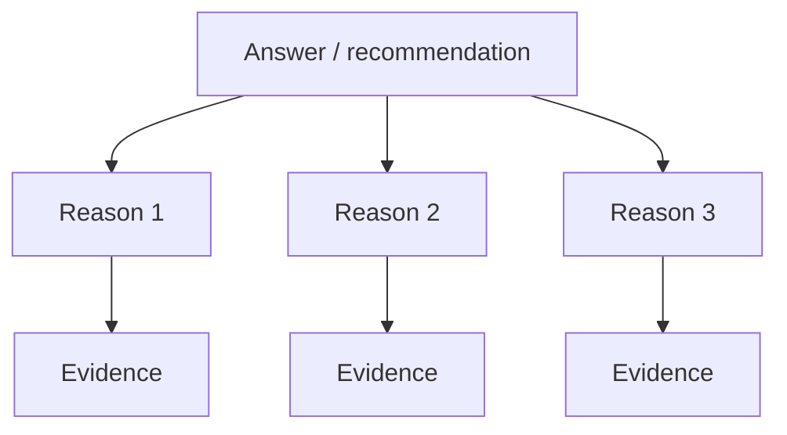

# Storytelling & persuasion

!!! abstract "At a glance"
    **Priority:** P0 · **Complexity:** 4/5 · **Est. time:** 3 h · **Phase:** 2 · **Prereqs:** [Structuring spoken answers](structuring-spoken-answers.md) · [Concise writing & editing](concise-writing-editing.md)
    **You're done when:** you can turn a technical recommendation into a 90-second story (SCQA or Pyramid), deliver five STAR stories without notes, and pick the persuasion approach that suits the audience.

## Why it matters
Staff engineers rarely decide alone; they persuade. A good proposal loses to a well-told mediocre one when the decision-makers do not follow the logic, feel the stakes, or trust the messenger. Stories also carry your interview performance ([behavioral interviews](../staff-skills/behavioral-interviews.md)) and your executive updates. For a non-native speaker the advantage of structure is that it lowers cognitive load: when the skeleton is fixed, you can spend attention on pace, word choice and pronunciation.

## Core concepts

### 1. The Pyramid Principle (Barbara Minto)
Answer first, then support in groups of three, ordered logically.

Rules:
- **Answer first** for executives ("BLUF": bottom line up front).
- **MECE** groupings: mutually exclusive, collectively exhaustive.
- **Same kind of thing at each level**: three reasons, three risks, three steps; not a mix.
- **Ordering:** by time, structure or importance; state which.

Script: "I recommend we migrate the routing engine to the new platform in Q3. Three reasons: it cuts run cost by about 40 percent, it removes our single-vendor risk, and it unblocks the multi-region rollout. The main risk is a two-week freeze; I propose to mitigate it with a dual-run period."

### 2. SCQA: Situation, Complication, Question, Answer
Minto's story opener for documents and talks.

| Part | Job | Example |
|---|---|---|
| Situation | Shared, uncontested context | "Our booking API serves 40 shipping lines on a single database." |
| Complication | What changed, the tension | "Volume has doubled and the September peak brought two outages." |
| Question | The implied question | "How do we handle peak without an outage or a rewrite?" |
| Answer | Your recommendation | "Introduce read replicas and a queue for writes; six weeks of work." |

Use it for exec summaries, RFC intros, and openings of talks. The Question is often left implicit.

### 3. STAR (and STAR+R) for behavioural stories
- **Situation:** context, 1-2 sentences.
- **Task:** your responsibility or the problem, 1 sentence.
- **Action:** what YOU did (I, not we), 60 percent of the answer.
- **Result:** measurable outcome, then **Reflection**: what you learned or would do differently (the Staff-level add-on).

Length: 90-120 seconds. Prepare five to eight stories that map to: conflict, failure, influence without authority, ambiguity, technical judgment, mentoring, delivering under pressure, a hard trade-off. One story can serve several questions; tag them.

Pitfalls: too much situation; "we did"; no numbers; a result that is just "it went well".

Script: "At [company], our nightly rating job started missing its window (S). I was asked to get it under four hours before the peak season (T). I profiled it, found that 70 percent of time was in one join, moved it to a precomputed table, and, because I did not own the data team's schema, I got their agreement by showing the cost of the alternative (A). The job dropped from eleven hours to ninety minutes and we had no misses through peak (R). What I would do differently is involve the data team a week earlier; I lost days waiting for the schema change (Reflection)."

### 4. The story arc for talks
Hook, context, tension, turning point, resolution, call to action. Two devices:

- **The concrete detail:** name the customer, the number of hours, the 3 a.m. page. Specificity is memorable.
- **The contrast:** before / after, expected / actual.

Keep to one story per message. A talk that opens with a failure ("At 2:14 a.m. our rate table returned zero") holds attention better than an agenda slide.

### 5. Persuasion frameworks
**Aristotle: ethos, pathos, logos.**

| Appeal | Meaning | Engineering example |
|---|---|---|
| Ethos | Credibility | "I ran the last two migrations." Cite evidence; admit limits |
| Logos | Logic and data | Benchmarks, cost model, incident count |
| Pathos | Emotion and values | The customer's stuck container, the on-call engineer's sleep |

**Cialdini's principles (use ethically):** reciprocity, commitment and consistency, social proof, authority, liking, scarcity. Useful for internal influence: social proof ("Team X and Y have done this already"), commitment (get a small yes first), reciprocity (do something useful first).

**Tailor to the audience:**

| Audience | What they want | Lead with |
|---|---|---|
| CEO/CFO | Money, risk, strategy | Outcome and cost in a sentence |
| Director/VP | Delivery and risk | Options, recommendation, ask |
| Product | Customer value and date | Trade-offs in their terms |
| Engineers | Correctness and craft | Evidence, design, failure modes |
| Skeptics | Their objection addressed | State the objection first: "The strongest argument against this is..." |

**Address objections up front** ("steel-man"): name the best counter-argument and answer it. It raises trust.

### 6. Numbers into meaning
Data does not speak; you translate it.
- Compare: "40 percent cheaper, about 1.2 million dollars a year."
- Concrete: "That is 20 engineer-years."
- Rule of three: three points, three bullets.
- Round and anchor; keep exact numbers in the appendix.
- Say what changes: "so what?" after every number.

### 7. Framing decisions
- **Options with a recommendation:** give two or three, say which you prefer and why.
- **Reversible vs irreversible:** Bezos' "one-way and two-way doors": persuade for speed on two-way doors.
- **Cost of inaction:** "If we do nothing, the September peak will repeat with 30 percent more volume."
- **A specific ask:** "I need approval for two engineers for six weeks by Friday."

### 8. Delivery devices (spoken)
- **Signposting:** "There are three points. First..."
- **Pause** before the key sentence.
- **Repetition of the key line** at the end.
- **Analogies** matched to the audience: logistics, e.g. "It is like a port with one crane."
- **Rule of three, contrast pairs:** "Faster, cheaper, safer." "Not a rewrite, a rerouting."

### 9. Cross-cultural notes
- **Principles-first vs applications-first.** Some audiences (e.g. France, Germany, parts of Southern Europe) prefer conceptual reasoning before the example; others (US, UK, Australia) want the practical point first. Consider: headline first, then reasoning in the order that suits the listener.
- **Direct vs indirect persuasion.** In the US, a confident recommendation with numbers is expected; in Japan, China and parts of India, a proposal that has been pre-socialised in one-to-ones (nemawashi in Japanese practice) is stronger than a dramatic meeting pitch.
- **Self-promotion.** US and India-based stakeholders often expect explicit "I" claims of impact; in Nordic and Japanese workplaces excessive self-promotion looks arrogant. Balance: precise "I" statements backed by numbers and credit to others.
- **Storytelling style.** Humour and personal anecdotes travel less well across languages; keep jokes rare and universal.
- **Length.** Some contexts value context and relationship-building first; if you are told "give us the background", do; if told "we know the background", skip.

## Reference tables

**Story bank template**

| Story name | S/T | Actions (I) | Result (numbers) | Reflection | Tags |
|---|---|---|---|---|---|
| Rating job rescue | Nightly job missing window | Profiled, redesigned join, got data team buy-in | 11 h to 90 min | Involve data team earlier | ambiguity, influence, technical |

**Transitions and signposts**

| Purpose | Phrases |
|---|---|
| Open | "I would like to make one recommendation and ask for one decision." |
| Sequence | "First... Second... Finally..." |
| Contrast | "On the one hand... on the other hand..." |
| Evidence | "The data points to..." "What convinced me was..." |
| Objection | "The strongest argument against this is... and here is why I still recommend it." |
| Close | "So, to recap: ... The decision I need today is..." |

## Resources
| Resource | Type | Why this one | Level | Cost |
|---|---|---|---|---|
| *The Pyramid Principle* (Barbara Minto) | book | Origin of the pyramid and SCQA; dense but the reference | intermediate | paid |
| *Made to Stick* (Chip and Dan Heath) | book | SUCCESs model: simple, unexpected, concrete, credible, emotional, stories | intermediate | paid |
| *Resonate* / *Slide:ology* (Nancy Duarte) | book | Story structure for presentations | intermediate | paid |
| [TED Talks: how to give a great talk (Chris Anderson) and popular talks](https://www.ted.com) | video | Model structures; shadow and dissect them | intermediate | free |
| *Influence* (Robert Cialdini) | book | The six principles with research; read for ethics as well as tactics | intermediate | paid |
| [Toastmasters International](https://www.toastmasters.org) | community | Regular structured speaking practice with feedback | all | freemium |
| [Harvard Business Review: search "storytelling"](https://hbr.org) | article | Practical pieces on data storytelling and persuasive narrative | intermediate | freemium |
| *Storytelling with Data* (Cole Nussbaumer Knaflic) :gem: | book | Turns charts into arguments; ideal for exec updates | intermediate | paid |
| *The Culture Map* (Erin Meyer) :gem: | book | The "Persuading" scale: principles-first vs applications-first | intermediate | paid |
| [BBC Learning English: 6 Minute English](https://www.bbc.co.uk/learningenglish) | podcast | Hear natural signposting and discourse markers | intermediate | free |

## Hands-on lab
**Time: 90 min.**

1. **SCQA rewrite (20 min).** Take a real proposal you wrote and re-open it in SCQA in four sentences. Then in Pyramid form: recommendation plus three reasons.
2. **STAR bank (30 min).** Draft five stories in the table above; record each at 90-120 seconds. Transcribe your recording with a free tool and count "we" versus "I".
3. **Audience swap (15 min).** Pitch the same recommendation to a CFO (60 s), then a skeptical engineer (60 s). What changed?
4. **Objection drill (10 min).** Write the strongest counter-argument to your proposal and your response.
5. **AI critique (15 min).** Paste the transcript into the mock meeting prompt in [AI tutor prompts](ai-tutor-prompts.md) and ask for structural feedback.

## Questions

### L1 — Recall
??? question "Q1. What does SCQA stand for and what is each part's job?"
    ??? success "Answer"
        Situation (uncontroversial context), Complication (what changed and creates tension), Question (the question this raises, often implicit), Answer (your recommendation). It sets up why the answer matters before you give it.

??? question "Q2. State three rules of the Pyramid Principle."
    ??? success "Answer"
        Answer first; group supporting points in MECE sets (usually three) of the same kind; order them logically (time, structure or importance). Also: each level summarises the one below it.

??? question "Q3. What is the A in STAR, and why do Staff candidates often lose points here?"
    ??? success "Answer"
        Action: what you personally did. Candidates say "we" throughout and interviewers cannot assess their contribution, or they describe the situation at length and rush the action. Use "I" for your decisions and credit others separately.

??? question "Q4. Name Aristotle's three appeals with one engineering example each."
    ??? success "Answer"
        Ethos: "I led the last two cutovers." Logos: benchmark showing 3x throughput. Pathos: the on-call engineer paged nine times last month.

### L2 — Apply
??? question "Q5. Rewrite as answer-first: 'We looked at Kafka, SQS and Pub/Sub. Kafka has good throughput but needs ops; SQS is simple but ordering is limited; Pub/Sub is managed. After discussion we think...'"
    ??? success "Answer"
        "I recommend SQS with FIFO queues for the booking events. It meets our throughput needs at 5,000 messages per second, needs no cluster to operate, and gives the ordering we need per shipment. The alternatives were Kafka, which offers more throughput than we need but adds operational load, and Pub/Sub, which locks us to a second cloud." Recommendation, then three reasons, then rejected options briefly. (Choice of technology is illustrative.)

??? question "Q6. Write an SCQA opening for a proposal to add rate limiting to a partner API."
    ??? success "Answer"
        "Our partner API supports 300 integrations (S). Last month one partner's retry storm took down bookings for 40 minutes (C). How do we protect all partners without slowing the well-behaved ones? (Q) I recommend per-partner token-bucket limits with a burst allowance, rolled out in monitor-only mode first (A)."

??? question "Q7. Improve this STAR result: 'It went well and the team was happy.'"
    ??? success "Answer"
        "Deploy time dropped from 45 to 8 minutes, failed releases fell from six a quarter to one, and two other teams adopted the pipeline." Measurable, with a scale and a broader impact. If numbers are unavailable, use a credible proxy ("no rollbacks since").

??? question "Q8. Turn 'p99 latency reduced from 900 ms to 300 ms' into a persuasive sentence for a VP."
    ??? success "Answer"
        "Checkout is now three times faster for the slowest one percent of customers; the drop-off on those sessions fell from 12 to 7 percent, which is roughly 400,000 dollars a year." Adds the "so what": customer and money. Only claim causation you can support.

### L3 — Design & trade-offs
??? question "Q9. Pyramid or story? Choose for: (a) a five-minute update to the CTO, (b) an all-hands talk on an outage lesson, (c) an interview answer about influencing without authority."
    ??? success "Answer"
        (a) Pyramid: CTO time is scarce; answer first. (b) Story, with the pyramid as backbone: the emotion and specificity help people remember; end with three lessons. (c) STAR with reflection: interviewers want evidence of your actions; open with one sentence of headline ("I got three teams to adopt a common API without authority") then the story. Choose by audience attention and the purpose: decide vs inspire vs evidence.

??? question "Q10. You have a compelling number that is only true under favourable assumptions. Do you lead with it?"
    ??? success "Answer"
        Lead with the honest range or state the assumption in the same sentence: "Under our current traffic mix this saves 40 percent; if partner Y migrates, closer to 20." Leading with an inflated figure wins the meeting and loses credibility later; ethos is the scarce resource. Put the sensitivity in a backup slide.

??? question "Q11. Should you pre-socialise a proposal in one-to-ones or present it cold to the whole room? Compare and pick for a global audience."
    ??? success "Answer"
        Pre-socialising surfaces objections privately (saves face), builds allies, and is expected in consensus and hierarchical cultures; the meeting becomes ratification. Cold presenting is faster and sometimes appropriate for low-stakes decisions or where transparency is valued, but it exposes you to surprise objections. For a global audience, pre-socialise with key people in each region (especially decision-makers and sceptics), then use the meeting for open questions and formal decision.

??? question "Q12. When does telling a story hurt your persuasion?"
    ??? success "Answer"
        When the audience wants a decision and the story delays the answer; when the story is anecdote posing as evidence (one customer); when humour or idiom will not travel across the audience; when you are the hero of every story. Fix: answer first, short story as illustration, data for generalisation.

### L4 — Staff-level ambiguity
??? question "Q13. Three months of your team's work was cancelled by a re-org. Tell the story to the team in a way that is honest and motivating. Sketch it."
    ??? success "Answer"
        Start with the fact, not spin: "The platform work is stopping. That is a real loss, and I know how much you put into it." Then meaning: what was learned or reused ("The event schema will be used by Team B"). Then forward: "Here is what we will do in the next six weeks, and here is what I do not know yet." Own what you know and do not; do not blame senior people or overpromise. Avoid "everything happens for a reason". Invite reactions and give time.

??? question "Q14. You need executive sponsorship to replace a legacy system; the CFO wants savings, the CTO wants risk reduction, the ops lead fears migration pain. Write the structure of your pitch."
    ??? success "Answer"
        One shared spine with three audience layers. Answer: "Replace X in four phases over 12 months." Reasons in their language: cost (CFO, 1.8 million per year), risk (CTO: outage count and the end-of-support date), transition safety (ops: dual-run, rollback criteria, named owner). Anticipate objections. Ask: decision on phase 1 and headcount. Prepare per-audience one-pagers and pre-meetings. Have one memorable line: "We are paying more each year to keep the system that most risks our peak."

??? question "Q15. A respected colleague tells stories in exec meetings that are vivid but sometimes misleading. The execs love them. How do you counter without making it personal?"
    ??? success "Answer"
        Do not attack the person. Add data and context in the same register: "That customer case is real, and I want to add that it is one of the three that we see; the other two behave differently. Here is the distribution." Offer a vivid, accurate story of your own. Ask a curious question: "Is that typical?" In private, offer feedback via SBI if the pattern affects decisions. The aim is calibrating the room, not winning.

## Real-world use cases
- **Architecture review**: SCQA opening and pyramid recommendation so the review focuses on the decision.
- **Exec update after an incident**: story (what happened), the pyramid (three causes, three fixes), a specific ask.
- **Staff interview loop**: STAR bank with reflection; different stories for different competencies.
- **Funding an AI platform team**: pathos (developer time lost), logos (cost, evidence), ethos (pilot results).
- **Promotion packet**: narrative of impact with numbers.

## Pitfalls & anti-patterns
- Burying the answer at the end ("the punchline").
- Five reasons, all different in kind.
- A story with no stakes, or stakes with no result.
- Precise numbers without the "so what".
- Overclaiming credit; "we" for failures and "I" for wins looks worse than the reverse.
- Slides that are documents; talking through a paragraph of text.
- Manipulation: persuasion with hidden costs is a short-term win.
- A joke that requires local knowledge.

## Checklist
- [ ] I can deliver a SCQA opening and a pyramid for a real proposal in 60 seconds
- [ ] I have five STAR stories with numbers and reflection, recorded and timed
- [ ] I can adapt one recommendation for a CFO and for a sceptical engineer
- [ ] I state the strongest objection to my own proposal
- [ ] I answered all L3 questions out loud in under 3 minutes each

!!! tip "See also"
    Staff-skills: [Behavioral & Staff interviews](../staff-skills/behavioral-interviews.md) · [Design docs & RFCs](../staff-skills/design-docs-rfcs.md) · [Technical strategy](../staff-skills/technical-strategy.md) · [Communication & stakeholders](../staff-skills/communication-stakeholders.md). Here: [Structuring spoken answers](structuring-spoken-answers.md) · [Executive updates](executive-updates.md).
