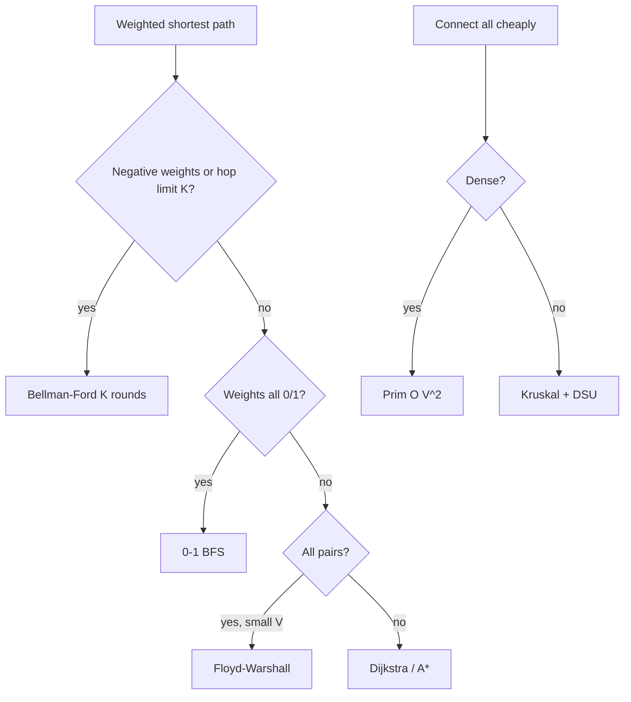

# Advanced graphs: Dijkstra, MST, Bellman-Ford

!!! abstract "At a glance"
    **Priority:** P1 · **Complexity:** 4/5 · **Est. time:** 4 h · **Phase:** 4 · **Prereqs:** [Graphs](graphs.md), [Heap](heap.md)
    **You're done when:** you can choose between BFS, 0-1 BFS, Dijkstra, Bellman-Ford and Floyd-Warshall from the constraints, write Dijkstra and Kruskal/Prim from memory, and recognise minimax-path problems as Dijkstra variants.

## Why it matters

Weighted graphs model routing (roads, shipping lanes, network hops), cost minimisation and dependency scheduling. Interviews at FAANG include these as Medium/Hard: Network Delay Time, Cheapest Flights Within K Stops, Swim in Rising Water, Alien Dictionary, Reconstruct Itinerary. In production, Dijkstra/A* powers routing engines, OSPF/IS-IS use it, Bellman-Ford underlies distance-vector routing, and MSTs appear in network design and clustering.

## Core concepts

### Pattern recognition signals

| When you see… | Think… |
|---|---|
| Shortest path with **non-negative** weights | Dijkstra |
| Edge weights only 0/1 | 0-1 BFS with a deque |
| Negative edges, or "at most K edges/stops" | Bellman-Ford (K rounds) |
| All-pairs shortest, V ≤ ~400 | Floyd-Warshall O(V³) |
| "Connect all nodes at minimum total cost" | MST (Kruskal or Prim) |
| "Minimise the maximum edge/effort along the path" | Minimax: Dijkstra with `max` instead of `+`, or binary search + BFS |
| "Order characters/tasks from pairwise constraints" | Build the graph, then topological sort |
| "Use every edge exactly once" | Eulerian path (Hierholzer) |
| "Critical link / bridge / articulation point" | Tarjan low-link |
| Geometry/grid with a heuristic and a single goal | A* |

### Template 1: Dijkstra with a heap (lazy deletion), O((V+E) log V)

```python
import heapq
from collections import defaultdict

def dijkstra(n, edges, src):
    g = defaultdict(list)
    for u, v, w in edges:
        g[u].append((v, w))
    dist = [float('inf')] * n
    dist[src] = 0
    h = [(0, src)]
    while h:
        d, u = heapq.heappop(h)
        if d > dist[u]:
            continue                       # stale entry
        for v, w in g[u]:
            nd = d + w
            if nd < dist[v]:
                dist[v] = nd
                heapq.heappush(h, (nd, v))
    return dist
```

Correctness needs non-negative weights: once popped, `dist[u]` is final because any other path to u goes through a node with distance ≥ d and adds non-negative weight.

### Template 2: Bellman-Ford with K limit (Cheapest Flights Within K Stops)

```python
def find_cheapest_price(n, flights, src, dst, k):
    dist = [float('inf')] * n
    dist[src] = 0
    for _ in range(k + 1):                 # k stops = k+1 edges
        nxt = dist[:]                      # copy: use only last round's values
        for u, v, w in flights:
            if dist[u] + w < nxt[v]:
                nxt[v] = dist[u] + w
        dist = nxt
    return -1 if dist[dst] == float('inf') else dist[dst]
```

O(K·E). Negative-cycle detection: a V-th round that still relaxes means a negative cycle is reachable.

### Template 3: minimax path (Path With Minimum Effort / Swim in Rising Water)

```python
def minimum_effort_path(h):
    R, C = len(h), len(h[0])
    best = [[float('inf')] * C for _ in range(R)]
    best[0][0] = 0
    pq = [(0, 0, 0)]
    while pq:
        eff, r, c = heapq.heappop(pq)
        if (r, c) == (R - 1, C - 1):
            return eff
        if eff > best[r][c]:
            continue
        for dr, dc in ((1, 0), (-1, 0), (0, 1), (0, -1)):
            nr, nc = r + dr, c + dc
            if 0 <= nr < R and 0 <= nc < C:
                ne = max(eff, abs(h[nr][nc] - h[r][c]))   # max instead of +
                if ne < best[nr][nc]:
                    best[nr][nc] = ne
                    heapq.heappush(pq, (ne, nr, nc))
```

The same algorithm works because the "cost" is monotone non-decreasing along a path.

### Template 4: MST, Kruskal (edge sort + DSU) and Prim (heap)

```python
def kruskal(n, edges):                      # edges: (w, u, v)
    dsu = DSU(n)                            # from the graphs page
    total = used = 0
    for w, u, v in sorted(edges):
        if dsu.union(u, v):
            total += w; used += 1
            if used == n - 1:
                break
    return total if used == n - 1 else -1   # -1: graph disconnected

def prim(n, g):                             # g[u] = [(v, w)]
    seen, h, total = set(), [(0, 0)], 0
    while h and len(seen) < n:
        w, u = heapq.heappop(h)
        if u in seen: continue
        seen.add(u); total += w
        for v, wv in g[u]:
            if v not in seen:
                heapq.heappush(h, (wv, v))
    return total if len(seen) == n else -1
```

Kruskal: O(E log E), best for sparse graphs. Prim (array version): O(V²), best for dense graphs (Min Cost to Connect All Points).

### Template 5: Hierholzer's Eulerian path (Reconstruct Itinerary)

```python
from collections import defaultdict
def find_itinerary(tickets):
    g = defaultdict(list)
    for a, b in sorted(tickets, reverse=True):   # pop() yields smallest first
        g[a].append(b)
    route = []
    def dfs(u):
        while g[u]:
            dfs(g[u].pop())
        route.append(u)                          # post-order
    dfs("JFK")
    return route[::-1]
```

### Algorithm selection table

| Algorithm | Handles | Time | Notes |
|---|---|---|---|
| BFS | unweighted | O(V+E) | |
| 0-1 BFS | weights 0/1 | O(V+E) | deque: 0-edges appendleft |
| Dijkstra | w ≥ 0 | O((V+E) log V) | fails with negatives |
| Bellman-Ford | negatives, K-limited | O(VE) | detects negative cycles |
| SPFA | negatives (heuristic) | avg fast, worst O(VE) | avoid in interviews |
| Floyd-Warshall | all pairs, negatives | O(V³) | V ≤ ~500 |
| A* | single goal + heuristic | depends | admissible, consistent heuristic |
| Kruskal / Prim | MST | O(E log E) / O(E log V) | undirected only |
| Tarjan bridges | bridges/articulation | O(V+E) | DFS low-link |



### Common bugs

- Dijkstra with negative edges (silent wrong answers).
- Missing the `if d > dist[u]: continue` stale check (works but slower, and can be wrong for some counting variants).
- Bellman-Ford K-limit without copying `dist` (lets a path use more than K edges in one round).
- Alien Dictionary: forgetting the invalid-prefix case ("abc" before "ab"), and characters with no edges (still in the output).
- Directed vs undirected edges when building the graph (MST is undirected).
- Using Kruskal without checking the result is spanning (disconnected input).

## Resources

| Resource | Type | Why this one | Level | Cost |
|---|---|---|---|---|
| [cp-algorithms: Dijkstra](https://cp-algorithms.com/graph/dijkstra.html) :gem: | article | Correctness proof and dense/sparse variants | advanced | free |
| [cp-algorithms: Bellman-Ford](https://cp-algorithms.com/graph/bellman_ford.html) | article | Negative-cycle detection and path recovery | advanced | free |
| [cp-algorithms: Kruskal](https://cp-algorithms.com/graph/mst_kruskal.html) / [Prim](https://cp-algorithms.com/graph/mst_prim.html) | article | Both MST algorithms with proofs | advanced | free |
| [cp-algorithms: 0-1 BFS](https://cp-algorithms.com/graph/01_bfs.html) :gem: | article | The deque trick most people miss | advanced | free |
| [cp-algorithms: Euler path](https://cp-algorithms.com/graph/euler_path.html) | article | Hierholzer explained | advanced | free |
| [cp-algorithms: Bridge searching](https://cp-algorithms.com/graph/bridge-searching.html) | article | Tarjan low-link | advanced | free |
| [VisuAlgo: SSSP and MST](https://visualgo.net/en/sssp) | interactive | Animated Bellman-Ford and Dijkstra | intermediate | free |
| [Jeff Erickson: Shortest paths](https://jeffe.cs.illinois.edu/teaching/algorithms/book/08-sssp.pdf) :gem: | book | The unifying "relax" framework | advanced | free |
| [NeetCode roadmap: Advanced Graphs](https://neetcode.io/roadmap) | video | Interview-focused walkthroughs | intermediate | freemium |
| [Red Blob Games: A*](https://www.redblobgames.com/pathfinding/a-star/introduction.html) :gem: | interactive | Best visual on heuristics | intermediate | free |

## Hands-on lab

| # | LC | Problem | Difficulty | Set | Key insight |
|---|---|---|---|---|---|
| 1 | 743 | [Network Delay Time](https://leetcode.com/problems/network-delay-time/) | Medium | NC150 | Dijkstra from k; answer = max dist, -1 if unreachable. |
| 2 | 1584 | [Min Cost to Connect All Points](https://leetcode.com/problems/min-cost-to-connect-all-points/) | Medium | NC150 | Dense graph -> O(n^2) Prim beats Kruskal's sort. |
| 3 | 787 | [Cheapest Flights Within K Stops](https://leetcode.com/problems/cheapest-flights-within-k-stops/) | Medium | NC150 | Bellman-Ford k+1 rounds on a copy of dist. |
| 4 | 1514 | [Path with Maximum Probability](https://leetcode.com/problems/path-with-maximum-probability/) | Medium | NC250+ | Dijkstra with max-heap on product. |
| 5 | 1631 | [Path With Minimum Effort](https://leetcode.com/problems/path-with-minimum-effort/) | Medium | NC250+ | Minimax path: Dijkstra on max-edge (or BS + BFS). |
| 6 | 332 | [Reconstruct Itinerary](https://leetcode.com/problems/reconstruct-itinerary/) | Hard | NC150 | Hierholzer's Eulerian path, lexical order, post-order append. |
| 7 | 778 | [Swim in Rising Water](https://leetcode.com/problems/swim-in-rising-water/) | Hard | NC150 | Minimax Dijkstra on max(elevation). |
| 8 | 269 | [Alien Dictionary](https://leetcode.com/problems/alien-dictionary/) | Hard | NC150 | Edges from first differing char; topo sort; prefix trap. (Premium) |
| 9 | 2392 | [Build a Matrix With Conditions](https://leetcode.com/problems/build-a-matrix-with-conditions/) | Hard | NC250+ | Two independent topological sorts (rows, cols). |
| 10 | 1192 | [Critical Connections in a Network](https://leetcode.com/problems/critical-connections-in-a-network/) | Hard | NC250+ | Tarjan bridges: low[v] > disc[u]. |
| 11 | 1489 | [Find Critical and Pseudo-Critical Edges in Minimum Spanning Tree](https://leetcode.com/problems/find-critical-and-pseudo-critical-edges-in-minimum-spanning-tree/) | Hard | NC250+ | Kruskal with edge excluded / forced. |

**Stretch exercise:** implement A* on a grid with Manhattan heuristic and compare expanded nodes with Dijkstra on 20 random mazes. Then implement Floyd-Warshall on a 200-node graph and cross-check with running Dijkstra from every node.

## Questions

### L1 — Recall

??? question "Q1. Why does Dijkstra fail with negative edges?"
    ??? success "Answer"
        It finalises a node when popped, assuming no later path can be shorter. A negative edge can make a later, longer-hop path cheaper, violating that assumption. Use Bellman-Ford, or reweight with Johnson's algorithm for all-pairs.

??? question "Q2. What is the cut property behind MST algorithms?"
    ??? success "Answer"
        For any cut of the graph, the minimum-weight edge crossing the cut belongs to some MST. Kruskal picks the globally lightest edge not forming a cycle. Prim grows one tree by the lightest crossing edge.

??? question "Q3. Complexity of Dijkstra with a binary heap vs Fibonacci heap vs array?"
    ??? success "Answer"
        Binary heap: O((V+E) log V). Fibonacci heap: O(E + V log V) (rarely faster in practice). Array scan: O(V²), which is best for dense graphs.

### L2 — Apply

??? question "Q4. Implement Network Delay Time."
    ??? success "Answer"
        ```python
        def network_delay_time(times, n, k):
            g = defaultdict(list)
            for u, v, w in times:
                g[u].append((v, w))
            dist = {}
            h = [(0, k)]
            while h:
                d, u = heapq.heappop(h)
                if u in dist: continue
                dist[u] = d
                for v, w in g[u]:
                    if v not in dist:
                        heapq.heappush(h, (d + w, v))
            return max(dist.values()) if len(dist) == n else -1
        ```
        The answer is the largest shortest distance, or -1 if some node is unreachable.

??? question "Q5. Alien Dictionary: outline the algorithm and the traps."
    ??? success "Answer"
        For each adjacent word pair, find the first differing character c1≠c2 and add the edge c1→c2 (dedupe). If no difference exists and the first word is longer, the input is invalid, so return "". Include all characters as nodes (even with no edges). Run Kahn's algorithm: if the output length is less than the number of unique characters, there's a cycle, so return "". Not unique in general (any valid order is accepted).

??? question "Q6. Trace 0-1 BFS on edges 0→1 (w=0), 0→2 (w=1), 1→2 (w=1), 2→3 (w=0)."
    ??? success "Answer"
        Deque [0], dist0=0. Pop 0: 0→1 weight 0 gives dist1=0 (appendleft); 0→2 weight 1 gives dist2=1 (append). Pop 1 (front): 1→2 gives 0+1=1, not less than 1. Pop 2: 2→3 weight 0 gives dist3=1 (appendleft). Result [0,0,1,1].

### L3 — Design & trade-offs

??? question "Q7. Path With Minimum Effort: Dijkstra vs binary search + BFS vs union-find."
    ??? success "Answer"
        Dijkstra with `max`: O(RC log RC). Binary search on effort, with a BFS feasibility check: O(RC log maxH), simpler to reason about and no heap. Union-find: sort edges by weight and add until the start and end connect, O(RC log RC), which is the Kruskal view (the minimax path lies on the MST). All are valid, so mention that the minimax path equals the MST path, which is a nice unifying fact.

??? question "Q8. Cheapest flights within K stops: why not plain Dijkstra?"
    ??? success "Answer"
        The best cost to a node with more stops may be cheaper but unusable, while a costlier path with fewer stops may be the only valid one. State must include hops: Dijkstra over (node, stops) or track `stops` in the heap entries with a best-stops-per-node prune, or Bellman-Ford with K+1 rounds, which fits naturally. Complexity O(K·E) versus O(K·E log) for the state-space Dijkstra.

??? question "Q9. Kruskal vs Prim: how do you choose?"
    ??? success "Answer"
        Sparse graphs or edges already in a list: Kruskal (sort plus DSU). Dense graphs or an implicit complete graph (points in a plane): Prim with an O(V²) array, avoiding sorting E ≈ V² edges. Streaming edges or needing an incremental MST: Kruskal-style with a link-cut tree, or offline. Both give the same total weight when weights are distinct.

### L4 — Staff-level ambiguity

??? question "Q10. Design routing for a container-shipping network (ports, legs with cost, transit time, capacity, schedule) to quote the cheapest route with ≤ 3 transshipments in < 100 ms."
    ??? success "Answer"
        A time-expanded graph (a node per port and departure) handles schedules, so waiting is an edge. The hop limit becomes a layered Dijkstra state `(node, transshipments)`. Multi-criteria (cost vs time) needs Pareto-frontier labels, or a weighted objective with user-chosen weights. Precompute for latency: contraction hierarchies or landmark (ALT) A* preprocessing for large graphs, though a network of ~1k ports plus ~10k weekly legs is small enough that a plain layered Dijkstra runs in milliseconds. Capacity constraints turn this into a flow or ILP problem, not a shortest path, so separate "quote" (unconstrained fast path) from "book" (feasibility check plus allocation). Cache popular lanes, invalidate on schedule changes. Say what you'd cut for v1.

??? question "Q11. An engineer implemented Dijkstra on a graph with a few negative edges 'because it works in tests'. How do you respond?"
    ??? success "Answer"
        Show a 3-node counterexample (A→B 2, A→C 3, C→B −2: Dijkstra finalises B at 2, but the true optimum is 1). Explain that it can pass tests by luck of edge ordering. Give options: Bellman-Ford/SPFA for a single source, Johnson reweighting (potentials) for all-pairs or repeated queries, or rethink the model (are negative costs really discounts? cap or floor them?). Add a property test comparing against Bellman-Ford on random graphs. The influence lesson: replace opinion with a minimal counterexample plus a test.

## Real-world use cases

- **Routing engines:** road and maritime routing (Dijkstra/A* with contraction hierarchies).
- **Network protocols:** OSPF/IS-IS (Dijkstra), RIP (Bellman-Ford).
- **Infrastructure design:** MST for minimum cable/pipeline networks, and clustering (single-linkage = MST cut).
- **Arbitrage/negative-cycle detection** in currency graphs (Bellman-Ford), and dependency conflict detection.

## Pitfalls & anti-patterns

- Choosing Dijkstra by reflex without checking weight signs.
- Ignoring the state dimension (stops, keys, fuel) in the model.
- Building graphs in O(V²) when edges are implicit and sparse.
- Recomputing all-pairs when a single-source query suffices.

## Checklist

- [ ] I can write Dijkstra, Bellman-Ford (K-limited), Kruskal and Prim from memory
- [ ] I can recognise minimax-path and stateful-shortest-path problems
- [ ] I solved 743, 787 and 269 unaided within 35 min
- [ ] I answered all L3 questions out loud in < 3 min each
