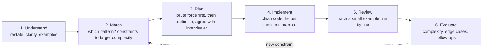

# Problem-solving approach & complexity analysis

!!! abstract "At a glance"
    **Priority:** P0 · **Complexity:** 1/5 · **Est. time:** 2 h · **Phase:** 0 · **Prereqs:** none (start here), then [Python idioms](python-idioms.md)
    **You're done when:** you can run the 6-step interview loop on an unseen Medium within 35 minutes, and state time/space complexity (including amortised and recursion-stack space) without hesitating.

## Why it matters

After 15 years you have plenty of engineering judgement. What has rusted is the **interview protocol**: a 45-minute window, a shared editor, no IDE, thinking out loud, and a grader filling in a rubric. FAANG-tier and Staff coding rounds score four things, roughly equally:

1. **Problem solving**: clarifying, choosing an approach, justifying it.
2. **Coding**: correct, idiomatic, readable code at speed.
3. **Verification**: tracing, edge cases, catching your own bugs.
4. **Communication**: the interviewer can follow your reasoning the whole time.

At Staff level there is a fifth, unwritten one: **judgement about trade-offs and follow-ups**. Examples: "what if this doesn't fit in memory?", "what if it's a stream?", "what if 1,000 threads call it?". Complexity analysis is the shared language for all of it. You cannot compare two approaches without it, and interviewers use it to test whether you really understand your own code.

## Core concepts

### The 6-step interview loop (UMPIRE-style)



| Step | Time budget (45-min round) | What good looks like |
|---|---|---|
| Understand | 3–5 min | Restate the problem. Ask about input size, value ranges, duplicates, sortedness, empty input, and output format. Write 1–2 examples, including one edge case. |
| Match | 2–3 min | "n ≤ 10^5, so I need O(n log n) or better. Contiguous subarray plus a monotone condition points to a sliding window." |
| Plan | 3–5 min | State the brute force and its cost in one sentence, then the optimisation. Get a nod **before** coding. |
| Implement | 15–20 min | Meaningful names, small helpers, and no silent pauses longer than about 30 s. |
| Review | 5 min | Trace your own example through the actual code, not the idea. Fix bugs calmly. |
| Evaluate | 3–5 min | Big-O for time and space, then proactively offer follow-ups (scale, stream, concurrency). |

### Constraints → target complexity (the most useful table in interviews)

Assume roughly 10^8 simple operations per second in C++. Budget about 10^7 per second for Python in your head.

| Input size n | Acceptable complexity | Typical techniques |
|---|---|---|
| n ≤ 10–12 | O(n!), O(n · 2^n) | Permutations, backtracking, bitmask brute force |
| n ≤ 20–25 | O(2^n), O(2^(n/2)) | Subsets, bitmask DP, meet-in-the-middle |
| n ≤ 100–500 | O(n^3) | Floyd-Warshall, interval DP |
| n ≤ 10^3–5·10^3 | O(n^2) | 2-D DP, all pairs |
| n ≤ 10^5–10^6 | O(n log n) or O(n) | Sorting, heap, binary search, two pointers, hashing |
| n ≤ 10^9+ | O(log n) or O(1) | Binary search on answer, math |

### Complexity analysis: what seniors get wrong

- **Amortised vs worst case.** Appending to a Python `list` is amortised O(1) (occasional O(n) resize). Popping from a monotonic stack is O(n) *total* across the loop, even though a single step can pop many elements. Say "each element is pushed and popped at most once, so O(n) overall."
- **Recursion stack space counts.** DFS on a skewed tree uses O(h) = O(n) stack. Python's default recursion limit is 1000, so mention `sys.setrecursionlimit` or an iterative version.
- **Output size.** Generating all subsets is Ω(n · 2^n) because the output alone is that big. Say so; it justifies the brute force.
- **Hidden costs in Python.** `s[i:j]` copies (O(j-i)). `x in list` is O(n). `list.pop(0)` is O(n), so use `deque`. `str +=` in a loop can go quadratic, so use `"".join`. `sorted()` is O(n log n) (Timsort, O(n) on already-sorted runs).
- **Hash operations** are expected O(1), worst case O(n) under adversarial collisions. Mention it when the interviewer asks about adversarial input or DoS.
- **Two-variable complexity.** Use O(V + E) for graphs and O(m · n) for grids and two strings. Don't collapse to O(n^2) without saying what n is.
- **Master theorem (quick form).** T(n) = a·T(n/b) + O(n^d). If d > log_b a, the cost is O(n^d). If d = log_b a, it is O(n^d log n). Otherwise it is O(n^(log_b a)). So merge sort is a=2, b=2, d=1, giving O(n log n).

### Recognising the pattern from the problem statement

| Signal in the statement | First pattern to try |
|---|---|
| "sorted array", "find pair/triplet" | Two pointers, binary search |
| "contiguous subarray/substring", "longest/shortest with condition" | Sliding window, prefix sums |
| "next greater/smaller", "span", "histogram" | Monotonic stack |
| "minimise the maximum", "smallest capacity such that" | Binary search on answer |
| "top k", "k-th largest", "median of stream" | Heap |
| "all combinations/permutations/subsets" | Backtracking |
| "grid", "islands", "connected", "dependencies" | BFS/DFS, topological sort, union-find |
| "shortest path" (unweighted / weighted / negative) | BFS / Dijkstra / Bellman-Ford |
| "number of ways", "min cost", "can you reach" with overlapping choices | DP |
| "intervals", "meetings", "overlap" | Sort by start/end + sweep or heap |
| "prefix", "dictionary of words", "autocomplete" | Trie |

### When you're stuck (in the room)

1. Solve it by hand on a small example and notice what *you* did.
2. Brute force it out loud, then find the repeated work. That is where hashing, a sliding window or DP comes in.
3. Simplify: solve for k=1, sorted input, or no duplicates, then generalise.
4. Ask "what data structure would make the slow step O(1) or O(log n)?"
5. Think backwards from the output: what would you need to know at index i?

### Senior-level nuance

- **Brute force first is not weakness.** It anchors correctness, gives a baseline, and often reveals the optimisation. Spend at most 60 seconds on it.
- **Time-box perfectionism.** A working O(n log n) solution beats an unfinished O(n) one. Offer the O(n) solution as a follow-up.
- **Narrate decisions, not keystrokes.** Say "I'm using a deque because I pop from both ends", not "now I'm typing a for loop".
- **Test like a production engineer.** Cover empty input, a single element, all duplicates, negative numbers, overflow (for Java; Python ints are unbounded), and the maximum n for performance.

## Resources

| Resource | Type | Why this one | Level | Cost |
|---|---|---|---|---|
| [Tech Interview Handbook: coding interview techniques](https://www.techinterviewhandbook.org/coding-interview-techniques/) | article | Clear, practical, step-by-step behaviour in the room | intermediate | free |
| [Tech Interview Handbook: coding interview cheatsheet](https://www.techinterviewhandbook.org/coding-interview-cheatsheet/) | article | Before, during and after checklist; print it | intermediate | free |
| [Big-O Cheat Sheet](https://www.bigocheatsheet.com/) | docs | One-page complexities for data structures and sorts | intermediate | free |
| [Python TimeComplexity wiki](https://wiki.python.org/moin/TimeComplexity) | docs | Real costs of list, dict, set and deque operations in CPython | intermediate | free |
| [Jeff Erickson, *Algorithms*, ch. 1: Recursion](https://jeffe.cs.illinois.edu/teaching/algorithms/book/01-recursion.pdf) :gem: | book | The best free explanation of recurrences and the "recursion fairy" | advanced | free |
| [Master theorem (Wikipedia)](https://en.wikipedia.org/wiki/Master_theorem_(analysis_of_algorithms)) | article | Quick reference for divide-and-conquer recurrences | intermediate | free |
| [Beyond Cracking the Coding Interview](https://www.beyondctci.com/) | book | 2025 update from the CTCI team; strong on the problem-solving "boosters" when stuck | intermediate | paid |
| [interviewing.io: hiring process guides](https://interviewing.io/guides/hiring-process) :gem: | article | Data-backed look at how FAANG coding rounds are actually scored | intermediate | free |

## Hands-on lab

**Goal:** calibrate your interview loop before Week 1 (60–90 min).

1. Set a 35-minute timer. Solve [Two Sum](https://leetcode.com/problems/two-sum/) and [Product of Array Except Self](https://leetcode.com/problems/product-of-array-except-self/) **out loud**, recording audio or screen.
2. For each, write in a comment block at the top: clarifying questions, brute force with complexity, optimised approach with complexity, and edge cases.
3. Play back the recording. Score yourself 1–4 on each rubric axis (problem solving, coding, verification, communication). Note every silence longer than 30 s.
4. Fill in this table for 10 snippets you write or recall: a nested loop with break, `while lo < hi` binary search, recursion `f(n-1) + f(n-2)` without and with memo, BFS on a grid, heap push/pop in a loop, sorting then scanning, and string concatenation in a loop.

| Snippet | Time | Space | Why |
|---|---|---|---|

**Expected output:** a one-page personal "interview protocol" (your version of the 6-step loop with personal failure modes). Pin it next to the [problem tracker](problem-tracker.md).

## Questions

### L1 — Recall

??? question "Q1. What is the difference between amortised O(1) and average-case O(1)?"
    ??? success "Answer"
        **Amortised** is a worst-case guarantee over a *sequence* of operations. For example, n appends to a dynamic array cost O(n) total even though one append can cost O(n). No probability is involved.
        **Average-case** is an expectation over a *distribution* of inputs or random choices. Example: hash-table lookup is O(1) expected under a good hash function, but can degrade to O(n) for adversarial keys.

??? question "Q2. Why does recursion depth matter in Python specifically?"
    ??? success "Answer"
        CPython has a default recursion limit of about 1000 frames (`sys.getrecursionlimit()`). Each frame is also heavyweight. DFS on a 10^5-node linked list or skewed tree raises `RecursionError`. Options: `sys.setrecursionlimit(10**6)` (risky, because the C stack can still overflow), an iterative version with an explicit stack, or BFS. Always count recursion depth as O(h) space.

??? question "Q3. State the target complexity for n = 10^5 and why."
    ??? success "Answer"
        O(n log n) or better. n^2 = 10^10 operations is far too slow (minutes or more). n log n ≈ 1.7·10^6, which is fine even in Python. Sorting, heaps, binary search, hashing and linear scans all qualify.

### L2 — Apply

??? question "Q4. What is the time complexity of this code, and how would you fix it?"
    ```python
    def f(words):
        out = ""
        for w in words:
            if w not in seen_list:
                out += w
                seen_list.append(w)
        return out
    ```
    ??? success "Answer"
        `w not in seen_list` is O(n) per word, so O(n^2) total. `out += w` may also copy repeatedly (CPython sometimes optimises in place, but don't rely on it). Fix: use a `set` for membership and `"".join(parts)`, which gives O(total characters).
        ```python
        def f(words):
            seen, parts = set(), []
            for w in words:
                if w not in seen:
                    seen.add(w)
                    parts.append(w)
            return "".join(parts)
        ```

??? question "Q5. Derive the complexity of naive recursive Fibonacci and the memoised version."
    ??? success "Answer"
        Naive: T(n) = T(n-1) + T(n-2) + O(1), which is O(φ^n) ≈ O(1.618^n). The call tree roughly doubles each level.
        Memoised: each of the n subproblems is computed once in O(1), so O(n) time and O(n) space (memo plus recursion stack). Bottom-up with two variables gives O(1) space.

??? question "Q6. For a monotonic stack loop with a nested `while`, why is it O(n) and not O(n^2)?"
    ??? success "Answer"
        Use aggregate analysis. Each index is pushed exactly once and popped at most once, so the total number of inner-loop iterations over the whole run is at most n. Outer loop n plus inner pops ≤ n gives O(n). Say this sentence explicitly in interviews.

### L3 — Design & trade-offs

??? question "Q7. You have an O(n log n) solution working with 15 minutes left. The interviewer hints an O(n) one exists. What do you do?"
    ??? success "Answer"
        Keep the working solution (don't delete it). Test it first, because correctness beats optimality in the rubric. Then describe the O(n) idea verbally (for example, bucket sort instead of a heap for top-k), including why it works and its trade-offs (more memory, value-range assumptions). If you can code it in under about 8 minutes, do so as a separate function. Otherwise walk through the pseudocode. Interviewers care that you see the idea and can reason about when it is worth it.

??? question "Q8. Hash map vs sorting for 'find duplicates' on 10^8 64-bit ids. Choose."
    ??? success "Answer"
        A hash set is O(n) expected time but needs roughly 10^8 × (8 bytes + Python object overhead): GBs in Python and about 1.6 GB even in a compact C++ set. Sorting in place is O(n log n) time with O(1) extra memory (heap sort) or O(n) (Timsort), and duplicates end up adjacent. With tight memory, sort (or use external sort / numpy). With abundant memory and a need for streaming, use the hash set, or a Bloom filter for approximate first-pass filtering. Mention that the constraint (memory) decides, not Big-O alone.

??? question "Q9. When is a worse Big-O algorithm the right choice?"
    ??? success "Answer"
        - Small n: insertion sort beats merge sort for n < ~32 (Timsort uses it internally).
        - Constant factors and cache locality: arrays often beat linked structures.
        - Simplicity and maintainability: O(n log n) sorting over a fragile O(n) trick.
        - Worst-case guarantees: a balanced BST's O(log n) worst case over a hash map's O(n) worst case under adversarial input.
        - Memory limits, as in Q8.

### L4 — Staff-level ambiguity

??? question "Q10. The interviewer says 'now assume the input doesn't fit in memory'. Walk through how your in-memory solution changes."
    ??? success "Answer"
        Reframe around I/O as the cost model. For sort-based solutions, use external merge sort (chunk, sort, k-way merge with a heap). For hash-based solutions, partition by hash(key) mod P into P files so each partition fits in memory, then solve per partition (the MapReduce shuffle). For top-k, keep a size-k heap per partition and merge. For counting, use Count-Min Sketch or HyperLogLog if approximate is OK. State the new complexity in passes over the data (for example, 2 passes, O(n/B) block I/Os) and the failure modes (skewed keys give a hot partition, so salt the keys).

??? question "Q11. How would you coach a strong senior engineer who keeps failing coding rounds despite 'knowing' the algorithms?"
    ??? success "Answer"
        Diagnose with recorded mocks against the four-axis rubric. The usual culprits are:
        1. Coding before agreeing an approach.
        2. Silent thinking.
        3. Not tracing code.
        4. Over-engineering (classes and abstractions nobody asked for).
        Prescription: time-boxed practice (25–35 min, then read the solution), weekly mocks with a peer, a checklist taped to the monitor, and deliberate spaced re-solves of failed problems. Pattern recognition is trained by *volume with reflection*, not by reading solutions.

## Real-world use cases

- **Capacity planning:** "O(n^2) over 50k shipments per voyage" is 2.5·10^9 comparisons, so batch reconciliation misses its SLA. Sorting plus a sweep fixes it. This is the same reasoning as the constraints table.
- **API design:** paginating with an offset is O(offset) per page in many databases. Keyset/cursor pagination is O(log n) through an index.
- **Log processing:** top-k error codes per minute across 10^9 lines uses a heap of size k per shard, then a merge (external top-k).
- **Code review:** spotting `list.pop(0)` in a queue consumer or `in list` inside a loop, both classic hidden-quadratic bugs in production Python.

## Pitfalls & anti-patterns

- Coding immediately after reading the prompt.
- Quoting O(n) for code with a hidden `in list` or slicing inside the loop.
- Forgetting recursion stack space, or the output size.
- Going silent for minutes. The interviewer can't give hints to a black box.
- Optimising a solution that doesn't work yet.
- Reading the solution after 5 minutes (no learning) or after 2 hours (wasted time). Time-box at 25–35 minutes.

## Checklist

- [ ] I can recite the 6-step loop and the constraints-to-complexity table without notes
- [ ] I recorded two mock solves and scored myself on the four-axis rubric
- [ ] I can explain amortised analysis with the monotonic stack example
- [ ] I answered all L3 questions out loud in < 3 min each
