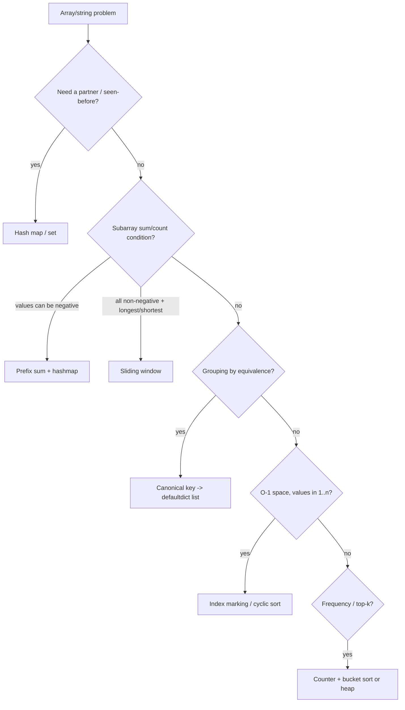

# Arrays & hashing

!!! abstract "At a glance"
    **Priority:** P0 · **Complexity:** 1/5 · **Est. time:** 4 h · **Phase:** 1 · **Prereqs:** [Python idioms](python-idioms.md)
    **You're done when:** you solve every NC150 problem below in ≤ 20 min each, and can explain prefix-sum + hashmap counting (LC 560) and O(n) consecutive-sequence (LC 128) from scratch.

## Why it matters

Hashing is the most common optimisation in interviews: it turns an O(n^2) "search for a partner" into O(n) "look it up". Almost every other pattern (sliding window, graphs, DP memo) leans on a hash map. At Staff level, follow-ups pivot to hashing's real-world properties: memory overhead, adversarial collisions, distributed partitioning (consistent hashing), and approximate structures (Bloom filters, Count-Min Sketch).

## Core concepts

### Pattern recognition signals

| When you see… | Think… |
|---|---|
| "find a pair/complement that sums to X" (unsorted) | Hash map of value → index (Two Sum) |
| "have we seen this before", "duplicates" | Set |
| "group items that are equivalent" | Canonical key → list (sorted string, count tuple) |
| "count subarrays with sum/xor = k" | Prefix sum + hash map of prefix counts |
| "frequency", "top k frequent", "majority" | Counter, bucket sort, Boyer-Moore |
| "O(1) extra space" + values in range [1, n] | Use the array itself as a hash (index marking / cyclic sort) |
| "product/sum of everything except i" | Prefix and suffix passes |

### Template 1: complement lookup (O(n) time, O(n) space)

```python
def two_sum(nums, target):
    seen = {}                       # value -> index
    for i, x in enumerate(nums):
        if target - x in seen:      # look up BEFORE inserting (handles x + x)
            return [seen[target - x], i]
        seen[x] = i
    return []
```

### Template 2: prefix sum + counts (O(n) time, O(n) space)

```python
from collections import defaultdict

def subarray_sum_equals_k(nums, k):
    count = defaultdict(int)
    count[0] = 1                    # empty prefix: subarray starting at index 0
    prefix = ans = 0
    for x in nums:
        prefix += x
        ans += count[prefix - k]    # earlier prefixes p with prefix - p == k
        count[prefix] += 1
    return ans
```

Works with negatives, which is why this, not a sliding window, is the tool when values can be negative.

### Template 3: canonical key grouping

```python
from collections import defaultdict
def group_by_key(items, key_fn):
    groups = defaultdict(list)
    for it in items:
        groups[key_fn(it)].append(it)
    return list(groups.values())
# anagram key: tuple of 26 counts -> O(K) instead of sorted() O(K log K)
```

### Template 4: array as hash (O(1) extra space)

```python
def first_missing_positive(nums):
    n = len(nums)
    for i in range(n):
        # place v at index v-1 while in range and not already there
        while 1 <= nums[i] <= n and nums[nums[i] - 1] != nums[i]:
            j = nums[i] - 1
            nums[i], nums[j] = nums[j], nums[i]
    for i, v in enumerate(nums):
        if v != i + 1:
            return i + 1
    return n + 1
```

Each swap places one value permanently, so the total is O(n) despite the nested loop.

### Variations & decision flow



| Variation | Example | Twist |
|---|---|---|
| Frequency buckets | Top K Frequent (347) | Bucket index = frequency, giving O(n) |
| Boyer-Moore voting | Majority Element (169, 229) | O(1) space; verify the candidate if a majority isn't guaranteed |
| Prefix/suffix products | Product Except Self (238) | Output array doubles as the prefix store, giving O(1) extra |
| Set "start of run" | Longest Consecutive (128) | Only expand from x where x-1 is absent |
| Encoding framing | Encode/Decode Strings (271) | Length-prefix is robust to any character |

### Common bugs

- Inserting into the map *before* the lookup in Two Sum pairs an element with itself.
- Forgetting `count[0] = 1` in prefix-sum counting.
- Using `sorted(s)` as a key without `"".join` or `tuple` (lists are unhashable).
- In 128, looping `while x+1 in s` from every x gives O(n^2). Start only at run heads.
- Delimiter-based encoding breaks when the delimiter appears in the data.

### Senior-level nuance

- **Hash map memory in Python** is about 50–100+ bytes per entry once object overhead is included. For 10^8 keys, switch to sorting, numpy, or probabilistic structures.
- **Collision attacks:** CPython randomises `str`/`bytes` hashing (`PYTHONHASHSEED`) against hash-flooding DoS. `int` hashes are not randomised.
- **Distributed version:** Two Sum over a sharded dataset means partitioning by `x` and `target - x` so partners land on the same shard. That is the shuffle in MapReduce joins.

## Resources

| Resource | Type | Why this one | Level | Cost |
|---|---|---|---|---|
| [NeetCode roadmap: Arrays & Hashing](https://neetcode.io/roadmap) | course/video | Short, clear video per problem in exactly this order | intermediate | freemium |
| [Tech Interview Handbook: Array](https://www.techinterviewhandbook.org/algorithms/array/) | article | Edge cases and techniques checklist | intermediate | free |
| [Tech Interview Handbook: Hash table](https://www.techinterviewhandbook.org/algorithms/hash-table/) | article | Concise corner cases and recommended problems | intermediate | free |
| [VisuAlgo: Hash table](https://visualgo.net/en/hashtable) :gem: | interactive | Watch linear probing vs chaining and resizing happen | intermediate | free |
| [Python collections docs](https://docs.python.org/3/library/collections.html) | docs | Counter/defaultdict semantics | intermediate | free |
| [Sean Prashad's LeetCode Patterns](https://seanprashad.com/leetcode-patterns/) :gem: | interactive | Filter problems by pattern and company to extend practice | intermediate | free |
| [Coding Interview Patterns (Xu & Gunawardane, ByteByteGo)](https://bytebytego.com/courses/coding-patterns) | book/course | Visual, pattern-first explanations; hashing and prefix-sum chapters | intermediate | paid |

## Hands-on lab

Problem set (NeetCode-250 order). Time-box each at 25–35 min, log it in the [problem tracker](problem-tracker.md), and re-solve on day 1, 3, 7 and 21.

| # | LC | Problem | Difficulty | Set | Key insight |
|---|---|---|---|---|---|
| 1 | 217 | [Contains Duplicate](https://leetcode.com/problems/contains-duplicate/) | Easy | NC150 | Set membership: first repeat wins, O(n) time/space. |
| 2 | 242 | [Valid Anagram](https://leetcode.com/problems/valid-anagram/) | Easy | NC150 | Equal frequency maps (Counter or 26-int array). |
| 3 | 1 | [Two Sum](https://leetcode.com/problems/two-sum/) | Easy | NC150 | Store value->index; look up target - x before inserting x. |
| 4 | 1929 | [Concatenation of Array](https://leetcode.com/problems/concatenation-of-array/) | Easy | NC250+ | Warm-up: index arithmetic i and i+n. |
| 5 | 14 | [Longest Common Prefix](https://leetcode.com/problems/longest-common-prefix/) | Easy | NC250+ | Vertical scan, or compare only min and max after sorting. |
| 6 | 169 | [Majority Element](https://leetcode.com/problems/majority-element/) | Easy | NC250+ | Boyer-Moore vote: O(1) space. |
| 7 | 706 | [Design HashMap](https://leetcode.com/problems/design-hashmap/) | Easy | NC250+ | Buckets + chaining; discuss load factor and resize. |
| 8 | 49 | [Group Anagrams](https://leetcode.com/problems/group-anagrams/) | Medium | NC150 | Canonical key: sorted string or 26-count tuple. |
| 9 | 347 | [Top K Frequent Elements](https://leetcode.com/problems/top-k-frequent-elements/) | Medium | NC150 | Bucket sort by frequency gives O(n); heap gives O(n log k). |
| 10 | 271 | [Encode and Decode Strings](https://leetcode.com/problems/encode-and-decode-strings/) | Medium | NC150 | Length-prefix framing ('4#abcd') beats delimiters. (Premium; free on NeetCode) |
| 11 | 238 | [Product of Array Except Self](https://leetcode.com/problems/product-of-array-except-self/) | Medium | NC150 | Prefix product pass, then suffix product pass; no division. |
| 12 | 36 | [Valid Sudoku](https://leetcode.com/problems/valid-sudoku/) | Medium | NC150 | Three set families; box id = (r//3, c//3). |
| 13 | 128 | [Longest Consecutive Sequence](https://leetcode.com/problems/longest-consecutive-sequence/) | Medium | NC150 | Only start counting at x where x-1 not in set -> O(n). |
| 14 | 560 | [Subarray Sum Equals K](https://leetcode.com/problems/subarray-sum-equals-k/) | Medium | NC250+ | Prefix-sum counts: add count[prefix-k]; seed {0:1}. |
| 15 | 75 | [Sort Colors](https://leetcode.com/problems/sort-colors/) | Medium | NC250+ | Dutch national flag: three pointers, one pass. |
| 16 | 912 | [Sort an Array](https://leetcode.com/problems/sort-an-array/) | Medium | NC250+ | Implement merge sort / heap sort; know stability trade-offs. |
| 17 | 229 | [Majority Element II](https://leetcode.com/problems/majority-element-ii/) | Medium | NC250+ | Generalised Boyer-Moore: at most 2 candidates for > n/3. |
| 18 | 41 | [First Missing Positive](https://leetcode.com/problems/first-missing-positive/) | Hard | NC250+ | Array as hash: cyclic-place value v at index v-1. |

**Stretch exercise (30 min):** implement `MyHashMap` (706) with separate chaining **and** resizing at load factor 0.75. Then benchmark 10^6 random inserts against `dict` and write down the constant-factor gap.

## Questions

### L1 — Recall

??? question "Q1. Why does LC 560 need prefix sums + hashmap rather than a sliding window?"
    ??? success "Answer"
        Sliding window relies on monotonicity: extending the window increases the sum, shrinking decreases it. With negative numbers that breaks, so you can't decide when to shrink. Prefix sums turn the subarray sum into `P[j] - P[i] = k`, a complement lookup, which is order-independent.

??? question "Q2. What makes LC 128 O(n) even though there is a nested while loop?"
    ??? success "Answer"
        You only enter the inner loop when `x-1` is not in the set (x starts a run). Each element is visited by the inner loop exactly once across all runs, so O(n) total.

??? question "Q3. Explain Boyer-Moore majority vote."
    ??? success "Answer"
        Keep a candidate and a counter. The counter increments on a match and decrements on a mismatch. When it hits 0, take the next element as the candidate. Pairing off different elements never eliminates a true majority (> n/2). If a majority isn't guaranteed, do a second verification pass. For > n/3, keep 2 candidates.

### L2 — Apply

??? question "Q4. Implement Top K Frequent in O(n)."
    ??? success "Answer"
        ```python
        from collections import Counter
        def top_k_frequent(nums, k):
            cnt = Counter(nums)
            buckets = [[] for _ in range(len(nums) + 1)]
            for v, f in cnt.items():
                buckets[f].append(v)
            out = []
            for f in range(len(buckets) - 1, 0, -1):
                for v in buckets[f]:
                    out.append(v)
                    if len(out) == k:
                        return out
            return out
        ```
        O(n) time and space. Frequency is bounded by n, so the buckets index it directly.

??? question "Q5. Trace Product of Array Except Self on [1,2,3,4] with O(1) extra space."
    ??? success "Answer"
        First pass (prefix): `out = [1, 1, 2, 6]`. Second pass from the right with `suffix`:
        i=3: out[3]=6·1=6, suffix=4. i=2: out[2]=2·4=8, suffix=12. i=1: out[1]=1·12=12, suffix=24. i=0: out[0]=1·24=24.
        Result `[24, 12, 8, 6]`.

??? question "Q6. Design an encoding for a list of arbitrary strings (LC 271)."
    ??? success "Answer"
        ```python
        def encode(strs):
            return "".join(f"{len(s)}#{s}" for s in strs)
        def decode(s):
            out, i = [], 0
            while i < len(s):
                j = s.index("#", i)
                n = int(s[i:j])
                out.append(s[j + 1:j + 1 + n])
                i = j + 1 + n
            return out
        ```
        The length prefix means content is never parsed for delimiters. This is the same framing as HTTP `Content-Length`, Kafka and gRPC.

### L3 — Design & trade-offs

??? question "Q7. Two Sum: hashmap vs sort + two pointers. When do you pick each?"
    ??? success "Answer"
        Hashmap: O(n) time, O(n) space, keeps original indices. Sort + two pointers: O(n log n) time, O(1) extra space if in-place (but you lose indices unless you sort pairs). Pick sort when memory is tight, input is already sorted, or you need all unique pairs / k-sum generalisation (3Sum). Pick hashmap for the single-pass streaming case.

??? question "Q8. Group Anagrams on 10^7 strings of length ≤ 100 with a Unicode alphabet. What changes?"
    ??? success "Answer"
        The 26-count tuple no longer applies. Use `"".join(sorted(s))` (O(K log K)) or a `Counter` frozenset key (heavier). Memory is dominated by the strings themselves. Consider hashing the canonical key to a 64-bit digest (accepting a tiny collision risk, verified per bucket) to shrink the key. At this scale, do it as a MapReduce: map emits (canonical_key, s), shuffle, reduce groups.

??? question "Q9. Contains Duplicate on a 1 TB stream with 100 MB RAM."
    ??? success "Answer"
        Exact: external sort, or hash-partition to disk into P files (each fits in RAM), then set-check per partition. Two passes. Approximate: a Bloom filter sized for the expected distinct count (for example 10^9 items at 1% FPR is about 1.2 GB, too big, so partition first or accept a higher FPR), then verify positives exactly. State the false-positive semantics: a Bloom filter says "maybe seen" or "definitely not seen".

### L4 — Staff-level ambiguity

??? question "Q10. 'Top-k frequent elements' is now a real-time dashboard over 1M events/sec across 50 nodes. Design it."
    ??? success "Answer"
        Per node: a Count-Min Sketch plus a heap of the top-k candidates (or the Space-Saving algorithm, which has deterministic error bounds), windowed per minute. Aggregate: nodes send top-m (m ≫ k, for example 10k) with counts every few seconds, and the aggregator merges them. Error comes from items that are hot globally but not in any node's local top-m, so size m by skew or use mergeable sketches (CMS is mergeable by addition). Exactness trade-off: say so explicitly. Windowing: tumbling vs sliding (ring of per-second sketches). Failure: aggregator restart loses at most one window, and nodes can replay. Kafka + Flink is the off-the-shelf version.

??? question "Q11. The hashmap in a hot service path is using 40 GB of RAM. How do you approach it?"
    ??? success "Answer"
        Measure first: key/value sizes, count and growth. Options in rising cost:
        - Compact representation: ints instead of strings, interned keys, `__slots__`/struct arrays, numpy/Arrow columns.
        - Off-heap stores (RocksDB, mmap'd sorted arrays with binary search).
        - Eviction (LRU/TTL) if it's a cache.
        - Sharding across processes or machines (consistent hashing).
        - Probabilistic structures if exactness isn't required.
        Pair it with an SLO: what latency increase is acceptable for what memory saving. Write the decision up as an ADR.

## Real-world use cases

- **Idempotency keys:** a hash set (Redis `SETNX` with TTL) of request ids dedupes retries in payment and booking APIs.
- **Shipment reconciliation (logistics):** matching bookings to invoices is a hash join on (booking_ref, container_no) instead of O(n·m) nested loops.
- **Anagram-style canonicalisation:** normalising addresses or party names (lower-case, sorted tokens) to group duplicate master-data records.
- **Prefix sums:** running totals for cumulative TEU per voyage, answering "any window hitting capacity k?" in O(1) per query.

## Pitfalls & anti-patterns

- Defaulting to a hashmap when the input is sorted (two pointers is O(1) space).
- Forgetting that hashmaps lose order information you might need.
- Assuming O(1) under adversarial keys, or ignoring memory overhead at scale.
- Mutating a list while iterating over it for dedupe.

## Checklist

- [ ] I can write complement-lookup, prefix-sum-count and canonical-key templates from memory
- [ ] I solved all NC150 problems in this set within the time-box
- [ ] I can explain Boyer-Moore and cyclic sort invariants
- [ ] I answered all L3 questions out loud in < 3 min each
