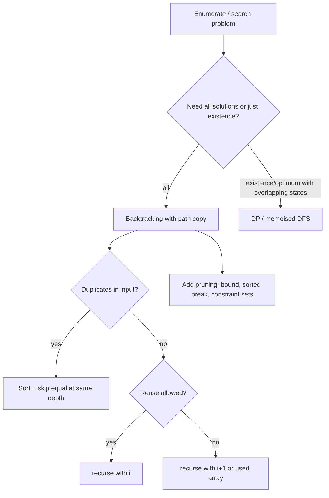

# Backtracking

!!! abstract "At a glance"
    **Priority:** P0 · **Complexity:** 3/5 · **Est. time:** 4 h · **Phase:** 3 · **Prereqs:** [Trees](trees.md), [Stack](stack.md)
    **You're done when:** you can write the choose/explore/un-choose skeleton for subsets, permutations, combinations and grid search from memory, handle duplicates correctly, and state the output-bound complexity.

## Why it matters

Backtracking is systematic search over a decision tree with pruning. It is the tool when the problem asks for **all** solutions or a feasibility answer under constraints (N-Queens, Sudoku, word search, partitions). Its production cousins are constraint solvers, config validators, planners, and rule-engine conflict search. Interview follow-ups ask "how do you prune?" and "when do you switch to DP?"

## Core concepts

### Pattern recognition signals

| When you see… | Think… |
|---|---|
| "all subsets / permutations / combinations" | Include/exclude or loop-over-choices recursion |
| "return all valid …" (parentheses, partitions, IP addresses) | Build a path, prune invalid prefixes early |
| Grid path with no revisits | DFS with in-place visited marking |
| "place N items with constraints" | Constraint sets for O(1) validity checks |
| Small n (≤ 20) and exponential is expected | Backtracking or bitmask DP |
| Only a count/min/max asked, overlapping subproblems | Convert to DP instead |

### Template: choose / explore / un-choose

```python
def backtrack(path, start):
    if is_solution(path):
        res.append(path[:])              # COPY
        return                           # (or continue for prefix-closed problems)
    for i in range(start, len(choices)):
        if not valid(choices[i]):        # prune early
            continue
        path.append(choices[i])          # choose
        backtrack(path, i + 1)           # explore (i for reuse, start for permutations)
        path.pop()                       # un-choose
```

### Templates by problem family

=== "Subsets (include/exclude)"

    ```python
    def subsets(nums):
        res, path = [], []
        def dfs(i):
            if i == len(nums):
                res.append(path[:]); return
            path.append(nums[i]); dfs(i + 1); path.pop()   # include
            dfs(i + 1)                                      # exclude
        dfs(0)
        return res
    ```

=== "Subsets II (duplicates)"

    ```python
    def subsets_with_dup(nums):
        nums.sort()
        res, path = [], []
        def dfs(start):
            res.append(path[:])
            for i in range(start, len(nums)):
                if i > start and nums[i] == nums[i - 1]:
                    continue                    # same-depth duplicate
                path.append(nums[i]); dfs(i + 1); path.pop()
        dfs(0)
        return res
    ```

=== "Permutations"

    ```python
    def permutations(nums):
        res, path, used = [], [], [False] * len(nums)
        def dfs():
            if len(path) == len(nums):
                res.append(path[:]); return
            for i, x in enumerate(nums):
                if used[i]: continue
                used[i] = True; path.append(x)
                dfs()
                path.pop(); used[i] = False
        dfs()
        return res
    ```

=== "Combination Sum"

    ```python
    def combination_sum(cands, target):
        cands.sort()
        res, path = [], []
        def dfs(start, remain):
            if remain == 0:
                res.append(path[:]); return
            for i in range(start, len(cands)):
                if cands[i] > remain:
                    break                       # sorted: prune the rest
                path.append(cands[i])
                dfs(i, remain - cands[i])       # i: reuse allowed
                path.pop()
        dfs(0, target)
        return res
    ```

=== "N-Queens"

    ```python
    def solve_n_queens(n):
        cols, d1, d2 = set(), set(), set()
        board, res = [], []
        def dfs(r):
            if r == n:
                res.append(["." * c + "Q" + "." * (n - c - 1) for c in board]); return
            for c in range(n):
                if c in cols or r - c in d1 or r + c in d2:
                    continue
                cols.add(c); d1.add(r - c); d2.add(r + c); board.append(c)
                dfs(r + 1)
                cols.remove(c); d1.remove(r - c); d2.remove(r + c); board.pop()
        dfs(0)
        return res
    ```

=== "Word Search (grid)"

    ```python
    def exist(board, word):
        R, C = len(board), len(board[0])
        def dfs(r, c, i):
            if i == len(word): return True
            if not (0 <= r < R and 0 <= c < C) or board[r][c] != word[i]:
                return False
            tmp, board[r][c] = board[r][c], "#"
            found = any(dfs(r + dr, c + dc, i + 1)
                        for dr, dc in ((1, 0), (-1, 0), (0, 1), (0, -1)))
            board[r][c] = tmp
            return found
        return any(dfs(r, c, 0) for r in range(R) for c in range(C))
    ```

### Complexity cheat sheet

| Problem | Leaves | Time |
|---|---|---|
| Subsets | 2^n | O(n · 2^n) |
| Permutations | n! | O(n · n!) |
| Combinations C(n, k) | C(n, k) | O(k · C(n, k)) |
| Combination Sum | bounded by target/min | exponential; prune by sorting |
| N-Queens | ~n! pruned | far less in practice |
| Word Search | | O(R·C·3^L) |

The output is often the lower bound, so say "output-sensitive".



### Common bugs

- Appending `path` instead of `path[:]`.
- Duplicate skipping with `nums[i] == nums[i-1]` without `i > start` (skips valid deeper uses).
- Permutations II: the condition `not used[i-1]` versus `used[i-1]` confusion (either works when consistent; explain why).
- Not restoring state on every exit path (visited grid).
- Slicing `remaining = nums[:i] + nums[i+1:]` each call (O(n) per node).

## Resources

| Resource | Type | Why this one | Level | Cost |
|---|---|---|---|---|
| [NeetCode roadmap: Backtracking](https://neetcode.io/roadmap) | video | Decision-tree drawings for each problem | intermediate | freemium |
| [Jeff Erickson, ch. 2: Backtracking](https://jeffe.cs.illinois.edu/teaching/algorithms/book/02-backtracking.pdf) :gem: | book | The best free treatment: recursive structure and pruning | advanced | free |
| [Tech Interview Handbook: Recursion](https://www.techinterviewhandbook.org/algorithms/recursion/) | article | Checklist for recursion and backtracking | intermediate | free |
| [Python itertools docs](https://docs.python.org/3/library/itertools.html) | docs | `permutations`, `combinations`, `product` as reference answers | intermediate | free |
| [labuladong: backtracking framework](https://labuladong.online/algo/en/) :gem: | article | One framework for permutation/combination/subset | intermediate | freemium |
| [VisuAlgo: Recursion tree](https://visualgo.net/en/recursion) | interactive | Visualise call trees | intermediate | free |

## Hands-on lab

| # | LC | Problem | Difficulty | Set | Key insight |
|---|---|---|---|---|---|
| 1 | 1863 | [Sum of All Subset XOR Totals](https://leetcode.com/problems/sum-of-all-subset-xor-totals/) | Easy | NC250+ | Include/exclude recursion warm-up. |
| 2 | 78 | [Subsets](https://leetcode.com/problems/subsets/) | Medium | NC150 | Include/exclude each index; 2^n leaves. |
| 3 | 39 | [Combination Sum](https://leetcode.com/problems/combination-sum/) | Medium | NC150 | Reuse allowed: recurse with same i; prune when sum > target. |
| 4 | 40 | [Combination Sum II](https://leetcode.com/problems/combination-sum-ii/) | Medium | NC150 | Sort; skip a[i]==a[i-1] at same depth (i > start). |
| 5 | 77 | [Combinations](https://leetcode.com/problems/combinations/) | Medium | NC250+ | Choose from start..n; prune when not enough left. |
| 6 | 46 | [Permutations](https://leetcode.com/problems/permutations/) | Medium | NC150 | used[] array or in-place swaps. |
| 7 | 90 | [Subsets II](https://leetcode.com/problems/subsets-ii/) | Medium | NC150 | Sort + same-depth duplicate skip. |
| 8 | 47 | [Permutations II](https://leetcode.com/problems/permutations-ii/) | Medium | NC250+ | Skip if a[i]==a[i-1] and not used[i-1]. |
| 9 | 79 | [Word Search](https://leetcode.com/problems/word-search/) | Medium | NC150 | Grid DFS; mark cell visited in place, restore on return. |
| 10 | 131 | [Palindrome Partitioning](https://leetcode.com/problems/palindrome-partitioning/) | Medium | NC150 | Cut at each palindromic prefix; precompute isPal table. |
| 11 | 17 | [Letter Combinations of a Phone Number](https://leetcode.com/problems/letter-combinations-of-a-phone-number/) | Medium | NC150 | Cartesian product over digit mappings. |
| 12 | 473 | [Matchsticks to Square](https://leetcode.com/problems/matchsticks-to-square/) | Medium | NC250+ | Fill 4 buckets; sort desc; skip equal bucket states. |
| 13 | 698 | [Partition to K Equal Sum Subsets](https://leetcode.com/problems/partition-to-k-equal-sum-subsets/) | Medium | NC250+ | Bucket filling or bitmask DP memo. |
| 14 | 51 | [N-Queens](https://leetcode.com/problems/n-queens/) | Hard | NC150 | Sets for cols, r+c, r-c diagonals. |
| 15 | 52 | [N-Queens II](https://leetcode.com/problems/n-queens-ii/) | Hard | NC250+ | Count only; bitmask version is fastest. |
| 16 | 37 | [Sudoku Solver](https://leetcode.com/problems/sudoku-solver/) | Hard | NC250+ | Pick the cell with fewest candidates (MRV) first. |

**Stretch exercise:** solve Sudoku with MRV (pick the cell with the fewest candidates) and bitmasks. Report the node counts with and without MRV on 5 hard puzzles.

## Questions

### L1 — Recall

??? question "Q1. What are the three steps of the backtracking template?"
    ??? success "Answer"
        Choose (modify the state), explore (recurse), un-choose (restore the state exactly). Solutions are recorded as copies at terminal nodes.

??? question "Q2. Why sort the input in Combination Sum II?"
    ??? success "Answer"
        Sorting places equal values adjacently so you can skip duplicates at the same recursion depth (`i > start and a[i] == a[i-1]`), which avoids duplicate combinations without a set. It also allows breaking early when a candidate exceeds the remaining target.

??? question "Q3. What is the time complexity of generating all permutations?"
    ??? success "Answer"
        Θ(n · n!): n! leaves and O(n) work to copy each. Output size is the lower bound.

### L2 — Apply

??? question "Q4. Implement Palindrome Partitioning with a precomputed palindrome table."
    ??? success "Answer"
        ```python
        def partition(s):
            n = len(s)
            pal = [[False] * n for _ in range(n)]
            for i in range(n - 1, -1, -1):
                for j in range(i, n):
                    pal[i][j] = s[i] == s[j] and (j - i < 2 or pal[i + 1][j - 1])
            res, path = [], []
            def dfs(i):
                if i == n:
                    res.append(path[:]); return
                for j in range(i, n):
                    if pal[i][j]:
                        path.append(s[i:j + 1]); dfs(j + 1); path.pop()
            dfs(0)
            return res
        ```
        The table makes each palindrome check O(1). Worst case O(n · 2^n).

??? question "Q5. Generate Parentheses with pruning."
    ??? success "Answer"
        ```python
        def generate(n):
            res, cur = [], []
            def dfs(o, c):
                if o == c == n:
                    res.append("".join(cur)); return
                if o < n:
                    cur.append("("); dfs(o + 1, c); cur.pop()
                if c < o:
                    cur.append(")"); dfs(o, c + 1); cur.pop()
            dfs(0, 0)
            return res
        ```
        Never generates an invalid prefix, so the work is proportional to the Catalan number C_n.

??? question "Q6. Trace subsets of [1,2] with include/exclude."
    ??? success "Answer"
        dfs(0): include 1, then dfs(1): include 2, dfs(2) records [1,2]; pop 2, exclude, records [1]. Pop 1, exclude 1, dfs(1): include 2 records [2]; exclude records []. Result: [[1,2],[1],[2],[]].

### L3 — Design & trade-offs

??? question "Q7. Backtracking vs DP for Partition to K Equal Sum Subsets?"
    ??? success "Answer"
        Backtracking (fill k buckets, sort descending, skip equal bucket states) is practical for n ≤ ~16 with good pruning. Bitmask DP over subsets, `dp[mask] = current bucket fill`, is O(n · 2^n) with guaranteed bounds and no dependence on pruning luck. Prefer DP when n ≤ 20 and worst-case matters, backtracking when pruning is strong and the code must be short.

??? question "Q8. Which pruning techniques are most valuable and how do you say it in an interview?"
    ??? success "Answer"
        Constraint pruning (reject an invalid prefix early), bound pruning (remaining sum too small/large), symmetry breaking (skip equivalent branches such as equal bucket states, or fixing the first queen's half), ordering heuristics (most constrained variable first, sorted descending), and memoisation when states repeat. State each as an invariant: "if remaining < 0 we can stop because all values are positive."

??? question "Q9. Recursion vs iterative generation (e.g. `itertools`) for combinatorics in production?"
    ??? success "Answer"
        Use `itertools` (C speed, lazy) for standard enumerations. Write custom backtracking when constraints prune the space. Always generate lazily (`yield`) when consumers may stop early, so memory stays O(depth) rather than O(output).

### L4 — Staff-level ambiguity

??? question "Q10. A rule engine must find all conflicting rule combinations among 200 rules. The naive search is 2^200. What do you do?"
    ??? success "Answer"
        Reframe: conflicts are usually pairwise or small-arity, so check pairs and triples (O(n^2), O(n^3)) with indexes on shared attributes, and only backtrack within connected components of a conflict graph. For general constraints use a SAT/SMT solver (Z3, OR-Tools CP-SAT) rather than hand-rolled search, since these have clause learning and heuristics. Provide incremental checks at rule-authoring time (CI). Explain the trade-off: exactness versus authoring latency, and how to report minimal conflicting subsets to users.

??? question "Q11. An interviewer asks for 'all valid schedules' for 12 tasks with dependencies and resource limits. How do you approach and communicate?"
    ??? success "Answer"
        Clarify: all schedules or the best one? If the best, switch to DP / branch-and-bound / CP-SAT. If all, model the tasks as a DAG and enumerate topological orders with backtracking (choose from the zero-in-degree set, decrement, recurse, restore). The count can be factorial, so agree on a cap or lazy generation. Then add resource constraints as prune checks. Mention that the counting version is #P-hard in general, but DP over subsets (bitmask) counts linear extensions in O(2^n · n).

## Real-world use cases

- **Constraint solving:** timetabling, berth/vessel schedule feasibility, Sudoku-like planning.
- **Configuration validation:** find all combinations of feature flags that violate constraints.
- **Regex engines:** backtracking matchers (and the ReDoS risk that comes with them).
- **Test generation:** enumerating input combinations under constraints (pairwise testing tools).

## Pitfalls & anti-patterns

- No pruning, so a 2^n blowup on n=30.
- Mutating shared state without restoring.
- Copying big structures at every node.
- Using backtracking when only a count is asked and DP applies.

## Checklist

- [ ] I can write subsets, permutations, combination sum and N-Queens from memory
- [ ] I can handle duplicates with the same-depth skip rule and explain it
- [ ] I can say when backtracking should become DP
- [ ] I answered all L3 questions out loud in < 3 min each
