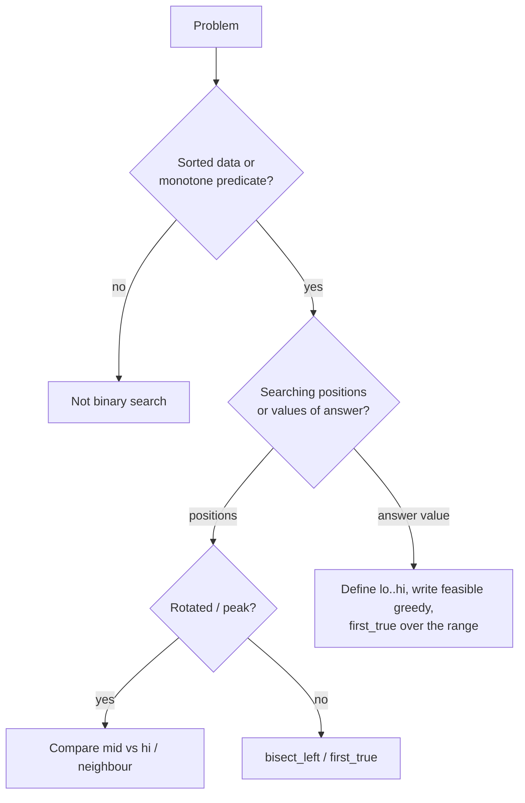

# Binary search (incl. on answer)

!!! abstract "At a glance"
    **Priority:** P0 · **Complexity:** 2/5 · **Est. time:** 3 h · **Phase:** 2 · **Prereqs:** [Two pointers](two-pointers.md)
    **You're done when:** you write one boundary-search template that you never get off-by-one wrong, recognise "binary search on the answer" (Koko, ship capacity, split array) within 2 minutes, and can explain the partition idea in Median of Two Sorted Arrays.

## Why it matters

Binary search is much more than "find x in a sorted array". The powerful form is **searching for the boundary of a monotone predicate**: the first index where `ok(i)` becomes true. That covers lower/upper bounds, rotated arrays, peak finding, and "minimise the maximum" optimisation problems where you search over the *answer space*. In systems it shows up as `git bisect`, B-tree node search, SSTable index lookups, LSM Bloom-then-bisect, capacity planning ("smallest instance count that meets the SLO"), and binary-searching a config value in load tests.

## Core concepts

### Pattern recognition signals

| When you see… | Think… |
|---|---|
| Sorted array/matrix, "find target / insert position / first/last occurrence" | Boundary search (lower_bound) |
| "rotated sorted", "find minimum/peak" | Binary search comparing mid to an endpoint/neighbour |
| "minimum speed/capacity/days such that it's feasible", "minimise the maximum", "maximise the minimum" | **Binary search on answer** + greedy feasibility check |
| n up to 10^9 / answer range huge, O(log) required | Search over the value range |
| Time-versioned lookups "value at time t" | bisect on per-key timestamp list |
| Two sorted arrays, k-th element / median | Partition binary search |

### Template 1: first true (the one template to rule them all)

```python
def first_true(lo, hi, ok):
    """Smallest x in [lo, hi] with ok(x) True, assuming ok is F...F T...T.
    Returns hi + 1 if none. Half-open search on [lo, hi+1)."""
    hi += 1
    while lo < hi:
        mid = (lo + hi) // 2
        if ok(mid):
            hi = mid          # mid might be the answer
        else:
            lo = mid + 1      # answer is strictly right of mid
    return lo
```

- Lower bound of target in `a`: `first_true(0, len(a) - 1, lambda i: a[i] >= target)`.
- Last true of a T…T F…F predicate: `first_true(..., lambda x: not ok(x)) - 1`.
- Python's `bisect_left/right` are this template, so use them for arrays.

### Template 2: binary search on the answer

```python
import math

def min_eating_speed(piles, h):
    def feasible(k):                      # monotone: faster speed never hurts
        return sum(math.ceil(p / k) for p in piles) <= h
    return first_true(1, max(piles), feasible)
```

Complexity: O(n · log(range)). Steps: (1) define the answer space [lo, hi], (2) prove monotonicity of `feasible`, (3) write a greedy O(n) check.

### Template 3: rotated sorted array

```python
def find_min_rotated(a):
    lo, hi = 0, len(a) - 1
    while lo < hi:
        mid = (lo + hi) // 2
        if a[mid] > a[hi]:
            lo = mid + 1      # min is right of mid
        else:
            hi = mid          # mid could be the min
    return a[lo]

def search_rotated(a, t):
    lo, hi = 0, len(a) - 1
    while lo <= hi:
        mid = (lo + hi) // 2
        if a[mid] == t: return mid
        if a[lo] <= a[mid]:                       # left half sorted
            if a[lo] <= t < a[mid]: hi = mid - 1
            else: lo = mid + 1
        else:                                     # right half sorted
            if a[mid] < t <= a[hi]: lo = mid + 1
            else: hi = mid - 1
    return -1
```

### Template 4: median of two sorted arrays, O(log min(m, n))

```python
def find_median_sorted_arrays(a, b):
    if len(a) > len(b):
        a, b = b, a
    m, n = len(a), len(b)
    half = (m + n + 1) // 2
    lo, hi = 0, m
    while lo <= hi:
        i = (lo + hi) // 2            # elements taken from a
        j = half - i                  # elements taken from b
        a_left = a[i - 1] if i > 0 else float('-inf')
        a_right = a[i] if i < m else float('inf')
        b_left = b[j - 1] if j > 0 else float('-inf')
        b_right = b[j] if j < n else float('inf')
        if a_left <= b_right and b_left <= a_right:
            if (m + n) % 2:
                return max(a_left, b_left)
            return (max(a_left, b_left) + min(a_right, b_right)) / 2
        if a_left > b_right:
            hi = i - 1
        else:
            lo = i + 1
```

### Variations & decision flow

| Variant | Predicate / comparison | Examples |
|---|---|---|
| Exact match | `a[mid] == t` | 704 |
| Lower / upper bound | `a[mid] >= t` / `a[mid] > t` | 35, 34 |
| Rotated | compare `a[mid]` with `a[hi]` (or `a[lo]`) | 153, 33, 81 |
| Peak | `a[mid] < a[mid+1]` → go right | 162 |
| On answer, minimise | `feasible(x)` monotone F→T | 875, 1011, 410 |
| On answer, maximise | monotone T→F, find last true | "aggressive cows", magnetic force (1552) |
| Real-valued | loop 100 iterations or `hi - lo > eps` | sqrt with precision |
| Partition | cross-compare boundary elements | 4 |



### Common bugs

- Infinite loop: `lo = mid` with `mid = (lo+hi)//2` when hi = lo+1. Use `mid = (lo+hi+1)//2` for "last true", or stick to the one first_true template.
- Mixing closed `[lo, hi]` and half-open `[lo, hi)` conventions in one function.
- Wrong answer bounds on the answer search (Koko: lo=1 not 0, which would divide by zero. Shipping: lo = max(weights)).
- Integer overflow in `(lo+hi)/2`: not an issue in Python, but mention `lo + (hi-lo)//2` for Java/C++.
- Rotated with duplicates (81): `a[lo] == a[mid] == a[hi]` is ambiguous, so shrink both ends. The worst case is O(n).

## Resources

| Resource | Type | Why this one | Level | Cost |
|---|---|---|---|---|
| [cp-algorithms: Binary search](https://cp-algorithms.com/num_methods/binary_search.html) :gem: | article | Predicate-boundary framing, the cleanest mental model | advanced | free |
| [NeetCode roadmap: Binary Search](https://neetcode.io/roadmap) | video | Clear visuals for 4, 153 and Koko | intermediate | freemium |
| [Python bisect docs](https://docs.python.org/3/library/bisect.html) | docs | `key=` and searching sorted lists recipes | intermediate | free |
| [Tech Interview Handbook: Sorting & searching](https://www.techinterviewhandbook.org/algorithms/sorting-searching/) | article | Corner cases list | intermediate | free |
| [labuladong: binary search framework](https://labuladong.online/algo/en/) :gem: | article | Left/right boundary templates explained side by side | intermediate | freemium |
| [Hello Interview: coding patterns](https://www.hellointerview.com/learn/code) | interactive | Binary search on answer walkthroughs | intermediate | freemium |

## Hands-on lab

| # | LC | Problem | Difficulty | Set | Key insight |
|---|---|---|---|---|---|
| 1 | 704 | [Binary Search](https://leetcode.com/problems/binary-search/) | Easy | NC150 | Canonical closed interval lo <= hi. |
| 2 | 35 | [Search Insert Position](https://leetcode.com/problems/search-insert-position/) | Easy | NC250+ | lower_bound: first index with a[i] >= target. |
| 3 | 374 | [Guess Number Higher or Lower](https://leetcode.com/problems/guess-number-higher-or-lower/) | Easy | NC250+ | Search over an API predicate. |
| 4 | 69 | [Sqrt(x)](https://leetcode.com/problems/sqrtx/) | Easy | NC250+ | Largest m with m*m <= x: binary search on answer. |
| 5 | 74 | [Search a 2D Matrix](https://leetcode.com/problems/search-a-2d-matrix/) | Medium | NC150 | Treat as flattened array: r, c = divmod(mid, cols). |
| 6 | 875 | [Koko Eating Bananas](https://leetcode.com/problems/koko-eating-bananas/) | Medium | NC150 | Search on speed; feasibility is monotonic. |
| 7 | 153 | [Find Minimum in Rotated Sorted Array](https://leetcode.com/problems/find-minimum-in-rotated-sorted-array/) | Medium | NC150 | Compare mid to hi, not lo. |
| 8 | 33 | [Search in Rotated Sorted Array](https://leetcode.com/problems/search-in-rotated-sorted-array/) | Medium | NC150 | One half is always sorted; check if target lies in it. |
| 9 | 981 | [Time Based Key-Value Store](https://leetcode.com/problems/time-based-key-value-store/) | Medium | NC150 | Per-key sorted timestamps; bisect_right - 1. |
| 10 | 34 | [Find First and Last Position of Element in Sorted Array](https://leetcode.com/problems/find-first-and-last-position-of-element-in-sorted-array/) | Medium | NC250+ | Two lower_bound calls: target and target+1. |
| 11 | 162 | [Find Peak Element](https://leetcode.com/problems/find-peak-element/) | Medium | NC250+ | Walk uphill: if a[mid] < a[mid+1], peak is right. |
| 12 | 1011 | [Capacity To Ship Packages Within D Days](https://leetcode.com/problems/capacity-to-ship-packages-within-d-days/) | Medium | NC250+ | Search capacity in [max(w), sum(w)]. |
| 13 | 81 | [Search in Rotated Sorted Array II](https://leetcode.com/problems/search-in-rotated-sorted-array-ii/) | Medium | NC250+ | Duplicates: when lo==mid==hi, shrink both ends (worst O(n)). |
| 14 | 410 | [Split Array Largest Sum](https://leetcode.com/problems/split-array-largest-sum/) | Hard | NC250+ | Minimise the max: binary search + greedy count of parts. |
| 15 | 4 | [Median of Two Sorted Arrays](https://leetcode.com/problems/median-of-two-sorted-arrays/) | Hard | NC150 | Binary search the partition of the shorter array. |

**Stretch exercise:** write a property-based test (hypothesis, or random arrays) that checks your `first_true` against a linear scan for 10,000 random monotone predicates, including empty ranges.

## Questions

### L1 — Recall

??? question "Q1. What exactly must be monotone for binary search to work?"
    ??? success "Answer"
        The predicate over the search space must be of the form F…F T…T (or the reverse). The data doesn't need to be sorted. For example, "is a[mid] < a[mid+1]" is monotone enough for peak finding in the sense that you can always discard one half safely.

??? question "Q2. Why compare with `a[hi]` rather than `a[lo]` in Find Minimum in Rotated Sorted Array?"
    ??? success "Answer"
        `a[mid] > a[hi]` unambiguously means the rotation point (the min) is right of mid. Comparing with `a[lo]` fails for an unrotated array: `a[mid] >= a[lo]` holds but the min is at lo, so you'd need an extra check.

??? question "Q3. What is the complexity of binary search on the answer?"
    ??? success "Answer"
        O(C · log R), where R is the size of the answer range and C is the cost of the feasibility check (usually O(n)). For Koko: O(n log max(piles)).

### L2 — Apply

??? question "Q4. Implement Capacity To Ship Packages Within D Days."
    ??? success "Answer"
        ```python
        def ship_within_days(weights, days):
            def feasible(cap):
                need, cur = 1, 0
                for w in weights:
                    if cur + w > cap:
                        need += 1; cur = 0
                    cur += w
                return need <= days
            lo, hi = max(weights), sum(weights)
            while lo < hi:
                mid = (lo + hi) // 2
                if feasible(mid): hi = mid
                else: lo = mid + 1
            return lo
        ```
        O(n log(sum)).

??? question "Q5. Implement TimeMap (LC 981)."
    ??? success "Answer"
        ```python
        from bisect import bisect_right
        from collections import defaultdict
        class TimeMap:
            def __init__(self):
                self.ts = defaultdict(list); self.vals = defaultdict(list)
            def set(self, key, value, timestamp):
                self.ts[key].append(timestamp); self.vals[key].append(value)  # timestamps increase
            def get(self, key, timestamp):
                i = bisect_right(self.ts[key], timestamp) - 1
                return self.vals[key][i] if i >= 0 else ""
        ```
        set O(1) and get O(log n). This is MVCC-style versioned reads.

??? question "Q6. Find first and last position of target in one reusable helper."
    ??? success "Answer"
        ```python
        from bisect import bisect_left
        def search_range(a, t):
            l = bisect_left(a, t)
            if l == len(a) or a[l] != t:
                return [-1, -1]
            return [l, bisect_left(a, t + 1) - 1]
        ```
        This works for integers. For general keys use `bisect_right(a, t) - 1`.

### L3 — Design & trade-offs

??? question "Q7. Split Array Largest Sum: binary search on answer vs DP. Compare."
    ??? success "Answer"
        DP: `dp[i][k]` = min largest sum splitting the first i elements into k parts, O(k·n^2) time. Binary search: answer in [max, sum]. The feasibility greedy counts the parts needed with cap x, which is monotone. O(n log sum). Binary search is dramatically faster and simpler. DP generalises to non-monotone cost functions.

??? question "Q8. Searching a sorted array that lives on a remote service (each probe = 50 ms RPC). How does that change your approach?"
    ??? success "Answer"
        The cost model becomes probes, not CPU. Options: fetch pages (B-tree-like: each probe returns a block, so the search is log_B n), interpolation search if the values are uniformly distributed (log log n expected), or parallel k-ary search (probe k points concurrently, shrinking the range by k+1 per round). Cache the upper index levels locally. That is exactly why databases use B+trees with large fan-out instead of binary trees.

??? question "Q9. When is interpolation search or exponential search preferable?"
    ??? success "Answer"
        Exponential (galloping) search suits unbounded or very large arrays where the target is near the start. Double the bound, then binary search, for O(log i) where i is the position. It's used in Timsort's galloping mode and in posting-list intersection. Interpolation suits uniformly distributed numeric keys (O(log log n) average) but degrades to O(n) on skewed data. Binary search is the robust default.

### L4 — Staff-level ambiguity

??? question "Q10. 'What's the minimum number of pods to keep p99 < 200 ms at 30k RPS?' Frame this as binary search and discuss the caveats."
    ??? success "Answer"
        Answer space: pods in [1, N_max]. Feasibility: run a load test at n pods and check p99 < 200 ms. Monotone *if* latency decreases with pods, which is usually true but breaks with shared bottlenecks (a database, a lock), where adding pods doesn't help or even hurts (contention). Each probe is expensive (a 10-minute test), so use a coarse exponential search, then binary search. Latency is noisy, so require k repeated runs or statistical confidence. Monotonicity can be violated by autoscaling or cache warm-up. The deliverable is a capacity model (Little's law, USL fit) validated by a few probes, not only the search.

??? question "Q11. Your service stores time-series versions per key in a sorted list and uses bisect for reads. Writes are now out of order. What breaks and what do you change?"
    ??? success "Answer"
        Appending out-of-order timestamps breaks sortedness, so bisect returns wrong versions silently. Options: `insort` (O(n) insert, fine for short lists), a sorted structure (`SortedList`, skip list, B-tree: O(log n)), or buffering with a watermark (accept lateness up to Δ, sort the buffer, then append, as stream processors do). Also define semantics for duplicate timestamps (last-writer-wins by sequence number). Add an invariant check or metric for out-of-order writes. The bigger lesson: document the assumptions a data structure relies on and enforce them at the boundary.

## Real-world use cases

- **`git bisect`:** binary search over commits for the first bad one (a monotone predicate).
- **Databases:** B+tree page search and SSTable sparse-index lookup, then a scan.
- **Versioned configs/prices:** "rate effective at time t" is bisect on effective dates (freight tariffs with validity periods).
- **Capacity planning and tuning:** binary search on thread-pool size or batch size against a throughput SLO.

## Pitfalls & anti-patterns

- Memorising three different templates and mixing them up. Use one boundary template.
- Wrong search range on the answer space.
- Non-monotone feasibility (check it with a quick counterexample).
- Forgetting the O(n) worst case with duplicates in rotated arrays.

## Checklist

- [ ] My `first_true` template passes randomised tests
- [ ] I can spot "binary search on the answer" and write the feasibility check
- [ ] I can explain the median-of-two-arrays partition invariant
- [ ] I answered all L3 questions out loud in < 3 min each
