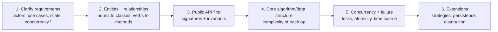
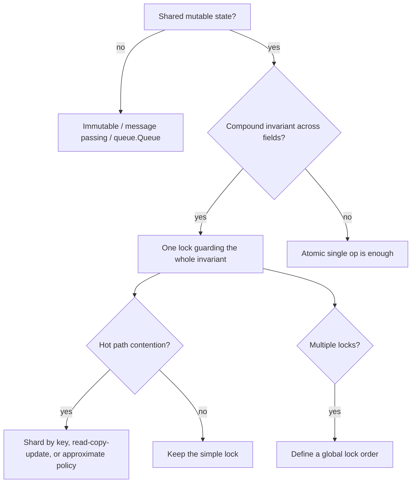

# Concurrency & low-level design problems (LRU, rate limiter, parking lot)

!!! abstract "At a glance"
    **Priority:** P0 · **Complexity:** 3/5 · **Est. time:** 4 h · **Phase:** 6 · **Prereqs:** [Linked list](linked-list.md) (LRU), [Heap](heap.md), [Sliding window](sliding-window.md)
    **You're done when:** you can implement, in Python and in under 30 minutes each, a thread-safe LRU, a token-bucket and sliding-window rate limiter, a bounded blocking queue, an in-memory KV store with TTL, a pub-sub bus, and a parking-lot / elevator model, and explain the lock granularity, deadlock and fairness trade-offs of each.

## Why it matters

Staff-level loops usually include an **LLD/OOD round** ("design a parking lot", "design an LRU cache with TTL") and sometimes a **concurrency follow-up** ("now make it thread-safe", "now 10k QPS"). These rounds test what pure DSA rounds don't: clear APIs, invariants, state machines, extensibility (Strategy/State/Observer), and correctness under concurrent access. Since you already build production systems, the trap is over-engineering. Do the smallest correct design, name the invariants, then extend on request.

## Core concepts

### The LLD interview loop (35-45 min)



| Principle | In practice |
|---|---|
| Requirements first | "Single process or distributed? Reads vs writes? Eviction policy fixed or pluggable?" |
| Keep entities small | One class, one reason to change; avoid inheritance pyramids |
| Strategy for varying behaviour | Eviction policy, pricing, elevator scheduling, rate-limit algorithm |
| State pattern for lifecycles | Elevator (idle/moving/doors), parking ticket (issued/paid/exited) |
| Observer for notifications | Pub-sub, event hooks |
| Inject the clock | `time_fn=time.monotonic` makes TTL and rate-limit tests deterministic |
| Say the invariant | "`len(map) == len(list)` and `size <= capacity` after every public call" |

### Python concurrency facts (as of September 2026)

| Topic | Fact |
|---|---|
| GIL | Standard CPython 3.14 still has the GIL. The **free-threaded build** (3.14t, PEP 779 supported) runs threads in parallel, so compound operations (`check then act`) need real locks in both. |
| Atomicity | Single bytecode-level operations like `list.append` and `dict[key] = v` are atomic in CPython, but `x += 1` and `if k in d: d[k] ...` are **not**. Always lock compound operations. |
| Threading primitives | `Lock`, `RLock`, `Condition`, `Semaphore`, `Event`, `Barrier`, `queue.Queue` (already thread-safe) |
| asyncio | `asyncio.Lock`/`Semaphore`/`Queue` are for coroutines only (not thread-safe). Single-threaded event loops make check-then-act safe *between awaits*. |
| Time | Use `time.monotonic()` for intervals (immune to wall-clock jumps). Use wall time only for absolute timestamps. |

### Problem 1: LRU cache (single-thread, then thread-safe)

Single-thread with `OrderedDict` (the 10-line answer). See [Linked list](linked-list.md) for the explicit DLL version.

```python
from collections import OrderedDict
import threading

class LRUCache:
    """Thread-safe LRU. Invariant: len(self._d) <= capacity after every public call."""
    def __init__(self, capacity: int):
        if capacity <= 0:
            raise ValueError("capacity must be positive")
        self._cap = capacity
        self._d: OrderedDict = OrderedDict()
        self._lock = threading.Lock()
        self.hits = self.misses = self.evictions = 0

    def get(self, key, default=None):
        with self._lock:
            if key in self._d:
                self._d.move_to_end(key)          # most recent at the end
                self.hits += 1
                return self._d[key]
            self.misses += 1
            return default

    def put(self, key, value):
        with self._lock:
            if key in self._d:
                self._d.move_to_end(key)
            self._d[key] = value
            if len(self._d) > self._cap:
                self._d.popitem(last=False)        # evict least recent
                self.evictions += 1
```

Scaling notes: one lock serialises all ops, so shard into N LRUs by `hash(key) % N` (approximate LRU), or use CLOCK to avoid write-on-read. In free-threaded Python, per-shard locks matter more.

### Problem 2: rate limiters (token bucket and sliding window)

```python
import time, threading
from collections import deque

class TokenBucket:
    """Allows bursts up to `capacity`, sustained rate `rate` tokens/sec."""
    def __init__(self, rate: float, capacity: float, time_fn=time.monotonic):
        self.rate, self.capacity, self._time = rate, capacity, time_fn
        self.tokens, self.last = capacity, time_fn()
        self._lock = threading.Lock()

    def allow(self, cost: float = 1.0) -> bool:
        with self._lock:
            now = self._time()
            self.tokens = min(self.capacity, self.tokens + (now - self.last) * self.rate)
            self.last = now
            if self.tokens >= cost:
                self.tokens -= cost
                return True
            return False

class SlidingWindowLog:
    """Exact: at most `limit` requests in any window of `window` seconds. O(limit) memory per key."""
    def __init__(self, limit: int, window: float, time_fn=time.monotonic):
        self.limit, self.window, self._time = limit, window, time_fn
        self.q: deque = deque()
        self._lock = threading.Lock()

    def allow(self) -> bool:
        with self._lock:
            now = self._time()
            while self.q and self.q[0] <= now - self.window:
                self.q.popleft()
            if len(self.q) < self.limit:
                self.q.append(now)
                return True
            return False
```

| Algorithm | Memory | Accuracy | Bursts | Use |
|---|---|---|---|---|
| Fixed window counter | O(1) | boundary double-burst (up to 2x) | yes | Cheap, coarse |
| Sliding window log | O(limit) | exact | no | Small limits, audit |
| Sliding window counter | O(1) | approx (about 1% error) | smooth | Gateways at scale |
| Token bucket | O(1) | exact average rate | up to capacity | APIs (AWS, Stripe style) |
| Leaky bucket | O(1) | smooth output | no | Traffic shaping |

Distributed: Redis Lua script for atomic refill-and-take, keyed per client, clock from Redis `TIME`. See the system-design track's rate limiting page for depth.

### Problem 3: thread-safe bounded blocking queue

```python
import threading
from collections import deque

class BoundedBlockingQueue:
    def __init__(self, capacity: int):
        self._q, self._cap = deque(), capacity
        lock = threading.Lock()
        self._not_full = threading.Condition(lock)     # two Conditions, ONE lock
        self._not_empty = threading.Condition(lock)

    def put(self, item, timeout=None) -> bool:
        with self._not_full:
            if not self._not_full.wait_for(lambda: len(self._q) < self._cap, timeout):
                return False
            self._q.append(item)
            self._not_empty.notify()
            return True

    def get(self, timeout=None):
        with self._not_empty:
            if not self._not_empty.wait_for(lambda: len(self._q) > 0, timeout):
                raise TimeoutError
            item = self._q.popleft()
            self._not_full.notify()
            return item
```

Points to say: `wait_for` re-checks the predicate (guards against spurious wakeups), and both conditions share one lock so state changes are atomic. In production use `queue.Queue(maxsize=n)`. Add close/shutdown semantics and backpressure metrics if asked.

### Problem 4: in-memory KV store with TTL

```python
import heapq, threading, time

class TTLStore:
    """Lazy expiry on read + heap-driven sweeper. Time source injectable for tests."""
    def __init__(self, time_fn=time.monotonic):
        self._d = {}                    # key -> (value, expires_at or None)
        self._heap = []                 # (expires_at, key) entries, may be stale
        self._lock = threading.RLock()
        self._time = time_fn

    def set(self, key, value, ttl=None):
        with self._lock:
            exp = self._time() + ttl if ttl is not None else None
            self._d[key] = (value, exp)
            if exp is not None:
                heapq.heappush(self._heap, (exp, key))

    def get(self, key, default=None):
        with self._lock:
            item = self._d.get(key)
            if item is None:
                return default
            value, exp = item
            if exp is not None and exp <= self._time():
                del self._d[key]                     # lazy expiry
                return default
            return value

    def sweep(self, max_items=1000):
        """Call from a background thread. Amortised O(log n) per expired key."""
        with self._lock:
            now, n = self._time(), 0
            while self._heap and self._heap[0][0] <= now and n < max_items:
                exp, key = heapq.heappop(self._heap)
                item = self._d.get(key)
                if item and item[1] == exp:          # skip stale heap entries
                    del self._d[key]
                n += 1
```

Design points: lazy plus active expiry (as Redis does: lazy on access plus sampled sweeps), stale heap entries after overwrites (lazy deletion), `monotonic` clock, bounded sweep to cap lock hold time. Extension: LRU eviction when full, per-key locks or sharding, persistence (WAL plus snapshots).

### Problem 5: pub-sub (in-process)

```python
import queue, threading
from collections import defaultdict

class PubSub:
    """At-most-once, per-subscriber bounded queue: slow subscribers cannot block publishers."""
    def __init__(self):
        self._subs = defaultdict(list)       # topic -> [Subscriber]
        self._lock = threading.RLock()

    def subscribe(self, topic, handler, max_pending=1000):
        sub = Subscriber(handler, max_pending)
        with self._lock:
            self._subs[topic].append(sub)
        return sub

    def publish(self, topic, msg):
        with self._lock:
            subs = list(self._subs[topic])   # snapshot; do not call handlers under the lock
        for s in subs:
            s.offer(msg)

class Subscriber:
    def __init__(self, handler, max_pending):
        self._q = queue.Queue(maxsize=max_pending)
        self.dropped = 0
        threading.Thread(target=self._run, args=(handler,), daemon=True).start()

    def offer(self, msg):
        try:
            self._q.put_nowait(msg)
        except queue.Full:
            self.dropped += 1                # policy: drop newest; alternatives: drop oldest / block

    def _run(self, handler):
        while True:
            handler(self._q.get())
```

Discuss delivery semantics (at-most/at-least/exactly-once), ordering per topic, back-pressure policy, handler exceptions (isolate), unsubscribe, and replay (a log-based design like Kafka).

### Problem 6: parking lot (OOD)

```python
from dataclasses import dataclass, field
from enum import Enum
import itertools, threading

class SpotSize(Enum):
    MOTORCYCLE = 1
    COMPACT = 2
    LARGE = 3

class VehicleType(Enum):
    MOTORCYCLE = SpotSize.MOTORCYCLE
    CAR = SpotSize.COMPACT
    TRUCK = SpotSize.LARGE

@dataclass
class Ticket:
    id: int
    plate: str
    spot: "Spot"
    entry_time: float

@dataclass
class Spot:
    id: str
    size: SpotSize
    occupied: bool = False

class ParkingLot:
    """Strategy for allocation: smallest fitting spot. Thread-safe via one lock (a spot is a critical resource)."""
    def __init__(self, spots, clock, pricing):
        self._free = {s: [sp for sp in spots if sp.size == s] for s in SpotSize}
        self._active = {}                       # ticket id -> Ticket
        self._ids = itertools.count(1)
        self._lock, self._clock, self._pricing = threading.Lock(), clock, pricing

    def park(self, plate, vtype: VehicleType):
        need = vtype.value
        with self._lock:
            for size in SpotSize:               # smallest fitting first (enum order)
                if size.value >= need.value and self._free[size]:
                    spot = self._free[size].pop()
                    spot.occupied = True
                    t = Ticket(next(self._ids), plate, spot, self._clock())
                    self._active[t.id] = t
                    return t
            return None                          # lot full: caller decides (queue / reject)

    def leave(self, ticket_id):
        with self._lock:
            t = self._active.pop(ticket_id)      # KeyError: unknown/duplicate exit
            t.spot.occupied = False
            self._free[t.spot.size].append(t.spot)
            return self._pricing(t.entry_time, self._clock())
```

Design points: allocation strategy (nearest to entrance means a heap per size), pricing as an injected Strategy, multi-level and multi-entrance, reservation and payment as states on the ticket, capacity display as a read-only view. Concurrency: contention is per lot, so shard by level if needed. Persist tickets so a crash doesn't lose active cars.

### Problem 7: elevator (State + scheduling Strategy)

```python
from enum import Enum
import heapq

class Dir(Enum):
    UP = 1
    DOWN = -1
    IDLE = 0

class Elevator:
    """SCAN (LOOK) algorithm: keep going in the current direction while requests exist ahead, then reverse."""
    def __init__(self, floors):
        self.floor, self.dir = 0, Dir.IDLE
        self.up, self.down = [], []           # min-heap of floors above; max-heap (negated) below

    def request(self, floor):
        if floor > self.floor:
            heapq.heappush(self.up, floor)
        elif floor < self.floor:
            heapq.heappush(self.down, -floor)
        # floor == self.floor: open doors immediately (omitted)

    def step(self):
        if self.dir in (Dir.UP, Dir.IDLE) and self.up:
            self.dir, self.floor = Dir.UP, heapq.heappop(self.up)
        elif self.down:
            self.dir, self.floor = Dir.DOWN, -heapq.heappop(self.down)
        elif self.up:
            self.dir, self.floor = Dir.UP, heapq.heappop(self.up)
        else:
            self.dir = Dir.IDLE
        return self.floor
```

Extensions: multiple elevators with a dispatcher (choose the cost-minimising car: distance, direction match, load), door and overload states, requests as (floor, direction) hall calls versus cabin buttons, priorities (fire mode), and testing with a simulated clock. Say why SCAN beats FCFS (avoids thrash and starvation).

### Classic concurrency hazards (say these by name)

| Hazard | Example | Fix |
|---|---|---|
| Race (check-then-act) | `if k not in d: d[k] = expensive()` | Lock around the compound op, or `setdefault`/atomic primitive |
| Deadlock | Two locks acquired in different orders (Dining Philosophers) | Global lock ordering; timeouts; `try-lock` |
| Lost wakeup / spurious wakeup | `cond.wait()` without a predicate loop | `wait_for(predicate)` |
| Starvation | Writers starved by readers | Fair locks / queueing |
| Lock convoy / contention | One global lock in a hot path | Sharding, lock-free reads, batching |
| Holding a lock while calling out | Invoking user callbacks under a lock | Snapshot under lock, call outside |
| Non-monotonic clocks | TTL using `time.time()` | `time.monotonic()` |



## Resources

| Resource | Type | Why this one | Level | Cost |
|---|---|---|---|---|
| [Python threading docs](https://docs.python.org/3/library/threading.html) | docs | Lock, Condition, Semaphore, Barrier semantics | intermediate | free |
| [Python queue docs](https://docs.python.org/3/library/queue.html) | docs | Thread-safe queues, `task_done`/`join` | intermediate | free |
| [Python asyncio synchronization](https://docs.python.org/3/library/asyncio-sync.html) | docs | Coroutine locks, semaphores, events | intermediate | free |
| [concurrent.futures docs](https://docs.python.org/3/library/concurrent.futures.html) | docs | ThreadPoolExecutor / ProcessPoolExecutor patterns | intermediate | free |
| [Free-threaded Python guide](https://py-free-threading.github.io/) :gem: | docs | What changes without the GIL (3.14t) | advanced | free |
| [Super Fast Python](https://superfastpython.com/) :gem: | article | Practical, well-benchmarked threading/asyncio/multiprocessing recipes | intermediate | freemium |
| [The Little Book of Semaphores (Downey)](https://greenteapress.com/wp/semaphores/) :gem: | book | Classic synchronisation puzzles with solutions | advanced | free |
| [Python Concurrency with asyncio (Fowler)](https://www.manning.com/books/python-concurrency-with-asyncio) | book | Depth on the asyncio model | advanced | paid |
| [awesome-low-level-design](https://github.com/ashishps1/awesome-low-level-design) :gem: | repo | Curated LLD problems with code and diagrams | intermediate | free |
| [Refactoring Guru: Design patterns](https://refactoring.guru/design-patterns) | article | Clear Strategy/State/Observer explanations | intermediate | free |
| [David Beazley](https://www.dabeaz.com/) | article/courses | Deep GIL and concurrency understanding | advanced | free/paid |

## Hands-on lab

**Part A: build (3 h).** Implement the seven components above in `lld/` with pytest and an injectable clock. Required tests:

1. LRU: a 10-thread stress test (100k ops) never exceeds capacity, and hit/miss counters are consistent with a single-threaded oracle for a deterministic key sequence.
2. Token bucket: with a fake clock, verify the burst then the sustained rate exactly. Sliding-window log: verify the boundary case (request at t=0 and t=window).
3. Bounded queue: N producers and M consumers, verify no loss or duplication, and that `put` blocks at capacity. Add a deliberately broken version (`if` instead of `wait_for`) and reproduce a failure.
4. TTL store: expiry with a fake clock, overwrite-then-expire (stale heap entry), sweep bound.
5. Pub-sub: a slow subscriber does not slow the publisher, and drops are counted.
6. Parking lot: a full-lot rejection and the smallest-fit rule. Elevator: request sequence gives the SCAN order.

**Part B: LeetCode concurrency and design set** (time-box 25-35 min each; log in the [tracker](problem-tracker.md)):

| # | LC | Problem | Difficulty | Set | Key insight |
|---|---|---|---|---|---|
| 1 | 1114 | [Print in Order](https://leetcode.com/problems/print-in-order/) | Easy | NC250+ | threading.Event / Barrier ordering. |
| 2 | 359 | [Logger Rate Limiter](https://leetcode.com/problems/logger-rate-limiter/) | Easy | NC250+ | Map msg -> next allowed timestamp. (Premium) |
| 3 | 1115 | [Print FooBar Alternately](https://leetcode.com/problems/print-foobar-alternately/) | Medium | NC250+ | Two semaphores ping-pong. |
| 4 | 1116 | [Print Zero Even Odd](https://leetcode.com/problems/print-zero-even-odd/) | Medium | NC250+ | Three semaphores; zero thread hands off by parity. |
| 5 | 1117 | [Building H2O](https://leetcode.com/problems/building-h2o/) | Medium | NC250+ | Semaphores (2 H, 1 O) + Barrier(3). |
| 6 | 1195 | [Fizz Buzz Multithreaded](https://leetcode.com/problems/fizz-buzz-multithreaded/) | Medium | NC250+ | Condition variable with a shared counter predicate. |
| 7 | 1226 | [The Dining Philosophers](https://leetcode.com/problems/the-dining-philosophers/) | Medium | NC250+ | Global lock order (lower fork first) breaks circular wait. |
| 8 | 1188 | [Design Bounded Blocking Queue](https://leetcode.com/problems/design-bounded-blocking-queue/) | Medium | NC250+ | Lock + two Conditions (not_full, not_empty). (Premium) |
| 9 | 1242 | [Web Crawler Multithreaded](https://leetcode.com/problems/web-crawler-multithreaded/) | Medium | NC250+ | ThreadPoolExecutor + locked visited set. (Premium) |
| 10 | 362 | [Design Hit Counter](https://leetcode.com/problems/design-hit-counter/) | Medium | NC250+ | Circular buffer of 300 (ts, count) slots. (Premium) |
| 11 | 380 | [Insert Delete GetRandom O(1)](https://leetcode.com/problems/insert-delete-getrandom-o1/) | Medium | NC250+ | Array + index map; swap-with-last delete. |
| 12 | 1472 | [Design Browser History](https://leetcode.com/problems/design-browser-history/) | Medium | NC250+ | Array + cursor + logical end. |
| 13 | 146 | [LRU Cache](https://leetcode.com/problems/lru-cache/) | Medium | NC150 | Hash map + DLL; see linked-list page. |
| 14 | 460 | [LFU Cache](https://leetcode.com/problems/lfu-cache/) | Hard | NC250+ | freq -> OrderedDict buckets + minFreq pointer. |

**Expected output:** a repo with passing tests, a one-page note per component listing invariants, lock strategy and the scaling next step.

## Questions

### L1 — Recall

??? question "Q1. Is `dict[key] = value` thread-safe in CPython? Is `d[k] += 1`?"
    ??? success "Answer"
        A single `dict.__setitem__` is atomic in CPython (and in the free-threaded build it is protected by per-object locks). `d[k] += 1` is a read-modify-write across several bytecodes, so it is **not** atomic, and two threads can lose an update. Compound operations need a lock (or `collections.Counter` under a lock, or per-thread counters merged later).

??? question "Q2. Why must `Condition.wait()` be in a loop or use `wait_for(predicate)`?"
    ??? success "Answer"
        Wakeups can be spurious, and another thread may consume the condition between the notify and your reacquiring the lock. The predicate must be rechecked after waking while holding the lock.

??? question "Q3. Token bucket vs leaky bucket vs sliding window: one-line differences?"
    ??? success "Answer"
        Token bucket: allows bursts up to capacity at an average rate. Leaky bucket: smooths output to a constant rate (a queue). Sliding window: strict count over any trailing time window (log = exact, counter = approximate).

### L2 — Apply

??? question "Q4. Make an existing LRU thread-safe with minimal contention. What do you do?"
    ??? success "Answer"
        Start with one lock around `get` and `put` (correct, simple). Measure. If contended, shard: `N` independent LRU instances selected by `hash(key) % N`, each with its own lock. The trade-off is approximate global recency and capacity per shard (`cap/N`). Avoid a `RWLock` because `get` mutates recency order. Other options are CLOCK (a hit sets a bit, with no list move) or buffering recency updates.

??? question "Q5. Implement `Print in Order` (LC 1114) and `Print FooBar Alternately` (LC 1115)."
    ??? success "Answer"
        ```python
        import threading
        class Foo:                                    # 1114
            def __init__(self):
                self.a, self.b = threading.Event(), threading.Event()
            def first(self, f):  f(); self.a.set()
            def second(self, f): self.a.wait(); f(); self.b.set()
            def third(self, f):  self.b.wait(); f()

        class FooBar:                                 # 1115
            def __init__(self, n):
                self.n = n
                self.foo_ok = threading.Semaphore(1)
                self.bar_ok = threading.Semaphore(0)
            def foo(self, f):
                for _ in range(self.n):
                    self.foo_ok.acquire(); f(); self.bar_ok.release()
            def bar(self, f):
                for _ in range(self.n):
                    self.bar_ok.acquire(); f(); self.foo_ok.release()
        ```
        Events are one-shot signals, and semaphores implement ping-pong hand-off.

??? question "Q6. Fix the deadlock: transfer(a, b) locks a then b, while another thread calls transfer(b, a)."
    ??? success "Answer"
        Impose a global order on lock acquisition, for example by account id:
        ```python
        def transfer(a, b, amt):
            first, second = (a, b) if a.id < b.id else (b, a)
            with first.lock:
                with second.lock:
                    a.balance -= amt; b.balance += amt
        ```
        Alternatives: a single global lock (low concurrency), `try_acquire` with timeout and backoff, or a message-passing design with a single owner per account.

### L3 — Design & trade-offs

??? question "Q7. Threads vs asyncio vs multiprocessing for an I/O-heavy rate-limited crawler in Python?"
    ??? success "Answer"
        I/O-bound with thousands of connections: asyncio (low overhead per task, explicit cancellation, `Semaphore` for concurrency limits, a token bucket per host). Threads: simpler with blocking libraries, and a `ThreadPoolExecutor` scales to hundreds. Multiprocessing (or free-threaded 3.14t threads) only when CPU-bound parsing dominates. Mixed: asyncio for fetching plus a process pool for parsing. Bring up politeness (robots.txt, per-host limits), retries with jitter, and backpressure via bounded queues.

??? question "Q8. In-memory TTL cache: lazy expiry only vs active sweeper vs timer per key?"
    ??? success "Answer"
        Lazy only: zero overhead, but expired-and-never-read keys leak memory. Timer per key: precise but expensive at millions of keys (timer wheel mitigates). Heap or timer-wheel sweeper: bounded memory, an O(log n) or O(1) cost per key, and a background thread with a bounded work budget. Redis combines lazy expiry with sampled active expiry. Choose lazy plus a bounded sweeper for most services.

??? question "Q9. Design choice: one lock for the whole KV store vs striped locks vs lock-free structures?"
    ??? success "Answer"
        Single lock: simplest and correct, and fine up to modest QPS in Python (the GIL already serialises bytecode). Striped locks (N shards): near-linear scaling for independent keys, but multi-key operations (transactions, scans, `size`) need to acquire multiple stripes in a global order. Lock-free/CAS structures: complexity and ABA/memory-reclamation issues. In Python, prefer striping or per-key `Lock` maps for free-threaded builds, and measure with a realistic key distribution (hot keys defeat striping).

### L4 — Staff-level ambiguity

??? question "Q10. 'Make this in-process rate limiter work across 50 service instances.' Walk through options and pick."
    ??? success "Answer"
        Options: (1) Central Redis token bucket via a Lua script: exact, one hop of latency (~1 ms), a Redis SPOF/hot-key risk. (2) Local limiters with limit/N per instance: no dependencies, but wrong under skewed traffic. (3) Hybrid: local token leases, where each instance grabs a batch of tokens (say 100) from Redis and spends them locally. That cuts Redis calls by ~100x, with slight over- or under-admission. (4) Sidecar/gateway enforcement (Envoy global rate limit service). Pick (3) or (4) at high QPS, and (1) when exactness matters (billing quotas). Address failure: fail-open vs fail-closed per API class, clock skew, and observability (429 rates, limiter latency). Communicate the SLO-driven decision and the migration plan (shadow mode first, log-only, then enforce).

??? question "Q11. Your LRU cache in a payments service showed a rare stale-read bug under load. How do you investigate and prevent recurrence?"
    ??? success "Answer"
        Reproduce with a stress test plus randomised interleavings (`threading` with forced yields, or a deterministic simulation). Look for check-then-act windows (`get` then `put` by callers, which the cache can't make atomic), invalidation ordering (write-through vs write-behind, a race between DB write and cache set), and clock/TTL issues. Fixes: `get_or_load` with per-key single-flight to stop stampedes, versioned values or compare-and-set, and short TTLs for correctness-critical data. Prevention: an invariant checker in tests, chaos/latency injection, metrics on staleness, and a design-doc rule ("cache is never the source of truth for balances"). Write a blameless postmortem with a regression test.

??? question "Q12. How would you test concurrent code deterministically?"
    ??? success "Answer"
        Inject seams: clock, executor and scheduler. Use barriers/events to force specific interleavings ("thread A pauses after check, thread B runs"), stress tests with many iterations and randomised sleeps, invariants checked after each run, and tools like `pytest-repeat` or hypothesis stateful tests. For asyncio, control the event loop (`asyncio.sleep(0)` yields, or a fake clock). Also run under the free-threaded build in CI to surface latent races the GIL hid.

## Real-world use cases

- **API gateways:** distributed token buckets (per-key quotas), with 429 and `Retry-After`.
- **Caching layers:** application LRU/TTL caches in front of reference-data services (port codes, tariffs), with single-flight loading.
- **Work queues and pipelines:** bounded queues for backpressure between ingest and processing stages.
- **Operational systems:** yard/berth allocation (parking-lot style resource assignment) and lift/crane scheduling (elevator-style SCAN heuristics).
- **Event distribution:** in-process pub-sub as a domain event bus, evolving into Kafka topics.

## Pitfalls & anti-patterns

- Adding locks without stating the invariant they protect.
- Calling user callbacks while holding a lock.
- Using wall-clock time for intervals.
- Building an unbounded queue (memory bomb) instead of a bounded one with a policy.
- Over-engineering with class hierarchies before requirements are clear.
- Reading the GIL as a guarantee of correctness.

## Checklist

- [ ] I built and tested all seven components with an injectable clock
- [ ] I can explain deadlock, lost wakeup and check-then-act races with code
- [ ] I can scale each component (shard, lease, approximate) and name the trade-off
- [ ] I answered all L3 questions out loud in < 3 min each
