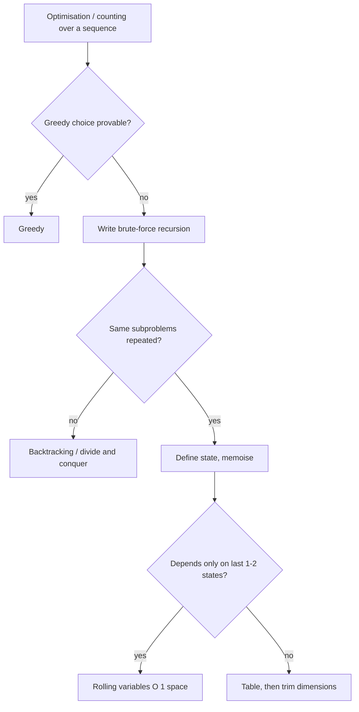

# Dynamic programming 1-D

!!! abstract "At a glance"
    **Priority:** P0 · **Complexity:** 4/5 · **Est. time:** 5 h · **Phase:** 4 · **Prereqs:** [Backtracking](backtracking.md), [Python idioms](python-idioms.md)
    **You're done when:** given a new problem you can (1) define the state in one sentence, (2) write the recurrence, (3) identify base cases and iteration order, (4) optimise space, in under 10 minutes, and can derive coin change, LIS (n log n), house robber and word break unaided.

## Why it matters

DP is the biggest separator in FAANG-tier rounds: recognising overlapping subproblems and defining the right state. 1-D DP (state is one index or one amount) is the entry point, and most Medium DP problems reduce to it. In production, the same thinking gives you optimal batching, segmentation (word break / tokenisation), pricing/knapsack allocation, edit-distance-style diffing, and Viterbi decoding.

## Core concepts

### The 4-step DP method

1. **State:** what minimal information describes a subproblem? Say it as "dp[i] = the best answer for the first i items (or ending at i)".
2. **Transition:** how does dp[i] derive from smaller states? Enumerate the last decision.
3. **Base cases and order:** which states are known, and in which order can you fill them (so dependencies are ready)?
4. **Answer and space:** which state (or max over states) is the answer? Which previous states are still needed (rolling variables)?

Approach in the interview: brute-force recursion, then add memoisation (`@cache`), then bottom-up, then space-optimise.

### Pattern recognition signals

| When you see… | Think… |
|---|---|
| "number of ways", "min/max cost", "is it possible" over a sequence with choices | DP |
| Choose or skip each item, no adjacent | House Robber recurrence: `max(dp[i-1], dp[i-2] + a[i])` |
| Min coins / count of ways to make amount | Unbounded knapsack |
| Subset with a target sum | 0/1 knapsack (iterate sums downward) |
| Longest increasing subsequence | O(n²) DP, then patience sorting O(n log n) |
| Split a string into dictionary words / decode | Prefix DP: `dp[i]` = is prefix i solvable |
| Palindromic substrings | Expand around centre (O(1) space) or interval DP |
| Max product/sum subarray | Kadane with extra state (min and max) |

### Template 1: linear recurrence with rolling variables

```python
def rob(nums):
    prev2 = prev1 = 0                       # dp[i-2], dp[i-1]
    for x in nums:
        prev2, prev1 = prev1, max(prev1, prev2 + x)
    return prev1

def rob_circular(nums):
    if len(nums) == 1: return nums[0]
    return max(rob(nums[1:]), rob(nums[:-1]))   # first or last house excluded
```

### Template 2: unbounded knapsack (Coin Change min coins / ways)

```python
def coin_change(coins, amount):
    INF = amount + 1
    dp = [0] + [INF] * amount
    for a in range(1, amount + 1):
        for c in coins:
            if c <= a:
                dp[a] = min(dp[a], dp[a - c] + 1)
    return dp[amount] if dp[amount] != INF else -1

def coin_ways(coins, amount):               # combinations: coins OUTER
    dp = [1] + [0] * amount
    for c in coins:
        for a in range(c, amount + 1):
            dp[a] += dp[a - c]
    return dp[amount]
```

Loop order matters: coins outside counts **combinations**, amounts outside counts **permutations** (Combination Sum IV).

### Template 3: 0/1 knapsack (Partition Equal Subset Sum)

```python
def can_partition(nums):
    total = sum(nums)
    if total % 2: return False
    target = total // 2
    dp = [True] + [False] * target
    for x in nums:
        for s in range(target, x - 1, -1):  # DOWNWARD: each item used once
            dp[s] = dp[s] or dp[s - x]
    return dp[target]
    # bitset alternative: bits = 1; for x in nums: bits |= bits << x
```

### Template 4: LIS in O(n log n) (patience sorting)

```python
from bisect import bisect_left
def length_of_lis(nums):
    tails = []                              # tails[k] = smallest tail of an increasing subseq of length k+1
    for x in nums:
        i = bisect_left(tails, x)           # bisect_right for non-decreasing
        if i == len(tails): tails.append(x)
        else: tails[i] = x
    return len(tails)
```

`tails` is not the subsequence itself, only its length is valid. Recover the sequence with parent pointers.

### Template 5: prefix DP over a string (Word Break, Decode Ways)

```python
def word_break(s, words):
    ws, maxlen = set(words), max(map(len, words))
    dp = [True] + [False] * len(s)
    for i in range(1, len(s) + 1):
        for j in range(max(0, i - maxlen), i):
            if dp[j] and s[j:i] in ws:
                dp[i] = True
                break
    return dp[-1]

def num_decodings(s):
    prev2, prev1 = 1, 1 if s[0] != "0" else 0    # dp[i-2], dp[i-1]
    for i in range(1, len(s)):
        cur = 0
        if s[i] != "0": cur += prev1
        if 10 <= int(s[i - 1:i + 1]) <= 26: cur += prev2
        prev2, prev1 = prev1, cur
    return prev1
```

### Template 6: Kadane variants (max product)

```python
def max_product(nums):
    hi = lo = best = nums[0]
    for x in nums[1:]:
        cands = (x, hi * x, lo * x)         # a negative flips max and min
        hi, lo = max(cands), min(cands)
        best = max(best, hi)
    return best
```

### Decision table

| Problem family | State | Transition | Order |
|---|---|---|---|
| Fibonacci-like (climb stairs, robber) | index | last 1–2 states | forward |
| Unbounded knapsack (coin change, perfect squares) | amount | over items | amounts ascending |
| 0/1 knapsack (subset sum, target sum) | sum | over items | sums **descending** in 1-D |
| LIS / chain (Russian doll, divisible subset) | ending index | any j < i valid | forward |
| Prefix segmentation (word break, decode) | prefix length | last piece | forward |
| Kadane family | ending here | extend or restart | forward |



### Common bugs

- Wrong loop direction in knapsack (0/1 vs unbounded).
- Combinations vs permutations loop order in coin problems.
- Base case off-by-one (`dp[0]`), or forgetting the "impossible" sentinel (use INF, not -1, while computing).
- Decode Ways with zeros ("10", "100", "06").
- LIS `tails` mistaken for the actual subsequence.
- House Robber II: forgetting the single-house case.
- Memoising with mutable arguments (lists), or unbounded `@cache` memory in long-running processes.

## Resources

| Resource | Type | Why this one | Level | Cost |
|---|---|---|---|---|
| [NeetCode roadmap: 1-D DP](https://neetcode.io/roadmap) | video | Best free explanations of the recurrence per problem | intermediate | freemium |
| [Jeff Erickson, ch. 3: Dynamic programming](https://jeffe.cs.illinois.edu/teaching/algorithms/book/03-dynprog.pdf) :gem: | book | Teaches DP as "recursion + memoisation" with the right mindset | advanced | free |
| [Tech Interview Handbook: Dynamic programming](https://www.techinterviewhandbook.org/algorithms/dynamic-programming/) | article | Recognition checklist | intermediate | free |
| [cp-algorithms: Knapsack](https://cp-algorithms.com/dynamic_programming/knapsack.html) :gem: | article | 0/1, unbounded and bounded with optimisations | advanced | free |
| [cp-algorithms: LIS](https://cp-algorithms.com/sequences/longest_increasing_subsequence.html) | article | O(n log n) derivation and reconstruction | advanced | free |
| [AtCoder Educational DP Contest](https://atcoder.jp/contests/dp) :gem: | interactive | 26 graded DP problems A to Z with editorials | advanced | free |
| [Coding Interview Patterns (ByteByteGo)](https://bytebytego.com/courses/coding-patterns) | book/course | Visual state tables | intermediate | paid |
| [labuladong: DP framework](https://labuladong.online/algo/en/) | article | "State, choice, dp definition" framework | intermediate | freemium |

## Hands-on lab

| # | LC | Problem | Difficulty | Set | Key insight |
|---|---|---|---|---|---|
| 1 | 70 | [Climbing Stairs](https://leetcode.com/problems/climbing-stairs/) | Easy | NC150 | Fibonacci recurrence; two rolling variables. |
| 2 | 746 | [Min Cost Climbing Stairs](https://leetcode.com/problems/min-cost-climbing-stairs/) | Easy | NC150 | dp[i] = cost[i] + min(dp[i-1], dp[i-2]). |
| 3 | 1137 | [N-th Tribonacci Number](https://leetcode.com/problems/n-th-tribonacci-number/) | Easy | NC250+ | Three rolling variables. |
| 4 | 198 | [House Robber](https://leetcode.com/problems/house-robber/) | Medium | NC150 | dp[i] = max(dp[i-1], dp[i-2] + a[i]). |
| 5 | 213 | [House Robber II](https://leetcode.com/problems/house-robber-ii/) | Medium | NC150 | Circle -> max(rob(a[1:]), rob(a[:-1])). |
| 6 | 5 | [Longest Palindromic Substring](https://leetcode.com/problems/longest-palindromic-substring/) | Medium | NC150 | Expand around 2n-1 centres, O(n^2), O(1) space. |
| 7 | 647 | [Palindromic Substrings](https://leetcode.com/problems/palindromic-substrings/) | Medium | NC150 | Same expansion, count instead of max. |
| 8 | 91 | [Decode Ways](https://leetcode.com/problems/decode-ways/) | Medium | NC150 | One-digit and two-digit transitions; '0' handling. |
| 9 | 322 | [Coin Change](https://leetcode.com/problems/coin-change/) | Medium | NC150 | Unbounded knapsack min: dp[a] = 1 + min(dp[a-c]). |
| 10 | 152 | [Maximum Product Subarray](https://leetcode.com/problems/maximum-product-subarray/) | Medium | NC150 | Track both max and min (negatives flip). |
| 11 | 139 | [Word Break](https://leetcode.com/problems/word-break/) | Medium | NC150 | dp[i] = any(dp[j] and s[j:i] in words); cap j by max word len. |
| 12 | 300 | [Longest Increasing Subsequence](https://leetcode.com/problems/longest-increasing-subsequence/) | Medium | NC150 | O(n^2) DP, then patience sorting with bisect O(n log n). |
| 13 | 416 | [Partition Equal Subset Sum](https://leetcode.com/problems/partition-equal-subset-sum/) | Medium | NC150 | 0/1 knapsack reachability; iterate sums downward (or bitset). |
| 14 | 279 | [Perfect Squares](https://leetcode.com/problems/perfect-squares/) | Medium | NC250+ | Unbounded knapsack over squares (BFS also works). |
| 15 | 377 | [Combination Sum IV](https://leetcode.com/problems/combination-sum-iv/) | Medium | NC250+ | Order matters -> outer loop over target (permutations). |
| 16 | 740 | [Delete and Earn](https://leetcode.com/problems/delete-and-earn/) | Medium | NC250+ | Bucket values, then House Robber. |
| 17 | 368 | [Largest Divisible Subset](https://leetcode.com/problems/largest-divisible-subset/) | Medium | NC250+ | Sort; LIS-style DP with parent pointers. |
| 18 | 354 | [Russian Doll Envelopes](https://leetcode.com/problems/russian-doll-envelopes/) | Hard | NC250+ | Sort (w asc, h desc) then LIS on h. |

**Stretch exercise:** solve Coin Change three ways (top-down `@cache`, bottom-up, BFS on amounts) and benchmark for amount = 10^4 with 10 coins. Then solve AtCoder DP contest problems A (Frog 1), B (Frog 2), C (Vacation) and D (Knapsack 1).

## Questions

### L1 — Recall

??? question "Q1. What two properties must a problem have for DP to apply?"
    ??? success "Answer"
        Optimal substructure (an optimal solution is built from optimal solutions of subproblems) and overlapping subproblems (the same subproblems recur, so caching pays). Without overlap it's divide and conquer. Without optimal substructure DP is invalid.

??? question "Q2. Why must 0/1 knapsack iterate sums downward in 1-D?"
    ??? success "Answer"
        Going upward lets `dp[s - x]` already include item x from this iteration, so x could be used multiple times (unbounded). Downward ensures `dp[s - x]` still reflects the state before considering x.

??? question "Q3. Top-down vs bottom-up: trade-offs?"
    ??? success "Answer"
        Top-down: mirrors the recurrence, computes only reachable states, easy to write, but recursion depth limits and call overhead. Bottom-up: iterative, no recursion limit, enables space optimisation and better constants, but needs the right fill order and computes unreachable states.

### L2 — Apply

??? question "Q4. Implement Longest Palindromic Substring in O(n²) time and O(1) space."
    ??? success "Answer"
        ```python
        def longest_palindrome(s):
            lo = hi = 0
            def expand(l, r):
                while l >= 0 and r < len(s) and s[l] == s[r]:
                    l -= 1; r += 1
                return l + 1, r - 1
            for i in range(len(s)):
                for a, b in (expand(i, i), expand(i, i + 1)):   # odd, even centres
                    if b - a > hi - lo:
                        lo, hi = a, b
            return s[lo:hi + 1]
        ```
        2n−1 centres each expanding O(n). Manacher's algorithm gives O(n) if asked.

??? question "Q5. Trace Coin Change for coins [1,3,4], amount 6."
    ??? success "Answer"
        dp[0]=0, dp[1]=1, dp[2]=2, dp[3]=1, dp[4]=1, dp[5]=min(dp[4],dp[2],dp[1])+1=2, dp[6]=min(dp[5]+1, dp[3]+1, dp[2]+1)=2 (3+3). Greedy (4+1+1 = 3 coins) would be wrong, so DP is needed.

??? question "Q6. Implement Longest Increasing Subsequence in O(n²) and explain how to get O(n log n)."
    ??? success "Answer"
        ```python
        def lis_quadratic(a):
            dp = [1] * len(a)
            for i in range(len(a)):
                for j in range(i):
                    if a[j] < a[i]:
                        dp[i] = max(dp[i], dp[j] + 1)
            return max(dp, default=0)
        ```
        For O(n log n) keep `tails` where `tails[k]` is the minimum ending value of any increasing subsequence of length k+1. It stays sorted, so each element replaces the first tail ≥ it via binary search.

### L3 — Design & trade-offs

??? question "Q7. Word Break for a 10^6-character string and a 10^5-word dictionary. Does the DP still work?"
    ??? success "Answer"
        The naive O(n · maxlen) works if maxlen is small (bounded by the longest word). If words are long, use a trie over the dictionary so each position only extends along real trie paths (O(n · trie-depth-limited)). Memory: `dp` as a bytearray, not a list of Python bools. For tokenisation-style tasks with scores, the same DP becomes Viterbi. State the complexity in terms of maxlen, not n².

??? question "Q8. When would you choose greedy over DP for coin change, and how do you prove it?"
    ??? success "Answer"
        Greedy (largest coin first) is optimal only for canonical coin systems (US coins, 1-2-5 sequences). Prove it via an exchange argument, or verify it with a check against DP for amounts up to a bound (there's a known polynomial test for canonicity). For arbitrary denominations use DP. Real payment systems have canonical denominations, so greedy is fine there, but code that accepts configurable denominations should use DP.

??? question "Q9. Memory: dp array of size 10^9 for a knapsack over huge capacity. What now?"
    ??? success "Answer"
        Look at structure: if items are few (n ≤ 40), use meet-in-the-middle (O(2^(n/2))). If weights are small, index the DP by value instead of weight. If the target is huge but sums are sparse, keep a set of reachable sums (or a bitset with big-int shifts). If approximate is acceptable, use an FPTAS by scaling values. Say you'd first ask about constraints before designing.

### L4 — Staff-level ambiguity

??? question "Q10. Your batch-sizing service picks shipment groupings using a DP that takes 40 s for 5k items. Product wants < 1 s. What do you do?"
    ??? success "Answer"
        Profile the state space first: is it O(n·W) with a large W? Options in order: (1) exploit monotonicity/convexity (divide-and-conquer optimisation, Knuth, monotone queue, convex hull trick) if the recurrence allows, (2) reduce the state by bucketing the capacity (accept a small error, quantify it), (3) vectorise with numpy (bitset shifts turn 0/1 knapsack into big-int operations), (4) heuristics with a proven bound (greedy plus local search) and use the DP offline to measure the gap, (5) precompute and cache common instances, (6) time-boxed anytime algorithm returning the best so far. Agree the acceptable optimality gap with product and monitor it in production.

??? question "Q11. A colleague says 'DP is just memoised recursion, let's use @lru_cache everywhere in our service'. Respond."
    ??? success "Answer"
        Agree on the model, and note operational risks: unbounded memory growth (set `maxsize`), cache keyed on unhashable or large arguments, no invalidation when the underlying data changes, thread-safety and the GIL behaviour, recursion limits, and cold-start latency spikes. In services, prefer explicit bottom-up computation with bounded tables, or an external cache with TTL and metrics. For algorithms inside a request, memoisation scoped to the call (a local dict) avoids cross-request leaks.

## Real-world use cases

- **Text and search:** tokenisation/segmentation (word break), spell correction (edit distance is [2-D](dp-2d.md)), Viterbi in speech and sequence models.
- **Resource allocation:** knapsack for packing containers by weight/volume/revenue, budget allocation.
- **Pricing/revenue:** optimal cutting and bundle selection.
- **Diff/merge and bioinformatics:** LCS/edit distance variants.

## Pitfalls & anti-patterns

- Jumping to a table without stating the state definition.
- Forgetting to check whether greedy suffices.
- Ignoring memory (2-D table when 1-D suffices).
- Using DP when constraints allow only O(n log n) (n = 10^6) and a different technique is intended.

## Checklist

- [ ] I can state the 4-step method and apply it to a new problem
- [ ] I derived coin change, LIS (n log n), house robber and word break unaided
- [ ] I know knapsack loop-direction rules and can explain why
- [ ] I answered all L3 questions out loud in < 3 min each
