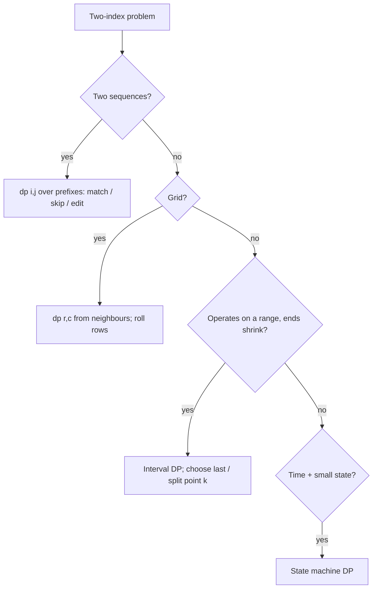

# Dynamic programming 2-D

!!! abstract "At a glance"
    **Priority:** P0 · **Complexity:** 4/5 · **Est. time:** 5 h · **Phase:** 5 · **Prereqs:** [DP 1-D](dp-1d.md)
    **You're done when:** you can fill and explain LCS, edit distance and grid/knapsack tables, roll them into O(min(m, n)) space, reconstruct the answer path, and solve an interval-DP Hard (Burst Balloons) with the "last element" trick.

## Why it matters

Two-string and grid/interval problems are the FAANG "Hard DP" staple. The skill is choosing a two-parameter state that captures the subproblem exactly (prefixes of two strings, position in grid, interval [l, r], (index, k, holding)). In production it is the engine behind diff tools, spell-checking, sequence alignment, dynamic pricing with state machines, and DP-based schedulers.

## Core concepts

### Pattern recognition signals

| When you see… | Think… |
|---|---|
| Two strings/sequences: match, transform, interleave | `dp[i][j]` over prefixes |
| Grid path counting/min cost, moves right/down | `dp[r][c]` from top/left |
| Stock buy/sell with cooldown/fee/k transactions | State machine DP: `(day, holding, transactions)` |
| Choose items with capacity, two constraints | Knapsack with 2 dimensions (Ones and Zeroes) |
| "Burst / merge / remove ends" in a range | Interval DP: `dp[l][r]`, choose the **last** operation |
| Longest path in a matrix with strict increase | DFS + memo (DAG) |
| Regex/wildcard matching | `dp[i][j]` over pattern and text prefixes |

### Template 1: LCS and edit distance

```python
def lcs(a, b):
    m, n = len(a), len(b)
    dp = [[0] * (n + 1) for _ in range(m + 1)]
    for i in range(1, m + 1):
        for j in range(1, n + 1):
            if a[i - 1] == b[j - 1]:
                dp[i][j] = dp[i - 1][j - 1] + 1
            else:
                dp[i][j] = max(dp[i - 1][j], dp[i][j - 1])
    return dp[m][n]

def edit_distance(a, b):
    m, n = len(a), len(b)
    prev = list(range(n + 1))                       # rolling row: O(n) space
    for i in range(1, m + 1):
        cur = [i] + [0] * n
        for j in range(1, n + 1):
            if a[i - 1] == b[j - 1]:
                cur[j] = prev[j - 1]
            else:
                cur[j] = 1 + min(prev[j - 1],       # replace
                                 prev[j],           # delete from a
                                 cur[j - 1])        # insert into a
        prev = cur
    return prev[n]
```

Recovering the alignment needs the full table (or Hirschberg's divide and conquer for O(n) space with paths).

### Template 2: grid DP with a single row

```python
def unique_paths_obstacles(grid):
    C = len(grid[0])
    dp = [0] * C
    dp[0] = 1
    for row in grid:
        for c in range(C):
            if row[c] == 1:
                dp[c] = 0
            elif c > 0:
                dp[c] += dp[c - 1]       # dp[c] (from above) + dp[c-1] (from left)
    return dp[-1]
```

### Template 3: stock state machine (cooldown)

```python
def max_profit_cooldown(prices):
    hold, sold, rest = float('-inf'), 0, 0
    for p in prices:
        prev_sold = sold
        sold = hold + p                     # sell today
        hold = max(hold, rest - p)          # keep, or buy after rest
        rest = max(rest, prev_sold)         # idle (cooldown ends)
    return max(sold, rest)
```

State machines generalise: k transactions add a dimension `dp[t][holding]`. If k ≥ n/2, it degenerates to unlimited transactions.

### Template 4: interval DP (Burst Balloons)

```python
def max_coins(nums):
    a = [1] + nums + [1]
    n = len(a)
    dp = [[0] * n for _ in range(n)]
    for length in range(2, n):                      # open interval (l, r) size
        for l in range(0, n - length):
            r = l + length
            for k in range(l + 1, r):               # k = LAST balloon burst in (l, r)
                dp[l][r] = max(dp[l][r],
                               dp[l][k] + a[l] * a[k] * a[r] + dp[k][r])
    return dp[0][n - 1]
```

Why "last": choosing the first burst splits the problem into dependent halves (neighbours change). Choosing the last one makes the two sides independent. O(n³).

### Template 5: DFS + memo on a DAG (Longest Increasing Path)

```python
from functools import cache
def longest_increasing_path(m):
    R, C = len(m), len(m[0])
    @cache
    def dfs(r, c):
        best = 1
        for dr, dc in ((1, 0), (-1, 0), (0, 1), (0, -1)):
            nr, nc = r + dr, c + dc
            if 0 <= nr < R and 0 <= nc < C and m[nr][nc] > m[r][c]:
                best = max(best, 1 + dfs(nr, nc))
        return best
    return max(dfs(r, c) for r in range(R) for c in range(C))
```

### Template 6: regex matching

```python
def is_match(s, p):
    @cache
    def dp(i, j):
        if j == len(p):
            return i == len(s)
        first = i < len(s) and p[j] in (s[i], ".")
        if j + 1 < len(p) and p[j + 1] == "*":
            return dp(i, j + 2) or (first and dp(i + 1, j))   # zero or one-more
        return first and dp(i + 1, j + 1)
    return dp(0, 0)
```

### Comparison

| Family | State | Cells | Time | Space after trimming |
|---|---|---|---|---|
| LCS / edit distance / interleave | (i, j) prefixes | m·n | O(mn) | O(min(m, n)) (no path) |
| Grid paths | (r, c) | m·n | O(mn) | O(n) |
| 2-D knapsack (Ones and Zeroes) | (zeros, ones) | m·n | O(L·m·n) | already 2-D |
| Distinct subsequences | (i, j) | m·n | O(mn) | O(n) |
| Interval DP | (l, r) | n² | O(n³) | O(n²) |
| Stock k transactions | (t, holding) | k·2 | O(nk) | O(k) |



### Common bugs

- Off-by-one between string index and table index (`a[i-1]` vs `dp[i]`).
- Interval DP iteration order (by length, not by l).
- Initialising base rows/columns for edit distance (`dp[i][0] = i`).
- Regex: mishandling `*` with a leading `.`, and the empty-pattern base case.
- Rolling arrays overwritten before use (Unique Paths II order).
- Distinct Subsequences overflow concerns (Python is fine, other languages need care).

## Resources

| Resource | Type | Why this one | Level | Cost |
|---|---|---|---|---|
| [NeetCode roadmap: 2-D DP](https://neetcode.io/roadmap) | video | Table walk-throughs for LCS, edit distance, regex | intermediate | freemium |
| [Jeff Erickson, ch. 3: Dynamic programming](https://jeffe.cs.illinois.edu/teaching/algorithms/book/03-dynprog.pdf) :gem: | book | Edit distance and interval DP derived from recursion | advanced | free |
| [AtCoder Educational DP Contest](https://atcoder.jp/contests/dp) :gem: | interactive | LCS (F), Grid (H), Knapsack (D/E), Stones, interval (N) | advanced | free |
| [cp-algorithms: Knapsack](https://cp-algorithms.com/dynamic_programming/knapsack.html) | article | Optimised variants | advanced | free |
| [Tech Interview Handbook: Dynamic programming](https://www.techinterviewhandbook.org/algorithms/dynamic-programming/) | article | Recognition guide | intermediate | free |
| [CSES Problem Set: DP section](https://cses.fi/problemset/) | interactive | Classic graded DP practice | advanced | free |
| [labuladong: DP series](https://labuladong.online/algo/en/) | article | Subsequence and stock DP frameworks | intermediate | freemium |

## Hands-on lab

| # | LC | Problem | Difficulty | Set | Key insight |
|---|---|---|---|---|---|
| 1 | 62 | [Unique Paths](https://leetcode.com/problems/unique-paths/) | Medium | NC150 | Grid DP with one row; or C(m+n-2, m-1). |
| 2 | 63 | [Unique Paths II](https://leetcode.com/problems/unique-paths-ii/) | Medium | NC250+ | Obstacle cells reset to 0. |
| 3 | 64 | [Minimum Path Sum](https://leetcode.com/problems/minimum-path-sum/) | Medium | NC250+ | In-place grid DP. |
| 4 | 1143 | [Longest Common Subsequence](https://leetcode.com/problems/longest-common-subsequence/) | Medium | NC150 | Match -> diag+1; else max(up, left). |
| 5 | 309 | [Best Time to Buy and Sell Stock with Cooldown](https://leetcode.com/problems/best-time-to-buy-and-sell-stock-with-cooldown/) | Medium | NC150 | State machine: hold / sold / rest. |
| 6 | 518 | [Coin Change II](https://leetcode.com/problems/coin-change-ii/) | Medium | NC150 | Count combinations: coins outer loop, amounts inner. |
| 7 | 494 | [Target Sum](https://leetcode.com/problems/target-sum/) | Medium | NC150 | Reduce to subset sum (total + target) / 2. |
| 8 | 97 | [Interleaving String](https://leetcode.com/problems/interleaving-string/) | Medium | NC150 | dp[i][j]: s1[:i] and s2[:j] form s3[:i+j]. |
| 9 | 72 | [Edit Distance](https://leetcode.com/problems/edit-distance/) | Medium | NC150 | Insert/delete/replace = left/up/diag + 1. |
| 10 | 221 | [Maximal Square](https://leetcode.com/problems/maximal-square/) | Medium | NC250+ | dp = 1 + min(up, left, diag). |
| 11 | 474 | [Ones and Zeroes](https://leetcode.com/problems/ones-and-zeroes/) | Medium | NC250+ | 2-D capacity 0/1 knapsack, iterate downward. |
| 12 | 329 | [Longest Increasing Path in a Matrix](https://leetcode.com/problems/longest-increasing-path-in-a-matrix/) | Hard | NC150 | DFS + memo; strict increase makes it a DAG. |
| 13 | 115 | [Distinct Subsequences](https://leetcode.com/problems/distinct-subsequences/) | Hard | NC150 | dp[i][j] = dp[i+1][j] + (match ? dp[i+1][j+1] : 0). |
| 14 | 188 | [Best Time to Buy and Sell Stock IV](https://leetcode.com/problems/best-time-to-buy-and-sell-stock-iv/) | Hard | NC250+ | dp over (transactions, holding); k >= n/2 -> unlimited. |
| 15 | 312 | [Burst Balloons](https://leetcode.com/problems/burst-balloons/) | Hard | NC150 | Interval DP: choose the LAST balloon burst in (l, r). |
| 16 | 10 | [Regular Expression Matching](https://leetcode.com/problems/regular-expression-matching/) | Hard | NC150 | '*' = zero copies (j+2) or one more (i+1 if first matches). |

**Stretch exercise:** implement `diff(a_lines, b_lines)` using LCS with backtracking to print unified diff hunks, then compare against Myers' O(ND) algorithm on real file pairs (see `difflib` for reference behaviour).

## Questions

### L1 — Recall

??? question "Q1. Recurrence for edit distance and meaning of each branch?"
    ??? success "Answer"
        If `a[i]==b[j]`: `dp[i][j] = dp[i-1][j-1]`. Else `1 + min(dp[i-1][j-1] (replace), dp[i-1][j] (delete a[i]), dp[i][j-1] (insert b[j]))`. Base: `dp[i][0]=i`, `dp[0][j]=j`.

??? question "Q2. Why does interval DP choose the *last* element in Burst Balloons?"
    ??? success "Answer"
        If k is the last balloon burst in (l, r), its neighbours at that moment are exactly l and r, so the score is `a[l]*a[k]*a[r]` and the two sides (l, k) and (k, r) are independent subproblems. Choosing the first burst instead would change adjacency for both sides, making the subproblems dependent.

??? question "Q3. When can 2-D DP be reduced to 1-D space, and when not?"
    ??? success "Answer"
        When `dp[i][*]` depends only on row i−1 (and i itself), keep two rows or one row with careful ordering. Not when you need the actual path/alignment from the table (unless using Hirschberg), or when transitions reach arbitrary earlier rows (interval DP).

### L2 — Apply

??? question "Q4. Implement Interleaving String."
    ??? success "Answer"
        ```python
        def is_interleave(s1, s2, s3):
            m, n = len(s1), len(s2)
            if m + n != len(s3): return False
            dp = [False] * (n + 1)
            dp[0] = True
            for j in range(1, n + 1):
                dp[j] = dp[j - 1] and s2[j - 1] == s3[j - 1]
            for i in range(1, m + 1):
                dp[0] = dp[0] and s1[i - 1] == s3[i - 1]
                for j in range(1, n + 1):
                    dp[j] = ((dp[j] and s1[i - 1] == s3[i + j - 1]) or
                             (dp[j - 1] and s2[j - 1] == s3[i + j - 1]))
            return dp[n]
        ```
        O(mn) time, O(n) space.

??? question "Q5. Implement Target Sum by reducing it to subset sum."
    ??? success "Answer"
        ```python
        def find_target_sum_ways(nums, target):
            total = sum(nums)
            if abs(target) > total or (total + target) % 2:
                return 0
            need = (total + target) // 2          # sum of the '+' group
            dp = [1] + [0] * need
            for x in nums:
                for s in range(need, x - 1, -1):
                    dp[s] += dp[s - x]
            return dp[need]
        ```
        P − N = target and P + N = total give P = (total + target)/2. Zeros count double automatically, since each zero doubles the ways.

??? question "Q6. Trace LCS for 'abcde' and 'ace'."
    ??? success "Answer"
        Rows a,b,c,d,e vs columns a,c,e. Matches at (a,a), (c,c), (e,e) each add 1 along the diagonal: dp values 1, 1, 2, 2, 3. LCS length 3 ("ace").

### L3 — Design & trade-offs

??? question "Q7. Best Time to Buy/Sell Stock IV (k transactions): how do you handle k large?"
    ??? success "Answer"
        If `k >= n // 2`, the constraint is inactive, so use the O(n) greedy sum of positive deltas. Otherwise DP with `buy[t]` and `sell[t]` arrays, O(nk) time and O(k) space, iterating prices once. Without the shortcut, k = 10^9 would allocate absurdly.

??? question "Q8. Top-down memo vs bottom-up for edit distance on 10^4 × 10^4 strings?"
    ??? success "Answer"
        10^8 cells. Top-down recursion in Python would blow the stack (depth up to 2·10^4) and be too slow. Bottom-up with rolling rows is O(mn) time (still ~30–60 s in pure Python), so vectorise with numpy (anti-diagonal or row-wise min-plus tricks), or use a bit-parallel algorithm (Myers/Hyyrö), or a banded DP if you only need distance ≤ d (O(n·d)). In interviews say the approach and the constraint that would force the optimisation.

??? question "Q9. Regex matching: DP vs NFA simulation vs backtracking. Which and why?"
    ??? success "Answer"
        Backtracking is simple but exponential in the worst case (ReDoS). DP over (i, j) is O(mn) and deterministic. Thompson NFA simulation is O(m·n) time with O(m) space and streams the text. Production engines that promise linear time (RE2, Rust `regex`) use automata. The DP is the interview answer, and the NFA is what you'd ship for untrusted patterns.

### L4 — Staff-level ambiguity

??? question "Q10. You must diff two 5 GB sorted CSV exports nightly and produce inserts/updates/deletes. LCS is O(mn). What do you do?"
    ??? success "Answer"
        Don't run LCS. Because both are keyed and sorted, do a streaming merge join (the two-pointer pattern): O(n+m), constant memory, with a row-hash comparison to detect updates. If unsorted, external sort by key or hash-partition both files into buckets that fit in memory. Reserve LCS/Myers for ordered text where identity is positional, not key-based. The Staff move is to notice that the problem has a key and therefore isn't an alignment problem.

??? question "Q11. Product wants 'did you mean' suggestions using edit distance over 5M product names at < 50 ms. Design."
    ??? success "Answer"
        Never compute edit distance against all 5M names. Generate candidates cheaply: n-gram (trigram) inverted index or BK-tree, or SymSpell (precomputed deletes within distance 2), or an FST/Levenshtein automaton intersected with a term dictionary (the Lucene approach). Then rank the top few dozen candidates with real edit distance plus popularity. Cache frequent misspellings. Evaluate with a labelled query log (precision@k), and consider phonetic keys and language-specific handling. Complexity moves from O(N·m·n) to roughly O(candidates · m · n).

## Real-world use cases

- **Diff/merge and sync:** `git diff` (Myers, an LCS relative), rsync delta encoding.
- **Bioinformatics:** Needleman-Wunsch/Smith-Waterman alignments (edit-distance DP with scoring matrices).
- **Trading/pricing:** state-machine DP for cooldown/fee/inventory-limited strategies.
- **Search quality:** fuzzy matching of port/vessel/party names in master data (edit distance plus candidate generation).

## Pitfalls & anti-patterns

- Defining the state too loosely, so the transition isn't well-defined.
- O(n³) interval DP without checking n ≤ ~500.
- Reconstructing paths after discarding the table.
- Using edit distance in a many-to-many comparison without blocking/candidate generation.

## Checklist

- [ ] I can fill LCS and edit distance tables by hand and by code, and trim space
- [ ] I can explain the "last element" trick in interval DP
- [ ] I solved 72, 312 and 10 unaided (timeboxed to 35 min each)
- [ ] I answered all L3 questions out loud in < 3 min each
