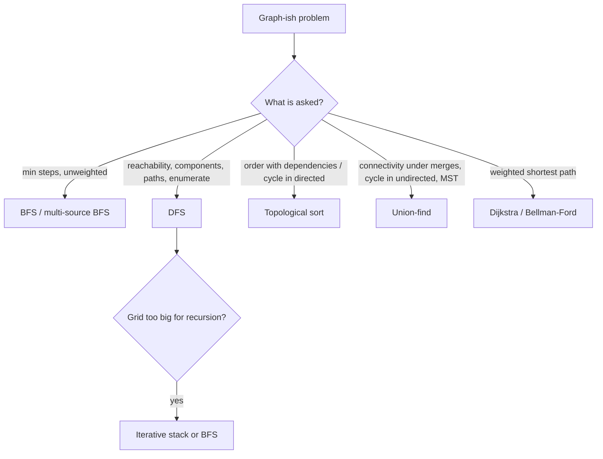

# Graphs: BFS, DFS, topological sort, union-find

!!! abstract "At a glance"
    **Priority:** P0 · **Complexity:** 3/5 · **Est. time:** 5 h · **Phase:** 3 · **Prereqs:** [Trees](trees.md), [Stack](stack.md), [Heap](heap.md)
    **You're done when:** you can model an unfamiliar problem as a graph (what are nodes/edges?), pick BFS/DFS/topo/union-find in under 2 minutes, and write each from memory with correct visited handling.

## Why it matters

Graph modelling is the highest-leverage interview skill after DP. Grids, dependency resolution, social networks, state spaces (word ladder, lock combos), and networks are all graphs. In production: build systems and package managers (topological order), workflow/DAG engines, service dependency analysis, network reachability, deduplication and entity resolution (union-find), and rule-dependency evaluation in rule engines.

## Core concepts

### Pattern recognition signals

| When you see… | Think… |
|---|---|
| Grid of land/water, "islands", "regions", "flood" | DFS/BFS on grid, count components |
| "minimum steps/moves/transformations" (unweighted) | **BFS** (level = distance) |
| Many starting points spreading simultaneously (rot, fire, gates) | **Multi-source BFS** |
| "prerequisites", "order of tasks", "build order", "alien dictionary" | **Topological sort** (Kahn or DFS) |
| "is there a cycle" (directed) | Topo sort / 3-colour DFS |
| "connected?", "merge groups", "redundant edge", "count components" (dynamic) | **Union-find (DSU)** |
| "is it a tree" | edges == n-1 and connected (or no cycle) |
| "clone", "deep copy" a graph | DFS/BFS with old→new map |
| Weighted shortest path | [Advanced graphs](advanced-graphs.md) |

### Representations

| Representation | Space | Edge check | Iterate neighbours | Use when |
|---|---|---|---|---|
| Adjacency list (`defaultdict(list)`) | O(V+E) | O(deg) | O(deg) | Default; sparse graphs |
| Adjacency matrix | O(V²) | O(1) | O(V) | Dense, small V (Floyd-Warshall) |
| Edge list | O(E) | O(E) | O(E) | Kruskal, Bellman-Ford |
| Implicit (grid/state) | O(1) | n/a | generated | Grids and state-space search |

### Template 1: BFS shortest path (unweighted) with level loop

```python
from collections import deque

def bfs_shortest(start, goal, neighbours):
    q, seen, steps = deque([start]), {start}, 0
    while q:
        for _ in range(len(q)):
            u = q.popleft()
            if u == goal:
                return steps
            for v in neighbours(u):
                if v not in seen:
                    seen.add(v)             # mark when enqueued, not dequeued
                    q.append(v)
        steps += 1
    return -1
```

### Template 2: grid DFS / island counting

```python
def num_islands(grid):
    R, C, count = len(grid), len(grid[0]), 0
    def dfs(r, c):
        if not (0 <= r < R and 0 <= c < C) or grid[r][c] != "1":
            return
        grid[r][c] = "0"                    # visited (mutating; copy or use set if not allowed)
        for dr, dc in ((1, 0), (-1, 0), (0, 1), (0, -1)):
            dfs(r + dr, c + dc)
    for r in range(R):
        for c in range(C):
            if grid[r][c] == "1":
                count += 1
                dfs(r, c)
    return count
```

Recursion depth can hit R·C. Use an explicit stack or BFS for large grids.

### Template 3: multi-source BFS (Rotting Oranges)

```python
def oranges_rotting(grid):
    R, C = len(grid), len(grid[0])
    q, fresh = deque(), 0
    for r in range(R):
        for c in range(C):
            if grid[r][c] == 2: q.append((r, c))
            elif grid[r][c] == 1: fresh += 1
    minutes = 0
    while q and fresh:
        for _ in range(len(q)):
            r, c = q.popleft()
            for dr, dc in ((1, 0), (-1, 0), (0, 1), (0, -1)):
                nr, nc = r + dr, c + dc
                if 0 <= nr < R and 0 <= nc < C and grid[nr][nc] == 1:
                    grid[nr][nc] = 2; fresh -= 1; q.append((nr, nc))
        minutes += 1
    return minutes if fresh == 0 else -1
```

### Template 4: topological sort (Kahn's), O(V + E)

```python
from collections import defaultdict, deque

def topo_order(n, prereqs):                  # [a, b]: take b before a
    g, indeg = defaultdict(list), [0] * n
    for a, b in prereqs:
        g[b].append(a); indeg[a] += 1
    q = deque(i for i in range(n) if indeg[i] == 0)
    order = []
    while q:
        u = q.popleft(); order.append(u)
        for v in g[u]:
            indeg[v] -= 1
            if indeg[v] == 0:
                q.append(v)
    return order if len(order) == n else []  # shorter means a cycle
```

DFS variant: 3 colours (0 unvisited, 1 in stack, 2 done). Reaching colour 1 means a cycle. Reverse post-order gives the topological order.

### Template 5: union-find with path compression + union by size

```python
class DSU:
    def __init__(self, n):
        self.p = list(range(n)); self.sz = [1] * n; self.comps = n
    def find(self, x):
        while self.p[x] != x:
            self.p[x] = self.p[self.p[x]]    # path halving
            x = self.p[x]
        return x
    def union(self, a, b):
        ra, rb = self.find(a), self.find(b)
        if ra == rb:
            return False                     # already connected: this edge closes a cycle
        if self.sz[ra] < self.sz[rb]:
            ra, rb = rb, ra
        self.p[rb] = ra; self.sz[ra] += self.sz[rb]; self.comps -= 1
        return True
```

Amortised O(α(n)) per op (inverse Ackermann, effectively constant). Redundant Connection: the first edge where `union` returns False.

### Choosing the tool



| Task | BFS | DFS | Union-find |
|---|---|---|---|
| Connected components (static) | yes | yes | yes |
| Connected components (edges arrive online) | rerun | rerun | **best** |
| Shortest path (unweighted) | **yes** | no | no |
| Cycle, undirected | yes | yes | **yes** |
| Cycle, directed | Kahn | 3-colour | no |
| Bipartite check | 2-colouring | 2-colouring | with parity DSU |

### Common bugs

- Marking visited on dequeue, causing duplicates and exponential blowup on BFS.
- Not handling disconnected graphs (loop over all start nodes).
- Undirected DFS cycle detection without excluding the parent edge.
- Topological order edge direction reversed (prereq direction).
- Recursion limit on large grids/graphs.
- Word Ladder: building neighbours by trying 26 letters at every position is fine, but the pattern buckets (`h*t`) are faster to precompute.
- Pacific Atlantic: DFS from cells to the ocean vs reverse from the ocean (reverse is O(RC)).

## Resources

| Resource | Type | Why this one | Level | Cost |
|---|---|---|---|---|
| [NeetCode roadmap: Graphs](https://neetcode.io/roadmap) | video | Clear grid and topo-sort explanations | intermediate | freemium |
| [Tech Interview Handbook: Graph](https://www.techinterviewhandbook.org/algorithms/graph/) | article | Representations, corner cases | intermediate | free |
| [VisuAlgo: Graph traversal / DSU](https://visualgo.net/en/dfsbfs) :gem: | interactive | Step through BFS/DFS and union-find | intermediate | free |
| [cp-algorithms: Disjoint Set Union](https://cp-algorithms.com/data_structures/disjoint_set_union.html) :gem: | article | Rigorous DSU with applications (offline, parity, rollback) | advanced | free |
| [cp-algorithms: Topological sort](https://cp-algorithms.com/graph/topological-sort.html) | article | Proof and DFS-based ordering | advanced | free |
| [Jeff Erickson: Graph traversal](https://jeffe.cs.illinois.edu/teaching/algorithms/book/05-graphs.pdf) :gem: | book | The clearest general-graph traversal framework | advanced | free |
| [Red Blob Games: Introduction to A*](https://www.redblobgames.com/pathfinding/a-star/introduction.html) :gem: | interactive | BFS to Dijkstra to A* with live diagrams | intermediate | free |

## Hands-on lab

| # | LC | Problem | Difficulty | Set | Key insight |
|---|---|---|---|---|---|
| 1 | 733 | [Flood Fill](https://leetcode.com/problems/flood-fill/) | Easy | NC250+ | Grid DFS warm-up; guard when new colour == old. |
| 2 | 463 | [Island Perimeter](https://leetcode.com/problems/island-perimeter/) | Easy | NC250+ | 4 per land cell minus 2 per shared edge. |
| 3 | 200 | [Number of Islands](https://leetcode.com/problems/number-of-islands/) | Medium | NC150 | Count DFS/BFS launches over unvisited land. |
| 4 | 695 | [Max Area of Island](https://leetcode.com/problems/max-area-of-island/) | Medium | NC150 | DFS returns area. |
| 5 | 133 | [Clone Graph](https://leetcode.com/problems/clone-graph/) | Medium | NC150 | old->clone map doubles as visited set. |
| 6 | 286 | [Walls and Gates](https://leetcode.com/problems/walls-and-gates/) | Medium | NC150 | Multi-source BFS from all gates. (Premium; free on NeetCode) |
| 7 | 994 | [Rotting Oranges](https://leetcode.com/problems/rotting-oranges/) | Medium | NC150 | Multi-source BFS; minutes = levels; check fresh left. |
| 8 | 417 | [Pacific Atlantic Water Flow](https://leetcode.com/problems/pacific-atlantic-water-flow/) | Medium | NC150 | Reverse flow: DFS uphill from each ocean, intersect. |
| 9 | 130 | [Surrounded Regions](https://leetcode.com/problems/surrounded-regions/) | Medium | NC150 | Mark border-connected O's safe first, flip the rest. |
| 10 | 207 | [Course Schedule](https://leetcode.com/problems/course-schedule/) | Medium | NC150 | Cycle detection: Kahn's in-degree or 3-colour DFS. |
| 11 | 210 | [Course Schedule II](https://leetcode.com/problems/course-schedule-ii/) | Medium | NC150 | Kahn's order is the answer; len < n means cycle. |
| 12 | 684 | [Redundant Connection](https://leetcode.com/problems/redundant-connection/) | Medium | NC150 | Union-find: first edge whose endpoints share a root. |
| 13 | 323 | [Number of Connected Components in an Undirected Graph](https://leetcode.com/problems/number-of-connected-components-in-an-undirected-graph/) | Medium | NC150 | Union-find: n - successful unions. (Premium) |
| 14 | 261 | [Graph Valid Tree](https://leetcode.com/problems/graph-valid-tree/) | Medium | NC150 | Tree iff edges == n-1 and connected. (Premium) |
| 15 | 1091 | [Shortest Path in Binary Matrix](https://leetcode.com/problems/shortest-path-in-binary-matrix/) | Medium | NC250+ | BFS with 8 directions; unweighted shortest path. |
| 16 | 1466 | [Reorder Routes to Make All Paths Lead to the City Zero](https://leetcode.com/problems/reorder-routes-to-make-all-paths-lead-to-the-city-zero/) | Medium | NC250+ | Store edges both ways with a cost flag; DFS from 0. |
| 17 | 399 | [Evaluate Division](https://leetcode.com/problems/evaluate-division/) | Medium | NC250+ | Weighted graph; DFS multiplies ratios (or weighted union-find). |
| 18 | 721 | [Accounts Merge](https://leetcode.com/problems/accounts-merge/) | Medium | NC250+ | Union-find over emails. |
| 19 | 909 | [Snakes and Ladders](https://leetcode.com/problems/snakes-and-ladders/) | Medium | NC250+ | BFS over squares; boustrophedon index mapping is the trap. |
| 20 | 752 | [Open the Lock](https://leetcode.com/problems/open-the-lock/) | Medium | NC250+ | BFS over 10^4 states; deadends pre-visited. |
| 21 | 127 | [Word Ladder](https://leetcode.com/problems/word-ladder/) | Hard | NC150 | BFS; wildcard pattern buckets ('h*t') for neighbours. |

**Stretch exercise:** write a tiny build tool: read `target: deps...` lines, detect cycles (print the cycle path), and output a parallel build plan (levels of Kahn's algorithm). Reuse for the rule-dependency graph in your capstone.

## Questions

### L1 — Recall

??? question "Q1. BFS vs DFS: when is each correct for shortest path?"
    ??? success "Answer"
        BFS gives shortest paths in **unweighted** graphs because it explores by increasing edge count. DFS doesn't. With weights use Dijkstra (non-negative) or Bellman-Ford (negative edges).

??? question "Q2. Why is union-find effectively O(1)?"
    ??? success "Answer"
        With path compression and union by size/rank, a sequence of m operations on n elements costs O(m · α(n)), where α is the inverse Ackermann function (< 5 for any practical n).

??? question "Q3. How do you detect a cycle in a directed vs undirected graph?"
    ??? success "Answer"
        Directed: Kahn's algorithm leaving nodes unprocessed, or DFS that reaches a node currently on the recursion stack (grey). Undirected: DFS reaching a visited node that isn't the parent, or union-find where the endpoints already share a root.

### L2 — Apply

??? question "Q4. Implement Clone Graph."
    ??? success "Answer"
        ```python
        def clone_graph(node):
            if not node: return None
            clones = {node: Node(node.val)}
            q = deque([node])
            while q:
                u = q.popleft()
                for v in u.neighbors:
                    if v not in clones:
                        clones[v] = Node(v.val); q.append(v)
                    clones[u].neighbors.append(clones[v])
            return clones[node]
        ```
        The map is both the visited set and the old→new lookup. O(V+E).

??? question "Q5. Word Ladder: implement with pattern buckets and explain the complexity."
    ??? success "Answer"
        ```python
        from collections import defaultdict, deque
        def ladder_length(begin, end, words):
            if end not in words: return 0
            buckets = defaultdict(list)
            for w in set(words) | {begin}:
                for i in range(len(w)):
                    buckets[w[:i] + "*" + w[i + 1:]].append(w)
            q, seen, steps = deque([begin]), {begin}, 1
            while q:
                for _ in range(len(q)):
                    w = q.popleft()
                    if w == end: return steps
                    for i in range(len(w)):
                        key = w[:i] + "*" + w[i + 1:]
                        for nxt in buckets[key]:
                            if nxt not in seen:
                                seen.add(nxt); q.append(nxt)
                        buckets[key] = []      # each bucket expanded once
                steps += 1
            return 0
        ```
        O(N · L^2): N words, L per-word cost for building keys. Bidirectional BFS roughly square-roots the search frontier.

??? question "Q6. Course Schedule II: return an order or empty. Trace [[1,0],[2,1],[3,1],[3,2]] with n=4."
    ??? success "Answer"
        Edges 0→1, 1→2, 1→3, 2→3. In-degrees: 0:0, 1:1, 2:1, 3:2. Queue [0] gives 0; then 1; then 2 and 3 (3 after 2 resolves). Order 0,1,2,3 (length 4, so no cycle).

### L3 — Design & trade-offs

??? question "Q7. Union-find vs DFS for 'number of connected components' — pick."
    ??? success "Answer"
        Static graph: DFS/BFS, simple, O(V+E). Edges arriving online with interleaved queries: union-find, O(α) per edge without rescans. DSU can't delete edges (only offline rollback DSU or link-cut trees). If deletions matter, process offline in reverse (delete becomes add).

??? question "Q8. Kahn's vs DFS topological sort?"
    ??? success "Answer"
        Kahn: iterative, gives natural levels (parallelisable layers), and cycle detection via count. DFS: shorter recursive code, needs 3 colours for cycle detection, recursion depth risk. If the interviewer asks for "which tasks can run in parallel", Kahn's levels answer it directly. Lexicographically smallest order: Kahn with a heap.

??? question "Q9. BFS on an implicit state graph with a huge state space (e.g. 10^9 states). What do you do?"
    ??? success "Answer"
        Bidirectional BFS (b^(d/2) instead of b^d), A* with an admissible heuristic, state compression (bitmask/canonical form), symmetry reduction, and bounded depth with iterative deepening if memory is the limit. Explain the memory: BFS stores the frontier, DFS only the path.

### L4 — Staff-level ambiguity

??? question "Q10. Design a dependency resolver for a package manager with 500k packages and version constraints."
    ??? success "Answer"
        The graph is a DAG of package-version nodes with constraint edges, but choosing versions is NP-complete in general (a SAT problem), so modern resolvers use SAT/CDCL-style solvers (pubgrub in Dart/Cargo/uv, libsolv in RPM). Explain: topological order once versions are fixed, lockfiles for determinism, caching metadata, and error explanations (pubgrub's derivation trees give human-readable conflicts). Interview answer: a backtracking search with heuristics (newest first, most-constrained package first), incremental unit propagation, and conflict learning. Mention operational aspects: parallel metadata fetch, reproducible builds, and yanked versions.

??? question "Q11. Entity resolution: 200M customer records, pairs flagged as 'same entity' by matchers. Build canonical entities."
    ??? success "Answer"
        Treat flagged pairs as edges. Connected components are entities: union-find in memory if IDs fit (200M ints ≈ 1.6 GB for one array in numpy), otherwise a distributed connected-components job (Spark GraphFrames, or label propagation with iterative min-label joins, O(diameter) rounds; two-phase "star contraction" algorithms cut rounds). Risks: transitive-closure over-merging (one bad edge merges two large clusters), so add edge confidence thresholds, cluster-size caps and a review queue for big merges. Incremental updates: union-find with a persisted parent table, and split handling needs a re-cluster of the affected component.

## Real-world use cases

- **Build/CI and workflow engines:** topological execution of DAGs (Airflow, Bazel), cycle detection at authoring time.
- **Networks and reachability:** BFS for hop counts, firewall/security-group reachability analysis.
- **Logistics:** shipment routing as a graph (ports as nodes, legs as edges), connected components of the trade lane network, disruption blast-radius (which bookings depend on a blocked port).
- **Master data:** union-find to merge duplicate customer/supplier records, related to your MDG work.

## Pitfalls & anti-patterns

- Modelling the wrong nodes (state must include everything that affects future moves, such as `(node, keys_collected)`).
- Marking visited late in BFS.
- Recursion for big grids in Python.
- Using DFS to find shortest paths.

## Checklist

- [ ] I can write BFS, DFS (recursive and iterative), Kahn's and DSU from memory
- [ ] I can pick the right tool from the problem statement in < 2 min
- [ ] I solved Word Ladder, Course Schedule II and Redundant Connection unaided
- [ ] I answered all L3 questions out loud in < 3 min each
