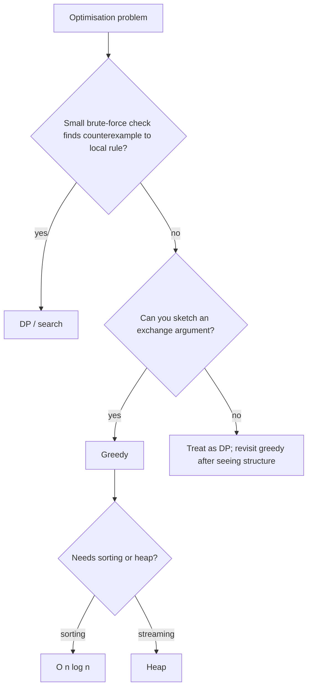

# Greedy

!!! abstract "At a glance"
    **Priority:** P0 · **Complexity:** 3/5 · **Est. time:** 3 h · **Phase:** 5 · **Prereqs:** [DP 1-D](dp-1d.md), [Heap](heap.md), [Intervals](intervals.md)
    **You're done when:** for each greedy solution you can state the local rule and give an exchange-argument proof sketch, and you can quickly build a counterexample when a plausible greedy is wrong.

## Why it matters

Greedy makes the locally best choice and never revisits it. When valid, it gives the simplest and fastest solution (often O(n log n) or O(n)). The interview risk is **false greedy**: a plausible rule that fails on edge cases. Staff-level interviewers want the justification (exchange argument, matroid structure, invariant), not just the code. In production: scheduling, cache eviction heuristics, load balancing, Huffman coding, and approximation algorithms.

## Core concepts

### Pattern recognition signals

| When you see… | Think… |
|---|---|
| Max subarray sum, circular variants | Kadane |
| Reachability with jumps, "minimum jumps" | Track farthest reach (implicit BFS) |
| Intervals: max non-overlapping, min removals, arrows | Sort by **end** (activity selection) |
| Gas station / circular feasibility | Total-sum check + reset point |
| Grouping consecutive cards, task ordering | Process from the smallest/most constrained |
| "Partition into as many parts as possible" | Last-occurrence boundary |
| Parentheses with wildcards | Track range of possible open counts |
| Two-pass rating/candy problems | Left-to-right then right-to-left |
| Min cost pairing (two cities) | Sort by cost difference |

### Proof techniques (what to say out loud)

| Technique | Statement |
|---|---|
| **Exchange argument** | Take any optimal solution; swap its first differing choice for the greedy choice without worsening it, so greedy is also optimal. |
| **Greedy stays ahead** | After each step, greedy's partial solution is at least as good as any other's. |
| **Invariant / potential** | A maintained property (for example "farthest reachable index") that implies the answer at the end. |
| **Counterexample search** | Try small cases (n ≤ 4) by brute force to falsify a rule quickly. |

### Template 1: Kadane and circular variant

```python
def max_subarray(a):
    best = cur = a[0]
    for x in a[1:]:
        cur = max(x, cur + x)         # extend or restart
        best = max(best, cur)
    return best

def max_circular(a):
    total, cur_max, best_max, cur_min, best_min = 0, 0, a[0], 0, a[0]
    for x in a:
        cur_max = max(cur_max + x, x); best_max = max(best_max, cur_max)
        cur_min = min(cur_min + x, x); best_min = min(best_min, cur_min)
        total += x
    return best_max if best_max < 0 else max(best_max, total - best_min)
```

### Template 2: jump game (farthest reach) and jump game II (implicit BFS)

```python
def can_jump(a):
    far = 0
    for i, x in enumerate(a):
        if i > far: return False
        far = max(far, i + x)
    return True

def jumps(a):
    jumps = cur_end = far = 0
    for i in range(len(a) - 1):
        far = max(far, i + a[i])
        if i == cur_end:              # must jump to extend the frontier
            jumps += 1
            cur_end = far
    return jumps
```

### Template 3: gas station

```python
def can_complete_circuit(gas, cost):
    if sum(gas) < sum(cost): return -1
    tank = start = 0
    for i in range(len(gas)):
        tank += gas[i] - cost[i]
        if tank < 0:
            start, tank = i + 1, 0    # none of start..i can be a valid start
    return start
```

### Template 4: partition labels and interval selection

```python
def partition_labels(s):
    last = {c: i for i, c in enumerate(s)}
    res, start = [], 0
    end = 0
    for i, c in enumerate(s):
        end = max(end, last[c])
        if i == end:
            res.append(end - start + 1); start = i + 1
    return res

def erase_overlap(intervals):          # min removals = n - max non-overlapping
    intervals.sort(key=lambda x: x[1])
    keep, end = 0, float('-inf')
    for s, e in intervals:
        if s >= end:
            keep += 1; end = e
    return len(intervals) - keep
```

### Template 5: two-pass (Candy) and range tracking (Valid Parenthesis String)

```python
def candy(r):
    n = len(r); c = [1] * n
    for i in range(1, n):
        if r[i] > r[i - 1]: c[i] = c[i - 1] + 1
    for i in range(n - 2, -1, -1):
        if r[i] > r[i + 1]: c[i] = max(c[i], c[i + 1] + 1)
    return sum(c)

def check_valid_string(s):
    lo = hi = 0                        # range of possible open-paren counts
    for ch in s:
        lo += 1 if ch == "(" else -1
        hi += 1 if ch != ")" else -1
        if hi < 0: return False
        lo = max(lo, 0)
    return lo == 0
```

### Greedy vs DP: how to choose

| Signal | Greedy | DP |
|---|---|---|
| Local choice never needs regret | yes | overkill |
| Counterexample found in small cases | no | yes |
| Weighted version of an unweighted greedy (weighted interval scheduling) | no | yes |
| Arbitrary coin denominations | no | yes |
| Exchange argument exists | yes | |



### Common bugs

- Sorting intervals by start when end is the right key (activity selection).
- Kadane on all-negative arrays initialised with 0 (returns 0 instead of the max element).
- Circular Kadane when all elements are negative (`total - min` = 0 is invalid).
- Gas station: not doing the total-sum feasibility check.
- Jump Game II: iterating to `len - 1` inclusive and over-counting.
- Hand of Straights: forgetting to check `len(hand) % groupSize`.

## Resources

| Resource | Type | Why this one | Level | Cost |
|---|---|---|---|---|
| [NeetCode roadmap: Greedy](https://neetcode.io/roadmap) | video | Short intuitive proofs for each problem | intermediate | freemium |
| [Jeff Erickson, ch. 4: Greedy algorithms](https://jeffe.cs.illinois.edu/teaching/algorithms/book/04-greedy.pdf) :gem: | book | Exchange arguments done properly (scheduling, Huffman) | advanced | free |
| [Tech Interview Handbook: Study cheatsheet](https://www.techinterviewhandbook.org/algorithms/study-cheatsheet/) | article | Where greedy sits in the overall plan | intermediate | free |
| [MIT 6.006 (OCW)](https://ocw.mit.edu/courses/6-006-introduction-to-algorithms-spring-2020/) | course | Lectures with rigorous proofs | advanced | free |
| [CSES Problem Set](https://cses.fi/problemset/) | interactive | Graded greedy/sorting problems with tests | advanced | free |
| [Hello Interview: coding patterns](https://www.hellointerview.com/learn/code) | interactive | Greedy pattern explainers | intermediate | freemium |

## Hands-on lab

| # | LC | Problem | Difficulty | Set | Key insight |
|---|---|---|---|---|---|
| 1 | 860 | [Lemonade Change](https://leetcode.com/problems/lemonade-change/) | Easy | NC250+ | Give change with largest bills first. |
| 2 | 53 | [Maximum Subarray](https://leetcode.com/problems/maximum-subarray/) | Medium | NC150 | Kadane: drop the prefix when it goes negative. |
| 3 | 122 | [Best Time to Buy and Sell Stock II](https://leetcode.com/problems/best-time-to-buy-and-sell-stock-ii/) | Medium | NC250+ | Sum every positive day-over-day delta. |
| 4 | 918 | [Maximum Sum Circular Subarray](https://leetcode.com/problems/maximum-sum-circular-subarray/) | Medium | NC250+ | max(kadaneMax, total - kadaneMin), all-negative guard. |
| 5 | 978 | [Longest Turbulent Subarray](https://leetcode.com/problems/longest-turbulent-subarray/) | Medium | NC250+ | Kadane-style run length on sign alternation. |
| 6 | 55 | [Jump Game](https://leetcode.com/problems/jump-game/) | Medium | NC150 | Track farthest reachable; fail if i > farthest. |
| 7 | 45 | [Jump Game II](https://leetcode.com/problems/jump-game-ii/) | Medium | NC150 | Implicit BFS levels: [l, r] window of current jump. |
| 8 | 134 | [Gas Station](https://leetcode.com/problems/gas-station/) | Medium | NC150 | If total >= 0 answer exists; restart after the deficit point. |
| 9 | 846 | [Hand of Straights](https://leetcode.com/problems/hand-of-straights/) | Medium | NC150 | Start groups from the smallest remaining card. |
| 10 | 1899 | [Merge Triplets to Form Target Triplet](https://leetcode.com/problems/merge-triplets-to-form-target-triplet/) | Medium | NC150 | Ignore any triplet exceeding target in any coordinate. |
| 11 | 763 | [Partition Labels](https://leetcode.com/problems/partition-labels/) | Medium | NC150 | Last-occurrence map; cut when i == furthest end. |
| 12 | 678 | [Valid Parenthesis String](https://leetcode.com/problems/valid-parenthesis-string/) | Medium | NC150 | Track range [lo, hi] of possible open counts. |
| 13 | 1029 | [Two City Scheduling](https://leetcode.com/problems/two-city-scheduling/) | Medium | NC250+ | Sort by cost difference a - b. |
| 14 | 135 | [Candy](https://leetcode.com/problems/candy/) | Hard | NC250+ | Two passes: left-to-right, then right-to-left max. |

**Stretch exercise:** write a brute-force checker (try all orders/subsets for n ≤ 8) and fuzz each greedy above against it with 10,000 random inputs. Then deliberately break one greedy (wrong sort key) and watch the fuzzer find the counterexample.

## Questions

### L1 — Recall

??? question "Q1. What is an exchange argument?"
    ??? success "Answer"
        Take an arbitrary optimal solution. If it differs from the greedy choice at the first step, swap in the greedy choice and show the solution is no worse. Repeating this transforms any optimal solution into the greedy one, proving greedy is optimal.

??? question "Q2. Why sort by end time for interval scheduling?"
    ??? success "Answer"
        Choosing the interval that finishes earliest leaves the most room for the rest. Any optimal schedule's first interval can be replaced by the earliest-finishing one without causing overlap (exchange argument). Sorting by start or length has easy counterexamples.

??? question "Q3. When does greedy coin change fail?"
    ??? success "Answer"
        For non-canonical systems, for example coins {1,3,4} and amount 6: greedy picks 4+1+1 (3 coins), optimal is 3+3 (2 coins). Use DP.

### L2 — Apply

??? question "Q4. Implement Hand of Straights."
    ??? success "Answer"
        ```python
        import heapq
        from collections import Counter
        def is_n_straight_hand(hand, w):
            if len(hand) % w: return False
            cnt = Counter(hand)
            h = list(cnt); heapq.heapify(h)
            while h:
                first = h[0]
                for x in range(first, first + w):
                    if cnt[x] == 0: return False
                    cnt[x] -= 1
                    if cnt[x] == 0:
                        if x != h[0]: return False   # smaller value still pending
                        heapq.heappop(h)
            return True
        ```
        The smallest remaining card must start a group. O(n log n).

??? question "Q5. Trace Jump Game II on [2,3,1,1,4]."
    ??? success "Answer"
        i=0: far=2, i==cur_end(0) so jumps=1, cur_end=2. i=1: far=4. i=2: far=4, i==cur_end so jumps=2, cur_end=4. Loop ends at i=3. Answer **2**.

??? question "Q6. Implement Two City Scheduling."
    ??? success "Answer"
        ```python
        def two_city_sched_cost(costs):
            costs.sort(key=lambda c: c[0] - c[1])     # prefer A when it's cheapest relative to B
            n = len(costs) // 2
            return sum(c[0] for c in costs[:n]) + sum(c[1] for c in costs[n:])
        ```
        Sending everyone to B first, the savings from switching person i to A are `b - a`. Pick the n largest savings.

### L3 — Design & trade-offs

??? question "Q7. Weighted Interval Scheduling: why does greedy fail and what do you use?"
    ??? success "Answer"
        Earliest-end-first ignores weights: one heavy long interval may beat several light short ones. Use DP: sort by end, `dp[i] = max(dp[i-1], w[i] + dp[p(i)])` where p(i) is the last interval ending before i starts (binary search). O(n log n).

??? question "Q8. Meeting Rooms II: greedy with a heap vs sweep line. Compare."
    ??? success "Answer"
        Heap: sort by start, keep a min-heap of end times, pop if the earliest end ≤ new start, push the new end, and the heap size is the answer. O(n log n), online-friendly. Sweep: sort +1/−1 events and track the running max, O(n log n) with less code and no heap. The sweep generalises to "max concurrent load" for any resource counting.

??? question "Q9. How do you convince yourself (and a reviewer) a greedy is correct in production code?"
    ??? success "Answer"
        A written exchange or invariant argument in the design doc, property-based tests against a brute-force oracle for small inputs, monitoring of solution quality against a periodically-run exact solver (DP/ILP) to detect drift, and explicit documentation of the assumptions (for example weights are positive, denominations canonical) with input validation.

### L4 — Staff-level ambiguity

??? question "Q10. Container yard planning: greedily assign incoming containers to the nearest free slot. Ops complains that retrieval times got worse. Analyse."
    ??? success "Answer"
        Local greed (nearest slot now) ignores future retrieval order (stacking depends on departure times). It creates reshuffles (moves to dig out buried containers). Reformulate: minimise expected future rehandles, so use heuristics like grouping by departure vessel/time and stacking containers with later departures lower, plus lookahead or rolling-horizon optimisation (ILP/CP-SAT on a window). Measure with a simulator on historical data, compare policies (A/B on the simulator), and roll out with the greedy as a fallback. The lesson: greedy is optimal only for objectives with the right structure, and here the objective is temporal.

??? question "Q11. Your team uses a greedy load balancer ('send to the least loaded server'). What are its failure modes at scale?"
    ??? success "Answer"
        Stale load information causes herding (all balancers pick the same 'least loaded' server at once). The fix is power-of-two-choices (sample two servers at random and pick the lighter), which gets an exponential improvement in max load over random assignment with far less coordination. Also consider heterogeneity (weights), slow-start for new nodes, and outlier ejection. Explain the balance: a greedy needs fresh global state, and randomised near-greedy needs almost none.

## Real-world use cases

- **Scheduling:** meeting rooms, CPU scheduling (shortest job first), berth allocation heuristics.
- **Compression:** Huffman coding.
- **Networking:** load balancing (power of two choices), Kruskal's MST for network design.
- **Approximation algorithms:** greedy set cover for coverage problems, with its ln(n) approximation bound.

## Pitfalls & anti-patterns

- Shipping a greedy with no proof or tests against a brute force.
- Sorting by the wrong key.
- Missing the tie-break rule (the sort must be total for determinism).
- Assuming greedy works because samples pass.

## Checklist

- [ ] I can give an exchange-argument sketch for interval scheduling and gas station
- [ ] I fuzzed my greedy solutions against a brute force
- [ ] I can list two greedy-looking problems that need DP
- [ ] I answered all L3 questions out loud in < 3 min each
