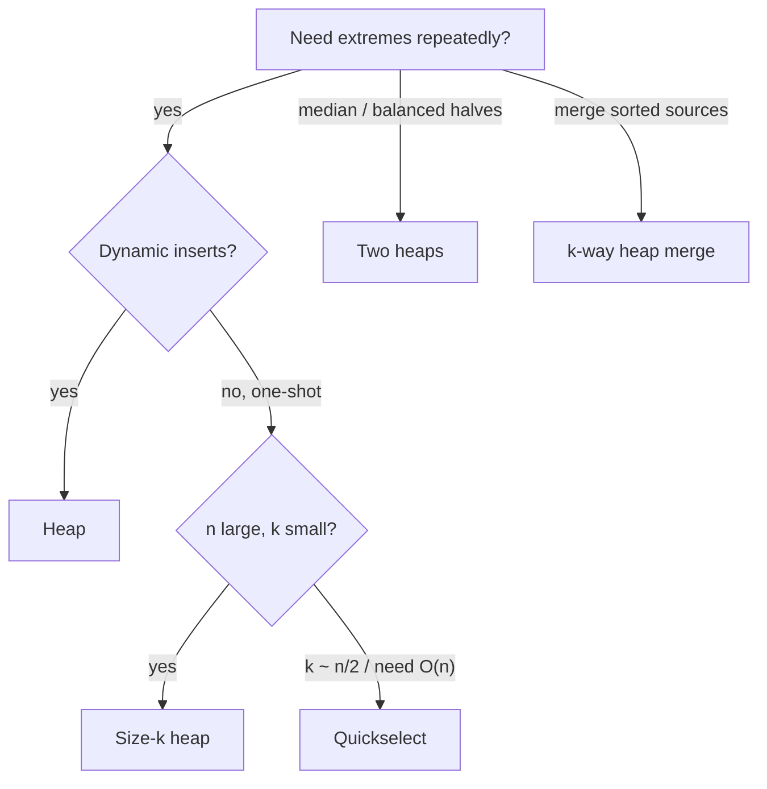

# Heap / priority queue

!!! abstract "At a glance"
    **Priority:** P0 · **Complexity:** 2/5 · **Est. time:** 3 h · **Phase:** 3 · **Prereqs:** [Python idioms](python-idioms.md), [Trees](trees.md)
    **You're done when:** you can pick heap vs quickselect vs sort for top-k in 30 seconds, write two-heap median from memory, and implement lazy deletion.

## Why it matters

A heap gives O(log n) insert and O(log n) extract-min with O(1) peek. It is the workhorse of schedulers, Dijkstra, k-way merges, top-k analytics, and event simulation. Staff-level follow-ups: streaming top-k, distributed top-k, and the limits of a heap (no decrease-key in `heapq`, no arbitrary delete).

## Core concepts

### Pattern recognition signals

| When you see… | Think… |
|---|---|
| "k-th largest/smallest", "top k" | Size-k heap (min-heap for k largest) |
| "median of a stream" | Two heaps (max-heap lower half, min-heap upper half) |
| "merge k sorted" | Heap of (value, source, index) |
| "always process the smallest/most urgent next" | Priority queue / greedy |
| "schedule with cooldown", "reorganise so no two adjacent equal" | Max-heap by frequency + cooldown queue |
| "closest k points", "k pairs with smallest sums" | Heap with a frontier expansion |
| Sliding window median | Two heaps + lazy deletion |

### Template 1: top-k with a bounded heap, O(n log k)

```python
import heapq

def k_largest(nums, k):
    h = []
    for x in nums:
        if len(h) < k:
            heapq.heappush(h, x)
        elif x > h[0]:
            heapq.heapreplace(h, x)       # pop + push in one O(log k) step
    return h                              # h[0] is the k-th largest
```

### Template 2: two heaps for streaming median

```python
class MedianFinder:
    def __init__(self):
        self.lo = []      # max-heap via negatives: lower half
        self.hi = []      # min-heap: upper half

    def add(self, x):
        heapq.heappush(self.lo, -x)
        heapq.heappush(self.hi, -heapq.heappop(self.lo))   # balance through the top
        if len(self.hi) > len(self.lo):
            heapq.heappush(self.lo, -heapq.heappop(self.hi))

    def median(self):
        if len(self.lo) > len(self.hi):
            return -self.lo[0]
        return (-self.lo[0] + self.hi[0]) / 2
```

Invariant: `len(lo) == len(hi)` or `len(lo) == len(hi) + 1`, and `max(lo) <= min(hi)`.

### Template 3: k-way merge / frontier expansion

```python
def k_smallest_pairs(a, b, k):
    if not a or not b: return []
    h = [(a[i] + b[0], i, 0) for i in range(min(k, len(a)))]
    heapq.heapify(h)
    out = []
    while h and len(out) < k:
        _, i, j = heapq.heappop(h)
        out.append([a[i], b[j]])
        if j + 1 < len(b):
            heapq.heappush(h, (a[i] + b[j + 1], i, j + 1))
    return out
```

### Template 4: lazy deletion (no decrease-key / delete in heapq)

```python
class LazyHeap:
    def __init__(self): self.h, self.dead = [], {}
    def push(self, x): heapq.heappush(self.h, x)
    def remove(self, x): self.dead[x] = self.dead.get(x, 0) + 1
    def _clean(self):
        while self.h and self.dead.get(self.h[0], 0):
            self.dead[self.h[0]] -= 1
            heapq.heappop(self.h)
    def peek(self): self._clean(); return self.h[0]
    def pop(self): self._clean(); return heapq.heappop(self.h)
```

Same trick powers Dijkstra with stale entries (skip if `d > dist[u]`).

### Template 5: task scheduler (formula and heap)

```python
from collections import Counter
def least_interval(tasks, n):
    cnt = Counter(tasks).values()
    mx = max(cnt)
    n_max = sum(1 for c in cnt if c == mx)
    return max(len(tasks), (mx - 1) * (n + 1) + n_max)
```

### Comparison: top-k approaches

| Approach | Time | Space | Streaming | Notes |
|---|---|---|---|---|
| Sort | O(n log n) | O(n) | no | Simplest |
| Size-k heap | O(n log k) | O(k) | yes | Default |
| Quickselect | O(n) avg, O(n^2) worst | O(1) in place | no | Mutates input; random pivot |
| Bucket by frequency | O(n) | O(n) | no | Frequency top-k |
| `heapq.nlargest` | O(n log k) | O(k) | yes | One-liner |
| Count-Min + heap | O(n) | sublinear | yes | Approximate at massive scale |



### Common bugs

- Max-heap via negation on tuples: negate only the numeric key.
- Ties comparing non-comparable objects: add a counter `(prio, seq, obj)`.
- Building via n pushes (O(n log n)) when `heapify` is O(n).
- Keeping a max-heap of size k for "k largest" (use a min-heap: the root is the evictable one).
- Two-heap median off-by-one when sizes drift.

### Senior-level nuance

- `heapify` is O(n) because most nodes sit near the bottom and sift only a little (sum of heights is O(n)).
- Binary heap is not stable, and has poor cache behaviour at large sizes; d-ary or pairing heaps trade differently.
- Timer wheels beat heaps for millions of timers with coarse granularity (O(1) insert).

## Resources

| Resource | Type | Why this one | Level | Cost |
|---|---|---|---|---|
| [heapq docs](https://docs.python.org/3/library/heapq.html) | docs | Priority-queue recipes, entry finder, lazy deletion | intermediate | free |
| [NeetCode roadmap: Heap / Priority Queue](https://neetcode.io/roadmap) | video | Clear two-heap median and scheduler explanations | intermediate | freemium |
| [Tech Interview Handbook: Heap](https://www.techinterviewhandbook.org/algorithms/heap/) | article | Corner cases and problem list | intermediate | free |
| [VisuAlgo: Binary heap](https://visualgo.net/en/heap) :gem: | interactive | Watch sift-up/down and O(n) build | intermediate | free |
| [Princeton Algorithms 4e: Priority queues](https://algs4.cs.princeton.edu/home/) | book/site | Rigorous heap analysis and heapsort | advanced | free |
| [Hello Interview: coding patterns](https://www.hellointerview.com/learn/code) | interactive | Top-k and two-heaps pattern explainers | intermediate | freemium |

## Hands-on lab

| # | LC | Problem | Difficulty | Set | Key insight |
|---|---|---|---|---|---|
| 1 | 703 | [Kth Largest Element in a Stream](https://leetcode.com/problems/kth-largest-element-in-a-stream/) | Easy | NC150 | Min-heap of size k; top is the answer. |
| 2 | 1046 | [Last Stone Weight](https://leetcode.com/problems/last-stone-weight/) | Easy | NC150 | Max-heap via negation. |
| 3 | 973 | [K Closest Points to Origin](https://leetcode.com/problems/k-closest-points-to-origin/) | Medium | NC150 | Max-heap of size k on -dist (or quickselect). |
| 4 | 215 | [Kth Largest Element in an Array](https://leetcode.com/problems/kth-largest-element-in-an-array/) | Medium | NC150 | Heap O(n log k) vs quickselect O(n) avg. |
| 5 | 621 | [Task Scheduler](https://leetcode.com/problems/task-scheduler/) | Medium | NC150 | Formula (maxf-1)*(n+1)+countMax, or heap + cooldown queue. |
| 6 | 355 | [Design Twitter](https://leetcode.com/problems/design-twitter/) | Medium | NC150 | Merge k recent-tweet lists with a heap (fan-out on read). |
| 7 | 767 | [Reorganize String](https://leetcode.com/problems/reorganize-string/) | Medium | NC250+ | Greedy: pop top-2 most frequent each step. |
| 8 | 1405 | [Longest Happy String](https://leetcode.com/problems/longest-happy-string/) | Medium | NC250+ | Max-heap; fall back to 2nd if top would make 3 in a row. |
| 9 | 1834 | [Single-Threaded CPU](https://leetcode.com/problems/single-threaded-cpu/) | Medium | NC250+ | Sort by enqueue time + min-heap on (duration, idx). |
| 10 | 373 | [Find K Pairs with Smallest Sums](https://leetcode.com/problems/find-k-pairs-with-smallest-sums/) | Medium | NC250+ | Frontier heap seeded with (a[i], b[0]). |
| 11 | 295 | [Find Median from Data Stream](https://leetcode.com/problems/find-median-from-data-stream/) | Hard | NC150 | Two heaps: max-heap low half, min-heap high half. |
| 12 | 502 | [IPO](https://leetcode.com/problems/ipo/) | Hard | NC250+ | Sort by capital; push affordable into max-heap of profit. |
| 13 | 480 | [Sliding Window Median](https://leetcode.com/problems/sliding-window-median/) | Hard | NC250+ | Two heaps + lazy deletion map. |

**Stretch exercise:** implement a binary min-heap with `decrease_key` using a position map (index map), then use it in Dijkstra and compare with the lazy-deletion version on a random 10^5-edge graph.

## Questions

### L1 — Recall

??? question "Q1. Why is `heapify` O(n) but n pushes O(n log n)?"
    ??? success "Answer"
        Bottom-up heapify sifts each node down by at most its height. Half of the nodes have height 0, a quarter have height 1, and so on, so the sum n/2·0 + n/4·1 + n/8·2 + ... = O(n). Successive pushes sift up from the bottom, where most nodes live, costing up to log n each.

??? question "Q2. Why use a min-heap of size k to find the k largest?"
    ??? success "Answer"
        The root is the smallest of the current top-k, so it is the eviction candidate. Any new element larger than the root replaces it. Comparing against the root is O(1), and replacing is O(log k).

??? question "Q3. What operations does `heapq` lack, and how do you work around them?"
    ??? success "Answer"
        No decrease-key, arbitrary delete, or max-heap. Work-arounds: push a duplicate entry with the new priority and skip stale ones on pop (lazy deletion), negate keys for a max-heap, or write your own indexed heap.

### L2 — Apply

??? question "Q4. Implement K Closest Points to Origin."
    ??? success "Answer"
        ```python
        import heapq
        def k_closest(points, k):
            h = []
            for x, y in points:
                d = -(x * x + y * y)                    # max-heap of size k
                if len(h) < k:
                    heapq.heappush(h, (d, x, y))
                elif d > h[0][0]:
                    heapq.heapreplace(h, (d, x, y))
            return [[x, y] for _, x, y in h]
        ```
        O(n log k). Quickselect gives O(n) average. Skip the sqrt (monotone).

??? question "Q5. Trace the two-heap median for the stream 5, 15, 1, 3."
    ??? success "Answer"
        add 5: lo=[5], median 5. add 15: lo=[5], hi=[15], median 10. add 1: 1 moves through lo then rebalances, lo=[5,1], hi=[15], median 5. add 3: lo=[3,1], hi=[5,15], median (3+5)/2 = 4.

??? question "Q6. Implement Reorganize String."
    ??? success "Answer"
        ```python
        import heapq
        from collections import Counter
        def reorganize(s):
            h = [(-c, ch) for ch, c in Counter(s).items()]
            heapq.heapify(h)
            out, prev = [], (0, "")
            while h:
                c, ch = heapq.heappop(h)
                out.append(ch)
                if prev[0] < 0:
                    heapq.heappush(h, prev)
                prev = (c + 1, ch)
            res = "".join(out)
            return res if len(res) == len(s) else ""
        ```
        Holding the last used char out of the heap for one step guarantees no adjacent duplicates. O(n log σ).

### L3 — Design & trade-offs

??? question "Q7. Kth largest in an array: heap vs quickselect vs sort. Choose."
    ??? success "Answer"
        One-shot, in-memory, mutation OK: quickselect (random pivot or median-of-medians for guaranteed O(n)). Streaming or k small relative to n: size-k heap, O(n log k) and O(k) memory. Need the full sorted output anyway: sort. Say adversarial input can push naive quickselect to O(n^2).

??? question "Q8. Merge k sorted lists: heap vs pairwise divide and conquer?"
    ??? success "Answer"
        Both O(N log k). Heap: O(k) space, works on streams and lazily (an iterator yields as it goes). D&C: O(1) extra for linked lists and better locality, but eager. For huge sorted files on disk, use the heap-based k-way merge with buffered reads.

??? question "Q9. Task Scheduler: formula vs simulation with a heap. When do you use each?"
    ??? success "Answer"
        The formula `max(len(tasks), (maxf-1)*(n+1) + count_max)` is O(n) and elegant, but only answers the length. Use the heap simulation if you must output the schedule, or the requirements change (per-task cooldowns, priorities, deadlines), where the formula no longer applies.

### L4 — Staff-level ambiguity

??? question "Q10. Top 100 trending hashtags over the last hour, 2M events/sec, globally. Design it."
    ??? success "Answer"
        Per-ingest-node sliding windows using per-minute Count-Min sketches (or Space-Saving) with a local heap of candidates, shipped every few seconds. A merge tier adds the sketches (CMS is linearly mergeable), then a heap yields the top 100. Expire by dropping the oldest minute bucket. Accuracy trade-off: CMS overestimates, so keep exact counts for the candidate set with a second pass if needed. Handle skew (hot keys) and bots (dedupe by user). Kafka partitions by hashtag give exact per-tag counts at the cost of hot partitions. Say which trade-off you choose and why.

??? question "Q11. A job scheduler uses `heapq` with 50M timers and p99 insert latency is growing. What do you do?"
    ??? success "Answer"
        Profile: O(log n) with cache misses on a large array; GC pressure from tuples. Options: hierarchical timer wheels (O(1) insert/expire, coarse granularity, as in Kafka's purgatory and Linux timers), batch insertion with heapify, sharding by hash across workers, or moving to a database-backed delay queue (Redis ZSET, Postgres SKIP LOCKED). Choose by required precision and durability.

## Real-world use cases

- **Schedulers:** OS run queues, Kubernetes scheduling queue, Celery ETA tasks.
- **Analytics:** top-k errors, slowest endpoints, heavy hitters.
- **Search/DB:** k-way merge in LSM compaction and external sort; top-k retrieval in vector search uses bounded heaps.
- **Logistics:** dispatch the most urgent container/vessel first, with priority by ETA and penalty.

## Pitfalls & anti-patterns

- Sorting the whole dataset for a top-3.
- Reaching for a heap when a hash count plus bucket sort is O(n).
- Missing tie-break counters.
- Forgetting lazy deletion, or leaving stale entries forever (memory leak).

## Checklist

- [ ] I can write two-heap median and lazy deletion from memory
- [ ] I can justify heap vs quickselect vs sort for a given constraint
- [ ] I solved 295 and 621 unaided within 35 min
- [ ] I answered all L3 questions out loud in < 3 min each
