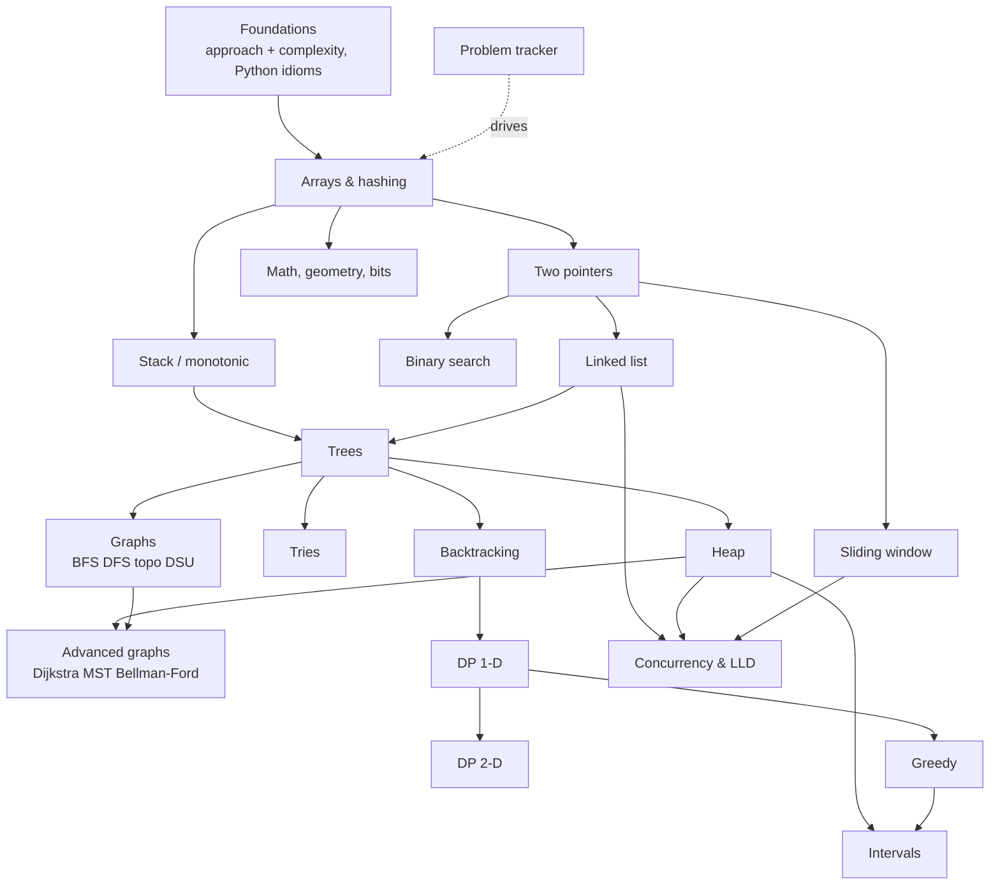

# DSA track: interview-grade data structures & algorithms (Python)

Goal: get from "rusty" to solving LeetCode-Medium in 25 minutes and Hard in 40, with clear communication, for FAANG-tier and Staff coding rounds. 21 topics (18 pattern pages, 2 foundations, 1 tracker), about 60 hours over 24 weeks, plus a spaced-repetition re-solve queue.

## Reading order

Read top to bottom; each page's *You're done when* line is the exit check before moving on.

1. [Problem-solving approach & complexity analysis](approach-complexity.md) — P0, ~2 h
2. [Python idioms for interviews](python-idioms.md) — P0, ~1 h
3. [Arrays & hashing](arrays-hashing.md) — P0, ~4 h
4. [Two pointers](two-pointers.md) — P0, ~3 h
5. [Sliding window](sliding-window.md) — P0, ~3 h
6. [Stack & monotonic stack](stack.md) — P0, ~3 h
7. [Binary search (incl. on answer)](binary-search.md) — P0, ~3 h
8. [Linked list](linked-list.md) — P0, ~3 h
9. [Trees: DFS, BFS, BST](trees.md) — P0, ~5 h
10. [Tries](tries.md) — P1, ~2 h
11. [Heap / priority queue](heap.md) — P0, ~3 h
12. [Backtracking](backtracking.md) — P0, ~4 h
13. [Graphs: BFS, DFS, topological sort, union-find](graphs.md) — P0, ~5 h
14. [Advanced graphs: Dijkstra, MST, Bellman-Ford](advanced-graphs.md) — P1, ~4 h
15. [Dynamic programming 1-D](dp-1d.md) — P0, ~5 h
16. [Dynamic programming 2-D](dp-2d.md) — P0, ~5 h
17. [Greedy](greedy.md) — P0, ~3 h
18. [Intervals](intervals.md) — P0, ~2 h
19. [Math, geometry & bit manipulation](math-bits.md) — P1, ~2 h
20. [Concurrency & low-level design problems (LRU, rate limiter, parking lot)](concurrency-lld.md) — P0, ~4 h
21. [NeetCode 250 problem tracker](problem-tracker.md) — P0, ~0 h

## Study method for experienced engineers

You do not need to *learn* what a hash map is. You need three things back: **pattern recognition speed**, **fluency writing correct code without an IDE**, and **communication under a clock**.

1. **Pattern first, problem second.** Read the pattern page's recognition table and template *before* the problem set. Then solve with a timer (25-35 min).
2. **Derive, don't memorise.** For each template ask: what is the invariant, and why is discarding this state safe? Interviewers at Staff level probe exactly that.
3. **Always brute force, then optimise, out loud.** Practise the [6-step loop](approach-complexity.md) on every problem, even alone (record yourself weekly).
4. **Spaced repetition beats volume.** Failed or slow problems come back on day 1, 3, 7, 21 (rules in the [tracker](problem-tracker.md)). Retire a problem only after a clean unaided solve.
5. **Write the Staff follow-up.** For every pattern, answer "scale it, stream it, distribute it, make it concurrent" using the L4 questions on each page. This is what separates Staff from Senior rounds.
6. **Mocks from week 4.** One 45-minute mock at each checkpoint (weeks 4/8/12/16/20), weekly in the last four weeks. Use a peer or [interviewing.io](https://interviewing.io/).
7. **Keep a bug log.** Categorise each failure: pattern-miss, edge case, off-by-one, complexity mistake, communication. Attack the top category.

!!! tip "Time-box"
    25-35 minutes on a first attempt, then read the solution, close it, and re-implement from memory. See the [tracker](problem-tracker.md) for the full rule.

## Pattern map

## Topic table

| Topic | Priority | Complexity | Phase | Hours |
|---|---|---|---|---|
| [Problem-solving approach & complexity analysis](approach-complexity.md) | P0 | 1 | 0 | 2 |
| [Python idioms for interviews](python-idioms.md) | P0 | 1 | 0 | 1 |
| [Arrays & hashing](arrays-hashing.md) | P0 | 1 | 1 | 4 |
| [Two pointers](two-pointers.md) | P0 | 2 | 1 | 3 |
| [Sliding window](sliding-window.md) | P0 | 2 | 1 | 3 |
| [Stack & monotonic stack](stack.md) | P0 | 2 | 1 | 3 |
| [Binary search (incl. on answer)](binary-search.md) | P0 | 2 | 2 | 3 |
| [Linked list](linked-list.md) | P0 | 2 | 2 | 3 |
| [Trees: DFS, BFS, BST](trees.md) | P0 | 3 | 2 | 5 |
| [Tries](tries.md) | P1 | 3 | 3 | 2 |
| [Heap / priority queue](heap.md) | P0 | 2 | 3 | 3 |
| [Backtracking](backtracking.md) | P0 | 3 | 3 | 4 |
| [Graphs: BFS, DFS, topological sort, union-find](graphs.md) | P0 | 3 | 3 | 5 |
| [Advanced graphs: Dijkstra, MST, Bellman-Ford](advanced-graphs.md) | P1 | 4 | 4 | 4 |
| [Dynamic programming 1-D](dp-1d.md) | P0 | 4 | 4 | 5 |
| [Dynamic programming 2-D](dp-2d.md) | P0 | 4 | 5 | 5 |
| [Greedy](greedy.md) | P0 | 3 | 5 | 3 |
| [Intervals](intervals.md) | P0 | 2 | 5 | 2 |
| [Math, geometry & bit manipulation](math-bits.md) | P1 | 2 | 5 | 2 |
| [Concurrency & LLD problems](concurrency-lld.md) | P0 | 3 | 6 | 4 |
| [NeetCode 250 problem tracker](problem-tracker.md) | P0 | 1 | 1 | 0 (ongoing) |
| [Question bank (cross-topic)](questions.md) | | | | |

Hours are reading plus lab time per topic. The problem sets themselves are scheduled in the tracker (about 7-12 problems per week, 25-35 minutes each) and are the bulk of the DSA time budget.

## Weekly cadence (DSA slice of a 12-15 h/week plan)

| Day | DSA activity | Time |
|---|---|---|
| Mon-Fri | 1-2 new timed problems from the tracker, notes on key insight | 30-45 min/day |
| Wed | Re-solve queue (due R1-R4 items) | 30 min |
| Sat | Two harder problems, talk aloud, no IDE | 60-90 min |
| Sun | Re-solve queue, tracker update, read one L3/L4 question and answer it aloud | 45 min |
| Checkpoint weeks (4/8/12/16/20) | Revision + 45-min mock | as planned |
| Week 24 | Mock interviews only | |

## How the phases map onto the roadmap

| Phase | Weeks (approx.) | DSA topics |
|---|---|---|
| 0 | pre-start | Approach & complexity, Python idioms |
| 1 | 1-4 | Arrays & hashing, two pointers, sliding window, stack |
| 2 | 5-8 | Binary search, linked list, trees |
| 3 | 9-12 | Tries, heap, backtracking, graphs |
| 4 | 13-16 | Advanced graphs, DP 1-D |
| 5 | 17-20 | DP 2-D, greedy, intervals, math and bits |
| 6 | 21-23 | Concurrency and LLD, Staff follow-ups |
| 7 | 24 | Mock interviews |

The exact week numbers in the tracker are derived from these phases. Adjust them when `curriculum.yml` changes.

## What "Staff-level" adds

- **Follow-ups:** scale it, stream it, distribute it, make it concurrent. Every pattern page has L4 questions on these.
- **Trade-off language:** "hash map is O(n) space; sort is O(1) extra but loses indices; here's when I'd choose each."
- **Production mapping:** each page lists real-world use cases (rate limiters, LSM compaction, routing, entity resolution) so answers sound like an engineer, not a student.
- **Communication:** see the scripts in the [question bank](questions.md#interview-communication-scripts).

## Practice for this chapter

The [problem tracker](problem-tracker.md) is this chapter's practice; work it alongside the patterns above, not after finishing them.

Interview prep: 15 low-level-design prompts (concurrency, LRU, rate limiters) live in [Staff+ → Interview prep](../staff-skills/interview-prep/mock-prompts.md#low-level-design-15), scored with the [unified rubric](../staff-skills/interview-prep/rubric.md).

## Resources summary

The machine-readable list is in `data/resources/dsa.yml`. Highlights:

| Need | Best resource |
|---|---|
| Structured practice path | [NeetCode roadmap](https://neetcode.io/roadmap) and [practice list](https://neetcode.io/practice) |
| Pattern explanations (paid, visual) | [Coding Interview Patterns (ByteByteGo)](https://bytebytego.com/courses/coding-patterns) |
| Free interview playbook | [Tech Interview Handbook](https://www.techinterviewhandbook.org/coding-interview-techniques/) |
| Rigorous free theory :gem: | [Jeff Erickson, Algorithms](https://jeffe.cs.illinois.edu/teaching/algorithms/) |
| Competitive-programming-grade articles :gem: | [cp-algorithms](https://cp-algorithms.com/) |
| Visualise structures | [VisuAlgo](https://visualgo.net/en), [USFCA visualisations](https://www.cs.usfca.edu/~galles/visualization/Algorithms.html) |
| Extra graded DP :gem: | [AtCoder Educational DP Contest](https://atcoder.jp/contests/dp) |
| Mock interviews | [interviewing.io](https://interviewing.io/), peers |
| Python reference | [heapq](https://docs.python.org/3/library/heapq.html), [bisect](https://docs.python.org/3/library/bisect.html), [collections](https://docs.python.org/3/library/collections.html) |

Note on LeetCode links: leetcode.com blocks scripted link checkers with HTTP 403, so problem links across this track were built from official title slugs and not machine-verified. Verify by number if one does not resolve.
