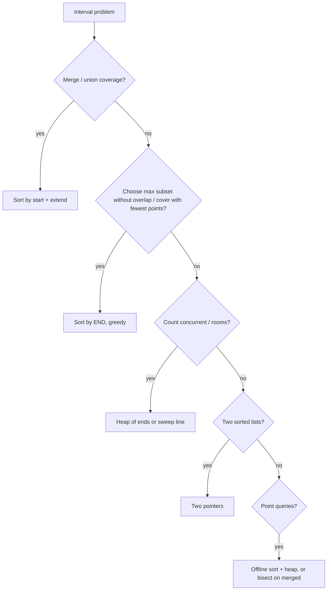

# Intervals

!!! abstract "At a glance"
    **Priority:** P0 · **Complexity:** 2/5 · **Est. time:** 2 h · **Phase:** 5 · **Prereqs:** [Two pointers](two-pointers.md), [Heap](heap.md), [Greedy](greedy.md)
    **You're done when:** you can decide "sort by start vs end, merge vs sweep vs heap" for any interval problem in one minute, and write the overlap condition without off-by-one errors.

## Why it matters

Interval problems are pervasive in scheduling, calendars, resource booking, time-series windows, IP-range allow lists, and price-validity periods. They test whether you sort by the right key and reason about overlap precisely. Most are Easy/Medium but candidates fail on the boundary conditions (touching intervals: `[1,2]` and `[2,3]`?), which is why you always clarify closed vs half-open ranges.

## Core concepts

### Pattern recognition signals

| When you see… | Think… |
|---|---|
| "merge overlapping" | Sort by start, extend the last end |
| "insert into sorted non-overlapping" | Three-phase linear scan |
| "min removals so none overlap", "max meetings attended", "min arrows" | Sort by **end**, greedy |
| "min rooms/platforms", "max concurrent" | Min-heap of ends, or sweep line events |
| "intersection of two lists of intervals" | Two pointers |
| "free time / gaps" | Merge, then look at gaps between merged ranges |
| "query: smallest interval containing point" | Offline: sort queries + heap |
| "calendar booking with dynamic inserts" | Sorted list + bisect, or a balanced tree |

### Overlap rules (always clarify!)

For closed intervals `[a, b]` and `[c, d]`: they overlap iff `a <= d and c <= b`. For half-open `[a, b)`: iff `a < d and c < b`. Touching endpoints such as `[1,2]` and `[2,3]` merge in Merge Intervals (closed) but do **not** conflict in Meeting Rooms (half-open).

### Template 1: merge intervals

```python
def merge(intervals):
    intervals.sort(key=lambda x: x[0])
    out = []
    for s, e in intervals:
        if out and s <= out[-1][1]:
            out[-1][1] = max(out[-1][1], e)
        else:
            out.append([s, e])
    return out
```

### Template 2: insert interval (no sort needed, O(n))

```python
def insert(intervals, new):
    res, i, n = [], 0, len(intervals)
    while i < n and intervals[i][1] < new[0]:          # entirely before
        res.append(intervals[i]); i += 1
    while i < n and intervals[i][0] <= new[1]:         # overlapping: absorb
        new = [min(new[0], intervals[i][0]), max(new[1], intervals[i][1])]
        i += 1
    res.append(new)
    res.extend(intervals[i:])                          # entirely after
    return res
```

### Template 3: minimum rooms (heap) and sweep line

```python
import heapq
def min_meeting_rooms(intervals):
    intervals.sort()
    ends = []
    for s, e in intervals:
        if ends and ends[0] <= s:
            heapq.heapreplace(ends, e)                 # reuse the room
        else:
            heapq.heappush(ends, e)                    # need a new room
    return len(ends)

def max_overlap(intervals):                            # sweep line
    events = []
    for s, e in intervals:
        events.append((s, 1)); events.append((e, -1))  # end before start on ties: (e,-1) sorts first
    events.sort()
    cur = best = 0
    for _, d in events:
        cur += d; best = max(best, cur)
    return best
```

### Template 4: activity selection (sort by end)

```python
def min_arrows(points):
    points.sort(key=lambda p: p[1])
    arrows, end = 0, float('-inf')
    for s, e in points:
        if s > end:                    # not covered by the last arrow
            arrows += 1; end = e
    return arrows
```

### Template 5: interval list intersections (two pointers)

```python
def interval_intersection(A, B):
    i = j = 0; res = []
    while i < len(A) and j < len(B):
        lo, hi = max(A[i][0], B[j][0]), min(A[i][1], B[j][1])
        if lo <= hi:
            res.append([lo, hi])
        if A[i][1] < B[j][1]: i += 1
        else: j += 1                   # advance the one that ends first
    return res
```

### Template 6: offline queries (Minimum Interval to Include Each Query)

```python
def min_interval(intervals, queries):
    intervals.sort()
    h, res, i = [], {}, 0
    for q in sorted(queries):
        while i < len(intervals) and intervals[i][0] <= q:
            l, r = intervals[i]
            heapq.heappush(h, (r - l + 1, r)); i += 1
        while h and h[0][1] < q:                       # expired: lazy deletion
            heapq.heappop(h)
        res[q] = h[0][0] if h else -1
    return [res[q] for q in queries]
```

### Technique table

| Problem | Sort key | Structure | Time |
|---|---|---|---|
| Merge intervals (56) | start | scan | O(n log n) |
| Insert interval (57) | none (sorted input) | scan | O(n) |
| Non-overlapping (435), arrows (452) | end | greedy | O(n log n) |
| Meeting rooms II (253) | start | min-heap of ends | O(n log n) |
| Max concurrent | events | sweep | O(n log n) |
| Intersections (986) | none | two pointers | O(n + m) |
| Min interval per query (1851) | start (+ queries) | heap + lazy delete | O((n+q) log n) |
| Employee free time (759) | start | merge, gaps | O(n log n) |



### Common bugs

- Sorting by the wrong key (start vs end).
- Closed vs half-open endpoint confusion. Sort event ties so ends come before starts when touching intervals don't conflict.
- Merging without `max()` on the end (the case where one interval contains another).
- Mutating input intervals unexpectedly, and aliasing when you append the input list itself.
- Heap tie comparisons on lists.

## Resources

| Resource | Type | Why this one | Level | Cost |
|---|---|---|---|---|
| [NeetCode roadmap: Intervals](https://neetcode.io/roadmap) | video | Short, clear diagrams of each overlap case | intermediate | freemium |
| [Tech Interview Handbook: Interval](https://www.techinterviewhandbook.org/algorithms/interval/) | article | Corner cases and problem list | intermediate | free |
| [Jeff Erickson, ch. 4: Greedy (scheduling)](https://jeffe.cs.illinois.edu/teaching/algorithms/book/04-greedy.pdf) :gem: | book | Proof of interval scheduling and colouring | advanced | free |
| [Python bisect docs](https://docs.python.org/3/library/bisect.html) | docs | Booking/calendar problems | intermediate | free |
| [sortedcontainers docs](https://grantjenks.com/docs/sortedcontainers/) :gem: | docs | SortedList for dynamic interval sets | advanced | free |
| [Hello Interview: coding patterns](https://www.hellointerview.com/learn/code) | interactive | Interval pattern walkthroughs | intermediate | freemium |

## Hands-on lab

| # | LC | Problem | Difficulty | Set | Key insight |
|---|---|---|---|---|---|
| 1 | 252 | [Meeting Rooms](https://leetcode.com/problems/meeting-rooms/) | Easy | NC150 | Sort by start; any overlap -> false. (Premium) |
| 2 | 56 | [Merge Intervals](https://leetcode.com/problems/merge-intervals/) | Medium | NC150 | Sort by start; extend last end with max. |
| 3 | 57 | [Insert Interval](https://leetcode.com/problems/insert-interval/) | Medium | NC150 | Three phases: before, overlapping (merge), after. |
| 4 | 435 | [Non-overlapping Intervals](https://leetcode.com/problems/non-overlapping-intervals/) | Medium | NC150 | Sort by end; keep earliest-finishing (activity selection). |
| 5 | 452 | [Minimum Number of Arrows to Burst Balloons](https://leetcode.com/problems/minimum-number-of-arrows-to-burst-balloons/) | Medium | NC250+ | Sort by end; new arrow when start > last end. |
| 6 | 253 | [Meeting Rooms II](https://leetcode.com/problems/meeting-rooms-ii/) | Medium | NC150 | Min-heap of end times, or sweep +1/-1 events. (Premium) |
| 7 | 986 | [Interval List Intersections](https://leetcode.com/problems/interval-list-intersections/) | Medium | NC250+ | Two pointers; advance the one that ends first. |
| 8 | 1288 | [Remove Covered Intervals](https://leetcode.com/problems/remove-covered-intervals/) | Medium | NC250+ | Sort (start asc, end desc); track max end. |
| 9 | 729 | [My Calendar I](https://leetcode.com/problems/my-calendar-i/) | Medium | NC250+ | Sorted list + bisect for neighbour overlap check. |
| 10 | 1851 | [Minimum Interval to Include Each Query](https://leetcode.com/problems/minimum-interval-to-include-each-query/) | Hard | NC150 | Offline: sort queries, heap of (size, end) with lazy pops. |
| 11 | 759 | [Employee Free Time](https://leetcode.com/problems/employee-free-time/) | Hard | NC250+ | Merge all intervals; gaps are the answer. (Premium) |

**Stretch exercise:** implement `MyCalendarThree` (k-booking) with a sorted map of boundary deltas, then with a segment tree. Compare complexity as bookings grow to 10^5.

## Questions

### L1 — Recall

??? question "Q1. Why sort by end time for 'maximum non-overlapping intervals' but by start for merging?"
    ??? success "Answer"
        Merging needs to see intervals in order of where they begin, so the current merged range can only be extended by intervals starting within it. Selection maximises the number kept, and picking the earliest finish leaves the most remaining room (exchange argument).

??? question "Q2. Two intervals overlap when…?"
    ??? success "Answer"
        Closed: `a <= d and c <= b`. Half-open: `a < d and c < b`. Equivalent: not (one ends before the other starts).

??? question "Q3. Complexity of Insert Interval when the input is already sorted?"
    ??? success "Answer"
        O(n): a single pass with three phases, no sorting.

### L2 — Apply

??? question "Q4. Implement Non-overlapping Intervals."
    ??? success "Answer"
        See `erase_overlap` in the [greedy page](greedy.md): sort by end, keep an interval when `start >= last_end`, and the answer is `n - kept`. O(n log n).

??? question "Q5. Trace Merge Intervals on [[1,3],[2,6],[8,10],[15,18]]."
    ??? success "Answer"
        Sorted already. [1,3] starts the output. [2,6]: 2 ≤ 3 so end becomes 6. [8,10]: 8 > 6, so append. [15,18]: append. Result [[1,6],[8,10],[15,18]].

??? question "Q6. Implement My Calendar I."
    ??? success "Answer"
        ```python
        from bisect import bisect_left
        class MyCalendar:
            def __init__(self): self.starts, self.ends = [], []
            def book(self, s, e):
                i = bisect_left(self.starts, s)
                if i > 0 and self.ends[i - 1] > s: return False   # previous overlaps
                if i < len(self.starts) and self.starts[i] < e: return False
                self.starts.insert(i, s); self.ends.insert(i, e)
                return True
        ```
        O(log n) search, but O(n) list insert. Use a `SortedList` or a tree for O(log n) inserts.

### L3 — Design & trade-offs

??? question "Q7. Meeting Rooms II: heap vs sweep vs sorted starts/ends two-pointer. Choose."
    ??? success "Answer"
        Heap of end times: intuitive, and it can also assign rooms. Sweep: minimal code, counts max concurrency only. Two sorted arrays (starts and ends) with two pointers: O(n log n) for the sorts, O(1) extra space beyond them. If asked to return the room assignment, use the heap. If the question is capacity only, use the sweep.

??? question "Q8. How do you handle intervals with millions of updates per second (a booking system)?"
    ??? success "Answer"
        In-memory sorted structures don't scale across nodes. Partition by resource (a room, a vessel berth), because conflicts are per-resource. Within a partition use an interval tree or a sorted set. Correctness across concurrent requests needs serialisable per-resource checks: optimistic concurrency with a version, or a DB exclusion constraint (Postgres `EXCLUDE USING gist` with `tstzrange`), which enforces no-overlap atomically. State the trade-off: DB constraints are simple and correct but bound write throughput per resource.

??? question "Q9. When is a segment tree or interval tree needed instead of sorting?"
    ??? success "Answer"
        When intervals are inserted/deleted dynamically and you need repeated stabbing queries ("which intervals contain t?") or range aggregates (k-booking max overlap). Sorting works for static or offline cases. An interval tree gives O(log n + k) stabbing queries. A segment tree with lazy propagation gives range add and max in O(log n).

### L4 — Staff-level ambiguity

??? question "Q10. Design a meeting-room booking service for a 50,000-person company across 200 buildings, with recurring meetings and time zones."
    ??? success "Answer"
        Data model: rooms are the partition key, and events are stored with UTC ranges plus an RRULE for recurrence (expand lazily within a horizon window, store exceptions). Conflict check: the DB exclusion constraint over expanded occurrences in a materialised window (say 12 months), with a background job extending the window. Search ("find a free room for these attendees in this range"): per-building free/busy indexes, and merge attendees' busy intervals (the merge algorithm) then intersect with room availability (two pointers). Time zones and DST: store the zone id with recurrences and compute occurrences in local time. Scale: read-heavy, so cache the free/busy per room per day with invalidation on write. Talk about idempotent booking requests and fairness under contention.

??? question "Q11. Given 10^9 IP-range allow/deny rules, how would you check an IP quickly?"
    ??? success "Answer"
        Normalise the rules to merged, non-overlapping, sorted ranges (Merge Intervals with precedence rules), then binary search the range list, O(log n). For frequent updates, use a radix trie (CIDR) or an interval tree. Memory: 10^9 ranges × 8–16 bytes is 8–16 GB, so shard by the top octets or use a compressed radix trie, since CIDR aggregation collapses adjacent ranges. In production, add a small hot-set cache. State the update model (batch rebuild plus atomic swap) and how to test rule precedence.

## Real-world use cases

- **Calendars and booking:** meeting rooms, berth and yard slot booking, driver shifts.
- **Time-series and billing:** merging validity periods (tariffs with effective-from and effective-to dates), overlapping-price detection.
- **Networking/security:** IP allow-list range merging.
- **Observability:** merging alert-active windows to compute downtime.

## Pitfalls & anti-patterns

- Not clarifying inclusive vs exclusive endpoints.
- Sorting by start when the greedy needs end.
- O(n²) pairwise overlap checks on large inputs.
- Ignoring time zones and DST in real-world recurrence.

## Checklist

- [ ] I can write merge, insert, min-rooms and activity selection from memory
- [ ] I always state the endpoint convention before coding
- [ ] I solved 1851 with the offline heap approach
- [ ] I answered all L3 questions out loud in < 3 min each
