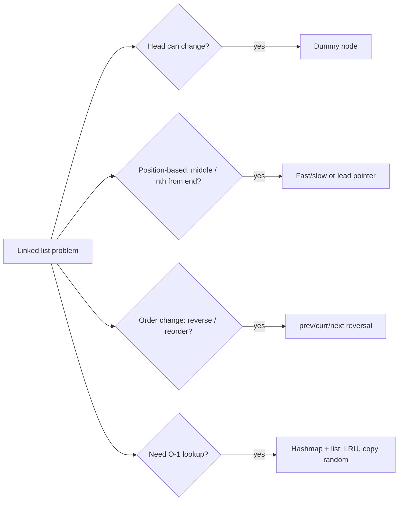

# Linked list

!!! abstract "At a glance"
    **Priority:** P0 · **Complexity:** 2/5 · **Est. time:** 3 h · **Phase:** 2 · **Prereqs:** [Two pointers](two-pointers.md)
    **You're done when:** you can reverse a list (iteratively and recursively), find the middle, detect a cycle entry with Floyd, and build LRU Cache from a hashmap + doubly linked list in < 25 min.

## Why it matters

Linked lists rarely appear in modern application code, but interviewers use them to test **pointer discipline**: can you manipulate references without losing nodes, handle head/tail edge cases, and reason about invariants? The composite structures matter a lot in systems: LRU caches (hash + DLL), free lists in allocators, skip lists (Redis sorted sets), LSM memtables, and intrusive lists in kernels. Floyd's cycle detection generalises to any functional graph (LC 287, Happy Number, Pollard's rho).

## Core concepts

### Pattern recognition signals

| When you see… | Think… |
|---|---|
| Head might change (delete/insert at front, merge) | Dummy/sentinel head |
| "middle", "n-th from end", "palindrome" | Fast/slow pointers, lead pointer |
| "cycle", "duplicate in 1..n without modifying" | Floyd tortoise and hare |
| "reverse", "reorder", "k-group" | In-place reversal (prev/curr/next) |
| "merge k sorted" | Heap or divide and conquer |
| O(1) get + O(1) evict least-recent | Hashmap + doubly linked list (LRU) |
| Deep copy with extra pointers | old→new map, or interleaving |

### Template 1: reverse (iterative and recursive)

```python
def reverse(head):
    prev, cur = None, head
    while cur:
        cur.next, prev, cur = prev, cur, cur.next   # careful: RHS evaluated first
    return prev

def reverse_rec(head):
    if not head or not head.next:
        return head
    new_head = reverse_rec(head.next)
    head.next.next = head
    head.next = None
    return new_head
```

### Template 2: fast/slow (middle, cycle, cycle entry)

```python
def middle(head):                      # second middle for even length
    slow = fast = head
    while fast and fast.next:
        slow, fast = slow.next, fast.next.next
    return slow

def cycle_entry(head):
    slow = fast = head
    while fast and fast.next:
        slow, fast = slow.next, fast.next.next
        if slow is fast:               # meeting point
            p = head
            while p is not slow:       # distance head->entry == meet->entry (mod cycle)
                p, slow = p.next, slow.next
            return p
    return None
```

### Template 3: dummy head + merge

```python
def merge(a, b):
    dummy = tail = ListNode()
    while a and b:
        if a.val <= b.val:
            tail.next, a = a, a.next
        else:
            tail.next, b = b, b.next
        tail = tail.next
    tail.next = a or b
    return dummy.next
```

### Template 4: LRU cache (hash + DLL with sentinels), O(1) per op

```python
class Node:
    __slots__ = ("key", "val", "prev", "next")
    def __init__(self, key=0, val=0):
        self.key, self.val, self.prev, self.next = key, val, None, None

class LRUCache:
    def __init__(self, capacity):
        self.cap, self.map = capacity, {}
        self.head, self.tail = Node(), Node()          # sentinels
        self.head.next, self.tail.prev = self.tail, self.head

    def _remove(self, n):
        n.prev.next, n.next.prev = n.next, n.prev

    def _add_front(self, n):
        n.prev, n.next = self.head, self.head.next
        self.head.next.prev = n
        self.head.next = n

    def get(self, key):
        if key not in self.map:
            return -1
        n = self.map[key]
        self._remove(n); self._add_front(n)
        return n.val

    def put(self, key, val):
        if key in self.map:
            self._remove(self.map[key])
        n = Node(key, val)
        self.map[key] = n
        self._add_front(n)
        if len(self.map) > self.cap:
            lru = self.tail.prev
            self._remove(lru)
            del self.map[lru.key]                      # why the node stores key
```

In an interview, mention `OrderedDict.move_to_end` / `popitem(last=False)` as the 10-line version, then build the DLL if asked.

### Template 5: reverse k-group

```python
def reverse_k_group(head, k):
    dummy = ListNode(0, head)
    group_prev = dummy
    while True:
        kth = group_prev
        for _ in range(k):
            kth = kth.next
            if not kth:
                return dummy.next
        group_next = kth.next
        prev, cur = group_next, group_prev.next      # reverse [group_prev.next .. kth]
        while cur is not group_next:
            cur.next, prev, cur = prev, cur, cur.next
        first = group_prev.next
        group_prev.next = kth
        group_prev = first
```

### Comparison: technique by problem

| Technique | Problems | Space |
|---|---|---|
| Dummy head | 21, 19, 2, 92, 25 | O(1) |
| Fast/slow | 141, 142, 876, 234, 143, 287 | O(1) |
| Reverse in place | 206, 92, 234, 143, 25 | O(1) |
| Hashmap of nodes | 138, 146 | O(n) |
| Heap / D&C | 23 | O(k) / O(log k) |



### Common bugs

- Losing the rest of the list by overwriting `cur.next` before saving it.
- The tuple-assignment order in Python: `cur.next, prev, cur = prev, cur, cur.next` works because the RHS is evaluated first, but reordering the LHS can break it. Know why.
- Forgetting to set the old head's `next = None`, creating a cycle.
- `while fast.next` without checking `fast` first.
- LRU: not storing the key in the node, so you can't delete the map entry on eviction.

## Resources

| Resource | Type | Why this one | Level | Cost |
|---|---|---|---|---|
| [NeetCode roadmap: Linked List](https://neetcode.io/roadmap) | video | Clear pointer diagrams for 143, 25 and 146 | intermediate | freemium |
| [Tech Interview Handbook: Linked list](https://www.techinterviewhandbook.org/algorithms/linked-list/) | article | Techniques list (dummy, two pointers, reversal) | intermediate | free |
| [VisuAlgo: Linked list](https://visualgo.net/en/list) | interactive | Step-by-step pointer animation | intermediate | free |
| [cp-algorithms: Floyd's cycle finding](https://cp-algorithms.com/others/tortoise_and_hare.html) :gem: | article | Proof of the cycle-entry distance argument | advanced | free |
| [Python collections: OrderedDict](https://docs.python.org/3/library/collections.html) | docs | `move_to_end`, `popitem(last=False)` for LRU | intermediate | free |
| [Python Tutor](https://pythontutor.com/) :gem: | interactive | Visualise your own pointer code object by object | intermediate | free |

## Hands-on lab

| # | LC | Problem | Difficulty | Set | Key insight |
|---|---|---|---|---|---|
| 1 | 206 | [Reverse Linked List](https://leetcode.com/problems/reverse-linked-list/) | Easy | NC150 | prev/curr/next triple; also do it recursively. |
| 2 | 21 | [Merge Two Sorted Lists](https://leetcode.com/problems/merge-two-sorted-lists/) | Easy | NC150 | Dummy head removes edge cases. |
| 3 | 141 | [Linked List Cycle](https://leetcode.com/problems/linked-list-cycle/) | Easy | NC150 | Floyd: fast meets slow iff cycle. |
| 4 | 234 | [Palindrome Linked List](https://leetcode.com/problems/palindrome-linked-list/) | Easy | NC250+ | Find middle, reverse second half, compare. |
| 5 | 143 | [Reorder List](https://leetcode.com/problems/reorder-list/) | Medium | NC150 | Middle + reverse + interleave merge. |
| 6 | 19 | [Remove Nth Node From End of List](https://leetcode.com/problems/remove-nth-node-from-end-of-list/) | Medium | NC150 | Lead pointer n ahead, from a dummy. |
| 7 | 138 | [Copy List with Random Pointer](https://leetcode.com/problems/copy-list-with-random-pointer/) | Medium | NC150 | old->new map (or interleave copies for O(1) space). |
| 8 | 2 | [Add Two Numbers](https://leetcode.com/problems/add-two-numbers/) | Medium | NC150 | Carry loop continues while l1 or l2 or carry. |
| 9 | 287 | [Find the Duplicate Number](https://leetcode.com/problems/find-the-duplicate-number/) | Medium | NC150 | Index->value is a functional graph; Floyd finds cycle entry. |
| 10 | 142 | [Linked List Cycle II](https://leetcode.com/problems/linked-list-cycle-ii/) | Medium | NC250+ | After meeting, reset one pointer to head; step both by 1. |
| 11 | 92 | [Reverse Linked List II](https://leetcode.com/problems/reverse-linked-list-ii/) | Medium | NC250+ | Head-insertion inside the [left, right] window. |
| 12 | 146 | [LRU Cache](https://leetcode.com/problems/lru-cache/) | Medium | NC150 | Hash map + doubly linked list with sentinels (or OrderedDict). |
| 13 | 23 | [Merge k Sorted Lists](https://leetcode.com/problems/merge-k-sorted-lists/) | Hard | NC150 | Min-heap of (val, idx, node) or pairwise divide and conquer. |
| 14 | 25 | [Reverse Nodes in k-Group](https://leetcode.com/problems/reverse-nodes-in-k-group/) | Hard | NC150 | Check k nodes exist, reverse the block, stitch group tail. |

**Stretch exercise:** implement LRU with a TTL per entry and a `stats()` method (hits, misses, evictions). This prepares [concurrency & LLD](concurrency-lld.md), where you make it thread-safe.

## Questions

### L1 — Recall

??? question "Q1. Why does a dummy head simplify linked-list code?"
    ??? success "Answer"
        It gives every real node a predecessor, so deleting or inserting at the head is the same code path as anywhere else. Return `dummy.next` at the end.

??? question "Q2. Prove Floyd's cycle-entry step."
    ??? success "Answer"
        Let a = distance from head to entry, b = entry to meeting point, c = cycle length. Slow travelled a + b, fast travelled 2(a + b) = a + b + k·c, so a + b = k·c and a = k·c − b. Walking a steps from the meeting point lands at the entry (b + a ≡ 0 mod c). A pointer from head reaches the entry after the same a steps.

??? question "Q3. Why does LC 287 (Find the Duplicate) reduce to cycle detection?"
    ??? success "Answer"
        Treat i → nums[i] as edges in a functional graph over indices 0..n. Values are in 1..n, so index 0 has no incoming edge and is a tail start. The duplicate value has two incoming edges, so it's the cycle entry. Floyd finds it in O(n) time and O(1) space without modifying the array.

### L2 — Apply

??? question "Q4. Implement Remove Nth Node From End in one pass."
    ??? success "Answer"
        ```python
        def remove_nth_from_end(head, n):
            dummy = ListNode(0, head)
            lead = trail = dummy
            for _ in range(n + 1):
                lead = lead.next
            while lead:
                lead, trail = lead.next, trail.next
            trail.next = trail.next.next
            return dummy.next
        ```
        The gap of n+1 leaves `trail` on the predecessor of the target.

??? question "Q5. Merge k sorted lists with a heap. What is the complexity, and how does it compare with divide and conquer?"
    ??? success "Answer"
        ```python
        import heapq
        def merge_k_lists(lists):
            h = [(l.val, i, l) for i, l in enumerate(lists) if l]
            heapq.heapify(h)
            dummy = tail = ListNode()
            while h:
                _, i, node = heapq.heappop(h)
                tail.next = tail = node
                if node.next:
                    heapq.heappush(h, (node.next.val, i, node.next))
            return dummy.next
        ```
        O(N log k) time, O(k) heap. Divide and conquer (pairwise merging) is also O(N log k) with O(1) extra (iterative), better cache behaviour, and no tuple tie-break issue. The index `i` avoids comparing ListNodes.

??? question "Q6. Trace Reorder List on 1→2→3→4→5."
    ??? success "Answer"
        Middle = 3. Split into 1→2→3 and 4→5, reverse the second to 5→4. Interleave: 1→5→2→4→3.

### L3 — Design & trade-offs

??? question "Q7. LRU via OrderedDict vs a custom DLL: which do you present?"
    ??? success "Answer"
        Mention OrderedDict first (a correct 10-line solution that shows library fluency), then ask whether the interviewer wants the underlying structure. Most do, because the DLL shows pointer skill. In production Python, use `functools.lru_cache` or `cachetools`. Custom is only justified for extra policies (TTL, size by bytes, metrics).

??? question "Q8. Copy List with Random Pointer: hashmap vs interleaving. Trade-offs?"
    ??? success "Answer"
        Hashmap: two passes, O(n) extra space, simple and non-destructive. Interleaving (A→A'→B→B'): O(1) extra, but it temporarily mutates the input, which is unsafe if other threads read the list or if an exception leaves it corrupted. Default to the hashmap and offer interleaving as a space optimisation.

??? question "Q9. Why are linked lists slow in practice even with O(1) insert?"
    ??? success "Answer"
        Pointer chasing defeats CPU caches and prefetching: every node can be a cache miss (~100 ns versus ~1 ns for sequential array access). There's also allocation overhead per node, and in Python each node is a full object (~50+ bytes). Arrays or deques (block-linked) usually win unless you need stable references plus O(1) splice (LRU, intrusive lists).

### L4 — Staff-level ambiguity

??? question "Q10. Your LRU cache is now shared by 64 threads and is the top lock in profiles. What are the options?"
    ??? success "Answer"
        1. **Shard** into N independent LRUs by hash(key), which cuts contention N-fold (approximate global LRU).
        2. **Approximate recency**: CLOCK/second-chance (a reference bit, no list moves on hit), or sampled LRU as Redis does.
        3. **Buffer hits** and apply reorders in batches (Caffeine's read buffers).
        4. **Better policies** like W-TinyLFU for higher hit rates.
        5. In Python, the GIL (or its absence in free-threaded 3.14) changes the calculus. Measure first.
        The trade-off: exact LRU semantics vs throughput. Most systems accept approximate LRU.

??? question "Q11. Skip list vs balanced BST for an in-memory ordered index (as in Redis ZSET). Defend a choice."
    ??? success "Answer"
        Skip list: simpler to implement, easy range scans, lock-free concurrent variants exist (Java `ConcurrentSkipListMap`), and O(log n) expected. It carries probabilistic balance and extra pointers (~1.33 per node at p=1/4). A balanced BST (red-black/AVL) gives deterministic O(log n) but has complex rebalancing and is harder to make concurrent. For concurrency and simplicity, pick the skip list. For worst-case guarantees and memory, pick a B-tree variant (also cache-friendly). Redis chose skip lists for simplicity and range ops.

## Real-world use cases

- **Caches:** LRU/LFU in CDNs, database buffer pools (often CLOCK variants) and client SDKs.
- **Redis sorted sets:** skip list plus hash table.
- **OS kernels:** intrusive doubly linked lists for run queues and free lists.
- **Undo history / blockchain-style audit chains:** hash-linked records where each entry points to its predecessor.

## Pitfalls & anti-patterns

- Recursion on 10^5-node lists (recursion limit).
- Mutating input structures when the caller doesn't expect it.
- Forgetting sentinels, then special-casing empty/one-node lists everywhere.
- Using a linked list for performance without measuring.

## Checklist

- [ ] I can reverse a list iteratively and recursively without bugs
- [ ] I can derive Floyd's entry proof on a whiteboard
- [ ] I implemented LRU with a DLL in < 25 min
- [ ] I answered all L3 questions out loud in < 3 min each
