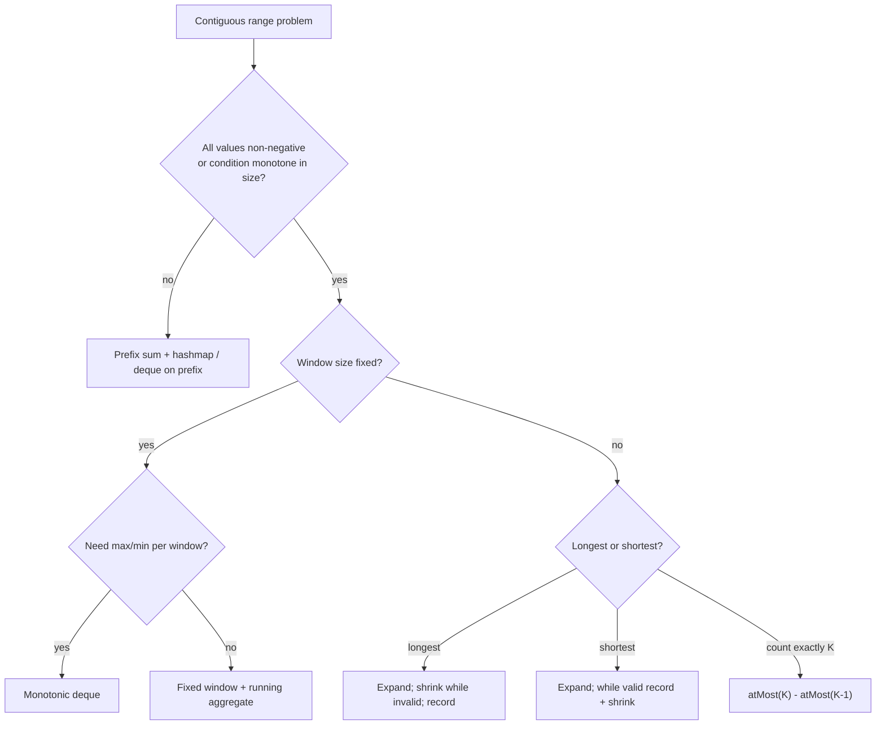

# Sliding window

!!! abstract "At a glance"
    **Priority:** P0 · **Complexity:** 2/5 · **Est. time:** 3 h · **Phase:** 1 · **Prereqs:** [Two pointers](two-pointers.md), [Arrays & hashing](arrays-hashing.md)
    **You're done when:** you can write the variable-size window template from memory, solve Minimum Window Substring in < 30 min, and explain the "exactly K = atMost(K) − atMost(K−1)" trick.

## Why it matters

Sliding window is two pointers specialised for **contiguous** ranges with a condition that is monotone in window size. It turns O(n^2) or O(n^3) substring enumeration into O(n). The same idea runs production systems: rate limiters (sliding window log/counter), TCP flow control, streaming aggregations (Flink/Kafka Streams windows) and moving averages in monitoring. Staff follow-ups often ask you to turn the array version into a *streaming* version, so know both.

## Core concepts

### Pattern recognition signals

| When you see… | Think… |
|---|---|
| "longest/shortest substring/subarray such that…" | Variable window |
| "every window of size k", "max/avg of each k-window" | Fixed window |
| "at most K distinct / K replacements / K zeros" | Variable window with a counter of the constraint |
| "exactly K" | atMost(K) − atMost(K−1) |
| "contains all characters of t", "permutation/anagram of p in s" | Window + frequency match counter |
| "max/min of every window" | Monotonic deque |
| Negative numbers + sum target | **Not** a window: use prefix sum + hashmap |

### Template 1: variable-size window (longest valid)

```python
def longest_valid(s):
    count = {}
    l = best = 0
    for r, ch in enumerate(s):
        count[ch] = count.get(ch, 0) + 1          # 1. expand: add s[r]
        while not valid(count, r - l + 1):        # 2. shrink until valid again
            count[s[l]] -= 1
            if count[s[l]] == 0:
                del count[s[l]]
            l += 1
        best = max(best, r - l + 1)               # 3. record (window is valid here)
    return best
```

For **shortest** valid windows, flip it: `while valid: record, then shrink`.

### Template 2: minimum window substring (have/need), O(|s| + |t|)

```python
from collections import Counter

def min_window(s, t):
    need = Counter(t)
    missing = len(t)                 # characters still needed (with multiplicity)
    l = 0
    best = (float('inf'), 0, 0)
    for r, ch in enumerate(s):
        if need[ch] > 0:
            missing -= 1
        need[ch] -= 1                # negative = surplus
        while missing == 0:          # valid: try to shrink
            if r - l + 1 < best[0]:
                best = (r - l + 1, l, r + 1)
            need[s[l]] += 1
            if need[s[l]] > 0:
                missing += 1
            l += 1
    return s[best[1]:best[2]] if best[0] != float('inf') else ""
```

### Template 3: fixed-size window

```python
def max_sum_k(a, k):
    cur = sum(a[:k]); best = cur
    for r in range(k, len(a)):
        cur += a[r] - a[r - k]
        best = max(best, cur)
    return best
```

### Template 4: sliding window maximum (monotonic deque), O(n)

```python
from collections import deque
def max_sliding_window(a, k):
    dq, out = deque(), []            # indices; values strictly decreasing
    for i, x in enumerate(a):
        while dq and a[dq[-1]] <= x:
            dq.pop()
        dq.append(i)
        if dq[0] <= i - k:
            dq.popleft()             # expired
        if i >= k - 1:
            out.append(a[dq[0]])
    return out
```

### Template 5: exactly K via atMost

```python
def subarrays_with_k_distinct(a, k):
    def at_most(k):
        cnt, l, res = {}, 0, 0
        for r, x in enumerate(a):
            cnt[x] = cnt.get(x, 0) + 1
            while len(cnt) > k:
                cnt[a[l]] -= 1
                if cnt[a[l]] == 0: del cnt[a[l]]
                l += 1
            res += r - l + 1         # all windows ending at r
        return res
    return at_most(k) - at_most(k - 1)
```

### Variations & decision table

| Problem shape | Window type | State kept | Shrink condition |
|---|---|---|---|
| Longest w/o repeats (3) | variable, longest | last index map | jump `l = max(l, last[c] + 1)` |
| Char replacement (424) | variable, longest | counts + maxFreq | `len - maxFreq > k` |
| Min size sum ≥ target (209) | variable, shortest | running sum | shrink while sum ≥ target |
| Permutation in string (567) | fixed size \|p\| | counts + matches | slide by 1 |
| Min window substring (76) | variable, shortest | need + missing | shrink while missing == 0 |
| Window max (239) | fixed | monotonic deque | pop expired front |
| Exactly K distinct (992) | 2 × variable | counts | atMost difference |



### Common bugs

- Recording the answer while the window is invalid (put `best = ...` after the shrink loop for longest).
- Using a window with negative numbers (LC 560, 862). Monotonicity breaks.
- In 424, recomputing `max(count.values())` each step. It's correct but O(26n). The stale `maxFreq` trick is valid because the answer only grows when maxFreq grows.
- Deque storing values instead of indices, which means you can't expire correctly with duplicates.
- Forgetting to delete zero-count keys when the constraint is "number of distinct keys".

## Resources

| Resource | Type | Why this one | Level | Cost |
|---|---|---|---|---|
| [NeetCode roadmap: Sliding Window](https://neetcode.io/roadmap) | video | Excellent visual for 424 and 76 | intermediate | freemium |
| [Tech Interview Handbook: String](https://www.techinterviewhandbook.org/algorithms/string/) | article | Sliding-window and counting-character techniques | intermediate | free |
| [Hello Interview: coding patterns](https://www.hellointerview.com/learn/code) :gem: | interactive | Animated variable vs fixed window explanations | intermediate | freemium |
| [cp-algorithms: minimum stack/queue](https://cp-algorithms.com/data_structures/stack_queue_modification.html) :gem: | article | Rigorous basis for monotonic deques and window minimum | advanced | free |
| [labuladong: sliding window framework](https://labuladong.online/algo/en/) | article | One framework that covers 3, 76, 438 and 567 | intermediate | freemium |
| [Coding Interview Patterns (ByteByteGo)](https://bytebytego.com/courses/coding-patterns) | book | Diagrams for the dynamic window | intermediate | paid |

## Hands-on lab

| # | LC | Problem | Difficulty | Set | Key insight |
|---|---|---|---|---|---|
| 1 | 121 | [Best Time to Buy and Sell Stock](https://leetcode.com/problems/best-time-to-buy-and-sell-stock/) | Easy | NC150 | Track running min; answer = max(price - min). |
| 2 | 219 | [Contains Duplicate II](https://leetcode.com/problems/contains-duplicate-ii/) | Easy | NC250+ | Fixed window of size k as a set. |
| 3 | 3 | [Longest Substring Without Repeating Characters](https://leetcode.com/problems/longest-substring-without-repeating-characters/) | Medium | NC150 | Last-seen index map; jump left to max(left, last+1). |
| 4 | 424 | [Longest Repeating Character Replacement](https://leetcode.com/problems/longest-repeating-character-replacement/) | Medium | NC150 | Valid while len - maxFreq <= k; maxFreq never needs to decrease. |
| 5 | 567 | [Permutation in String](https://leetcode.com/problems/permutation-in-string/) | Medium | NC150 | Fixed-size window with 26-count match counter. |
| 6 | 209 | [Minimum Size Subarray Sum](https://leetcode.com/problems/minimum-size-subarray-sum/) | Medium | NC250+ | Shrink while sum >= target (positives only). |
| 7 | 1004 | [Max Consecutive Ones III](https://leetcode.com/problems/max-consecutive-ones-iii/) | Medium | NC250+ | Window with at most k zeros. |
| 8 | 438 | [Find All Anagrams in a String](https://leetcode.com/problems/find-all-anagrams-in-a-string/) | Medium | NC250+ | Same as 567 but collect every start index. |
| 9 | 904 | [Fruit Into Baskets](https://leetcode.com/problems/fruit-into-baskets/) | Medium | NC250+ | Longest window with at most 2 distinct keys. |
| 10 | 76 | [Minimum Window Substring](https://leetcode.com/problems/minimum-window-substring/) | Hard | NC150 | need/have counters; shrink while have == need. |
| 11 | 239 | [Sliding Window Maximum](https://leetcode.com/problems/sliding-window-maximum/) | Hard | NC150 | Monotonic decreasing deque of indices. |
| 12 | 992 | [Subarrays with K Different Integers](https://leetcode.com/problems/subarrays-with-k-different-integers/) | Hard | NC250+ | exactly(k) = atMost(k) - atMost(k-1). |

**Stretch exercise:** turn LC 3 into a streaming class `LongestUniqueStream.push(ch) -> int` that reports the current answer after each character in amortised O(1).

## Questions

### L1 — Recall

??? question "Q1. What property must a problem have for a variable sliding window to be correct?"
    ??? success "Answer"
        Monotonicity. If a window [l, r] is invalid (for "longest"), every window [l, r'] with r' > r is also invalid, or equivalently shrinking can only help. That lets l move forward only, giving O(n) total pointer moves. Positive-only sums and "at most K distinct" have it; sums with negatives don't.

??? question "Q2. Why is the stale `maxFreq` in LC 424 correct?"
    ??? success "Answer"
        The answer is `maxFreq + k` at best. A window can only beat the current best if some character reaches a higher frequency than the historical maxFreq. So letting maxFreq overestimate never produces a larger wrong answer. It only delays shrinking, and the window length never exceeds a previously valid best.

??? question "Q3. Why does the deque in LC 239 give O(n)?"
    ??? success "Answer"
        Each index is appended once and popped at most once (from either end). Total operations ≤ 2n. The deque is monotonically decreasing, so the front is always the window max.

### L2 — Apply

??? question "Q4. Implement Longest Substring Without Repeating Characters."
    ??? success "Answer"
        ```python
        def length_of_longest_substring(s):
            last, l, best = {}, 0, 0
            for r, ch in enumerate(s):
                if ch in last and last[ch] >= l:
                    l = last[ch] + 1
                last[ch] = r
                best = max(best, r - l + 1)
            return best
        ```
        O(n) time and O(min(n, alphabet)) space. The `>= l` check ignores stale indices left of the window.

??? question "Q5. Trace Minimum Window Substring for s='ADOBECODEBANC', t='ABC'."
    ??? success "Answer"
        Expanding to r=5 ('C') makes missing 0 with window "ADOBEC" (len 6). Shrinking removes 'A', missing becomes 1. Expanding to r=10 ('A') gives window "DOBECODEBA", shrink to "CODEBA" (len 6). Expanding to r=12 ('C') gives valid "CODEBANC", shrink to "BANC" (len 4). Answer **"BANC"**.

??? question "Q6. Count subarrays with at most K distinct integers: why is `res += r - l + 1` correct?"
    ??? success "Answer"
        After shrinking, [l, r] is the longest valid window ending at r. Every window [i, r] with l ≤ i ≤ r is also valid (a subset has ≤ K distinct). There are r − l + 1 of them, and each subarray is counted exactly once, at its right end.

### L3 — Design & trade-offs

??? question "Q7. Shortest subarray with sum ≥ K when values can be negative (LC 862). Why does the window fail and what replaces it?"
    ??? success "Answer"
        With negatives, shrinking can *increase* the sum, so l can't move monotonically. Use prefix sums P and a monotonic increasing deque of indices. For each j, pop from the front while `P[j] - P[front] >= K` (record the length), and pop from the back while `P[back] >= P[j]` (dominated starts). O(n). This is the prefix sum + monotonic deque hybrid.

??? question "Q8. Fixed window of size k: running sum vs recomputing each time vs prefix array. Trade-offs?"
    ??? success "Answer"
        Running sum: O(n) time and O(1) space, best for streams. Prefix array: O(n) build and O(n) space, but answers *any* window in O(1), better for many ad-hoc queries. Recomputing: O(nk). For non-invertible aggregates (max/min) running sums don't work, so use a monotonic deque or a two-stack queue.

??? question "Q9. Your window state is a Counter over a Unicode alphabet. Array of 26 vs dict: what changes?"
    ??? success "Answer"
        A 26-int array is faster (no hashing) and comparing two arrays is O(26). With Unicode, use a dict and maintain a `matches` counter incrementally (count of keys whose counts are satisfied) instead of comparing whole dicts each step, keeping each step O(1).

### L4 — Staff-level ambiguity

??? question "Q10. Design a distributed sliding-window rate limiter (1000 req/min per API key) across 20 gateway nodes."
    ??? success "Answer"
        Options:
        1. **Sliding window log** (a sorted set of timestamps per key in Redis, `ZREMRANGEBYSCORE` + `ZCARD` in a Lua script). Exact, but O(limit) memory per key.
        2. **Sliding window counter**: two fixed buckets weighted by overlap, O(1) memory, roughly 1% error. The common choice (Cloudflare described this approach).
        3. **Token bucket** in Redis with atomic Lua. Allows bursts.
        4. **Local limits** of 1000/20 per node with periodic sync. No hot Redis, but inaccurate under uneven load balancing.
        Discuss atomicity (Lua/`MULTI`), clock skew (use the Redis server time), hot keys (shard by key), fail-open vs fail-closed when Redis is down, and response headers (`Retry-After`). Tie back to the in-memory algorithm: the window invariant is the same, the storage is remote.

??? question "Q11. 'Longest substring without repeats' but s is a 10 TB log stream partitioned across machines. Can you parallelise?"
    ??? success "Answer"
        Partially. Each partition computes its local best plus boundary info: its longest unique prefix and suffix, and the character sets. Merging adjacent partitions checks windows that span the boundary. Those windows can extend at most alphabet-size characters into each side (a unique window has ≤ |Σ| characters), so each boundary needs only |Σ| characters from each neighbour. Parallel, then a cheap merge: a monoid-style reduction. Framing the answer as a mergeable summary is the Staff insight, and the same idea underlies map-side combiners.

## Real-world use cases

- **Rate limiting** in API gateways (sliding log/counter) and abuse detection.
- **Monitoring:** p99 latency over the last 5 minutes, and moving averages for anomaly detection on vessel ETA deviations.
- **Streaming joins:** Flink window joins of GPS pings with port geofences within ±10 minutes.
- **Network protocols:** TCP's sliding window for flow control.

## Pitfalls & anti-patterns

- Applying a window to problems with negative numbers.
- Recording answers before restoring validity.
- O(alphabet) validity checks per step when an incremental counter would do.
- Forgetting the fixed-window "remove the element leaving" step.

## Checklist

- [ ] I can write the variable (longest and shortest) and fixed templates from memory
- [ ] I can explain the monotonic deque and the atMost trick
- [ ] I solved 76 and 239 unaided within 35 min
- [ ] I answered all L3 questions out loud in < 3 min each
