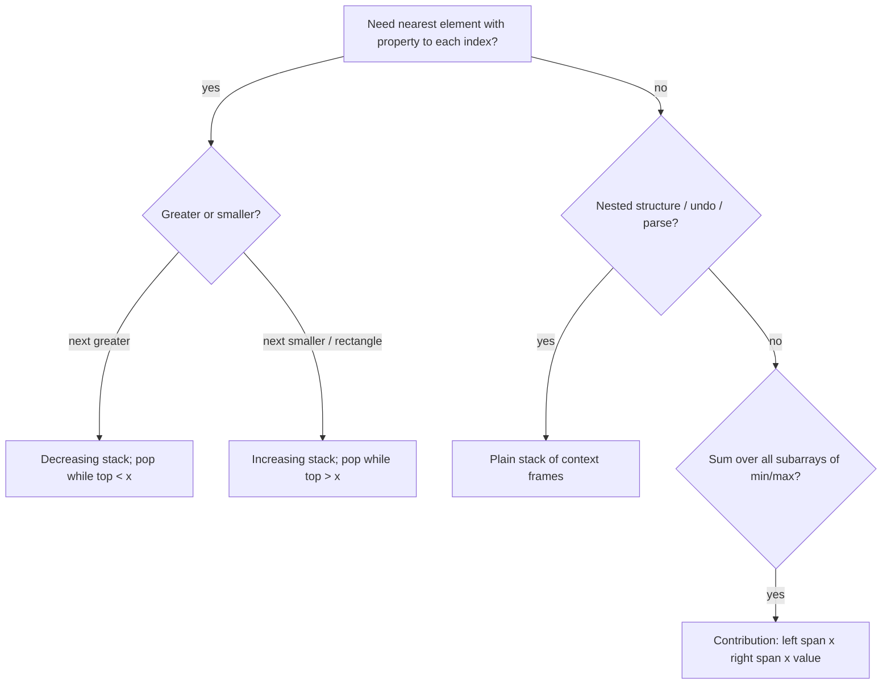

# Stack & monotonic stack

!!! abstract "At a glance"
    **Priority:** P0 · **Complexity:** 2/5 · **Est. time:** 3 h · **Phase:** 1 · **Prereqs:** [Arrays & hashing](arrays-hashing.md)
    **You're done when:** you can write the "next greater element" monotonic stack from memory, solve Largest Rectangle in Histogram in < 30 min, and use the contribution technique (prev-less / next-less) to count subarray minimums.

## Why it matters

Stacks model **nesting and "most recent unresolved" state**: parsers, expression evaluation, undo, call stacks, and DFS. Monotonic stacks answer "nearest greater/smaller to the left/right" for all elements in O(n). That one primitive solves histogram, stock span, temperature and "sum of subarray minimums" problems, which are some of the most common Medium/Hard interview problems. The contribution technique behind them also underpins interval-dominance analytics.

## Core concepts

### Pattern recognition signals

| When you see… | Think… |
|---|---|
| Matching brackets, nested structures, "decode k[...]" | Stack of context |
| Expression evaluation (RPN, calculator) | Operand stack (+ operator stack) |
| "next greater / warmer / higher to the right" | Monotonic **decreasing** stack |
| "next smaller", histogram, "largest rectangle" | Monotonic **increasing** stack |
| "remove k digits to make smallest", "smallest subsequence" | Greedy + monotonic stack |
| "sum over all subarrays of min/max" | Contribution: prev-less and next-less per element |
| "collisions" (asteroids, cars merging into fleets) | Stack simulating survivors |
| Min in O(1) with push/pop | Stack of (val, current_min) |

### Template 1: next greater element (monotonic decreasing), O(n)

```python
def next_greater(a):
    res = [-1] * len(a)
    st = []                                  # indices; a[st] strictly decreasing
    for i, x in enumerate(a):
        while st and a[st[-1]] < x:          # x resolves everyone smaller
            res[st.pop()] = i                # (or x, or i - j for distance)
        st.append(i)
    return res
```

Flip `<` to `>` for next smaller. Iterate right-to-left for "previous" variants, or read the stack top *after* popping. Circular arrays: iterate `2n` indices with `i % n`.

### Template 2: largest rectangle in histogram, O(n)

```python
def largest_rectangle(h):
    st, best = [], 0                         # (start_index, height), heights increasing
    for i, x in enumerate(h + [0]):          # sentinel 0 flushes the stack
        start = i
        while st and st[-1][1] >= x:
            idx, height = st.pop()
            best = max(best, height * (i - idx))
            start = idx                      # current bar can extend back to idx
        st.append((start, x))
    return best
```

### Template 3: contribution technique (sum of subarray minimums), O(n)

```python
def sum_subarray_mins(a, MOD=10**9 + 7):
    n = len(a)
    left, right = [0] * n, [0] * n
    st = []
    for i in range(n):                       # previous strictly less
        while st and a[st[-1]] >= a[i]:
            st.pop()
        left[i] = i - st[-1] if st else i + 1
        st.append(i)
    st = []
    for i in range(n - 1, -1, -1):           # next less-or-equal (tie-break!)
        while st and a[st[-1]] > a[i]:
            st.pop()
        right[i] = st[-1] - i if st else n - i
        st.append(i)
    return sum(a[i] * left[i] * right[i] for i in range(n)) % MOD
```

Asymmetric tie-break (strict on one side, non-strict on the other) prevents double-counting equal minima.

### Template 4: min stack

```python
class MinStack:
    def __init__(self): self.st = []
    def push(self, x): self.st.append((x, min(x, self.st[-1][1]) if self.st else x))
    def pop(self): self.st.pop()
    def top(self): return self.st[-1][0]
    def getMin(self): return self.st[-1][1]
```

### Comparison

| Problem | Stack order | What is popped | What pop computes |
|---|---|---|---|
| Daily Temperatures (739) | decreasing temps | colder days | days waited = i − j |
| Online Stock Span (901) | decreasing prices | smaller prices (absorb spans) | span |
| Largest Rectangle (84) | increasing heights | taller bars | area with right boundary i |
| Remove K Digits (402) | increasing digits | larger digits while k > 0 | greedy smallest number |
| Car Fleet (853) | arrival times | faster cars that catch up | number of fleets = stack size |
| Asteroid Collision (735) | survivors | smaller right-movers | survivors |



### Common bugs

- Storing values instead of indices, so you can't compute widths or distances.
- Missing the sentinel in histogram, leaving the stack unflushed.
- Tie handling in contribution problems (double counting).
- RPN: `a // b` floors toward −∞ in Python, but the problem wants truncation, so use `int(a / b)`.
- Decode String: multi-digit repeat counts (`12[a]`) need accumulating `k = k*10 + d`.

## Resources

| Resource | Type | Why this one | Level | Cost |
|---|---|---|---|---|
| [NeetCode roadmap: Stack](https://neetcode.io/roadmap) | video | Clear histogram and car-fleet walkthroughs | intermediate | freemium |
| [Tech Interview Handbook: Stack](https://www.techinterviewhandbook.org/algorithms/stack/) | article | Corner cases and must-do list | intermediate | free |
| [cp-algorithms: stack/queue modification](https://cp-algorithms.com/data_structures/stack_queue_modification.html) :gem: | article | Min-stack and min-queue in O(1), with proofs | advanced | free |
| [labuladong: monotonic stack](https://labuladong.online/algo/en/) :gem: | article | One template for all next-greater variants | intermediate | freemium |
| [Hello Interview: coding patterns](https://www.hellointerview.com/learn/code) | interactive | Animated monotonic stack | intermediate | freemium |
| [VisuAlgo: linked list / stack / queue](https://visualgo.net/en/list) | interactive | Visual stack/queue/deque operations | intermediate | free |

## Hands-on lab

| # | LC | Problem | Difficulty | Set | Key insight |
|---|---|---|---|---|---|
| 1 | 20 | [Valid Parentheses](https://leetcode.com/problems/valid-parentheses/) | Easy | NC150 | Push opens; closing must match top. |
| 2 | 682 | [Baseball Game](https://leetcode.com/problems/baseball-game/) | Easy | NC250+ | Stack simulation warm-up. |
| 3 | 225 | [Implement Stack using Queues](https://leetcode.com/problems/implement-stack-using-queues/) | Easy | NC250+ | Rotate the queue after each push. |
| 4 | 155 | [Min Stack](https://leetcode.com/problems/min-stack/) | Medium | NC150 | Store (val, min_so_far) pairs. |
| 5 | 150 | [Evaluate Reverse Polish Notation](https://leetcode.com/problems/evaluate-reverse-polish-notation/) | Medium | NC150 | Operand stack; int(a / b) truncates toward zero. |
| 6 | 22 | [Generate Parentheses](https://leetcode.com/problems/generate-parentheses/) | Medium | NC150 | Backtrack with open < n and close < open. |
| 7 | 739 | [Daily Temperatures](https://leetcode.com/problems/daily-temperatures/) | Medium | NC150 | Monotonic decreasing stack of indices; pop resolves answers. |
| 8 | 853 | [Car Fleet](https://leetcode.com/problems/car-fleet/) | Medium | NC150 | Sort by position desc; stack of arrival times, merge if <= top. |
| 9 | 71 | [Simplify Path](https://leetcode.com/problems/simplify-path/) | Medium | NC250+ | Split on '/', stack for '..'. |
| 10 | 394 | [Decode String](https://leetcode.com/problems/decode-string/) | Medium | NC250+ | Stack of (prev_string, repeat) on '['. |
| 11 | 735 | [Asteroid Collision](https://leetcode.com/problems/asteroid-collision/) | Medium | NC250+ | Only right-moving top vs left-moving incoming collide. |
| 12 | 901 | [Online Stock Span](https://leetcode.com/problems/online-stock-span/) | Medium | NC250+ | Stack of (price, span); absorb smaller spans. |
| 13 | 402 | [Remove K Digits](https://leetcode.com/problems/remove-k-digits/) | Medium | NC250+ | Greedy monotonic increasing stack; strip leading zeros. |
| 14 | 907 | [Sum of Subarray Minimums](https://leetcode.com/problems/sum-of-subarray-minimums/) | Medium | NC250+ | Contribution technique: prev-less and next-less-or-equal. |
| 15 | 84 | [Largest Rectangle in Histogram](https://leetcode.com/problems/largest-rectangle-in-histogram/) | Hard | NC150 | Increasing stack; on pop, width spans to new left boundary. |
| 16 | 85 | [Maximal Rectangle](https://leetcode.com/problems/maximal-rectangle/) | Hard | NC250+ | Row-by-row histogram + problem 84. |

**Stretch exercise:** implement a basic calculator supporting `+ - * / ( )` with two stacks (shunting-yard). Compare it with a recursive-descent version and note which is easier to extend with operator precedence.

## Questions

### L1 — Recall

??? question "Q1. Why is a monotonic stack O(n) overall?"
    ??? success "Answer"
        Each index is pushed once and popped at most once, so total pops ≤ n regardless of the inner `while`. That is aggregate amortised analysis.

??? question "Q2. Increasing vs decreasing monotonic stack: which answers 'next greater'?"
    ??? success "Answer"
        Decreasing. Elements wait on the stack until a larger element arrives and pops them. That arrival is their next greater element.

??? question "Q3. How does Min Stack achieve O(1) getMin?"
    ??? success "Answer"
        Each entry stores the minimum of the stack at the time of its push. Popping restores the previous minimum automatically. Alternative: an auxiliary stack of minimums pushed only when ≤ the current min.

### L2 — Apply

??? question "Q4. Implement Daily Temperatures."
    ??? success "Answer"
        ```python
        def daily_temperatures(t):
            res, st = [0] * len(t), []
            for i, x in enumerate(t):
                while st and t[st[-1]] < x:
                    j = st.pop()
                    res[j] = i - j
                st.append(i)
            return res
        ```
        O(n) time, O(n) space.

??? question "Q5. Trace Largest Rectangle on [2,1,5,6,2,3]."
    ??? success "Answer"
        Push (0,2). At i=1 (h=1): pop (0,2) giving area 2·1=2, push (0,1). Push (2,5), (3,6). At i=4 (h=2): pop (3,6) giving 6·1=6, pop (2,5) giving 5·2=10, push (2,2). Push (5,3). Sentinel at i=6: pop (5,3) giving 3, pop (2,2) giving 2·4=8, pop (0,1) giving 1·6=6. Best **10**.

??? question "Q6. Implement Car Fleet."
    ??? success "Answer"
        ```python
        def car_fleet(target, position, speed):
            cars = sorted(zip(position, speed), reverse=True)
            fleets, slowest = 0, 0.0
            for p, s in cars:
                t = (target - p) / s
                if t > slowest:          # can't catch the fleet ahead -> new fleet
                    fleets += 1
                    slowest = t
            return fleets
        ```
        A stack of times collapses to a single "slowest ahead" value. O(n log n) for the sort.

### L3 — Design & trade-offs

??? question "Q7. Maximal Rectangle in a binary matrix: why reduce to histograms and what is the complexity?"
    ??? success "Answer"
        For each row, compute heights[c] = consecutive 1s ending at this row. Any all-1 rectangle has a bottom row, and in that row's histogram it's a rectangle under the bars. Running LC 84 per row gives O(R·C) total, versus O(R^2·C^2) or worse for brute force.

??? question "Q8. Remove K Digits: why is greedy + monotonic stack optimal?"
    ??? success "Answer"
        Comparing numbers of equal length is decided by the leftmost differing digit. If a digit is larger than its right neighbour, removing it strictly decreases the number at the most significant position possible. The stack keeps digits non-decreasing, removing a "peak" whenever one appears while k > 0. Leftover k removes from the end. Strip leading zeros and return "0" if empty.

??? question "Q9. Recursion vs explicit stack for Decode String / nested parsing?"
    ??? success "Answer"
        Recursion mirrors the grammar (each `[` recurses) and is concise, but depth equals nesting depth, so the Python recursion limit matters for adversarial input. An explicit stack of (prefix, k) frames is iterative and handles arbitrary depth. In production parsers, prefer iterative or a parser generator with explicit depth limits (a DoS protection, as JSON parsers do).

### L4 — Staff-level ambiguity

??? question "Q10. Stock span over a real-time price feed with 50k symbols. Productionise the monotonic stack."
    ??? success "Answer"
        Per symbol, keep a stack of (price, span). It's amortised O(1) per tick, but memory per symbol is O(n) in the worst case (monotonically decreasing prices). Bound it by time horizon: evict entries older than the window (the stack becomes a deque). Partition symbols across workers by hash. State must survive restarts: snapshot the stacks plus replay from a Kafka offset. Latency per tick is O(1) amortised, but a single tick can pop many entries, so monitor p99. The algorithm is the same; the issues are memory bounds, partitioning and recovery.

??? question "Q11. An engineer proposes computing 'for each shipment, the next shipment with a higher priority' with a nightly O(n^2) SQL self-join over 20M rows. What do you suggest?"
    ??? success "Answer"
        Order by time and run a monotonic stack pass: O(n) in a single-threaded job, or per partition if the "next" relation is scoped (per lane or customer). In SQL, window functions can't express it directly, but a recursive CTE or a UDF/Spark `mapPartitions` running the stack works. Quantify it: 20M^2/2 = 2·10^14 comparisons versus 2·10^7 operations. Offer to pair on it. Leading with the algorithmic reframe plus a cost estimate is how you influence.

## Real-world use cases

- **Parsers and validators:** JSON/XML bracket matching, expression engines in rule platforms.
- **Undo/redo** in editors (two stacks), and browser history.
- **Finance/telemetry:** stock span and "time until metric exceeded threshold" (Daily Temperatures) in alerting.
- **Skyline and capacity views:** largest rectangle under a utilisation curve, meaning the longest window with at least X capacity available.

## Pitfalls & anti-patterns

- Values vs indices on the stack.
- Missing sentinels or final flush.
- Double counting ties in contribution problems.
- Using recursion for deep nesting without limits.

## Checklist

- [ ] I can write next-greater, histogram and contribution templates from memory
- [ ] I can explain the amortised O(n) argument in one sentence
- [ ] I solved 84 unaided within 30 min
- [ ] I answered all L3 questions out loud in < 3 min each
