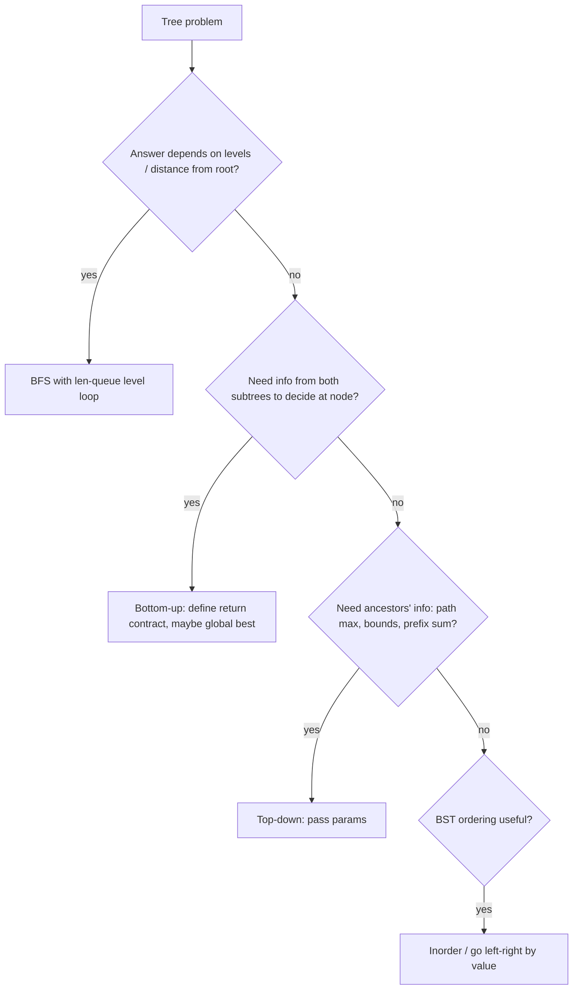

# Trees: DFS, BFS, BST

!!! abstract "At a glance"
    **Priority:** P0 · **Complexity:** 3/5 · **Est. time:** 5 h · **Phase:** 2 · **Prereqs:** [Stack](stack.md), [Python idioms](python-idioms.md)
    **You're done when:** for any tree problem you can decide within 2 minutes whether it's top-down (pass state down), bottom-up (return values up) or level-order, and you solve Binary Tree Maximum Path Sum and Serialize/Deserialize unaided.

## Why it matters

Trees are the most frequently asked data structure in FAANG coding rounds, because recursion on trees reveals whether you can define a function's contract precisely ("this returns the height of the subtree") and combine sub-results. Beyond interviews: B-trees and LSM indexes, DOM/AST processing, org hierarchies, dependency trees, decision trees, quad/R-trees for geo, and Merkle trees for data sync all rely on the same traversals.

## Core concepts

### Pattern recognition signals

| When you see… | Think… |
|---|---|
| "depth", "height", "balanced", "diameter", "path sum ending at node" | **Bottom-up** DFS: return info from children |
| "path from root", "good nodes", "max so far along the path", "valid range" | **Top-down** DFS: pass state as parameters |
| "level", "right side view", "zigzag", "min depth", "nearest" | **BFS** level-order |
| BST + "k-th smallest", "validate", "sorted order" | **Inorder** traversal |
| BST + search/insert/LCA | Use ordering to go left or right, O(h) |
| "construct from traversals" | Preorder gives the root, inorder gives the split sizes |
| "serialize", "compare structure" | Preorder with null markers |
| Global best combining left + right through a node | Bottom-up returning a single branch, updating a global |

### Template 1: bottom-up (return values)

```python
def diameter(root):
    best = 0
    def height(node):                    # contract: returns height of subtree
        nonlocal best
        if not node:
            return 0
        l, r = height(node.left), height(node.right)
        best = max(best, l + r)          # path THROUGH node (edges)
        return 1 + max(l, r)             # single branch upward
    height(root)
    return best
```

### Template 2: top-down (pass state)

```python
def is_valid_bst(root):
    def ok(node, lo, hi):                # contract: all keys in (lo, hi)
        if not node:
            return True
        if not (lo < node.val < hi):
            return False
        return ok(node.left, lo, node.val) and ok(node.right, node.val, hi)
    return ok(root, float('-inf'), float('inf'))
```

### Template 3: BFS level-order

```python
from collections import deque
def level_order(root):
    if not root:
        return []
    q, res = deque([root]), []
    while q:
        level = []
        for _ in range(len(q)):
            node = q.popleft()
            level.append(node.val)
            if node.left: q.append(node.left)
            if node.right: q.append(node.right)
        res.append(level)
    return res
```

### Template 4: iterative inorder (BST k-th smallest)

```python
def kth_smallest(root, k):
    st, cur = [], root
    while st or cur:
        while cur:
            st.append(cur); cur = cur.left
        cur = st.pop()
        k -= 1
        if k == 0:
            return cur.val
        cur = cur.right
```

### Template 5: max path sum (the canonical Hard)

```python
def max_path_sum(root):
    best = float('-inf')
    def gain(node):                      # best downward path starting at node
        nonlocal best
        if not node:
            return 0
        l = max(gain(node.left), 0)      # drop negative branches
        r = max(gain(node.right), 0)
        best = max(best, node.val + l + r)
        return node.val + max(l, r)
    gain(root)
    return best
```

### Template 6: serialize / deserialize (preorder with nulls)

```python
class Codec:
    def serialize(self, root):
        out = []
        def dfs(n):
            if not n:
                out.append("#"); return
            out.append(str(n.val)); dfs(n.left); dfs(n.right)
        dfs(root)
        return ",".join(out)

    def deserialize(self, data):
        it = iter(data.split(","))
        def build():
            v = next(it)
            if v == "#":
                return None
            n = TreeNode(int(v)); n.left = build(); n.right = build()
            return n
        return build()
```

### Decision flow



| Traversal | Order | Typical use |
|---|---|---|
| Preorder | node, L, R | Copy/serialise, top-down state |
| Inorder | L, node, R | BST sorted order, validate, k-th |
| Postorder | L, R, node | Heights, deletes, bottom-up aggregates |
| Level-order | by depth | Shortest depth, views, per-level aggregates |
| Morris | inorder with O(1) space | Space-constrained follow-up |

### Common bugs

- Validate BST by comparing only with the parent (it fails for deeper violations). Pass bounds.
- Diameter counted in nodes vs edges.
- Max path sum: forgetting to clamp negative gains at 0, or returning `l + r` (a path can't fork upward).
- BFS: appending children of the next level while iterating without the `len(q)` snapshot.
- Recursion depth on a skewed tree of 10^5 nodes.
- LCA in a BST vs a general binary tree: different algorithms.

## Resources

| Resource | Type | Why this one | Level | Cost |
|---|---|---|---|---|
| [NeetCode roadmap: Trees](https://neetcode.io/roadmap) | video | 15 NC150 tree problems with clear recursion diagrams | intermediate | freemium |
| [Tech Interview Handbook: Tree](https://www.techinterviewhandbook.org/algorithms/tree/) | article | Traversals, BST properties and corner cases | intermediate | free |
| [VisuAlgo: BST / AVL](https://visualgo.net/en/bst) :gem: | interactive | Watch insert, delete and rotations | intermediate | free |
| [Jeff Erickson, ch. 1: Recursion](https://jeffe.cs.illinois.edu/teaching/algorithms/book/01-recursion.pdf) :gem: | book | How to trust recursion ("the recursion fairy") | advanced | free |
| [USFCA data structure visualisations](https://www.cs.usfca.edu/~galles/visualization/Algorithms.html) :gem: | interactive | Red-black, B-tree and trie animations | intermediate | free |
| [Princeton Algorithms 4e: Searching](https://algs4.cs.princeton.edu/home/) | book/site | Rigorous BST, red-black and B-tree chapters | advanced | free |
| [Hello Interview: coding patterns](https://www.hellointerview.com/learn/code) | interactive | DFS return-value framing | intermediate | freemium |

## Hands-on lab

| # | LC | Problem | Difficulty | Set | Key insight |
|---|---|---|---|---|---|
| 1 | 94 | [Binary Tree Inorder Traversal](https://leetcode.com/problems/binary-tree-inorder-traversal/) | Easy | NC250+ | Iterative with explicit stack: go left, pop, go right. |
| 2 | 226 | [Invert Binary Tree](https://leetcode.com/problems/invert-binary-tree/) | Easy | NC150 | Swap children, recurse. |
| 3 | 104 | [Maximum Depth of Binary Tree](https://leetcode.com/problems/maximum-depth-of-binary-tree/) | Easy | NC150 | 1 + max(depth(l), depth(r)); also BFS level count. |
| 4 | 543 | [Diameter of Binary Tree](https://leetcode.com/problems/diameter-of-binary-tree/) | Easy | NC150 | Return height, update global best with l + r. |
| 5 | 110 | [Balanced Binary Tree](https://leetcode.com/problems/balanced-binary-tree/) | Easy | NC150 | Return height or -1 sentinel to short-circuit. |
| 6 | 100 | [Same Tree](https://leetcode.com/problems/same-tree/) | Easy | NC150 | Structural recursion on both roots. |
| 7 | 572 | [Subtree of Another Tree](https://leetcode.com/problems/subtree-of-another-tree/) | Easy | NC150 | sameTree at each node; O(m*n) or serialise + KMP. |
| 8 | 235 | [Lowest Common Ancestor of a Binary Search Tree](https://leetcode.com/problems/lowest-common-ancestor-of-a-binary-search-tree/) | Medium | NC150 | Split point where p and q go different ways. |
| 9 | 102 | [Binary Tree Level Order Traversal](https://leetcode.com/problems/binary-tree-level-order-traversal/) | Medium | NC150 | BFS: process len(queue) nodes per level. |
| 10 | 199 | [Binary Tree Right Side View](https://leetcode.com/problems/binary-tree-right-side-view/) | Medium | NC150 | Last node of each BFS level. |
| 11 | 103 | [Binary Tree Zigzag Level Order Traversal](https://leetcode.com/problems/binary-tree-zigzag-level-order-traversal/) | Medium | NC250+ | BFS; reverse alternate levels. |
| 12 | 1448 | [Count Good Nodes in Binary Tree](https://leetcode.com/problems/count-good-nodes-in-binary-tree/) | Medium | NC150 | Pass max-so-far down the recursion. |
| 13 | 98 | [Validate Binary Search Tree](https://leetcode.com/problems/validate-binary-search-tree/) | Medium | NC150 | Pass (low, high) bounds down; not just parent compare. |
| 14 | 230 | [Kth Smallest Element in a BST](https://leetcode.com/problems/kth-smallest-element-in-a-bst/) | Medium | NC150 | Iterative inorder, stop at k. |
| 15 | 105 | [Construct Binary Tree from Preorder and Inorder Traversal](https://leetcode.com/problems/construct-binary-tree-from-preorder-and-inorder-traversal/) | Medium | NC150 | preorder[0] is root; inorder index map splits sizes. |
| 16 | 236 | [Lowest Common Ancestor of a Binary Tree](https://leetcode.com/problems/lowest-common-ancestor-of-a-binary-tree/) | Medium | NC250+ | Return node if found; both sides non-null -> current is LCA. |
| 17 | 450 | [Delete Node in a BST](https://leetcode.com/problems/delete-node-in-a-bst/) | Medium | NC250+ | Two-child case: replace with inorder successor. |
| 18 | 124 | [Binary Tree Maximum Path Sum](https://leetcode.com/problems/binary-tree-maximum-path-sum/) | Hard | NC150 | Return best single branch (clamp at 0); global = l + r + val. |
| 19 | 297 | [Serialize and Deserialize Binary Tree](https://leetcode.com/problems/serialize-and-deserialize-binary-tree/) | Hard | NC150 | Preorder with null markers; iterator-based rebuild. |

**Stretch exercise:** implement an iterative postorder traversal with one stack, and Morris inorder traversal (O(1) space). Verify both against the recursive versions on random trees.

## Questions

### L1 — Recall

??? question "Q1. Top-down vs bottom-up DFS: how do you decide?"
    ??? success "Answer"
        If a node needs information from its **ancestors** (path max, valid range, running sum), pass it down as a parameter (top-down). If it needs results from its **subtrees** (height, balanced, subtree sum), return them up (bottom-up). Some problems use both (path sum III: prefix sums passed down, counts returned up).

??? question "Q2. What is the height of a balanced BST vs a degenerate one, and why does it matter?"
    ??? success "Answer"
        Balanced: O(log n). Degenerate (sorted inserts): O(n). All BST operations are O(h), and recursion uses O(h) stack. That's why production systems use self-balancing trees (red-black, AVL) or B-trees.

??? question "Q3. What does preorder + inorder give you that preorder alone doesn't?"
    ??? success "Answer"
        Preorder gives the root first, but not where the left subtree ends. Inorder, around the root, splits left and right sizes. Together they uniquely determine a tree with distinct values. Preorder alone suffices only with null markers (as in serialisation) or for a BST (values impose the split).

### L2 — Apply

??? question "Q4. Implement Construct Binary Tree from Preorder and Inorder in O(n)."
    ??? success "Answer"
        ```python
        def build_tree(preorder, inorder):
            idx = {v: i for i, v in enumerate(inorder)}
            it = iter(preorder)
            def build(lo, hi):                 # inorder range [lo, hi]
                if lo > hi:
                    return None
                v = next(it)
                node = TreeNode(v)
                m = idx[v]
                node.left = build(lo, m - 1)   # left first: matches preorder
                node.right = build(m + 1, hi)
                return node
            return build(0, len(inorder) - 1)
        ```
        The index map avoids O(n) `.index()` calls. The iterator avoids slicing copies.

??? question "Q5. LCA of a general binary tree: implement it and explain."
    ??? success "Answer"
        ```python
        def lca(root, p, q):
            if not root or root is p or root is q:
                return root
            l = lca(root.left, p, q)
            r = lca(root.right, p, q)
            return root if l and r else (l or r)
        ```
        If p and q are found in different subtrees, the current node is the split point. If one is an ancestor of the other, it's returned directly. O(n).

??? question "Q6. Trace Count Good Nodes on [3,1,4,3,null,1,5]."
    ??? success "Answer"
        Root 3 (max 3): good. Left 1 (max 3): no. Its child 3 (max 3): good (≥). Right 4 (max 4): good. Its children 1: no, 5: good. Total **4**.

### L3 — Design & trade-offs

??? question "Q7. Recursive DFS vs iterative for production tree processing (e.g. a 10^6-node category tree)?"
    ??? success "Answer"
        Recursion in Python risks `RecursionError` and a C-stack overflow for deep trees. An iterative explicit stack is safe and allows pausing/resuming (generators) and parallelising subtrees. If trees are shallow and wide (org charts, categories), recursion is fine. Measure depth. For huge trees stored in a database, use recursive CTEs, closure tables or materialised paths instead of in-memory traversal.

??? question "Q8. Serialize/Deserialize: preorder-with-nulls vs level-order (LeetCode format) vs structural encoding. Trade-offs?"
    ??? success "Answer"
        Preorder: simple recursive code, streaming-friendly, O(n). Level-order: matches the LeetCode format, iterative, but trailing nulls bloat skewed trees. Both use O(n) space. For wire formats, use a schema (protobuf with nested messages), versioning and depth limits (DoS protection). For a BST, preorder without nulls suffices (rebuild with bounds), which saves space.

??? question "Q9. Kth smallest in a BST when the tree is modified often and kth queries are frequent?"
    ??? success "Answer"
        Augment each node with its subtree size (an order-statistic tree). kth becomes O(h) by comparing k with the left size, and updates maintain sizes along the path in O(h). With balancing that's O(log n) for both. The alternative, repeated inorder, is O(h + k) per query.

### L4 — Staff-level ambiguity

??? question "Q10. You need to compute an aggregate (e.g. total cost) for every node of a 50M-node hierarchy stored in Postgres, nightly. Design it."
    ??? success "Answer"
        This is a bottom-up tree DP at scale. Options:
        1. Load parent pointers into memory (50M × ~16 bytes compact, fine in numpy/Arrow), topologically order by depth, and accumulate children into parents in reverse depth order. That's O(n), a few seconds.
        2. SQL recursive CTE: simple but can be slow and memory-heavy.
        3. Closure table (ancestor, descendant) giving aggregates via GROUP BY, but O(n·depth) rows.
        4. Spark with iterative joins per level: O(depth) shuffles.
        Choose option 1 unless the data can't leave the database. Discuss incremental updates (propagate deltas up ancestors, O(depth) per change) and cycles in dirty data (detect and reject).

??? question "Q11. Merkle trees: how does a tree-hash help two replicas sync 1B keys efficiently?"
    ??? success "Answer"
        Partition the key space into ranges (leaves = hash of each range's key/values), with internal nodes hashing their children. Replicas compare root hashes. If they're equal, the replicas are in sync. Otherwise recurse only into differing children, which costs O(d log n) comparisons for d differing ranges instead of transferring everything. Used in Dynamo/Cassandra anti-entropy, Git and IPFS. Trade-offs: rebuild cost on writes (incremental update is O(log n)), and choosing range granularity versus tree depth.

## Real-world use cases

- **Databases:** B+tree indexes (Postgres, InnoDB), where search is a top-down walk and range scans follow leaf links.
- **Compilers and rule engines:** AST evaluation is a postorder traversal. Rule dependency trees too.
- **Org/location hierarchies:** port → terminal → berth rollups (bottom-up aggregates), permissions inheritance (top-down).
- **Merkle trees:** Cassandra repair, Git and certificate transparency.

## Pitfalls & anti-patterns

- Not defining the recursive function's contract before coding.
- Using globals carelessly (`nonlocal` is fine, but explain it).
- Slicing lists in recursive construction, giving O(n^2).
- Forgetting the null-root case.

## Checklist

- [ ] I can state the contract for every recursive helper before writing it
- [ ] I wrote iterative inorder and BFS level-order from memory
- [ ] I solved 124 and 297 unaided within 35 min
- [ ] I answered all L3 questions out loud in < 3 min each
