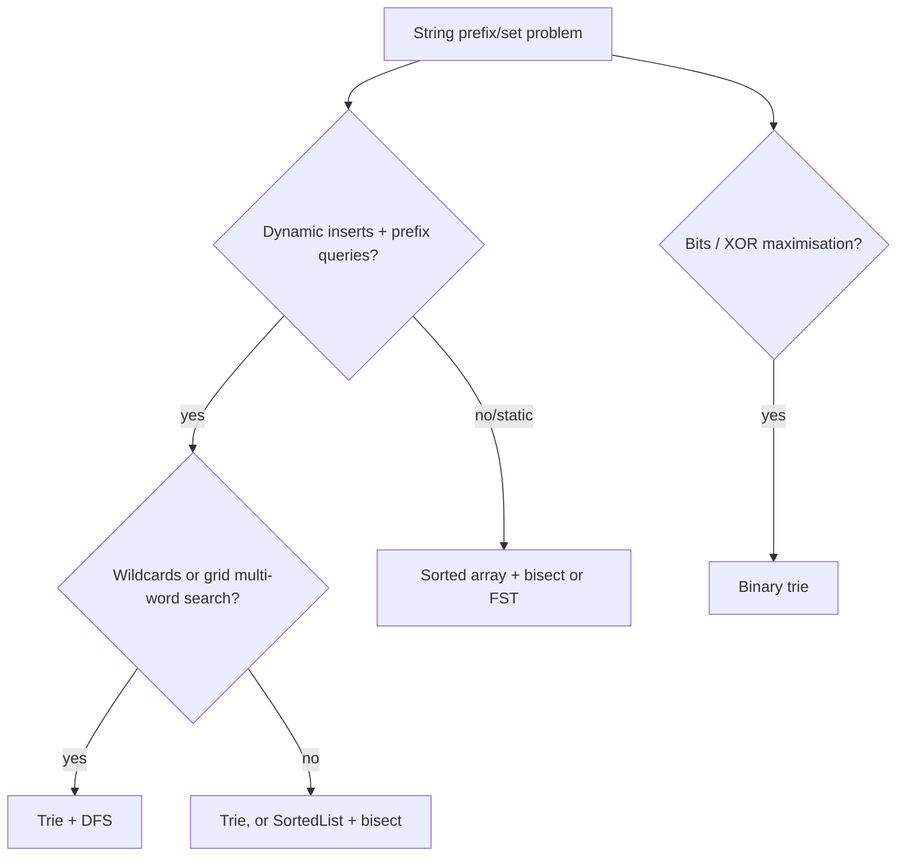

# Tries

!!! abstract "At a glance"
    **Priority:** P1 · **Complexity:** 3/5 · **Est. time:** 2 h · **Phase:** 3 · **Prereqs:** [Trees](trees.md), [Backtracking](backtracking.md) (for Word Search II)
    **You're done when:** you implement a trie in < 8 min, solve Word Search II with trie pruning, and can argue trie vs hash set vs sorted array + bisect for a prefix-search feature.

## Why it matters

A trie indexes strings by prefix. Lookup costs O(L) in the key length regardless of how many keys are stored, and it answers "all keys with prefix p" natively. Interview uses: autocomplete, word games (Boggle), wildcard matching, and XOR-maximisation with binary tries. Production uses: IP routing tables (longest-prefix match via radix/Patricia tries), autocomplete services, Aho-Corasick multi-pattern matching (WAFs, log scanning, content moderation), and key encoding in databases (adaptive radix trees).

## Core concepts

### Pattern recognition signals

| When you see… | Think… |
|---|---|
| "starts with", "prefix", "autocomplete", "suggestions" | Trie (or sorted list + bisect) |
| Many words searched in a grid/text simultaneously | Trie of words + DFS (prune by prefix) |
| Wildcards like `.` matching any character | Trie + DFS branching |
| "replace with shortest root/prefix" | Walk the trie, stop at the first end marker |
| Maximise XOR of pairs | Binary trie over bits, greedy opposite bit |
| Multi-pattern substring search | Aho-Corasick (trie + failure links) |

### Template 1: dict-based trie

```python
class TrieNode:
    __slots__ = ("children", "end")
    def __init__(self):
        self.children = {}
        self.end = False

class Trie:
    def __init__(self):
        self.root = TrieNode()

    def insert(self, word):                  # O(L)
        node = self.root
        for ch in word:
            node = node.children.setdefault(ch, TrieNode())
        node.end = True

    def _walk(self, s):
        node = self.root
        for ch in s:
            node = node.children.get(ch)
            if node is None:
                return None
        return node

    def search(self, word):
        n = self._walk(word)
        return bool(n and n.end)

    def startsWith(self, prefix):
        return self._walk(prefix) is not None
```

Compact alternative for interviews: nested dicts with a sentinel key, `node = node.setdefault(ch, {})` and `node['$'] = word`.

### Template 2: wildcard search (LC 211)

```python
def search(self, word):
    def dfs(node, i):
        if i == len(word):
            return node.end
        ch = word[i]
        if ch == ".":
            return any(dfs(c, i + 1) for c in node.children.values())
        nxt = node.children.get(ch)
        return nxt is not None and dfs(nxt, i + 1)
    return dfs(self.root, 0)
```

### Template 3: Word Search II (trie + grid backtracking + pruning)

```python
def find_words(board, words):
    root = {}
    for w in words:
        node = root
        for ch in w:
            node = node.setdefault(ch, {})
        node["$"] = w
    R, C, res = len(board), len(board[0]), []

    def dfs(r, c, parent):
        ch = board[r][c]
        node = parent[ch]
        if "$" in node:
            res.append(node.pop("$"))          # dedupe: remove found word
        board[r][c] = "#"
        for dr, dc in ((1, 0), (-1, 0), (0, 1), (0, -1)):
            nr, nc = r + dr, c + dc
            if 0 <= nr < R and 0 <= nc < C and board[nr][nc] in node:
                dfs(nr, nc, node)
        board[r][c] = ch
        if not node:                           # prune exhausted branch
            parent.pop(ch)

    for r in range(R):
        for c in range(C):
            if board[r][c] in root:
                dfs(r, c, root)
    return res
```

### Template 4: binary trie for max XOR

```python
def find_maximum_xor(nums):
    root, best = {}, 0
    for x in nums:
        node = root
        for b in range(31, -1, -1):
            node = node.setdefault((x >> b) & 1, {})
    for x in nums:
        node, cur = root, 0
        for b in range(31, -1, -1):
            bit = (x >> b) & 1
            if 1 - bit in node:
                cur |= 1 << b
                node = node[1 - bit]
            else:
                node = node[bit]
        best = max(best, cur)
    return best
```

### Comparison: prefix-search data structures

| Structure | Insert | Prefix query | Memory | Notes |
|---|---|---|---|---|
| Trie (dict nodes) | O(L) | O(P + output) | High (node per char) | Simple, supports wildcards |
| Radix / Patricia trie | O(L) | O(P + output) | Lower (compressed edges) | IP routing, ART indexes |
| Sorted list + bisect | O(n) insert, O(n log n) build | O(P log n + output) | Minimal | Great for static dictionaries |
| Hash set of all prefixes | O(L^2) | O(P) existence only | Very high | Only if you need existence checks |
| Ternary search tree | O(L log σ) | O(P log σ + output) | Medium | Space-efficient alternative |
| FST (finite state transducer) | build offline | fast | Very low | Lucene term dictionary |



### Common bugs

- Confusing `search` (needs the end flag) with `startsWith`.
- Word Search II: returning duplicates (remove the word once found), no pruning (TLE), and forgetting to restore the board cell.
- Allocating 26-array nodes for Unicode input.
- Binary trie: iterating fewer bits than the numbers need.

## Resources

| Resource | Type | Why this one | Level | Cost |
|---|---|---|---|---|
| [NeetCode roadmap: Tries](https://neetcode.io/roadmap) | video | Clear 208, 211 and 212 walkthroughs | intermediate | freemium |
| [Tech Interview Handbook: Trie](https://www.techinterviewhandbook.org/algorithms/trie/) | article | When to use it, and corner cases | intermediate | free |
| [cp-algorithms: Aho-Corasick](https://cp-algorithms.com/string/aho_corasick.html) :gem: | article | Trie plus failure links, the production multi-pattern matcher | advanced | free |
| [USFCA visualisations: Trie / Radix tree](https://www.cs.usfca.edu/~galles/visualization/Algorithms.html) :gem: | interactive | Animated trie and radix tree insertions | intermediate | free |
| [Python bisect docs](https://docs.python.org/3/library/bisect.html) | docs | The sorted-array alternative for static prefix search | intermediate | free |
| [Princeton Algorithms 4e: Strings (tries)](https://algs4.cs.princeton.edu/home/) | book/site | R-way tries and TSTs with analysis | advanced | free |

## Hands-on lab

| # | LC | Problem | Difficulty | Set | Key insight |
|---|---|---|---|---|---|
| 1 | 208 | [Implement Trie (Prefix Tree)](https://leetcode.com/problems/implement-trie-prefix-tree/) | Medium | NC150 | Node = dict children + end flag. |
| 2 | 211 | [Design Add and Search Words Data Structure](https://leetcode.com/problems/design-add-and-search-words-data-structure/) | Medium | NC150 | DFS branches on '.' wildcard. |
| 3 | 720 | [Longest Word in Dictionary](https://leetcode.com/problems/longest-word-in-dictionary/) | Medium | NC250+ | BFS/DFS only through nodes that are word ends. |
| 4 | 648 | [Replace Words](https://leetcode.com/problems/replace-words/) | Medium | NC250+ | Walk trie per word; stop at first root end. |
| 5 | 1268 | [Search Suggestions System](https://leetcode.com/problems/search-suggestions-system/) | Medium | NC250+ | Trie with top-3 per node, or sort + bisect. |
| 6 | 421 | [Maximum XOR of Two Numbers in an Array](https://leetcode.com/problems/maximum-xor-of-two-numbers-in-an-array/) | Medium | NC250+ | Binary trie over bits; greedily take opposite bit. |
| 7 | 212 | [Word Search II](https://leetcode.com/problems/word-search-ii/) | Hard | NC150 | Trie of words + grid DFS; prune found words from the trie. |
| 8 | 336 | [Palindrome Pairs](https://leetcode.com/problems/palindrome-pairs/) | Hard | NC250+ | Reverse-word map/trie + palindromic prefix/suffix split. |

**Stretch exercise:** build an autocomplete class `top3(prefix)` backed by a trie where each node caches its top-3 words by frequency. Compare memory and latency against `SortedList` + bisect for 100k words.

## Questions

### L1 — Recall

??? question "Q1. What are the time complexities of trie insert, search and startsWith?"
    ??? success "Answer"
        All O(L) for word/prefix length L, independent of the number of stored words. Space is O(total characters) in the worst case (no shared prefixes).

??? question "Q2. What does a radix (Patricia) trie optimise?"
    ??? success "Answer"
        It compresses chains of single-child nodes into one edge labelled with a substring. That cuts node count and memory, and pointer hops, which matters for sparse key spaces like IP prefixes and long URLs.

??? question "Q3. Why remove found words from the trie in Word Search II?"
    ??? success "Answer"
        To avoid duplicate results, and to prune: once a branch has no remaining words, deleting it stops future DFS from exploring it. That turns many TLE solutions into accepted ones.

### L2 — Apply

??? question "Q4. Implement Replace Words (LC 648)."
    ??? success "Answer"
        ```python
        def replace_words(dictionary, sentence):
            root = {}
            for w in dictionary:
                node = root
                for ch in w:
                    node = node.setdefault(ch, {})
                node["$"] = True
            def root_of(word):
                node = root
                for i, ch in enumerate(word):
                    if ch not in node:
                        return word
                    node = node[ch]
                    if "$" in node:
                        return word[:i + 1]
                return word
            return " ".join(root_of(w) for w in sentence.split())
        ```
        O(total characters).

??? question "Q5. Search Suggestions System: trie vs sort + bisect. Implement the simpler one."
    ??? success "Answer"
        ```python
        from bisect import bisect_left
        def suggested_products(products, search_word):
            products.sort()
            res, prefix = [], ""
            for ch in search_word:
                prefix += ch
                i = bisect_left(products, prefix)
                res.append([p for p in products[i:i + 3] if p.startswith(prefix)])
            return res
        ```
        O(n log n + L log n). Simpler than a trie and cache-friendly, and the right answer for a static catalogue.

??? question "Q6. What is the complexity of Word Search II?"
    ??? success "Answer"
        Worst case O(R·C·4·3^(L−1)) for max word length L: each cell starts a DFS with 4 then 3 branches per step. The trie ensures you explore each path once for all words simultaneously, instead of multiplying by the word count. Pruning cuts the practical cost dramatically.

### L3 — Design & trade-offs

??? question "Q7. Design autocomplete for 10M product names with p99 < 20 ms. Trie or not?"
    ??? success "Answer"
        A trie with per-node precomputed top-k (by popularity) gives O(P) lookup, but memory for 10M names in Python objects is tens of GBs, so use a compact representation (a radix trie in Rust/Go, or an FST as Lucene/Elasticsearch completion suggesters do). Alternatives: a search engine with edge n-gram tokenisation, or sorted arrays per first-2-char shard. Also handle typo tolerance (edit distance / BK-tree), personalisation and freshness updates (rebuild offline, hot-swap). A plain dict trie is an interview answer. The production answer is an FST or search engine.

??? question "Q8. Dict children vs a fixed 26-array per node?"
    ??? success "Answer"
        26-array: O(1) child access without hashing, compact in C/Java for dense lowercase alphabets, wasteful for sparse ones. Dict: flexible alphabet, memory proportional to actual children, but hashing overhead and a large per-object footprint in Python. In Python interviews, use dicts. In systems code, consider arrays or adaptive nodes (ART uses node sizes 4/16/48/256).

??? question "Q9. Longest-prefix match for IP routing: trie vs hash per prefix length?"
    ??? success "Answer"
        Binary/radix trie: walk the bits, remembering the last matching route, so O(32) for IPv4. Alternative: 33 hash tables (one per prefix length) and search from longest to shortest (O(33) lookups, or binary search on lengths with markers, per Waldvogel). Hardware uses TCAM. Trade-offs are memory, update speed and cache behaviour. Tries win on updates and shared prefixes.

### L4 — Staff-level ambiguity

??? question "Q10. A content-moderation service must match 50k banned phrases against 100k messages/sec. Design the matcher."
    ??? success "Answer"
        Aho-Corasick: build the trie of phrases plus failure links (O(total pattern length)), then scan each message in O(message length + matches), independent of the phrase count. Normalise first (case, Unicode NFKC, leetspeak mapping, whitespace), because that's where the real complexity lives. Deploy the automaton as an immutable artefact, hot-swapped on updates. Scale horizontally since it's stateless. Measure false positives (the Scunthorpe problem) and add word-boundary rules. Alternatives: Hyperscan (regex, SIMD) or a Bloom filter pre-check for exact tokens. Governance: phrase list ownership and an audit trail.

??? question "Q11. Your team built a trie-based in-memory index that is now 30 GB in Python. Options?"
    ??? success "Answer"
        Measure node count and object overhead. Move to compressed representations: radix compression, arrays of children (succinct tries / double-array tries), an FST built offline (Rust `fst` crate, Lucene), or marisa-trie bindings. Consider whether prefix queries are even the access pattern (a sorted array plus bisect on disk via mmap might suffice). Evaluate re-platforming to a search engine. Decide with data: p99 latency, memory and rebuild time targets.

## Real-world use cases

- **Autocomplete:** search boxes, including location/port-code autocomplete ("SGSIN", "NLRTM").
- **Networking:** longest-prefix match in routers (radix tries).
- **Security/moderation:** Aho-Corasick in WAFs, DLP scanners and log keyword alerting.
- **Databases:** adaptive radix trees (HyPer, DuckDB ART index), Lucene FST term dictionaries.

## Pitfalls & anti-patterns

- Using a trie where a sorted list + bisect is simpler and smaller.
- Python dict-node tries at massive scale.
- No pruning in grid DFS.
- Forgetting normalisation (case/Unicode) in real systems.

## Checklist

- [ ] I can implement a trie with insert/search/startsWith in < 8 min
- [ ] I solved Word Search II with pruning
- [ ] I can compare trie, radix, sorted array and FST for a prefix feature
- [ ] I answered all L3 questions out loud in < 3 min each
