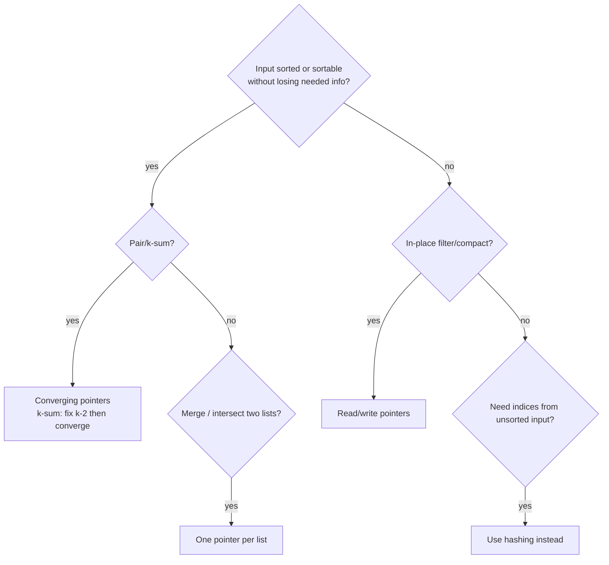

# Two pointers

!!! abstract "At a glance"
    **Priority:** P0 · **Complexity:** 2/5 · **Est. time:** 3 h · **Phase:** 1 · **Prereqs:** [Arrays & hashing](arrays-hashing.md)
    **You're done when:** you can solve 3Sum with correct duplicate handling in < 20 min, and prove *why* moving the shorter wall in Container With Most Water is safe.

## Why it matters

Two pointers trades the O(n) memory of hashing for O(1) memory by exploiting **order**: sortedness, or a monotone relationship between pointer moves and the objective. It is the in-place, cache-friendly technique behind merge steps, partitioning (quicksort, Dutch flag) and dedupe. Interviewers love it because the *proof* of correctness ("why can I discard this pointer?") separates pattern-matchers from people who understand invariants.

## Core concepts

### Pattern recognition signals

| When you see… | Think… |
|---|---|
| Sorted array + pair/triplet with target sum | Converging pointers (L, R) |
| "in place", "O(1) extra space", remove/move elements | Read/write (slow/fast) pointers |
| Palindrome check | Converging from both ends |
| Merge two sorted sequences | One pointer per sequence |
| "maximise area/width between two lines" | Converging pointers + greedy discard |
| Linked list middle / cycle | Fast/slow (see [linked list](linked-list.md)) |
| k-Sum | Sort + fix k-2 elements + two pointers |

### Template 1: converging pointers (O(n) after the O(n log n) sort)

```python
def two_sum_sorted(a, target):
    l, r = 0, len(a) - 1
    while l < r:
        s = a[l] + a[r]
        if s == target:
            return [l, r]
        if s < target:
            l += 1          # need bigger: only moving l can increase the sum
        else:
            r -= 1
    return []
```

**Invariant:** every pair that includes an index outside [l, r] has already been ruled out.

### Template 2: read/write (slow/fast) compaction

```python
def remove_duplicates_sorted(a):
    w = 0                       # a[:w] is the answer so far
    for r in range(len(a)):
        if w == 0 or a[r] != a[w - 1]:
            a[w] = a[r]
            w += 1
    return w
```

Generalises to "keep at most k copies": compare against `a[w - k]`.

### Template 3: 3Sum (sort + fix + converge), O(n^2)

```python
def three_sum(nums):
    nums.sort()
    res = []
    for i in range(len(nums) - 2):
        if nums[i] > 0:
            break
        if i > 0 and nums[i] == nums[i - 1]:
            continue                        # skip duplicate anchors
        l, r = i + 1, len(nums) - 1
        while l < r:
            s = nums[i] + nums[l] + nums[r]
            if s < 0:
                l += 1
            elif s > 0:
                r -= 1
            else:
                res.append([nums[i], nums[l], nums[r]])
                l += 1
                while l < r and nums[l] == nums[l - 1]:
                    l += 1                  # skip duplicate second elements
                r -= 1
    return res
```

### Template 4: trapping rain water, O(n) time, O(1) space

```python
def trap(h):
    l, r = 0, len(h) - 1
    max_l = max_r = water = 0
    while l < r:
        if h[l] < h[r]:
            max_l = max(max_l, h[l]); water += max_l - h[l]; l += 1
        else:
            max_r = max(max_r, h[r]); water += max_r - h[r]; r -= 1
    return water
```

Why it works: if `h[l] < h[r]`, the right side has a wall at least `h[r] > h[l]`, so the water at l is bounded by `max_l` alone.

### Comparison: which two-pointer shape?

| Shape | Movement | Examples | Requirement |
|---|---|---|---|
| Converging | l→ ←r | 167, 15, 11, 42, 125 | Sorted, or a monotone discard argument |
| Same direction (read/write) | w→ r→ | 26, 283, 27, 80 | In-place compaction |
| Two sequences | i→ j→ | 88 (from the back), 986 | Both sorted |
| Fast/slow | slow→ fast→→ | 141, 876, 287 | Linked structure / functional graph |
| Reversal tricks | swap ends | 344, 189 | Symmetric operations |



### Common bugs

- 3Sum duplicates: skipping at the wrong level (`i > 0` check), or skipping before recording.
- `while l <= r` in pair problems pairs an element with itself.
- Merge Sorted Array: filling from the front overwrites unread data, so fill from the back.
- Sorting destroys original indices. Carry `(value, index)` if indices are needed.
- Container: moving the taller wall (the reverse of the correct greedy).

## Resources

| Resource | Type | Why this one | Level | Cost |
|---|---|---|---|---|
| [NeetCode roadmap: Two Pointers](https://neetcode.io/roadmap) | video | Clear walkthroughs including the 3Sum duplicate logic | intermediate | freemium |
| [Tech Interview Handbook: Array techniques](https://www.techinterviewhandbook.org/algorithms/array/) | article | Two pointers / traversing from the right checklist | intermediate | free |
| [Hello Interview: coding patterns](https://www.hellointerview.com/learn/code) :gem: | article/interactive | Animated pattern explanations with a "why it works" focus | intermediate | freemium |
| [AlgoMonster](https://algo.monster/) | course | Pattern templates with a decision flowchart | intermediate | paid |
| [Coding Interview Patterns (ByteByteGo)](https://bytebytego.com/courses/coding-patterns) | book/course | Two-pointer chapter with diagrams of pointer invariants | intermediate | paid |
| [labuladong's algo notes (EN)](https://labuladong.online/algo/en/) :gem: | article | Framework-style thinking; a strong "double pointer" series | intermediate | freemium |

## Hands-on lab

| # | LC | Problem | Difficulty | Set | Key insight |
|---|---|---|---|---|---|
| 1 | 125 | [Valid Palindrome](https://leetcode.com/problems/valid-palindrome/) | Easy | NC150 | Converging pointers skipping non-alphanumerics. |
| 2 | 344 | [Reverse String](https://leetcode.com/problems/reverse-string/) | Easy | NC250+ | Swap ends inward, in place. |
| 3 | 88 | [Merge Sorted Array](https://leetcode.com/problems/merge-sorted-array/) | Easy | NC250+ | Fill from the back to avoid overwriting. |
| 4 | 283 | [Move Zeroes](https://leetcode.com/problems/move-zeroes/) | Easy | NC250+ | Slow write pointer for non-zeros, fast read pointer. |
| 5 | 26 | [Remove Duplicates from Sorted Array](https://leetcode.com/problems/remove-duplicates-from-sorted-array/) | Easy | NC250+ | Write pointer advances only on new value. |
| 6 | 680 | [Valid Palindrome II](https://leetcode.com/problems/valid-palindrome-ii/) | Easy | NC250+ | On first mismatch try skipping left OR right once. |
| 7 | 167 | [Two Sum II - Input Array Is Sorted](https://leetcode.com/problems/two-sum-ii-input-array-is-sorted/) | Medium | NC150 | Sorted -> move the pointer that fixes the sum direction. |
| 8 | 15 | [3Sum](https://leetcode.com/problems/3sum/) | Medium | NC150 | Sort, fix i, two-pointer the rest; skip duplicates at both levels. |
| 9 | 18 | [4Sum](https://leetcode.com/problems/4sum/) | Medium | NC250+ | Generalise to k-sum recursion down to 2-sum. |
| 10 | 11 | [Container With Most Water](https://leetcode.com/problems/container-with-most-water/) | Medium | NC150 | Move the shorter wall; the taller one cannot improve area. |
| 11 | 881 | [Boats to Save People](https://leetcode.com/problems/boats-to-save-people/) | Medium | NC250+ | Sort; pair heaviest with lightest if it fits. |
| 12 | 189 | [Rotate Array](https://leetcode.com/problems/rotate-array/) | Medium | NC250+ | Three reversals: whole, first k, rest. |
| 13 | 42 | [Trapping Rain Water](https://leetcode.com/problems/trapping-rain-water/) | Hard | NC150 | Water at i = min(maxL, maxR) - h; advance the side with smaller max. |

**Stretch exercise:** implement a generic `k_sum(nums, target, k)` that recurses down to two pointers. Test it against 3Sum and 4Sum. Discuss complexity O(n^(k-1)).

## Questions

### L1 — Recall

??? question "Q1. Prove that moving the shorter wall in Container With Most Water never loses the optimum."
    ??? success "Answer"
        Let `h[l] < h[r]`. Any container using l with some r' < r has width < (r - l) and height ≤ h[l]. So its area is less than the current area. Every remaining pair involving l is dominated, and discarding l is safe. Symmetric when h[r] ≤ h[l].

??? question "Q2. When is two pointers *not* applicable to a pair-sum problem?"
    ??? success "Answer"
        When you must return original indices from unsorted input and can't afford the sort plus index bookkeeping, when the data is a stream (single pass), or when the objective isn't monotone in pointer moves. Use hashing then.

??? question "Q3. What is the invariant in read/write compaction?"
    ??? success "Answer"
        `a[:w]` always holds the correct output for the prefix `a[:r]` already read. The read pointer never falls behind the write pointer, so writes never clobber unread data.

### L2 — Apply

??? question "Q4. Implement Valid Palindrome II (one deletion allowed)."
    ??? success "Answer"
        ```python
        def valid_palindrome(s):
            def is_pal(l, r):
                while l < r:
                    if s[l] != s[r]:
                        return False
                    l += 1; r -= 1
                return True
            l, r = 0, len(s) - 1
            while l < r:
                if s[l] != s[r]:
                    return is_pal(l + 1, r) or is_pal(l, r - 1)
                l += 1; r -= 1
            return True
        ```
        O(n). Only the first mismatch branches, and each branch is linear.

??? question "Q5. Rotate an array right by k in place with O(1) extra space."
    ??? success "Answer"
        ```python
        def rotate(a, k):
            n = len(a); k %= n
            def rev(i, j):
                while i < j:
                    a[i], a[j] = a[j], a[i]; i += 1; j -= 1
            rev(0, n - 1); rev(0, k - 1); rev(k, n - 1)
        ```
        Reversing the whole array puts the last k in front (reversed). Reversing each part restores their order.

??? question "Q6. Trace Trapping Rain Water on [4,2,0,3,2,5]."
    ??? success "Answer"
        l=0 (4), r=5 (5). h[l]<h[r]: max_l=4, water+=0, l=1. h=2: water+=2 (2), l=2. h=0: +4 (6), l=3. h=3: +1 (7), l=4. h=2: +2 (9), l=5, stop. Answer **9**.

### L3 — Design & trade-offs

??? question "Q7. 3Sum Closest vs 3Sum: how does the algorithm change?"
    ??? success "Answer"
        Same sort + fix + converge. Track `best` by `abs(s - target)`, move l/r based on the sign of `s - target`, return early on an exact match. Duplicate skipping becomes an optimisation rather than a correctness requirement. Still O(n^2).

??? question "Q8. Merging two sorted arrays of 10^9 elements each stored on disk. What do you do?"
    ??? success "Answer"
        The two-pointer merge is still the right algorithm, but it's I/O-bound. Stream both files with large buffered reads (for example 64 MB blocks), merge into an output buffer, and flush sequentially: one pass, O(n/B) I/Os. For k files, use a heap (k-way merge). Parallelise by splitting on key ranges found via sampling or binary search on both files. This is the merge phase of external sort and LSM compaction.

??? question "Q9. You're asked for 'all unique pairs summing to target' in an array with many duplicates. Hash or pointers?"
    ??? success "Answer"
        Sort + two pointers with duplicate skipping gives unique pairs naturally, in O(n log n) time and O(1) extra. The hash approach needs a set of seen pairs (O(n) memory) and careful counting for x = target/2. Choose pointers unless the input is a stream.

### L4 — Staff-level ambiguity

??? question "Q10. 'Find pairs of shipments whose combined weight fits a container exactly' across a 500M-row table in a warehouse. How do you translate the two-pointer idea?"
    ??? success "Answer"
        Option A: a SQL self-join on `w2 = cap - w1`. Hash join, cost O(n) with enough memory, but explosive output with duplicates, so aggregate counts or dedupe first. Option B: bucket by weight (a histogram), then for each weight w pair with bucket (cap - w). That is O(distinct weights) and very cheap. Option C: a distributed job partitioned by `min(w, cap - w)` so partners co-locate. The discussion points are output-size blow-up, exact vs tolerance matching (a tolerance turns into a band join, where sort + two pointers per partition shines), and data skew.

??? question "Q11. How would you explain two pointers to a junior so they can derive it, not memorise it?"
    ??? success "Answer"
        Start from brute force over all pairs (the n×n grid of (i, j)). Show that sortedness means each comparison lets you eliminate an entire row or column of that grid. Two pointers is just walking the frontier of that grid in O(n) steps. The general skill is to ask "what does one comparison let me rule out?" That framing transfers to binary search, sliding windows and greedy.

## Real-world use cases

- **LSM-tree compaction** (RocksDB, Cassandra): merging sorted SSTables is a multi-way two-pointer merge.
- **Sorted-set intersection** in search engines: posting-list intersection for AND queries (with galloping).
- **Diff tools:** walking two sorted snapshots (for example yesterday's and today's container inventory) to emit adds, removes and changes in one pass.
- **In-place filtering** in data pipelines to avoid allocation (numpy boolean masks do this at C speed).

## Pitfalls & anti-patterns

- Sorting when indices are required and then returning sorted indices.
- Treating two pointers as a heuristic without a discard proof. You'll pick the wrong pointer to move.
- Off-by-one on `l < r` vs `l <= r`.
- Forgetting the O(n log n) cost of the sort when quoting complexity.

## Checklist

- [ ] I can write converging, read/write and k-sum templates from memory
- [ ] I can prove correctness for Container With Most Water and Trapping Rain Water
- [ ] I solved all NC150 problems in this set within the time-box
- [ ] I answered all L3 questions out loud in < 3 min each
