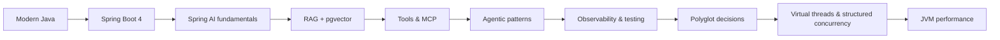

# Java & Spring AI

Build AI features on the JVM alongside your Python stack: **Java 25 LTS + Spring Boot 4.x + Spring AI 2.0** (GA 2026-06-12; 2.0.1 is the current patch as of September 2026). The point of this track is not to replace Python — it is to make you the engineer who can put LLM features *next to the systems of record* (Java), expose them to Python agent runtimes via MCP, and decide honestly where each language belongs.

!!! abstract "Track outcome"
    By the end you can: (1) write modern Java (records, sealed types, pattern matching, virtual threads); (2) ship a Spring AI service with `ChatClient`, advisors, validated structured output, chat memory, RAG on pgvector and tool calling; (3) expose an **MCP tool server** that your Python LangGraph orchestrator uses; (4) make it observable and testable (Micrometer/OTel, Testcontainers, evals in CI); and (5) defend a polyglot architecture decision in an ADR.

## Reading order

Read top to bottom; each page's *You're done when* line is the exit check before moving on.

1. [Modern Java 21→25: records, sealed types, patterns](modern-java.md) — P1, ~3 h
2. [Virtual threads, structured concurrency & scoped values](virtual-threads-structured-concurrency.md) — P0, ~3 h
3. [Spring Boot 4 & Spring Framework 7](spring-boot-4.md) — P0, ~3 h
4. [Spring AI 2.0 fundamentals: ChatClient, advisors, structured output](spring-ai-fundamentals.md) — P0, ~3 h
5. [RAG with Spring AI & pgvector](spring-ai-rag.md) — P0, ~3 h
6. [Tool calling & MCP servers in Spring AI](spring-ai-tools-mcp.md) — P0, ~3 h
7. [Agentic patterns with Spring AI](spring-ai-agents.md) — P1, ~3 h
8. [Observability & testing: Micrometer, OTel, Testcontainers](observability-testing.md) — P1, ~2 h
9. [JVM performance, GC & Leyden/AOT](jvm-performance.md) — P2, ~3 h
10. [Java vs Python for AI: polyglot architecture decisions](polyglot-ai-architecture.md) — P1, ~1 h

## Topics

| Topic | Priority | Complexity | Phase | Hours |
|---|---|---|---|---|
| [Modern Java 21→25: records, sealed types, patterns](modern-java.md) | P1 | 2/5 | 1 | 3 |
| [Spring Boot 4 & Spring Framework 7](spring-boot-4.md) | P0 | 2/5 | 1 | 3 |
| [Spring AI 2.0 fundamentals: ChatClient, advisors, structured output](spring-ai-fundamentals.md) | P0 | 2/5 | 1 | 3 |
| [RAG with Spring AI & pgvector](spring-ai-rag.md) | P0 | 3/5 | 2 | 3 |
| [Tool calling & MCP servers in Spring AI](spring-ai-tools-mcp.md) | P0 | 3/5 | 3 | 3 |
| [Agentic patterns with Spring AI](spring-ai-agents.md) | P1 | 3/5 | 3 | 3 |
| [Observability & testing: Micrometer, OTel, Testcontainers](observability-testing.md) | P1 | 2/5 | 4 | 2 |
| [Java vs Python for AI: polyglot architecture decisions](polyglot-ai-architecture.md) | P1 | 2/5 | 4 | 1 |
| [Virtual threads, structured concurrency & scoped values](virtual-threads-structured-concurrency.md) | P0 | 3/5 | 5 | 3 |
| [JVM performance, GC & Leyden/AOT](jvm-performance.md) | P2 | 4/5 | 5 | 3 |

Total: about 27 hours. Question bank: [Java & Spring AI questions](questions.md).

## Suggested path

1. **Phase 1 (foundations):** Modern Java → Spring Boot 4 → Spring AI fundamentals. Output: a Boot 4 skeleton with a typed `ChatClient` endpoint and chat memory.
2. **Phase 2:** RAG on pgvector. Output: the capstone RAG service ported to Java with tenant filtering and a golden-set comparison against the Python version.
3. **Phase 3:** Tools/MCP then agentic patterns. Output: a Spring AI **MCP server consumed by the Python LangGraph orchestrator** — the core capstone integration.
4. **Phase 4:** Observability/testing, then the polyglot ADR. Output: one cross-language trace, CI evals, and the ADR.
5. **Phase 5 (depth):** virtual threads/structured concurrency and JVM performance, once you have a real service to measure.

If time is tight, the non-negotiable core is: Spring Boot 4 → Spring AI fundamentals → RAG → Tools & MCP (all P0).

## Spring AI vs Python frameworks

As of September 2026. "Java" means Spring AI 2.0 on Boot 4; Python versions are LangGraph 1.x and Pydantic AI.

| Concern | Spring AI 2.0 (Java) | LangGraph 1.x (Python) | Pydantic AI (Python) |
|---|---|---|---|
| Core abstraction | `ChatClient` + advisor chain | Stateful graph of nodes/edges | `Agent` with typed deps and output |
| Typed structured output | `entity(Record.class)`, optional native mode + `validateSchema()` | Via LangChain/Pydantic structured output | First-class `output_type`, built-in validation retry |
| Tool calling | `@Tool`, `ToolCallback`, tool loop in `ToolCallingAdvisor`, limits | Tool nodes / prebuilt agents | `@agent.tool` with `RunContext` |
| MCP | Server (`@McpTool`, `@McpResource`, `@McpPrompt`) and client, Streamable HTTP default | Client via adapters | Client support |
| RAG building blocks | Modular RAG advisors, `VectorStore` over ~20 stores, ETL readers | LangChain retrievers/loaders | Bring your own |
| Durable execution / HITL | Not built in (use your own store or workflow engine) | Checkpointers, interrupts, time-travel | Via integrations (e.g., durable-execution backends) |
| Memory | `ChatMemory` message window + repositories (JDBC, Redis, etc.) | Checkpoint state + long-term store | Explicit message history |
| Observability | Micrometer observations to OTel | LangSmith / OTel | Logfire / OTel |
| Concurrency model | Virtual threads (blocking code) | asyncio | asyncio |
| Enterprise integration | Excellent (Security, JPA, transactions, Actuator) | Assemble yourself | Assemble yourself |
| Eval/optimisation ecosystem | Evaluator interfaces only | Rich (LangSmith, Ragas, DSPy adjacent) | Pydantic Evals, Logfire |
| Best for | Stateless AI features and tool/RAG services beside Java systems | Long-running, stateful, human-in-the-loop agents | Typed, small-to-medium agent services |

**Default split for the capstone:** LangGraph orchestrates; Spring AI provides governed MCP tools and RAG; one shared golden set evaluates both.

## Practice for this chapter

This chapter's practice is concrete: build the Spring AI MCP server that the capstone's Python orchestrator calls, in [capstone milestone M3](../agentic-ai/projects/capstone.md) (weeks 9–12).

## Key sources

- [Spring AI 2.0.0 GA announcement](https://spring.io/blog/2026/06/12/spring-ai-2-0-0-GA-available-now/)
- [Spring AI reference](https://docs.spring.io/spring-ai/reference/getting-started.html) (docs for 2.0.x)
- [JDK 25 project page](https://openjdk.org/projects/jdk/25/)
- [Spring Boot 4.0 release notes](https://github.com/spring-projects/spring-boot/wiki/Spring-Boot-4.0-Release-Notes)
- [awesome-spring-ai](https://github.com/spring-ai-community/awesome-spring-ai) :gem:
- Machine-readable list: `data/resources/java-spring-ai.yml`
