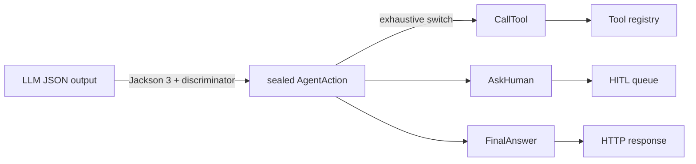

# Modern Java 21→25: records, sealed types, patterns

!!! abstract "At a glance"
    **Priority:** P1 · **Complexity:** 2/5 · **Est. time:** 3 h · **Phase:** 1 · **Prereqs:** enterprise Java (8/11/17), [Pydantic v2](../python/pydantic-v2.md)
    **You're done when:** you can model an LLM tool-call result as a sealed hierarchy of records, exhaustively `switch` over it with record patterns, and explain which JDK 21–25 features are final vs preview.

## Why it matters

If your last deep Java was 8/11, the language you'll write Spring AI code in has changed shape. JDK 25 (GA 2025-09-16) is the current LTS as of September 2026, and Spring Boot 4 / Spring AI 2.0 code is idiomatically written with **records as DTOs, sealed interfaces as sum types, and pattern-matching `switch`** as the dispatcher. These map almost 1:1 onto what you already do in Python with Pydantic models and discriminated unions — which is exactly why they matter for AI work: LLM structured output, tool arguments and agent state are *data*, and modern Java finally models data without ceremony.

Interview angle: "Why would you pick Java for an AI service?" gets a much better answer when you can show a 15-line type-safe model of agent actions rather than 200 lines of POJOs and visitors.

## Core concepts

### What changed 17 → 25 (the parts you'll actually use)

| Feature | JEP / JDK | Status in 25 | Python analogue |
|---|---|---|---|
| Records | 395 / 16 | Final | `@dataclass(frozen=True)` / Pydantic `BaseModel` (frozen) |
| Sealed classes/interfaces | 409 / 17 | Final | `Union[...]` + discriminator; `typing.Literal` tags |
| Pattern matching for `switch` | 441 / 21 | Final | `match`/`case` (PEP 634) |
| Record patterns (deconstruction) | 440 / 21 | Final | `case Point(x=0, y=y):` |
| Sequenced collections (`getFirst`, `reversed`) | 431 / 21 | Final | `list[0]`, `reversed()` |
| Virtual threads | 444 / 21 | Final | (see [virtual threads page](virtual-threads-structured-concurrency.md)) |
| Unnamed variables & patterns `_` | 456 / 22 | Final | `_` |
| Markdown doc comments `///` | 467 / 23 | Final | docstrings |
| Stream gatherers | 485 / 24 | Final | `itertools.batched`, custom generators |
| Module import declarations | 511 / 25 | Final | `from x import *` (scoped to a module) |
| Compact source files & instance `main` | 512 / 25 | Final | a script with no class |
| Flexible constructor bodies | 513 / 25 | Final | validation before `super().__init__` |
| Scoped values | 506 / 25 | Final | `contextvars` |
| Primitive types in patterns | 507 / 25 | **Preview** | — |
| Structured concurrency | 505 / 25 | **Preview (5th)** | `asyncio.TaskGroup` |

Rule of thumb: in production code on an LTS, use **final** features freely; keep preview features (`--enable-preview`) out of shared libraries — preview APIs change between releases (structured concurrency's API changed shape in JDK 25).

### Records: immutable data carriers, not entities

```java
public record ShipmentStatus(String shipmentId, Status status, Instant updatedAt) {
    public ShipmentStatus {                       // compact canonical constructor
        Objects.requireNonNull(shipmentId, "shipmentId");
        if (shipmentId.isBlank()) throw new IllegalArgumentException("blank id");
    }
    public enum Status { BOOKED, IN_TRANSIT, DELIVERED, EXCEPTION }
}
```

Senior nuance:

- Records are **shallowly** immutable. A `List<String>` component can still be mutated — copy defensively (`List.copyOf(items)`) in the compact constructor.
- Records are ideal for **DTOs, events, tool arguments, LLM structured output, value objects**. They are a poor fit for JPA entities (need no-arg constructor, mutability, proxies).
- Jackson (Jackson 3 in Boot 4) and Spring AI's `entity(...)` deserialize records via the canonical constructor; the JSON schema Spring AI sends to the model is derived from the record components.

### Sealed types + pattern matching = algebraic data types

The single most useful modern-Java idiom for agent code: model "the model decided to do one of N things" as a closed set.

```java
public sealed interface AgentAction permits CallTool, AskHuman, FinalAnswer {}
public record CallTool(String name, Map<String, Object> args) implements AgentAction {}
public record AskHuman(String question) implements AgentAction {}
public record FinalAnswer(String text, List<String> citations) implements AgentAction {}

String handle(AgentAction action) {
    return switch (action) {                         // exhaustive: no default needed
        case CallTool(var name, var args) when name.startsWith("delete") ->
                throw new SecurityException("destructive tool needs approval: " + name);
        case CallTool(var name, var args)  -> toolRegistry.invoke(name, args);
        case AskHuman(var q)               -> hitlQueue.enqueue(q);
        case FinalAnswer(var text, _)      -> text;  // unnamed pattern (JDK 22+)
    };
}
```

Why this beats the visitor pattern: the compiler checks exhaustiveness. Add a `Handoff` record to the `permits` list and every `switch` without a matching case fails to compile — the Java equivalent of `mypy`/`pyright` `assert_never`. Python's `match` gives you the syntax, but not compile-time exhaustiveness by default.

**Polymorphic JSON.** For LLM output that is a sealed hierarchy, Jackson needs a discriminator:

```java
@JsonTypeInfo(use = JsonTypeInfo.Id.NAME, property = "type")
@JsonSubTypes({
    @JsonSubTypes.Type(value = CallTool.class, name = "call_tool"),
    @JsonSubTypes.Type(value = AskHuman.class, name = "ask_human"),
    @JsonSubTypes.Type(value = FinalAnswer.class, name = "final_answer")})
public sealed interface AgentAction permits CallTool, AskHuman, FinalAnswer {}
```

Jackson 3 keeps the annotations in `com.fasterxml.jackson.annotation` (only core/databind moved to `tools.jackson.*`), so this compiles on Boot 4 unchanged. This is the Pydantic `Field(discriminator="type")` equivalent. Note: provider-native structured output (OpenAI strict mode etc.) has restrictions on `oneOf`/`anyOf` schemas — for complex unions a flat record with an enum `type` field plus nullable payload fields is often more robust with LLMs.

### Stream gatherers (JDK 24, final)

Intermediate operations you could not write before without collecting: windowing, stateful scans, bounded concurrency mapping.

```java
List<List<Document>> batches = docs.stream()
        .gather(Gatherers.windowFixed(64))   // batch for the embedding API
        .toList();

// bounded concurrent mapping on virtual threads — ordered results
List<Embedding> embeddings = batches.stream()
        .gather(Gatherers.mapConcurrent(8, embeddingClient::embed))
        .flatMap(List::stream)
        .toList();
```

`mapConcurrent(maxConcurrency, fn)` runs on virtual threads and preserves encounter order — a compact way to respect an embedding provider's rate limit.

### JDK 25 ergonomics

```java
// Hello.java — compact source file (JEP 512); run with: java Hello.java
void main() {
    var r = new Reading("berth-7", 42.0);
    IO.println(r);
}
record Reading(String sensor, double value) {}
```

- **Compact source files** implicitly import `java.base`; `java.lang.IO` provides `println`/`readln`. Great for spikes and teaching; not for services.
- **Module imports** (`import module java.net.http;`) import all exported packages of a module.
- **Flexible constructor bodies**: statements (validation, argument computation) may run before `super(...)`/`this(...)`, as long as they do not touch `this`.

### Senior-level nuance juniors miss

- `var` is for locals where the type is obvious from the right-hand side; don't use it where a reviewer must jump to a declaration to understand the type.
- Records' `equals/hashCode` include **all** components — putting an `Instant` or a large `byte[]` in a record used as a map key is a bug magnet (arrays compare by identity).
- Sealed hierarchies across packages require the permitted subclasses to be in the same module (or same package if unnamed module).
- Pattern-matching `switch` on `null` throws NPE unless you add `case null ->` explicitly.



## Resources

| Resource | Type | Why this one | Level | Cost |
|---|---|---|---|---|
| [JDK 25 project page](https://openjdk.org/projects/jdk/25/) | docs | Authoritative list of JEPs in the LTS with status | intermediate | free |
| [javaalmanac.io](https://javaalmanac.io/) :gem: | interactive | Version-by-version API diffs and runnable snippets; fastest way to answer "since which JDK?" | intermediate | free |
| [dev.java — Learn](https://dev.java/learn/) | docs/tutorial | Oracle's modern tutorials on records, sealed classes, patterns; written by the Java DevRel team | intermediate | free |
| [JEP Café / Java channel](https://www.youtube.com/@java) :gem: | video | José Paumard's JEP Café episodes explain each feature with the *why*; Nicolai Parlog's Newscasts track previews | intermediate | free |
| [nipafx.dev](https://nipafx.dev/) :gem: | article | Nicolai Parlog's deep dives on data-oriented programming in Java | advanced | free |
| [inside.java](https://inside.java/) | article | Official blog from the JDK team; design rationale for patterns and gatherers | advanced | free |
| [JEP 485: Stream Gatherers](https://openjdk.org/jeps/485) | docs | Read the motivation section — it is a great mental model for custom intermediate ops | advanced | free |
| [JEP 512: Compact Source Files](https://openjdk.org/jeps/512) | docs | Exact semantics of instance main and implicit imports | intermediate | free |

## Hands-on lab

**Goal (60–90 min):** build a typed "agent decision" model you'll reuse in [Spring AI fundamentals](spring-ai-fundamentals.md) and [agentic patterns](spring-ai-agents.md).

1. Install JDK 25 (`sdk install java 25-tem` via SDKMAN, or your distro of choice). Verify `java -version`.
2. Create `AgentActions.java` as a compact source file containing the sealed `AgentAction` hierarchy above plus a fourth record `Handoff(String agent, String reason)`.
3. Write `void main()` that parses three JSON strings (use Jackson 3: `tools.jackson.databind.json.JsonMapper`) into `AgentAction` and dispatches via exhaustive `switch`. Run with `java --class-path jackson-*.jar AgentActions.java` or move into a Maven project.
4. Remove the `Handoff` case from the switch — observe the compile error. That's the payoff.
5. Add a gatherer pipeline: take 200 fake documents, `windowFixed(64)`, and `mapConcurrent(4, ...)` a fake embedding call that sleeps 200 ms. Measure: ~4 batches × 200 ms ≈ ~200–400 ms total vs ~800 ms sequential.
6. Port the same model to Pydantic (`Annotated[Union[...], Field(discriminator="type")]`) and compare line counts and failure modes (runtime vs compile time).

**Expected output:** a table of three dispatched actions, a compile error screenshot for step 4, and timing numbers for step 5.

## Questions

### L1 — Recall

??? question "Q1. Which of these are final in JDK 25: record patterns, structured concurrency, scoped values, stream gatherers, primitive patterns?"
    ??? success "Answer"
        Final: record patterns (JDK 21), scoped values (JEP 506, JDK 25), stream gatherers (JEP 485, JDK 24). Preview: structured concurrency (JEP 505, fifth preview) and primitive types in patterns (JEP 507, third preview). Preview features need `--enable-preview` at compile and run time and can change between releases.

??? question "Q2. What does a sealed interface give you that an ordinary interface doesn't?"
    ??? success "Answer"
        A closed, compiler-known set of implementations (`permits`). This enables exhaustive pattern-matching `switch` without a `default`, so adding a new subtype breaks compilation at every unhandled site. It also documents intent (a sum type) and prevents third parties from adding implementations.

??? question "Q3. Are records immutable?"
    ??? success "Answer"
        Shallowly. Fields are `private final` and there are no setters, but a component that references a mutable object (e.g., `ArrayList`) can still be mutated through the accessor. Use `List.copyOf` / `Map.copyOf` in the compact constructor for deep-enough immutability.

### L2 — Apply

??? question "Q4. Write an exhaustive switch that returns an HTTP status for a sealed ToolResult with Success(Object value), NotFound(String id), and RateLimited(Duration retryAfter)."
    ??? success "Answer"
        ```java
        sealed interface ToolResult permits Success, NotFound, RateLimited {}
        record Success(Object value) implements ToolResult {}
        record NotFound(String id) implements ToolResult {}
        record RateLimited(Duration retryAfter) implements ToolResult {}

        int status(ToolResult r) {
            return switch (r) {
                case Success _ -> 200;
                case NotFound _ -> 404;
                case RateLimited(var d) when d.toSeconds() > 60 -> 503;
                case RateLimited _ -> 429;
            };
        }
        ```
        Guards (`when`) must come before the unguarded case for the same type, otherwise the guarded case is dominated and fails to compile.

??? question "Q5. You need to embed 10,000 chunks; the provider allows 8 concurrent requests and 64 inputs per request. Sketch it with gatherers."
    ??? success "Answer"
        ```java
        List<float[]> vectors = chunks.stream()
            .gather(Gatherers.windowFixed(64))                    // 157 batches
            .gather(Gatherers.mapConcurrent(8, embeddingModel::embed)) // List<String> -> List<float[]>
            .flatMap(List::stream)
            .toList();
        ```
        `mapConcurrent` uses virtual threads, caps in-flight calls at 8, and preserves order so vectors line up with chunks. Add retry/backoff inside the mapped function for 429s. In Spring AI you'd more likely call `vectorStore.add(docs)` which batches for you (see `max-document-batch-size`), but this pattern matters for custom pipelines.

??? question "Q6. An LLM returns JSON with type=ask_human and a question field. What do you need for Jackson to produce an AskHuman record from a sealed AgentAction?"
    ??? success "Answer"
        `@JsonTypeInfo(use = Id.NAME, property = "type")` on the sealed interface and `@JsonSubTypes` mapping `ask_human` → `AskHuman.class` (or `@JsonTypeName` on each record). Records deserialize via the canonical constructor; component names must match JSON property names (or use `@JsonProperty`). Then `mapper.readValue(json, AgentAction.class)`.

### L3 — Design & trade-offs

??? question "Q7. Records vs Lombok @Value vs classic POJOs for a Spring Boot 4 codebase — decide and defend."
    ??? success "Answer"
        Records for DTOs, events, commands, tool I/O and value objects: language-level, no annotation processor, pattern-matchable, work with Jackson 3 and Spring AI schema generation. Keep classes for JPA entities (need mutability/no-arg ctor/proxies) and for types that need inheritance. Lombok `@Value`/`@Builder` still has a niche for records with many optional fields (builder ergonomics) — but it adds build-tooling coupling that frequently breaks on JDK upgrades. A good policy: "records by default; Lombok only on entities, and only `@Getter/@Setter`."

??? question "Q8. Should you enable preview features (structured concurrency) in a production service on JDK 25?"
    ??? success "Answer"
        Trade-off: structured concurrency gives cleaner fan-out/cancellation today, but preview APIs change (JDK 25 replaced the subclass-based `ShutdownOnFailure` API with `open()` + `Joiner`), and `--enable-preview` class files only run on the exact JDK feature release they were compiled for — this pins your runtime upgrade path. Reasonable stance: allowed in leaf services behind an internal wrapper (one class to rewrite), never in shared libraries; otherwise use `ExecutorService` with virtual threads + `CompletableFuture`/`invokeAll`.

??? question "Q9. Sealed hierarchy with @JsonTypeInfo vs a flat record with an enum type and nullable fields for LLM structured output — which one?"
    ??? success "Answer"
        Sealed hierarchy: better domain model, exhaustive handling, invalid states unrepresentable. But the JSON schema becomes `oneOf`/`anyOf` with discriminators, which some providers' strict structured-output modes restrict and smaller models follow less reliably. Flat record: trivially schema-able, robust across providers, but allows invalid combinations (type=ASK_HUMAN with toolName set) that you must validate. Pragmatic answer: flat record at the LLM boundary (anti-corruption layer), map to the sealed domain type immediately after validation. Same pattern as Pydantic: loose "wire" model → strict domain model.

### L4 — Staff-level ambiguity

??? question "Q10. Your org has 40 services on Java 11/17. Leadership asks whether to mandate JDK 25 before starting Spring AI work. What's your plan?"
    ??? success "Answer"
        Separate the concerns. Spring AI 2.0 and Boot 4 need **Java 17+** (Spring AI's own build baseline is 17), so new AI services can start on JDK 25 immediately without touching the fleet. For the fleet: (1) inventory JDK + framework versions and EOL dates; (2) the real forcing function is Boot 3.x → 4 support windows and Jakarta EE 11, not the JDK; (3) move 17 → 25 per service with CI running tests on both, using `jdeprscan`/`jdeps` and OpenRewrite recipes; (4) set a paved-road template (JDK 25, Boot 4, virtual threads on, AOT cache in container build). Success metric: % of services on LTS ≤ 1 behind, not "everyone on 25 by date X". Avoid a big-bang mandate that blocks AI delivery.

??? question "Q11. A team argues Kotlin data classes/sealed classes make Java's new features irrelevant. How do you arbitrate a language choice for the AI platform team?"
    ??? success "Answer"
        Frame it as a hiring/maintainability/ecosystem decision, not a feature checklist — modern Java has closed most of the expressiveness gap (records, sealed, patterns, `var`). Criteria: team skills and hiring pool, existing codebase language, tooling (Spring AI supports both; Kotlin coroutines vs Java virtual threads), null-safety (Kotlin native vs JSpecify annotations in Boot 4/Spring AI 2.0), build times. Decide with an ADR and a time-boxed spike (same service in both), then standardise per bounded context. Mixed-language repos are fine; mixed-language *modules* usually aren't worth it.

## Real-world use cases

- **Carrier event normalisation (logistics):** EDI/API events from ocean carriers mapped to a sealed `ShipmentEvent` (GateIn, Loaded, Departed, Arrived, Exception) with exhaustive handlers — adding a new event type forces every consumer to handle it.
- **LLM tool-call dispatch:** sealed `AgentAction` as above; guards (`when`) implement policy (destructive tools require approval).
- **Rule engines:** a sealed `Condition` AST (And, Or, Not, Compare) evaluated with a recursive pattern-matching `switch` — much smaller than an interpreter with visitors.
- **Embedding pipelines:** gatherers for batching and bounded concurrency against provider rate limits.

## Pitfalls & anti-patterns

- Using records as JPA entities.
- Forgetting `case null` in pattern switches over nullable inputs.
- Records with array components used as keys (identity equality).
- Letting preview features leak into shared libraries.
- Deeply nested sealed unions straight into provider strict-mode schemas.
- `default ->` branches on sealed switches — they silently defeat exhaustiveness checking when a new subtype is added.

## Checklist

- [ ] I can list which JDK 21–25 features are final vs preview without notes
- [ ] I built the sealed `AgentAction` model with Jackson polymorphic deserialisation
- [ ] I saw the compiler reject a non-exhaustive switch
- [ ] I used `Gatherers.windowFixed` and `mapConcurrent` in a pipeline
- [ ] I answered all L3 questions out loud in < 3 min each
