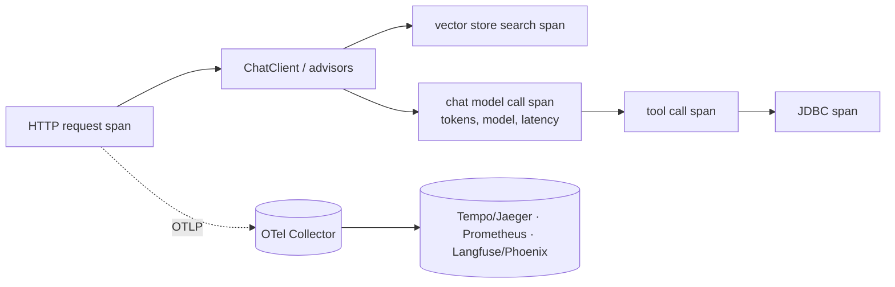

# Observability & testing: Micrometer, OTel, Testcontainers

!!! abstract "At a glance"
    **Priority:** P1 · **Complexity:** 2/5 · **Est. time:** 2 h · **Phase:** 4 · **Prereqs:** [Spring AI RAG](spring-ai-rag.md), [Tools & MCP](spring-ai-tools-mcp.md), [LLM observability](../agentic-ai/llm-observability.md), [Evals & error analysis](../agentic-ai/evals-error-analysis.md)
    **You're done when:** a request through your Spring AI service produces one distributed trace (HTTP → advisors → model → tools → vector store) exported over OTLP, token/latency metrics appear in a dashboard, and your test suite covers the RAG path with Testcontainers plus LLM-judged evals that gate CI.

## Why it matters

LLM features fail differently from CRUD: they degrade quietly (quality drift), cost money per call, and are non-deterministic. You need **traces that show every model/tool/retrieval step, metrics for tokens and latency, and evals as regression tests**. The Java advantage: Spring AI emits **Micrometer observations** natively, Boot 4 ships an OpenTelemetry starter, and Testcontainers gives real pgvector in tests. The interview-level point: "How do you know your AI feature got worse after a prompt change?" — answer with golden sets and CI evals, not vibes.

## Core concepts

### What Spring AI instruments

Spring AI creates Micrometer `Observation`s around chat model calls, embedding calls, vector-store operations, and tool calls (tool observations live under `spring.ai.tool`). Each observation yields both a **span** (with the OTel Micrometer bridge) and **metrics** (timers/counters), following the GenAI-style conventions (`gen_ai.*` attributes such as system, model, operation, and token usage). As of mid-2026 the OTel GenAI semantic conventions are still in *Development* status — expect attribute renames; keep dashboards decoupled via a thin naming layer.



### Wiring (Boot 4)

```xml
<dependency>
  <groupId>org.springframework.boot</groupId>
  <artifactId>spring-boot-starter-actuator</artifactId>
</dependency>
<dependency>
  <groupId>org.springframework.boot</groupId>
  <artifactId>spring-boot-starter-opentelemetry</artifactId>
</dependency>
```

```yaml
management:
  tracing:
    sampling:
      probability: 1.0            # dev; use head/tail sampling in prod
  otlp:
    tracing:
      endpoint: http://otel-collector:4318/v1/traces    # verify property names against your Boot 4.x reference
spring:
  ai:
    chat:
      observations:
        log-prompt: false          # PII! enable only in dev / with redaction
        log-completion: false
```

Senior nuances:

- **Prompts/completions in telemetry are PII and IP.** Spring AI's prompt/completion logging is opt-in for a reason. If you must capture them (debugging, evals), send to a restricted store (Langfuse/Phoenix with access control), redact first, and set retention.
- **Cardinality:** never use conversation ids, user ids or prompt text as metric tags; use model, operation, advisor, outcome. Put ids on spans/logs.
- **Correlate across runtimes:** propagate W3C `traceparent` from the Python orchestrator to the Java MCP server (HTTP headers) so one trace spans LangGraph → MCP → JDBC. Most Python and Java OTel SDKs do this automatically on HTTP.
- **Cost as a metric:** token usage counters × price table = spend per feature/tenant. Alert on *tokens per request* p95 and on retry/validation-failure rate.
- **Tool observations:** tool arguments/results are not exported by default (sensitivity); enable selectively.

### Backends

| Need | Options |
|---|---|
| Traces + metrics (platform) | OTel Collector → Tempo/Jaeger + Prometheus/Grafana, or a vendor APM |
| LLM-specific UI (prompt/response inspection, datasets, evals) | Langfuse (OSS, ClickHouse-owned since Jan 2026), Arize Phoenix — both ingest OTLP |
| Local dev | Grafana LGTM container (`grafana/otel-lgtm`) or Boot's Docker Compose/Testcontainers observability support |

### Testing pyramid for a Spring AI service

| Layer | Tooling | What it proves | Determinism |
|---|---|---|---|
| Unit | JUnit 5 + Mockito | Tools, advisors, mapping logic | Full |
| Slice/integration with real infra | Testcontainers (Postgres+pgvector) + `@ServiceConnection` | Ingestion, filters, HNSW query, migrations | Full (fake embeddings) |
| Contract | Recorded model responses / `MockRestServiceServer` / WireMock | Request shape, tool-loop wiring, error handling | Full |
| Model-in-the-loop evals | `RelevancyEvaluator`, `FactCheckingEvaluator`, custom judges, golden sets | Quality regressions | Statistical |
| Online | Traces, feedback, sampling review | Real-world drift | — |

**Testcontainers for RAG:**

```java
@SpringBootTest
@Testcontainers
class RagIntegrationTest {

    @Container @ServiceConnection
    static PostgreSQLContainer pg = new PostgreSQLContainer(
        DockerImageName.parse("pgvector/pgvector:pg17").asCompatibleSubstituteFor("postgres"));
    // Testcontainers 2.x moved container classes into modules/packages: verify the import
    // (org.testcontainers.postgresql.PostgreSQLContainer) against your Boot 4 BOM.

    @Autowired VectorStore vectorStore;

    @Test
    void tenantFilterIsolatesResults() {
        vectorStore.add(List.of(
            new Document("Detention free time is 5 days", Map.of("tenant", "acme")),
            new Document("Detention free time is 2 days", Map.of("tenant", "globex"))));

        var hits = vectorStore.similaritySearch(SearchRequest.builder()
            .query("free time").topK(5)
            .filterExpression("tenant == 'acme'").build());

        assertThat(hits).isNotEmpty().allMatch(d -> "acme".equals(d.getMetadata().get("tenant")));
    }
}
```

Use a **deterministic fake `EmbeddingModel`** (hash-based vectors) or a small local model for integration tests so CI doesn't call paid APIs; keep one nightly job with the real embedding model.

**Testing tool/agent wiring without a live LLM:** provide a stub `ChatModel` bean (test config) that returns scripted tool calls then a final answer; assert the tool was invoked with the right arguments and that `ToolContext` carried the tenant. This tests *your* code (loop wiring, limits, error paths), which is deterministic.

**LLM-as-judge in JUnit:**

```java
@Test
void answerIsRelevantAndGrounded() {
    String question = "How many detention days does ACME get at Rotterdam?";
    ChatClientResponse res = chat.prompt().advisors(rag).user(question).call().chatClientResponse();
    String answer = res.chatResponse().getResult().getOutput().getText();
    List<Document> docs = (List<Document>) res.context().get(RetrievalAugmentationAdvisor.DOCUMENT_CONTEXT);

    var evaluator = new RelevancyEvaluator(judgeClientBuilder);
    EvaluationResponse r = evaluator.evaluate(new EvaluationRequest(question, docs, answer));
    assertThat(r.isPass()).isTrue();
}
```

Eval hygiene: judge model ≠ generator model; pin model versions and temperature 0; run N cases and assert on **pass rate thresholds** (e.g., ≥ 90% with confidence interval), not single outputs; store failing cases as new golden data; tag eval tests (`@Tag("eval")`) and run them on prompt/model/retrieval changes plus nightly, not on every commit if cost/time matters. Full methodology: [evals & error analysis](../agentic-ai/evals-error-analysis.md).

### Testing the MCP server

- Unit-test `@McpTool` methods as plain methods.
- Integration: `@SpringBootTest(webEnvironment = RANDOM_PORT)` and an MCP client (Java SDK client or the MCP Inspector CLI) hitting `/mcp`; assert `tools/list` schema snapshots (contract tests catch accidental breaking changes to tool names/params) and auth failures (401).
- Cross-language: a Python pytest that connects via `langchain-mcp-adapters` to the containerised Java server — the same contract test the orchestrator team relies on.

## Resources

| Resource | Type | Why this one | Level | Cost |
|---|---|---|---|---|
| [Spring AI: Observability](https://docs.spring.io/spring-ai/reference/observability/index.html) | docs | Metrics/span names, prompt logging flags, tool observations | intermediate | free |
| [Spring AI: Testing / evaluation](https://docs.spring.io/spring-ai/reference/api/testing.html) | docs | Evaluator interfaces and RAG evaluation examples | intermediate | free |
| [Spring Boot: Testcontainers](https://docs.spring.io/spring-boot/reference/testing/testcontainers.html) | docs | `@ServiceConnection`, dynamic properties | intermediate | free |
| [Testcontainers for Java](https://java.testcontainers.org/) | docs | Container modules incl. Postgres | intermediate | free |
| [Micrometer reference](https://docs.micrometer.io/micrometer/reference/) | docs | Observation API, naming, cardinality guidance | intermediate | free |
| [Langfuse docs](https://langfuse.com/docs) | docs | OTLP ingestion, datasets and evals UI | intermediate | free |
| [Arize Phoenix](https://arize.com/docs/phoenix) | docs | OSS trace UI and evals; OTel-native | intermediate | free |
| [Hamel Husain: evals FAQ](https://hamel.dev/blog/posts/evals-faq/) | article | Practical eval philosophy: error analysis before metrics | advanced | free |
| [OTel GenAI semantic conventions repo](https://github.com/open-telemetry/semantic-conventions-genai) :gem: | docs | Where the attribute names are defined and changing | advanced | free |

## Hands-on lab

**Goal (90 min):** make the RAG service from [Spring AI RAG](spring-ai-rag.md) observable and testable.

1. Add Actuator + OpenTelemetry starter; run `grafana/otel-lgtm` (or Langfuse/Phoenix) locally; export OTLP.
2. Send five `/ask` requests; find a trace showing HTTP → advisor chain → vector search → chat call. Screenshot the span tree and the `gen_ai` token metrics.
3. Propagate `traceparent` from a Python client (LangGraph agent calling your MCP server) and confirm a single cross-language trace.
4. Write the Testcontainers pgvector test above (tenant isolation) with a fake `EmbeddingModel`.
5. Write a scripted-`ChatModel` test proving the tool loop calls `get_shipment_status` with the right args and respects `maxTotalToolCalls`.
6. Add a `@Tag("eval")` test running 20 golden Q&A pairs through `RelevancyEvaluator`; fail the build below 90% pass rate. Break the retriever (topK=1) to see it fail.
7. Add a Grafana panel: tokens per request p95 and validation-retry rate.

**Expected output:** trace screenshot, dashboard panel, green integration tests, a demonstrably red eval when quality regresses.

## Questions

### L1 — Recall

??? question "Q1. What does Spring AI instrument via Micrometer and how does that reach OpenTelemetry?"
    ??? success "Answer"
        Chat model calls, embeddings, vector-store operations and tool calls are wrapped in Micrometer observations. With the OTel/Micrometer tracing bridge (Boot 4's OpenTelemetry starter), each observation becomes a span and metrics (including GenAI token usage) and is exported over OTLP.

??? question "Q2. Why are prompt/completion logging flags off by default?"
    ??? success "Answer"
        Prompts and completions can contain PII, secrets and proprietary data; exporting them to general telemetry backends widens the blast radius and may violate retention/residency policy. Enable only for dev or with redaction, restricted access and short retention.

??? question "Q3. What does @ServiceConnection do in a Testcontainers test?"
    ??? success "Answer"
        It lets Spring Boot derive connection properties (JDBC URL, credentials) from the started container automatically, replacing manual `@DynamicPropertySource` wiring.

### L2 — Apply

??? question "Q4. Design metrics and alerts for an LLM endpoint. Which tags are safe?"
    ??? success "Answer"
        Metrics: request rate/latency (p50/p95/p99), model-call latency, tokens in/out per request (histogram) and total, cost estimate, tool-call count per request, validation-retry rate, refusal/"no context" rate, error rate by type (429, timeout, schema). Alerts: p95 tokens/request +30% week-over-week, retry rate > x%, 429 rate, cost/day budget burn. Safe tags: model, operation, feature, outcome, advisor name — low cardinality. Never user/conversation ids or prompt text (put those on traces/logs).

??? question "Q5. Test that your `@Tool` receives the tenant from ToolContext, without a real LLM."
    ??? success "Answer"
        Provide a test `ChatModel` that returns an assistant message containing a tool call for `getStatus(shipmentId)` on the first invocation and a plain answer after the tool result. Call `chatClient.prompt().tools(tools).toolContext(Map.of("tenantId","acme")).user("...").call().content()`, and verify with a spy/mock service that it was invoked with `tenant="acme"`. This is deterministic and exercises the real `ToolCallingAdvisor` wiring.

??? question "Q6. Your eval suite is flaky (pass rate swings between 82% and 94%). What do you do?"
    ??? success "Answer"
        Reduce variance: temperature 0, pinned model versions, more cases (a 20-case suite has a huge confidence interval), multiple judge samples or a stricter rubric with explicit criteria, and use binary rubrics instead of 1–10 scores. Compare distributions with confidence intervals rather than single runs; investigate flaky items by reading traces (error analysis) — ambiguous rubric or unstable retrieval is often the cause. Gate on a threshold with a tolerance band and re-run-on-failure policy.

### L3 — Design & trade-offs

??? question "Q7. Langfuse/Phoenix vs plain OTel backend (Tempo/Grafana) for AI traces — decide."
    ??? success "Answer"
        Plain OTel backend: one observability stack, shared with the rest of the platform, best for SRE-owned production monitoring. LLM-specific tools: prompt/response viewers, sessions, datasets, annotation queues and eval workflows that engineers need for quality work. Practical answer: emit OTLP once and fan out — platform backend for ops, an LLM tool (restricted access) for quality analysis — and be deliberate about what content goes to which.

??? question "Q8. Real LLM in CI vs mocked models — what runs where?"
    ??? success "Answer"
        Per-commit: unit + Testcontainers integration + scripted-model tests (fast, free, deterministic). Per-PR touching prompts/retrieval/model config: a targeted eval subset with a real model (cost-capped). Nightly: full golden set, adversarial/red-team cases, cost/latency tracking. Pre-release: shadow traffic comparison. Budget cost explicitly; cache model responses for unchanged inputs where legitimate.

??? question "Q9. How much of the prompt/response content should you retain for debugging, and where?"
    ??? success "Answer"
        Minimum viable: metadata always (model, tokens, latency, ids, outcome); content sampled (e.g., 1–5%) plus 100% of errors/low-feedback cases, redacted, stored in an access-controlled LLM-observability store with short retention (e.g., 14–30 days) and deletion on data-subject request. Regulated data may forbid content retention entirely — then rely on synthetic reproductions and hashed references. Decide with security/legal, document in an ADR.

### L4 — Staff-level ambiguity

??? question "Q10. Two weeks after launch, users say answers 'got worse', but dashboards are green. How do you investigate and prevent recurrence?"
    ??? success "Answer"
        Green infra metrics don't measure quality. Investigate: sample recent traces and review failing/low-rated ones (error analysis); diff what changed (model version auto-upgrade, prompt, corpus ingestion, embedding model, retrieval params); replay recent real queries against old vs new config; check retrieval metrics separately (empty-context rate, top-1 score distribution shifts). Prevent: golden set + LLM-judge in CI on every prompt/config change, online quality signals (thumbs, escalation rate, abstention rate) on dashboards with alerts, pinned model versions and canary rollouts of changes, and a periodic error-analysis ritual owned by the feature team.

??? question "Q11. Build a shared AI-observability standard for 20 services in Java and Python. What is in it?"
    ??? success "Answer"
        A one-page standard plus libraries: required span structure and attribute names (aligned to OTel GenAI conventions with a mapping layer since they're unstable), mandatory `traceparent` propagation, metric names/tags and cardinality rules, content-capture policy by data classification, cost attribution tags (feature/tenant), SLOs (latency, error, quality proxies), and shared dashboards. Ship it as a Spring Boot starter and a Python package so adoption is one dependency. Enforce through service scorecards, not gates, at first. Include an eval-in-CI requirement for any prompt/model change.

## Real-world use cases

- **Cost governance:** per-feature token spend dashboards that surfaced a runaway retry loop before the invoice.
- **RAG regressions:** a re-ingestion changed chunking; retrieval-hit-rate panel and CI eval caught it in staging.
- **Cross-language debugging:** a single trace from a Python agent through the Java MCP tool to a slow SQL query.
- **Compliance:** provable log of which documents fed which answer, with redacted prompt storage.

## Pitfalls & anti-patterns

- Exporting raw prompts to a shared APM by default.
- High-cardinality metric tags (conversation id, prompt hash).
- Tests that call paid LLM APIs on every commit, or that assert exact strings from a non-deterministic model.
- Judge and generator being the same model, unpinned versions.
- Only measuring latency/errors — no quality signal.
- Using `initialize-schema` in test and prod differently, hiding migration bugs (use the same Flyway migrations in Testcontainers).

## Checklist

- [ ] I can list what Spring AI instruments and where prompt logging is controlled
- [ ] I got a single OTLP trace across HTTP, advisors, model and tool calls
- [ ] I have Testcontainers pgvector tests and a scripted-`ChatModel` tool-loop test
- [ ] I have an eval test that fails when retrieval quality drops
- [ ] I answered all L3 questions out loud in < 3 min each
