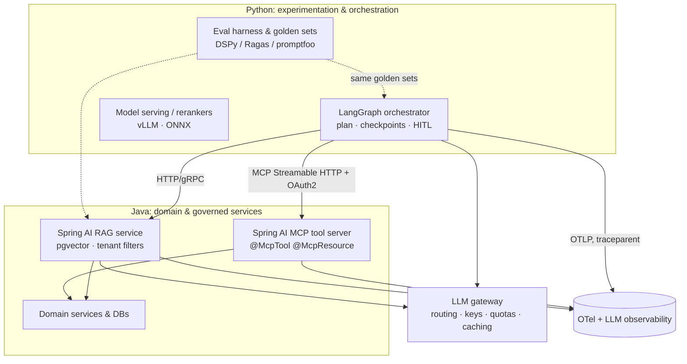

# Java vs Python for AI: polyglot architecture decisions

!!! abstract "At a glance"
    **Priority:** P1 · **Complexity:** 2/5 · **Est. time:** 1 h · **Phase:** 4 · **Prereqs:** [Spring AI tools & MCP](spring-ai-tools-mcp.md), [Spring AI agents](spring-ai-agents.md), [AI-native architecture](../architecture/ai-native-architecture.md)
    **You're done when:** you can write a one-page ADR that assigns AI capabilities to Java or Python services with explicit contracts, and defend it against "rewrite everything in X" arguments.

## Why it matters

Most large enterprises will not choose "Java or Python" — they will run both. Systems of record, transactions and security live in Java; experimentation, evals, ML tooling and much of the agent ecosystem live in Python. The architect's job is to draw the seams so that each side does what it's best at, contracts are explicit, and neither team becomes a bottleneck. In interviews this appears as "we're a Java shop and want AI features — what do you do?" and the strong answer is a boundary design, not a language preference.

## Core concepts

### Where each language is strong (as of September 2026)

| Dimension | Java 25 / Spring Boot 4 / Spring AI 2.0 | Python 3.14 / LangGraph 1.x / Pydantic AI |
|---|---|---|
| Agent frameworks | Spring AI (workflows, tools, MCP), LangChain4j, Embabel, ADK Java | LangGraph (durable graphs), Pydantic AI, DSPy, OpenAI/Claude Agent SDKs, ADK Python 2.0, MS Agent Framework |
| Durable execution / HITL | Roll your own or workflow engine | LangGraph checkpointers/interrupts |
| Prompt/program optimisation, eval tooling | Limited | DSPy, Ragas, DeepEval, promptfoo, Inspect (Python-first) |
| ML / local inference / fine-tuning | ONNX Runtime, DJL; model servers | PyTorch, HF, vLLM, TRL — the native home |
| Enterprise integration | Excellent: Spring Security, transactions, messaging, JPA, observability | Good but more assembly required |
| Concurrency for I/O fan-out | Virtual threads, structured concurrency (preview) | asyncio; free-threaded 3.14t optional |
| Type safety / refactoring at scale | Strong static types, mature tooling | Improving (typing, ty/pyright), weaker guarantees |
| Time to prototype | Slower, improving (Spring Initializr, compact source files) | Fastest |
| Hiring pool for AI-specific skills | Smaller | Larger |
| Protocol support (MCP, A2A, AG-UI) | MCP server/client native in Spring AI 2.0 | All first-class |

### Decision framework: place each capability by five questions

1. **Where is the data and the transaction?** Capabilities that must join, lock or commit alongside domain data belong in the domain's runtime (usually Java).
2. **Who owns the on-call?** The team that runs it must be fluent in it.
3. **Does it need Python-only tooling?** Fine-tuning, local model serving, DSPy optimisation, rapid eval iteration — Python.
4. **What's the state model?** Long-running, human-in-the-loop, resumable → durable runtime (LangGraph); short, stateless → either.
5. **What's the blast radius/security posture?** Tools that mutate systems of record should sit with the domain owners and their authorisation model.

### Reference topology (the capstone)

### Contracts that keep the seam healthy

| Contract | Shape | Why |
|---|---|---|
| Tool interface | MCP (JSON Schema for args/results), versioned; snapshot-tested `tools/list` | Language-neutral; consumed by any agent runtime |
| Data schemas | JSON Schema as the source of truth; generate Java records and Pydantic models | No drift between runtimes |
| Deadlines & retries | Propagated deadline; exactly one retry layer; idempotency keys on mutating tools | Avoid retry storms and double writes |
| Identity | End-user token propagated (OAuth token exchange), not shared service accounts | Correct authorisation and audit |
| Observability | W3C `traceparent`, common attribute names, shared dashboards | One trace across runtimes |
| Evals | One golden set and rubric, run against every implementation | Comparable quality claims |
| Deployment | Independent pipelines, semver on contracts, consumer-driven contract tests | Teams release independently |

### Anti-corruption and cost of the seam

Each network hop adds latency (low single-digit ms in-cluster), serialisation, a failure mode and an operational surface. Don't split what changes together. **A capability that is always changed by the same team in the same release should live in one service.** Keep the number of cross-language contracts small and stable; prefer coarse-grained tools and a few service APIs over chatty interactions.

### Three archetypes

| Archetype | Description | Use when |
|---|---|---|
| **Java-only** | Spring AI for everything (RAG, tools, workflows) | Java-heavy org, simple stateless features, strict platform standardisation |
| **Python-orchestrated, Java-tooled** | LangGraph/Pydantic AI orchestrates; Java exposes tools/RAG via MCP/HTTP | Complex/durable agents plus rich existing Java domain services (the capstone) |
| **Python-only** | FastAPI + agent framework; Java untouched | Greenfield product with no Java dependencies, small team, fast experimentation |

### Migration and convergence

- Start hybrid deliberately; record an ADR with revisit triggers (e.g., "revisit when Spring AI ships durable runtime X" or "when >3 teams need the same orchestrator").
- Build the shared eval harness first — it lets you compare implementations objectively and move capabilities later without a quality debate.
- Avoid mirror implementations of the same feature in both languages unless it's a time-boxed spike.

## Resources

| Resource | Type | Why this one | Level | Cost |
|---|---|---|---|---|
| [Spring AI 2.0.0 GA announcement](https://spring.io/blog/2026/06/12/spring-ai-2-0-0-GA-available-now/) | article | What Spring AI covers natively today (MCP, agentic advisors) | intermediate | free |
| [Spring AI MCP overview](https://docs.spring.io/spring-ai/reference/api/mcp/mcp-overview.html) | docs | The Java side of the seam | intermediate | free |
| [MCP specification](https://modelcontextprotocol.io/specification/2026-07-28) | docs | Contract semantics, auth, statelessness | advanced | free |
| [langchain-mcp-adapters](https://github.com/langchain-ai/langchain-mcp-adapters) | code | Python consumer of Java MCP servers | intermediate | free |
| [Anthropic: Building effective agents](https://www.anthropic.com/engineering/building-effective-agents) | article | Shared vocabulary for deciding workflow vs agent | intermediate | free |
| [awesome-spring-ai](https://github.com/spring-ai-community/awesome-spring-ai) :gem: | article | Shows the breadth of the Spring AI community ecosystem for gap analysis | intermediate | free |
| [Team Topologies](https://teamtopologies.com) | article/book | Team-boundary thinking that should drive service boundaries | intermediate | freemium |
| [ADRs](https://adr.github.io) | docs | Template and practice for recording this decision | beginner | free |

## Hands-on lab

**Goal (60 min):** write and validate the polyglot ADR for your capstone.

1. List capstone capabilities (orchestration, HITL, RAG retrieval, ingestion, shipment tools, pricing tools, evals, reranking, gateway).
2. Score each against the five placement questions; assign Java/Python; note the contract.
3. Draw the topology (above as a starting point) with hops and their latency budget.
4. Write a one-page ADR: context, decision, alternatives (Java-only, Python-only), consequences, revisit triggers.
5. Validate with a spike: measure the added latency of Python → Java MCP call vs in-process Python tool (e.g., 20 sequential calls) and record the number in the ADR.

**Expected output:** ADR markdown, topology diagram, and a measured hop-latency figure.

## Questions

### L1 — Recall

??? question "Q1. Name three capabilities that are usually better placed in Python and three in Java for an enterprise AI platform."
    ??? success "Answer"
        Python: durable agent orchestration (LangGraph), eval/optimisation tooling (DSPy, Ragas, promptfoo), local model serving/fine-tuning. Java: transactional domain tools with the company's authorisation model, RAG services close to the systems of record and their ACLs, high-concurrency governed APIs and gateways integrating with existing Spring infrastructure.

??? question "Q2. Which protocol do you use as the language-neutral tool contract, and which Spring AI artifact exposes it?"
    ??? success "Answer"
        MCP (Model Context Protocol) over Streamable HTTP; Spring AI's `spring-ai-starter-mcp-server-webmvc` (or `-webflux`) with `@McpTool`/`@McpResource` annotations.

??? question "Q3. What is the cost of a cross-language seam?"
    ??? success "Answer"
        Extra latency (network + serialisation), a new failure mode, auth/identity propagation work, contract versioning, two toolchains/CI pipelines and on-call skills. It's justified only by ownership, ecosystem or scaling benefits.

### L2 — Apply

??? question "Q4. Your Python agent must cancel a booking through a Java service. List the safeguards across the boundary."
    ??? success "Answer"
        Destructive tool annotation and a HITL approval in the orchestrator before invocation; end-user token propagation and server-side authorisation (not model-supplied ids alone); idempotency key on the cancel call; deadline propagation and single retry ownership; audit log with run id and principal; tool-level rate limit; contract test for the schema; and a compensating action if a later step fails.

??? question "Q5. Keep Java records and Pydantic models in sync for a shared `ShipmentRisk` schema."
    ??? success "Answer"
        Make JSON Schema (or an OpenAPI component) the source of truth in a shared repo/package; generate Pydantic models (e.g., `datamodel-code-generator`) and Java records (e.g., jsonschema2pojo or hand-written with schema tests); add a CI check that validates sample payloads against both. Version the schema (semver, additive changes) and fail builds on breaking diffs.

??? question "Q6. Design a test that proves the Java MCP server still satisfies the Python orchestrator after a change."
    ??? success "Answer"
        Consumer-driven contract: the orchestrator team owns a pytest suite that starts the server container and asserts `tools/list` names/schemas (snapshot) and calls key tools with fixture data expecting shapes/status. The Java pipeline runs that suite (or a published snapshot) before release. Failing tests block breaking changes; additive changes pass.

### L3 — Design & trade-offs

??? question "Q7. Java-only (Spring AI everywhere) vs Python-orchestrated + Java tools — decide for a claims-processing assistant with day-long approvals."
    ??? success "Answer"
        Day-long approvals require durable, resumable state and HITL — LangGraph provides checkpointing/interrupts out of the box; Spring AI does not. So: Python orchestrates; Java exposes claims/policy tools and RAG over policy documents (governed data, ACLs). Costs: an extra deployable and contract discipline. If the team cannot operate Python, alternative is Java + a workflow engine (Temporal/Camunda) with Spring AI for step logic — viable but you rebuild HITL patterns. Decide by team skills and time-to-value.

??? question "Q8. Where should the LLM gateway live and who owns it?"
    ??? success "Answer"
        As a language-neutral platform service (LiteLLM-style proxy or vendor gateway) owned by the platform team: routing, keys, quotas, caching, guardrails and cost attribution for both Java and Python callers. Embedding these in each language's SDK duplicates logic and fragments governance. Both Spring AI and Python frameworks point their base URL at the gateway.

??? question "Q9. Should the RAG retrieval service be Java or Python?"
    ??? success "Answer"
        Retrieval that enforces document ACLs, tenancy and lives beside the source systems favours Java (security integration, ops maturity) — especially on pgvector with existing Postgres operations. If retrieval quality iteration is heavy (rerankers, hybrid experiments, LLM-based query understanding) Python speeds up experimentation; a hybrid is common: Python prototypes, Java productionises behind a stable retrieval API and the shared eval set guarantees parity.

### L4 — Staff-level ambiguity

??? question "Q10. A VP says 'standardise on one language for AI to reduce cost.' Respond."
    ??? success "Answer"
        Acknowledge the real cost (duplicate tooling, hiring, on-call) and reframe: standardise **contracts, platforms and practices** (MCP tools, gateway, observability, eval harness, security), and limit languages to two with clear roles rather than allowing per-team sprawl. Quantify: a rewrite of Python-native tooling (fine-tuning, evals) into Java or Java domain services into Python costs more and risks quality. Offer a decision record and a review date; propose metrics (lead time, incidents, cost per feature) to revisit the split with evidence.

??? question "Q11. Six months in, the Java tool team and the Python orchestrator team blame each other for latency and failures. What do you do?"
    ??? success "Answer"
        Make the seam observable and shared: cross-language traces with `traceparent`, per-tool SLOs (latency/error) and a joint dashboard; agree on timeout/retry hierarchy and error taxonomy (retryable vs permanent, model-safe messages); run a blameless review on top incidents with trace evidence; introduce consumer-driven contract tests and a shared on-call escalation path; consider whether an org boundary (team topology) mismatches the technical boundary and adjust ownership. Treat it as a platform interface problem, not a people problem.

## Real-world use cases

- **Logistics support copilot:** LangGraph agent (Python) with Java MCP tools for bookings/tariffs and a Java RAG service over carrier terms.
- **Bank/insurer:** Java retains regulated data services and audit; Python teams run evaluation and model-serving; a gateway enforces data-loss-prevention.
- **Retail:** Python recommendation/ML services with Java checkout/pricing tools exposed to an assistant.
- **Internal developer assistant:** Python agents (IDE/CLI) consuming Java platform tools (service catalog, deployment status) via MCP.

## Pitfalls & anti-patterns

- Language tribalism replacing capability-based placement.
- Two implementations of the same agent "to compare" that never converge.
- Chatty cross-language interfaces (dozens of hops per user request).
- Shared service accounts across the seam, losing end-user identity.
- No shared eval harness, so quality debates are anecdotal.
- Retrying at every layer.

## Checklist

- [ ] I can state the five placement questions and apply them to a capability list
- [ ] I wrote a polyglot ADR with revisit triggers
- [ ] I measured the cross-language hop latency
- [ ] I can defend the boundary against "rewrite in one language"
- [ ] I answered all L3 questions out loud in < 3 min each
