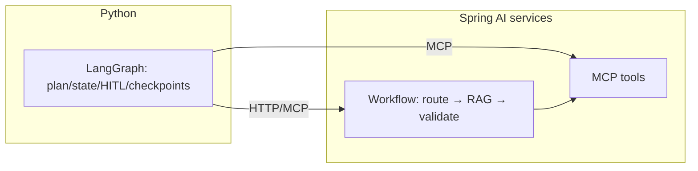

# Agentic patterns with Spring AI

!!! abstract "At a glance"
    **Priority:** P1 · **Complexity:** 3/5 · **Est. time:** 3 h · **Phase:** 3 · **Prereqs:** [Tools & MCP in Spring AI](spring-ai-tools-mcp.md), [Agent patterns](../agentic-ai/agent-patterns.md), [Virtual threads & structured concurrency](virtual-threads-structured-concurrency.md)
    **You're done when:** you can implement chain, routing, parallelisation, orchestrator-workers and evaluator-optimizer workflows with `ChatClient` + Java concurrency, articulate what Spring AI does *not* provide for durable/stateful agents, and pick between Spring AI, LangGraph and other JVM agent frameworks for a given job.

## Why it matters

"Agent" in production is mostly **workflows with a few LLM-driven decisions**, not free-roaming loops. Anthropic's "Building effective agents" taxonomy (workflows vs agents; five workflow patterns) is the shared vocabulary, and the Spring team published a matching Spring AI treatment. As of September 2026, Spring AI gives you excellent *building blocks* (ChatClient, advisors, tool loop, MCP, memory, structured-output validation) but **not a durable graph runtime** like LangGraph (checkpointing, interrupts/resume, time-travel). An AI architect must know where that line is and design around it — typically by keeping durable orchestration in Python/LangGraph or a workflow engine, and Spring AI where the logic is stateless and close to Java systems.

## Core concepts

### Workflows vs agents

| | Workflow | Agent |
|---|---|---|
| Control flow | Coded paths, LLM fills steps | LLM decides next step/tool |
| Predictability | High; testable per step | Lower; needs evals, limits |
| Cost/latency | Bounded | Variable; loop risk |
| Use when | Task decomposition is known | Open-ended, tool-heavy tasks |

Rule of thumb: **start with the simplest workflow that passes evals**; add autonomy only where the evals show workflows can't reach quality.

### The five workflow patterns in Spring AI

All snippets use the `ChatClient` from [fundamentals](spring-ai-fundamentals.md); no special framework needed.

**1. Prompt chaining** — sequential steps, each consuming the previous output, with programmatic gates.

```java
String extract(String email) {
    String facts = chat.prompt().user("Extract shipment ids, dates, complaints:\n" + email).call().content();
    if (facts == null || facts.isBlank()) throw new NoFactsException();          // gate
    return chat.prompt().user("Draft a reply using only these facts:\n" + facts).call().content();
}
```

**2. Routing** — classify then dispatch to a specialised prompt/model/tool set.

```java
enum Intent { STATUS, CLAIM, QUOTE, OTHER }
record Route(Intent intent, String reason) {}

String handle(String msg) {
    Route r = cheap.prompt().user("Classify: " + msg).call()
            .entity(Route.class, s -> s.validateSchema());
    return switch (r.intent()) {                         // exhaustive on enum
        case STATUS -> statusAgent.prompt().user(msg).tools(shipmentTools).call().content();
        case CLAIM  -> claimsAgent.prompt().user(msg).call().content();
        case QUOTE  -> quoteAgent.prompt().user(msg).tools(pricingTools).call().content();
        case OTHER  -> generalAgent.prompt().user(msg).call().content();
    };
}
```

Use a small/cheap model for the classifier — it is the main cost lever in routing.

**3. Parallelisation** — sectioning (independent subtasks) or voting (same task N times). On JDK 25 + virtual threads:

```java
List<String> analyse(String doc, List<String> aspects) throws InterruptedException {
    try (var scope = StructuredTaskScope.open(Joiner.<String>allSuccessfulOrThrow(),
                                             cf -> cf.withTimeout(Duration.ofSeconds(20)))) {
        var tasks = aspects.stream()
            .map(a -> scope.fork(() -> chat.prompt()
                    .user("Review the document for " + a + ":\n" + doc).call().content()))
            .toList();
        scope.join();
        return tasks.stream().map(StructuredTaskScope.Subtask::get).toList();
    }
}
```

(Structured concurrency is a JDK 25 preview; a virtual-thread `ExecutorService` + `invokeAll` is the non-preview equivalent. Watch provider rate limits.)

**4. Orchestrator-workers** — an LLM plans subtasks dynamically; workers execute them; results are synthesised.

```java
record Plan(List<Subtask> tasks) { record Subtask(String worker, String instruction) {} }

String run(String goal) {
    Plan plan = orchestrator.prompt().user("Break into subtasks: " + goal)
            .call().entity(Plan.class, s -> s.validateSchema());
    List<String> results = plan.tasks().stream()
        .limit(6)                                       // hard cap on fan-out
        .map(t -> workers.get(t.worker()).prompt().user(t.instruction()).call().content())
        .toList();
    return synthesiser.prompt().user("Goal: " + goal + "\nResults:\n" + String.join("\n---\n", results))
            .call().content();
}
```

**5. Evaluator-optimizer** — generate, critique against a rubric, refine until pass or budget hit.

```java
record Critique(boolean pass, List<String> issues) {}

String refine(String task) {
    String draft = generator.prompt().user(task).call().content();
    for (int i = 0; i < 3; i++) {                        // bounded
        Critique c = evaluator.prompt().user("Rubric: ...\nDraft:\n" + draft)
                .call().entity(Critique.class, s -> s.validateSchema());
        if (c.pass()) return draft;
        draft = generator.prompt().user(task + "\nFix: " + c.issues() + "\nPrevious:\n" + draft)
                .call().content();
    }
    return draft;
}
```

Use a different (or stricter) model for the evaluator than the generator when possible; LLM judges are biased toward their own outputs.

### True agent loop

The tool loop inside `ChatClient` *is* a simple agent: the model decides which tools to call until done. Bound it (`maxTotalToolCalls`), give it few well-designed tools, and log every step. For approvals, drive the loop manually with `ToolCallingManager` (see [tools & MCP](spring-ai-tools-mcp.md)).

2.0 additions that matter for agents:

- `ToolCallingAdvisor` as an explicit, orderable part of the chain (memory placement inside/outside the loop changes what gets stored).
- `ToolSearchToolCallingAdvisor` for progressive tool disclosure with large tool sets.
- `StructuredOutputValidationAdvisor` for self-correcting structured steps.
- Community: `spring-ai-agent-utils` (agentic patterns and Agent Skills) and `spring-ai-session` (event-sourced memory).

### What Spring AI does not give you (and what to do)

| Need | Gap | Options |
|---|---|---|
| Durable execution / resume after crash | No checkpointing runtime | LangGraph (Python) with a Postgres checkpointer; Temporal/Conductor/Camunda/Spring Statemachine/Spring Batch for Java-side; persist plan + step results yourself |
| Human-in-the-loop pauses spanning hours | Manual | Store pending state, return an approval task id, resume via callback (or LangGraph interrupts) |
| Multi-agent handoff protocols | Not built in | A2A / hand-rolled routing; Embabel (JVM GOAP-style planning framework on Spring AI); Google ADK for Java |
| Time-travel debugging, graph viz | No | LangGraph Studio / tracing tools |
| Evals | Evaluator interfaces only | External frameworks; see [observability & testing](observability-testing.md) |

### Choosing a stack

| Option | Strength | Weakness | Use when |
|---|---|---|---|
| **Spring AI workflows/tools** | Native to Spring: DI, security, transactions, Micrometer; MCP server/client | No durable graph runtime | Stateless request/response features next to Java systems |
| **LangGraph (Python)** | Checkpointing, interrupts, streaming, ecosystem, Studio | Another runtime/language | Long-running, stateful, HITL agents; your capstone orchestrator |
| **Pydantic AI** | Typed, lightweight, great DX | Less graph orchestration | Typed single-agent services in Python |
| **LangChain4j** | Mature JVM library, AI services, many integrations; Spring integration | Overlaps Spring AI; different abstractions | JVM teams already invested in it |
| **Embabel / Google ADK Java / JetBrains Koog** | Higher-level agent planning (Embabel), multi-agent (ADK), Kotlin-first (Koog) | Younger ecosystems; verify maturity | Evaluate case by case; spike with your evals |

Pragmatic split for the capstone: **LangGraph orchestrates (state, HITL, retries) → calls Java MCP tools (domain logic, RAG) → Java exposes stable contracts.** Spring AI agents shine for self-contained, low-latency features (classification, extraction, RAG answer) that don't need durable state.



### Safety valves every Java agent needs

1. Hard caps: max tool calls, max fan-out, max refinement iterations, max tokens per run, wall-clock deadline.
2. Idempotent tools + idempotency keys for writes.
3. Budget/cost metering per run id (Micrometer tags).
4. Kill switch (feature flag) and per-tenant rate limits.
5. Structured logs of each step with a `runId` correlating LLM calls and tool calls.

## Resources

| Resource | Type | Why this one | Level | Cost |
|---|---|---|---|---|
| [Anthropic: Building effective agents](https://www.anthropic.com/engineering/building-effective-agents) | article | The taxonomy the five patterns come from | intermediate | free |
| [Spring AI: Effective agents (agentic patterns)](https://spring.io/blog/2025/01/21/spring-ai-agentic-patterns) | article | Spring team's implementation of each pattern (written against 1.x; API names have moved, structure holds) | intermediate | free |
| [spring-ai-examples](https://github.com/spring-projects/spring-ai-examples) | code | Runnable agentic-pattern samples | intermediate | free |
| [Spring AI advisors reference](https://docs.spring.io/spring-ai/reference/api/advisors.html) | docs | Advisor chain semantics for loops and memory placement | intermediate | free |
| [Embabel](https://github.com/embabel/embabel-agent) :gem: | code | JVM agent framework by Rod Johnson; goal-oriented planning on Spring | advanced | free |
| [Google ADK for Java](https://github.com/google/adk-java) | code | Multi-agent framework with JVM support; compare with LangGraph | advanced | free |
| [LangChain4j docs](https://docs.langchain4j.dev/) | docs | Main alternative JVM library; useful for cross-pollination | intermediate | free |
| [awesome-spring-ai](https://github.com/spring-ai-community/awesome-spring-ai) :gem: | article | Finds agent-utils, session memory and community agent projects | intermediate | free |
| [LangGraph repository](https://github.com/langchain-ai/langgraph) | code | The durable-runtime counterpart to compare against | intermediate | free |

## Hands-on lab

**Goal (2 h):** implement three patterns and a Java-vs-Python comparison for the capstone's "support triage" flow.

1. Build `POST /triage` in Spring AI: **route** (intent classifier on a small model) → for STATUS use MCP/`@Tool` shipment tools; for CLAIM run a **parallel** review (3 aspects via `StructuredTaskScope`/virtual threads) → **evaluator-optimizer** on the drafted reply (max 2 loops).
2. Enforce caps: `maxTotalToolCalls=8`, 20 s deadline, max 3 fan-out; log `runId` on every step.
3. Add a Micrometer `Timer`/counter per step and record token usage tags.
4. Re-implement the same flow in LangGraph with a Postgres checkpointer and a HITL interrupt before sending the reply. Kill the process mid-run and resume — try the same in Java and note what you'd need to build (persisted step state).
5. Run 30 golden triage cases through both; compare quality, latency, cost and lines of code. Write a half-page recommendation on when to use which.

**Expected output:** working Spring AI triage endpoint, LangGraph equivalent with resume, and a comparison note (quality/latency/cost/durability).

## Questions

### L1 — Recall

??? question "Q1. Name the five workflow patterns from 'Building effective agents'."
    ??? success "Answer"
        Prompt chaining, routing, parallelisation (sectioning and voting), orchestrator-workers, and evaluator-optimizer. Workflows have coded control flow; agents let the LLM direct its own process and tool use.

??? question "Q2. Which Spring AI component runs the model↔tool loop, and how can you take manual control?"
    ??? success "Answer"
        `ToolCallingAdvisor` (auto-registered by `ChatClient` in 2.0) using `ToolCallingManager`. Disable auto-registration with `AdvisorParams.toolCallingAdvisorAutoRegister(false)` (or `spring.ai.chat.client.tool-calling.enabled=false` globally) and iterate with `ToolCallingManager.executeToolCalls(...)` for approval gates and custom control.

??? question "Q3. What does Spring AI not provide that LangGraph does?"
    ??? success "Answer"
        A durable graph runtime: checkpointing/persistence of run state, interrupt/resume for human-in-the-loop, time-travel debugging and graph visualisation. Spring AI gives components; durability must come from your own persistence or a workflow engine.

### L2 — Apply

??? question "Q4. Implement a router that sends invoices to an extraction agent and everything else to a general agent, and keep classifier cost low."
    ??? success "Answer"
        Enum intent record via `entity(Route.class, s -> s.validateSchema())` on a small/cheap model client, then an exhaustive `switch` dispatching to specialised `ChatClient`s (different system prompt, tools, model). Add a confidence field and route low-confidence cases to a fallback (general agent or human queue). Track classifier accuracy with a labelled set — routing errors are silent quality bugs.

??? question "Q5. The evaluator-optimizer loop sometimes runs 10 iterations and burns budget. Fix."
    ??? success "Answer"
        Bound iterations (2–3), make the rubric objective and checklist-based, require the evaluator to return specific issues (not "make it better"), stop when the score delta is below a threshold, and track cost per run with a hard budget check in an advisor. Also consider a cheaper evaluator model and caching the rubric prompt.

??? question "Q6. Fan-out: an orchestrator produces 40 subtasks. What controls do you add?"
    ??? success "Answer"
        Hard cap on subtasks (e.g., 6–8) enforced in code, bounded concurrency (semaphore or `Gatherers.mapConcurrent(n, ...)`), per-task timeouts and a global deadline, dedupe similar subtasks, failure policy (fail-fast vs partial results), token/cost budget per run, and provider rate-limit awareness. Log the plan for auditing.

### L3 — Design & trade-offs

??? question "Q7. Workflow vs autonomous agent for an insurance-claim triage assistant — decide."
    ??? success "Answer"
        Workflow: the process is known (classify → extract → validate → route), risk is high and auditability matters. Use LLM autonomy only in narrow steps (e.g., choosing which evidence tool to call, bounded). Autonomy would add unpredictability with no measured quality gain. Validate with evals: if a workflow variant reaches the quality bar, stop; add agent loops only for identified failure clusters.

??? question "Q8. Where should durable state live for a Java agent whose runs last minutes to days?"
    ??? success "Answer"
        In an explicit run store (Postgres table: run id, plan, step status, inputs/outputs, tool idempotency keys), advanced by an event-driven worker or a workflow engine (Temporal, Camunda, Conductor). Each step is idempotent and resumable; LLM calls are wrapped with recorded results for replay. Or keep durability in LangGraph and use Spring AI for stateless steps. Do not rely on in-memory `ChatMemory` or a request thread for long-running work.

??? question "Q9. Single ChatClient with many tools vs specialised sub-agents each with few tools — trade-offs?"
    ??? success "Answer"
        One agent + many tools: simple, but tool-selection accuracy and prompt size degrade as tools grow. Specialised agents: better accuracy, per-agent prompts/models/permissions (least privilege), independent evals; cost is orchestration complexity and extra latency/hops. Middle path: routing to 3–5 specialists, or progressive tool disclosure (`ToolSearchToolCallingAdvisor`). Decide by measuring tool-selection accuracy.

### L4 — Staff-level ambiguity

??? question "Q10. The Python team wants LangGraph for everything; the Java team wants Spring AI for everything. Arbitrate."
    ??? success "Answer"
        Split by *statefulness and coupling*, not by language pride: long-running, human-in-the-loop, multi-step agents → the durable runtime (LangGraph today); short, stateless, transaction-adjacent features and all tools/RAG close to Java systems → Spring AI/MCP. Define the boundary contract (MCP tools, JSON schemas, deadlines, idempotency keys), a shared eval suite and shared observability (trace ids across both). Revisit when Spring AI or the JVM ecosystem ships a durable runtime that passes your evals — record that trigger in the ADR. Avoid building a third orchestration layer.

??? question "Q11. Leadership asks for 'an autonomous agent that resolves customer disputes end to end'. How do you scope it?"
    ??? success "Answer"
        Decompose by risk: classify dispute types; automate low-risk, high-volume ones first with workflow + tools; keep money-moving actions behind HITL approval with idempotent tools; define autonomy levels (suggest → draft → act with approval → act with audit). Establish success metrics (resolution rate, escalation rate, error cost, CSAT) and an eval suite from historical cases before build. Run in shadow mode, then canary. Communicate that "autonomous" is a spectrum you'll move along as evidence accumulates, not a launch date.

## Real-world use cases

- **Support triage:** route → tools → parallel review → evaluator-optimizer reply draft, HITL before sending.
- **Document intake:** classification → extraction (validated records) → business-rule checks → booking system tool call.
- **Data-quality agent:** orchestrator-workers scanning tables (workers per rule pack) with a synthesised report.
- **Runbook assistant:** read-only tools plus a gated remediation step via user-controlled tool execution.

## Pitfalls & anti-patterns

- Building an "agent" where a three-step chain would do.
- Unbounded loops/fan-out; no per-run budgets.
- Using the same model as generator and judge without calibration.
- Storing long-running run state in memory.
- Ignoring idempotency: retries double-book or double-refund.
- Mixing orchestration and business rules inside advisors.
- Adopting a young agent framework without a spike against your evals.

## Checklist

- [ ] I can implement all five workflow patterns with `ChatClient`
- [ ] I set hard caps (calls, fan-out, iterations, deadline) and logged a run id
- [ ] I ran the same flow in LangGraph and can state the durability gap
- [ ] I can defend the Spring AI vs LangGraph boundary for the capstone
- [ ] I answered all L3 questions out loud in < 3 min each
