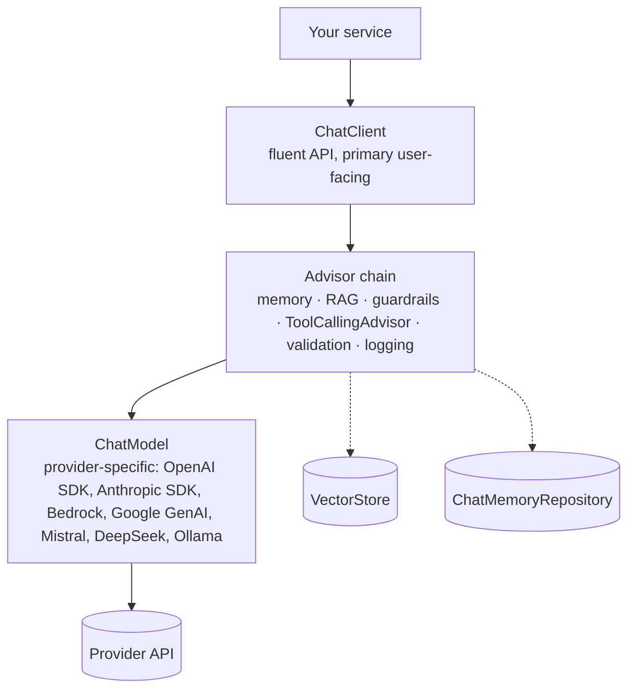

# Spring AI 2.0 fundamentals: ChatClient, advisors, structured output

!!! abstract "At a glance"
    **Priority:** P0 · **Complexity:** 2/5 · **Est. time:** 3 h · **Phase:** 1 · **Prereqs:** [Spring Boot 4](spring-boot-4.md), [Prompting & structured outputs](../agentic-ai/prompting-structured-outputs.md)
    **You're done when:** you can build a `ChatClient` with a system prompt, chat memory keyed by conversation id, a custom advisor, and a schema-validated `entity()` call returning a record — and explain how each maps to Pydantic AI.

## Why it matters

Spring AI 2.0 (GA 2026-06-12; 2.0.1 current as of September 2026) is the default way enterprise Java shops add LLM features. Its core abstraction, **`ChatClient`**, is a fluent, provider-portable API; **advisors** are its interception chain (think servlet filters / middleware for prompts), and **structured output** turns model text into typed records. If you know Pydantic AI, you already know the concepts — the value of this page is the exact Java API, the defaults, and where the abstractions leak.

Architect angle: `ChatClient` + advisors is where cross-cutting concerns (memory, RAG, guardrails, logging, tool calling, output validation) are composed. Getting advisor ordering right is the Spring AI equivalent of getting middleware ordering right — and a common source of subtle bugs.

## Core concepts

### The layers



- **`ChatModel`** is the low-level, provider-specific building block. Spring AI 2.0 positions **`ChatClient` as the primary API**.
- Options are created with **builders and are immutable** after construction (a 2.0 change).
- 2.0's first-party chat providers: OpenAI (via the official SDK), Anthropic (via the official SDK), Amazon Bedrock, Google GenAI, Mistral AI, DeepSeek, Ollama (others are community/vendor-maintained).

### ChatClient basics

```java
@Configuration
class AiConfig {
    @Bean
    ChatClient chatClient(ChatClient.Builder builder, ChatMemory chatMemory) {
        return builder
            .defaultSystem("""
                You are a logistics assistant for shipment status questions.
                Answer only from tool results or provided context. If unsure, say so.
                """)
            .defaultAdvisors(
                MessageChatMemoryAdvisor.builder(chatMemory).build(),
                new SimpleLoggerAdvisor())
            .build();
    }
}

@RestController
class AssistantController {
    private final ChatClient chat;
    AssistantController(ChatClient chat) { this.chat = chat; }

    @PostMapping("/chat/{conversationId}")
    String chat(@PathVariable String conversationId, @RequestBody String message) {
        return chat.prompt()
            .user(message)
            .advisors(a -> a.param(ChatMemory.CONVERSATION_ID, conversationId))
            .call()
            .content();
    }

    @GetMapping(path = "/chat/stream", produces = MediaType.TEXT_EVENT_STREAM_VALUE)
    Flux<String> stream(@RequestParam String q) {
        return chat.prompt().user(q).stream().content();
    }
}
```

Key facts:

- Boot auto-configures a prototype-scoped `ChatClient.Builder` for the single model on the classpath. With multiple providers, disable the default (`spring.ai.chat.client.enabled=false`) and build clients from specific `ChatModel` beans.
- Templates: `.user(u -> u.text("Summarise {doc} for a {role}").param("doc", doc).param("role", "customs broker"))`.
- Per-call options take a **builder**: `.options(ChatOptions.builder().temperature(0.0))` (or a provider-specific builder such as `OpenAiChatOptions.builder()` for provider-only knobs).
- `call()` gives `.content()`, `.chatResponse()` (with usage metadata), `.entity(...)`, `.responseEntity(...)` (both the entity and the raw `ChatResponse`). `stream()` gives `Flux<String>`/`Flux<ChatResponse>`.

### Chat memory

- `ChatMemory` (default `MessageWindowChatMemory`, **20 messages** by default) sits on a `ChatMemoryRepository` (in-memory by default; JDBC, Cassandra, MongoDB, Neo4j, Redis via `spring-ai-starter-model-chat-memory-repository-*`).
- `MessageChatMemoryAdvisor` replays history as messages; `VectorStoreChatMemoryAdvisor` retrieves relevant past turns into the system text.
- `ChatMemory.CONVERSATION_ID` **must** be supplied per call when a memory advisor is present — otherwise `IllegalArgumentException`.

```java
@Bean
ChatMemory chatMemory(JdbcChatMemoryRepository repo) {   // spring-ai-starter-model-chat-memory-repository-jdbc
    return MessageWindowChatMemory.builder()
        .chatMemoryRepository(repo)
        .maxMessages(30)
        .build();
}
```

Senior nuance: "memory" here is a **message window**, not a memory system. Long-running assistants need summarisation, per-user facts, and retention policy (PII!) — see [memory systems](../agentic-ai/memory-systems.md). The community `spring-ai-session` project offers event-sourced conversation memory.

### Advisors: the interception chain

```java
public interface CallAdvisor extends Advisor {
    ChatClientResponse adviseCall(ChatClientRequest request, CallAdvisorChain chain);
}
public interface StreamAdvisor extends Advisor {
    Flux<ChatClientResponse> adviseStream(ChatClientRequest request, StreamAdvisorChain chain);
}
```

- `getOrder()`: **lower runs first on the request and last on the response** (stack semantics).
- Built-ins: `MessageChatMemoryAdvisor`, `VectorStoreChatMemoryAdvisor`, `QuestionAnswerAdvisor` (naive RAG), `RetrievalAugmentationAdvisor` (modular RAG), `ReReadingAdvisor` (RE2), `SafeGuardAdvisor`, `SimpleLoggerAdvisor`, **`ToolCallingAdvisor`** (new in 2.0; auto-registered; runs the tool loop), **`StructuredOutputValidationAdvisor`** (validate JSON against schema, retry with feedback), `ToolSearchToolCallingAdvisor` (progressive tool disclosure).
- Share per-request state via the advisor context (`request.context()`), e.g. retrieved documents.

A custom advisor enforcing a token budget and emitting usage:

```java
public final class TokenBudgetAdvisor implements CallAdvisor {
    private final int maxTotalTokens;
    private final MeterRegistry meters;

    public TokenBudgetAdvisor(int maxTotalTokens, MeterRegistry meters) {
        this.maxTotalTokens = maxTotalTokens;
        this.meters = meters;
    }

    @Override public String getName() { return "token-budget"; }
    @Override public int getOrder() { return Ordered.HIGHEST_PRECEDENCE + 100; }

    @Override
    public ChatClientResponse adviseCall(ChatClientRequest request, CallAdvisorChain chain) {
        ChatClientResponse response = chain.nextCall(request);
        var chatResponse = response.chatResponse();
        if (chatResponse != null) {
            Integer total = chatResponse.getMetadata().getUsage().getTotalTokens();
            if (total != null) {
                meters.counter("ai.tokens.total", "advisor", getName()).increment(total);
                if (total > maxTotalTokens) {
                    throw new IllegalStateException("Token budget exceeded: " + total);
                }
            }
        }
        return response;
    }
}
```

(Spring AI already emits token-usage metrics via Micrometer observations — see [observability & testing](observability-testing.md). A custom advisor is for *policy*, not basic metrics.)

### Structured output

```java
public record ShipmentRisk(
        @JsonPropertyDescription("Shipment id, e.g. MSKU1234567") String shipmentId,
        RiskLevel level,
        @JsonPropertyDescription("Max 3 short reasons") List<String> reasons,
        double confidence) {
    public enum RiskLevel { LOW, MEDIUM, HIGH }
}

ShipmentRisk risk = chat.prompt()
    .user(u -> u.text("Assess delay risk for {id} given: {events}")
                .param("id", id).param("events", events))
    .call()
    .entity(ShipmentRisk.class, spec -> spec
        .useProviderStructuredOutput()   // send schema as API-level constraint (if supported)
        .validateSchema());              // validate + retry with error feedback (default 3)
```

Three levels of rigour:

| Mode | How | Pros | Cons |
|---|---|---|---|
| Prompt-based (default) | `BeanOutputConverter` appends format instructions + JSON schema to the prompt; parses reply | Works with every model | Model may ignore format |
| Provider-native | `spec.useProviderStructuredOutput()` (or `AdvisorParams.ENABLE_NATIVE_STRUCTURED_OUTPUT`) | Constrained decoding, far fewer parse failures | Provider limits (e.g., OpenAI: no top-level array; reasoning-mode Ollama models may emit text) |
| Validated + retry | `spec.validateSchema()` or `StructuredOutputValidationAdvisor.builder().outputType(...).maxRepeatAttempts(3)` | Self-correcting | Extra calls/cost on failure; streaming not supported |

Other details: `entity(new ParameterizedTypeReference<List<T>>() {})` for generics (wrap lists in a container record if using native mode with OpenAI); `entity()` is `@Nullable` (JSpecify); `@JsonPropertyDescription` descriptions flow into the schema and materially improve output quality. Business validation (confidence range, id format) still belongs in your code — schema validity ≠ correctness.

### Pydantic AI side-by-side

=== "Spring AI 2.0 (Java)"

    ```java
    ShipmentRisk r = chat.prompt()
        .system("You assess shipment delay risk.")
        .user("Assess " + id)
        .call()
        .entity(ShipmentRisk.class, s -> s.validateSchema());
    ```

=== "Pydantic AI (Python)"

    ```python
    from pydantic import BaseModel
    from pydantic_ai import Agent

    class ShipmentRisk(BaseModel):
        shipment_id: str
        level: Literal["LOW", "MEDIUM", "HIGH"]
        reasons: list[str]
        confidence: float

    agent = Agent(MODEL, output_type=ShipmentRisk,
                  system_prompt="You assess shipment delay risk.")
    r = agent.run_sync(f"Assess {id}").output
    ```

| Concept | Spring AI 2.0 | Pydantic AI |
|---|---|---|
| Entry point | `ChatClient` | `Agent` |
| Typed output | `entity(Record.class)` + validation | `output_type=Model` (validation + retry built in) |
| Middleware | Advisors (ordered chain) | Hooks/toolsets/history processors; less central |
| Memory | `ChatMemory` + advisor | `message_history` you pass explicitly |
| DI into tools | Spring beans, `ToolContext` | `deps_type` / `RunContext` |
| Observability | Micrometer observations → OTel | Logfire / OTel |

## Resources

| Resource | Type | Why this one | Level | Cost |
|---|---|---|---|---|
| [Spring AI reference: ChatClient](https://docs.spring.io/spring-ai/reference/api/chatclient.html) | docs | The canonical API, incl. memory params and templates (2.0.x) | intermediate | free |
| [Spring AI reference: Advisors](https://docs.spring.io/spring-ai/reference/api/advisors.html) | docs | Interfaces, ordering semantics, built-in list | intermediate | free |
| [Spring AI reference: Structured output](https://docs.spring.io/spring-ai/reference/api/structured-output-converter.html) | docs | Converters, native mode, provider caveats | intermediate | free |
| [Spring AI reference: Chat memory](https://docs.spring.io/spring-ai/reference/api/chat-memory.html) | docs | Memory types and repositories | intermediate | free |
| [Spring AI 2.0.0 GA announcement](https://spring.io/blog/2026/06/12/spring-ai-2-0-0-GA-available-now/) | article | What changed in 2.0 and why | intermediate | free |
| [Spring AI upgrade notes](https://docs.spring.io/spring-ai/reference/upgrade-notes.html) | docs | Breaking changes from 1.x (property keys, options builders) | intermediate | free |
| [awesome-spring-ai](https://github.com/spring-ai-community/awesome-spring-ai) :gem: | article | Curated examples, talks and community projects (spring-ai-session, agent utils) | intermediate | free |
| [Dan Vega](https://www.danvega.dev/) :gem: | video/article | Concise Spring AI walkthroughs that track releases closely | intermediate | free |
| [Spring AI in Action (Craig Walls)](https://www.manning.com/books/spring-ai-in-action) | book | Structured, book-length treatment; written against 1.x, concepts carry over | intermediate | paid |

## Hands-on lab

**Goal (90 min):** the "shipment assistant" core, mirroring a Pydantic AI agent you already wrote.

1. In the [Boot 4 skeleton](spring-boot-4.md), add `spring-ai-starter-model-ollama` (local, e.g. a Llama 3.x/Qwen model) or OpenAI/Anthropic starter.
2. Configure the `ChatClient` bean above with a system prompt, `MessageChatMemoryAdvisor` (JDBC repository on Postgres) and `SimpleLoggerAdvisor` (`logging.level.org.springframework.ai.chat.client.advisor=DEBUG`).
3. `POST /chat/{conversationId}` — verify turn 2 references turn 1; check the `SPRING_AI_CHAT_MEMORY` table.
4. `POST /risk/{id}` returning `ShipmentRisk` via `entity(..., s -> s.validateSchema())`. Deliberately use a small model and a prompt that encourages prose; watch validation retries in logs.
5. Add the `TokenBudgetAdvisor` with a tiny budget; confirm it trips.
6. Port the same endpoint to Pydantic AI; compare latency, retries and code size in a short note.

**Expected output:** working memory across turns, a typed JSON response for `/risk`, logged advisor chain, and a comparison table.

## Questions

### L1 — Recall

??? question "Q1. What's the difference between ChatModel and ChatClient in Spring AI 2.0?"
    ??? success "Answer"
        `ChatModel` is the provider-specific, low-level interface (Prompt in, ChatResponse out). `ChatClient` is the fluent, primary user-facing API on top: templates, default system prompts, advisors (memory, RAG, tools, validation), structured output (`entity`) and streaming. 2.0 explicitly positions `ChatClient` as the main API.

??? question "Q2. How are advisors ordered?"
    ??? success "Answer"
        By `getOrder()` (Spring `Ordered`). Lower values run first on the request path and last on the response path — a stack. `Ordered.HIGHEST_PRECEDENCE` runs first. E.g., memory before RAG means history is added before retrieval augments the prompt; placing memory inside the tool loop (order greater than `ToolCallingAdvisor`'s) records intermediate tool messages.

??? question "Q3. What happens if you use MessageChatMemoryAdvisor without passing ChatMemory.CONVERSATION_ID?"
    ??? success "Answer"
        The call fails with `IllegalArgumentException` — memory advisors require the conversation id param on every call (`.advisors(a -> a.param(ChatMemory.CONVERSATION_ID, id))`). This prevents accidentally mixing users' histories under a default id.

### L2 — Apply

??? question "Q4. Return a List of ShipmentRisk using provider-native structured output on OpenAI. What goes wrong and how do you fix it?"
    ??? success "Answer"
        OpenAI's structured output does not accept a top-level JSON array schema, so `entity(new ParameterizedTypeReference<List<ShipmentRisk>>(){}, s -> s.useProviderStructuredOutput())` fails. Wrap it: `record RiskReport(List<ShipmentRisk> items) {}` and request `RiskReport.class`. Or drop native mode and rely on prompt-based conversion + `validateSchema()`.

??? question "Q5. You need two providers: a cheap model for classification and a strong one for answers. Wire it."
    ??? success "Answer"
        Add both starters, set `spring.ai.chat.client.enabled=false` to stop the single auto-configured builder, then define two beans: `ChatClient.builder(ollamaChatModel).build()` and `ChatClient.builder(anthropicChatModel).build()` with `@Qualifier`s. Route in code (classifier decides) or via a gateway. Keep prompts/advisors per client; share memory repository only if conversation continuity across models is intended.

??? question "Q6. Write an advisor that redacts email addresses from the user message before it leaves the JVM."
    ??? success "Answer"
        ```java
        public final class PiiRedactionAdvisor implements CallAdvisor {
            private static final Pattern EMAIL = Pattern.compile("[\\w.+-]+@[\\w-]+\\.[\\w.]+");
            @Override public String getName() { return "pii-redaction"; }
            @Override public int getOrder() { return Ordered.HIGHEST_PRECEDENCE; }
            @Override
            public ChatClientResponse adviseCall(ChatClientRequest req, CallAdvisorChain chain) {
                Prompt redacted = req.prompt().augmentUserMessage(
                    um -> um.mutate().text(EMAIL.matcher(um.getText()).replaceAll("[EMAIL]")).build());
                return chain.nextCall(req.mutate().prompt(redacted).build());
            }
        }
        ```
        Run it first (highest precedence) so memory/RAG never store raw PII, and implement `StreamAdvisor` too if you stream. Verify the exact `Prompt`/`UserMessage` mutation helpers against your 2.0.x version; the pattern (mutate request, call `chain.nextCall`) is the stable part. Regex redaction is a baseline — use a proper PII detector for production.

### L3 — Design & trade-offs

??? question "Q7. Prompt-based vs provider-native vs validated structured output — what's your default for a production extraction endpoint?"
    ??? success "Answer"
        Default: provider-native where supported (constrained decoding sharply reduces invalid JSON) **plus** schema validation with a small retry budget (1–2), **plus** business validation in code. Prompt-based only for providers without native support. Watch cost: each validation retry is a full call; alert on retry rate as a quality signal. Keep schemas flat and well-described (`@JsonPropertyDescription`); complex unions degrade reliability.

??? question "Q8. Where should conversation memory live for a multi-pod assistant, and what's the risk of the default?"
    ??? success "Answer"
        The default repository is in-memory: conversations break on pod restart or when the load balancer routes to another pod, and memory grows unbounded per id. Use a shared repository (JDBC on Postgres is simplest; Redis for latency), a window/summarisation policy, TTL/retention aligned with privacy policy, and tenant scoping in the conversation id. Treat conversation logs as sensitive data (encryption, deletion on request).

??? question "Q9. Advisors vs plain service-layer code for cross-cutting LLM concerns — when is an advisor the wrong tool?"
    ??? success "Answer"
        Advisors fit concerns that must wrap every model call uniformly (memory, RAG augmentation, redaction, validation, logging, tool loop). They're the wrong tool for business workflow (multi-step orchestration, approvals) — that belongs in services/agents where it's testable and visible; stuffing workflow into advisors makes control flow implicit and order-dependent. Also avoid advisors that silently change semantics (e.g., rewriting prompts) without observability.

### L4 — Staff-level ambiguity

??? question "Q10. Five teams each wrote their own ChatClient configuration with different prompts, memory and logging. Propose a platform approach."
    ??? success "Answer"
        Provide an internal starter that contributes opinionated, overridable beans: a `ChatClientCustomizer` with standard advisors (PII redaction, token budget, logging with redaction, observation conventions), a shared memory repository config with retention defaults, and a gateway-backed `ChatModel` config (routing, keys, quotas). Keep prompts in the owning teams' repos (versioned, evaluated), not in the platform. Publish ADRs for advisor ordering. Measure adoption and incidents; don't mandate until the starter has solved a real pain (cost visibility is usually the carrot).

??? question "Q11. Product wants 'the same assistant' in Java (Spring AI) and Python (Pydantic AI) for two channels. How do you keep behaviour consistent?"
    ??? success "Answer"
        Consistency comes from shared artefacts, not shared code: one versioned prompt/system spec, one JSON Schema for outputs (generate records and Pydantic models from it, or vice versa), one tool contract (ideally a single MCP server both call), and one eval suite (golden set + LLM-judge rubric) run against both implementations in CI. Differences in retry/validation defaults (Pydantic AI retries validation by default; Spring AI requires `validateSchema()`) must be aligned explicitly. Better still: question why two implementations exist and converge on one service behind both channels.

## Real-world use cases

- **Shipment-status assistant** with per-customer conversation memory and strict "answer from tools only" system prompt.
- **Document extraction** (bills of lading, invoices) to records with native structured output + validation, feeding downstream booking systems.
- **Classification/triage** of customer emails into typed intents using a cheap model client, escalating to a stronger model client.
- **Compliance wrapper**: a redaction advisor at highest precedence on every client in regulated domains.

## Pitfalls & anti-patterns

- Treating `entity()` output as trusted and non-null.
- In-memory chat memory in multi-pod deployments.
- Logging full prompts/completions (PII) with `SimpleLoggerAdvisor` in production.
- Advisor order chosen by accident; no tests for it.
- Mixing provider-specific options into shared code paths — use portable `ChatOptions` unless you need a provider knob.
- Copying 1.x examples (`.options` property segments, old advisor APIs) into a 2.0 codebase.

## Checklist

- [ ] I can explain ChatClient vs ChatModel and advisor ordering without notes
- [ ] I built chat memory on JDBC keyed by conversation id
- [ ] I returned a validated record via `entity()` and observed retries
- [ ] I wrote and ordered a custom advisor
- [ ] I answered all L3 questions out loud in < 3 min each
