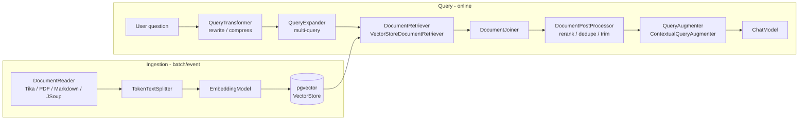

# RAG with Spring AI & pgvector

!!! abstract "At a glance"
    **Priority:** P0 · **Complexity:** 3/5 · **Est. time:** 3 h · **Phase:** 2 · **Prereqs:** [Spring AI fundamentals](spring-ai-fundamentals.md), [RAG fundamentals](../agentic-ai/rag-fundamentals.md), [Vector databases](../agentic-ai/vector-databases.md)
    **You're done when:** a Spring Boot service ingests documents into pgvector (HNSW, cosine), answers with citations via `RetrievalAugmentationAdvisor`, enforces tenant filters, and you can state where hybrid search and reranking plug in and what Spring AI does *not* give you out of the box.

## Why it matters

RAG is the most common enterprise LLM feature, and Java estates already run Postgres — so **pgvector + Spring AI** is the lowest-friction path: no new datastore, transactional consistency with your metadata, existing backup/HA/IAM. As a Staff/AI architect you must know both the 10-line demo and what production needs on top: chunking strategy, metadata filtering for multi-tenancy, hybrid retrieval, reranking, evaluation and ingestion pipelines. Interviews probe exactly that gap.

## Core concepts

### Pipeline and Spring AI's building blocks



| Component | Role | Notes |
|---|---|---|
| `DocumentReader` impls | Load files to `Document` (text + metadata) | Separate artifacts: `spring-ai-tika-document-reader`, `-pdf-document-reader`, `-markdown-document-reader`, `-jsoup-document-reader` |
| `TokenTextSplitter` | Chunk by tokens | Builder: `withChunkSize`, `withMinChunkSizeChars`, `withKeepSeparator`... |
| `VectorStore` | `add`, `similaritySearch(SearchRequest)`, `delete` | Portable across ~20 stores |
| `QuestionAnswerAdvisor` | **Naive RAG**: retrieve top-k, stuff into prompt | Fast to start |
| `RetrievalAugmentationAdvisor` | **Modular RAG**: transform → expand → retrieve → join → post-process → augment | Use for anything beyond a demo |

### pgvector setup

```xml
<dependency>
  <groupId>org.springframework.ai</groupId>
  <artifactId>spring-ai-starter-vector-store-pgvector</artifactId>
</dependency>
<dependency>
  <groupId>org.springframework.ai</groupId>
  <artifactId>spring-ai-tika-document-reader</artifactId>
</dependency>
```

```yaml
spring:
  datasource:
    url: jdbc:postgresql://localhost:5432/rag
    username: postgres
    password: postgres
  ai:
    vectorstore:
      pgvector:
        initialize-schema: true      # dev only; default false. Use Flyway in prod
        index-type: HNSW             # NONE | IVFFlat | HNSW (default HNSW)
        distance-type: COSINE_DISTANCE
        dimensions: 1536             # MUST match the embedding model
        max-document-batch-size: 10000
```

Run Postgres with `pgvector/pgvector` (image name as in the Spring AI docs; pin a tag such as `pg17` in your compose file). The store creates a `vector_store` table (id uuid, content text, metadata json, embedding vector(N)) and an HNSW index.

Senior nuance:

- **`dimensions` must equal the embedding model's output**; changing the embedding model means **re-embedding everything** (new table/column, dual-write, backfill, switch). Version embeddings in metadata (`embedding_model`).
- HNSW vs IVFFlat: HNSW gives better recall/latency and needs no training but builds slower and uses more memory; IVFFlat is cheaper to build but needs data present and tuning `lists`/`probes`. Tune `hnsw.ef_search` per query for recall vs latency. pgvector handles millions of vectors well on one node; beyond tens of millions or heavy filtering, evaluate a dedicated engine (see [vector databases](../agentic-ai/vector-databases.md)).
- **Filtered ANN pitfall:** with a selective metadata filter, HNSW may return fewer than `topK` results (post-filtering). pgvector 0.8+ has iterative index scans to mitigate; alternatively partition by tenant.

### Ingestion

```java
@Service
class IngestionService {
    private final VectorStore vectorStore;
    IngestionService(VectorStore vectorStore) { this.vectorStore = vectorStore; }

    void ingest(Resource file, String tenantId, String docId) {
        List<Document> pages = new TikaDocumentReader(file).read();
        var splitter = TokenTextSplitter.builder().withChunkSize(500).build();
        List<Document> chunks = splitter.apply(pages).stream()
            .map(d -> {
                d.getMetadata().putAll(Map.of(
                    "tenant", tenantId, "docId", docId,
                    "source", file.getFilename(), "embedding_model", "text-embedding-3-small"));
                return d;
            }).toList();
        vectorStore.add(chunks);     // embeds + writes in batches
    }
}
```

Production ingestion is an idempotent pipeline: content hash per doc, delete-then-insert by `docId` (`vectorStore.delete("docId == '" + docId + "'")` using a filter expression), queue-driven (Kafka/SQS), retry on embedding 429s, a dead-letter path and lineage metadata. Do this in a worker, not a request thread.

### Querying: naive vs modular

```java
// Naive RAG
var qa = QuestionAnswerAdvisor.builder(vectorStore)
    .searchRequest(SearchRequest.builder().topK(5).similarityThreshold(0.7).build())
    .build();

// Modular RAG with rewrite + tenant filter + "don't hallucinate" behaviour
var rag = RetrievalAugmentationAdvisor.builder()
    .queryTransformers(RewriteQueryTransformer.builder()
        .chatClientBuilder(chatClientBuilder.build().mutate()).build())
    .documentRetriever(VectorStoreDocumentRetriever.builder()
        .vectorStore(vectorStore)
        .topK(8)
        .similarityThreshold(0.6)
        .build())
    .queryAugmenter(ContextualQueryAugmenter.builder()
        .allowEmptyContext(false)      // no context -> say "I don't know" instead of guessing
        .build())
    .build();

String answer = chatClient.prompt()
    .advisors(rag)
    .advisors(a -> a.param(VectorStoreDocumentRetriever.FILTER_EXPRESSION,
                           "tenant == '" + tenantId + "'"))   // per-request filter
    .user(question)
    .call()
    .content();
```

Security note: the filter is a **string expression** — never concatenate untrusted input into it; take `tenantId` from the authenticated principal, not the request body. Or build a `Filter.Expression` programmatically with `FilterExpressionBuilder`.

Returning citations: retrieved documents are available on the response context (`RetrievalAugmentationAdvisor.DOCUMENT_CONTEXT`, or `QuestionAnswerAdvisor.RETRIEVED_DOCUMENTS`):

```java
ChatClientResponse res = chatClient.prompt().advisors(rag).user(q).call().chatClientResponse();
List<Document> used = (List<Document>) res.context().get(RetrievalAugmentationAdvisor.DOCUMENT_CONTEXT);
```

### What's not built in — and how to add it

| Need | Spring AI status | Approach |
|---|---|---|
| Hybrid (BM25 + dense) | Not in the portable `VectorStore` API | Implement a `DocumentRetriever` running SQL: dense `ORDER BY embedding <=> ?` + `ts_rank_cd(tsv, websearch_to_tsquery(?))`, fuse with Reciprocal Rank Fusion in Java |
| Cross-encoder rerank | Extension point: `DocumentPostProcessor` | Call a rerank API/service (Cohere-style, or a Python sidecar with a local cross-encoder) and reorder |
| Parent-document / contextual chunks | Manual | Store parent id in metadata; post-processor expands |
| Eval | `RelevancyEvaluator`, `FactCheckingEvaluator` (LLM-as-judge) | Wrap in tests; use golden sets — see [observability & testing](observability-testing.md) |
| Query routing | Manual/advisor | Classifier + per-collection retriever |

Default recommendation (matches the agentic-AI track): **hybrid retrieval → rerank → generate**, with dense-only as the baseline you must beat in evals.

### Python parity

pgvector schema is the shared contract: a Python ingestion/eval job and the Java query service can use the same table if you agree on table name, dimension, metadata keys and embedding model. Spring AI's `vector_store` table (uuid id, text content, jsonb metadata, vector embedding) can be read by `psycopg`/`pgvector-python` directly.

## Resources

| Resource | Type | Why this one | Level | Cost |
|---|---|---|---|---|
| [Spring AI: RAG reference](https://docs.spring.io/spring-ai/reference/api/retrieval-augmented-generation.html) | docs | Modular RAG components and advisor semantics | intermediate | free |
| [Spring AI: PGvector](https://docs.spring.io/spring-ai/reference/api/vectordbs/pgvector.html) | docs | Properties, index types, filter examples | intermediate | free |
| [Spring AI: ETL pipeline](https://docs.spring.io/spring-ai/reference/api/etl-pipeline.html) | docs | Readers, transformers, writers | intermediate | free |
| [pgvector repository](https://github.com/pgvector/pgvector) | docs | Authoritative on HNSW/IVFFlat params, iterative scans | advanced | free |
| [Pinecone: rerankers](https://www.pinecone.io/learn/series/rag/rerankers/) | article | Best plain explanation of two-stage retrieval and cross-encoders | intermediate | free |
| [spring-ai-examples](https://github.com/spring-projects/spring-ai-examples) | code | Official runnable samples incl. RAG | intermediate | free |
| [awesome-spring-ai](https://github.com/spring-ai-community/awesome-spring-ai) :gem: | article | Community RAG projects and talks, including hybrid-search add-ons | intermediate | free |
| [Josh Long — Spring Tips](https://www.youtube.com/@SpringSourceDev) :gem: | video | Live-coded RAG builds; good for seeing the ingestion flow end to end | intermediate | free |
| [Hamel Husain: evals FAQ](https://hamel.dev/blog/posts/evals-faq/) | article | How to evaluate RAG properly (retrieval vs generation) | advanced | free |

## Hands-on lab

**Goal (2 h):** port the capstone RAG service to Java on pgvector.

1. `docker compose` with `pgvector/pgvector` (pin tag). Boot 4 service with the pgvector and Tika starters.
2. `POST /ingest` (multipart) → `IngestionService`; ingest 20–50 PDFs (carrier T&Cs, customs guides, or your Python capstone's corpus).
3. `POST /ask` → `RetrievalAugmentationAdvisor` with tenant filter from a header (simulate auth). Return `{answer, sources:[{docId, chunk, score}]}`.
4. Add `allowEmptyContext(false)`; ask an out-of-corpus question and confirm refusal.
5. Implement a hybrid `DocumentRetriever`: add `tsv tsvector GENERATED ALWAYS AS (to_tsvector('english', content)) STORED` + GIN index (via Flyway; the default table is created by Spring AI — add the column with a migration), query both, fuse with RRF (k=60).
6. Run your Python capstone's golden question set against both services; compare recall@5 and answer faithfulness (LLM judge). Record chunk size/threshold experiments.

**Expected output:** a Java RAG API returning cited answers, a hybrid-vs-dense table on the golden set, and an `EXPLAIN ANALYZE` showing the HNSW index used.

## Questions

### L1 — Recall

??? question "Q1. What's the difference between QuestionAnswerAdvisor and RetrievalAugmentationAdvisor?"
    ??? success "Answer"
        `QuestionAnswerAdvisor` implements naive RAG: one similarity search, stuff results into the prompt. `RetrievalAugmentationAdvisor` implements modular RAG with pluggable stages: query transformers (rewrite/compress), query expander (multi-query), document retriever, joiner, post-processors (rerank/dedupe) and a query augmenter (e.g., `ContextualQueryAugmenter` with `allowEmptyContext`).

??? question "Q2. Why must the pgvector `dimensions` property match your embedding model, and what happens when you switch models?"
    ??? success "Answer"
        The column is `vector(N)`; inserting a different-length embedding fails, and even equal-length embeddings from different models live in incompatible spaces. Switching models means re-embedding the whole corpus: build a new table/column, backfill, dual-run/compare in evals, then cut over.

??? question "Q3. HNSW vs IVFFlat in pgvector — one sentence each."
    ??? success "Answer"
        HNSW: graph index with better recall/latency, no training step, slower/larger to build, tuned by `m`, `ef_construction`, `ef_search`. IVFFlat: cluster-based, quick to build and smaller but requires data at build time and tuning `lists`/`probes`, with lower recall at equal latency.

### L2 — Apply

??? question "Q4. Users of tenant A must never retrieve tenant B's chunks. Show the enforcement and the failure mode to test."
    ??? success "Answer"
        Store `tenant` in metadata at ingestion; on every query pass a filter derived from the authenticated principal: `.advisors(a -> a.param(VectorStoreDocumentRetriever.FILTER_EXPRESSION, "tenant == '" + principalTenant + "'"))` (or a `Filter.Expression` built with `FilterExpressionBuilder` to avoid injection). Tests: cross-tenant query returns nothing; a prompt-injected question ("ignore the filter") still can't cross because filtering is outside the model; and a selective filter still returns `topK` (post-filter recall issue — verify with iterative scan or partitioning). Stronger isolation: separate schema/table or Postgres row-level security.

??? question "Q5. Answers hallucinate when nothing relevant is found. Fix it."
    ??? success "Answer"
        Set a `similarityThreshold` so weak matches are dropped, use `ContextualQueryAugmenter.builder().allowEmptyContext(false)` so empty context yields a refusal template instead of an unaided model answer, and add a system instruction "answer only from context; otherwise say you don't know". Measure with an out-of-scope test set (abstention rate) — thresholds are model- and corpus-specific, so calibrate on data, not folklore.

??? question "Q6. Sketch RRF fusion for hybrid retrieval in Java."
    ??? success "Answer"
        ```java
        Map<String, Double> score = new HashMap<>();
        for (var list : List.of(denseHits, lexicalHits)) {
            for (int rank = 0; rank < list.size(); rank++) {
                score.merge(list.get(rank).getId(), 1.0 / (60 + rank + 1), Double::sum);
            }
        }
        // sort ids by score desc, take top-k, load Documents
        ```
        Wrap this in a `DocumentRetriever` bean and plug it into `RetrievalAugmentationAdvisor`. k=60 is the conventional smoothing constant; RRF needs no score normalisation between BM25 and cosine, which is why it's the pragmatic default.

### L3 — Design & trade-offs

??? question "Q7. pgvector vs a dedicated vector DB (Qdrant/Pinecone) for a Java enterprise — decide and defend."
    ??? success "Answer"
        Start with pgvector when: corpus ≤ low tens of millions of vectors, you already run/operate Postgres, you need transactional consistency between metadata and vectors, and want joins/RLS for tenancy. Move to a dedicated engine when: very large scale, heavy filtered search at low latency, need for built-in hybrid/sparse, quantisation, or independent scaling of the search tier. Spring AI's `VectorStore` abstraction keeps the switch mostly a config change — but *retrieval quality tuning* is store-specific, so keep an eval harness. Decision driver is ops burden and filter selectivity, not benchmark bragging.

??? question "Q8. Chunk size: 200 vs 500 vs 1,000 tokens, with/without overlap. How do you decide?"
    ??? success "Answer"
        Empirically. Small chunks: precise retrieval, lost context, more vectors. Large chunks: more context per hit, diluted embeddings, higher prompt cost. Start ~300–600 tokens with structure-aware splitting (headings, clauses) rather than blind token cuts; add small overlap only for prose that lacks structure. Run the golden set for recall@k and answer faithfulness across 3–4 configurations; consider parent-child retrieval (retrieve small, feed larger). Legal/contract text benefits from clause-based chunking.

??? question "Q9. Where should reranking run — inside the Java service or as a Python sidecar?"
    ??? success "Answer"
        Hosted rerank API: simplest, adds a network hop and vendor dependency. Local cross-encoder: needs GPU/CPU inference and model tooling that is Python-native (sentence-transformers) — a sidecar/model server (with the Java `DocumentPostProcessor` calling it over HTTP/gRPC) avoids ONNX complexity in the JVM, at the cost of one more deployable. ONNX in-process (Spring AI has a transformers embedding starter) is viable for small models. Choose by latency budget (rerank 50 candidates ≈ tens–hundreds of ms), ops ownership and data-residency constraints.

### L4 — Staff-level ambiguity

??? question "Q10. Three teams built three RAG stacks (Python LangChain+Qdrant, Java Spring AI+pgvector, and a vendor product). Propose a convergence plan."
    ??? success "Answer"
        Don't converge on tech first; converge on **contracts and evaluation**. (1) Inventory: corpora, tenancy, latency, quality, cost. (2) A shared eval harness and golden sets, so quality claims are comparable. (3) Define a platform "retrieval service" contract (query → ranked cited chunks with ACL filtering) — implementations may differ initially. (4) Consolidate ingestion (the expensive, error-prone part) into one governed pipeline with lineage and access-control propagation. (5) Pick 1–2 blessed stacks by measured quality/cost/ops fit, and sunset the rest on a dated roadmap with migration tooling. Watch the org dynamics: give teams ownership of domain corpora and prompts while the platform owns infra.

??? question "Q11. Legal insists RAG must respect document-level permissions that change daily. What's your design?"
    ??? success "Answer"
        Permissions can't be baked into embeddings. Store ACL principals/groups as metadata and filter at query time using the caller's identity, or resolve authorisations via the source system and apply as a filter. Sync ACL changes fast (events → metadata update, not re-embedding) and define the staleness SLA; for high-risk content do a final authorisation check on retrieved doc ids before they enter the prompt (fail closed). Audit which chunks were used for each answer. Test with adversarial queries and permission-revocation scenarios.

## Real-world use cases

- **Customer-service copilot (logistics):** answers from carrier T&Cs, tariff docs and past cases with citations; per-customer contract filters.
- **Customs/regulatory Q&A:** clause-based chunking, strict abstention, audit trail of sources.
- **Internal engineering knowledge base:** ADRs, runbooks and incident postmortems with hybrid retrieval (identifiers like error codes need BM25).
- **Sales enablement / RFP answering:** batch RAG with reviewer workflow.

## Pitfalls & anti-patterns

- Demo-grade `QuestionAnswerAdvisor` shipped to production with no evals.
- `initialize-schema: true` in prod, no migrations, no index tuning.
- Concatenating user input into filter expressions.
- Ingesting in request threads; no idempotency or re-ingestion plan.
- Forgetting embedding-model versioning.
- Believing "more context is better": stuffing top-20 chunks degrades answers and cost.
- Evaluating only end-to-end answers — measure retrieval (recall@k) separately from generation.

## Checklist

- [ ] I can draw the modular RAG pipeline and name the Spring AI type for each stage
- [ ] I ran pgvector with HNSW and inspected the query plan
- [ ] I enforced tenant filtering outside the model and tested cross-tenant leakage
- [ ] I implemented (or specified) hybrid retrieval with RRF and a rerank hook
- [ ] I answered all L3 questions out loud in < 3 min each
