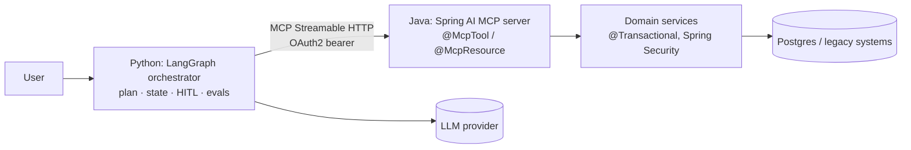

# Tool calling & MCP servers in Spring AI

!!! abstract "At a glance"
    **Priority:** P0 · **Complexity:** 3/5 · **Est. time:** 3 h · **Phase:** 3 · **Prereqs:** [Spring AI fundamentals](spring-ai-fundamentals.md), [Tool calling](../agentic-ai/tool-calling.md), [MCP](../agentic-ai/mcp.md)
    **You're done when:** a Spring AI service exposes `@McpTool`/`@McpResource` over Streamable HTTP, your Python LangGraph orchestrator calls it, and you can explain the tool loop, `ToolContext`, call limits, and how you'd secure and version the server.

## Why it matters

Tools are how LLM features touch enterprise systems — and in a Java estate, the systems of record (bookings, pricing, entitlements) are already Java services. **Exposing those as MCP servers** lets any agent runtime (your Python LangGraph orchestrator, Claude, IDE agents) use them through one standard protocol, while Java teams keep ownership of the business logic, security and transactions. This is the central Java↔Python integration pattern in the capstone: **Java owns tools, Python owns orchestration** (see [polyglot AI architecture](polyglot-ai-architecture.md)).

Spring AI 2.0 (GA 2026-06-12) ships MCP annotations in core, the MCP Java SDK 2.0, compliance with the MCP 2025-11-25 spec, and **Streamable HTTP as the default remote transport** (SSE deprecated).

## Core concepts

### Local tool calling: `@Tool`

```java
@Component
class ShipmentTools {
    private final ShipmentService shipments;
    ShipmentTools(ShipmentService shipments) { this.shipments = shipments; }

    @Tool(description = "Get the latest status and ETA for a shipment by its id (e.g. MSKU1234567)")
    ShipmentStatus getStatus(@ToolParam(description = "Shipment id") String shipmentId,
                             ToolContext ctx) {
        String tenant = (String) ctx.getContext().get("tenantId");   // not visible to the model
        return shipments.findForTenant(tenant, shipmentId);
    }
}

String answer = chatClient.prompt()
    .user("Where is MSKU1234567 and will it be late?")
    .tools(shipmentTools)                       // or .defaultTools(...) on the builder
    .toolContext(Map.of("tenantId", principal.tenantId()))
    .call().content();
```

- Package: `org.springframework.ai.tool.annotation.Tool` / `ToolParam`. Attributes: `name`, `description`, `returnDirect`, `resultConverter`.
- **The tool loop** is run by `ToolCallingAdvisor` (auto-registered by `ChatClient` in 2.0): send tool definitions → model requests calls → `ToolCallingManager` executes → results appended → repeat until the model answers. Works for `call()` and `stream()`.
- Programmatic alternatives: `MethodToolCallback`, `FunctionToolCallback.builder("name", fn).description(..).inputType(Req.class)`, or `ToolCallback` beans.
- **`ToolContext`** carries caller-side data (tenant, user, trace id) to tools without exposing it to the model — the right place for authorisation inputs.
- **Limits** (new in 2.0.x docs): `ToolCallingManager.builder().maxCallsPerTool(40).maxTotalToolCalls(150).onLimitExceeded(ToolCallLimitBehavior.THROW)`; properties `spring.ai.tools.limits.*`. Treat as your runaway-loop circuit breaker.
- **Errors:** a `RuntimeException` message is sent back to the model (lets it recover); checked exceptions and `Error`s re-throw. Set `spring.ai.tools.throw-exception-on-error` to change. Do not leak stack traces or internal ids to the model — throw domain exceptions with safe messages.
- **User-controlled execution** (approval gates): disable auto-registration with `AdvisorParams.toolCallingAdvisorAutoRegister(false)`, drive the loop yourself with `ToolCallingManager.executeToolCalls(...)` — this is where a human-in-the-loop confirmation for destructive tools goes.
- **`ToolSearchToolCallingAdvisor`** (`spring-ai-starter-tool-search-advisor`): with hundreds of tools, expose a search tool and reveal definitions progressively instead of shipping every schema in every request.

### MCP server: `@McpTool`, `@McpResource`, `@McpPrompt`

```xml
<dependency>
  <groupId>org.springframework.ai</groupId>
  <artifactId>spring-ai-starter-mcp-server-webmvc</artifactId>   <!-- or -webflux; -mcp-server = STDIO -->
</dependency>
```

```yaml
spring:
  ai:
    mcp:
      server:
        name: shipment-tools
        version: 1.0.0
        type: SYNC                 # or ASYNC
        protocol: STREAMABLE       # STREAMABLE | STATELESS | (SSE: deprecated in 2.0)
        streamable-http:
          mcp-endpoint: /mcp       # default
        annotation-scanner:
          enabled: true
```

```java
import org.springframework.ai.mcp.annotation.McpResource;
import org.springframework.ai.mcp.annotation.McpTool;
import org.springframework.ai.mcp.annotation.McpToolParam;
import org.springframework.ai.mcp.annotation.context.McpSyncRequestContext;

@Component
class ShipmentMcpTools {

    private final ShipmentService shipments;
    ShipmentMcpTools(ShipmentService shipments) { this.shipments = shipments; }

    @McpTool(name = "get_shipment_status",
             description = "Latest status and ETA for a shipment",
             annotations = @McpTool.McpAnnotations(readOnlyHint = true))
    public ShipmentStatus status(
            McpSyncRequestContext ctx,
            @McpToolParam(description = "Shipment id, e.g. MSKU1234567", required = true) String shipmentId) {
        ctx.info("lookup " + shipmentId);
        return shipments.find(shipmentId);
    }

    @McpTool(name = "book_cancel",
             description = "Cancel a booking. Destructive; requires a reason.",
             annotations = @McpTool.McpAnnotations(destructiveHint = true, idempotentHint = true))
    public CancelResult cancel(@McpToolParam(description = "Booking id") String bookingId,
                               @McpToolParam(description = "Reason") String reason) {
        return shipments.cancel(bookingId, reason);
    }

    @McpResource(uri = "policy://detention/{port}", name = "Detention policy",
                 description = "Free-time and detention rules per port", mimeType = "text/markdown")
    public String detentionPolicy(String port) { return policies.forPort(port); }
}
```

Facts to keep straight (Spring AI 2.0.x source): annotations live in `org.springframework.ai.mcp.annotation` (artifact `spring-ai-mcp-annotations`, part of core; the request-context types are in `...annotation.context`); `@McpToolParam(required = true)` is the default; `@McpTool.generateOutputSchema=true` publishes an output schema for non-primitive returns; `McpSyncRequestContext` gives `info/debug/warn/error` logging, `progress(...)`, `elicit(...)` (ask the user for input), `sample(...)` (ask the client's LLM), `roots()`, `ping()`. **Check the reference docs' import lines against your exact version** — the docs' examples have shown differing package names across releases.

- **Transports:** Streamable HTTP (`POST /mcp`, default `protocol: STREAMABLE`, stateful sessions), `STATELESS` (no session; simplest horizontal scaling, but no server→client requests like sampling/elicitation), STDIO (local subprocess), SSE (deprecated). The MCP spec revision of 2026-07-28 moves the core toward stateless operation; prefer `STATELESS` when your tools don't need server-initiated requests.
- **Tool annotations are hints**, not security: `readOnlyHint`/`destructiveHint` help clients decide on confirmation UI; clients must not trust them from untrusted servers, and *you* must still authorise inside the tool.

### Consuming MCP from Spring AI (client side)

```yaml
spring:
  ai:
    mcp:
      client:
        type: SYNC
        streamable-http:
          connections:
            shipments:
              url: http://shipment-tools:8080
              endpoint: /mcp
```

With `spring-ai-starter-mcp-client`, discovered tools are exposed as a `ToolCallbackProvider`, usable via `chatClient.prompt().toolCallbacks(provider)` or `defaultToolCallbacks(provider)`. Client annotations (`@McpLogging`, `@McpProgress`, `@McpSampling`, `@McpElicitation`, `@McpToolListChanged`) handle server notifications/requests.

### The polyglot picture



Python side (LangGraph) consuming the Java server:

```python
from langchain_mcp_adapters.client import MultiServerMCPClient
from langgraph.prebuilt import create_react_agent

client = MultiServerMCPClient({
    "shipments": {"url": "http://localhost:8080/mcp", "transport": "streamable_http"},
})
tools = await client.get_tools()            # discovered from the Java server
agent = create_react_agent(MODEL, tools)
result = await agent.ainvoke({"messages": [("user", "Where is MSKU1234567?")]})
```

### Security (what senior reviewers ask first)

- **AuthN/Z on the endpoint:** Spring Security as an OAuth2 resource server — validate JWTs at `/mcp`; map token scopes to tools; propagate the *end-user* identity (not a shared service account) so tool authorisation reflects the human. The MCP spec's authorisation model is OAuth 2.1-based, hardened further in the 2026-07-28 revision.
- **Least privilege by tool:** separate read-only and mutating tools (or servers); destructive tools require a confirmation step in the orchestrator (HITL).
- **Prompt injection:** tool results and resources are untrusted input to the model. A tool that reads emails + a tool that sends email = the "lethal trifecta" risk. Keep untrusted-content readers and exfiltration-capable tools apart.
- **Validation:** treat model-provided arguments like any external input (Bean Validation, allow-lists, bounds). Idempotency keys for writes; rate limits per principal.
- **Audit:** log tool name, principal, args hash, outcome, latency (see [observability & testing](observability-testing.md)).

### Design guidance for tool APIs

1. **Few, coarse-grained, task-shaped tools** beat a 1:1 mirror of your REST API (models choose poorly among 80 near-identical tools).
2. Descriptions are prompts: say *when* to use it and *what it returns*; include examples in parameter descriptions.
3. Return compact, model-friendly JSON (drop internal ids/noise) — tokens cost money and dilute context.
4. Errors as guidance: "shipment not found; ids look like MSKU1234567" beats a stack trace.
5. Version tools like APIs (additive changes; new name for breaking changes); MCP clients cache `tools/list`.

## Resources

| Resource | Type | Why this one | Level | Cost |
|---|---|---|---|---|
| [Spring AI: Tool calling](https://docs.spring.io/spring-ai/reference/api/tools.html) | docs | Loop, ToolContext, limits, user-controlled execution (2.0.x) | intermediate | free |
| [Spring AI: MCP overview](https://docs.spring.io/spring-ai/reference/api/mcp/mcp-overview.html) | docs | Server/client starters, transports, annotations map | intermediate | free |
| [Spring AI: MCP server starters](https://docs.spring.io/spring-ai/reference/api/mcp/mcp-server-boot-starter-docs.html) | docs | Exact artifact ids, protocol property values | intermediate | free |
| [Spring AI: MCP client starters](https://docs.spring.io/spring-ai/reference/api/mcp/mcp-client-boot-starter-docs.html) | docs | Connection config, tool callback provider | intermediate | free |
| [MCP specification 2026-07-28](https://modelcontextprotocol.io/specification/2026-07-28) | docs | Stateless core, auth hardening, extensions (RC as of July 2026) | advanced | free |
| [MCP Java SDK](https://github.com/modelcontextprotocol/java-sdk) | code | What Spring AI builds on; read for transport internals | advanced | free |
| [langchain-mcp-adapters](https://github.com/langchain-ai/langchain-mcp-adapters) | code | Python client side used in the lab | intermediate | free |
| [Simon Willison: the lethal trifecta](https://simonwillison.net/2025/Jun/16/the-lethal-trifecta/) | article | Clearest framing of tool-combination risk | intermediate | free |
| [awesome-spring-ai](https://github.com/spring-ai-community/awesome-spring-ai) :gem: | article | Community MCP servers, agent utils and security add-ons | intermediate | free |

## Hands-on lab

**Goal (2 h):** *the capstone integration* — a Spring AI MCP server used by the Python LangGraph orchestrator.

1. New Boot 4 module with `spring-ai-starter-mcp-server-webmvc`; config as above (`STREAMABLE`).
2. Implement three tools over an in-memory or Postgres-backed shipment service: `get_shipment_status` (read-only), `search_shipments(customerId, status, limit)` (bounded `limit`), `book_cancel` (destructive). Add one `@McpResource` (`policy://detention/{port}`).
3. Verify with the MCP Inspector (`npx @modelcontextprotocol/inspector`, Streamable HTTP, `http://localhost:8080/mcp`): list tools, call each, view the generated JSON schemas.
4. Secure it: add `spring-boot-starter-security-oauth2-resource-server` (name per Boot 4 modular starters; check start.spring.io), require a bearer token on `/mcp`, and assert 401 without one.
5. Point your Python LangGraph agent (`langchain-mcp-adapters`) at it; ask a question requiring two tool calls. Add a HITL interrupt before `book_cancel` in LangGraph.
6. Add a Spring-side `@Tool` variant of `get_shipment_status` and call it from a local `ChatClient` with `toolContext`; compare the two integration styles (in-process vs MCP) in a note: latency, auth propagation, versioning.
7. Set `spring.ai.tools.limits.max-total-tool-calls=5` in the Java client and provoke a loop to observe `ToolCallLimitBehavior`.

**Expected output:** Inspector screenshots, a Python transcript with two tool calls, a 401 test, and a comparison note.

## Questions

### L1 — Recall

??? question "Q1. Describe the Spring AI tool-calling loop."
    ??? success "Answer"
        `ChatClient` sends the prompt plus tool definitions; if the model responds with tool calls, `ToolCallingAdvisor` (auto-registered) uses `ToolCallingManager` to execute the matching `ToolCallback`s, appends the results to the conversation, and calls the model again; this repeats until a response without tool calls is returned. Works for blocking and streaming. Limits and error handling are configured on the manager/properties.

??? question "Q2. Which MCP transports does Spring AI 2.0 support and which is default for remote servers?"
    ??? success "Answer"
        Streamable HTTP (`protocol: STREAMABLE`, endpoint `/mcp` by default — the recommended remote transport), a `STATELESS` variant, STDIO for local subprocess servers, and SSE which is deprecated since 2.0. Servers can be SYNC or ASYNC.

??? question "Q3. What is ToolContext for?"
    ??? success "Answer"
        Passing caller-side data (tenant id, user id, trace context) into tool methods without exposing it to the model: `.toolContext(Map.of(...))` on the request, and a `ToolContext` parameter on the `@Tool` method. Use it for authorisation inputs so the model can't spoof them.

### L2 — Apply

??? question "Q4. Expose `searchShipments(customerId, status, limit)` as an MCP tool safely."
    ??? success "Answer"
        ```java
        @McpTool(name = "search_shipments", description = "Search a customer's shipments by status (max 50)",
                 annotations = @McpTool.McpAnnotations(readOnlyHint = true))
        public List<ShipmentSummary> search(
                @McpToolParam(description = "Customer id") String customerId,
                @McpToolParam(description = "IN_TRANSIT|DELIVERED|EXCEPTION") ShipmentStatus.Status status,
                @McpToolParam(description = "1..50", required = false) Integer limit) {
            int n = Math.min(Math.max(limit == null ? 20 : limit, 1), 50);
            authz.assertCanRead(SecurityContextHolder.getContext().getAuthentication(), customerId);
            return shipments.search(customerId, status, n);
        }
        ```
        Enum type constrains the schema; limit is clamped server-side; authorisation is checked against the authenticated principal (not the model-supplied customerId alone).

??? question "Q5. The agent loops calling the same failing tool 30 times. What do you configure?"
    ??? success "Answer"
        On the Java side: `ToolCallingManager` limits (`maxCallsPerTool`, `maxTotalToolCalls`, `onLimitExceeded`) or `spring.ai.tools.limits.*`. Make the tool's error message actionable so the model changes course, and return a distinct "do not retry" message for permanent errors. On the orchestrator side (LangGraph): recursion limit and a per-run budget; add tracing so loops show up in dashboards.

??? question "Q6. The Python client must call a tool that needs the end-user's identity. How do you propagate it?"
    ??? success "Answer"
        Send the user's access token (or an exchanged, audience-restricted token via OAuth token exchange) as the `Authorization: Bearer` header on the MCP HTTP connection; the Spring Security resource server validates it and the tool reads the principal from the `SecurityContext`. Don't pass user id as a tool parameter the model could alter. For Streamable HTTP in stateful mode, remember the session may outlive the token — validate per request.

### L3 — Design & trade-offs

??? question "Q7. In-process `@Tool` vs MCP server for a tool used by one Spring AI app and one Python agent — which?"
    ??? success "Answer"
        MCP when more than one runtime consumes the capability, when the tool owner is a different team, or when you want independent deploy/scale/security boundaries. In-process `@Tool` when a single JVM app owns both agent and tool: no network hop, shared transactions/security context, simpler testing. A common pattern: implement the domain logic once as a service, and expose it both as `@Tool` (local) and `@McpTool` (remote) thin adapters. MCP adds serialisation, auth propagation and versioning work — pay it only for the reuse.

??? question "Q8. Stateful Streamable HTTP vs STATELESS MCP server behind a load balancer — decide."
    ??? success "Answer"
        Stateless: any pod handles any request, trivial autoscaling and rolling deploys, aligns with the direction of the 2026-07-28 spec — but no server-initiated requests (sampling, elicitation) or per-session state. Stateful: enables progress streams, elicitation, sampling and subscriptions, but needs session affinity or shared session storage and careful pod termination. Default to stateless for read/act tools; go stateful only for features that require it.

??? question "Q9. 120 legacy REST endpoints; someone proposes auto-generating an MCP tool per endpoint. Evaluate."
    ??? success "Answer"
        Poor idea as a default: tool-selection accuracy drops with many overlapping tools, schemas consume context tokens on every request, and endpoint granularity ≠ task granularity. Better: design 10–20 task-oriented tools with tight descriptions, composing several endpoints server-side; use progressive disclosure (`ToolSearchToolCallingAdvisor`) if breadth is unavoidable; measure tool-selection accuracy with an eval set before and after.

### L4 — Staff-level ambiguity

??? question "Q10. Multiple teams want to publish MCP servers. What governance do you put in place?"
    ??? success "Answer"
        A lightweight platform: a registry/catalogue of servers with owners, data classification and risk tier; a paved-road Spring template (auth, audit logging, rate limiting, observability, tool-annotation conventions); a review checklist (destructive tools, lethal-trifecta combos, PII returns); versioning and deprecation policy; and an API gateway in front for authn, quotas and central logging. Tier by risk: read-only internal tools self-serve; write/financial tools need security review and mandatory HITL in consumers. Avoid becoming a bottleneck — automate the checks (schema linting, tests).

??? question "Q11. Your Python orchestrator team says 'just rewrite the tools in Python'. Argue both sides and decide."
    ??? success "Answer"
        For rewrite: single language, faster iteration, fewer hops. Against: duplicates business logic and authorisation, risks divergence from systems of record, loses Java transaction/security infrastructure, and forces the Python team to own Java-domain on-call knowledge. Decision heuristic: tools that are thin over external APIs can live in Python; tools embodying core domain rules stay with the domain owners (Java) and are exposed via MCP. Validate with a spike measuring added latency (usually low single-digit ms in-cluster) and the auth-propagation complexity. Record in an ADR with revisit triggers.

## Real-world use cases

- **Booking/shipment tool server** used by a Python LangGraph support agent and by IDE agents for developers.
- **Pricing and quote tools** with strict authorisation by customer contract.
- **Customs document lookup** exposed as MCP resources (`policy://...`) plus a validation tool.
- **Ops runbook agent**: read-only tools on metrics/logs, one gated remediation tool with HITL.

## Pitfalls & anti-patterns

- Tool descriptions written for humans, not models; vague parameter docs.
- Trusting `readOnlyHint`/`destructiveHint` as authorisation.
- Passing tenant/user ids as model-visible parameters.
- Returning entire entity graphs (tokens!) or stack traces.
- One tool per REST endpoint; unbounded `limit`.
- Copying SSE-transport examples from 1.x-era blogs into a 2.0 project.
- No limits on tool-loop iterations; no audit trail.

## Checklist

- [ ] I can explain the tool loop, `ToolContext`, and limits without notes
- [ ] I built an MCP server with `@McpTool` and `@McpResource` over Streamable HTTP
- [ ] My Python LangGraph agent called it with a bearer token
- [ ] I can defend stateless vs stateful and coarse-grained tool design
- [ ] I answered all L3 questions out loud in < 3 min each
