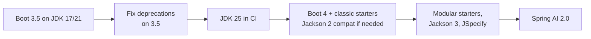

# Spring Boot 4 & Spring Framework 7

!!! abstract "At a glance"
    **Priority:** P0 · **Complexity:** 2/5 · **Est. time:** 3 h · **Phase:** 1 · **Prereqs:** [Modern Java](modern-java.md), prior Spring Boot 2/3 experience
    **You're done when:** you can scaffold a Boot 4 service on JDK 25 with Spring AI 2.0, explain the five Boot 4 changes that bite during migration (modular starters, Jackson 3, Jakarta EE 11, JSpecify, removed/renamed properties), and add API versioning + declarative retry without extra libraries.

## Why it matters

Spring AI 2.0 (GA 2026-06-12) **requires Spring Boot 4.0/4.1 and Spring Framework 7** — there is no Spring AI 2.0 on Boot 3. So the Boot 4 jump is the gate to everything else in this track. Boot 4.0 went GA in November 2025 (4.1 is also out as of September 2026). For an engineer returning from Boot 2/3 days, the platform now gives you, out of the box, things you used to bolt on: API versioning, retry and concurrency limiting, declarative HTTP clients, null-safety annotations, and first-class OpenTelemetry.

Architect angle: most orgs will run Boot 3 and Boot 4 side by side for a year. Knowing the migration seams (Jackson 3, modular auto-config, Jakarta EE 11) is what lets you plan it without stalling AI delivery.

## Core concepts

### What's new, grouped by why you care

| Area | Boot 4 / Framework 7 change | Why it matters for AI services |
|---|---|---|
| Baseline | Java 17 minimum (JDK 25 recommended), Jakarta EE 11 (Servlet 6.1), Kotlin 2.2 | Run on the LTS; virtual threads mature |
| Modularisation | Boot's auto-configuration split into many focused modules; technology-specific starters (e.g., `spring-boot-starter-webmvc`); a "classic" starter path for gradual migration | Smaller classpaths, faster startup, fewer surprise auto-configs |
| JSON | **Jackson 3** (`tools.jackson.*` packages, `JsonMapper`); Jackson 2 supported in deprecated form | Spring AI 2.0 uses Jackson 3; custom serializers need porting |
| Null-safety | JSpecify annotations across Spring portfolio (and Spring AI 2.0) | Kotlin/IDE/NullAway checking of `@Nullable` returns like `entity(...)` |
| Resilience | `@Retryable`, `@ConcurrencyLimit`, `@EnableResilientMethods`, `RetryTemplate` in Spring Framework core | Retry LLM/tool calls and bulkhead virtual-thread fan-out without Resilience4j for simple cases |
| API versioning | First-class `version` attribute on request mappings; header/query/path/media-type resolution; `spring.mvc.apiversion.*` properties | Version tool/agent APIs consumed by other teams |
| HTTP clients | HTTP service client auto-configuration (`@HttpExchange` interfaces, `@ImportHttpServices`) | Typed clients for internal tools the agent calls |
| Observability | New `spring-boot-starter-opentelemetry`; Micrometer 1.16-era observations | Spring AI emits Micrometer observations; export OTLP without agents |
| Testing | `RestTestClient`; Testcontainers 2.0 | Integration tests for RAG against real pgvector |
| Virtual threads | `spring.threads.virtual.enabled=true` now also covers auto-configured JDK `HttpClient`-based clients | Blocking LLM calls scale |

### Minimal Boot 4 + Spring AI 2.0 build

=== "Maven"

    ```xml
    <parent>
      <groupId>org.springframework.boot</groupId>
      <artifactId>spring-boot-starter-parent</artifactId>
      <version>4.1.1</version> <!-- check start.spring.io for the latest 4.x patch -->
    </parent>

    <properties>
      <java.version>25</java.version>
      <spring-ai.version>2.0.1</spring-ai.version>
    </properties>

    <dependencyManagement>
      <dependencies>
        <dependency>
          <groupId>org.springframework.ai</groupId>
          <artifactId>spring-ai-bom</artifactId>
          <version>${spring-ai.version}</version>
          <type>pom</type>
          <scope>import</scope>
        </dependency>
      </dependencies>
    </dependencyManagement>

    <dependencies>
      <dependency>
        <groupId>org.springframework.boot</groupId>
        <artifactId>spring-boot-starter-webmvc</artifactId>
      </dependency>
      <dependency>
        <groupId>org.springframework.boot</groupId>
        <artifactId>spring-boot-starter-actuator</artifactId>
      </dependency>
      <dependency>
        <groupId>org.springframework.ai</groupId>
        <artifactId>spring-ai-starter-model-openai</artifactId> <!-- or -anthropic, -ollama -->
      </dependency>
      <dependency>
        <groupId>org.springframework.boot</groupId>
        <artifactId>spring-boot-starter-test</artifactId>
        <scope>test</scope>
      </dependency>
    </dependencies>
    ```

=== "Gradle (Kotlin DSL)"

    ```kotlin
    plugins {
        java
        id("org.springframework.boot") version "4.1.1"
    }
    java { toolchain { languageVersion = JavaLanguageVersion.of(25) } }

    dependencies {
        implementation(platform(org.springframework.boot.gradle.plugin.SpringBootPlugin.BOM_COORDINATES))
        implementation(platform("org.springframework.ai:spring-ai-bom:2.0.1"))
        implementation("org.springframework.boot:spring-boot-starter-webmvc")
        implementation("org.springframework.boot:spring-boot-starter-actuator")
        implementation("org.springframework.ai:spring-ai-starter-model-openai")
        testImplementation("org.springframework.boot:spring-boot-starter-test")
    }
    ```

As of September 2026 the Spring AI BOM's latest GA is 2.0.1 (a patch release with CVE fixes over 2.0.0); Spring AI's own build targets Boot 4.1.x. Always take versions from [start.spring.io](https://start.spring.io/) rather than blog posts.

### API versioning without a library

```java
@RestController
@RequestMapping("/api/shipments")
class ShipmentController {
    @GetMapping(path = "/{id}/summary", version = "1.0")
    SummaryV1 summaryV1(@PathVariable String id) { ... }

    @GetMapping(path = "/{id}/summary", version = "2.0+")   // 2.0 and later
    SummaryV2 summaryV2(@PathVariable String id) { ... }     // LLM-generated summary + citations
}

@Configuration
class ApiVersionConfig implements WebMvcConfigurer {
    @Override
    public void configureApiVersioning(ApiVersionConfigurer configurer) {
        configurer.useRequestHeader("API-Version");
    }
}
```

Unsupported versions → 400 (`InvalidApiVersionException`); deprecation can be advertised with `Deprecation`/`Sunset` headers via `ApiVersionDeprecationHandler`. Boot exposes equivalent `spring.mvc.apiversion.*` properties. Links to [API contracts & versioning](../architecture/api-contracts-versioning.md).

### Declarative resilience in core Spring

```java
@Configuration
@EnableResilientMethods
class ResilienceConfig {}

@Service
class ForecastTool {
    @Retryable(includes = HttpServerErrorException.class, maxRetries = 3,
               delay = 200, multiplier = 2, jitter = 50, maxDelay = 2000)
    @ConcurrencyLimit(16)       // bulkhead for virtual-thread callers
    public Forecast forPort(String unlocode) { return client.forecast(unlocode); }
}
```

Nuance: retry is for **idempotent** operations. Retrying an LLM call is usually safe (costly, not harmful); retrying a tool that books a container is not — add idempotency keys. Don't retry 429s blindly at this layer if a gateway already does. For circuit breakers and rate limiters you still want Resilience4j (or a gateway).

### Jackson 3 migration — what actually breaks

- Packages move: `com.fasterxml.jackson.databind.ObjectMapper` → `tools.jackson.databind.json.JsonMapper` (immutable, builder-configured). Annotations stay in `com.fasterxml.jackson.annotation`.
- Checked `JsonProcessingException` → unchecked `JacksonException`.
- Some defaults changed (e.g., date handling and property ordering); snapshot-test your public JSON.
- Custom `Module`s and serializers need recompiling against Jackson 3.

### JSpecify null-safety

Boot 4, Framework 7 and Spring AI 2.0 annotate APIs with JSpecify `@Nullable`/`@NullMarked`. Practical effect: `chatClient.prompt()...call().entity(Foo.class)` is declared `@Nullable` — your IDE (and NullAway, if you adopt it) will make you handle the empty-response case. Adopt `@NullMarked` in `package-info.java` for new AI modules; it's the cheapest way to catch "model returned nothing" NPEs.

### Migration path from Boot 3.x



Upgrade to the last 3.x first and clear deprecation warnings (Boot removes what 3.x deprecated), then jump. OpenRewrite has Boot migration recipes; the official [Boot 4.0 release notes](https://github.com/spring-projects/spring-boot/wiki/Spring-Boot-4.0-Release-Notes) and the Spring AI [upgrade notes](https://docs.spring.io/spring-ai/reference/upgrade-notes.html) are the checklist. Spring AI 2.0 also removed the `.options` segment from many property keys (e.g., `spring.ai.openai.chat.model` instead of `spring.ai.openai.chat.options.model`) — grep your configs.

### Python/FastAPI mapping

| Concern | Spring Boot 4 | FastAPI world |
|---|---|---|
| DI | Constructor injection, beans | `Depends()` |
| Config | `application.yml`, `@ConfigurationProperties` records | `pydantic-settings` |
| Validation | Jakarta Validation on records | Pydantic models |
| API versioning | Built-in `version` mapping | Router prefixes / custom |
| Retry | `@Retryable` (core) | `tenacity` |
| Health/metrics | Actuator + Micrometer | custom / `prometheus-fastapi-instrumentator` |

## Resources

| Resource | Type | Why this one | Level | Cost |
|---|---|---|---|---|
| [Spring Boot 4.0 release notes](https://github.com/spring-projects/spring-boot/wiki/Spring-Boot-4.0-Release-Notes) | docs | The migration checklist: modules, Jackson 3, removed properties | intermediate | free |
| [Spring Framework 7.0 release notes](https://github.com/spring-projects/spring-framework/wiki/Spring-Framework-7.0-Release-Notes) | docs | Versioning, resilience, JSpecify, HTTP service clients | intermediate | free |
| [Spring Boot 4.0.0 announcement](https://spring.io/blog/2025/11/20/spring-boot-4-0-0-available-now) | article | Official summary of the headline features | intermediate | free |
| [Spring Framework: resilience features](https://docs.spring.io/spring-framework/reference/core/resilience.html) | docs | Exact `@Retryable`/`@ConcurrencyLimit` semantics | intermediate | free |
| [Spring MVC API versioning](https://docs.spring.io/spring-framework/reference/web/webmvc-versioning.html) | docs | Resolution strategies, deprecation headers | intermediate | free |
| [Dan Vega](https://www.danvega.dev/) :gem: | article/video | Short, practical Boot 4 and Spring AI walkthroughs; best "show me the code" source | intermediate | free |
| [Josh Long — Spring Tips](https://www.youtube.com/@SpringSourceDev) :gem: | video | Live-coded tours of every new Boot/Framework feature, including AOT and virtual threads | intermediate | free |
| [JSpecify](https://jspecify.dev/) | docs | What the null-safety annotations mean and how tools check them | intermediate | free |

## Hands-on lab

**Goal (90 min):** create the Java service skeleton for the capstone that later labs extend (RAG, MCP tools).

1. On [start.spring.io](https://start.spring.io/) pick Boot 4.1.x, Java 25, Maven; add Spring Web (MVC), Actuator, Validation, OpenAI (or Ollama for local), PostgreSQL Driver, Docker Compose support, Testcontainers.
2. `application.yml`: `spring.threads.virtual.enabled: true`, model config (`spring.ai.openai.api-key: ${OPENAI_API_KEY}`, `spring.ai.openai.chat.model: <model>` — or `spring.ai.ollama.chat.model`).
3. Add a versioned `/api/shipments/{id}/summary` endpoint (v1 static, v2 via `ChatClient`, see [Spring AI fundamentals](spring-ai-fundamentals.md)).
4. Add a `ForecastTool` with `@Retryable` + `@ConcurrencyLimit`; stub the HTTP client to fail twice then succeed; assert 3 calls in a test using `RestTestClient`/MockMvc.
5. Add `@NullMarked` to your root package and fix the warnings the IDE raises.
6. Run `./mvnw spring-boot:run` and hit `curl -H 'API-Version: 2.0' localhost:8080/api/shipments/MSKU123/summary`.

**Expected output:** v1 and v2 responses differ by version header; a 400 for `API-Version: 9.0`; the retry test passes; Actuator `/actuator/health` UP.

## Questions

### L1 — Recall

??? question "Q1. Which Spring Boot and Framework versions does Spring AI 2.0 require?"
    ??? success "Answer"
        Spring Boot 4.0 or 4.1 and Spring Framework 7.0 (plus Jackson 3). Spring AI 1.x targets Boot 3.x. There's no supported combination of Spring AI 2.0 with Boot 3.

??? question "Q2. Name four capabilities Boot 4 / Framework 7 give you that previously needed extra libraries."
    ??? success "Answer"
        API versioning (`version` attribute on mappings), retry and concurrency limiting (`@Retryable`, `@ConcurrencyLimit`, `RetryTemplate` in core), HTTP service client auto-configuration for `@HttpExchange` interfaces, JSpecify null-safety annotations, a dedicated OpenTelemetry starter, and `RestTestClient` for tests.

??? question "Q3. What are the main code-level changes when moving from Jackson 2 to Jackson 3?"
    ??? success "Answer"
        Core/databind packages move to `tools.jackson.*`; `JsonMapper` (immutable, builder-configured) is the primary mapper; exceptions become unchecked (`JacksonException`); annotations remain in `com.fasterxml.jackson.annotation`; some defaults change, so JSON output should be snapshot-tested.

### L2 — Apply

??? question "Q4. Add a v2 endpoint that returns an LLM summary while v1 keeps the old contract, versioned by header."
    ??? success "Answer"
        Two methods with the same path and `version = "1.0"` / `version = "2.0+"`, plus `configureApiVersioning` with `configurer.useRequestHeader("API-Version")` (or the `spring.mvc.apiversion.*` properties). Mark v1 deprecated with an `ApiVersionDeprecationHandler` that emits `Deprecation`/`Sunset` headers, and track v1 traffic before removing it.

??? question "Q5. A tool calling an internal pricing API fails with intermittent 503s. Add retries safely."
    ??? success "Answer"
        `@EnableResilientMethods` on a config class, then `@Retryable(includes = HttpServerErrorException.ServiceUnavailable.class, maxRetries = 3, delay = 200, multiplier = 2, jitter = 50, maxDelay = 2000)` on the method. Confirm the call is idempotent (GET) — for writes add an idempotency key. Keep retries in one layer only (not also in the HTTP client and the agent). Surface exhaustion to the model as a tool error message so it can respond gracefully rather than retrying itself.

??? question "Q6. After upgrading, application.yml has spring.ai.openai.chat.options.model and the model is ignored. Why?"
    ??? success "Answer"
        Spring AI 2.0 removed the artificial `.options` segment from many property keys; the key is now `spring.ai.openai.chat.model`. Check the Spring AI upgrade notes, and enable Boot's `spring-boot-properties-migrator` temporarily to log renamed/removed keys at startup.

### L3 — Design & trade-offs

??? question "Q7. Spring's built-in @Retryable/@ConcurrencyLimit vs Resilience4j — when is each right?"
    ??? success "Answer"
        Built-ins: simple retry with backoff/jitter and a concurrency bulkhead, zero extra dependencies, good for most internal tool calls. Resilience4j: circuit breakers, rate limiters, time limiters, sliding-window metrics, per-instance config/registries and richer observability. For LLM calls, the hard problems (rate limits, fallbacks across providers, budget) are often better centralised in an LLM gateway than per-service annotations. Pick built-ins by default; add Resilience4j when you need breakers or rate limiting in-process.

??? question "Q8. Big-bang Boot 3 → 4 migration of a 30-module monolith vs module-by-module — decide."
    ??? success "Answer"
        A single deployable can't run Boot 3 and 4 simultaneously, so "module-by-module" means preparing modules on 3.5 (clear deprecations, isolate Jackson customisations behind one config, move to Jakarta EE 11-compatible libraries, JDK 25 in CI) and then a single flip, possibly using the classic starters and Jackson 2 compatibility to reduce the blast radius. Alternatively carve new AI features into a separate Boot 4 service (strangler) so AI work isn't blocked by the monolith migration. Most orgs do both.

??? question "Q9. Should new AI services default to MVC + virtual threads or WebFlux on Boot 4?"
    ??? success "Answer"
        MVC + virtual threads by default: simpler, blocking JDBC, easier debugging, and Spring AI streaming (`Flux<String>`) can still be returned as SSE from MVC controllers. WebFlux when the service is a streaming gateway with huge numbers of long-lived connections and backpressure matters end to end, or when the team is already reactive. See [virtual threads](virtual-threads-structured-concurrency.md).

### L4 — Staff-level ambiguity

??? question "Q10. Three product teams want Spring AI now; the shared platform libraries are still on Boot 3. How do you unblock them without forking the platform?"
    ??? success "Answer"
        Offer a time-boxed "AI paved road": a Boot 4 + Spring AI 2.0 service template (separate deployable) that depends only on platform libraries that are Boot-4-compatible, with gaps filled by thin adapters (auth, logging, config). Platform team commits to a Boot 4 compatibility release by a date; product teams agree to adopt it and delete adapters. Governance: ADR, an owner for the template, and a sunset date for the adapters. Avoid each team hand-rolling its own Boot 4 stack, which creates three future migrations.

??? question "Q11. Architecture review: a team proposes Python (FastAPI + Pydantic AI) for a new AI feature in a Java-only org. Your position?"
    ??? success "Answer"
        Don't decide on language preference; decide on constraints: where the data and transactions live (Java domain services), team skills and on-call ownership, library maturity for the specific AI need (eval/optimisation tooling like DSPy is Python-first; Spring AI is strong for RAG/tools/MCP inside existing Java estates), and operational standards (observability, security, deployment). A common resolution: Java owns domain tools and RAG services exposed via MCP/HTTP; Python owns experimentation-heavy orchestration if needed. See [polyglot AI architecture](polyglot-ai-architecture.md). Capture it in an ADR with a reversal trigger.

## Real-world use cases

- **Versioned shipment-summary API** consumed by web, mobile and partner integrations — v2 adds LLM-generated narrative with citations while v1 stays stable.
- **Tool microservices** for an agent (pricing, schedules, customs rules) with core `@Retryable` and bulkheads, exposed via MCP (see [tools & MCP](spring-ai-tools-mcp.md)).
- **Strangler migration:** new Boot 4 AI service beside a Boot 3 monolith, sharing the database via read-only views or events.

## Pitfalls & anti-patterns

- Jumping from Boot 3.0/3.1 straight to 4 without passing through 3.5 deprecation cleanup.
- Leaving Jackson 2 `ObjectMapper` beans around that silently diverge from Spring AI's Jackson 3 mapper.
- Retrying non-idempotent tool calls.
- Treating `entity(...)` results as non-null.
- Pinning versions from blog posts; always verify against start.spring.io and the BOM.

## Checklist

- [ ] I can list Boot 4's key changes and why each matters for AI services
- [ ] I scaffolded the Boot 4 + Spring AI 2.0 skeleton on JDK 25
- [ ] I implemented header-based API versioning and a retry-tested tool
- [ ] I know the Jackson 3 and Spring AI property-key migration gotchas
- [ ] I answered all L3 questions out loud in < 3 min each
