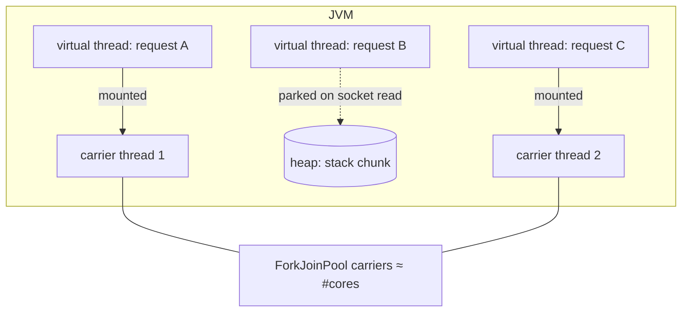

# Virtual threads, structured concurrency & scoped values

!!! abstract "At a glance"
    **Priority:** P0 · **Complexity:** 3/5 · **Est. time:** 3 h · **Phase:** 5 · **Prereqs:** [Modern Java](modern-java.md), [asyncio deep dive](../python/asyncio-deep.md), [Concurrency models](../python/concurrency-models.md)
    **You're done when:** you can fan out an LLM call + vector search + tool call in parallel with a deadline and cancellation using `StructuredTaskScope`, propagate a tenant id with `ScopedValue`, and explain where virtual threads do *not* help.

## Why it matters

AI services are **I/O-bound waiting machines**: a single request may wait 2–30 s on an LLM, plus vector DB, plus tools. Thread-per-request with platform threads caps you at a few hundred concurrent requests per pod; reactive (WebFlux) fixes that at the cost of a coloured, harder-to-debug programming model. Virtual threads (final in JDK 21) give you **blocking-style code with near-reactive concurrency** — and Spring Boot 4 wires them in with one property. For a Python-first engineer this is the key contrast with `asyncio`: no `async`/`await` colouring, no event-loop blocking bugs, stack traces that make sense.

Interviews: "How many concurrent streaming chat sessions can one pod hold, and what's the bottleneck?" — the answer is almost never "threads" anymore; it's connection pools, provider rate limits, and memory.

## Core concepts

### Virtual threads in one picture



- A virtual thread is a `java.lang.Thread` whose stack lives on the heap while it's blocked. On blocking I/O the JDK **unmounts** it from its carrier (a platform thread in a ForkJoinPool sized ≈ CPU cores) and mounts another.
- Cost: ~a few hundred bytes to low KB each; creating millions is fine. **Never pool them** — create one per task (`Executors.newVirtualThreadPerTaskExecutor()`).
- They improve **throughput for blocking I/O**, not latency of a single call and not CPU-bound work.

### Pinning: what changed in JDK 24

| Situation | JDK 21–23 | JDK 24+ (incl. 25 LTS) |
|---|---|---|
| Blocking inside `synchronized` | **Pins** carrier (big scalability bug) | Unmounts normally (JEP 491) |
| Blocking inside native/JNI frame | Pins | Still pins |
| Blocking in class initialiser | Pins | Still pins (rare) |
| `ReentrantLock` | Fine | Fine |

JEP 491 removed the most common production gotcha (e.g., the Netflix "dude, where's my lock" incident on JDK 21). On JDK 25 you can mostly stop rewriting `synchronized` to `ReentrantLock` for virtual-thread reasons. Diagnose remaining pinning with JFR event `jdk.VirtualThreadPinned`.

### Spring Boot 4 wiring

```properties
spring.threads.virtual.enabled=true
```

This switches Tomcat request handling, `@Async`, `@Scheduled` task executors, and (new in Boot 4) auto-configured JDK `HttpClient`-backed HTTP clients to virtual threads. Spring AI's blocking `ChatClient.call()` on a virtual thread is the simplest scalable pattern; `stream()` returns a Reactor `Flux` and works with both MVC (SSE via `SseEmitter`/`Flux` return types) and WebFlux.

### Where virtual threads don't save you (the senior part)

1. **Downstream limits become the bottleneck.** 10k virtual threads hitting a HikariCP pool of 20 → 9,980 threads waiting on the pool. Size pools deliberately; add **bulkheads**. Spring Framework 7 adds `@ConcurrencyLimit` (and `@Retryable`) in core resilience support; a `Semaphore` works too.
2. **LLM provider rate limits** (RPM/TPM) are the true cap. Unlimited concurrency just converts to 429s. Put a token-bucket limiter in front of the model client (or route via an [LLM gateway](../ai-system-design/llm-gateway.md)).
3. **ThreadLocal-heavy libraries** allocate per thread; with millions of threads that's memory bloat. Prefer `ScopedValue` for request context.
4. **CPU-bound work** (tokenisation, re-ranking with a local model, JSON on huge payloads) still needs a bounded platform pool.
5. **Memory per in-flight request**: a streaming chat holding a 100 KB context × 20k sessions = 2 GB. The heap, not threads, caps you.

### Structured concurrency (JDK 25: fifth preview, JEP 505)

Treat a group of subtasks as one unit: they start in a scope, finish (or are cancelled) before the scope closes, errors propagate, and thread dumps show the parent/child tree. The JDK 25 API uses `StructuredTaskScope.open()` + `Joiner` policies.

```java
// compile & run with --enable-preview on JDK 25
import java.time.Duration;
import java.util.concurrent.StructuredTaskScope;
import java.util.concurrent.StructuredTaskScope.Joiner;
import java.util.concurrent.StructuredTaskScope.Subtask;

record Context(Shipment shipment, List<Document> docs, Weather weather) {}

Context gather(String shipmentId) throws InterruptedException {
    try (var scope = StructuredTaskScope.open(
            Joiner.<Object>allSuccessfulOrThrow(),
            cf -> cf.withTimeout(Duration.ofSeconds(3)))) {
        Subtask<Shipment> s = scope.fork(() -> shipments.find(shipmentId));
        Subtask<List<Document>> d = scope.fork(() -> vectorStore.similaritySearch(shipmentId));
        Subtask<Weather> w = scope.fork(() -> weatherTool.forPortOf(shipmentId));
        scope.join();          // FailedException on first failure (others cancelled),
                               // TimeoutException on deadline
        return new Context(s.get(), d.get(), w.get());
    }
}
```

Other policies: `Joiner.anySuccessfulResultOrThrow()` (hedged requests — e.g., race two model providers, take the first), `Joiner.awaitAll()` (collect partial results; inspect `Subtask.state()`), `Joiner.allUntil(predicate)`. Python analogue: `asyncio.TaskGroup` + `asyncio.timeout()`.

Without preview: `try (var ex = Executors.newVirtualThreadPerTaskExecutor())` + `CompletableFuture`/`invokeAll` — works, but cancellation on failure and deadline propagation are manual.

### Scoped values (final in JDK 25, JEP 506)

Immutable, bounded-lifetime context that child threads in a structured scope inherit automatically — the replacement for `ThreadLocal` for request context (tenant, user, trace baggage, LLM budget).

```java
static final ScopedValue<String> TENANT = ScopedValue.newInstance();

void handle(Request req) {
    ScopedValue.where(TENANT, req.tenantId()).run(() -> agent.answer(req.question()));
}

// deep inside a tool, possibly on a forked subtask:
String tenant = TENANT.get();   // NoSuchElementException if unbound; use isBound()/orElse
```

Why better than `ThreadLocal`: immutable (no leaks from forgotten `remove()`), cheap to inherit, lifetime bounded by the `run` block. Caveat: Spring's own context holders (security, request attributes, Micrometer observation) are still `ThreadLocal`-based; micrometer context-propagation bridges them across thread hops.

### Python comparison

| Concern | Java 25 | Python 3.14 |
|---|---|---|
| I/O concurrency model | Virtual threads, blocking code | `asyncio` (coloured) or threads (GIL; free-threaded build optional) |
| Group + cancel on failure | `StructuredTaskScope` (preview) | `asyncio.TaskGroup` (stable) |
| Deadline | `withTimeout` in scope config | `asyncio.timeout()` |
| Request context | `ScopedValue` | `contextvars.ContextVar` |
| Blocking bug | Pinning (rare since JDK 24) | Blocking call on event loop (common) |

## Resources

| Resource | Type | Why this one | Level | Cost |
|---|---|---|---|---|
| [JEP 444: Virtual Threads](https://openjdk.org/jeps/444) | docs | The design doc; the "don't pool virtual threads" guidance lives here | intermediate | free |
| [JEP 491: Synchronize without pinning](https://openjdk.org/jeps/491) | docs | What changed in JDK 24; remaining pinning cases | advanced | free |
| [JEP 505: Structured Concurrency (5th preview)](https://openjdk.org/jeps/505) | docs | Current `open()`/`Joiner` API as shipped in JDK 25 | advanced | free |
| [JEP 506: Scoped Values](https://openjdk.org/jeps/506) | docs | Final API and the ThreadLocal comparison | intermediate | free |
| [Netflix: Java 21 virtual threads — dude, where's my lock?](https://netflixtechblog.com/java-21-virtual-threads-dude-wheres-my-lock-3052540e231d) :gem: | article | Real production deadlock caused by pinning; superb debugging narrative | advanced | free |
| [JEP Café / Java channel](https://www.youtube.com/@java) :gem: | video | José Paumard's episodes on virtual threads and structured concurrency are the clearest visual explanations | intermediate | free |
| [inside.java](https://inside.java/) | article | JDK team posts on Loom internals and preview API changes | advanced | free |
| [Spring Framework resilience (@Retryable, @ConcurrencyLimit)](https://docs.spring.io/spring-framework/reference/core/resilience.html) | docs | Bulkheading virtual-thread fan-out with core Spring 7 annotations | intermediate | free |

## Hands-on lab

**Goal (90 min):** measure what virtual threads buy an LLM-backed endpoint, and where it stops.

1. Spring Boot 4 app with `spring-boot-starter-webmvc` and an endpoint `/answer` that sleeps 2 s (simulating an LLM) and then does a 50 ms JDBC call against Postgres (HikariCP default pool 10).
2. Load test with `oha` or `k6` at 1,000 concurrent users for 60 s with `spring.threads.virtual.enabled=false` (Tomcat default max 200 threads). Record throughput and p99.
3. Flip to `true`. Expect throughput to rise roughly 5× on the sleep-only path; then observe the Hikari pool becoming the bottleneck (`hikaricp.connections.pending` metric in Actuator).
4. Add `@ConcurrencyLimit(20)` (with `@EnableResilientMethods` on a config class) around the DB call, or a `Semaphore`; watch pending time move from the pool to the limiter (controlled, observable).
5. Replace the sleep with three forked subtasks via `StructuredTaskScope` (compile with `--enable-preview`), one of which fails 10% of the time; verify the others get cancelled (log interrupts) and the request fails fast.
6. Put a `ScopedValue<String> TENANT` around the handler and read it inside a forked subtask.

**Expected output:** a small table (mode → RPS, p99, bottleneck metric) and a thread dump (`jcmd <pid> Thread.dump_to_file -format=json out.json`) showing the structured task tree.

## Questions

### L1 — Recall

??? question "Q1. Why should you never pool virtual threads?"
    ??? success "Answer"
        Pools exist to amortise the cost of expensive platform threads and to limit concurrency. Virtual threads are cheap to create, so pooling adds no benefit and misuses a pool as a concurrency limiter, which hides the real constraint. Limit concurrency explicitly (semaphore, `@ConcurrencyLimit`, connection-pool size) and create one virtual thread per task.

??? question "Q2. What is pinning and what did JEP 491 change?"
    ??? success "Answer"
        Pinning is when a blocked virtual thread cannot unmount from its carrier, so it blocks the platform thread too. Before JDK 24, blocking inside `synchronized` pinned. JEP 491 (JDK 24) lets virtual threads acquire, hold and release monitors independently of carriers, so `synchronized` no longer pins. Native frames and class initialisers still pin.

??? question "Q3. What does ScopedValue offer over ThreadLocal?"
    ??? success "Answer"
        Immutable bindings with a bounded lifetime (the `run`/`call` block), automatic inheritance by subtasks forked in a `StructuredTaskScope`, no `remove()` leaks, and lower cost with many threads. Final in JDK 25 (JEP 506).

### L2 — Apply

??? question "Q4. A pod with virtual threads handles 5,000 concurrent chat requests; each waits ~8 s on the LLM. Provider limit is 600 RPM for your key. What happens and what do you do?"
    ??? success "Answer"
        600 RPM = 10 requests/s. 5,000 in flight at 8 s each implies ~625 req/s demand — 60× over the limit. Virtual threads happily issue them all and you get a storm of 429s and retries (making it worse). Fix: a token-bucket limiter at ~10 req/s (per key, shared across pods via Redis or a gateway), a bounded queue with fast rejection (503 + Retry-After) beyond an SLO-derived wait, multiple keys/deployments or provider routing, caching/semantic caching for repeat questions. Threads were never the constraint.

??? question "Q5. Rewrite this to fail fast with a 2 s deadline: call LLM A and LLM B, take whichever answers first."
    ??? success "Answer"
        ```java
        try (var scope = StructuredTaskScope.open(
                Joiner.<String>anySuccessfulResultOrThrow(),
                cf -> cf.withTimeout(Duration.ofSeconds(2)))) {
            scope.fork(() -> clientA.prompt(q).call().content());
            scope.fork(() -> clientB.prompt(q).call().content());
            return scope.join();   // first success; loser is interrupted
        }
        ```
        Hedging doubles cost for the hedged fraction — hedge only after a p95 delay (fork B after e.g. 800 ms) to cap spend.

??? question "Q6. Your tools read the tenant from a ThreadLocal set in a servlet filter. After moving fan-out to StructuredTaskScope the tenant is null in subtasks. Fix it."
    ??? success "Answer"
        `ThreadLocal` values are not inherited by forked virtual threads (InheritableThreadLocal is, but copies are costly and mutable). Bind a `ScopedValue` in the filter/handler: `ScopedValue.where(TENANT, id).call(() -> handler.handle(req))`; subtasks forked inside the scope inherit it. For Spring-managed contexts (security, observation), use Micrometer context-propagation or pass explicit parameters — and for Spring AI tools, prefer `ToolContext` for tenant data rather than ambient state.

### L3 — Design & trade-offs

??? question "Q7. WebFlux vs Spring MVC + virtual threads for a new streaming chat service — decide."
    ??? success "Answer"
        MVC + virtual threads by default: simpler code, blocking JDBC/JPA, readable stack traces, team familiarity; Spring AI `stream()` still returns `Flux<String>`, which MVC can return as SSE. Choose WebFlux when you need end-to-end backpressure, very high fan-out of long-lived streaming connections where per-request memory matters, or an already-reactive stack (R2DBC, reactive gateways). Key point: both can hold tens of thousands of idle connections; the difference is programming model and backpressure semantics, not raw capacity.

??? question "Q8. Where do virtual threads make things worse?"
    ??? success "Answer"
        (1) CPU-bound work — more threads than cores just adds scheduling overhead; use a bounded pool. (2) Unbounded fan-out overwhelms downstreams (DB pools, provider rate limits) that platform-thread limits used to protect implicitly. (3) ThreadLocal caches (e.g., per-thread buffers in older libraries) multiply memory. (4) Native/JNI blocking still pins. (5) Code relying on thread identity or small thread counts (per-thread metrics cardinality).

??? question "Q9. Use structured concurrency (preview) in production, or wait?"
    ??? success "Answer"
        Arguments for: correct cancellation and error propagation for fan-out (a real source of leaked in-flight LLM calls and wasted tokens), observability in thread dumps. Against: preview status — the API changed in JDK 25 and may change again; `--enable-preview` binaries are tied to one feature release, blocking a routine JDK bump. Middle path: wrap it behind a tiny internal `Parallel.all(...)`/`Parallel.first(...)` API with an `ExecutorService` fallback implementation; enable in leaf services only.

### L4 — Staff-level ambiguity

??? question "Q10. A platform team wants to turn on virtual threads fleet-wide via a shared starter. What's your rollout plan and what guardrails do you insist on?"
    ??? success "Answer"
        Treat it as a capacity change, not a flag flip. (1) Prereqs: JDK 24+ (JEP 491), audit native libraries and ThreadLocal-heavy code, JFR `jdk.VirtualThreadPinned` in canaries. (2) Explicit limits before the flag: connection-pool sizing, bulkheads (`@ConcurrencyLimit`), outbound rate limiters, load-shedding at ingress — otherwise you convert thread starvation into downstream overload. (3) Per-service opt-in via property, canary 5% → 50% → 100% with SLO gates (error rate, p99, downstream saturation). (4) Dashboards: pending connections, limiter queue time, heap. (5) Rollback = property. Communicate "virtual threads move the bottleneck; they don't remove it."

??? question "Q11. Your Python orchestrator (LangGraph, asyncio) calls a Java tool service. Who should own concurrency limits and timeouts across the boundary?"
    ??? success "Answer"
        Deadlines should be **propagated**, limits **enforced where the scarce resource is**. The orchestrator sets an overall request budget and passes a deadline (header or MCP request meta); the Java service honours it (scope `withTimeout` derived from remaining budget) and enforces its own bulkheads for its DB and downstream APIs. Provider rate limits belong in a shared gateway, not in each caller. Document in an ADR: timeout hierarchy (client > orchestrator > tool > downstream), retry ownership (only one layer retries), and idempotency keys for tools with side effects.

## Real-world use cases

- **Booking assistant (logistics):** per request, parallel fetch of booking, vessel schedule, port congestion and retrieved policy docs with a 3 s budget; partial results allowed (`awaitAll`) for non-critical sources.
- **Hedged LLM calls:** race primary and fallback providers after a p95 delay to cut tail latency on customer-facing chat.
- **Bulk document ingestion:** thousands of virtual threads for OCR/HTTP fetches, with a semaphore sized to the embedding provider's concurrency limit.
- **Multi-tenant SaaS:** tenant id and data-residency region bound as `ScopedValue`s, read by every tool and repository.

## Pitfalls & anti-patterns

- `Executors.newFixedThreadPool(200, Thread.ofVirtual().factory())` — pooling virtual threads.
- Turning on virtual threads without sizing pools or rate limits downstream.
- Retrying at every layer (orchestrator, tool, HTTP client) → retry storms multiply provider load.
- Using `ThreadLocal` for request context in new code.
- Ignoring cancellation: an abandoned LLM call keeps streaming tokens you pay for; propagate interrupts and close streams.
- Shipping `--enable-preview` in shared libraries.

## Checklist

- [ ] I can explain mount/unmount and pinning (pre/post JDK 24) without notes
- [ ] I load-tested an endpoint with virtual threads on/off and found the new bottleneck
- [ ] I wrote a `StructuredTaskScope` fan-out with timeout and a hedged-request variant
- [ ] I propagated a tenant id with `ScopedValue` into subtasks
- [ ] I answered all L3 questions out loud in < 3 min each
