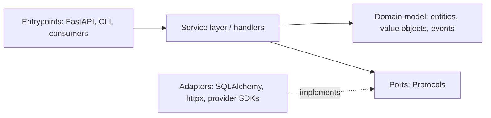

# Architecture patterns in Python (repository, UoW, message bus)

!!! abstract "At a glance"
    **Priority:** P0 · **Complexity:** 3/5 · **Est. time:** 4 h · **Phase:** 2 · **Prereqs:** [Advanced typing](typing-advanced.md), [Testing](testing-pytest.md), [Hexagonal & clean](../architecture/hexagonal-clean.md)
    **You're done when:** you can structure a Python service into domain / service layer / adapters with ports as Protocols, implement Repository + Unit of Work + an in-process message bus, and say when this is over-engineering.

## Why it matters

Python invites scripts that grow into 50k-line balls of mud: FastAPI handlers containing SQL, LLM calls and business rules. The patterns from *Architecture Patterns with Python* (Percival and Gregory, free at cosmicpython.com) give you testability (fast tests with fakes), replaceable infrastructure (pgvector to Qdrant, provider A to B) and clear transaction boundaries. In agent systems the same shape shows up as: **domain** (state machine, policies), **ports** (`ChatModel`, `VectorStore`, `ToolExecutor`), **adapters** (provider SDKs), **message bus** (events/commands between agent steps). Staff interviews want you to defend the pattern's cost, not recite it.

## Core concepts

### Layers and dependency direction



Dependencies point **inward**. Domain imports nothing from frameworks. Adapters import the domain (to map data), never the reverse. Enforce with `import-linter` contracts in CI.

### Domain model: plain, typed, behaviour-rich

```python
from dataclasses import dataclass, field
from datetime import datetime

@dataclass(frozen=True, slots=True)
class Money:
    cents: int
    currency: str

@dataclass
class Booking:
    ref: str
    price: Money
    status: str = "pending"
    events: list[object] = field(default_factory=list, repr=False)

    def confirm(self, now: datetime) -> None:
        if self.status != "pending":
            raise ValueError(f"cannot confirm booking in status {self.status}")
        self.status = "confirmed"
        self.events.append(BookingConfirmed(self.ref, now))

@dataclass(frozen=True)
class BookingConfirmed:
    ref: str
    at: datetime
```

Invariants live here. Validation of external input (Pydantic) happens at the edge, and the domain trusts what it's given ([Pydantic](pydantic-v2.md)).

### Repository (a collection-like port)

```python
from typing import Protocol

class BookingRepo(Protocol):
    async def get(self, ref: str) -> Booking | None: ...
    async def add(self, b: Booking) -> None: ...

class FakeBookingRepo:
    def __init__(self) -> None: self._d: dict[str, Booking] = {}
    async def get(self, ref): return self._d.get(ref)
    async def add(self, b): self._d[b.ref] = b
```

The fake is the point: service-layer tests run in microseconds with no DB. The SQLAlchemy adapter uses imperative or declarative mapping onto the same domain class (classical mapping keeps ORM out of the domain).

### Unit of Work (transaction boundary as a context manager)

```python
from typing import Protocol, Self

class UnitOfWork(Protocol):
    bookings: BookingRepo
    async def __aenter__(self) -> Self: ...
    async def __aexit__(self, *exc) -> None: ...
    async def commit(self) -> None: ...
    async def rollback(self) -> None: ...

class SqlUnitOfWork:
    def __init__(self, session_factory) -> None: self._sf = session_factory
    async def __aenter__(self) -> Self:
        self.session = self._sf()
        self.bookings = SqlBookingRepo(self.session)
        return self
    async def __aexit__(self, *exc) -> None:
        await self.rollback()                    # default: rollback anything uncommitted
        await self.session.close()
    async def commit(self) -> None: await self.session.commit()
    async def rollback(self) -> None: await self.session.rollback()
```

Service function:

```python
async def confirm_booking(cmd: ConfirmBooking, uow: UnitOfWork, now=datetime.utcnow) -> None:
    async with uow:
        b = await uow.bookings.get(cmd.ref)
        if b is None:
            raise BookingNotFound(cmd.ref)
        b.confirm(now())
        await uow.commit()
```

### Message bus and domain events

Handlers are registered per message type. The bus collects events from aggregates after commit and dispatches them.

```python
from collections.abc import Awaitable, Callable

Handler = Callable[[object, UnitOfWork], Awaitable[None]]

class MessageBus:
    def __init__(self, uow_factory: Callable[[], UnitOfWork], handlers: dict[type, list[Handler]]) -> None:
        self.uow_factory, self.handlers = uow_factory, handlers

    async def handle(self, message: object) -> None:
        queue = [message]
        while queue:
            m = queue.pop(0)
            for h in self.handlers[type(m)]:
                uow = self.uow_factory()
                await h(m, uow)
                queue.extend(collect_events(uow))     # events raised by aggregates seen by this uow
```

Commands (imperative, one handler, may fail the request) vs events (facts, many handlers, failures isolated and retried). External side effects (email, Kafka) from events should go through an **outbox** ([sagas & outbox](../architecture/sagas-outbox.md)) for at-least-once delivery.

### Dependency injection in Python

No container required. Use a bootstrap function that builds the bus with adapters and injects them into handlers via closures/`functools.partial`, and FastAPI `Depends` at the edge. Frameworks (`dependency-injector`, `lagom`) add ceremony. Composition root = `bootstrap.py`, the only place that imports concrete adapters.

### Applying it to AI systems

| Concept | Agent-system mapping |
|---|---|
| Domain | Conversation/Run aggregate, policies (max steps, budget, allowed tools), guardrail decisions |
| Ports | `ChatModel`, `VectorStore`, `ToolExecutor`, `Clock`, `RunStore` |
| Adapters | OpenAI/Anthropic/Azure Foundry clients, pgvector/Qdrant, MCP client |
| Commands | `StartRun`, `SubmitToolResult`, `CancelRun` |
| Events | `StepCompleted`, `ToolCallRequested`, `BudgetExceeded` (drive tracing, billing, UI updates) |
| UoW | persist run state and events atomically (checkpointing), enabling resume ([durable execution](../agentic-ai/durable-execution-hitl.md)) |

### When it is over-engineering

- CRUD apps with no domain logic: use FastAPI plus SQLAlchemy plus Pydantic directly. Add a service layer only when logic appears twice.
- Small scripts and notebooks.
- Rule of thumb: introduce ports where you have **two implementations in practice** (real + fake counts) and a reason to change them. Start with a service layer and one UoW, and add the bus when handlers multiply or need async decoupling.
- Cost: more files, mapping code, indirection. Benefit: fast tests, swappable infra, explicit transactions.

### Senior nuance

- **Aggregate = consistency boundary.** One aggregate per transaction, and cross-aggregate consistency via events (eventual). Version column for optimistic locking (`version_id_col` in SQLAlchemy) to handle concurrent updates.
- Don't leak ORM objects out of the UoW (lazy-load errors after session close). Map to domain objects or DTOs.
- Async SQLAlchemy: `expire_on_commit=False`, avoid implicit lazy loads (raise `MissingGreenlet`), one session per UoW.
- Event dispatch after commit vs before: after commit risks losing events on a crash (use outbox), before commit risks publishing events for rolled-back state.
- Read side: for queries, bypass the repository and use direct SQL/views (CQRS-lite, [CQRS](../architecture/cqrs-event-sourcing.md)). Repositories are for aggregates, not reporting.
- Layer enforcement: `import-linter` (contract: domain must not import adapters) plus ruff's `TID` rules.

## Resources

| Resource | Type | Why this one | Level | Cost |
|---|---|---|---|---|
| [Cosmic Python (Architecture Patterns with Python)](https://www.cosmicpython.com/) | book | Free online, the canonical Python treatment | intermediate | free |
| [Ch. 2: Repository](https://www.cosmicpython.com/book/chapter_02_repository) | book | Ports and fakes | intermediate | free |
| [Ch. 6: Unit of Work](https://www.cosmicpython.com/book/chapter_06_uow) | book | Transaction boundary as context manager | intermediate | free |
| [Ch. 9: Message bus](https://www.cosmicpython.com/book/chapter_09_all_messagebus) | book | Events and handlers | advanced | free |
| [Ch. 13: Dependency injection and bootstrapping](https://www.cosmicpython.com/book/chapter_13_dependency_injection) | book | Composition root | advanced | free |
| [cosmicpython/code](https://github.com/cosmicpython/code) :gem: | repo | Branches per chapter, so you can diff each step | intermediate | free |
| [Typing docs: Protocols](https://typing.python.org/en/latest/reference/protocols.html) | docs | Ports without inheritance | intermediate | free |
| [SQLAlchemy asyncio](https://docs.sqlalchemy.org/en/20/orm/extensions/asyncio.html) | docs | Correct async sessions, lazy-load pitfalls | intermediate | free |
| [Hynek: Subclassing in Python Redux](https://hynek.me/articles/python-subclassing-redux/) :gem: | article | Composition over inheritance, aligned with ports | advanced | free |

## Hands-on lab

**Goal (2 h):** restructure the lab gateway/agent skeleton into layers.

1. Create packages: `domain/`, `service/`, `adapters/`, `entrypoints/`, `bootstrap.py`.
2. Model `Run` aggregate (status, steps, token budget) with methods `start_step()`, `record_usage(n)` raising `BudgetExceeded`, and emitting `StepCompleted` events.
3. Ports: `RunRepo`, `ChatModel` (Protocol). Fakes: in-memory repo, `ScriptedModel` ([testing](testing-pytest.md)).
4. Service handler `handle_user_message(cmd, uow, model)`: loads run, calls model, records usage, commits.
5. Tests with fakes only. **Expected:** the whole service-layer suite runs in < 100 ms and covers budget exceeded, cancellation and model failure paths.
6. SQL adapter with SQLAlchemy async + Postgres testcontainer: contract tests run against **both** fake and SQL repos (parametrised fixture).
7. `import-linter` contract: `domain` may not import `adapters`/`fastapi`/`sqlalchemy`. Introduce a violation and confirm CI fails.
8. Stretch: add the message bus, and an `EventLogger` handler for `StepCompleted` writing to an outbox table in the same UoW commit.

## Questions

### L1 - Recall

??? question "Q1. What problem does the Repository pattern solve, and what is its test benefit?"
    ??? success "Answer"
        It abstracts persistence behind a collection-like interface (`get/add`) so domain and service code don't depend on the database. The benefit is in-memory fakes, so service-layer tests run fast and deterministically without DB setup.

??? question "Q2. What does a Unit of Work guarantee?"
    ??? success "Answer"
        A single atomic transaction boundary: all repository changes within the context commit together or roll back together, with a clear commit point. It also owns the session/connection lifecycle and typically rolls back by default on exit unless committed.

??? question "Q3. Commands vs events?"
    ??? success "Answer"
        A command is an imperative request to do something (single handler, may fail and report back to the caller). An event is a fact that something happened (zero or many handlers, decoupled, failures shouldn't fail the original operation and are typically retried).

??? question "Q4. Why are Protocols a good fit for ports in Python?"
    ??? success "Answer"
        Structural typing means adapters and test fakes need not inherit from a base class or import the domain package's ABC, which keeps dependency direction clean and lets third-party clients be wrapped and checked statically. Pair with contract tests, since Protocols don't check behaviour.

### L2 - Apply

??? question "Q5. Spot the architecture bug."
    ```python
    # domain/booking.py
    from sqlalchemy.orm import Session
    class Booking:
        def confirm(self, session: Session): ...
    ```
    ??? success "Answer"
        The domain depends on infrastructure (SQLAlchemy), inverting the dependency rule: domain tests need a DB/session, and swapping persistence forces domain changes. Fix: domain methods take/return plain values, and the service layer coordinates the UoW/repository. Enforce with an `import-linter` contract.

??? question "Q6. A handler does `async with uow: b = await uow.bookings.get(ref); b.confirm(); return b` and the caller gets `DetachedInstanceError`/lazy-load errors. Why and fix?"
    ??? success "Answer"
        The ORM object escaped the session (UoW closed on exit), and touching an unloaded attribute later fails. Fix: return a DTO/domain value or primitive result from inside the UoW, eager-load needed relations, set `expire_on_commit=False` for async, and don't expose ORM instances outside the adapter. Mapping at the adapter boundary avoids the entire class of bugs.

??? question "Q7. Domain events are published inside the transaction before commit, and downstream systems see events for bookings that later roll back. Fix?"
    ??? success "Answer"
        Publishing must be atomic with the state change. Use the transactional outbox: write events to an outbox table in the same transaction, and a relay publishes them after commit (at-least-once), with consumers idempotent by event ID. Alternatively dispatch in-process handlers after commit for non-critical, local side effects.

??? question "Q8. How do you test that the SQL repository and the in-memory fake behave identically?"
    ??? success "Answer"
        Write a contract test suite parametrised over both implementations (pytest fixture with `params=["fake", "sql"]`) covering get/add/not-found/duplicate/ordering semantics. The SQL variant runs against a real Postgres container. Divergences discovered here are bugs in the fake or in your assumptions.

### L3 - Design & trade-offs

??? question "Q9. Full hexagonal/DDD layering vs 'FastAPI + SQLAlchemy directly' for a new internal tool with 4 endpoints and little logic."
    ??? success "Answer"
        For CRUD with minimal rules, layering costs more (mapping, files, indirection) than it returns. Start simple: routers + Pydantic + SQLAlchemy, with logic in plain functions that take a session (still testable with a test DB). Introduce ports when: business rules accumulate, multiple entrypoints (API + consumer + CLI) share logic, infra must be swapped or faked for speed, or teams need clear ownership seams. Design so the migration is cheap (keep logic out of route handlers from day one).

??? question "Q10. In-process message bus vs Kafka/queue for domain events between agent steps."
    ??? success "Answer"
        In-process bus: simple, transactional with the UoW, low latency, but events die with the process and can't scale across services. Broker: durability, cross-service fan-out, replay, but adds operational cost, ordering/idempotency concerns and eventual consistency. Use the in-process bus inside a service boundary for decoupling handlers, plus outbox to a broker for cross-service events. Don't put a broker between two functions in the same service.

??? question "Q11. Where do LLM calls belong in this architecture: domain, service layer or adapter, and how do you test prompt logic?"
    ??? success "Answer"
        The model client is an adapter behind a port (`ChatModel`). Prompt *assembly* and output *interpretation* (pure functions) live in the service or domain layer, unit-tested with table/snapshot tests. Policies (budgets, allowed tools, step limits) are domain rules. Orchestration calling the port lives in the service layer and is tested with scripted fakes. Behavioural quality is covered by evals, not unit tests. This keeps provider swaps ([model routing](../agentic-ai/model-routing-gateways.md)) contained to adapters.

### L4 - Staff-level ambiguity

??? question "Q12. Three teams have three different service structures; leadership wants 'consistent architecture' without a big-bang rewrite. Plan?"
    ??? success "Answer"
        Don't mandate a diagram, mandate **properties**: domain free of framework imports, explicit transaction boundaries, ports for external systems, contract tests, and layer checks in CI. Provide a reference implementation and template ([tooling](modern-tooling.md)), and enforce properties with `import-linter` in warn mode, then error mode per repo. Migrate opportunistically (strangler: new features in the new structure, extract logic from handlers when touching it). Measure: test suite speed, % logic covered without DB, change lead time, and defects from wrong-transaction bugs. Allow documented exceptions for CRUD services (ADR).

??? question "Q13. You inherit an agent platform where the orchestrator, provider SDK calls and DB writes are interleaved in one 3,000-line module. Sequence your refactor."
    ??? success "Answer"
        1) Characterisation tests first (record/replay real runs, snapshot state transitions). 2) Extract ports at the seams that hurt most (`ChatModel`, `RunStore`) with adapters wrapping existing code (no behaviour change). 3) Pull pure logic (prompt assembly, parsing, policies) into the domain with unit tests. 4) Introduce UoW around run-state persistence to fix partial-write bugs. 5) Only then consider the event bus/outbox. Ship each step behind the existing interface, measure regression rate, and stop when the pain (test time, incident class) is gone. Communicate the "why" with a before/after test-suite runtime and incident data.

## Real-world use cases

- **Booking/quoting engine:** aggregates + UoW guarantee atomic confirm/price updates. Fakes enabled 800 domain tests in 2 s.
- **Agent run store:** UoW writes step results and events together, so a crashed worker resumes from the last committed step.
- **Multi-provider LLM layer:** `ChatModel` port with OpenAI, Anthropic and local vLLM adapters, chosen at bootstrap per tenant.
- **Ingestion service:** message bus routes `DocumentUploaded` to parse, embed and index handlers with per-handler retries.

## Pitfalls & anti-patterns

- Anemic domain plus fat services or handlers.
- Repository per table rather than per aggregate.
- Leaking ORM objects/sessions out of the UoW.
- Ports with no second implementation (speculative abstraction).
- Business logic in FastAPI handlers or Pydantic validators of transport models.
- Publishing events before commit without an outbox.
- Global session/engine singletons accessed from domain code.
- Re-implementing DI containers that add more complexity than the problem.

## Checklist

- [ ] I can explain dependency direction and where each concern lives without notes
- [ ] I implemented Repository + UoW with fake and SQL implementations and a shared contract test
- [ ] I enforced a layer contract with import-linter
- [ ] I answered all L3 questions out loud in < 3 min each
