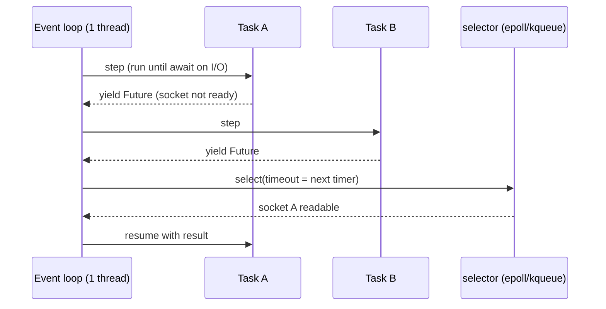

# asyncio in depth: TaskGroups, cancellation, backpressure

!!! abstract "At a glance"
    **Priority:** P0 · **Complexity:** 4/5 · **Est. time:** 5 h · **Phase:** 1 · **Prereqs:** [Generators & context managers](generators-context-managers.md), [Advanced typing](typing-advanced.md)
    **You're done when:** you can build a bounded, cancellable, timeout-aware fan-out to an LLM API that never leaks tasks, never blocks the loop, applies backpressure end-to-end, and you can explain exactly what happens on cancellation at every `await`.

## Why it matters

LLM applications are **I/O-bound fan-out machines**: a single agent turn may call a model, 5 tools, a vector DB and a reranker, with 1–30 s latencies and strict provider rate limits. asyncio is how Python services (FastAPI, Pydantic AI, LangGraph, the OpenAI/Anthropic async SDKs, MCP servers) do this efficiently. Most production incidents in Python AI services are asyncio incidents in disguise: a blocking call freezing the loop, unbounded `gather` overwhelming a provider (429 storms), orphaned tasks after client disconnect burning tokens, swallowed `CancelledError` making shutdown hang. Staff interviews probe structured concurrency, cancellation semantics and backpressure.

## Core concepts

### The execution model in one diagram



- One thread runs callbacks. A coroutine runs until it `await`s something not ready, and **only yields at `await`** (and `async for`/`async with` boundaries that actually suspend).
- Any CPU work or blocking syscall between awaits blocks *every* task. The debug-mode default warns on callbacks slower than 100 ms (`loop.slow_callback_duration`).
- `await coro()` does **not** create concurrency. `create_task` / `TaskGroup.create_task` does.

### Structured concurrency with TaskGroup (3.11+)

```python
import asyncio

async def fetch_all(urls: list[str]) -> list[bytes]:
    async with asyncio.TaskGroup() as tg:
        tasks = [tg.create_task(fetch(u)) for u in urls]
    # leaving the block = all tasks finished (or everything was cancelled on first error)
    return [t.result() for t in tasks]
```

Guarantees: no task outlives the block. On the first failure, siblings are **cancelled**, the group waits for them, and raises an `ExceptionGroup` (catch with `except*`). Compare:

| | `gather()` | `gather(return_exceptions=True)` | `TaskGroup` |
|---|---|---|---|
| First error | propagates, **others keep running** (orphans) | collected as values | siblings cancelled, `ExceptionGroup` |
| Cancellation of parent | cancels children | cancels children | cancels children |
| Leak risk | high | medium | none (structural) |
| Use when | legacy | "best effort, partial results OK" | default for new code |

For "partial results OK" semantics (e.g. querying 5 retrievers, use whatever returns), wrap each child so it can't raise: catch, log and return `None` inside the child, and keep the TaskGroup for lifetime management.

### Timeouts

```python
async with asyncio.timeout(10):          # 3.11+, raises builtin TimeoutError
    reply = await client.complete(prompt)

async with asyncio.timeout(None) as cm:  # reschedulable deadline
    cm.reschedule(asyncio.get_running_loop().time() + budget)
```

- `asyncio.timeout` cancels the inner task, then converts the `CancelledError` to `TimeoutError` at the boundary. `asyncio.wait_for` is implemented on top of it since 3.12.
- Use **deadlines, not per-call timeouts**, for agent turns: a 30 s budget for the whole turn, with each step using the remaining budget. Otherwise 5 sequential steps × 10 s = 50 s worst case.
- The SDK/httpx timeouts (connect/read/write/pool) are complementary. `read` timeout doesn't cap total time for a *streaming* response that trickles tokens, only `asyncio.timeout` does.

### Cancellation semantics (where seniors are separated)

- `task.cancel()` schedules a `CancelledError` to be thrown **into the coroutine at its current await**. Code between awaits is never interrupted.
- `CancelledError` is a `BaseException` (since 3.8), so `except Exception` doesn't catch it. **Never swallow it.** If you catch it for cleanup, re-raise.
- `task.cancelling()` / `task.uncancel()` (3.11) count pending cancel requests. TaskGroup and `timeout()` rely on this to tell "my timeout fired" apart from "someone cancelled me".
- Cleanup in `finally` that awaits can itself be cancelled on a second cancel. Use `asyncio.shield()` sparingly for must-complete work (e.g. writing an audit record), and give it its own timeout.
- Async generators: if the consumer stops early, the generator's `finally` runs only when it's closed. Use `contextlib.aclosing()` around streaming iterators to close HTTP streams deterministically.

```python
# Wrong: swallows cancellation, shutdown hangs, TaskGroup semantics break
try:
    await stream_tokens()
except asyncio.CancelledError:
    log.info("cancelled")          # and then... returns normally

# Right
try:
    await stream_tokens()
except asyncio.CancelledError:
    log.info("cancelled; closing upstream stream")
    raise
```

### Backpressure: bounded everything

Unbounded concurrency is the most common production failure. Armin Ronacher's "I'm not feeling the async pressure" is the canonical explanation. Tools:

| Tool | Bounds | Typical use |
|---|---|---|
| `asyncio.Semaphore(n)` | in-flight operations | max concurrent LLM calls per provider/key |
| `asyncio.Queue(maxsize=n)` | buffered items, `put` blocks when full | producer/consumer pipelines (ingest → embed → upsert) |
| `Queue.shutdown()` (3.13) | graceful drain/stop | ending worker pools without sentinels |
| httpx `Limits(max_connections=...)` | sockets per client | connection-pool sizing |
| token bucket (custom or `aiolimiter`) | rate over time | RPM/TPM provider limits |
| server-level (uvicorn `--limit-concurrency`, LB) | inbound | load shedding with 503 instead of queueing forever |

```python
import asyncio, random

class TokenBucket:
    """Simple async token bucket for requests-per-second limits."""
    def __init__(self, rate: float, burst: int) -> None:
        self.rate, self.capacity, self.tokens = rate, burst, float(burst)
        self.updated = asyncio.get_running_loop().time()
        self.lock = asyncio.Lock()

    async def acquire(self) -> None:
        async with self.lock:
            while True:
                now = asyncio.get_running_loop().time()
                self.tokens = min(self.capacity, self.tokens + (now - self.updated) * self.rate)
                self.updated = now
                if self.tokens >= 1:
                    self.tokens -= 1
                    return
                await asyncio.sleep((1 - self.tokens) / self.rate)
```

### Production fan-out to an LLM API

```python
import asyncio, random
import httpx

class LLMClient:
    def __init__(self, base_url: str, api_key: str, max_concurrency: int = 16) -> None:
        self._http = httpx.AsyncClient(
            base_url=base_url,
            headers={"Authorization": f"Bearer {api_key}"},
            timeout=httpx.Timeout(connect=5, read=60, write=10, pool=5),
            limits=httpx.Limits(max_connections=max_concurrency, max_keepalive_connections=max_concurrency),
        )
        self._sem = asyncio.Semaphore(max_concurrency)

    async def complete(self, prompt: str, *, attempts: int = 4) -> str:
        async with self._sem:                                   # bound in-flight calls
            for i in range(attempts):
                r = await self._http.post("/v1/chat/completions", json={"messages": [{"role": "user", "content": prompt}]})
                if r.status_code in (429, 500, 502, 503, 504) and i < attempts - 1:
                    retry_after = float(r.headers.get("retry-after", 0)) or 0.5 * 2**i
                    await asyncio.sleep(retry_after * random.uniform(0.8, 1.2))   # jittered backoff
                    continue
                r.raise_for_status()
                return r.json()["choices"][0]["message"]["content"]
        raise AssertionError("unreachable")

    async def aclose(self) -> None:
        await self._http.aclose()

async def summarise_all(client: LLMClient, docs: list[str], turn_budget_s: float = 45) -> list[str | None]:
    async def one(d: str) -> str | None:
        try:
            return await client.complete(f"Summarise:\n{d}")
        except (httpx.HTTPError, TimeoutError):
            return None                                          # partial results are acceptable here
    async with asyncio.timeout(turn_budget_s):                   # global deadline
        async with asyncio.TaskGroup() as tg:
            tasks = [tg.create_task(one(d)) for d in docs]
    return [t.result() for t in tasks]
```

Note the semaphore sits *inside* the client, so every caller shares one provider budget. Holding the semaphore during backoff sleeps is deliberate: it slows everyone when the provider says 429.

### Streaming tokens to clients

```python
from contextlib import aclosing
from collections.abc import AsyncIterator

async def relay(upstream: AsyncIterator[str]) -> AsyncIterator[str]:
    async with aclosing(upstream) as stream:
        async for token in stream:
            yield f"data: {token}\n\n"     # SSE framing
```

When the HTTP client disconnects, Starlette cancels the response task. With `aclosing`, the upstream provider stream closes, so you stop paying for tokens nobody reads.

### Blocking code

- `await asyncio.to_thread(fn, *args)` for blocking I/O libs (boto3, some DB drivers, PDF parsing). It uses the default executor, so size it (`loop.set_default_executor(ThreadPoolExecutor(max_workers=...))`).
- CPU-bound work (tokenisation of huge docs, embeddings on CPU): `ProcessPoolExecutor`, or free-threaded 3.14t with threads ([concurrency models](concurrency-models.md)).
- Detect blocking: `PYTHONASYNCIODEBUG=1` / `asyncio.run(main(), debug=True)` logs slow callbacks. The ruff `ASYNC` rules catch it statically.

### Version notes (as of Sept 2026)

| Version | Addition |
|---|---|
| 3.11 | `TaskGroup`, `timeout()`, `ExceptionGroup`/`except*`, `Runner`, `Task.cancelling/uncancel` |
| 3.12 | eager task factory (`asyncio.eager_task_factory`), `wait_for` built on `timeout` |
| 3.13 | `Queue.shutdown()`, `as_completed()` usable as async iterator, improved simultaneous cancellation in TaskGroup |
| 3.14 | `python -m asyncio ps PID` / `pstree PID` (inspect live task trees), `asyncio.capture_call_graph()` / `print_call_graph()`, free-threaded-safe asyncio internals |

### Senior nuance

- **Keep references** to fire-and-forget tasks (`background.add(t); t.add_done_callback(background.discard)`). The loop holds only weak references, so un-referenced tasks can be garbage-collected mid-flight. Better: own them in a TaskGroup in the app lifespan.
- One `httpx.AsyncClient` per upstream per process, created in lifespan. A client per request destroys connection reuse (TLS handshake per call, +50–150 ms).
- `contextvars` propagate into tasks (copied at creation), which is how request IDs and OTel spans flow. Threads started via `to_thread` also copy context.
- Eager tasks (3.12) run synchronously until their first real suspension, which gives big wins for cache-hit paths, but they change ordering assumptions.
- AnyIO (used by Starlette/FastAPI) offers level-triggered cancel scopes on top of asyncio. Know that FastAPI's internals are AnyIO when you debug cancellation.
- uvloop gives roughly 2–4x on raw loop overhead, which rarely matters when each await is a 2 s LLM call. Measure first.

## Resources

| Resource | Type | Why this one | Level | Cost |
|---|---|---|---|---|
| [asyncio: Coroutines and Tasks (TaskGroup, timeouts)](https://docs.python.org/3/library/asyncio-task.html) | docs | Canonical semantics incl. cancellation notes | advanced | free |
| [Developing with asyncio](https://docs.python.org/3/library/asyncio-dev.html) | docs | Debug mode, blocking detection, never-awaited warnings | intermediate | free |
| [Nathaniel J. Smith: Notes on structured concurrency](https://vorpus.org/blog/notes-on-structured-concurrency-or-go-statement-considered-harmful/) :gem: | article | The essay that led to TaskGroup | advanced | free |
| [Nathaniel J. Smith: Timeouts and cancellation for humans](https://vorpus.org/blog/timeouts-and-cancellation-for-humans/) :gem: | article | Deadlines and cancel scopes, the right mental model | advanced | free |
| [Armin Ronacher: I'm not feeling the async pressure](https://lucumr.pocoo.org/2020/1/1/async-pressure/) :gem: | article | Backpressure explained, still the best | advanced | free |
| [Hynek: Waiting in asyncio](https://hynek.me/articles/waiting-in-asyncio/) :gem: | article | gather vs wait vs TaskGroup vs as_completed decision guide | intermediate | free |
| [Python behind the scenes #12: how async/await works](https://tenthousandmeters.com/blog/python-behind-the-scenes-12-how-asyncawait-works-in-python/) :gem: | article | From generators to the event loop internals | advanced | free |
| [Python Concurrency with asyncio (Matthew Fowler)](https://www.manning.com/books/python-concurrency-with-asyncio) | book | Most thorough book-length treatment | intermediate | paid |
| [David Beazley: Python Concurrency From the Ground Up (PyCon 2015)](https://www.youtube.com/watch?v=MCs5OvhV9S4) :gem: | video | Live-codes an event loop, which makes the model click | advanced | free |
| [AnyIO docs](https://anyio.readthedocs.io/en/stable/) | docs | Cancel scopes, what Starlette uses underneath | advanced | free |

## Hands-on lab

**Goal (90–120 min):** a bounded, deadline-aware summariser (capstone ingestion path).

1. Save and run this simulation (no API key needed):
    ```python
    import asyncio, random, time

    async def fake_llm(i: int) -> str:
        await asyncio.sleep(random.uniform(0.05, 0.3))
        if i % 17 == 0:
            await asyncio.sleep(5)          # pathological slow call
        return f"summary-{i}"

    async def call_with_budget(sem: asyncio.Semaphore, i: int, timeout_s: float) -> str | None:
        async with sem:
            try:
                async with asyncio.timeout(timeout_s):
                    return await fake_llm(i)
            except TimeoutError:
                return None

    async def main(n: int = 100, concurrency: int = 10) -> None:
        random.seed(7)
        sem = asyncio.Semaphore(concurrency)
        t0 = time.perf_counter()
        async with asyncio.TaskGroup() as tg:
            tasks = [tg.create_task(call_with_budget(sem, i, 1.0)) for i in range(n)]
        results = [t.result() for t in tasks]
        ok = sum(r is not None for r in results)
        print(f"ok={ok} timed_out={n-ok} elapsed={time.perf_counter()-t0:.1f}s")

    asyncio.run(main())
    ```
    **Expected:** `ok=94 timed_out=6 elapsed≈2.5–3.0s` (the 6 are i = 0, 17, 34, 51, 68, 85).
2. Remove the per-call timeout. Elapsed jumps to about 7 s, dominated by the slow calls holding semaphore slots.
3. Replace with a *global* `asyncio.timeout(2.0)` around the TaskGroup. Observe that everything unfinished is cancelled and `TimeoutError` is raised. Refactor so completed results are still returned (collect results in a dict as they finish).
4. Build a pipeline `producer → Queue(maxsize=20) → 5 embed workers → Queue(maxsize=20) → 1 upsert worker` using `Queue.shutdown()` for termination. Print queue sizes every 0.5 s and show the producer blocks when the embed stage is slow (backpressure working).
5. Add `time.sleep(0.5)` inside one worker, run with `debug=True`, and find the "Executing … took 0.5 seconds" warning. Fix with `asyncio.to_thread`.
6. While the pipeline runs, in another terminal: `python -m asyncio pstree <PID>` (3.14) and read the task tree.

## Questions

### L1 — Recall

??? question "Q1. What does this print?"
    ```python
    async def ok(n):
        await asyncio.sleep(0.2); print("ok", n); return n
    async def boom():
        await asyncio.sleep(0.05); raise ValueError("bad")
    async def main():
        try:
            async with asyncio.TaskGroup() as tg:
                tg.create_task(ok(1)); tg.create_task(boom())
        except* ValueError as eg:
            print("caught", eg.exceptions)
    asyncio.run(main())
    ```
    ??? success "Answer"
        `caught (ValueError('bad'),)` only. `boom` fails at 50 ms, the TaskGroup cancels `ok(1)` before it prints, waits for it, then raises an `ExceptionGroup` containing the ValueError.

??? question "Q2. Same tasks with `await asyncio.gather(ok(2), boom())` inside try/except ValueError, followed by `await asyncio.sleep(0.3)`. Output?"
    ??? success "Answer"
        `gather raised bad` then `ok 2`. `gather` propagates the first exception immediately but **does not cancel** the other awaitables, so `ok(2)` keeps running as an orphan and prints later. This is the leak TaskGroup fixes.

??? question "Q3. Why is `CancelledError` a `BaseException`, and what's the rule for catching it?"
    ??? success "Answer"
        So generic `except Exception:` handlers don't accidentally swallow cancellation (changed in 3.8). Rule: catch it only to clean up, then re-raise. Swallowing it breaks TaskGroup/timeout semantics and makes shutdowns hang.

??? question "Q4. What happens to a task created with `asyncio.create_task(coro())` whose return value you don't store?"
    ??? success "Answer"
        The event loop keeps only a weak reference, so the task can be garbage-collected before it finishes (silently disappearing, sometimes with "Task was destroyed but it is pending!"). Keep a strong reference (a set plus a done-callback discard) or, better, run it in a TaskGroup owned by the app lifespan.

### L2 — Apply

??? question "Q5. What does this print, and what is the bug?"
    ```python
    async def stubborn():
        try:
            await asyncio.sleep(10)
        except asyncio.CancelledError:
            print("swallowed")
        return "done"
    async def main():
        t = asyncio.create_task(stubborn()); await asyncio.sleep(0)
        t.cancel(); print(await t)
    ```
    ??? success "Answer"
        `swallowed` then `done`. The cancellation was swallowed, so the task completed normally, and the caller believes it was cancelled but got a result. Inside a TaskGroup or `timeout()`, this breaks timeouts (the timeout can't fire correctly). Fix: re-raise after logging/cleanup.

??? question "Q6. A heartbeat task prints `tick 0.0`, `tick 0.5`, `tick 0.6` instead of every 0.1 s when run alongside another coroutine. What's happening?"
    ```python
    async def blocker(): time.sleep(0.5)
    await asyncio.gather(tick(), blocker())
    ```
    ??? success "Answer"
        `time.sleep` blocks the single event-loop thread for 0.5 s, so no other task runs. Fix: `await asyncio.sleep(0.5)` if it's a delay, or `await asyncio.to_thread(blocking_fn)` for real blocking I/O. The ruff rule ASYNC251 catches it statically, and debug mode reports it at runtime.

??? question "Q7. You must call an LLM for 5,000 documents with a provider limit of 50 concurrent requests and 500 RPM. Sketch the code."
    ??? success "Answer"
        One shared `httpx.AsyncClient` (limits = 50 connections), a `Semaphore(50)` for concurrency, and a token bucket at 500/60 ≈ 8.3 req/s with a small burst for rate. Wrap the whole batch in a TaskGroup (or chunks of about 500 tasks to limit memory), use per-call timeouts plus jittered retry honouring `Retry-After` on 429, and have children return `None` or an error record instead of raising, so one bad doc doesn't cancel the batch. Persist progress for resumability. At 500 RPM, 5,000 docs take at least 10 min regardless of concurrency. Say so.

??? question "Q8. Client disconnects mid-stream from your SSE endpoint, but provider token usage shows the full completion was generated. Why and fix?"
    ??? success "Answer"
        Your upstream stream wasn't closed: either the generator was not closed on cancellation, or you consumed the provider stream in a separate task that kept running. Fix: iterate upstream inside the response generator wrapped in `contextlib.aclosing()` (or `async with client.stream(...)`) so cancellation propagates and closes the HTTP stream. Don't spawn detached tasks for the upstream. Verify with a test that disconnects after 3 tokens and asserts the upstream mock saw `aclose()`.

### L3 — Design & trade-offs

??? question "Q9. `gather(return_exceptions=True)` vs TaskGroup with non-raising children vs `as_completed` for a RAG step querying 4 retrievers."
    ??? success "Answer"
        `gather(return_exceptions=True)`: simple, but exceptions become values you must type-check, and cancellation of the parent still works. TaskGroup plus children that catch and return `None`: structural lifetime guarantees and explicit per-child policy. The best default. `as_completed` (async iterator in 3.13): process results as they arrive, e.g. start reranking early or return first-k results by a deadline. Combine: TaskGroup for lifetime, per-child timeouts, and a global deadline. If a retriever is non-critical, its failure yields an empty list. If it's critical, let it raise and cancel the rest.

??? question "Q10. Where should the concurrency limit for LLM calls live: per request, per process, or global?"
    ??? success "Answer"
        Per-request limits don't protect the provider (100 concurrent requests × 5 = 500 calls). Per-process semaphores are easy, but the effective global limit becomes workers × pods × limit and drifts with autoscaling. Global limits (Redis token bucket, or an LLM gateway such as LiteLLM/Envoy AI gateway) actually match provider quotas but add a hop and a dependency. Pragmatic: per-process semaphore sized = global quota / expected replicas, plus 429-aware backoff, plus a central gateway for multi-service orgs ([model routing & gateways](../agentic-ai/model-routing-gateways.md)).

??? question "Q11. Deadline propagation across an agent turn with nested tool calls — design it."
    ??? success "Answer"
        Create one deadline at the entry (request timeout minus a safety margin) and store it in a `contextvar`. Each step computes `remaining = deadline - loop.time()` and uses `asyncio.timeout_at(deadline)` (or skips optional steps if remaining < p50 of that step). Pass the remaining budget to downstream HTTP services via a header (gRPC-style deadline propagation), so they can shed work. On expiry, return a partial answer with a clear status instead of a 504. This avoids the "sum of per-call timeouts" problem and keeps p99 bounded.

### L4 — Staff-level ambiguity

??? question "Q12. Your org's Python services have recurring 'event loop blocked' incidents from teams calling sync SDKs in async handlers. What's your org-level fix?"
    ??? success "Answer"
        Prevention: enable ruff `ASYNC` rules in the golden-path template, gated in CI. Detection: a loop-lag metric (a periodic task measuring scheduling delay, exported as a histogram) with alerts at p99 > 100 ms, plus debug-mode in staging. Enablement: a shared `async_adapters` package wrapping common sync SDKs with `to_thread` and sized executors, a doc on "sync def endpoints are fine in FastAPI" (they run in the threadpool), and a lint that flags `async def` endpoints without any await. Measure incident count and loop-lag p99 per service quarterly.

??? question "Q13. Leadership asks: 'Should we rewrite our asyncio agent platform in Go/Java virtual threads for performance?' How do you answer?"
    ??? success "Answer"
        Reframe to bottlenecks. Agent latency is dominated by model and tool I/O (seconds). asyncio overhead per await is microseconds, and a single process handles thousands of concurrent LLM calls. Real problems are usually blocking calls, missing backpressure, or CPU work (JSON, tokenisation) in the loop, all fixable in Python (to_thread, process pools, free-threaded 3.14t for CPU work). The ecosystem (Pydantic AI, LangGraph, evals, provider SDKs) is Python-first. Recommend profiling (loop lag, py-spy), fixing hot spots, and isolating genuinely CPU-heavy components as separate services in whatever language fits. A rewrite is justified only with evidence of CPU-bound limits and a cost model. Compare to [virtual threads](../java-spring-ai/virtual-threads-structured-concurrency.md) honestly: simpler blocking style, same I/O physics.

## Real-world use cases

- **Document ingestion:** 200k PDFs → bounded queue pipeline (parse in process pool, embed with a semaphore at provider limits, batch upsert to pgvector). Backpressure keeps memory flat.
- **Agent tool fan-out:** a planner emits 6 tool calls. TaskGroup runs them concurrently under the turn deadline, and failed optional tools return structured errors to the model.
- **Streaming chat gateway:** SSE relay with `aclosing` stops upstream generation on disconnect, which saved about 8% of token spend in one team's measurement.
- **Logistics ETA service:** fans out to 4 carrier APIs with per-carrier semaphores and returns first-good-enough results by a 1.5 s deadline.

## Pitfalls & anti-patterns

- Unbounded `gather(*[call(x) for x in huge_list])`.
- Swallowing `CancelledError` / bare `except BaseException`.
- Blocking calls in `async def` (requests, time.sleep, sync DB drivers, heavy JSON).
- New `AsyncClient` per request.
- Fire-and-forget tasks without references or ownership.
- Per-call timeouts without an overall deadline.
- `asyncio.run()` inside library code or inside a running loop.
- `shield()` everywhere, which makes shutdown impossible.

## Checklist

- [ ] I can explain cancellation delivery, `cancelling()/uncancel()`, and why TaskGroup beats gather without notes
- [ ] I ran the lab and reproduced the expected output, including the backpressure pipeline
- [ ] I used `python -m asyncio pstree` on a live process
- [ ] I answered all L3 questions out loud in < 3 min each
