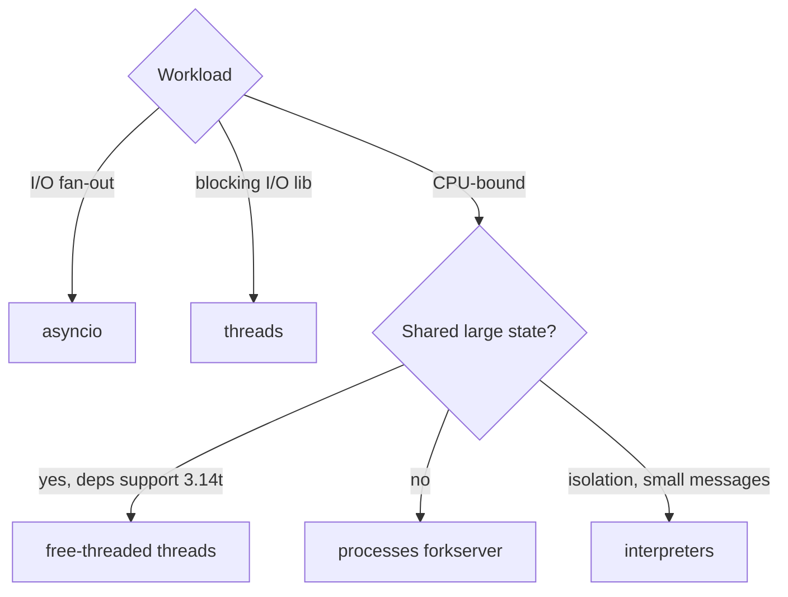

# Concurrency models: threads, processes, free-threaded 3.14t

!!! abstract "At a glance"
    **Priority:** P0 · **Complexity:** 4/5 · **Est. time:** 4 h · **Phase:** 5 · **Prereqs:** [asyncio in depth](asyncio-deep.md), [CPython internals](cpython-internals.md)
    **You're done when:** you can choose between asyncio, threads, processes, subinterpreters and free-threaded threads for a given workload with numbers, and you can audit a codebase for thread-safety once the GIL is gone.

## Why it matters

Since PEP 779 (Python 3.14, Oct 2025) the **free-threaded build (3.14t) is officially supported**, and PEP 703's implementation is complete. In 3.14 the single-thread penalty is roughly 5-10% (per the 3.14 release notes) and the specializing interpreter works in free-threaded mode. For AI engineering this changes the calculus for CPU-heavy in-process work: tokenisation, chunking, embedding pre/post-processing, in-memory rerankers, and running many agent workers sharing a large read-only model or index without pickling costs. It also changes what "thread-safe" means for your code and your dependencies.

## Core concepts

### Decision table

| Workload | Best model | Why |
|---|---|---|
| 1,000s of concurrent LLM/HTTP calls | asyncio | Cheapest per-connection cost, cancellation, backpressure |
| Blocking I/O libs (boto3, sync DB drivers) | threads (`to_thread`, `ThreadPoolExecutor`) | GIL released during I/O |
| CPU-bound pure Python, GIL build | `ProcessPoolExecutor` (forkserver/spawn) | True parallelism, but pickling and startup cost |
| CPU-bound, big shared read-only data | free-threaded threads (3.14t) | Shared memory, no serialisation |
| Native code (NumPy, Polars, tokenizers-rs) | threads even on GIL build | They release the GIL |
| Isolation with cheaper-than-process | `concurrent.interpreters` (PEP 734, 3.14) | Per-interpreter GIL, but limited sharing |

### Measured example (10-core Apple silicon, 4 workers, each 3M-iteration pure-Python loop)

| Mode | 3.14.5 (GIL) | 3.14.6t (free-threaded) |
|---|---|---|
| serial (4 jobs) | 0.70 s | 0.62 s |
| ThreadPoolExecutor | 0.70 s (no speedup) | 0.24 s (2.6x) |
| ProcessPoolExecutor | 0.45 s | 0.37 s |

Read it correctly: threads on the GIL build give **zero** CPU speedup. Free-threaded threads beat processes here because there is no pickling or spawn cost. On short jobs process startup dominates. Your numbers will vary, so re-run `bench` in the lab.

```python
import sys
from concurrent.futures import ThreadPoolExecutor

def work(n: int) -> int:
    return sum(i * i % 7 for i in range(n))

print("GIL enabled:", sys._is_gil_enabled())   # False on 3.14t (unless re-enabled)
with ThreadPoolExecutor(4) as ex:
    print(list(ex.map(work, [3_000_000] * 4)))
```

### What free-threading changes

- **Per-object locks + biased/deferred reference counting** replace the global lock. Built-in `list`, `dict`, `set` remain safe against crashes (internally locked), but **compound operations are still not atomic** (`x += 1`, check-then-act on a dict, `if k not in d: d[k] = f()`). The GIL used to hide many of these races only by accident of scheduling.
- **C extensions must declare support** (`Py_mod_gil`). Importing an extension that doesn't re-enables the GIL at runtime with a warning (unless `PYTHON_GIL=0`/`-X gil=0`). Check the tracker at py-free-threading.github.io. As of Sept 2026 the major scientific stack, Pydantic-core, and many others ship `cp314t` wheels, but verify each dependency in your lockfile.
- `uv python install 3.14t` and `uv run --python 3.14t`. Detect at runtime: `sys._is_gil_enabled()`, `sysconfig.get_config_var("Py_GIL_DISABLED")`.
- 3.14 adds context-aware warnings (`-X context_aware_warnings`, default on for free-threaded) so `warnings.catch_warnings` becomes thread-safe.

### Making code thread-safe

```python
import threading
from collections import defaultdict

class Metrics:
    def __init__(self) -> None:
        self._lock = threading.Lock()
        self._counts: defaultdict[str, int] = defaultdict(int)

    def inc(self, k: str) -> None:
        with self._lock:                 # required even though dict ops are individually safe
            self._counts[k] += 1
```

Guidelines: prefer **immutable data + message passing** (`queue.Queue`), thread-locals or `contextvars` for per-request state, and `threading.Lock` around read-modify-write. Lazy-init singletons (`if _cache is None: _cache = build()`) need a lock or `functools.cache`. Use `threading.Barrier`/`Event` in tests to force interleavings, and run test suites under `pytest-run-parallel`-style tools and `PYTHON_GIL=0` in CI.

### Processes

- Start method matters: **3.14 makes `forkserver` the default on Linux** (was `fork`). `fork` after threads exist is unsafe (locks held by other threads), and code relying on fork inheriting globals breaks. macOS/Windows use `spawn`.
- Pickle is the tax: sending a 500 MB object graph to each worker defeats the point. Use `multiprocessing.shared_memory`, memory-mapped Arrow/NumPy, or files.
- Pool sizing: CPU count for CPU work. Set `max_tasks_per_child` to bound leaks in native libs.

### Subinterpreters (PEP 734)

`concurrent.interpreters` and `InterpreterPoolExecutor` (3.14) run isolated interpreters in one process, each with its own GIL. Data crosses via queues or shareable types. Cheaper than processes, but extension-module support is uneven. Good for plugin isolation experiments, less proven than processes or free-threading for production.



### Senior nuance

- Async + threads compose: `asyncio.to_thread` for blocking calls, `loop.run_in_executor(process_pool, ...)` for CPU. The default executor has `min(32, cpu+4)` workers, so size it deliberately.
- Free-threading is not a reason to stop using asyncio for network fan-out. Threads cost ~8 MB virtual stack each and context switching, and cancellation is cooperative-only in asyncio, impossible for threads.
- Sync `def` FastAPI endpoints run in AnyIO's threadpool (default 40 tokens). On 3.14t they can actually parallelise CPU work.
- Memory: free-threaded builds use somewhat more memory (per-object header changes, mimalloc). Measure RSS before rollout.
- Ecosystem readiness is the real gate: one non-compatible extension flips the GIL back on for the whole process, silently apart from a warning. Fail CI if `sys._is_gil_enabled()` is true on the 3.14t job.

## Resources

| Resource | Type | Why this one | Level | Cost |
|---|---|---|---|---|
| [Python Free-Threading Guide](https://py-free-threading.github.io/) :gem: | docs | Community hub: porting, tracker of compatible packages, testing tips | advanced | free |
| [Porting extensions / code guide](https://py-free-threading.github.io/porting/) :gem: | docs | Concrete thread-safety patterns | advanced | free |
| [HOWTO: Python support for free threading](https://docs.python.org/3/howto/free-threading-python.html) | docs | Official behaviour and flags | intermediate | free |
| [PEP 703](https://peps.python.org/pep-0703/) / [PEP 779](https://peps.python.org/pep-0779/) | spec | Design and supported-status criteria | advanced | free |
| [PEP 734: multiple interpreters](https://peps.python.org/pep-0734/) | spec | Model and limits of subinterpreters | advanced | free |
| [What's New in 3.14](https://docs.python.org/3/whatsnew/3.14.html) | docs | Free-threading numbers, forkserver default, interpreters | intermediate | free |
| [Python behind the scenes #13: the GIL](https://tenthousandmeters.com/blog/python-behind-the-scenes-13-the-gil-and-its-effects-on-python-multithreading/) :gem: | article | Best explanation of what the GIL does and how it is released | advanced | free |
| [Itamar Turner-Trauring: Python concurrency articles](https://pythonspeed.com/articles/python-gil/) | article | Practical framing for data workloads | intermediate | free |
| [concurrent.futures](https://docs.python.org/3/library/concurrent.futures.html) | docs | Executor semantics you'll actually use | intermediate | free |

## Hands-on lab

**Goal (60-90 min):** measure and decide.

1. `uv python install 3.14 3.14t`.
2. Write `bench.py` that runs the `work()` function serially, in `ThreadPoolExecutor(4)`, and `ProcessPoolExecutor(4)`; print `sys._is_gil_enabled()`.
3. Run under both interpreters: `uv run --python 3.14 bench.py`, `uv run --python 3.14t bench.py`. **Expected:** threads ≈ serial on 3.14, and roughly `serial / min(4, cores)` on 3.14t (allow overhead, ~2-3x on 4 workers).
4. Write a racy counter (`self.n += 1` in 8 threads x 1M loops), run on 3.14t, and observe a total below 8,000,000. Fix with a lock and compare time.
5. `uv add polars` then `uv run --python 3.14t python -c "import polars, sys; print(sys._is_gil_enabled())"`. If any import prints a GIL warning, note which package.
6. Stretch: chunk 5,000 documents with a pure-Python splitter using threads on 3.14t vs processes, comparing wall time and peak RSS.

## Questions

### L1 - Recall

??? question "Q1. What does the GIL protect, and what does it not?"
    ??? success "Answer"
        It serialises execution of bytecode so CPython's internal state (refcounts, object internals) stays consistent. It does **not** make your compound operations atomic: `x += 1` and check-then-act can interleave between bytecodes. Free-threaded builds remove the GIL, exposing races that were merely unlikely.

??? question "Q2. Name three ways to detect that you're on a free-threaded interpreter with the GIL actually off."
    ??? success "Answer"
        `sys._is_gil_enabled()` returns False; `sysconfig.get_config_var("Py_GIL_DISABLED") == 1` (build capability); `python -VV` / `sys.version` shows "free-threading build". A build can be free-threaded yet have the GIL re-enabled at runtime by an incompatible extension.

??? question "Q3. Which start method became the default on Linux in 3.14 and why?"
    ??? success "Answer"
        `forkserver` (was `fork`). Forking a multi-threaded process can deadlock (locks held by threads that don't exist in the child) and is unsafe with many native libs. forkserver spawns workers from a clean single-threaded server process.

??? question "Q4. Why do threads speed up NumPy-heavy code even on the GIL build?"
    ??? success "Answer"
        Native extensions release the GIL around long C operations, so several threads run in parallel in C. Pure-Python loops can't.

### L2 - Apply

??? question "Q5. This runs on 3.14t with 8 threads and prints less than 800000. Why, and fix it."
    ```python
    counter = 0
    def bump():
        global counter
        for _ in range(100_000):
            counter += 1
    ```
    ??? success "Answer"
        `counter += 1` is load, add, store, which is not atomic. Threads interleave and lose updates. (It can happen on the GIL build too, but is far rarer.) Fix: `with lock:` around the update, or use per-thread counters and sum them, or `itertools.count`/`queue` patterns. Lock cost is small relative to the work if you batch.

??? question "Q6. Your `ProcessPoolExecutor` job is slower than serial. Give three likely causes."
    ??? success "Answer"
        (1) Payload pickling dominates (large args/results), (2) tasks too small so spawn/forkserver startup and IPC overhead dominate, (3) workers each re-import heavy modules or load a model, (4) oversubscription: NumPy/BLAS threads × process count > cores. Fixes: batch tasks, share data via shared memory or files, initialise workers once (`initializer=`), cap BLAS threads.

??? question "Q7. A FastAPI sync endpoint runs a 200 ms CPU-bound chunker. On 3.13 it can't use more than one core. What changes on 3.14t?"
    ??? success "Answer"
        Sync endpoints run in AnyIO's threadpool, so on 3.14t concurrent requests can run the pure-Python chunker on multiple cores in one process, sharing loaded models/indices without pickling. Still verify all dependencies are free-thread compatible, and size the threadpool (default 40 tokens) to cores for CPU-bound work.

??? question "Q8. `if key not in cache: cache[key] = expensive(key)` from many threads. What are the failure modes and fix?"
    ??? success "Answer"
        Duplicate computation (two threads pass the check) and possibly inconsistent results if `expensive` has side effects. The dict itself won't corrupt. Fix: a lock per key or global (`with lock:` double-checked), `functools.cache` (still may call twice concurrently in some cases, so don't rely on exactly-once), or store a Future in the dict (`setdefault` then `.result()`) so concurrent callers wait on one computation.

### L3 - Design & trade-offs

??? question "Q9. Embedding pre-processing (tokenise/chunk 2M docs) — processes, free-threaded threads, or asyncio + to_thread?"
    ??? success "Answer"
        It's CPU-bound, so asyncio adds nothing. Processes: proven, isolated, pay pickling and memory duplication (each worker loads tokenizer state), fine if inputs are file paths and outputs are compact arrays. Free-threaded threads: shared tokenizer and no serialisation, best throughput per GB, but depends on all deps being 3.14t-compatible (Rust tokenizers release the GIL anyway, so threads may already work on the GIL build). Recommendation: benchmark both with real data; default to processes for the production path today unless the dependency check passes and RSS/latency wins are measured, then run 3.14t behind a canary.

??? question "Q10. How would you roll out 3.14t for a fleet of 40 services?"
    ??? success "Answer"
        Not fleet-wide at once. Inventory deps with `cp314t` wheels (uv lock plus tracker), add a 3.14t CI job (fail on GIL re-enable, run tests with threads stress and `PYTHON_GIL=0`), pick 2-3 CPU-bound, thread-heavy services as pilots, and canary with p99 latency, RSS and error metrics. Keep the GIL build as rollback (same code). Document thread-safety rules and audit global mutable state. Promote once the tracker shows your stack green and pilots show a real win (cost per request), otherwise wait.

??? question "Q11. Threads vs interpreters vs processes for running untrusted plugin code that must not corrupt host state."
    ??? success "Answer"
        Processes give the strongest isolation (crash containment, OS limits, seccomp/containers). Interpreters isolate Python state but share the process, so a native crash kills everything and extension support is limited. Threads share everything. For untrusted code choose processes (or containers/microVMs), possibly with interpreters for trusted-but-isolated modules where startup cost matters.

### L4 - Staff-level ambiguity

??? question "Q12. The platform team wants to 'go free-threaded' to cut compute costs 30%. Evaluate the claim and craft the plan."
    ??? success "Answer"
        Break down cost by workload: if 80% is I/O waiting on LLMs, free-threading saves little (asyncio already efficient). Savings appear where CPU-bound work is currently parallelised via processes with duplicated memory or where cores idle due to the GIL. Quantify: CPU profile per service (py-spy), memory duplication, current pod counts. Model expected savings, add the 5-10% single-thread penalty and extra memory, then pilot. Risks: compatibility, subtle races, ecosystem lag. Deliver a decision memo with break-even and go/no-go criteria per service class, not a blanket mandate.

??? question "Q13. Design a thread-safety review process for a codebase moving to 3.14t."
    ??? success "Answer"
        Static: grep for module-level mutable state, singletons, lazy init, class-level caches, and `global`. Dynamic: run tests with many threads and thread sanitizer-style stress (repeat, randomised sleeps), plus `pytest-run-parallel`-style parallel test execution. Establish patterns (immutability, locks around state, queue-based handoff), a lint checklist in PR templates, and ownership of shared components. Track dependencies' free-threading status in a table with owners. Metric: races found in canary, and services passing the 3.14t CI job.

## Real-world use cases

- **Batch chunking/embedding prep:** threads sharing a tokenizer on 3.14t beat process pools by removing pickling.
- **Model-serving sidecars:** many worker threads share one in-memory index without copy-on-write page duplication.
- **Agent gateways:** asyncio for network fan-out plus a small thread pool for sync SDKs and PDF parsing.
- **Data platforms:** DuckDB/Polars already release the GIL, so threads suffice there. 3.14t helps the pure-Python glue.

## Pitfalls & anti-patterns

- Assuming dict/list atomicity means your logic is thread-safe.
- Using `fork` after starting threads or loading CUDA.
- Sending huge objects through pool pickling.
- Ignoring the GIL-reenable warning on 3.14t.
- Threads for 10k concurrent sockets (use asyncio).
- Benchmarking on tiny inputs where startup dominates.
- Global `random`/logging config mutated at runtime from many threads.

## Checklist

- [ ] I can explain what free-threading changes and what it does not (compound ops, extensions)
- [ ] I ran the lab benchmark on 3.14 and 3.14t and recorded my numbers
- [ ] I reproduced and fixed a data race
- [ ] I answered all L3 questions out loud in < 3 min each
