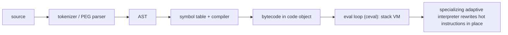

# CPython internals: bytecode, GIL, memory

!!! abstract "At a glance"
    **Priority:** P2 · **Complexity:** 4/5 · **Est. time:** 4 h · **Phase:** 5 · **Prereqs:** [Data model](data-model.md), [Concurrency models](concurrency-models.md)
    **You're done when:** you can read `dis` output, explain how CPython executes, allocates and frees objects (refcounting + cycle GC + freelists/mimalloc), what the GIL does and how 3.13/3.14 free-threading changes it, and use that to explain a performance or memory surprise.

## Why it matters

You don't need internals to write services, but you need them to **explain the surprises**: why threads didn't speed up, why memory doesn't drop after a batch job, why `is` behaves oddly on ints, why a decorator made things slower, why 3.14t needs new locking discipline. This is P2 because it pays off in debugging, performance work and interviews at the Staff/Principal level rather than daily coding. It also lets you reason about the interpreter roadmap (specializing interpreter, tail-calling interpreter, JIT, free-threading) when planning upgrades.

## Core concepts

### Pipeline: source to result



- `.pyc` files cache compiled code objects in `__pycache__` (keyed by source mtime/hash and magic number), which is why import is faster the second time and why `UV_COMPILE_BYTECODE` helps cold start.
- A **code object** holds bytecode, constants, names, and flags. A **function object** wraps a code object plus globals, defaults and closure. **Frames** hold locals and the value stack (in 3.11+ frames are lazily materialised, and cheap).

### Reading bytecode

```python
import dis
def f(a, b):
    return a + b * 2
dis.dis(f)
```

On 3.14.5 this shows (abridged): `LOAD_FAST_BORROW_LOAD_FAST_BORROW (a, b)`, `LOAD_SMALL_INT 2`, `BINARY_OP (*)`, `BINARY_OP (+)`, `RETURN_VALUE`. Note the *superinstructions* and "borrow" variants (3.14 avoids some refcount traffic). Opcode names change between versions, so never depend on them in code. `dis` is for understanding, not APIs.

`dis.dis(f, adaptive=True)` after warm-up shows specialised instructions (`LOAD_ATTR_INSTANCE_VALUE`, `BINARY_OP_ADD_INT`...). This is PEP 659: after a few executions, an instruction observes operand types and rewrites itself to a fast, type-specialised variant with guards, and deoptimises if guards fail. Practical consequence: **monomorphic code is faster**. A call site that always sees `int` beats one that alternates types.

### Objects and memory

- Every object has a header: refcount and type pointer (`PyObject`). On 3.14 default build: `sys.getsizeof(1)` = 28 bytes, `[]` = 56, `{}` = 64, an empty instance ~48 (plus a dict when attributes are added, mitigated by inline values since 3.11/3.13).
- **Reference counting** frees objects immediately when the count hits 0 (deterministic for most objects, which is why `with`/refcount-based cleanup often "just works" in CPython and not in PyPy). `sys.getrefcount(x)` is one higher than you expect (the argument reference).
- **Cycle GC** handles reference cycles (containers only). Objects with `__del__` in cycles are handled since 3.4, but finalisation order is unspecified. `gc.collect()` returns the number of unreachable objects found.
- **GC version note**: 3.14.0-3.14.4 shipped an incremental GC; it was reverted in 3.14.5 due to memory-pressure reports, so 3.14.5+ uses the generational collector like 3.13. Check `gc` docs for your patch version when tuning.
- **Allocator**: small objects (<= 512 bytes) use pymalloc (arenas, pools, size classes). Free-threaded builds use mimalloc. Memory is often *not returned to the OS* after peaks (arena fragmentation), so RSS staying high after a batch isn't automatically a leak.
- **Interning and caches**: small ints (-5..256) are cached singletons. Identifiers and many string literals are interned. `a = 1000; b = 1000; a is b` is `True` in the same code object because of constant folding, but `int("1000") is int("1000")` is `False`. **Never use `is` for value comparison** (except `None`/sentinels).
- `dict` is insertion-ordered, with split-key dictionaries sharing keys across instances of a class (hence the memory savings for normal objects vs. plain dicts) and inline values in 3.13+. `__slots__` avoids the dict entirely.
- Freelists (floats, tuples, lists, dicts) make small allocations cheap.

### The GIL

- A mutex allowing one thread at a time to execute bytecode, which simplifies reference counting and internal invariants. A thread releases it on blocking I/O, `time.sleep`, many C extension calls, and on a switch interval (default 5 ms, `sys.setswitchinterval`) when another thread requests it.
- Consequences: CPU-bound threads don't scale (we measured 0.70 s serial vs 0.70 s threaded on 3.14.5 GIL build), I/O-bound threads do, and C extensions that release the GIL scale. Data structure operations are individually atomic *as a side effect*, but compound operations are not ([concurrency models](concurrency-models.md)).
- **Free-threading (PEP 703, supported per PEP 779 in 3.14):** the GIL is removed by using per-object locks (critical sections), biased and deferred reference counting, immortal objects (small ints, interned strings, `None`), and mimalloc. Costs: ~5-10% single-thread slowdown (3.14 release notes), more memory, and the need for extensions to opt in. Also, the specialising interpreter works in free-threaded mode since 3.14.
- **Subinterpreters (PEP 734, 3.14):** per-interpreter GIL and state in one process, with limited object sharing.

### Attribute access and calls (why decorators cost what they cost)

- `obj.attr`: type lookup (MRO cache), descriptor check, instance dict/inline values, then class attr ([data model](data-model.md)). With specialisation, monomorphic attribute loads become a guarded array index.
- Python-to-Python calls in 3.11+ avoid C recursion ("inlined" calls in the eval loop). A decorator adds one extra Python frame per call, roughly 40-80 ns on modern hardware (measure yours), which is irrelevant against I/O but matters in tight loops.
- Exceptions are "zero-cost" when not raised (3.11+ exception tables), but raising and catching is comparatively expensive (microseconds), so don't use exceptions for hot control flow.

### Interpreter roadmap (as of Sept 2026)

| Feature | Status |
|---|---|
| Specializing adaptive interpreter (PEP 659) | Default since 3.11 |
| Tail-calling interpreter | Opt-in build flag in 3.14 (Clang 19+), roughly 3-5% on pyperformance per release notes |
| Experimental JIT (copy-and-patch, PEP 744) | Opt-in, experimental in 3.13/3.14, not recommended for production per 3.14 notes. Not available in free-threaded builds |
| Free-threaded build | Officially supported in 3.14 (PEP 779) |
| Python 3.15 | Scheduled final release 2026-10-01 (PEP 790). Includes explicit lazy imports (PEP 810), a `profiling` package (PEP 799), unpacking in comprehensions (PEP 798) |
| `sys.monitoring` (PEP 669, 3.12) | Low-overhead event API used by new profilers and debuggers, and by coverage on modern Pythons |
| Safe external debugger interface (PEP 768, 3.14) | Attach debuggers/tools to a running process without stopping it |

### Senior nuance

- **Refcounting and threads**: `a = b` is cheap only because increments are cheap. In free-threaded builds, biased refcounting makes same-thread ops fast and cross-thread sharing slower, so *sharing a hot object across many threads* costs more than under the GIL.
- **`del x` doesn't free memory**, it decrements a refcount. Frames in tracebacks keep locals alive: `except Exception as e:` deletes `e` at block end for this exact reason, but stored exceptions (`errors.append(e)`) retain `__traceback__` → frames → big locals. Store `str(e)` or `traceback.format_exception` results instead.
- `functools.lru_cache`, module-level dicts and interned data are *intentional* lifetime extenders.
- **Weak references** (`weakref.WeakValueDictionary`, `finalize`) for caches that shouldn't keep objects alive.
- Pickle and multiprocessing interact with refcounts and copy-on-write: touching objects in a forked child writes refcounts, forcing page copies, which is why `gc.freeze()` before fork and `forkserver` defaults matter.
- Reading the source: `Python/ceval.c`, `Python/bytecodes.c` (the DSL that generates the interpreter), `Objects/dictobject.c`, `InternalDocs/` in the CPython repo (interpreter, GC, compiler docs).

## Resources

| Resource | Type | Why this one | Level | Cost |
|---|---|---|---|---|
| [Python behind the scenes (series)](https://tenthousandmeters.com/) :gem: | article series | Best free walkthrough of the CPython VM, objects, GIL, imports | advanced | free |
| [#1: how the CPython VM works](https://tenthousandmeters.com/blog/python-behind-the-scenes-1-how-the-cpython-vm-works/) :gem: | article | Start here | advanced | free |
| [#4: how bytecode is executed](https://tenthousandmeters.com/blog/python-behind-the-scenes-4-how-python-bytecode-is-executed/) :gem: | article | The eval loop | advanced | free |
| [#13: the GIL and its effects](https://tenthousandmeters.com/blog/python-behind-the-scenes-13-the-gil-and-its-effects-on-python-multithreading/) :gem: | article | GIL mechanics and the switch interval | advanced | free |
| [Confessions of a Code Addict](https://blog.codingconfessions.com/) :gem: | blog | Deep CPython internals write-ups (GC, refcounting, interpreter) | advanced | free |
| [CPython GC internals (Code Addict)](https://blog.codingconfessions.com/p/cpython-garbage-collection-internals) :gem: | article | Generational GC explained with the source | advanced | free |
| [CPython InternalDocs](https://github.com/python/cpython/blob/main/InternalDocs/README.md) | docs | Maintainers' own internals docs (interpreter, GC, compiler) | advanced | free |
| [`dis` module](https://docs.python.org/3/library/dis.html) | docs | Bytecode reference for your version | intermediate | free |
| [Understanding the GIL (Beazley, video)](https://www.youtube.com/watch?v=Obt-vMVdM8s) :gem: | video | The classic talk on GIL behaviour | advanced | free |
| [CPython Internals (Anthony Shaw)](https://realpython.com/products/cpython-internals-book/) | book | Guided tour of the source | advanced | paid |

## Hands-on lab

**Goal (75-90 min):** explain four surprises with evidence.

1. `dis.dis` three functions: (a) `a + b * 2`, (b) a list comprehension, (c) `with open(...) as f`. Identify the loads, the binary ops, and the exception-table entries for `with`. Note version differences by running on 3.13 and 3.14.
2. Specialisation: run `dis.dis(add, adaptive=True)` after calling `add(1, 2)` 1,000 times, then after calling `add("a", "b")`. Record the instruction changes.
3. Refcounts: `sys.getrefcount` on a fresh list (expect 2), then add references and watch it grow. Create a cycle (`a.o = b; b.o = a`), `del a, b`, confirm memory isn't freed until `gc.collect()` (use `weakref.ref` with a callback to observe).
4. Memory that doesn't come back: allocate 5M small objects, delete them, and compare `tracemalloc` (near 0) to RSS (`resource.getrusage`/`psutil`). Explain via pymalloc arenas.
5. `is` vs `==`: predict, then run `a=256; b=256`, `int("1000") is int("1000")`, and `"".join(["a","b"]) is "ab"`.
6. GIL: reuse the CPU benchmark from [concurrency models](concurrency-models.md) on 3.14 vs 3.14t and connect the result to what you learned about biased refcounting (try sharing one big list across threads).
7. Stretch: build the tail-calling interpreter option, or compare `python3.14 -X perf` output with `perf`.

## Questions

### L1 - Recall

??? question "Q1. How does CPython reclaim memory?"
    ??? success "Answer"
        Primarily reference counting: an object is freed when its count reaches zero. A cycle garbage collector (generational in 3.13 and 3.14.5+) periodically finds unreachable reference cycles among container objects. Freed small-object memory goes back to pymalloc pools, and not necessarily to the OS.

??? question "Q2. What does the GIL guarantee, and when is it released?"
    ??? success "Answer"
        Only one thread executes Python bytecode at a time, which protects interpreter internals (refcounts). It is released around blocking I/O and sleep, by many C extensions during long native work, and periodically via the switch interval (5 ms default) so other threads can run.

??? question "Q3. What does `a = 1000; b = 1000; a is b` print in one module, and what about `int('1000') is int('1000')`?"
    ??? success "Answer"
        `True` for the first (constants in the same code object are folded into one object). `False` for the second (two separate int objects created at runtime). Only -5..256 are globally cached. Never use `is` for value equality.

??? question "Q4. What is the specializing adaptive interpreter?"
    ??? success "Answer"
        PEP 659 (3.11+): the interpreter observes the types at an instruction after warm-up and rewrites it in place to a specialised, guarded fast path (e.g. integer add, instance attribute load), deoptimising when guards fail. It speeds up type-stable code.

### L2 - Apply

??? question "Q5. A batch job frees 4 GB of objects, but RSS stays at 4 GB. Leak?"
    ??? success "Answer"
        Not necessarily. Python's allocator (pymalloc arenas, plus the C allocator) doesn't always return memory to the OS due to fragmentation (a few live objects pin an arena). Verify with `tracemalloc` (Python-level usage near zero means no Python-level leak), then mitigate: run the job in a subprocess/worker that exits, use `mmap`/Arrow buffers, avoid holding partial references, or `malloc_trim` where applicable.

??? question "Q6. Predict what happens to memory here and why it matters for services."
    ```python
    errors = []
    def handle(payload):
        try:
            process(payload)          # loads a 200 MB dataframe local
        except Exception as e:
            errors.append(e)
    ```
    ??? success "Answer"
        Each stored exception keeps its `__traceback__`, which references frames and their local variables (the 200 MB dataframe) alive as long as `errors` holds it. Store `repr(e)`/formatted traceback strings, or `e.with_traceback(None)`, or log and drop.

??? question "Q7. Why did this microbenchmark get slower when the loop started receiving both ints and strings?"
    ??? success "Answer"
        Type instability defeats specialisation. The `BINARY_OP_ADD_INT` guard fails, the instruction deoptimises to the generic path and may re-specialise repeatedly. Keep hot call sites monomorphic when it matters, or split code paths per type.

??? question "Q8. Two processes forked from a parent with a 2 GB in-memory index still end up using ~4 GB. Why?"
    ??? success "Answer"
        Copy-on-write is defeated by refcounts: merely reading Python objects updates their refcount fields, dirtying the pages so the OS copies them, and the GC also touches object headers. Mitigate: `gc.freeze()` before forking, store the index in a compact non-object structure (NumPy/Arrow/mmap), use shared memory, or use threads on 3.14t.

### L3 - Design & trade-offs

??? question "Q9. Explain trade-offs of free-threaded CPython to a team deciding whether to adopt 3.14t."
    ??? success "Answer"
        Pros: true multi-core parallelism for CPU-bound Python threads, shared memory without pickling, simpler deployment than process pools for some workloads. Cons: single-thread overhead (~5-10%), higher memory, ecosystem readiness (extensions must declare support or the GIL re-enables), and race exposure in code that relied on GIL side effects. Decision: pilot CPU-bound, thread-heavy services with a dependency compatibility check, canary and metrics, keep GIL builds as rollback. Don't move I/O-bound asyncio services for performance alone.

??? question "Q10. Refcounting + cycle GC vs a tracing GC (PyPy/JVM): what does CPython's choice cost and buy?"
    ??? success "Answer"
        Buys: deterministic destruction (files/sockets closed promptly), simple C-API memory model, predictable latency (no long stop-the-world pauses for most objects), and easy interop. Costs: refcount overhead on every reference change, cycles need a separate collector, cache/COW unfriendliness (writes on reads), and it complicates removing the GIL (hence biased/deferred refcounting and immortal objects). This is why free-threading was a multi-year engineering effort.

??? question "Q11. When is it worth dropping to bytecode/internals level in a real investigation?"
    ??? success "Answer"
        When behaviour contradicts your mental model and higher-level tools don't explain it: unexpected per-call overhead (decorator stacks, descriptor access), surprising memory retention (frames/tracebacks), GIL contention symptoms (profile shows waiting on the lock), or deciding between refactors with similar semantics (`dis` shows extra loads/calls). Not for routine tuning: first use profilers and algorithmic fixes. Always confirm with a measurement, since bytecode counts don't equal time.

### L4 - Staff-level ambiguity

??? question "Q12. How would you decide the org's Python version upgrade cadence (3.12 to 3.14 to 3.15) and what internals-informed risks do you watch?"
    ??? success "Answer"
        Policy: support N and N-1 (or the two newest stable releases), upgrade within 6 months of a `.1`+ release once key deps ship wheels, and run a compatibility matrix in CI (lowest and highest supported). Track: end-of-life dates, dependency wheel availability (including free-threaded), performance deltas on your benchmarks, C-extension ABI changes, removed/deprecated APIs (e.g. annotations behaviour in 3.14, the GC revert history in 3.14.x), and observable behaviour changes like the default multiprocessing start method. Roll out via canaries and expose a shared base image so upgrades are one PR.

??? question "Q13. An engineer proposes writing a custom C extension to bypass the GIL for a scoring function. Respond as Staff."
    ??? success "Answer"
        Ask for the profile: what share of request time is the scoring, and could NumPy/Polars/Rust-based existing libs do it (many release the GIL)? Alternatives in ascending cost: algorithmic fix, vectorisation, process pool, free-threaded threads, then a native extension. If native is justified, prefer PyO3/maturin or mypyc/Cython over hand-written C API code, release the GIL explicitly, provide `cp314t` wheels, and keep the pure-Python reference for tests. Include ownership, security review (memory safety), CI wheel matrix and rollback in the proposal.

## Real-world use cases

- **Memory incident:** a service retained 200 MB per failed request via stored exceptions. Understanding traceback-frame retention pinpointed it.
- **Upgrade win:** a fleet upgrade 3.10 to 3.13 gave ~15-25% CPU reduction on pure-Python-heavy services (interpreter specialisation), with no code changes.
- **Fork-based worker pool:** COW defeat by refcounts explained 2x memory and led to `gc.freeze()` + shared Arrow buffers.
- **GIL diagnosis:** py-spy `--gil` showed a single hot thread holding the lock, so moving to processes and later 3.14t was justified with data.

## Pitfalls & anti-patterns

- Using `is` for value comparison.
- Relying on `__del__` or refcount timing for correctness (breaks on other interpreters and cycles).
- Assuming RSS decline after `del` and calling every plateau a leak.
- Depending on bytecode names/layouts in application code.
- Tuning `gc` thresholds without measurement (and forgetting patch-level GC changes).
- Believing "dict/list ops are atomic" is a synchronisation strategy.
- Micro-optimising based on `dis` without timing.

## Checklist

- [ ] I can explain source to bytecode to specialised execution without notes
- [ ] I can explain refcounting, cycle GC, pymalloc behaviour and why RSS may not shrink
- [ ] I can explain what the GIL is, what free-threading changes, and the costs
- [ ] I answered all L3 questions out loud in < 3 min each
