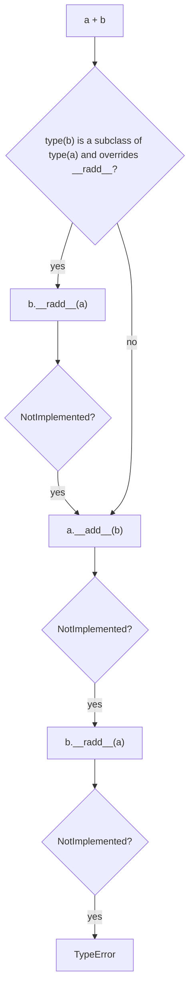

# Python data model & dunder protocols

!!! abstract "At a glance"
    **Priority:** P0 · **Complexity:** 3/5 · **Est. time:** 3 h · **Phase:** 1 · **Prereqs:** [Modern tooling](modern-tooling.md)
    **You're done when:** you can predict how the interpreter resolves `a + b`, `x in c`, `obj.attr`, `hash(obj)` and `bool(obj)` for any user-defined class, and you can implement a small collection type that behaves natively with `len`, iteration, slicing, `in`, equality and hashing.

## Why it matters

The data model is Python's real API. Every framework you'll use in AI engineering is built on it: Pydantic (descriptors, `__get_pydantic_core_schema__`), SQLAlchemy (descriptors, `__clause_element__`), NumPy/Polars (`__array__`, `__getitem__` with tuples, operator overloading), LangGraph state reducers (`Annotated[list, operator.add]`), FastAPI dependency injection (`__call__`, `__signature__`). Staff engineers get asked to debug "why is this object unhashable in a set", "why does `==` on my model return a Series", or "why is attribute access slow". All of those are data-model answers.

## Core concepts

### Special methods are looked up on the type, not the instance

`len(x)` calls `type(x).__len__(x)`, skipping `x.__dict__`. Assigning `obj.__len__ = lambda: 3` does nothing for `len(obj)`. This is both a speed optimisation (C slot lookup: `tp_as_sequence->sq_length`) and a correctness rule.

### Protocol map (the ones that matter in production)

| Protocol | Dunders | Gotcha |
|---|---|---|
| Representation | `__repr__`, `__str__`, `__format__` | `__repr__` is for engineers and logs; make it unambiguous. f-strings call `__format__` |
| Truthiness | `__bool__` then `__len__` | `__bool__` wins if both are defined. Empty-but-valid objects are falsy, a classic `if not result:` bug |
| Equality/hash | `__eq__`, `__hash__` | defining `__eq__` sets `__hash__ = None` (unhashable) unless you define it too |
| Ordering | `__lt__` …, `functools.total_ordering` | return `NotImplemented`, don't raise |
| Numeric | `__add__`, `__radd__`, `__iadd__` | `NotImplemented` triggers the reflected op. `+=` falls back to `__add__` + rebind |
| Container | `__len__`, `__getitem__`, `__contains__`, `__iter__` | `in` falls back to `__iter__`, then to `__getitem__` from 0 |
| Callable | `__call__` | how FastAPI class-based dependencies and Pydantic validators work |
| Context | `__enter__/__exit__`, `__aenter__/__aexit__` | `__exit__` returning truthy swallows the exception |
| Attribute | `__getattribute__`, `__getattr__`, `__setattr__`, `__delattr__`, `__dir__` | `__getattr__` only fires on *miss* |
| Descriptor | `__get__`, `__set__`, `__delete__`, `__set_name__` | see [descriptors](decorators-descriptors-metaclasses.md) |
| Class creation | `__init_subclass__`, `__class_getitem__`, `__set_name__` | replaces 90% of metaclass use |
| Copy/pickle | `__copy__`, `__deepcopy__`, `__reduce__`, `__getstate__` | pickling matters for multiprocessing and Ray |
| Buffer | `__buffer__` (PEP 688, 3.12) | zero-copy interop |

### Binary operator dispatch



Return `NotImplemented` (a singleton, not an exception) when you don't handle an operand type. Raising `TypeError` yourself prevents the other operand from getting a chance.

### Equality and hashing contract

- `a == b` must imply `hash(a) == hash(b)`.
- Hash must not change while the object is in a set/dict, so hash only immutable state.
- `@dataclass(frozen=True)` or `eq=True, frozen=True` gives you a consistent `__hash__`. `@dataclass` with `eq=True` (default) and not frozen sets `__hash__ = None`.
- Pydantic `BaseModel` is unhashable unless `frozen=True` in `model_config`.

```python
from dataclasses import dataclass

@dataclass(frozen=True, slots=True)
class ShipmentKey:
    carrier: str
    booking_ref: str

seen = {ShipmentKey("MAEU", "123")}
print(ShipmentKey("MAEU", "123") in seen)   # True
```

### A native-feeling collection

Implement the minimum and inherit the rest from `collections.abc`:

```python
from collections.abc import Sequence
from typing import overload

class TokenWindow(Sequence[int]):
    """Immutable window over token ids, like a context-window slice."""
    __slots__ = ("_ids",)

    def __init__(self, ids: list[int]) -> None:
        self._ids = tuple(ids)

    def __len__(self) -> int:
        return len(self._ids)

    @overload
    def __getitem__(self, i: int) -> int: ...
    @overload
    def __getitem__(self, i: slice) -> "TokenWindow": ...
    def __getitem__(self, i: int | slice) -> "int | TokenWindow":
        if isinstance(i, slice):
            return TokenWindow(list(self._ids[i]))
        return self._ids[i]

    def __repr__(self) -> str:
        return f"TokenWindow(n={len(self)}, head={self._ids[:3]})"

w = TokenWindow(list(range(10)))
print(w[-3:], 5 in w, w.index(7), list(reversed(w))[:2])
# TokenWindow(n=3, head=(7, 8, 9)) True 7 [9, 8]
```

`Sequence` provides `__contains__`, `__iter__`, `__reversed__`, `index`, `count` as mixins. They are correct but O(n) in Python code, so override `__contains__` with a set if it's hot.

### Attribute lookup order (the full story)

For `obj.name`, `object.__getattribute__` does:

1. Find `name` on `type(obj).__mro__`. If it's a **data descriptor** (has `__set__` or `__delete__`), call its `__get__`.
2. Else if `name` is in `obj.__dict__`, return it.
3. Else if the class attribute is a **non-data descriptor** (functions, `classmethod`, `functools.cached_property`), call `__get__`.
4. Else return the class attribute.
5. Else call `__getattr__` if defined, else raise `AttributeError`.

This is why `property` (data descriptor) can't be shadowed by instance dict, while `cached_property` (non-data) works by writing into the instance dict on first access.

### `__slots__`

- Removes per-instance `__dict__`. That saves memory (roughly 40–60% for small objects) and gives slightly faster attribute access.
- Costs: no dynamic attributes, need `"__weakref__"` in slots for weakrefs, multiple inheritance with non-empty slots conflicts, and `cached_property` needs `__dict__`.
- `@dataclass(slots=True)` (3.10+) generates it for you.
- When it matters: millions of small objects (graph nodes, token spans, events in a streaming pipeline).

### Senior nuance

- `__eq__` returning non-bool is legal (NumPy/Polars return arrays/expressions). That's why `if df == other:` explodes, and why `x in list_of_arrays` can raise.
- `__hash__` of `-1` is reserved in CPython (`hash(-1) == -2`).
- `__del__` is not a destructor you can rely on: timing depends on refcount and GC, and it's not called at interpreter exit reliably. Use context managers or `weakref.finalize`.
- `__getattr__` + pickling/copy is an infinite-recursion trap (copy creates an instance without `__init__`, then `__getattr__` accesses `self._wrapped`, which misses and calls `__getattr__` again).
- `__init_subclass__` + `__set_name__` (3.6+) cover plugin registries and field declarations without metaclasses.
- The `__class_getitem__` hook is how `list[int]` works at runtime (returns `types.GenericAlias`).

### LLM/agent tie-in

- Tool registries: `__init_subclass__` auto-registers `Tool` subclasses, and `__call__` makes instances directly invocable by the agent loop.
- Message history types: implement `Sequence` so the history can be sliced/truncated (`history[-20:]`) for context-window management, and hash immutable message parts for prompt-cache keys.
- Reducers: LangGraph's `Annotated[list[AnyMessage], add_messages]` works because reducers are just callables. Understand `__add__` semantics when you write custom state channels.

## Resources

| Resource | Type | Why this one | Level | Cost |
|---|---|---|---|---|
| [Python reference: Data model](https://docs.python.org/3/reference/datamodel.html) | docs | The source of truth. Read "Special method names" end to end once | advanced | free |
| [Fluent Python, 2nd ed. (Ramalho)](https://www.fluentpython.com/) | book | Part I is the best treatment of the data model in print | advanced | paid |
| [collections.abc](https://docs.python.org/3/library/collections.abc.html) | docs | The mixin table shows what you get for free | intermediate | free |
| [Python behind the scenes #6: the object system](https://tenthousandmeters.com/blog/python-behind-the-scenes-6-how-python-object-system-works/) :gem: | article | How slots (C-level) map to dunders | advanced | free |
| [Python behind the scenes #7: how attributes work](https://tenthousandmeters.com/blog/python-behind-the-scenes-7-how-python-attributes-work/) :gem: | article | Walks `PyObject_GenericGetAttr` line by line | advanced | free |
| [Descriptor HowTo Guide](https://docs.python.org/3/howto/descriptor.html) | docs | Pure-Python equivalents of property/classmethod/functions | advanced | free |
| [Ned Batchelder: Facts and myths about Python names and values](https://nedbatchelder.com/text/names.html) :gem: | article | The mental model behind aliasing bugs | intermediate | free |
| [Hynek: Subclassing in Python Redux](https://hynek.me/articles/python-subclassing-redux/) :gem: | article | When to use protocols/composition over inheritance | advanced | free |
| [mCoding (YouTube)](https://www.youtube.com/@mCoding) :gem: | video | Short, precise videos on dunders, slots, and gotchas | intermediate | free |

## Hands-on lab

**Goal (60–90 min):** build `Money` and `LineItems` types for a freight-quote domain that behave natively.

1. `Money` (frozen, slotted dataclass): `amount: Decimal`, `currency: str`. Implement `__add__`/`__radd__` (so `sum(items, start=Money.zero("USD"))` works), return `NotImplemented` for mismatched types, and raise `ValueError` for currency mismatch. Implement `__format__` so `f"{m:.2f}"` gives `"USD 12.50"`.
2. `LineItems(Sequence[Money])`: slicing returns `LineItems`, `__contains__` O(1) via an internal set, `__bool__` false when empty, `__repr__` concise.
3. Write tests:
    ```python
    items = LineItems([Money(Decimal("10.5"), "USD"), Money(Decimal("2"), "USD")])
    assert f"{sum(items, start=Money.zero('USD')):.2f}" == "USD 12.50"
    assert items[:1] == LineItems([Money(Decimal("10.5"), "USD")])
    assert Money(Decimal("2"), "USD") in items
    assert {Money(Decimal("1"), "EUR"), Money(Decimal("1.0"), "EUR")}.__len__() == 1  # Decimal eq/hash
    ```
4. Measure: `sys.getsizeof` plus `tracemalloc` for 1M `Money` objects with and without `slots=True`. **Expected:** slotted uses noticeably less memory (record the actual delta in your log).
5. Stretch: add `__get_pydantic_core_schema__` so `Money` can be a Pydantic field (links to [Pydantic v2](pydantic-v2.md)).

## Questions

### L1 — Recall

??? question "Q1. What does this print, and why?"
    ```python
    class A:
        def __eq__(self, other): return True
    print({A()})
    ```
    ??? success "Answer"
        `TypeError: unhashable type: 'A'`. Defining `__eq__` without `__hash__` sets `__hash__ = None` on the class, because the default identity hash would violate "equal implies same hash". Fix by defining `__hash__` over the immutable fields, or use `@dataclass(frozen=True)`.

??? question "Q2. In what order does `bool(obj)` consult dunders?"
    ??? success "Answer"
        `type(obj).__bool__` if defined (must return bool), otherwise `__len__` (truthy if non-zero), otherwise the object is truthy. If both are defined, `__bool__` wins. A class with `__bool__` returning False and `__len__` returning 5 is falsy.

??? question "Q3. What is the difference between `__getattr__` and `__getattribute__`?"
    ??? success "Answer"
        `__getattribute__` runs on every attribute access (override it rarely, and call `super().__getattribute__` to avoid recursion). `__getattr__` runs only when normal lookup raises `AttributeError`. Use it for proxies, lazy attributes, and deprecation shims.

??? question "Q4. Why should `__add__` return `NotImplemented` rather than raising `TypeError`?"
    ??? success "Answer"
        `NotImplemented` tells the interpreter to try the reflected operation `other.__radd__(self)`. Raising stops dispatch, so types you don't know about (e.g. `Decimal`, a NumPy scalar, or a user subclass) never get a chance. If both sides return `NotImplemented`, Python raises `TypeError` for you.

### L2 — Apply

??? question "Q5. What does this print?"
    ```python
    class D:
        def __get__(self, obj, t=None): return "descr"
        def __set__(self, obj, v): pass
    class N:
        def __get__(self, obj, t=None): return "nondata"
    class C:
        d = D(); n = N()
    c = C(); c.__dict__["d"] = "inst"; c.__dict__["n"] = "inst"
    print(c.d, c.n)
    ```
    ??? success "Answer"
        `descr inst`. Data descriptors (defining `__set__`) take precedence over the instance dict. Non-data descriptors are shadowed by it. This is exactly why `property` can't be overridden per-instance but `functools.cached_property` can cache into `__dict__`.

??? question "Q6. What does `1 + V(1)` return, given `V.__add__` returns `NotImplemented` and `V.__radd__` returns `'radd'`?"
    ??? success "Answer"
        `'radd'`. `int.__add__(1, V)` returns NotImplemented, so Python calls `V.__radd__(v, 1)`. This is how `sum()` works with custom types when you pass `start=` or implement `__radd__` handling `0`.

??? question "Q7. Fix the bug: a cache keyed by a mutable dataclass sometimes misses."
    ```python
    @dataclass(unsafe_hash=True)
    class Query:
        text: str
        filters: list[str]
    cache[q] = result; q.filters.append("x")
    ```
    ??? success "Answer"
        Two bugs. `unsafe_hash=True` over a list field raises `TypeError` at hash time (lists are unhashable). And even with a tuple, mutating a key after insertion changes its hash, so the entry becomes unreachable. Fix: `@dataclass(frozen=True, slots=True)` with `filters: tuple[str, ...]`, and build a new key instead of mutating. For LLM prompt caches, key on a canonical serialisation (e.g. `model_dump_json()` of a frozen model, plus model and params).

??? question "Q8. Your wrapper class using `__getattr__` to proxy `self._inner` hits `RecursionError` on `copy.copy()`. Why and fix?"
    ??? success "Answer"
        `copy` creates the object via `__reduce_ex__` without calling `__init__`, so `_inner` doesn't exist yet. Accessing `self._inner` inside `__getattr__` misses, which calls `__getattr__` again, recursively. Fix: guard with `if name == "_inner": raise AttributeError(name)`, or fetch via `object.__getattribute__(self, "_inner")` wrapped in try/except, or implement `__copy__`/`__getstate__`.

### L3 — Design & trade-offs

??? question "Q9. Designing a `ChatHistory` type for an agent framework: subclass `list`, subclass `collections.abc.Sequence`, or wrap a list with explicit methods?"
    ??? success "Answer"
        Subclassing `list` inherits C-speed methods, but `list` methods bypass your overrides (e.g. `extend` doesn't call your `append`), so invariants such as token budget or system-message-first leak. `Sequence`/`MutableSequence` ABCs route mixins through your primitives, so invariants hold, at the cost of Python-level speed. A wrapper with explicit `add_user/add_tool_result/truncate_to(tokens)` is clearest and enforces domain invariants. Recommendation: immutable `Sequence` wrapper (a tuple inside) plus explicit mutation methods that return new instances. That gives hashable snapshots for caching and checkpointing (LangGraph-style).

??? question "Q10. When is `__slots__` worth it, and what does it cost?"
    ??? success "Answer"
        Worth it with millions of instances (streaming events, graph nodes, parsed spans), where saving the per-instance dict (about 100+ bytes each) reduces memory and GC pressure. Costs: no ad-hoc attributes (breaks some mocking/monkeypatching), needs `__weakref__` slot for weakrefs, `cached_property` needs a dict, and multiple inheritance with slotted bases conflicts. For typical request-scoped objects, don't bother. Pydantic models and most ORMs manage their own storage anyway.

??? question "Q11. A domain type must be comparable with `==` to raw strings (legacy code) and hashable. Evaluate the design."
    ??? success "Answer"
        Making `Carrier("MAEU") == "MAEU"` true requires `hash(Carrier("MAEU")) == hash("MAEU")`, which is doable, but symmetry depends on `str.__eq__` returning NotImplemented for non-str. It does, so `"MAEU" == Carrier(...)` falls back to the reflected `Carrier.__eq__`. The real cost is semantic: sets/dicts mixing strs and Carriers collapse keys, and type checkers can't help. Prefer a `StrEnum` or `str` subclass (`class Carrier(str)`) during migration, which gets hashing and equality for free, then tighten to a proper value object once legacy call sites are gone.

### L4 — Staff-level ambiguity

??? question "Q12. Your team's core library overloads `__eq__` on query-builder objects (returning expressions, SQLAlchemy-style). New engineers keep writing `if a == b:` bugs. What do you do org-wide?"
    ??? success "Answer"
        Don't just "document better". Options: 1) Make `__bool__` raise a clear `TypeError("Use .equals() for boolean comparison")` on expression objects (SQLAlchemy and NumPy do this). 2) Add a lint rule (custom ruff/flake8 plugin or a semgrep rule) flagging `if <Expr> == …`. 3) Type the return as `Expr`, so type checkers flag use in boolean context under strict settings. 4) Provide `.equals()` for value equality. Measure: bug reports tagged "expression truthiness" before and after. Write an ADR explaining why the operator-overloading DSL stays (ergonomics) with guardrails.

??? question "Q13. You're defining the canonical `Message`/`ToolCall` types shared by 5 teams' agent services. What data-model decisions do you lock in, and how do you evolve them?"
    ??? success "Answer"
        Immutable value objects (frozen Pydantic models or frozen slotted dataclasses) so they are hashable for caching and safe to share across tasks and threads. Structural equality over content fields, with IDs excluded from eq if they're transport metadata. A stable `__repr__` that redacts PII. Explicit serialisation (`model_dump_json`) with schema versioning (`schema_version: Literal[2]`) and discriminated unions for message parts. Evolution: additive fields with defaults, deprecate via `__getattr__` shims plus warnings for one release, contract tests in each consumer, and publish JSON Schema so non-Python (Java/Spring AI) consumers stay aligned (see [API contracts & versioning](../architecture/api-contracts-versioning.md)).

## Real-world use cases

- **Freight pricing engine:** `Money` value objects with `__add__`/`__radd__` and currency checks eliminated a class of float-rounding and mixed-currency bugs.
- **Polars/NumPy:** operator overloading returns lazy expressions (`pl.col("eta") > deadline`). Understanding `__eq__` non-bool returns explains the "truth value is ambiguous" error.
- **Agent tool registry:** `__init_subclass__(cls, name: str)` auto-registers tools, and `__call__` makes them invocable. No metaclass needed.
- **Streaming token pipeline:** slotted `Span` objects cut memory by roughly half for 10M-span traces in a log-analysis job.

## Pitfalls & anti-patterns

- Defining `__eq__` and forgetting hashability consequences.
- Mutable objects as dict keys, or hashing mutable fields.
- Raising `TypeError` in binary ops instead of returning `NotImplemented`.
- Relying on `__del__` for resource cleanup.
- `__getattr__` without guarding private or internal names (recursion, silent typos).
- Overusing operator overloading for non-obvious semantics (`<<` meaning "send to agent").
- `__repr__` that dumps secrets or huge payloads into logs.

## Checklist

- [ ] I can explain attribute lookup order (data descriptor → instance dict → non-data descriptor → `__getattr__`) without notes
- [ ] I built `Money`/`LineItems` with native behaviour and tests
- [ ] I measured `__slots__` memory impact
- [ ] I answered all L3 questions out loud in < 3 min each
