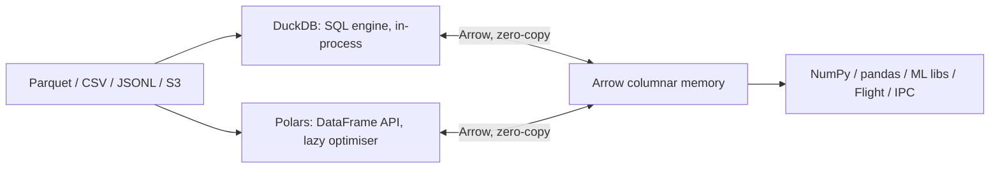

# Data tooling: Polars, DuckDB, Arrow

!!! abstract "At a glance"
    **Priority:** P1 · **Complexity:** 2/5 · **Est. time:** 2 h · **Phase:** 2 · **Prereqs:** [Pydantic v2](pydantic-v2.md), [Performance & profiling](performance-profiling.md)
    **You're done when:** you can pick between Polars, DuckDB and pandas for a task, write a lazy Polars query and the equivalent DuckDB SQL over Parquet, move data zero-copy between them via Arrow, and use these tools for eval datasets and RAG ingestion metadata.

## Why it matters

Agent and RAG engineering is data engineering in disguise: eval datasets, trace analysis, chunk metadata, token/cost analytics, feature tables for routing. Row-by-row Python (dicts + Pydantic) is fine for thousands of records and painful for millions. Polars (1.4x as of Sept 2026), DuckDB (1.5.x) and Apache Arrow (PyArrow 25.x) give columnar, multi-threaded, larger-than-RAM-capable processing with a small dependency footprint, and they release the GIL, so they compose well with asyncio and threads ([concurrency models](concurrency-models.md)). Interviews probe "when would you not use pandas" and "what is Arrow buying you".

## Core concepts

### The three layers



- **Arrow** is the columnar in-memory format and interchange standard: typed columns, validity bitmaps, contiguous buffers, and language-neutral (Python, Rust, Java, C++). It is why `df.to_arrow()` and `duckdb.sql("select * from tbl")` over an Arrow table are near-free. It also standardises IPC/Flight and Parquet reading.
- **Polars**: Rust DataFrame library with an expression API, multi-threaded execution, a **lazy** query optimiser (predicate/projection pushdown, common subexpression elimination) and a streaming engine for larger-than-memory data.
- **DuckDB**: in-process analytical SQL database ("SQLite for analytics"): vectorised, parallel, reads Parquet/CSV/JSON directly (also over HTTP/S3), and can query Python objects (Arrow tables, Polars/pandas frames) by variable name.

### Polars idioms

```python
import polars as pl

lf = (
    pl.scan_parquet("traces/*.parquet")                 # lazy: nothing read yet
    .filter(pl.col("status") == "ok")
    .with_columns(
        (pl.col("prompt_tokens") + pl.col("completion_tokens")).alias("tokens"),
        pl.col("started_at").dt.truncate("1h").alias("hour"),
    )
    .group_by("model", "hour")
    .agg(
        pl.len().alias("calls"),
        pl.col("tokens").sum().alias("tokens"),
        pl.col("latency_ms").quantile(0.99).alias("p99_ms"),
    )
    .sort("hour")
)
print(lf.explain())          # see pushdown of the filter and column projection into the scan
df = lf.collect()            # or lf.collect(engine="streaming") for larger-than-RAM
```

Habits: **expressions over `apply`/`map_elements`** (Python UDFs run row-by-row on one thread and lose the optimiser), `scan_*` over `read_*`, select only needed columns, prefer categorical/enum dtypes for low-cardinality strings, avoid iterating rows (`iter_rows`), and use `with_columns` to batch expressions (executed in parallel).

### DuckDB idioms

```python
import duckdb

con = duckdb.connect()                                   # in-memory. Use a file for persistence
con.sql("""
    select model,
           count(*)                      as calls,
           quantile_cont(latency_ms, .99) as p99_ms
    from 'traces/*.parquet'
    where status = 'ok'
    group by 1
    order by calls desc
""").show()

tbl = df.to_arrow()                                      # Polars to Arrow
top = con.sql("select model, sum(tokens) t from tbl group by 1").pl()   # result back to Polars
```

DuckDB shines for **SQL-first** analysis, joins across files, window functions, ad-hoc exploration of Parquet on S3/Azure, and as an embedded engine in tests and services. It also has extensions (`httpfs`, `azure`, `vss` for vector similarity search, `fts`) and a persistent file format. Use `con.execute(sql, params)` with **parameters, never f-string user input** into SQL.

### Choosing

| Need | Prefer |
|---|---|
| Fast DataFrame transforms in Python code, expression pipelines | Polars |
| SQL analysts, joins across many files, quick exploration | DuckDB |
| Existing ecosystem needing pandas objects (sklearn, plotting, legacy) | pandas (convert at the edge, `to_pandas()`) |
| Larger than RAM on one machine | Polars streaming or DuckDB (spills to disk) |
| Distributed (multi-node) | Spark/Ray/Dask/Trino, or a warehouse. Not these tools |
| OLTP, many small writes, concurrent writers | Postgres. DuckDB is single-writer analytics |
| Vector search at scale | pgvector/Qdrant ([vector databases](../agentic-ai/vector-databases.md)). DuckDB `vss` is fine for small local sets |

### Parquet and layout

Columnar compression and row-group statistics let engines skip data. Partition by low-cardinality keys (date, tenant) but avoid tiny files (aim for 128 MB to 1 GB files, row groups ~100k-1M rows). Zstd compression (also in Python 3.14's stdlib `compression.zstd`) is a good default. Sort by frequent filter columns to improve min/max pruning.

### Data tooling in LLM workflows

- **Eval datasets:** store cases as Parquet/JSONL with a schema (input, expected, tags, model outputs, judge scores). Polars `group_by` gives per-slice pass-rates ([evals](../agentic-ai/evals-error-analysis.md)).
- **Trace and cost analytics:** export spans/usage to Parquet, then query with DuckDB for token spend by tenant/model/route.
- **RAG ingestion:** chunk metadata tables, dedup (`unique(subset=["hash"])`), join with source metadata, and batch embed. Keep vectors in a vector DB, and metadata in columnar files as the system of record.
- **Validation at the boundary:** validate a *sample* of rows through Pydantic ([Pydantic](pydantic-v2.md)) or use Polars-native checks (`pl.col(...).is_between`, `null_count`) for full-table validation. Per-row Pydantic on 50M rows is the wrong tool.
- **Interop with async services:** run heavy queries via `asyncio.to_thread` (both release the GIL) with a bounded semaphore, and never in the event loop.

### Senior nuance

- **Eager vs lazy footguns:** calling `.collect()` early loses optimisation. Materialising a huge intermediate is the usual OOM.
- Polars strings/categoricals and joins can silently produce **cardinality explosions** (many-to-many). Assert key uniqueness (`df.select(pl.col("id").is_unique().all())`) before joins, and use `validate="1:m"` on joins.
- Null semantics differ from pandas (NaN vs null) and `None` in Python lists. Choose an explicit missing-value policy in schemas.
- **Timestamps and time zones** are a perennial bug source: store UTC, keep tz-aware dtypes, and be explicit at ingestion.
- DuckDB concurrency: one process can hold the writer lock on a file. Multiple readers OK in read-only mode. In services, treat it as an embedded analytical component, not a shared server.
- Memory: Arrow buffers live outside the Python heap, so `tracemalloc` under-reports. Use `memray` or RSS ([profiling](performance-profiling.md)).
- Version churn: Polars still evolves quickly (deprecations between minors), so pin the version and read release notes on upgrade.

## Resources

| Resource | Type | Why this one | Level | Cost |
|---|---|---|---|---|
| [Polars user guide](https://docs.pola.rs/) | docs | Expressions, lazy API and optimisation, streaming | intermediate | free |
| [Polars: lazy API](https://docs.pola.rs/user-guide/lazy/) | docs | The optimiser and `explain()` | intermediate | free |
| [Polars: coming from pandas](https://docs.pola.rs/user-guide/migration/pandas/) | docs | Concept mapping and gotchas | intermediate | free |
| [DuckDB docs](https://duckdb.org/docs/stable/) | docs | SQL dialect, extensions, Python client | intermediate | free |
| [DuckDB Python client overview](https://duckdb.org/docs/stable/clients/python/overview) | docs | Relations, Arrow/Polars integration, parameters | intermediate | free |
| [DuckDB + Polars guide](https://duckdb.org/docs/stable/guides/python/polars) | docs | Zero-copy interchange | intermediate | free |
| [Apache Arrow Python docs](https://arrow.apache.org/docs/python/) | docs | Tables, compute, Parquet, dataset API | intermediate | free |
| [Arrow columnar format spec](https://arrow.apache.org/docs/format/Columnar.html) :gem: | spec | Why zero-copy works, buffers and validity bitmaps | advanced | free |
| [Polars blog](https://pola.rs/posts/) :gem: | blog | Engine internals, benchmarks, streaming engine notes | advanced | free |
| [Itamar Turner-Trauring: Python data processing articles](https://pythonspeed.com/articles/) :gem: | article | Memory and performance for data pipelines | intermediate | free |

## Hands-on lab

**Goal (60 min):** analyse synthetic LLM traces three ways and compare.

1. `uv add polars duckdb pyarrow pandas` (or `uv run --with ...`). Generate 2M synthetic trace rows (model, tenant, status, prompt/completion tokens, latency_ms, started_at) with NumPy or Polars expressions and write to Parquet (`zstd`). Note file size.
2. Query A (Polars lazy): p99 latency and tokens per (model, hour) for `status == "ok"`. Print `lf.explain()` and confirm the filter and projection are pushed into the parquet scan.
3. Query B (DuckDB SQL): same result directly from the Parquet file.
4. Query C (pandas): same, using `read_parquet` then groupby.
5. Compare results (assert equal within tolerance), wall time and peak RSS for A/B/C. **Expected:** Polars and DuckDB are multi-core and typically several times faster than pandas on this shape, and use less memory. Record actual numbers on your machine.
6. Zero-copy: `tbl = df.to_arrow()`, then `duckdb.sql("select count(*) from tbl")`, and `pl.from_arrow(...)`. Verify no big time or RSS jump.
7. Inject a many-to-many join bug (duplicate keys in the dimension table). Observe row explosion, then add `validate="m:1"` and see the error.
8. Stretch: wrap query A in `await asyncio.to_thread(...)` inside a FastAPI endpoint with a semaphore, and confirm loop lag stays low under load.

## Questions

### L1 - Recall

??? question "Q1. What does Arrow provide that makes Polars/DuckDB interchange cheap?"
    ??? success "Answer"
        A standard columnar in-memory layout (typed contiguous buffers plus validity bitmaps). Both engines can read and produce Arrow buffers directly, so handing a table across involves no serialisation or copying of column data.

??? question "Q2. Lazy vs eager in Polars: why prefer `scan_parquet(...).collect()`?"
    ??? success "Answer"
        The lazy plan lets the optimiser push filters/projections into the scan (reading fewer row groups and columns), reorder operations, eliminate common subexpressions and choose streaming execution. Eager `read_parquet` loads everything first.

??? question "Q3. Why are `map_elements`/`apply` with Python lambdas discouraged in Polars?"
    ??? success "Answer"
        They execute row-by-row in Python, single-threaded and GIL-bound, and are opaque to the optimiser. Express the logic with native expressions, or a vectorised approach.

??? question "Q4. What kinds of workloads is DuckDB not designed for?"
    ??? success "Answer"
        High-concurrency OLTP with many small transactions and multiple writers, and distributed multi-node processing. It is an in-process analytical engine (one writer per database file).

### L2 - Apply

??? question "Q5. Translate to Polars: SQL `select carrier, count(*) n from t where delay > 24 group by carrier order by n desc`."
    ??? success "Answer"
        ```python
        (pl.scan_parquet("t.parquet")
           .filter(pl.col("delay") > 24)
           .group_by("carrier")
           .agg(pl.len().alias("n"))
           .sort("n", descending=True)
           .collect())
        ```

??? question "Q6. A join of orders (1M rows) to customers unexpectedly returns 40M rows. Cause and prevention?"
    ??? success "Answer"
        Duplicate keys in the right table cause a many-to-many join and row multiplication. Prevent with uniqueness checks before joining, `validate="m:1"` on the join (Polars raises if violated), unit tests on dimension uniqueness, and row-count assertions after joins in pipelines.

??? question "Q7. Your ETL job reads a 30 GB Parquet dataset with `pl.read_parquet` and is OOM-killed on a 16 GB box. Fix."
    ??? success "Answer"
        Switch to `scan_parquet` with column selection and filters pushed down, collect with the streaming engine (`collect(engine="streaming")`), or process by partition/row-group batches, or use DuckDB (out-of-core, spills to disk). Also cast wide string columns to categoricals, and drop unneeded columns early.

??? question "Q8. How do you run a 3-second DuckDB query from a FastAPI endpoint without hurting other requests?"
    ??? success "Answer"
        Make it non-blocking to the loop: `await asyncio.to_thread(run_query, params)` (DuckDB releases the GIL), cap concurrency with a semaphore, set a statement timeout/interrupt (`con.interrupt()` on cancellation), use read-only connections per thread/cursor, parameterised SQL only, and cache results if repeated. For heavy or long jobs, submit to a worker queue rather than serving synchronously.

### L3 - Design & trade-offs

??? question "Q9. Polars vs DuckDB vs pandas for the team's eval-analysis and trace-analytics tooling."
    ??? success "Answer"
        Polars: best for Python-centric pipelines with reusable, testable expression code and lazy optimisation. DuckDB: best where SQL fluency is broad, ad-hoc exploration, cross-file joins and using the same SQL in notebooks and services. pandas: keep for ecosystem interop (plotting, sklearn) at the edges. Standardise storage on Parquet + Arrow so tools are interchangeable, choose one primary API per pipeline (avoid mixing three in one file), and provide helpers for conversion. Decide by team skills and pipeline shape, not benchmarks alone.

??? question "Q10. Where should the system of record live for RAG chunk metadata and embeddings: Parquet, Postgres/pgvector, or a dedicated vector DB?"
    ??? success "Answer"
        Keep durable, queryable metadata and lineage (source, hash, version, ACLs) in a transactional store or as versioned Parquet snapshots. Serve vector search from pgvector/Qdrant. Parquet/DuckDB is ideal for offline analytics, backfills and evals, and reproducible dataset versions. Avoid dual-write drift: make the pipeline derive the serving index from the system of record, idempotently, keyed by content hash.

??? question "Q11. Should you validate a 50M-row dataset with Pydantic models?"
    ??? success "Answer"
        No. Per-row model construction is far too slow and memory heavy. Validate schema and invariants column-wise with Polars/DuckDB (dtype checks, null counts, ranges, uniqueness, referential checks) and use Pydantic on a sample or on the *rules definitions*. Fail the pipeline with a report and quarantine bad rows.

### L4 - Staff-level ambiguity

??? question "Q12. Analysts want self-serve access to LLM trace analytics; engineering wants to avoid building a data platform. Propose an approach."
    ??? success "Answer"
        Emit traces/usage as OTel + batch export to Parquet in object storage (partitioned by date/tenant) with a documented schema and retention/PII policy. Provide DuckDB (local or MotherDuck-like hosted) plus a few maintained SQL views/notebooks for common questions (cost by tenant/model, p99 by route, failure taxonomy). Add access control at the storage layer and column-level redaction at export. Graduate to a warehouse/lakehouse only when concurrency, governance or scale demand it ([data architecture](../architecture/data-architecture.md)). Measure: time-to-answer for analyst questions and count of ad-hoc data requests to engineering.

??? question "Q13. A team wants to replace their Spark cluster with Polars/DuckDB on a big box to save cost. Evaluate."
    ??? success "Answer"
        Profile actual data sizes and access patterns: if datasets fit on a large single node (hundreds of GB is often fine with streaming/out-of-core) and jobs are batch analytics, single-node engines can cut cost and complexity dramatically. Risks: no fault tolerance or horizontal scale, single-node ceiling, concurrency, workflow/orchestration gaps, skills and governance integration. Pilot on the 3 most expensive jobs with equivalence tests (row counts, aggregates), measure cost and runtime, keep Spark for genuinely distributed workloads, and define the ceiling that triggers re-evaluation.

## Real-world use cases

- **LLM cost dashboards:** hourly Parquet exports and a DuckDB SQL view compute tokens and spend by tenant/model.
- **Eval slicing:** Polars group-bys over 100k eval runs to locate failure clusters by prompt category and model version.
- **Document ingestion:** dedup by content hash and metadata joins with Polars before batch embedding.
- **Logistics analytics:** ETA-error analysis over billions of vessel events using DuckDB on Parquet in object storage.

## Pitfalls & anti-patterns

- Row-wise Python loops and `map_elements` on big frames.
- Early `.collect()` and reading entire files to filter a few rows.
- Joins without key uniqueness validation.
- f-string SQL with user input in DuckDB.
- Thousands of tiny Parquet files (small-file problem).
- Mixing naive and tz-aware timestamps.
- Running heavy queries on the event loop.

## Checklist

- [ ] I can explain Arrow's role and lazy vs eager execution without notes
- [ ] I ran the same analysis in Polars, DuckDB and pandas and recorded time/RSS
- [ ] I demonstrated a zero-copy hop between Polars and DuckDB
- [ ] I answered all L3 questions out loud in < 3 min each
