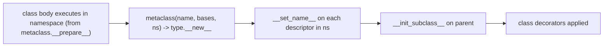

# Decorators, descriptors & metaclasses

!!! abstract "At a glance"
    **Priority:** P1 · **Complexity:** 4/5 · **Est. time:** 3 h · **Phase:** 2 · **Prereqs:** [Data model](data-model.md), [Advanced typing](typing-advanced.md)
    **You're done when:** you can write a correctly typed, async-aware decorator with arguments; implement a validating descriptor with `__set_name__`; choose `__init_subclass__` over a metaclass; and read Pydantic/SQLAlchemy/dataclass internals without fear.

## Why it matters

Frameworks are decorators, descriptors and class-creation hooks: FastAPI routes (`@app.get`), Pydantic fields and validators, SQLAlchemy columns (descriptors), dataclasses (class decorator), `functools.cached_property`, LangGraph/Pydantic AI tool registration (`@agent.tool`), pytest fixtures. A Staff engineer designs *internal* frameworks (tool registries, retry/tracing/caching wrappers, plugin systems) and must know the cheapest mechanism that works. Rule: **decorator first, `__init_subclass__` second, descriptor when per-attribute behaviour is needed, metaclass last.**

## Core concepts

### Decorators

A decorator is a callable that takes a callable and returns a replacement. `@d` above `def f` is `f = d(f)`. A decorator with arguments is a *factory*: `@retry(3)` is `f = retry(3)(f)`.

```python
import functools, inspect, time
from collections.abc import Awaitable, Callable

def traced[**P, R](fn: Callable[P, R]) -> Callable[P, R]:
    """Works for sync AND async functions; preserves signature (see typing page)."""
    if inspect.iscoroutinefunction(fn):
        @functools.wraps(fn)
        async def awrapper(*a: P.args, **k: P.kwargs):
            t = time.perf_counter()
            try:
                return await fn(*a, **k)
            finally:
                record(fn.__qualname__, time.perf_counter() - t)
        return awrapper                                    # type: ignore[return-value]
    @functools.wraps(fn)
    def wrapper(*a: P.args, **k: P.kwargs) -> R:
        t = time.perf_counter()
        try:
            return fn(*a, **k)
        finally:
            record(fn.__qualname__, time.perf_counter() - t)
    return wrapper
```

Rules:

- **Always `functools.wraps`**: preserves `__name__`, `__doc__`, `__wrapped__`, `__signature__` which FastAPI, pytest, Pydantic AI and `inspect.signature` rely on to build schemas/DI. A decorator that erases the signature breaks FastAPI dependency parsing and tool-schema generation.
- **Sync vs async**: wrapping an `async def` with a sync wrapper returns an un-awaited coroutine (silent bug: "coroutine was never awaited"). Detect with `inspect.iscoroutinefunction` (or `inspect.markcoroutinefunction` for wrappers that need to remain detectable as async).
- Decorator on methods: the wrapper becomes a function attribute, hence a non-data descriptor, so binding works. A *class-based* decorator (with `__call__`) doesn't bind as a method unless it implements `__get__`.
- Stacking order: bottom-up application (`@a @b def f` = `a(b(f))`). Order matters for `@retry` vs `@timeout` vs `@cache`.
- `functools.cache` on methods holds strong refs to `self` (memory leak, see note below). `functools.lru_cache` on async functions caches the *coroutine object* (awaitable only once), which is a classic bug; use an async-aware cache (`async-lru`, `aiocache`) or cache the result of an inner function.
- Class decorators (`@dataclass`) modify or return the class. Register-decorators return the function unchanged (`@tool`) and store metadata in a registry.

### Descriptors: the mechanism behind attributes

A descriptor is an object in a class dict with `__get__`, `__set__` and/or `__delete__`. Functions, `property`, `classmethod`, `staticmethod`, `__slots__` members and SQLAlchemy columns are all descriptors.

```python
class Bounded:
    """Reusable validated attribute (data descriptor)."""
    def __init__(self, lo: float, hi: float) -> None:
        self.lo, self.hi = lo, hi
    def __set_name__(self, owner, name: str) -> None:      # called at class creation
        self.private = f"_{name}"
        self.name = name
    def __get__(self, obj, objtype=None):
        if obj is None:
            return self                                     # class access returns the descriptor
        return getattr(obj, self.private)
    def __set__(self, obj, value: float) -> None:
        if not self.lo <= value <= self.hi:
            raise ValueError(f"{self.name} must be in [{self.lo}, {self.hi}], got {value}")
        setattr(obj, self.private, value)

class GenConfig:
    temperature = Bounded(0.0, 2.0)
    top_p = Bounded(0.0, 1.0)
    def __init__(self, temperature: float, top_p: float = 1.0) -> None:
        self.temperature, self.top_p = temperature, top_p

GenConfig(0.7); GenConfig(3.0)     # ValueError: temperature must be in [0.0, 2.0], got 3.0
```

- **Data descriptor** (defines `__set__`/`__delete__`) beats the instance `__dict__`. **Non-data descriptor** (only `__get__`) is shadowed by it. That precedence is why `cached_property` works: first access runs `__get__`, stores the value in `__dict__`, and later lookups never reach the descriptor.
- `functools.cached_property` isn't thread-safe-locked since 3.12 (lock removed): concurrent first access may compute twice, and it needs `__dict__` (breaks with `__slots__`). It also caches on the *instance*, so frozen dataclasses need care.
- `functools.cache`/`lru_cache` on an instance method keys on `self` (kept alive forever by the cache). Use a per-instance cache (`cached_property`, or create the cached function in `__init__`) for long-lived objects.

### `__init_subclass__` and `__set_name__` (replace most metaclasses)

```python
class Tool:
    registry: dict[str, type["Tool"]] = {}
    name: str

    def __init_subclass__(cls, *, name: str | None = None, **kw) -> None:
        super().__init_subclass__(**kw)
        cls.name = name or cls.__name__.lower()
        if cls.name in Tool.registry:
            raise TypeError(f"duplicate tool {cls.name!r}")
        Tool.registry[cls.name] = cls

class Search(Tool, name="web_search"): ...
class Calc(Tool): ...
print(sorted(Tool.registry))     # ['calc', 'web_search']
```

Runs on *every* subclass definition, at import time, so it's ideal for plugin and tool registries, validating subclass contracts, and auto-wiring. Import-time side effects mean **the registry only contains modules that were imported**. Make discovery explicit (entry points via `importlib.metadata`, or an explicit `register()` call).

### Metaclasses

The metaclass is the class of a class (`type` by default). `class C(metaclass=M)` calls `M(name, bases, ns)` to build `C`. Order for `Q()`: `M.__call__` then `Q.__new__` then `Q.__init__`:

```python
class M(type):
    def __call__(cls, *a, **k):
        print("meta call"); return super().__call__(*a, **k)
class Q(metaclass=M):
    def __new__(cls): print("new"); return super().__new__(cls)
    def __init__(self): print("init")
Q()      # meta call / new / init
```

Legitimate uses today: `ABCMeta` (abstract methods), `EnumMeta`, Pydantic's `ModelMetaclass` (collect fields, build the core schema), ORMs, singletons enforced at call time, DSLs with `__prepare__` (custom namespace, e.g. ordered or recording class bodies). Costs: **metaclass conflicts** (two bases with different metaclasses need a combined one), hidden magic, type-checker unfriendliness, import-time work. If `__init_subclass__`, a class decorator, or a descriptor can do it, use that.

### The class-creation pipeline



### Senior nuance

- Introspection outputs: `inspect.signature(fn)` follows `__wrapped__`, so a decorator using `wraps` still exposes the original signature. FastAPI and Pydantic AI depend on that.
- Decorator vs middleware vs explicit call: decorators hide control flow. Prefer explicit composition for anything with semantics (retries with idempotency, auth) where reviewers need to see it.
- **Type-safe decorators** need ParamSpec ([typing](typing-advanced.md)), and decorators that change the return type (`async` to `sync`) need overloads.
- 3.14 deferred annotations: descriptors/decorators that inspect `__annotations__` at decoration time may see unevaluated forward refs. Use `annotationlib.get_annotations(..., format=Format.FORWARDREF)` or call `inspect.get_annotations` lazily.
- `wrapt` (Graham Dumpleton) solves the hard cases (decorating methods/classmethods/staticmethods uniformly, preserving introspection). Reach for it when writing a library, not app code.
- Retrying decorators around LLM calls: retry only on **idempotent-safe** errors (429/5xx/timeouts before any side effect), and never wrap an entire agent step that performs tool side effects.

## Resources

| Resource | Type | Why this one | Level | Cost |
|---|---|---|---|---|
| [Descriptor HowTo Guide](https://docs.python.org/3/howto/descriptor.html) | docs | Rewrites property/methods/classmethod in pure Python. Definitive | advanced | free |
| [functools docs](https://docs.python.org/3/library/functools.html) | docs | `wraps`, `cache`, `cached_property`, `singledispatch`, `partial` | intermediate | free |
| [Python behind the scenes #7: how attributes work](https://tenthousandmeters.com/blog/python-behind-the-scenes-7-how-python-attributes-work/) :gem: | article | Attribute lookup in CPython, step by step | advanced | free |
| [Understanding Python metaclasses (Ionel)](https://blog.ionelmc.ro/2015/02/09/understanding-python-metaclasses/) :gem: | article | The clearest account of the call chain and pitfalls | advanced | free |
| [Data model: customizing class creation](https://docs.python.org/3/reference/datamodel.html) | docs | `__init_subclass__`, `__prepare__`, `__set_name__` semantics | advanced | free |
| [wrapt](https://github.com/GrahamDumpleton/wrapt) :gem: | repo | Library-grade decorators and the write-up on why naive ones fail | advanced | free |
| [Fluent Python 2e, Part V](https://www.fluentpython.com/) | book | Descriptors, class metaprogramming | advanced | paid |
| [Hynek: Subclassing in Python Redux](https://hynek.me/articles/python-subclassing-redux/) :gem: | article | When not to use inheritance hooks | advanced | free |
| [mCoding (YouTube)](https://www.youtube.com/@mCoding) :gem: | video | Metaclass and descriptor explainers | intermediate | free |

## Hands-on lab

**Goal (60-90 min):** a mini tool framework, the seed of the capstone's tool layer.

1. Implement `@tool` that registers a function, builds a JSON Schema from its signature via `inspect.signature` and `pydantic.TypeAdapter`/`create_model` (parameter descriptions from `Annotated[..., Field(description=...)]`), and preserves the function via `functools.wraps`.
2. Make `@tool` work for both `def` and `async def`; test that `inspect.iscoroutinefunction(decorated)` matches the original.
3. Add `@retry(attempts=3, on=(TimeoutError,))` typed with ParamSpec, verified with `reveal_type`.
4. Implement `Bounded` descriptor and `GenConfig` above. Run `GenConfig(3.0)`. **Expected:** `ValueError: temperature must be in [0.0, 2.0], got 3.0`.
5. Implement `Tool.__init_subclass__` registry. **Expected:** `['calc', 'web_search']`, and a duplicate raises `TypeError` at import time.
6. Reproduce the `lru_cache` memory leak: create 10,000 instances calling a cached method, `del` them, `gc.collect()`, and check with `weakref` that instances survive. Fix with `cached_property` or an instance-level cache.
7. Stretch: show the `lru_cache` async bug (`await f()` twice raises `RuntimeError: cannot reuse already awaited coroutine`).

## Questions

### L1 - Recall

??? question "Q1. What does `@d(x)` above `def f` desugar to?"
    ??? success "Answer"
        `f = d(x)(f)`. `d(x)` is evaluated first and must return the actual decorator. Stacked decorators apply bottom-up.

??? question "Q2. Data vs non-data descriptor, and who wins against the instance `__dict__`?"
    ??? success "Answer"
        Data descriptors define `__set__` and/or `__delete__` and take precedence over the instance dict. Non-data descriptors (only `__get__`, e.g. functions and `cached_property`) are shadowed by an instance dict entry.

??? question "Q3. In what order do `M.__call__`, `Q.__new__`, `Q.__init__` run for `Q()` with `metaclass=M`?"
    ??? success "Answer"
        `M.__call__` (the metaclass's call is what `Q()` invokes), which calls `Q.__new__` and then, if it returns an instance of Q, `Q.__init__`.

??? question "Q4. Why must a decorator use `functools.wraps`?"
    ??? success "Answer"
        It copies `__name__`, `__qualname__`, `__doc__`, `__module__`, `__dict__`, and sets `__wrapped__` so `inspect.signature` reports the original signature. FastAPI DI, Pydantic AI tool-schema generation, pytest fixtures and debuggers rely on this.

### L2 - Apply

??? question "Q5. This decorator makes an `async def` handler return `<coroutine object>` warnings. Fix."
    ```python
    def logged(fn):
        @functools.wraps(fn)
        def w(*a, **k):
            log(fn.__name__); return fn(*a, **k)
        return w
    ```
    ??? success "Answer"
        The wrapper is sync. It returns the coroutine un-awaited, and FastAPI won't detect the handler as async (it inspects the wrapper). Provide an async wrapper when `inspect.iscoroutinefunction(fn)`: `async def w(*a, **k): log(...); return await fn(*a, **k)`, or write two branches as in `traced` above.

??? question "Q6. What is printed?"
    ```python
    class Base:
        registry = []
        def __init_subclass__(cls, **kw):
            super().__init_subclass__(**kw); Base.registry.append(cls.__name__)
    class K1(Base): pass
    class K2(K1): pass
    print(Base.registry)
    ```
    ??? success "Answer"
        `['K1', 'K2']`. `__init_subclass__` is inherited and fires for every subclass, direct or indirect.

??? question "Q7. Memory keeps growing in a long-running service using `@lru_cache` on a method. Why and fix?"
    ??? success "Answer"
        The cache's key includes `self`, so the cache holds a strong reference to every instance ever seen, and their state, until eviction (unbounded with `@cache`). Fix: cache a module-level pure function keyed by hashable inputs, use `cached_property` for per-instance values, create the cache per instance in `__init__`, or use `weakref`-based caching.

??? question "Q8. `@functools.lru_cache` on `async def fetch(url)`: the second `await fetch(u)` raises `RuntimeError`. Why?"
    ??? success "Answer"
        The cache stores the coroutine object returned by the first call. A coroutine can be awaited only once ("cannot reuse already awaited coroutine"). Cache the *result* instead: use an async cache library, or store a `Task`/`Future` in a dict (`tasks.setdefault(key, asyncio.create_task(...))`) so concurrent callers share one in-flight computation and later ones get the result.

### L3 - Design & trade-offs

??? question "Q9. Decorator-based tool registration (`@tool`) vs subclass registry (`__init_subclass__`) vs explicit registration list for an agent framework."
    ??? success "Answer"
        Decorators: least ceremony for function tools, and schemas derive from signatures, but registration relies on import side effects and hides the tool list. Subclass registry: good when tools need lifecycle/state and a contract (validate methods at class-definition time), but inheritance-heavy. Explicit list (`Agent(tools=[search, calc])`): most visible, testable, no global state, and supports per-agent tool sets. Recommendation: decorators that *create* tool objects without global registration, plus an explicit `tools=[...]` list at composition time. Use import-time global registries only for plugin discovery via entry points.

??? question "Q10. When is a metaclass justified in 2026?"
    ??? success "Answer"
        When you must intercept class *namespace creation* (`__prepare__`), control instantiation of every class of a family (`__call__`), or synthesise class attributes before `__init_subclass__` can (e.g. an ORM/validation framework collecting field descriptors and building schemas, as Pydantic does). Costs: metaclass conflicts, opaque behaviour, type-checker friction (needs `dataclass_transform`). Otherwise use `__init_subclass__`, class decorators, or descriptors. If you do publish a metaclass-based DSL, mark it with `typing.dataclass_transform` so checkers understand it.

??? question "Q11. Where should retry, timeout, caching and tracing live: decorators, middleware, or an explicit client wrapper?"
    ??? success "Answer"
        Cross-cutting policies on a *client boundary* (LLM/HTTP) belong in a wrapper/middleware layer configured once (e.g. `httpx` transport or SDK hooks, a `ResilientLLM` decorator-pattern class implementing the same Protocol), so that semantics (idempotency, budgets, jitter) are reviewed in one place and tests can swap layers. Function decorators are convenient for small utilities, but stacked decorators obscure ordering (retry outside timeout vs inside changes worst-case latency). Prefer composable wrappers implementing the port, with decorators only as sugar over them.

### L4 - Staff-level ambiguity

??? question "Q12. A shared internal 'agent tools' library with metaclass magic is causing import-order bugs and confusing type errors across teams. Decide what to do."
    ??? success "Answer"
        Inventory what the magic provides (auto-registration, schema generation, validation). Replace import-time global registration with explicit composition (`Toolset([...])`), keep schema generation from signatures (a pure function testable in isolation), and reduce metaclass usage to `__init_subclass__` or decorators returning typed `Tool[P, R]` objects. Add `dataclass_transform` where needed. Provide a codemod for the migration, a deprecation window with warnings, snapshot tests of generated schemas to guarantee no behavioural change, and a compatibility shim. Success metric: import-order bug reports, type-check error volume, and onboarding time.

??? question "Q13. Design principles you'd publish for 'metaprogramming budget' in a 200-engineer Python org."
    ??? success "Answer"
        Ladder of least power: plain functions and composition, then decorators, then `__init_subclass__`/descriptors, then metaclasses (require design review and a typed public surface). Requirements for any magic: preserves signatures/type information (ParamSpec, `dataclass_transform`), no import-time I/O or global mutation without an explicit opt-in, deterministic and testable (unit tests for the generated artefacts), debuggable (`__wrapped__`, good reprs, clear error messages with call-site info), and documented failure modes. Track via review checklist and a small lint set. Reward deleting magic in retros.

## Real-world use cases

- **Tool layer for agents:** `@tool` derives JSON Schema from signatures and docstrings. Signature preservation is what makes the model see accurate parameters.
- **Config objects for model parameters:** `Bounded`-style descriptors validate temperature/top_p at assignment.
- **Observability:** one `@traced` decorator (sync/async aware) gives spans and metrics across 100 functions.
- **Plugin ecosystems:** `__init_subclass__` for connector registries (carrier APIs in a logistics platform), with entry points for out-of-tree plugins.

## Pitfalls & anti-patterns

- Missing `functools.wraps`; erasing signatures.
- Sync wrappers around async functions.
- `lru_cache` on methods or async functions.
- Import-time registration without deterministic import.
- Metaclass where `__init_subclass__` suffices; metaclass conflicts.
- Decorators with hidden global state (registries, singletons) that break test isolation.
- Retry decorators wrapped around non-idempotent side effects.

## Checklist

- [ ] I can explain descriptor precedence and the class-creation pipeline without notes
- [ ] I built `@tool` with schema generation for sync and async functions
- [ ] I reproduced and fixed the `lru_cache` leak
- [ ] I answered all L3 questions out loud in < 3 min each
