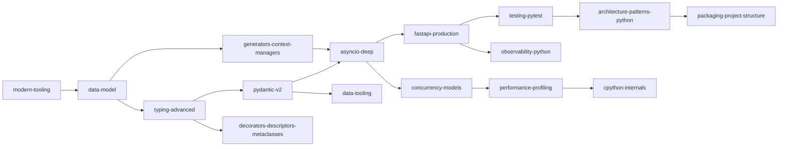

# Advanced Python

Expert-level, production and AI-engineering-relevant Python for a 15-year engineer: Python 3.13/3.14 (current 3.14.x as of Sept 2026, with 3.15 scheduled for 2026-10-01), free-threaded 3.14t, the uv/ruff/ty toolchain, Pydantic v2, FastAPI, asyncio (TaskGroups, timeouts, cancellation, backpressure), modern typing, and the performance and observability skills that keep LLM services healthy. Everything here ties back to the capstone: an async, typed, observable LLM gateway and agent platform.

!!! abstract "How to use this track"
    Phase 1 (weeks 1-4) is the core: tooling, data model, typing, Pydantic, asyncio and FastAPI. Phase 2 adds testing, generators, decorators, architecture, packaging and data tooling. Phase 4 adds observability. Phase 5 covers concurrency models, profiling and CPython internals. Do the labs; skim theory you already know and go deep on the *senior nuance* and L3/L4 questions.

## Topics

| # | Topic | Priority | Complexity | Phase | Hours |
|---|---|---|---|---|---|
| 1 | [Modern tooling: uv, ruff, ty, pre-commit](modern-tooling.md) | P0 | 1/5 | 1 | 2 |
| 2 | [Python data model & dunder protocols](data-model.md) | P0 | 3/5 | 1 | 3 |
| 3 | [Advanced typing: generics, Protocols, ParamSpec, TypedDict](typing-advanced.md) | P0 | 3/5 | 1 | 3 |
| 4 | [Pydantic v2 in depth](pydantic-v2.md) | P0 | 2/5 | 1 | 3 |
| 5 | [asyncio in depth: TaskGroups, cancellation, backpressure](asyncio-deep.md) | P0 | 4/5 | 1 | 5 |
| 6 | [Concurrency models: threads, processes, free-threaded 3.14t](concurrency-models.md) | P0 | 4/5 | 5 | 4 |
| 7 | [FastAPI for production](fastapi-production.md) | P0 | 2/5 | 1 | 3 |
| 8 | [Testing: pytest, fixtures, Hypothesis, testcontainers](testing-pytest.md) | P0 | 2/5 | 2 | 3 |
| 9 | [Iterators, generators & context managers](generators-context-managers.md) | P1 | 2/5 | 1 | 2 |
| 10 | [Decorators, descriptors & metaclasses](decorators-descriptors-metaclasses.md) | P1 | 4/5 | 2 | 3 |
| 11 | [Architecture patterns in Python (repository, UoW, message bus)](architecture-patterns-python.md) | P0 | 3/5 | 2 | 4 |
| 12 | [Packaging, project layout & monorepos](packaging-project-structure.md) | P1 | 2/5 | 2 | 2 |
| 13 | [Performance & profiling](performance-profiling.md) | P1 | 3/5 | 5 | 3 |
| 14 | [CPython internals: bytecode, GIL, memory](cpython-internals.md) | P2 | 4/5 | 5 | 4 |
| 15 | [Data tooling: Polars, DuckDB, Arrow](data-tooling.md) | P1 | 2/5 | 2 | 2 |
| 16 | [Observability in Python: structlog, OpenTelemetry](observability-python.md) | P1 | 2/5 | 4 | 2 |

Total: about 48 hours. Question bank: [Advanced Python questions](questions.md) (graded, scenarios, rapid-fire).

## Suggested path

1. **Phase 1 (core, about 19 h):** tooling, data model, typing, Pydantic, asyncio, FastAPI (generators as the bridge into asyncio).
2. **Phase 2 (structure, about 15 h):** testing, decorators, architecture patterns, packaging, data tooling.
3. **Phase 4 (operate):** observability alongside the capstone's production hardening.
4. **Phase 5 (depth, about 11 h):** concurrency models (3.14t), profiling, CPython internals.

## Books and long-form

- *Fluent Python*, 2nd ed. (Ramalho): the reference for data model, typing, generators, descriptors, concurrency. [fluentpython.com](https://www.fluentpython.com/)
- *Architecture Patterns with Python* (Percival, Gregory): free online as [Cosmic Python](https://www.cosmicpython.com/).
- *Python Concurrency with asyncio* (Fowler, Manning): [manning.com](https://www.manning.com/books/python-concurrency-with-asyncio)
- Python Behind the Scenes series :gem: ([tenthousandmeters.com](https://tenthousandmeters.com/)) and Confessions of a Code Addict :gem: ([blog.codingconfessions.com](https://blog.codingconfessions.com/)) for internals.
- David Beazley :gem: ([dabeaz.com](https://www.dabeaz.com/)), Hynek Schlawack :gem: ([hynek.me](https://hynek.me/)), mCoding :gem: ([YouTube](https://www.youtube.com/@mCoding)), ArjanCodes ([YouTube](https://www.youtube.com/@ArjanCodes)) for design and idiom.
- Typing reference: [typing.python.org](https://typing.python.org/en/latest/). Free-threading hub: [py-free-threading.github.io](https://py-free-threading.github.io/).

Curated resource metadata lives in `data/resources/python.yml`.

## Daily 15-minute reps (40 katas)

One small, runnable exercise per day. Time-box to 15 minutes, write the code from memory in a scratch file, **predict the output before running**, then check. Rotate through the list. Repeat any you fail after 3 days.

| # | Kata | Topic |
|---|---|---|
| 1 | `uv init --package` a project, add a dev group, run `uv sync --locked`, break the lock and see the error | [modern-tooling](modern-tooling.md) |
| 2 | Write a PEP 723 script with an inline dependency and run it with `uv run` | [modern-tooling](modern-tooling.md) |
| 3 | Configure ruff with `ASYNC`, `UP`, `B`; make it flag a blocking `time.sleep` in `async def` | [modern-tooling](modern-tooling.md) |
| 4 | Implement `__eq__` without `__hash__`, then fix with a frozen dataclass and put instances in a set | [data-model](data-model.md) |
| 5 | Implement `__add__`/`__radd__` for `Money` so `sum(items, start=Money.zero("USD"))` works | [data-model](data-model.md) |
| 6 | Predict: attribute lookup with a data descriptor vs instance `__dict__` (write both, check) | [data-model](data-model.md) |
| 7 | Write a `Sequence` subclass with only `__len__`/`__getitem__`; use `in`, `reversed`, `index` | [data-model](data-model.md) |
| 8 | Measure memory for 100k objects with and without `__slots__` via `tracemalloc` | [data-model](data-model.md) |
| 9 | Write `first[T](xs: Sequence[T]) -> T` and a bounded generic `max_by[T, K: ...]` (PEP 695) | [typing-advanced](typing-advanced.md) |
| 10 | Type an async retry decorator with `ParamSpec`; verify `reveal_type` keeps the signature | [typing-advanced](typing-advanced.md) |
| 11 | Define a `ChatModel` Protocol and a fake; pass it to a function typed with the Protocol | [typing-advanced](typing-advanced.md) |
| 12 | `TypedDict` + `Unpack` for `**kwargs`; trigger a type error with a misspelt key | [typing-advanced](typing-advanced.md) |
| 13 | Exhaustive `match` on a union with `assert_never`; add a member and watch the checker fail | [typing-advanced](typing-advanced.md) |
| 14 | Pydantic: lax vs strict on `"1"`, `1.0`, `True` for an `int` field; predict each | [pydantic-v2](pydantic-v2.md) |
| 15 | Build a discriminated union (`Field(discriminator=...)`) and compare its error output to a plain union | [pydantic-v2](pydantic-v2.md) |
| 16 | Print `model_json_schema()` for a tool-args model; add descriptions and a `Literal` | [pydantic-v2](pydantic-v2.md) |
| 17 | Partial-validate a truncated JSON stream with `experimental_allow_partial=True` | [pydantic-v2](pydantic-v2.md) |
| 18 | TaskGroup with one failing child: catch with `except*`, observe sibling cancellation | [asyncio-deep](asyncio-deep.md) |
| 19 | Fan out 50 fake LLM calls with `Semaphore(5)` and `asyncio.timeout`; count timeouts | [asyncio-deep](asyncio-deep.md) |
| 20 | Write a task that swallows `CancelledError`; fix it; explain the difference | [asyncio-deep](asyncio-deep.md) |
| 21 | Producer/consumer with `Queue(maxsize=2)` and `Queue.shutdown()`; print queue sizes | [asyncio-deep](asyncio-deep.md) |
| 22 | Block the loop with `time.sleep`, detect it with debug mode, fix with `to_thread` | [asyncio-deep](asyncio-deep.md) |
| 23 | Racy counter across 8 threads on 3.14t; fix with a lock; time both | [concurrency-models](concurrency-models.md) |
| 24 | Run a CPU loop with threads vs processes on 3.14 and 3.14t; tabulate | [concurrency-models](concurrency-models.md) |
| 25 | FastAPI lifespan that opens/closes an `httpx.AsyncClient`; add `/healthz` and `/readyz` | [fastapi-production](fastapi-production.md) |
| 26 | SSE endpoint streaming 10 tokens; verify with `curl -N`; add a heartbeat | [fastapi-production](fastapi-production.md) |
| 27 | Override a dependency in a test with `dependency_overrides` | [fastapi-production](fastapi-production.md) |
| 28 | Parametrized pytest for an `extract_json` function with fenced/chatty inputs | [testing-pytest](testing-pytest.md) |
| 29 | A Hypothesis property: `parse(dump(x)) == x`; let it find a shrunk counterexample | [testing-pytest](testing-pytest.md) |
| 30 | Retry test with injected `sleep` so it runs in under 50 ms | [testing-pytest](testing-pytest.md) |
| 31 | Lazy generator pipeline over a big file; assert flat memory | [generators-context-managers](generators-context-managers.md) |
| 32 | `@contextmanager` with and without `try/finally`; predict cleanup on exception | [generators-context-managers](generators-context-managers.md) |
| 33 | Break out of an async generator with and without `aclosing`; check when `finally` runs | [generators-context-managers](generators-context-managers.md) |
| 34 | A `Bounded` descriptor using `__set_name__`; validate on assignment | [decorators-descriptors-metaclasses](decorators-descriptors-metaclasses.md) |
| 35 | A decorator that supports both sync and async functions and keeps signatures (`wraps`) | [decorators-descriptors-metaclasses](decorators-descriptors-metaclasses.md) |
| 36 | `Tool.__init_subclass__` registry; raise on duplicate names | [decorators-descriptors-metaclasses](decorators-descriptors-metaclasses.md) |
| 37 | Repository Protocol + in-memory fake + a UoW context manager with rollback-by-default | [architecture-patterns-python](architecture-patterns-python.md) |
| 38 | `dis.dis` a small function; then `sys.getrefcount` and a cycle + `gc.collect()` | [cpython-internals](cpython-internals.md) |
| 39 | Polars lazy query + `explain()`; write the same in DuckDB SQL over Parquet | [data-tooling](data-tooling.md) |
| 40 | structlog JSON line with `trace_id` injected from the current OTel span; redact a secret key | [observability-python](observability-python.md) |

Kata coverage for [packaging-project-structure](packaging-project-structure.md) and [performance-profiling](performance-profiling.md) is built into the labs (build and inspect a wheel, py-spy a planted bottleneck). Swap them in for a rep whenever you like.

## Definition of done for the track

- [ ] Ship the lab gateway: uv project, ruff/ty clean, Pydantic contracts, bounded async fan-out with deadlines, SSE streaming with clean cancellation, structured logs plus traces, tests with fakes, Hypothesis and a Postgres container.
- [ ] Explain, without notes, cancellation semantics, backpressure, variance, descriptor precedence, and what free-threading changes.
- [ ] Answer every L3/L4 question in [the question bank](questions.md) out loud in under 3 minutes each.
