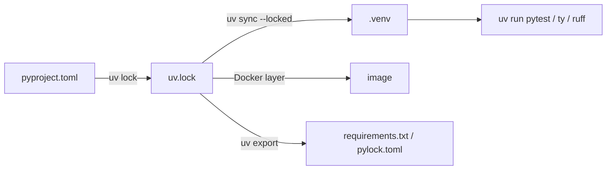

# Modern tooling: uv, ruff, ty, pre-commit

!!! abstract "At a glance"
    **Priority:** P0 · **Complexity:** 1/5 · **Est. time:** 2 h · **Phase:** 1 · **Prereqs:** none
    **You're done when:** you can bootstrap a locked, linted, type-checked Python 3.14 service repo (uv project + ruff + ty + pre-commit + multi-stage Docker) in under 10 minutes, and explain what every file in it does.

## Why it matters

Tooling is the cheapest leverage a Staff engineer has. In 2026 the Python toolchain has consolidated around Astral's Rust tools: **uv** (package/project/Python manager), **ruff** (linter + formatter), and **ty** (type checker, still beta). As of Sept 2026 the versions are roughly uv 0.12, ruff 0.16, ty 0.0.8x. OpenAI announced its acquisition of Astral on 2026-03-19; the tools remain MIT/Apache OSS, but it is a supply-chain dependency you should be able to discuss (lockfile portability, exit strategy to pip/`pylock.toml`).

Where it shows up:

- **CI minutes and developer loop.** `uv sync` on a warm cache takes well under a second, where pip + venv takes tens of seconds. `ruff check` lints a 500k-LOC monorepo in about a second.
- **Reproducibility.** `uv.lock` is a cross-platform universal lockfile, so the same file works on macOS dev laptops and linux/amd64 containers.
- **AI engineering.** Agent sandboxes and eval harnesses need fast, hermetic env creation. `uv run --with` plus PEP 723 inline-script metadata lets a coding agent run a throwaway script without polluting the environment.

## Core concepts

### uv mental model

| Concern | Old way | uv way |
|---|---|---|
| Python install | pyenv, deadsnakes | `uv python install 3.14 3.14t` |
| venv | `python -m venv` | implicit `.venv`, created on `uv sync` / `uv run` |
| deps declaration | requirements.in | `[project.dependencies]` + `[dependency-groups]` (PEP 735) |
| lock | pip-tools, poetry.lock | `uv.lock` (universal, all platforms/markers) |
| run | activate + python | `uv run pytest` (syncs first, always consistent) |
| global CLIs | pipx | `uv tool install ruff` / `uvx ruff` |
| one-off scripts | ad hoc venvs | PEP 723 `# /// script` block + `uv run script.py` |
| monorepo | hand-rolled | `[tool.uv.workspace]` members sharing one lock |
| build | setuptools/hatch | `uv build` (uv_build backend or any PEP 517 backend) |

Key commands:

```bash
uv init --package svc && cd svc          # src/ layout, pyproject, .python-version
uv python pin 3.14
uv add fastapi "pydantic>=2.12" httpx
uv add --dev pytest ruff ty              # goes into [dependency-groups].dev
uv lock --upgrade-package pydantic       # targeted upgrade
uv sync --locked                         # CI: fail if lock is stale
uv run --with rich python -c "import rich; rich.print('[bold]hi')"
uv export --format requirements-txt > requirements.txt   # escape hatch
```

**Resolution nuance:** uv resolves for *all* platforms by default (universal resolution). That is why a lock can contain forked resolutions per `sys_platform`. `--resolution lowest-direct` is a useful CI job for libraries: it proves your lower bounds are real.

### PEP 723 inline scripts: the agent-era superpower

```python
# /// script
# requires-python = ">=3.13"
# dependencies = ["httpx", "pydantic>=2.12"]
# ///
import asyncio, httpx
from pydantic import BaseModel

class Repo(BaseModel):
    full_name: str
    stargazers_count: int

async def main() -> None:
    async with httpx.AsyncClient() as c:
        r = await c.get("https://api.github.com/repos/astral-sh/uv")
        print(Repo.model_validate_json(r.content))

asyncio.run(main())
```

`uv run fetch.py` creates a cached ephemeral env. `uv add --script fetch.py rich` edits the header for you. `uv lock --script` produces a lock next to it.

### ruff

- One binary replaces flake8 + isort + pyupgrade + black (`ruff format` is black-compatible, with >99.9% identical output on most codebases) + many plugins (bugbear, pylint subset, bandit subset `S`).
- Opinionated baseline for services:

```toml
[tool.ruff]
target-version = "py314"
line-length = 100

[tool.ruff.lint]
select = ["E", "F", "W", "I", "B", "UP", "SIM", "ASYNC", "RUF", "S", "PT", "PERF", "TC"]
ignore = ["S101"]            # assert allowed in tests (or use per-file-ignores)

[tool.ruff.lint.per-file-ignores]
"tests/**" = ["S"]
```

- The `ASYNC` rules catch `time.sleep` / blocking `open()` inside `async def`, the #1 latency bug in LLM services.
- `UP` rewrites legacy typing (`List[int]` → `list[int]`, `Optional[X]` → `X | None`). Run `ruff check --fix --unsafe-fixes` once per migration.

### ty (and the type-checker landscape)

| Checker | Speed | Notes (as of Sept 2026) |
|---|---|---|
| mypy 2.x | slow-ish (daemon helps) | reference behaviour, plugin ecosystem (Django, SQLAlchemy stubs) |
| pyright / basedpyright | fast | best-in-class inference; VS Code Pylance |
| ty (Astral) | very fast, incremental | beta; strong on gradual typing, intersection types, great diagnostics; LSP built in |
| pyrefly (Meta) | very fast | 1.x; infers aggressively |

Staff-level stance: pick **one** checker for CI gating and let editors use whatever they like. Pin the checker version, because new releases routinely add errors. For a 2026 greenfield repo, ty or pyright; keep mypy if you depend on its plugins.

### pre-commit (and prek)

`pre-commit` runs hooks on staged files. `prek` is a Rust drop-in reimplementation that reads the same `.pre-commit-config.yaml`. Keep hooks **fast** (under 2 s). Put slow checks (full type-check, tests) in CI, not the commit hook, or engineers will `--no-verify`.

```yaml
repos:
  - repo: https://github.com/astral-sh/ruff-pre-commit
    rev: v0.16.9
    hooks:
      - id: ruff-check
        args: [--fix]
      - id: ruff-format
  - repo: https://github.com/astral-sh/uv-pre-commit
    rev: 0.12.19
    hooks:
      - id: uv-lock          # keeps uv.lock in sync with pyproject
```

### Docker with uv

```dockerfile
FROM python:3.14-slim AS build
COPY --from=ghcr.io/astral-sh/uv:0.12 /uv /uvx /bin/
ENV UV_COMPILE_BYTECODE=1 UV_LINK_MODE=copy UV_PYTHON_DOWNLOADS=never
WORKDIR /app
RUN --mount=type=cache,target=/root/.cache/uv \
    --mount=type=bind,source=uv.lock,target=uv.lock \
    --mount=type=bind,source=pyproject.toml,target=pyproject.toml \
    uv sync --locked --no-install-project --no-dev
COPY . .
RUN --mount=type=cache,target=/root/.cache/uv uv sync --locked --no-dev

FROM python:3.14-slim
COPY --from=build /app /app
ENV PATH="/app/.venv/bin:$PATH"
CMD ["fastapi", "run", "/app/src/svc/main.py", "--port", "8000"]
```

Why it works: deps are installed in their own layer and only rebuild when the lock changes. `UV_COMPILE_BYTECODE` trades build time for faster cold start, which matters for scale-to-zero LLM workers.



### Senior nuance

- `uv.lock` is uv-specific. **PEP 751 `pylock.toml`** is the standard lock format (`uv export --format pylock.toml`), which is your portability story.
- `requires-python` drives resolution. Setting `>=3.10` when you only test 3.14 forces uv to find versions compatible with 3.10, which can pin you to old wheels.
- Private indexes: use `[[tool.uv.index]]` with `explicit = true` so internal package names can't be hijacked from PyPI (dependency confusion).
- `uv pip` exists for legacy flows, but mixing `uv pip install` into a uv-managed project desyncs the lock. Ban it in project repos.

## Resources

| Resource | Type | Why this one | Level | Cost |
|---|---|---|---|---|
| [uv docs](https://docs.astral.sh/uv/) | docs | Authoritative; the "Concepts → Projects" section is the mental model | intermediate | free |
| [uv: running scripts (PEP 723)](https://docs.astral.sh/uv/guides/scripts/) | docs | Inline deps, script locks, shebangs | intermediate | free |
| [uv: Docker integration guide](https://docs.astral.sh/uv/guides/integration/docker/) | docs | Official multi-stage and cache-mount patterns | intermediate | free |
| [Hynek: Production-ready Docker containers with uv](https://hynek.me/articles/docker-uv/) :gem: | article | Opinionated, battle-tested Dockerfile reasoning | advanced | free |
| [ruff docs](https://docs.astral.sh/ruff/) and [rule index](https://docs.astral.sh/ruff/rules/) | docs | Choose rule families deliberately | intermediate | free |
| [ty docs](https://docs.astral.sh/ty/) | docs | Config, "coming from mypy/pyright" guide | intermediate | free |
| [PEP 723 – Inline script metadata](https://peps.python.org/pep-0723/) | spec | Understand the standard, not just the tool | intermediate | free |
| [PEP 751 / pylock.toml spec](https://packaging.python.org/en/latest/specifications/pylock-toml/) | spec | Standard lock format and your exit strategy | advanced | free |
| [James Bennett: Boring Python – dependency management](https://www.b-list.org/weblog/2022/may/13/boring-python-dependencies/) :gem: | article | Timeless principles for reproducible deps, independent of any tool | intermediate | free |
| [pre-commit](https://pre-commit.com/) / [prek](https://github.com/j178/prek) | docs | Hook framework plus fast Rust drop-in | intermediate | free |

## Hands-on lab

**Goal (45–60 min):** a capstone-ready service skeleton.

1. `uv python install 3.14 3.14t && uv init --package llm-gw && cd llm-gw && uv python pin 3.14`
2. `uv add fastapi httpx "pydantic>=2.12" structlog` and `uv add --dev pytest pytest-asyncio ruff ty`
3. Paste the ruff config above. Add a deliberately bad file:
    ```python
    import time
    from typing import List
    async def handler(xs: List[int]) -> int:
        time.sleep(1)
        return sum(xs)
    ```
4. `uv run ruff check .` should report `UP006` (List) and `ASYNC251` (blocking `time.sleep` in async function). Run `uv run ruff check --fix .` and confirm `UP006` is auto-fixed while `ASYNC251` is not (it needs a human decision: `await asyncio.sleep` or `asyncio.to_thread`).
5. `uv run ty check` should be clean. Introduce `return "x"` and see the diagnostic.
6. Add `.pre-commit-config.yaml`, then `uvx prek install` (or `uvx pre-commit install`), and commit to see hooks run.
7. Build the Dockerfile. Change only `src/` code and rebuild. **Expected:** the dependency layer is `CACHED`, and the rebuild takes seconds.
8. Stretch: write `scripts/bench_sync.sh` that times `rm -rf .venv && uv sync` (cold venv, warm cache). Record the number in your learning log.

## Questions

### L1 — Recall

??? question "Q1. What is the difference between `uv run` and activating `.venv` then running `python`?"
    ??? success "Answer"
        `uv run` first checks that the environment matches `uv.lock` (and the lock matches `pyproject.toml`), syncing if needed, then runs the command in that env. Activation does no checking, so a stale venv silently runs old deps. In CI use `uv sync --locked` (fail if the lock is stale) or `uv run --locked`.

??? question "Q2. What does PEP 723 standardise, and why does it matter for AI agents?"
    ??? success "Answer"
        A `# /// script` TOML comment block at the top of a single-file script, declaring `requires-python` and `dependencies`. Tools like uv/pipx create an ephemeral cached env. Agents and eval harnesses can then generate and run self-describing scripts without mutating a shared environment, which gives reproducibility and isolation.

??? question "Q3. Which ruff rule family catches blocking calls inside `async def`, and give two examples it flags."
    ??? success "Answer"
        `ASYNC` (flake8-async port). It flags `time.sleep` in async functions (ASYNC251), and blocking HTTP calls such as `requests.get` (ASYNC210) or blocking `open()` / subprocess calls in async code (ASYNC230 and related). These block the event loop and inflate p99 for every concurrent request.

??? question "Q4. `uv.lock` vs `pylock.toml`?"
    ??? success "Answer"
        `uv.lock` is uv's own universal lock format, carrying rich resolution info (forks per marker, workspace members). `pylock.toml` (PEP 751) is the interoperable standard any installer can consume. Use uv.lock as the source of truth and export pylock/requirements for tools or platforms that need a standard format.

### L2 — Apply

??? question "Q5. Fix this CI step, which intermittently installs different versions than dev: `pip install -r requirements.txt` where requirements.txt contains `fastapi>=0.110`."
    ??? success "Answer"
        Ranges aren't locks. Move to `pyproject.toml` + `uv lock`, commit `uv.lock`, and run `uv sync --locked --no-dev` in CI. If a requirements file is mandatory, generate it with `uv export --format requirements-txt` (hashes are included by default and pin exact artifacts) and install with `pip install --require-hashes`.

??? question "Q6. Your Docker build reinstalls all 180 dependencies on every code change. Show the minimal fix."
    ??? success "Answer"
        Split the dependency install from the project install. Bind-mount only `uv.lock` + `pyproject.toml` and run `uv sync --locked --no-install-project`, then `COPY . .` and run `uv sync --locked` again. Add `--mount=type=cache,target=/root/.cache/uv`. Now the dep layer only invalidates when the lock changes.

??? question "Q7. A teammate's pre-commit hook runs the full test suite (90 s). What do you change and why?"
    ??? success "Answer"
        Keep commit hooks under about 2 s (ruff check --fix, ruff format, uv-lock, a secrets scan). Slow hooks train people to use `--no-verify`, which defeats all hooks. Move tests and full type-check to CI (and optionally a `pre-push` stage for a fast test subset such as `pytest -m "not slow" -x`).

??? question "Q8. You need a library to prove it really works on its declared minimum versions. How with uv?"
    ??? success "Answer"
        Add a CI matrix job: `uv sync --resolution lowest-direct` (or `lowest`) and run the tests. Also test against the oldest supported Python via `uv run --python 3.11 pytest`. This catches lower bounds that were never tested.

### L3 — Design & trade-offs

??? question "Q9. mypy vs pyright vs ty as the CI gate for a 40-engineer Python org in 2026 — decide."
    ??? success "Answer"
        Criteria: plugin needs (Django/SQLAlchemy mypy plugins), speed (developer loop, CI minutes), inference strictness, maturity/stability of diagnostics, editor alignment. If you rely on mypy plugins, keep mypy for CI and allow pyright/ty in editors. Greenfield FastAPI/Pydantic services: pyright (stable, fast) or ty if you accept beta churn (pin the version, run it in "warn" mode for a quarter, and track false positives). Whatever you pick: one gate, pinned version, a baseline file or per-module strictness ratchet, and upgrades as deliberate PRs.

??? question "Q10. Monorepo with 12 services and 5 shared libs: uv workspace with one lock, or per-service locks?"
    ??? success "Answer"
        One workspace lock gives a single version of each dep (no diamond conflicts), one upgrade PR, and fast shared cache. The cost is coupling: one service needing `numpy<2` holds everyone back, and every lock change touches all services (CI fan-out). Per-service locks isolate but drift, and shared libs must support ranges. Common hybrid: one workspace for libs + services that deploy together, separate locks for outliers (ML services with CUDA pins). Pair it with affected-target CI (only test services whose dependency closure changed).

??? question "Q11. Astral was acquired by OpenAI. Your CTO asks if standardising on uv/ruff/ty is a risk."
    ??? success "Answer"
        Risk dimensions: licence (MIT/Apache, forkable), governance (vendor-controlled roadmap), lock-in (uv.lock format, uv_build backend). Mitigations: keep `pyproject.toml` standard (PEP 621/735), export `pylock.toml` periodically and test that pip can install from it, avoid uv-only features in libraries (use a standard build backend such as hatchling if you publish), and pin tool versions. The switching cost back to pip-tools + black/flake8 is days, not months, so the risk is acceptable and bounded.

### L4 — Staff-level ambiguity

??? question "Q12. Three teams use poetry, pip-tools, and conda respectively. Propose a convergence plan."
    ??? success "Answer"
        1) Write an ADR with goals (reproducible builds, CI time, security scanning, onboarding) and measure the baseline (CI minutes, lock drift incidents). 2) Pilot uv on one poetry repo (uv can read PEP 621 metadata; migrate `[tool.poetry]` → `[project]`) and publish before/after numbers. 3) Create a golden-path template (uv + ruff + chosen checker + Dockerfile + pre-commit). 4) Conda team: if they need non-Python binaries (CUDA, GDAL), keep conda/pixi for that env and don't force it. 5) Migrate opportunistically with a deprecation date and a support channel. 6) Success metric: % of repos on the template, CI p50 time, mean time to patch a CVE across repos.

??? question "Q13. Security asks for SBOMs and fast CVE patching across 60 Python repos. Design the tooling approach."
    ??? success "Answer"
        Locks are the SBOM source: `uv export --format cyclonedx1.5` (or pylock → SBOM tooling) generated in CI and attached to images. Use Dependabot/Renovate with uv support for grouped weekly updates and immediate security PRs. Run `pip-audit` / OSV scan against exported locks. Use private index proxy with `explicit` indexes to stop dependency confusion. Track "time from CVE disclosure to all prod images patched" as the org metric, and make the golden-path template the only supported way to get paved-road security.

## Real-world use cases

- **LLM gateway team:** switched pip → uv. CI went from 6 min to 1.5 min, and Docker rebuilds on code-only changes take seconds thanks to layered `--no-install-project` sync.
- **Logistics data platform monorepo:** uv workspace with shared `domain-models` (Pydantic) lib consumed by 8 services. A single lock removed "works in service A, breaks in B" version skew.
- **Agent sandbox:** a coding agent writes PEP 723 scripts and runs them with `uv run` in a gVisor sandbox. The cached wheels make each tool call about 200 ms instead of 20 s.
- **Library publishing:** `--resolution lowest-direct` CI job caught a `pydantic>=2.0` floor that actually needed 2.7 (`TypeAdapter` features).

## Pitfalls & anti-patterns

- Committing `.venv` or not committing `uv.lock` (apps should commit locks).
- `uv pip install x` inside a project, which desyncs pyproject/lock.
- Wide `requires-python` you never test.
- Enabling every ruff rule (`select = ["ALL"]`) without triage, which leads to noqa spam and people tuning out.
- Type checker unpinned in CI, so a new release breaks main overnight.
- Slow pre-commit hooks that lead to `--no-verify` culture.
- Using `latest` uv image tags in Dockerfiles (non-reproducible builds).

## Checklist

- [ ] I can explain uv's project/lock/sync/run model and universal resolution without notes
- [ ] I built the lab skeleton with a cached-dependency Docker layer
- [ ] I wrote and ran a PEP 723 script with `uv run`
- [ ] I can defend a type-checker choice for an org
- [ ] I answered all L3 questions out loud in < 3 min each
