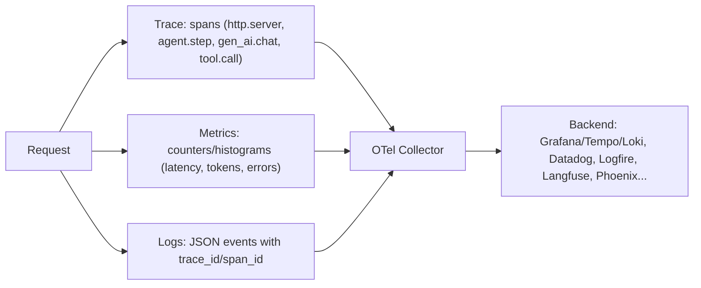

# Observability in Python: structlog, OpenTelemetry

!!! abstract "At a glance"
    **Priority:** P1 · **Complexity:** 2/5 · **Est. time:** 2 h · **Phase:** 4 · **Prereqs:** [FastAPI for production](fastapi-production.md), [asyncio in depth](asyncio-deep.md)
    **You're done when:** a FastAPI LLM service emits correlated structured logs, OTel traces (with spans for each LLM/tool call and token attributes) and RED metrics, all sharing a trace ID, with PII redaction and sane sampling, and you can debug a slow request from a trace alone.

## Why it matters

LLM systems fail in ways logs alone can't explain: a slow tool, a retry storm, a 4-step agent loop that grew to 12 steps, a prompt that ballooned tokens. You need **traces** (causality and latency by step), **metrics** (rates, latencies, tokens, cost) and **structured logs** (events with context), correlated by trace ID. OpenTelemetry (Python SDK 1.4x as of Sept 2026) is the vendor-neutral standard. The GenAI semantic conventions (`gen_ai.*` attributes) are still in **Development** status (not stable) as of mid-2026 and moved to a dedicated repo, so pin versions and expect churn. Related: [SLOs](../system-design/observability-slos.md), [LLM observability](../agentic-ai/llm-observability.md).

## Core concepts

### Three signals, one correlation key



### structlog: structured logging done right

```python
import logging, sys, structlog

def configure_logging(json: bool = True) -> None:
    shared = [
        structlog.contextvars.merge_contextvars,          # request_id, tenant, etc.
        structlog.processors.add_log_level,
        structlog.processors.TimeStamper(fmt="iso", utc=True),
        add_trace_ids,                                    # see below
        redact_pii,
    ]
    structlog.configure(
        processors=shared + [
            structlog.processors.format_exc_info,
            structlog.processors.JSONRenderer() if json else structlog.dev.ConsoleRenderer(),
        ],
        wrapper_class=structlog.make_filtering_bound_logger(logging.INFO),
        cache_logger_on_first_use=True,
    )
    logging.basicConfig(stream=sys.stdout, level=logging.INFO, format="%(message)s")   # stdlib libs

from opentelemetry import trace

def add_trace_ids(_, __, event: dict) -> dict:
    ctx = trace.get_current_span().get_span_context()
    if ctx.is_valid:
        event["trace_id"] = format(ctx.trace_id, "032x")
        event["span_id"] = format(ctx.span_id, "016x")
    return event

SENSITIVE = {"authorization", "api_key", "password", "prompt", "completion"}
def redact_pii(_, __, event: dict) -> dict:
    return {k: ("[redacted]" if k in SENSITIVE else v) for k, v in event.items()}

log = structlog.get_logger()
# per request (middleware): structlog.contextvars.bind_contextvars(request_id=..., tenant=...)
log.info("llm_call_done", model="small", prompt_tokens=812, completion_tokens=96, latency_ms=740)
```

Principles: **events, not sentences** (`llm_call_done` + fields), one JSON object per line on stdout (12-factor: the platform ships logs), `contextvars` for request-scoped fields (they propagate across `await` and into tasks ([asyncio](asyncio-deep.md))), consistent field names, log levels with meaning, and **never log raw prompts/completions/PII by default** (make it a sampled, access-controlled debug mode with redaction). Stdlib `logging` stays for libraries. Route it through structlog's `ProcessorFormatter` if you want one format.

### OpenTelemetry tracing setup (FastAPI + httpx)

```python
from opentelemetry import trace
from opentelemetry.sdk.resources import Resource
from opentelemetry.sdk.trace import TracerProvider
from opentelemetry.sdk.trace.export import BatchSpanProcessor
from opentelemetry.sdk.trace.sampling import ParentBased, TraceIdRatioBased
from opentelemetry.exporter.otlp.proto.http.trace_exporter import OTLPSpanExporter
from opentelemetry.instrumentation.fastapi import FastAPIInstrumentor
from opentelemetry.instrumentation.httpx import HTTPXClientInstrumentor

def setup_tracing(app, service: str, version: str) -> None:
    provider = TracerProvider(
        resource=Resource.create({"service.name": service, "service.version": version}),
        sampler=ParentBased(TraceIdRatioBased(0.1)),             # 10% head sampling, respect parent
    )
    provider.add_span_processor(BatchSpanProcessor(OTLPSpanExporter()))   # endpoint via OTEL_EXPORTER_OTLP_ENDPOINT
    trace.set_tracer_provider(provider)
    FastAPIInstrumentor.instrument_app(app)
    HTTPXClientInstrumentor().instrument()

tracer = trace.get_tracer("gateway.llm")

async def traced_complete(client, model: str, messages) -> str:
    with tracer.start_as_current_span("gen_ai.chat") as span:
        span.set_attribute("gen_ai.request.model", model)
        span.set_attribute("gen_ai.operation.name", "chat")
        try:
            resp = await client.complete(model, messages)
        except Exception as e:
            span.record_exception(e); span.set_status(trace.Status(trace.StatusCode.ERROR)); raise
        span.set_attribute("gen_ai.usage.input_tokens", resp.prompt_tokens)
        span.set_attribute("gen_ai.usage.output_tokens", resp.completion_tokens)
        return resp.text
```

Notes:

- Zero-code option: `opentelemetry-instrument python app.py` (auto-instrumentation) for a quick start. Explicit setup gives control.
- **Context propagation** (W3C `traceparent`) happens automatically across httpx calls when instrumented, so downstream services join the trace. In asyncio, the current span lives in a `contextvar`, so child tasks inherit the parent span at creation ([asyncio](asyncio-deep.md)). Work handed to queues needs explicit propagation (inject/extract carrier in message headers).
- `BatchSpanProcessor` exports asynchronously (in a background thread). Make sure you call `provider.shutdown()` on lifespan exit so the last spans flush.
- **Attribute names for GenAI** follow the semantic conventions (`gen_ai.request.model`, `gen_ai.usage.input_tokens` ...). They are in Development status, so check the current spec and consider an opt-in env flag (`OTEL_SEMCONV_STABILITY_OPT_IN`) per the docs when instrumentation libraries change names.
- Span design for agents: one span per agent run, child spans per **step**, and under each `gen_ai.chat` and `tool.call`. Attach `step_index`, `tool.name`, `retry_count`, finish reason. Do **not** put prompt/completion text in span attributes by default (size, PII). Use span *events* or a separate gated log if needed.

### Metrics that matter for LLM services

| Metric | Type | Labels (keep cardinality low!) |
|---|---|---|
| `http.server.request.duration` | histogram | route, method, status class |
| `llm.request.duration` | histogram | provider, model, outcome |
| `llm.tokens` | counter | direction (input/output), model, tenant tier |
| `llm.cost.usd` | counter | model, tenant tier |
| `llm.retries`, `llm.rate_limited` | counter | provider, model |
| `agent.steps` | histogram | agent, outcome |
| `event_loop.lag` | histogram | service |
| `inflight.requests` | up-down counter | route |

**Cardinality kills metrics backends**: never label by user ID, prompt hash, or free-form strings. Put those in traces/logs. Use exemplars (trace IDs on histogram buckets) to jump from a p99 spike to a trace.

### Sampling

- **Head sampling** (decide at trace start, e.g. 10%): cheap, but drops rare errors. **Tail sampling** (Collector decides after seeing the whole trace: keep errors, slow traces, and a baseline %) keeps the interesting ones at the cost of a stateful Collector tier.
- For LLM apps, keep 100% of errors, high-latency, high-cost and flagged traces, and sample the rest. Agent traces are big (dozens of spans), so budget storage.

### Logfire, Langfuse, Phoenix

Pydantic Logfire (OTel-native) provides an opinionated setup (`logfire.configure()`, `logfire.instrument_fastapi(app)`, Pydantic AI integration) and is a quick way to see agent traces. Langfuse (OSS, acquired by ClickHouse Jan 2026) and Arize Phoenix are LLM-specific trace/eval UIs that ingest OTel. They complement a general APM. Keep your instrumentation OTel-native so backends stay swappable ([LLM observability](../agentic-ai/llm-observability.md)).

### Senior nuance

- **Log-trace correlation is the highest-ROI thing**: without `trace_id` in logs, you have three silos.
- Don't block on telemetry: exporters must be async/batched with bounded queues and drop-on-overflow. A dead collector must not take down your service (test it: kill the collector under load).
- structlog's `cache_logger_on_first_use=True` plus `contextvars` are the right defaults for async apps. Avoid thread-locals.
- Uvicorn's access log duplicates instrumentation. Disable or format it (`--no-access-log`) to avoid double logging and to keep PII out of URLs.
- Instrument at boundaries (HTTP in/out, DB, queue, LLM, tool), not every function. Overhead per span is small (microseconds) but not zero at 1000s of spans per request.
- Error handling: `record_exception` plus status ERROR on the span, but *log once* at the boundary that handles the error to avoid duplicate error logs at every layer.
- PII/compliance: define what may enter telemetry (prompts often contain customer data). Redact at the SDK processor level (span processors/log processors), not at the backend.
- Free-threaded 3.14t and OTel: check that the SDK and exporters (protobuf/grpc wheels) are compatible before enabling.

## Resources

| Resource | Type | Why this one | Level | Cost |
|---|---|---|---|---|
| [structlog docs](https://www.structlog.org/en/stable/) | docs | Processors, bound loggers, stdlib integration | intermediate | free |
| [structlog: logging best practices](https://www.structlog.org/en/stable/logging-best-practices.html) :gem: | docs | Opinionated, production-tested guidance | intermediate | free |
| [structlog: contextvars](https://www.structlog.org/en/stable/contextvars.html) | docs | Request-scoped context in async code | intermediate | free |
| [OpenTelemetry Python](https://opentelemetry.io/docs/languages/python/) | docs | SDK, instrumentation and exporters | intermediate | free |
| [OTel Python: getting started](https://opentelemetry.io/docs/languages/python/getting-started/) | tutorial | Working baseline | beginner | free |
| [FastAPI instrumentation](https://opentelemetry-python-contrib.readthedocs.io/en/latest/instrumentation/fastapi/fastapi.html) | docs | Options: exclusions, hooks, metrics | intermediate | free |
| [GenAI semantic conventions](https://opentelemetry.io/docs/specs/semconv/gen-ai/) | spec | Current attribute names and status | advanced | free |
| [Pydantic Logfire: FastAPI integration](https://pydantic.dev/docs/logfire/integrations/web-frameworks/fastapi/) | docs | Fast path to agent traces, OTel-native | intermediate | free |
| [The Twelve-Factor App: Logs](https://12factor.net/logs) | article | Why stdout event streams | beginner | free |
| [Honeycomb blog](https://www.honeycomb.io/blog) :gem: | blog | Best writing on high-cardinality observability and debugging by traces | intermediate | free |

## Hands-on lab

**Goal (75-90 min):** instrument the lab gateway.

1. `uv add structlog opentelemetry-sdk opentelemetry-exporter-otlp-proto-http opentelemetry-instrumentation-fastapi opentelemetry-instrumentation-httpx`.
2. Add `configure_logging()`, a middleware binding `request_id`/`tenant` via `contextvars`, and `setup_tracing` (sampler at 100% for the lab).
3. Run a local collector + UI: any OTLP-capable backend works (Grafana LGTM docker image, Jaeger, or Logfire free tier). Send traces via `OTEL_EXPORTER_OTLP_ENDPOINT`.
4. Add `traced_complete` around the fake upstream call with token attributes. Drive load. **Expected:** each request shows a trace `POST /v1/ask` → `gen_ai.chat` → httpx client span, and log lines carry the same `trace_id`.
5. Force upstream 503 for 20% of calls with retries. **Expected:** trace shows retry spans (or events) and `llm.retries` counter increments. Filter traces by error to find them.
6. Add the `loop_lag_probe` from [performance](performance-profiling.md) as a histogram, then put a `time.sleep(0.2)` in a handler and observe lag alerts and the culprit in traces (long span with no child spans).
7. Kill the collector during load. **Expected:** requests still succeed (no blocking), with export errors logged at most once per interval.
8. Redaction test: log a dict containing `authorization` and `prompt`. **Expected:** `[redacted]` in output.

## Questions

### L1 - Recall

??? question "Q1. Name the three observability signals and what each is best for."
    ??? success "Answer"
        Traces: causality and per-step latency across services. Metrics: aggregated rates, latencies and saturation, cheap for alerting and SLOs. Logs: detailed discrete events with context. Correlate them via trace/span IDs.

??? question "Q2. Why use `contextvars` with structlog in an async app?"
    ??? success "Answer"
        Context variables are per-task and propagate across `await` and into child tasks, unlike thread-locals (which are shared by all coroutines on a thread). `structlog.contextvars.merge_contextvars` then adds request-scoped fields to every log line safely.

??? question "Q3. Head vs tail sampling?"
    ??? success "Answer"
        Head sampling decides at trace start (cheap, random), and may drop rare errors/slow requests. Tail sampling decides after the trace completes (in a Collector), so it can keep all errors and slow traces, but it needs stateful buffering and more infrastructure.

??? question "Q4. Why should metric labels not include user IDs or prompt text?"
    ??? success "Answer"
        Unbounded label cardinality multiplies time series, exploding memory/cost in the metrics backend and degrading queries. Put high-cardinality identifiers in traces/logs, and use bounded labels (route, model, status class, tenant tier) for metrics.

### L2 - Apply

??? question "Q5. Logs and traces exist, but you can't find the trace for a failing request from a log line. What's missing and how do you add it?"
    ??? success "Answer"
        Correlation IDs: add a structlog processor that reads `trace.get_current_span().get_span_context()` and injects `trace_id`/`span_id` (hex formatted) into every event, and make sure logging happens inside the active span context (not in a detached task without context). Also return the trace ID in an error response header so support can cite it.

??? question "Q6. p99 latency alerts fire, and traces show `POST /v1/ask` 4 s long with a 0.4 s LLM child span and no other children. Interpretation?"
    ??? success "Answer"
        Time is spent in un-instrumented code inside the handler or waiting before/after the LLM call: event-loop blocking, CPU work (validation/serialisation), queue wait for a semaphore, or threadpool starvation. Add spans around semaphore acquisition and serialisation, check the loop-lag metric, and profile with py-spy ([performance](performance-profiling.md)).

??? question "Q7. Your service leaks customer emails through logged request payloads. Fix systemically."
    ??? success "Answer"
        Redact in a structlog processor (and an OTel log/span processor) using an allow-list of loggable fields per event rather than a deny-list, never log raw bodies by default, hash or tokenise identifiers when correlation is needed, sample and gate debug payload logging behind access controls and TTL, add tests that assert sensitive keys never reach the renderer, and scan logs in CI/staging with detectors. Also turn off uvicorn access logs that include query strings.

??? question "Q8. After adding a tracing SDK, shutdown drops the last spans. Why and fix?"
    ??? success "Answer"
        `BatchSpanProcessor` buffers and exports in the background. If the process exits before the flush, spans are lost. Call `provider.force_flush()`/`provider.shutdown()` in the FastAPI lifespan shutdown and keep the termination grace period long enough for export.

### L3 - Design & trade-offs

??? question "Q9. Full-fidelity LLM tracing (prompts and completions in spans) vs metadata only. Decide."
    ??? success "Answer"
        Full content is invaluable for debugging and evals but carries PII/secret risk, storage cost (KBs to MBs per trace) and compliance obligations. Default to metadata (model, tokens, latency, finish reason, tool names, hashes) plus IDs linking to a separate, access-controlled, TTL'd content store where captured content is sampled (errors, low eval scores, opted-in tenants). Make capture configurable per environment/tenant, redact on ingest, and document retention. Production incidents usually need content for a small slice, not for all traffic.

??? question "Q10. Vendor APM (Datadog etc.) vs OTel + open-source stack (Grafana LGTM) vs LLM-specific tools (Langfuse/Phoenix/Logfire)?"
    ??? success "Answer"
        Instrument with OTel regardless (portability). Backend choice: existing enterprise APM gives one pane of glass for the whole estate and on-call workflows, but cost scales with volume and LLM-specific views (prompt diffs, eval scores, session views) may be weaker. OSS stack gives control and cost predictability with ops burden. LLM-specific tools give prompt/eval/session UX and dataset workflows. Common pattern: OTel Collector fanning out to the enterprise APM (infra/SLOs) and an LLM observability tool (quality/debugging), with consistent trace IDs. Re-evaluate as GenAI conventions stabilise.

??? question "Q11. How would you observe a multi-step agent whose runs last minutes and involve async tool calls via queues?"
    ??? success "Answer"
        One trace per run with a root span, and child spans per step, but for queue hops propagate context in message headers (inject/extract) and use span links where causality is not strictly parent-child. For very long runs, avoid a single open span held for minutes (export issues): emit step spans as they finish and add run-level attributes/metrics (steps, cost, outcome) at completion, and log run ID everywhere. Use a run-ID-based view in the backend for sessions. Metrics for SLOs: run success rate, steps per run, time-to-first-token for interactive parts.

### L4 - Staff-level ambiguity

??? question "Q12. 20 Python services have inconsistent logging (print, stdlib, JSON of various shapes) and no traces. Plan the rollout."
    ??? success "Answer"
        Ship a shared `observability` package in the golden-path template ([FastAPI](fastapi-production.md)): one `configure()` that sets structlog JSON, trace-ID injection, redaction, OTel SDK/exporters from env vars, FastAPI/httpx/DB instrumentation, and loop-lag metrics. Define the log schema and span naming conventions (short doc). Roll out service by service (start with the highest-traffic and the on-call pain leaders), with a checklist gate in PRs. Central Collector with tail sampling and cost controls. Measure adoption, MTTR on incidents, % of requests with trace IDs in logs, and telemetry cost per service. Provide dashboards-as-code per service type.

??? question "Q13. Telemetry cost is now 30% of the cloud bill after adding agent traces. What do you do?"
    ??? success "Answer"
        Attribute cost by signal and service (span volume, log GB, metric series). Apply tail sampling (keep errors/slow/high-cost + 1-5% baseline), reduce span granularity (collapse noisy internal spans, drop health-check traces), enforce metric cardinality budgets, shorten retention for debug logs, move verbose content to cheaper object storage with TTL, and compress/batch exports. Establish per-team budgets and dashboards so cost is visible, and review during design. Verify debugging capability with fire drills, since cost cuts that blind on-call are false economy.

## Real-world use cases

- **LLM gateway:** per-request trace with retry and fallback spans reveals provider-level degradation, and token/cost metrics by tenant tier drive chargeback.
- **Agent platform:** run/step span hierarchy identifies steps that balloon token usage and a tool that adds 3 s p95.
- **Logistics booking API:** trace IDs surfaced in error responses reduced support escalation time.
- **Compliance-driven redaction:** processor-level redaction plus tests satisfied a data-protection review for LLM logs.

## Pitfalls & anti-patterns

- Logging prompts/completions/PII raw.
- High-cardinality metric labels.
- No trace-log correlation.
- Blocking or unbounded telemetry export.
- Spans for every function; instrumenting nothing at boundaries.
- Duplicate error logs at every layer.
- Head-sampling only, and losing all the rare failures.
- Treating GenAI semantic conventions as stable and hardcoding names everywhere.

## Checklist

- [ ] I can explain traces vs metrics vs logs and how they're correlated
- [ ] I instrumented the lab service and found a slow/failed request from its trace alone
- [ ] I verified the service survives a dead collector and redacts sensitive fields
- [ ] I answered all L3 questions out loud in < 3 min each
