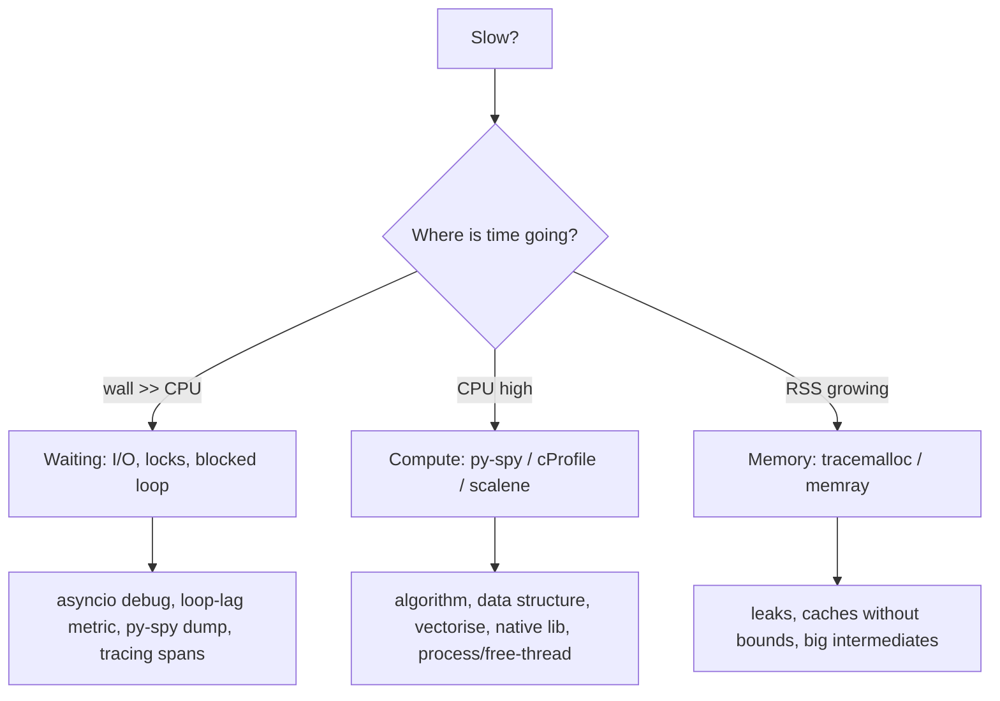

# Performance & profiling

!!! abstract "At a glance"
    **Priority:** P1 · **Complexity:** 3/5 · **Est. time:** 3 h · **Phase:** 5 · **Prereqs:** [asyncio in depth](asyncio-deep.md), [CPython internals](cpython-internals.md)
    **You're done when:** given a slow Python service you can localise the bottleneck (CPU vs I/O vs loop-blocking vs memory) with the right profiler in under 30 minutes, propose a fix with a measured before/after, and explain why the fix works at the CPython level.

## Why it matters

In LLM systems the model call dominates latency, so teams skip performance work, until the service collapses at 200 RPS because JSON serialisation, Pydantic validation, tokenisation, or one blocking call in the event loop eats the CPU. Tail latency, cost (pods) and cold-start time are all Python-level problems. The Staff skill is **measure first, classify the bottleneck, then pick the cheapest lever** (algorithm, data structure, batching, caching, native library, concurrency model), not "rewrite in Rust".

## Core concepts

### Method: classify before optimising



Always get a **repeatable benchmark** and record baseline numbers. Without them you're guessing.

### Tool selection

| Question | Tool | Notes |
|---|---|---|
| What is this running process doing right now? | `py-spy dump --pid N`, `py-spy top` | Sampling, attaches without code changes, low overhead. Works on production pods (needs ptrace capability) |
| Where is CPU time? (flame graph) | `py-spy record -o flame.svg --pid N` | Add `--native` for C extensions, `--gil` to see only GIL holders |
| Line-level and CPU vs memory vs GPU | `scalene` | Also separates Python time from native time and copy volume |
| Deterministic call counts/timings of a script | `cProfile` + `snakeviz`/`pstats` | Adds overhead (2-3x) and biases towards call-heavy code |
| Readable wall-time tree, async-aware | `pyinstrument` | Sampling. Good for FastAPI request profiling via middleware |
| Memory allocations by line | `tracemalloc` (stdlib), `memray` | memray gives flame graphs and tracks native allocations |
| Micro-benchmarks | `timeit`, `pyperf` | pyperf does calibration, multiple processes, and statistical checks |
| Linux perf integration | `python -X perf` (3.12+) | Lets Linux `perf` see Python function names (3.12+; see the HOWTO) |
| Bytecode-level | `dis` | Explains why a rewrite is faster ([CPython internals](cpython-internals.md)) |

Note on 3.15: a dedicated `profiling` package (PEP 799) with a sampling profiler (`profiling.sampling`) is planned for Python 3.15, released around 2026-10-01. It's not available on 3.14, so use py-spy now.

### Event-loop health (async services)

- Symptom: p99 spikes across *all* endpoints, CPU on one core at 100%, low overall CPU.
- Detect: a loop-lag probe:

```python
import asyncio, time

async def loop_lag_probe(interval: float = 0.1, report=print) -> None:
    while True:
        t = time.perf_counter()
        await asyncio.sleep(interval)
        lag = time.perf_counter() - t - interval
        if lag > 0.05:
            report(f"loop lag {lag*1000:.0f} ms")     # export as a histogram metric in production
```

- Localise with `py-spy dump` (which coroutine/function is on-CPU) or `asyncio.run(main(), debug=True)` ("Executing <Task...> took 0.510 seconds").
- Fix: `to_thread`, process pool, or algorithmic fix ([asyncio](asyncio-deep.md)).

### CPython-level performance intuition (verified on 3.14.5, Apple silicon)

| Micro-fact | Measured | Takeaway |
|---|---|---|
| `x in list` (10k items) vs `x in set` | 106 us vs 0.05 us | Data structure choice beats micro-tuning by 1000x+ |
| loop with `append` vs list comprehension (10k items) | 291 us vs 253 us | Comprehensions ~13% faster (bytecode specialisation, no method lookup) |
| 100k small objects: plain class vs `__slots__` | 9.6 MB vs 5.6 MB | Slots save ~40% memory per small instance |
| `s += str(i)` in a loop (20k) vs `"".join` | 2.2 ms vs 1.7 ms | CPython optimises in-place concat when refcount is 1, so it's not quadratic *here*, but that is an implementation detail. Use `join` |

Re-run these in your environment (lab). Numbers shift with version, CPU and build flags.

Version notes: 3.11 (specializing adaptive interpreter, "faster CPython"), 3.12 (comprehension inlining, perf trampoline), 3.13 (experimental JIT and free-threaded builds), 3.14 (tail-call interpreter with Clang 19+ builds, roughly 3-5% on pyperformance, opt-in; JIT still experimental; free-threaded penalty ~5-10%). Upgrading Python is a cheap, real speedup. Measure with your workload.

### Levers, in order of leverage

1. **Algorithm and data structure** (sets/dicts, avoid O(n²), heap/bisect, precompute).
2. **Do less**: cache (bounded!), batch calls (embedding 64 texts per request), avoid repeated (de)serialisation, don't validate trusted data twice, stream instead of materialising.
3. **Vectorise / native**: NumPy, Polars, DuckDB, orjson/msgspec, `pydantic-core` (already Rust), tokenizers-rs ([data tooling](data-tooling.md)).
4. **Concurrency model**: asyncio for I/O, processes or free-threaded threads for CPU ([concurrency models](concurrency-models.md)).
5. **Startup/import time**: `python -X importtime`, lazy imports (PEP 810 explicit lazy imports arrive in 3.15), `defer_build` for Pydantic models, `UV_COMPILE_BYTECODE`, trim dependencies. Matters for serverless/scale-to-zero LLM workers.
6. **Extensions**: Cython, mypyc, PyO3/maturin (Rust), only for proven hot loops after 1-5.

### JSON and validation costs (LLM services)

- Big response bodies: serialise once, avoid Pydantic→dict→JSON hops (`model_dump_json`), consider `orjson`/`msgspec` for hot paths after measuring.
- `model_validate_json` on bytes is faster than `json.loads` + `model_validate` (measured ~30% on a 50-item model in 3.14/2.13, see [Pydantic](pydantic-v2.md)).
- Logging at DEBUG with large prompts: string formatting cost is paid even if the log is dropped unless you use lazy `%s` args or `isEnabledFor` guards.

### Memory

- `tracemalloc.take_snapshot()` diffs find growth by line. `memray run -o out.bin app.py` then `memray flamegraph out.bin`.
- Typical leaks: unbounded `lru_cache`/dict caches, per-request `AsyncClient`s, retained exceptions/tracebacks (frames keep locals alive), global lists of message histories, `@cache` on methods, reference cycles with `__del__`.
- Fragmentation and RSS not shrinking after peaks is normal (allocator behaviour), and not always a leak. Compare `tracemalloc` (Python heap) to RSS.
- GC note: 3.14.0-3.14.4 shipped an incremental GC that was **reverted in 3.14.5** because of memory-pressure reports. 3.14.5+ uses the generational GC from 3.13. `gc.freeze()` after warm-up (pre-fork) reduces copy-on-write churn. Tune thresholds only with evidence.

### Senior nuance

- Profilers lie differently: cProfile inflates function-call-heavy code, sampling profilers miss short-lived functions, and `time.perf_counter` micro-benchmarks lie about cache effects. Triangulate.
- **Benchmark in production-like conditions**: same Python build/flags (PGO/LTO builds vs distro builds differ by 10%+), same data shape, warmed caches. Docker `python:3.14-slim` is a PGO build. Alpine (musl) has had different perf and wheel availability.
- Tail latency: look at p99/p999, GC pauses, noisy neighbours, connection-pool exhaustion, and DNS. Use tracing spans to attribute time by phase (queue wait, validation, LLM, post-processing) ([observability](observability-python.md)).
- A faster function that runs once per request behind a 2 s LLM call is irrelevant. Attribute by *share of the request*, not by hotspot aesthetics.
- Amdahl: if serialisation is 8% of CPU, a 2x speedup buys 4%. Focus on the biggest slice.

## Resources

| Resource | Type | Why this one | Level | Cost |
|---|---|---|---|---|
| [py-spy](https://github.com/benfred/py-spy) | tool | Sampling profiler for live production processes | intermediate | free |
| [Scalene](https://github.com/plasma-umass/scalene) | tool | CPU + memory + native/Python split per line | intermediate | free |
| [memray](https://github.com/bloomberg/memray) | tool | Best memory profiler, including native allocations | intermediate | free |
| [pyinstrument](https://github.com/joerick/pyinstrument) | tool | Readable async-aware wall-clock profiles | intermediate | free |
| [Python perf profiling support](https://docs.python.org/3/howto/perf_profiling.html) | docs | `perf` with Python frames | advanced | free |
| [pyperf](https://pyperf.readthedocs.io/en/latest/) | docs | Trustworthy benchmarking methodology | advanced | free |
| [Itamar Turner-Trauring: Python speed and memory articles](https://pythonspeed.com/articles/) :gem: | article | Practical, data-processing-oriented performance writing | intermediate | free |
| [What's New in 3.14 (performance sections)](https://docs.python.org/3/whatsnew/3.14.html) | docs | Version-by-version interpreter changes | intermediate | free |
| [tracemalloc docs](https://docs.python.org/3/library/tracemalloc.html) | docs | Stdlib memory tracing | intermediate | free |
| [Pydantic performance tips](https://pydantic.dev/docs/validation/latest/concepts/performance/) | docs | Validation hot-path guidance | intermediate | free |

## Hands-on lab

**Goal (90 min):** find and fix three planted bottlenecks in one service.

1. Create a FastAPI endpoint `/score` that (a) loads a 50k-item `list` of allowed IDs and checks `id in allowed` for 2,000 IDs, (b) calls `time.sleep(0.05)` inside `async def`, (c) builds a 5 MB response with `json.loads(json.dumps(...))` round trips.
2. Load test with `hey -z 20s -c 50` or locust and note p50/p99 baseline.
3. `uvx py-spy record -o flame.svg --pid <uvicorn pid>` and `py-spy dump`. **Expected:** the flame graph shows `list.__contains__` (a) and `time.sleep` (b) dominating, plus JSON time (c).
4. Add `loop_lag_probe`, and observe lag ~50 ms bursts under load from (b).
5. Fix one at a time, re-measure after each (list to set: 100 us to 0.05 us per lookup at 10k items; sleep to `await asyncio.sleep` or `to_thread`; serialise once). Record the table: baseline, after each fix, p99.
6. Memory: add an unbounded dict cache keyed by prompt. Run `memray`/`tracemalloc` snapshots before/after 10k requests and find the growth line.
7. `python -X importtime -c "import app" 2> imports.txt` and sort by cumulative time to find the slowest import. Try lazy-importing it.
8. Stretch: run the same benchmark on 3.13 and 3.14 and compare.

## Questions

### L1 - Recall

??? question "Q1. Sampling vs deterministic profilers: trade-offs?"
    ??? success "Answer"
        Deterministic (cProfile) hooks every call/return: exact call counts but 2-3x overhead and distortion towards call-heavy code. Sampling (py-spy, pyinstrument, scalene) periodically inspects stacks: low overhead, safe on production, statistically accurate for long-running hotspots, but can miss very short functions.

??? question "Q2. Why is `x in some_list` a red flag in a hot path?"
    ??? success "Answer"
        It's O(n) linear scan. On 10k items it took ~106 us vs ~0.05 us for a set in our measurement (2,000x+). Use a set/dict for membership, or `bisect` on sorted data.

??? question "Q3. What does `python -X importtime` tell you and why does it matter for AI services?"
    ??? success "Answer"
        Per-module import time (self and cumulative). Heavy imports (torch, transformers, pandas, large Pydantic model graphs) dominate cold start in serverless/scale-to-zero and slow CLI tools and tests. Fix with lazy imports, dependency trimming and `defer_build`.

??? question "Q4. Which memory tool tracks native (C/Rust extension) allocations?"
    ??? success "Answer"
        `memray` (and scalene to a degree). `tracemalloc` tracks only allocations made through Python's allocator, so it can miss memory held by native libraries.

### L2 - Apply

??? question "Q5. p99 doubles on all endpoints every few seconds, but CPU is 35% overall. Diagnose."
    ??? success "Answer"
        Classic event-loop blocking (one core saturated in a single-threaded loop, low aggregate CPU on multi-core pods). Add a loop-lag probe to confirm, use `py-spy dump`/record to find the blocking function (sync SDK call, big JSON, CPU loop, regex backtracking), and move it to `to_thread`/process pool or fix the algorithm. ruff `ASYNC` rules prevent recurrence.

??? question "Q6. Memory grows ~50 MB/hour in a FastAPI service. Walk through finding the cause."
    ??? success "Answer"
        Confirm it's Python heap vs native/fragmentation by comparing RSS to `tracemalloc`. Take snapshots at intervals (`tracemalloc.take_snapshot().compare_to(...)`) or run `memray attach`/`memray run --live`. Look for unbounded caches (`lru_cache(maxsize=None)`, module dicts), per-request clients/sessions, retained exception tracebacks, and conversation histories in globals. Fix with bounded caches (TTL/LRU), lifespan-scoped clients, and eviction. Verify with a soak test.

??? question "Q7. Rewrite for speed and explain: `result = ''; for r in rows: result += fmt(r)`."
    ??? success "Answer"
        `"".join(fmt(r) for r in rows)` (or a list then join). Repeated concatenation may be optimised in CPython when the refcount is 1 (so not always quadratic), but that's an implementation detail that fails for attributes/other refs and other interpreters. Join is O(n) by design and slightly faster (1.7 ms vs 2.2 ms on 20k items in our test).

??? question "Q8. A benchmark shows function A 8% faster than B with `timeit` number=1000 once. Do you ship the change?"
    ??? success "Answer"
        Not on that evidence. Repeat with `pyperf` or multiple `timeit.repeat` runs, look at min and variance, use realistic inputs, warm caches, pinned CPU frequency, and compare on the production Python build. An 8% microbenchmark delta is often noise and rarely matters unless it's a large share of request time.

### L3 - Design & trade-offs

??? question "Q9. Service is CPU-bound in Pydantic validation and JSON at 3k RPS. Options and order of attack?"
    ??? success "Answer"
        1) Confirm with py-spy (share of CPU). 2) Remove redundant work: validate once at the edge, skip validating internal trusted models, return pre-serialised bytes. 3) Use `model_validate_json` (bytes) and avoid dict hops, reuse TypeAdapters, drop Python-level validators. 4) Evaluate `orjson`/`msgspec` for hot serialisation only. 5) Scale out (more pods) if cheaper than engineering time. 6) If still bound: process pool or 3.14t threads for CPU parts, or a Rust extension for the single hottest transform. Each step with before/after numbers and a cost per 1k requests.

??? question "Q10. Rewrite a hot Python loop in Rust (PyO3) vs use Polars/NumPy vs Cython vs leave it. Decide."
    ??? success "Answer"
        First, is the loop expressible as vectorised ops? Polars/NumPy usually win with the least maintenance. If it's irregular logic (parsers, custom scoring), PyO3/maturin gives large speedups (10-100x) with memory safety, but adds a toolchain, wheels matrix (including `cp314t`), and hiring/skills cost. Cython: fewer new-language concerns for Python teams but weaker safety and tooling. Leave it if it's <5% of request time. Decide with profile share × speedup vs maintenance cost, and keep the pure-Python implementation as the tested reference.

??? question "Q11. How should performance be part of CI for a service with strict p99 targets?"
    ??? success "Answer"
        Deterministic micro-benchmarks for critical functions (pyperf/pytest-benchmark) with generous thresholds and trend tracking rather than hard gates (CI noise), a load-test smoke stage on a pinned environment measuring p50/p99 and allocation, a loop-lag and RSS soak in nightly runs, and production SLO dashboards with regression alerts after deploys. Profile-in-prod (py-spy on demand, continuous profiling with Pyroscope-like tools) to attribute regressions. Bench data shapes should mirror production.

### L4 - Staff-level ambiguity

??? question "Q12. Cloud bill for the Python AI platform is up 60% QoQ. Leadership asks you to 'make it faster'. Approach?"
    ??? success "Answer"
        Reframe to cost per unit of value. Break down cost by service, component and resource (compute vs LLM tokens vs vector DB). LLM spend usually dominates: caching, model routing, prompt trimming ([cost & latency](../agentic-ai/cost-latency-optimization.md)) beat CPU tuning. For compute: continuous profiling across the top-5 services, find shared hot paths (serialisation, validation, logging), fix in the shared library for org-wide gains, right-size pods (CPU limits vs loop-bound single-thread), and upgrade Python (3.12 to 3.14 free wins). Set a target (cost per 1k requests) and report weekly with attribution.

??? question "Q13. Two teams disagree: 'rewrite the hot service in Go' vs 'optimise Python'. Structure the decision."
    ??? success "Answer"
        Define success metrics (p99, cost per request, team velocity). Profile to establish where time goes and the theoretical ceiling from optimisations (Amdahl). Estimate optimisation results (algorithmic, native libs, 3.14t) with prototypes measured on production traffic replay. Estimate rewrite cost (months of dual-run, loss of the Python AI ecosystem, hiring, on-call ownership) and risk. Often the answer is "optimise + extract one CPU-heavy component". Rewrites are justified when CPU-bound work dominates, the ceiling in Python is insufficient, and the team can own the new stack. Document in an ADR with revisit criteria.

## Real-world use cases

- **Chat gateway p99 regression:** loop-lag metric plus py-spy found synchronous tiktoken-style tokenisation on the loop. Moved to a thread pool, p99 dropped 60%.
- **Ingestion cost:** switching from per-document Pydantic validation to batched Arrow/Polars transforms cut CPU by 5x for tabular metadata.
- **Cold starts:** lazy imports and trimming a transitive dependency cut worker start from 9 s to 3 s, enabling scale-to-zero.
- **Memory leak:** unbounded prompt-cache dict in a long-lived agent process, found via tracemalloc diff, replaced by TTL LRU.

## Pitfalls & anti-patterns

- Optimising without a profile or baseline.
- Micro-optimising code that's <5% of request time.
- Profiling in dev with tiny data, then extrapolating.
- Trusting cProfile numbers for I/O-heavy async code.
- Unbounded caches as "quick fixes".
- Assuming `--workers N` fixes a blocked loop (it hides it).
- Ignoring Python/interpreter upgrades as a cheap lever.

## Checklist

- [ ] I can pick the right profiler for CPU / wall / memory / loop-lag problems
- [ ] I ran the lab, recorded baseline vs after-fix numbers for three bottlenecks
- [ ] I read a py-spy flame graph and a `tracemalloc` diff
- [ ] I answered all L3 questions out loud in < 3 min each
