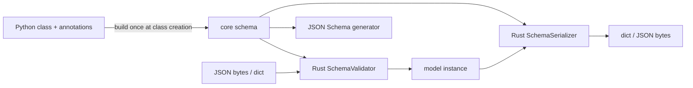

# Pydantic v2 in depth

!!! abstract "At a glance"
    **Priority:** P0 · **Complexity:** 2/5 · **Est. time:** 3 h · **Phase:** 1 · **Prereqs:** [Advanced typing](typing-advanced.md), [Data model](data-model.md)
    **You're done when:** you can design Pydantic models for an LLM structured-output pipeline (discriminated unions, validators, strict boundaries, JSON Schema tuned for models, partial/streaming validation, retry-on-error) and explain the performance model of pydantic-core.

## Why it matters

Pydantic is the **schema backbone of Python AI engineering** (Pydantic 2.13 as of Sept 2026). FastAPI request/response models, Pydantic AI outputs and tools, the OpenAI/Anthropic SDKs' typed responses, LangChain structured output, Instructor, DSPy typed signatures and pydantic-settings configs all use it. An LLM returns untrusted JSON. Pydantic is where "probably-right text" becomes "typed, validated domain objects", and its JSON Schema is what the model sees as the contract. Staff-level questions: strict vs lax at which boundary, schema design that improves model accuracy, validation cost at 10k RPS, and v1 → v2 migration strategy.

## Core concepts

### Architecture: pydantic-core



- Schema build happens **once** per class or `TypeAdapter`. It is expensive (milliseconds for big models), so never create `TypeAdapter`s per request.
- Validation runs in Rust. v2 is typically 5–50x faster than v1.
- `model_validate_json(bytes)` parses and validates in one pass in Rust (jiter). It beats `json.loads` + `model_validate` (about 30% faster in a quick 50-item benchmark on 3.14, and more for big payloads) and avoids building intermediate Python dicts.

### The API surface you use daily

| Task | v2 API |
|---|---|
| validate dict / JSON | `Model.model_validate(d)`, `Model.model_validate_json(s)` |
| dump | `m.model_dump(mode="json", exclude_none=True, by_alias=True)`, `m.model_dump_json()` |
| copy | `m.model_copy(update={...}, deep=True)` (**does not validate** `update`) |
| schema | `Model.model_json_schema(mode="validation" \| "serialization")` |
| non-model types | `TypeAdapter(list[Item]).validate_json(...)` |
| skip validation | `Model.model_construct(**trusted)` (**no validation at all**) |
| config | `model_config = ConfigDict(extra="forbid", frozen=True, strict=True, ...)` |

### Lax vs strict

Lax (the default) coerces: `"1"` → `1`, `True` → `1`, `2.0` → `2`, but `1.5` → error (`int_from_float`). Strict rejects type mismatches.

```python
from pydantic import BaseModel, ConfigDict, Field
from typing import Annotated

class Amount(BaseModel):
    model_config = ConfigDict(strict=True)
    cents: int
    currency: Annotated[str, Field(pattern=r"^[A-Z]{3}$")]
```

**Where to use which:** strict for internal service-to-service contracts and tool arguments you control, where silent coercion hides bugs. Lax for human- or LLM-produced input, where `"42"` for an int is benign, *but* add constraints (`ge`, `pattern`, `Literal`) so coercion can't smuggle nonsense. Per-call: `Model.model_validate(d, strict=True)`.

### Validators

```python
from pydantic import BaseModel, field_validator, model_validator, AfterValidator
from typing import Annotated, Self

def upper(v: str) -> str: return v.upper()
Port = Annotated[str, AfterValidator(upper)]          # reusable, composable

class Quote(BaseModel):
    origin: Port
    destination: Port
    lines: list[float]
    total: float

    @field_validator("lines", mode="after")
    @classmethod
    def non_negative(cls, v: list[float]) -> list[float]:
        if any(x < 0 for x in v):
            raise ValueError("negative line amount")
        return v

    @model_validator(mode="after")
    def totals_match(self) -> Self:
        if abs(sum(self.lines) - self.total) > 0.01:
            raise ValueError("lines do not sum to total")
        return self
```

Modes: `before` (raw input, normalisation), `after` (typed value, invariants, preferred), `wrap` (around inner validation, fallbacks and timing), `plain` (replace validation). **Annotated validators** are reusable across models and keep models thin.

Senior nuance: raise `ValueError`/`AssertionError` (become `ValidationError`) or `PydanticCustomError` for typed error codes. Never raise `ValidationError` directly. Validator error messages are **fed back to the LLM** in retry loops, so write them for a model to act on ("lines do not sum to total: 12.5 != 13.0").

### Discriminated (tagged) unions

```python
from typing import Annotated, Literal
from pydantic import BaseModel, Field

class SearchAction(BaseModel):
    kind: Literal["search"]
    query: str

class BookAction(BaseModel):
    kind: Literal["book"]
    shipment_id: str
    carrier: Literal["MAEU", "MSCU", "CMDU"]

class Final(BaseModel):
    kind: Literal["final"]
    answer: str

type Action = Annotated[SearchAction | BookAction | Final, Field(discriminator="kind")]

class AgentStep(BaseModel):
    thought: str = Field(description="One short sentence of reasoning")
    action: Action
```

Why: O(1) dispatch instead of trying each member (smart mode), **one precise error** instead of N errors, and a JSON Schema with `oneOf` + `discriminator` that models follow much better. For LLM structured outputs this is *the* pattern for agent actions.

### JSON Schema for LLMs

- `model_json_schema()` output is what providers' structured-output modes consume. Docstrings become `description`, and `Field(description=...)` becomes per-field guidance. **These are prompts.**
- Provider strict modes (OpenAI `strict: true`, Anthropic structured outputs, Gemini `response_schema`) support only a JSON Schema *subset*. Usual constraints: all fields required, `additionalProperties: false`, limited `pattern`/`format`, restricted recursion. SDK helpers transform Pydantic schemas for you. Know what gets dropped (e.g. `ge`/`le` may be stripped), and **re-validate the response with Pydantic anyway**.
- Customise with `json_schema_extra`, `GenerateJsonSchema` subclasses, or `WithJsonSchema`.
- Prefer `Literal`/Enum over free strings, flat over deeply nested, and short field names with good descriptions.

### Structured output with validation retry (provider-agnostic)

```python
from pydantic import BaseModel, ValidationError

async def extract[T: BaseModel](llm, schema: type[T], prompt: str, max_retries: int = 2) -> T:
    messages = [{"role": "user", "content": prompt}]
    for attempt in range(max_retries + 1):
        raw = await llm.complete(messages, response_schema=schema.model_json_schema())
        try:
            return schema.model_validate_json(raw)
        except ValidationError as e:
            if attempt == max_retries:
                raise
            messages += [
                {"role": "assistant", "content": raw},
                {"role": "user", "content": f"Fix these validation errors and return only JSON:\n{e.errors(include_url=False)}"},
            ]
    raise AssertionError("unreachable")
```

That is essentially what Pydantic AI's output validation / `ModelRetry` and Instructor do. Cap retries, because each one is a full LLM call (cost and latency).

### Streaming: partial validation

LLM streams arrive as incomplete JSON. `TypeAdapter.validate_json(..., experimental_allow_partial=True)` (2.10+, still "experimental" as of 2.13) validates the complete prefix and drops the incomplete trailing item:

```python
from typing import TypedDict, NotRequired
from pydantic import TypeAdapter

class Item(TypedDict):
    sku: str
    qty: NotRequired[int]

ta = TypeAdapter(list[Item])
print(ta.validate_json('[{"sku":"a","qty":2},{"sku":"bo', experimental_allow_partial=True))
# [{'sku': 'a', 'qty': 2}]
```

Nuance (verified on 2.13): a BaseModel item with a missing *required* field in the trailing position raises rather than being dropped. Use TypedDicts with `NotRequired` for the streamed shape, then validate the final complete object against the strict model.

### Serialization

- `@field_serializer`, `@model_serializer`, `PlainSerializer` in `Annotated`.
- `mode="json"` converts datetimes, UUIDs and Decimals to JSON-safe types.
- `@computed_field` includes properties in dumps and serialization schema.
- `exclude`, `SecretStr` (masked in repr and dumps), and `Field(exclude=True)` for internal fields. Critical for not leaking API keys into traces and logs.

### pydantic-settings

```python
from pydantic import SecretStr
from pydantic_settings import BaseSettings, SettingsConfigDict

class Settings(BaseSettings):
    model_config = SettingsConfigDict(env_prefix="GW_", env_file=".env", env_nested_delimiter="__")
    llm_base_url: str
    llm_api_key: SecretStr
    max_concurrency: int = 32
    request_timeout_s: float = 30.0
```

Fail fast at boot on misconfig, with secrets masked. Also supports secrets directories and custom sources (Azure Key Vault, etc.).

### Performance numbers of thumb

- Reuse `TypeAdapter`s at module level. Schema build per request can cost milliseconds.
- `model_validate_json` > `json.loads` + `model_validate`.
- `list[Model]` validation of 10k small objects is on the order of milliseconds. It is rarely the bottleneck next to an LLM call (hundreds of ms to seconds), but it matters in data pipelines. Use Polars/Arrow for bulk tabular data ([data tooling](data-tooling.md)).
- Avoid `wrap` validators and Python-level `before` validators on hot fields. They drop back into Python.
- `defer_build=True` in config speeds import time for apps with hundreds of models (serverless cold starts).

### v1 → v2 migration map

`.dict()` → `model_dump`, `.json()` → `model_dump_json`, `parse_obj` → `model_validate`, `@validator` → `@field_validator`, `@root_validator` → `@model_validator`, `Config` class → `model_config = ConfigDict(...)`, `orm_mode` → `from_attributes`, `__root__` → `RootModel`. The `pydantic.v1` shim namespace allows incremental migration. Per the Pydantic 2.12 release notes the shim is not supported on Python 3.14+ (simple models may still import and run, but don't bet production on it), so finish the migration before upgrading Python.

## Resources

| Resource | Type | Why this one | Level | Cost |
|---|---|---|---|---|
| [Pydantic docs](https://pydantic.dev/docs/validation/latest/get-started/) | docs | Official. Concepts section is excellent | intermediate | free |
| [Validators](https://pydantic.dev/docs/validation/latest/concepts/validators/) | docs | Modes, Annotated validators, ordering | intermediate | free |
| [Unions (smart vs discriminated)](https://pydantic.dev/docs/validation/latest/concepts/unions/) | docs | The union algorithm, essential for agent actions | advanced | free |
| [Performance tips](https://pydantic.dev/docs/validation/latest/concepts/performance/) :gem: | docs | Short, high-signal list from the maintainers | advanced | free |
| [JSON Schema](https://pydantic.dev/docs/validation/latest/concepts/json_schema/) | docs | Customising the schema the LLM sees | advanced | free |
| [Experimental features (partial validation)](https://pydantic.dev/docs/validation/latest/concepts/experimental/) | docs | Streaming JSON validation | advanced | free |
| [Pydantic AI: output](https://pydantic.dev/docs/ai/core-concepts/output/) | docs | Structured output and retry patterns in an agent framework | intermediate | free |
| [Pydantic: Steering LLMs with structured outputs](https://pydantic.dev/articles/llm-intro) :gem: | article | Why schemas beat prompts for reliable extraction | intermediate | free |
| [Hynek: Serialization (domain vs wire models)](https://hynek.me/articles/serialization/) :gem: | article | Argues for separating domain models from wire models. A needed counterweight | advanced | free |
| [Migration guide](https://pydantic.dev/docs/validation/latest/get-started/migration/) | docs | v1 → v2 mapping | intermediate | free |

## Hands-on lab

**Goal (60–90 min):** a validated invoice-extraction pipeline (feeds the capstone's document-processing path).

1. Model `Invoice` with `Annotated` reusable types (`Currency`, `NonNegMoney`), a discriminated union of `LineItem` kinds (`freight`, `surcharge`, `tax`), a `model_validator` enforcing totals, and `ConfigDict(extra="forbid")`.
2. Print `Invoice.model_json_schema()`. Remove anything your target provider's strict mode rejects (check its docs), and add `description`s.
3. Implement the `extract()` retry loop with a `FakeLLM` that returns invalid JSON first (total mismatch), then valid JSON. **Expected output:** attempt 1 fails with `Value error, lines do not sum to total`, attempt 2 returns an `Invoice`, 2 LLM calls logged.
4. Swap `FakeLLM` for a real model (Ollama or your provider) on 5 sample invoice texts. Record success rate at attempt 1 vs after retry.
5. Benchmark: `timeit` of `model_validate_json(raw)` vs `model_validate(json.loads(raw))` on a 50-line invoice, 5,000 iterations. **Expected:** `model_validate_json` wins (about 25–40% on 3.14 in our run).
6. Streaming: feed the JSON in 20-char chunks to a partial `TypeAdapter(list[LineItemTD])` and print the growing list.

## Questions

### L1 — Recall

??? question "Q1. What does this print?"
    ```python
    class M(BaseModel):
        x: int
        tags: list[str] = []
    print(M.model_validate({"x": "1"}), M(x=1).tags is M(x=2).tags)
    ```
    ??? success "Answer"
        `x=1 tags=[] False`. Lax mode coerces `"1"` to `1`. Unlike a plain class or dataclass, Pydantic copies mutable defaults per instance, so the lists are distinct.

??? question "Q2. `M(x=1.5)` where `x: int` — result? And `M(x=2.0)`? And `M(x=True)`?"
    ??? success "Answer"
        `1.5` raises `ValidationError` (`int_from_float`, fractional part). `2.0` gives `x=2` (exact float allowed in lax). `True` gives `x=1` (bool → int allowed in lax). In strict mode all three fail.

??? question "Q3. Name the four validator modes and when you'd use each."
    ??? success "Answer"
        `before`: raw input normalisation (strip, parse a legacy format). `after`: invariants on typed values (the default choice). `wrap`: run code around the inner validator (fallback defaults, catching errors, timing). `plain`: fully replace Pydantic's validation for that field.

??? question "Q4. What do `model_copy(update=...)` and `model_construct()` have in common that bites people?"
    ??? success "Answer"
        Neither validates. `model_copy(update={"x": "oops"})` happily sets `x` to a string on an `int` field. `model_construct` builds from trusted data with no checks. Use `Model.model_validate({**m.model_dump(), **changes})` when the update is untrusted.

### L2 — Apply

??? question "Q5. Fix: an API creates `TypeAdapter(list[Event])` inside the request handler and p99 went up 8 ms."
    ??? success "Answer"
        Building a TypeAdapter builds the core schema and Rust validator every call. Hoist it to module level (`EVENTS = TypeAdapter(list[Event])`) or cache it with `functools.cache` keyed by type. Then use `EVENTS.validate_json(body)` directly on raw bytes.

??? question "Q6. An LLM returns `{"action": {"kind": "book", "shipment_id": "S1", "carrier": "MAERSK"}}` for the `AgentStep` model above. How many errors and what message does the model get back?"
    ??? success "Answer"
        With a discriminated union: one error at `action.book.carrier`, `literal_error`, "Input should be 'MAEU', 'MSCU' or 'CMDU'". Without the discriminator, smart-mode union would report errors from every member (search: missing query; book: literal; final: missing answer), which is noisy and confuses the retry prompt. Feed `e.errors(include_url=False)` back to the model.

??? question "Q7. Your settings class logs itself at startup and API keys leak into logs. Fix it."
    ??? success "Answer"
        Type secrets as `SecretStr`. The repr and `model_dump()` show `'**********'`, and you call `.get_secret_value()` only at the point of use. Also add `Field(exclude=True)` or `repr=False` for other sensitive fields, and never log `model_dump(mode="python")` of request objects containing PII without a redaction serializer.

??? question "Q8. Write a reusable `Annotated` type `Iso3Currency` that uppercases, validates 3 letters, and shows `pattern` in JSON Schema."
    ??? success "Answer"
        ```python
        from typing import Annotated
        from pydantic import BeforeValidator, Field
        Iso3Currency = Annotated[str, BeforeValidator(lambda v: v.upper() if isinstance(v, str) else v),
                                 Field(pattern=r"^[A-Z]{3}$", description="ISO-4217 code")]
        ```
        Use `BeforeValidator` so uppercasing happens before the pattern check. Reuse it across models.

### L3 — Design & trade-offs

??? question "Q9. One Pydantic model for API, DB and LLM schema, or separate models per layer? Decide for a quoting service."
    ??? success "Answer"
        A single model couples three rates of change: API contract (versioned, public), persistence (migrations), and LLM schema (tuned descriptions, flattened, Literal-heavy). Changing a description to improve model accuracy shouldn't change your public API. Recommendation: domain model (dataclass or frozen Pydantic), API DTOs, and LLM output models, with explicit mapping functions. Accept the boilerplate for decoupling. For small internal tools, one model is fine. Revisit when a second consumer appears. (Hynek argues for this separation.)

??? question "Q10. Strict vs lax validation for tool-call arguments produced by an LLM."
    ??? success "Answer"
        LLMs often emit `"3"` for ints or `"true"` for bools, and lax mode absorbs benign drift, reducing retries (cost and latency). But lax can hide real errors (e.g. `"2024-13-01"` fails anyway, while `1.0` for an ID int passes). Use lax parsing plus tight semantic constraints (`Literal`, `ge/le`, patterns) plus provider strict structured outputs where available (grammar-constrained decoding makes type errors rare). Use strict for tools with side effects (payments, bookings), where you'd rather fail and ask again than coerce.

??? question "Q11. At 20k RPS, profiling shows 18% CPU in Pydantic validation of a large nested response model. Options?"
    ??? success "Answer"
        1) Don't validate what you produced yourself: for trusted internal outputs, construct directly or use `model_construct`, or return `Response` with pre-serialised JSON. 2) Use `model_validate_json` on bytes instead of dict round-trips. 3) Remove Python `before`/`wrap` validators on hot paths (move them to Annotated Rust-backed constraints). 4) Validate at the edge once, not at every internal hop. 5) If the payload is tabular/bulk, use Arrow/Polars or msgspec for that path. 6) FastAPI: declare `response_model` wisely, since it re-validates or serialises output. Measure with py-spy before and after ([performance](performance-profiling.md)).

### L4 — Staff-level ambiguity

??? question "Q12. 25 services are still on Pydantic v1 (some via `pydantic.v1`), and the platform wants Python 3.14. Plan the migration."
    ??? success "Answer"
        Constraint: the `pydantic.v1` shim is officially unsupported on 3.14+, so migration effectively blocks the Python upgrade. Plan: inventory (grep for `pydantic.v1`, `.dict(`, `@validator`, `orm_mode`), rank by traffic and risk, and apply the `bump-pydantic` codemod plus manual review of validators (semantics changed: `always`, `pre`, `each_item`). Add contract snapshot tests (JSON Schema and dump outputs) *before* migrating, so behaviour diffs are visible, especially coercion changes (v2 no longer coerces int → str). Shared-libs-first ordering. Timebox, and migration office hours. Track: services on v2, 3.14 adoption.

??? question "Q13. Product wants 'guaranteed valid JSON' from LLM extraction across 3 providers. What do you commit to and how do you architect it?"
    ??? success "Answer"
        You can guarantee *schema-valid* output (provider constrained decoding plus Pydantic re-validation plus bounded retries plus a fallback path), not *correct* output. Architecture: a single Pydantic schema per task, a provider adapter that transforms it to each provider's supported subset (tested with snapshot tests), validation plus retry with error feedback (max 2), and on failure a dead-letter queue for human review. Measure first-pass validity, post-retry validity, and field-level accuracy on a labelled eval set ([evals](../agentic-ai/evals-error-analysis.md)). Semantic checks (totals match, dates plausible) live in `model_validator`s. Communicate SLOs as "99.x% schema-valid, Y% field accuracy on eval set".

## Real-world use cases

- **Document processing (bills of lading, invoices):** LLM extraction into discriminated-union line items, with validators enforcing totals, and failures routed to human review.
- **Agent step parsing:** `AgentStep` with a discriminated `action` union makes the orchestrator's `match` exhaustive and type-safe.
- **Config at scale:** pydantic-settings with `env_nested_delimiter` across 40 microservices. Misconfig fails at boot, not at the first request.
- **Event contracts:** frozen, `extra="forbid"` models for Kafka events, with JSON Schema published to a schema registry for Java consumers.

## Pitfalls & anti-patterns

- Creating `TypeAdapter`s or models dynamically per request.
- Trusting LLM JSON without re-validation even with "strict" provider modes.
- Validation logic scattered in endpoints instead of model or Annotated validators.
- `model_copy(update=...)` with untrusted data.
- Giant god-models reused across API, DB and LLM layers.
- `extra="allow"` on inbound contracts (silently accepts typos).
- Error messages useless to a model in retry loops.
- Not pinning Pydantic minor versions in libraries with complex validators (behaviour tweaks land in minors).

## Checklist

- [ ] I can explain lax vs strict, validator modes, and discriminated unions without notes
- [ ] I built the extraction pipeline with a validation retry loop and measured first-pass validity
- [ ] I benchmarked `model_validate_json` vs `json.loads` + `model_validate`
- [ ] I answered all L3 questions out loud in < 3 min each
