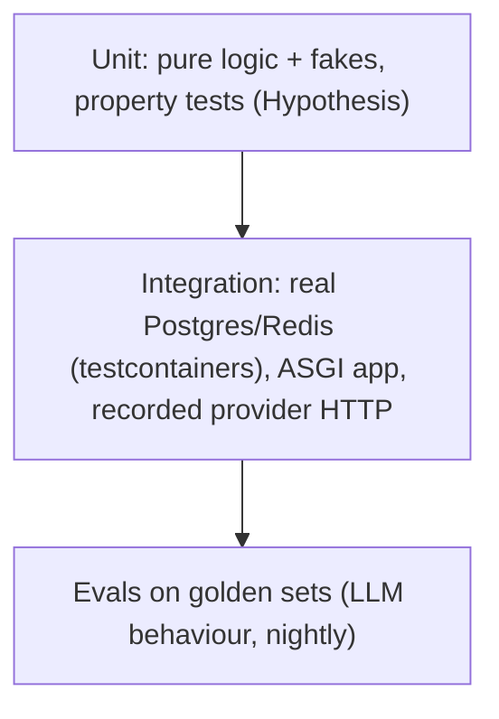

# Testing: pytest, fixtures, Hypothesis, testcontainers

!!! abstract "At a glance"
    **Priority:** P0 · **Complexity:** 2/5 · **Est. time:** 3 h · **Phase:** 2 · **Prereqs:** [FastAPI for production](fastapi-production.md), [Advanced typing](typing-advanced.md)
    **You're done when:** you can build a test pyramid for an LLM-backed service (fast unit tests with fakes, property tests for parsers/reducers, real-Postgres integration tests via testcontainers, recorded-HTTP tests for provider contracts) that runs in under 2 minutes in CI and doesn't flake.

## Why it matters

LLM systems are non-deterministic at the edge and deterministic everywhere else. The Staff move is to **make the deterministic 95% rigorously tested** (parsers, reducers, retry logic, routing, prompt assembly, tool dispatch, SQL) so that the non-deterministic 5% (model behaviour) can be covered by evals ([evals](../agentic-ai/evals-error-analysis.md)) instead of flaky unit tests. Pytest 9.x, Hypothesis 6.x, and testcontainers-python are the stack. Interview questions probe fixture scoping, async testing, determinism, mocking philosophy and flaky-test triage.

## Core concepts

### The pyramid for an LLM service



### Pytest fundamentals that matter

- **Fixtures** are dependency injection for tests: scoped `function` (default), `class`, `module`, `session`. Use the widest scope that is safe (immutable or reset), because containers and app startup are expensive.
- `yield` fixtures for teardown. `tmp_path`, `monkeypatch`, `capsys`, `caplog` built in.
- `conftest.py` hierarchy shares fixtures without imports.
- **Parametrize** for tables of cases (`@pytest.mark.parametrize`, with `ids=`). Combine with `pytest.param(..., marks=pytest.mark.xfail)`.
- Markers (`slow`, `integration`) and `-m "not integration"` for the fast inner loop. Register markers with `--strict-markers`.
- Useful plugins: `pytest-xdist` (`-n auto`), `pytest-randomly` (catches order dependence), `pytest-asyncio` 1.x, `pytest-cov`, `pytest-recording`/`vcrpy` (record and replay HTTP), `dirty-equals`, `inline-snapshot` (snapshot tests that write themselves).

```python
import pytest

@pytest.fixture(scope="session")
def pg():                                            # expensive, shared, then reset per test
    from testcontainers.postgres import PostgresContainer
    with PostgresContainer("postgres:17-alpine") as c:
        yield c.get_connection_url()

@pytest.fixture
def db(pg):
    conn = connect(pg); conn.begin()
    yield conn
    conn.rollback()                                   # per-test isolation via rollback

@pytest.mark.parametrize("raw, expected", [
    ('{"a": 1}', {"a": 1}),
    ('```json\n{"a": 1}\n```', {"a": 1}),             # LLMs wrap JSON in fences
    ('Sure! {"a": 1}', {"a": 1}),
], ids=["plain", "fenced", "chatty"])
def test_extract_json(raw, expected):
    assert extract_json(raw) == expected
```

### Async tests

`pytest-asyncio` 1.x: set `asyncio_mode = "auto"` in config, so `async def test_*` and async fixtures just work. Watch **loop scope** (fixture loop scope vs test loop scope must match, or you get "attached to a different loop" errors with session-scoped async clients). For streaming: assert on the chunks list, and test disconnect by cancelling the consumer task and checking the upstream fake saw `aclose()`.

### Fakes over mocks

- Prefer **hand-written fakes** (an in-memory `FakeChatModel` implementing your Protocol, [typing](typing-advanced.md)) over `unittest.mock` patching import paths. Fakes are typed, reusable and test behaviour, and mocks test implementation.
- Patch at **your** boundary (your `LLMClient` port), never deep in SDK internals.
- `unittest.mock.create_autospec(Class, spec_set=True)` when you must mock, so signature drift fails tests.
- Time: inject a clock or use `freezegun`/`time-machine`. For asyncio sleeps, fake the sleep function (inject `sleep=`), so retry tests run instantly.

```python
class ScriptedModel:
    """Returns scripted replies; records calls. Implements ChatModel."""
    def __init__(self, *replies: str | Exception) -> None:
        self.replies, self.calls = list(replies), []
    async def complete(self, messages, **kw) -> str:
        self.calls.append(messages)
        r = self.replies.pop(0)
        if isinstance(r, Exception):
            raise r
        return r

async def test_retries_then_succeeds():
    m = ScriptedModel(TimeoutError(), TimeoutError(), "ok")
    assert await with_retries(m.complete, [{"role": "user", "content": "x"}], sleep=no_sleep) == "ok"
    assert len(m.calls) == 3
```

### Property-based testing with Hypothesis

Generate inputs, assert invariants, and let shrinking find the minimal counterexample. Ideal for **parsers, serialisers, reducers, chunkers, pagination, money math, state machines**.

```python
from hypothesis import given, strategies as st

@given(st.text(min_size=1), st.integers(50, 500), st.integers(0, 49))
def test_chunker_invariants(text, size, overlap):
    chunks = chunk(text, size=size, overlap=overlap)
    assert "".join(c[overlap:] if i else c for i, c in enumerate(chunks)) == text   # lossless
    assert all(len(c) <= size for c in chunks)                                       # bounded

@given(st.builds(Invoice, total=st.decimals(0, 1e6, places=2)))
def test_roundtrip(inv):
    assert Invoice.model_validate_json(inv.model_dump_json()) == inv
```

- Stateful testing (`RuleBasedStateMachine`) for caches, queues, reducers.
- Configure profiles (`settings.register_profile("ci", max_examples=500, deadline=None)`) and commit the example database or pin failures with `@example(...)`.
- Hypothesis + Pydantic: `st.from_type(Model)` works for many models. Use `st.builds` when validators are strict.

### Integration: testcontainers

Real Postgres/Redis/Kafka in Docker per session, no mocks for SQL. Startup ~1-3 s for Postgres, so scope to session and isolate per test with transaction rollback or `TRUNCATE`/template databases. Wait strategies matter (readiness, not just port open). For pgvector use image `pgvector/pgvector:pg17`. In CI, ensure Docker is available (or use service containers) and pull images cached.

### Testing LLM code specifically

| Layer | Technique |
|---|---|
| Prompt assembly | Pure function tests + snapshot tests (`inline-snapshot`) reviewed in PRs |
| Provider I/O | Record/replay HTTP (`pytest-recording`) with secrets scrubbed, refreshed on schedule |
| Output parsing | Property + table tests including malformed/chatty/truncated outputs |
| Agent loop | Scripted fake model producing tool calls, assert state transitions and step limits |
| Behaviour quality | Evals with datasets and graders, not asserts on exact text |
| Flake control | Temperature 0 is **not** determinism. Never assert exact model text in CI |

### Senior nuance

- Coverage percentage is a smoke alarm, not a goal. Mutation testing (`mutmut`, `cosmic-ray`) reveals tests that execute but don't assert.
- Flaky-test policy: quarantine with a tracking ticket and owner and a deadline, and never retry-mask (`pytest-rerunfailures`) without recording the flake rate.
- Test isolation bugs show up with `pytest-randomly` + `-n auto`. Run them in CI.
- Speed budget: unit suite under 30 s, whole CI under about 2-5 min. Use xdist, session containers, and avoid sleeping (fake clocks).
- Avoid testing through the network when a fake works. Use the real thing (containers) where the semantics are the point (SQL, transactions, isolation levels).

## Resources

| Resource | Type | Why this one | Level | Cost |
|---|---|---|---|---|
| [pytest docs](https://docs.pytest.org/en/stable/) | docs | Fixtures explanation page is the best conceptual read | intermediate | free |
| [About fixtures](https://docs.pytest.org/en/stable/explanation/fixtures.html) | docs | Scope, teardown ordering, DI model | intermediate | free |
| [How to parametrize](https://docs.pytest.org/en/stable/how-to/parametrize.html) | docs | Ids, marks, indirect | intermediate | free |
| [Hypothesis docs](https://hypothesis.readthedocs.io/en/latest/) | docs | Strategies, settings, health checks | intermediate | free |
| [Hypothesis stateful testing](https://hypothesis.readthedocs.io/en/latest/stateful.html) :gem: | docs | State-machine tests find bugs unit tests never do | advanced | free |
| [Hypothesis articles](https://hypothesis.works/articles/) :gem: | article | Maintainers' essays on property-based thinking | intermediate | free |
| [Testcontainers for Python guide](https://testcontainers.com/guides/getting-started-with-testcontainers-for-python/) | tutorial | Official walkthrough | beginner | free |
| [pytest-asyncio](https://pytest-asyncio.readthedocs.io/en/latest/) | docs | Loop scopes and modes | intermediate | free |
| [pytest-recording](https://github.com/kiwicom/pytest-recording) / [inline-snapshot](https://github.com/15r10nk/inline-snapshot) :gem: | repo | HTTP record/replay and self-updating snapshots | intermediate | free |
| [Hynek: Testing & packaging](https://hynek.me/articles/testing-packaging/) :gem: | article | Why test against the installed package, src layout | advanced | free |

## Hands-on lab

**Goal (90 min):** test harness for the capstone's extraction service.

1. `uv add --dev pytest pytest-asyncio pytest-randomly pytest-xdist hypothesis testcontainers[postgres] pytest-recording`.
2. Implement `extract_json(text) -> dict` (handles fences and chatty prefixes) and 8 parametrized cases.
3. Hypothesis: property `extract_json(json.dumps(obj))==obj` for `st.dictionaries(st.text(), st.integers())`, plus `extract_json(f"```json\n{json.dumps(obj)}\n```")==obj`. **Expected:** Hypothesis finds a shrinking counterexample for at least one naive implementation (e.g. keys containing backticks or braces), which you then fix.
4. `ScriptedModel` + retry test with injected `sleep`: **Expected:** runs in < 50 ms.
5. Postgres testcontainer with session scope + rollback fixture. Test a repository `save/get`. Run `pytest -n 4 -p randomly` twice with different seeds: **Expected:** identical pass results.
6. Record one real (or local Ollama) HTTP call with `--record-mode=once`; scrub `Authorization` via `vcr_config`. Replay offline.
7. Introduce a bug (off-by-one in the chunker). Show which layer catches it first and record how many examples Hypothesis needed.

## Questions

### L1 - Recall

??? question "Q1. What are pytest fixture scopes and the trade-off of widening scope?"
    ??? success "Answer"
        `function` (default), `class`, `module`, `package`, `session`. Wider scope amortises expensive setup (containers, app boot) but risks state leaking between tests, so pair it with per-test resets (transaction rollback, truncation) and treat the shared object as immutable.

??? question "Q2. Why prefer a fake over `mock.patch` for an LLM client?"
    ??? success "Answer"
        Fakes implement the same interface (typed via a Protocol), can be reused across tests, model behaviour (scripted replies, failures) and don't couple tests to import paths or call-by-call implementation details. Mocks patched deep in SDK internals break on refactors and pass while the real integration is wrong.

??? question "Q3. What does Hypothesis do when it finds a failing input?"
    ??? success "Answer"
        Shrinks it to a minimal counterexample, stores it in the example database so future runs replay it, and reports it. You can pin it as a regression with `@example(...)`.

??? question "Q4. Why is temperature=0 not a licence to assert exact LLM output in CI?"
    ??? success "Answer"
        Providers don't guarantee bit-for-bit determinism (batching, hardware, model updates behind aliases). Exact-text asserts are flaky and break on silent model changes. Test deterministic code around the model, and use eval sets with graders and tolerances for behaviour.

### L2 - Apply

??? question "Q5. Fix the flaky test: it passes alone but fails in the full run with `pytest-randomly`."
    ```python
    CACHE = {}
    def test_a(): CACHE["k"] = 1; assert get("k") == 1
    def test_b(): assert get("k") is None
    ```
    ??? success "Answer"
        Shared module-level state: `test_b` depends on `test_a` not having run first. Reset state in a fixture (`monkeypatch.setattr(mod, "CACHE", {})` or an autouse fixture that clears), or better, make the cache an injected dependency created per test.

??? question "Q6. Write a Hypothesis property for `chunk(text, size, overlap)`."
    ??? success "Answer"
        Invariants: every chunk length <= size; consecutive chunks overlap by exactly `overlap` characters (except boundaries); concatenating chunks after removing overlaps reproduces the text (lossless); number of chunks is at least `ceil(len/size)`; and `chunk("")` is `[]`. Constrain strategies so `overlap < size`.

??? question "Q7. `async` fixture with `scope="session"` throws 'attached to a different event loop'. Why?"
    ??? success "Answer"
        With pytest-asyncio, tests and fixtures run in loops determined by *loop scope*. A session-scoped async resource (client, pool) created on one loop is used from a test's function-scoped loop. Align `loop_scope` (e.g. `@pytest_asyncio.fixture(scope="session", loop_scope="session")` and matching test loop scope via config `asyncio_default_test_loop_scope`), or create such resources per test.

??? question "Q8. Your retry-with-backoff test takes 14 s. Make it instant without patching `asyncio.sleep` globally."
    ??? success "Answer"
        Inject the sleep function (`sleep: Callable[[float], Awaitable[None]] = asyncio.sleep`) and pass an async no-op or one that records requested delays, so you can also assert the backoff schedule (0.2, 0.4, 0.8 with jitter bounds). Dependency injection beats global monkeypatching.

### L3 - Design & trade-offs

??? question "Q9. Testcontainers Postgres vs SQLite in-memory vs mocking the repository for a service using Postgres-specific features (JSONB, pgvector, advisory locks)."
    ??? success "Answer"
        Mocks verify calls, not SQL semantics. SQLite diverges (types, JSON, locking, no pgvector), which produces false confidence. Testcontainers gives real behaviour at ~1-3 s session startup and needs Docker in CI. Recommend: unit-test domain logic with in-memory fakes of the repository *port*, and run a smaller suite of repository/integration tests against real Postgres (same major version as prod). Optimise with session-scoped container, template DBs, and rollback isolation, and run integration tests in parallel with per-worker databases.

??? question "Q10. How do you test an agent loop that calls a nondeterministic model?"
    ??? success "Answer"
        Three layers: (1) deterministic orchestration tests with a scripted fake model emitting tool calls/errors/final answers, asserting control flow, step limits, tool dispatch, error handling and state; (2) contract tests against recorded provider responses to make sure parsing matches real payload shapes; (3) evals on a labelled scenario set with LLM/programmatic graders tracking pass-rate over time, gating releases on regressions. Don't assert exact text in unit tests.

??? question "Q11. 90% line coverage but production bugs keep escaping. What do you change?"
    ??? success "Answer"
        Coverage measures execution, not verification. Add mutation testing on critical modules to find assertion-free coverage, property tests for invariants, integration tests for boundaries (DB, HTTP), and bug-derived regression tests (every escaped bug gets a test at the lowest effective layer). Review the escape sources: if they're integration/config problems, unit coverage was never going to catch them. Track escaped-defect rate, not coverage.

### L4 - Staff-level ambiguity

??? question "Q12. CI takes 25 minutes and 4% of runs fail from flakes; engineers rerun until green. Fix the system."
    ??? success "Answer"
        Measure first: per-test duration and flake rate from CI history (pytest-durations, JUnit XML into a dashboard). Attack in order: parallelise (xdist, sharding), remove sleeps and network, session-scope containers, split fast/slow suites (fast on every PR, slow on merge), and cache deps (uv cache). For flakes: auto-detect (re-run failing test in isolation, compare), quarantine with owner/ticket/SLA, root-cause the top offenders (order dependence, time, ports, shared DB state), and make `pytest-randomly` mandatory. Set explicit SLOs (PR feedback < 8 min, flake rate < 0.5%) and report them weekly.

??? question "Q13. Define a testing standard for 12 teams shipping LLM features, balancing rigor and velocity."
    ??? success "Answer"
        Minimum bar by layer, in the paved-road template: typed ports + fakes, table tests for parsers/prompt assembly, Hypothesis for serialisation/reducers, one real-dependency integration suite, recorded-provider contract tests refreshed weekly, and an eval set (>= 30 golden cases at launch) run nightly with regression gates. Provide shared fixtures (`ScriptedModel`, container fixtures, VCR config with secret scrubbing) via an internal `testkit` package so compliance is cheap. Review via checklist in PR template rather than coverage thresholds. Revisit quarterly using escaped-bug and flake metrics.

## Real-world use cases

- **Invoice/BoL extraction:** Hypothesis round-trips `Invoice` models and property-tests the totals validator. Failures found: negative zero and locale decimal commas.
- **Booking service:** testcontainers Postgres suite verifies idempotency-key uniqueness and isolation-level behaviour that SQLite could not.
- **Agent platform:** scripted fake-model tests cover max-step, tool-error and cancellation paths deterministically.
- **Provider upgrade:** recorded contract tests flagged a changed streaming chunk shape before production.

## Pitfalls & anti-patterns

- Asserting exact LLM text.
- Mocks of internals instead of ports/fakes.
- Sleep-based synchronisation in tests.
- Shared mutable module state and test-order dependence.
- Retry-until-green flake masking.
- Function-scoped containers (slow suites) or session-scoped mutable state (leaky suites).
- Snapshot tests accepted blindly (`--snapshot-update` without review).
- Recording real secrets into cassettes.

## Checklist

- [ ] I can explain fixture scoping, loop scopes, and isolation strategies without notes
- [ ] I wrote Hypothesis properties and saw a shrunk counterexample
- [ ] I ran an integration suite on a real Postgres via testcontainers
- [ ] I answered all L3 questions out loud in < 3 min each
