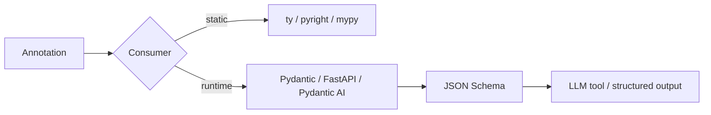

# Advanced typing: generics, Protocols, ParamSpec, TypedDict

!!! abstract "At a glance"
    **Priority:** P0 · **Complexity:** 3/5 · **Est. time:** 3 h · **Phase:** 1 · **Prereqs:** [Data model](data-model.md), [Modern tooling](modern-tooling.md)
    **You're done when:** you can write a fully typed, generic retry decorator (ParamSpec), a Protocol-based LLM client interface, and a PEP 695 generic repository that type-check cleanly under strict pyright/ty, and you can explain variance without hand-waving.

## Why it matters

Types are the contract layer of large Python codebases and, in 2026, of **LLM systems**. Pydantic, FastAPI, Pydantic AI, LangGraph, DSPy signatures and OpenAI/Anthropic structured outputs all derive runtime schemas from annotations. A Staff engineer must design typed interfaces that let 30 engineers refactor safely and let tools generate JSON Schema for models. Interviewers probe variance, Protocols vs ABCs, and decorator typing because they separate "uses hints" from "designs APIs".

Python 3.14 changed the ground rules: **annotations are evaluated lazily** (PEP 649/749). That means forward references work without quotes, `from __future__ import annotations` is no longer needed, and `annotationlib` is the new introspection API.

## Core concepts

### Modern syntax (3.12+ PEP 695, 3.13 PEP 696 defaults)

```python
from collections.abc import Callable, Iterable, Sequence

type JSON = dict[str, JSON] | list[JSON] | str | int | float | bool | None   # recursive alias, lazy

def first[T](xs: Sequence[T]) -> T:            # function type parameter
    return xs[0]

class Page[T]:                                  # generic class, variance inferred
    def __init__(self, items: list[T], cursor: str | None) -> None:
        self.items, self.cursor = items, cursor

def max_by[T, K: (int, float, str)](xs: Iterable[T], key: Callable[[T], K]) -> T:  # constrained
    return max(xs, key=key)

class Box[T = str]:                             # PEP 696 default (3.13)
    def __init__(self, v: T) -> None: self.v = v
```

- `T: Bound` is an upper bound. `T: (A, B)` is a constraint set (T is exactly one of them).
- PEP 695 **infers variance** for class type params from usage. Old-style `TypeVar("T_co", covariant=True)` is only needed for legacy code.
- `type X = ...` creates a `TypeAliasType` that is lazily evaluated, so recursive aliases just work.

### Variance: the one-paragraph version

`list[int]` is **not** a `list[float]`, even though `int` is accepted where `float` is expected. Lists are mutable (invariant): a function taking `list[float]` could append `1.5` to your ints. Read-only containers (`Sequence`, `Mapping` values, `Iterable`, return types) are **covariant**. Callable parameters are **contravariant**: `Callable[[float], None]` can be used where `Callable[[int], None]` is expected.

| Type | Variance in T | Consequence |
|---|---|---|
| `list[T]`, `dict[K, V]`, `set[T]` | invariant | accept `Sequence`/`Mapping` in params |
| `Sequence[T]`, `Iterable[T]`, `Mapping[K, V]` (in V), `frozenset[T]` | covariant | preferred parameter types |
| `Callable[[P], R]` | contravariant in P, covariant in R | handler registries |

**Rule of thumb:** accept abstract read-only types (`Sequence`, `Mapping`, `Iterable`), return concrete types (`list`, `dict`).

### Protocols (structural typing) vs ABCs (nominal)

```python
from typing import Protocol, runtime_checkable
from collections.abc import AsyncIterator

class ChatModel(Protocol):
    async def complete(self, messages: list[dict[str, str]], *, temperature: float = 0.0) -> str: ...
    def stream(self, messages: list[dict[str, str]]) -> AsyncIterator[str]: ...

class FakeModel:                        # no inheritance needed
    async def complete(self, messages, *, temperature=0.0) -> str:
        return "ok"
    async def stream(self, messages):
        for t in ("o", "k"):
            yield t

async def summarise(m: ChatModel, text: str) -> str:
    return await m.complete([{"role": "user", "content": f"Summarise: {text}"}])
```

- Protocols decouple consumers from providers. That is ideal for ports/adapters ([architecture patterns](architecture-patterns-python.md)) and test fakes.
- `@runtime_checkable` makes `isinstance` check only that the *names exist*, not signatures, and it is slow (about 10x an ABC check). Don't use it in hot paths.
- ABCs are still right when you want shared implementation (mixins) or explicit registration.

### ParamSpec and Concatenate: typing decorators properly

```python
import asyncio, functools, random
from collections.abc import Awaitable, Callable

def retry[**P, R](attempts: int = 3, base: float = 0.2) -> Callable[[Callable[P, Awaitable[R]]], Callable[P, Awaitable[R]]]:
    def deco(fn: Callable[P, Awaitable[R]]) -> Callable[P, Awaitable[R]]:
        @functools.wraps(fn)
        async def wrapper(*args: P.args, **kwargs: P.kwargs) -> R:
            for i in range(attempts):
                try:
                    return await fn(*args, **kwargs)
                except TimeoutError:
                    if i == attempts - 1:
                        raise
                    await asyncio.sleep(base * 2**i * random.uniform(0.5, 1.5))
            raise AssertionError("unreachable")
        return wrapper
    return deco

@retry(attempts=4)
async def call_llm(prompt: str, *, model: str = "small") -> str: ...

# reveal_type(call_llm) -> (prompt: str, *, model: str = "small") -> Awaitable[str]
```

`Concatenate[Session, P]` types decorators that *inject* a first argument (e.g. a DB session or request context), removing it from the public signature.

### TypedDict, Required/NotRequired, ReadOnly, Unpack

```python
from typing import TypedDict, NotRequired, ReadOnly, Unpack

class GenParams(TypedDict, total=False):
    temperature: float
    max_tokens: int
    stop: list[str]

class ToolCall(TypedDict):
    id: ReadOnly[str]          # PEP 705 (3.13)
    name: str
    arguments: str
    index: NotRequired[int]

def generate(prompt: str, **params: Unpack[GenParams]) -> str: ...
generate("hi", temperature=0.2, max_tokens=256)   # checked kwargs
```

Use TypedDict for **JSON-shaped data at boundaries you don't own** (provider payloads, `**kwargs` typing). Use Pydantic models when you need *runtime validation*, and dataclasses for internal domain objects.

### Narrowing: TypeIs (3.13) vs TypeGuard

```python
from typing import TypeIs

def is_str_list(v: list[object]) -> TypeIs[list[str]]:
    return all(isinstance(x, str) for x in v)
```

`TypeIs` narrows in both branches (the negative branch too) and requires the narrowed type to be consistent with the input. `TypeGuard` narrows only the positive branch. Prefer `TypeIs` for new code.

### Other tools worth knowing

- `@overload` for return types that depend on argument values (`Literal[True]` → `bytes`).
- `Self` (3.11) for fluent builders and alternate constructors.
- `@override` (3.12) catches silent breakage when a base method is renamed.
- `Literal` + `assert_never` for exhaustive `match` on discriminated unions (agent message types).
- `Annotated[T, meta]` carries metadata used by Pydantic (`Field`), FastAPI (`Depends`, `Query`), LangGraph (reducers).
- `Final`, `ClassVar`, `LiteralString` (SQL-injection guard for query builders).
- `NewType("UserId", str)` gives zero-cost distinct IDs (booking ref vs container number).

### 3.14: deferred annotations

```python
class Node:
    def children(self) -> list[Node]: ...   # no quotes needed in 3.14

import annotationlib
annotationlib.get_annotations(Node.children, format=annotationlib.Format.FORWARDREF)
```

Nuance: libraries that read `__annotations__` eagerly (older Pydantic/FastAPI/attrs) needed updates. Current Pydantic 2.12+ supports 3.14. `from __future__ import annotations` (stringified) still works but is now the legacy path; don't mix it with runtime-annotation libraries unless you know their resolution rules.



### Senior nuance

- `Any` is contagious and silent. `object` is the safe top type. Enable "report Any" diagnostics in core packages.
- Gradual adoption: strict mode per package (`[tool.pyright] strict = ["src/core"]`) with a ratchet, never all at once.
- `cast()` is a lie you tell the checker, so wrap it in validated boundaries (Pydantic) instead.
- Type-checker disagreement is real (inference of empty containers, overload resolution). Pin one checker as the CI truth.
- Runtime cost of annotations is ~zero with 3.14 lazy evaluation. Runtime *validation* (Pydantic) has real cost, so do it at edges.

## Resources

| Resource | Type | Why this one | Level | Cost |
|---|---|---|---|---|
| [Python typing docs (typing.python.org)](https://typing.python.org/en/latest/) | docs | Official guides plus the typing spec, maintained by the typing council | advanced | free |
| [Typing spec: Generics](https://typing.python.org/en/latest/spec/generics.html) | spec | Precise variance, ParamSpec, TypeVarTuple rules | advanced | free |
| [Reference: Protocols](https://typing.python.org/en/latest/reference/protocols.html) | docs | Structural typing patterns and pitfalls | intermediate | free |
| [Modernizing superseded typing features](https://typing.python.org/en/latest/guides/modernizing.html) :gem: | docs | Exact old → new mapping (TypeVar → PEP 695, Optional → `\|`) | intermediate | free |
| [PEP 695 – Type Parameter Syntax](https://peps.python.org/pep-0695/) | spec | Motivation and variance inference details | advanced | free |
| [PEP 649](https://peps.python.org/pep-0649/) / [PEP 749](https://peps.python.org/pep-0749/) | spec | Deferred annotations in 3.14, what changed and why | advanced | free |
| [Pyright: mypy comparison](https://github.com/microsoft/pyright/blob/main/docs/mypy-comparison.md) :gem: | docs | Explains inference differences you'll hit in CI | advanced | free |
| [Adam Johnson: fixing circular imports with type hints](https://adamj.eu/tech/2021/05/13/python-type-hints-how-to-fix-circular-imports/) :gem: | article | Practical `TYPE_CHECKING` patterns | intermediate | free |
| [Fluent Python 2e, Part III](https://www.fluentpython.com/) | book | Best narrative on variance and Protocols | advanced | paid |

## Hands-on lab

**Goal (60–90 min):** a typed LLM client layer.

1. Define `ChatModel` Protocol (above) and two implementations, `FakeModel` and `HttpModel` (wrapping `httpx.AsyncClient` to any OpenAI-compatible endpoint, or a local Ollama).
2. Write `retry[**P, R]` (above) and a `with_session` decorator using `Concatenate[Session, P]` that injects a session.
3. Write `class Repo[T: BaseModel]` with `get(id) -> T | None` and `list(page: int) -> Page[T]`.
4. Add `GenParams` TypedDict and `**params: Unpack[GenParams]` on `HttpModel.complete`.
5. Put `reveal_type(call_llm)` and a deliberate misuse (`call_llm(123)`, `generate("x", temprature=0.1)`) in `tests/typecheck_cases.py`.
6. Run `uv run ty check` and `uvx pyright --strict`. **Expected:** both flag the int argument and the misspelled `temprature` key, and `reveal_type` shows the preserved signature.
7. Stretch: `match` over `type Part = TextPart | ToolCallPart | ToolResultPart` with `assert_never` in the default branch. Add a 4th part type and confirm the checker errors.

## Questions

### L1 — Recall

??? question "Q1. Why is `list[int]` not assignable to `list[float]`, while `Sequence[int]` is assignable to `Sequence[float]`?"
    ??? success "Answer"
        `list` is mutable, hence invariant: a `list[float]` consumer could insert a float into your int list. `Sequence` is read-only, hence covariant: reading ints where floats are expected is safe. Accept `Sequence[float]` in parameters to be flexible.

??? question "Q2. What does PEP 695 syntax give you over `TypeVar`?"
    ??? success "Answer"
        Scoped type params declared inline (`def f[T](...)`, `class C[T]`), variance inference for class params, bounds/constraints inline (`T: Hashable`, `T: (int, str)`), `type` alias statements with lazy evaluation (recursive aliases), and no module-level TypeVar clutter or naming conventions such as `T_co`.

??? question "Q3. What does `@runtime_checkable` actually check?"
    ??? success "Answer"
        Only that the object has attributes with the protocol member names (since 3.12 the lookup uses `inspect.getattr_static`, so properties and `__getattr__` aren't triggered). It doesn't check signatures or types. It's also relatively slow. Use it for coarse dispatch, not validation.

??? question "Q4. TypeIs vs TypeGuard?"
    ??? success "Answer"
        `TypeIs[T]` (3.13, PEP 742) narrows the argument to `T` in the true branch *and* excludes `T` in the false branch, and `T` must be consistent with the declared parameter type. `TypeGuard[T]` narrows only the true branch and allows non-subtype narrowing (e.g. `list[object]` → `list[str]` in unsafe ways). Prefer TypeIs.

### L2 — Apply

??? question "Q5. This decorator erases the signature of every function it wraps. Fix its typing."
    ```python
    def timed(fn: Callable[..., Any]) -> Callable[..., Any]:
        @functools.wraps(fn)
        def w(*a, **k):
            t = time.perf_counter(); r = fn(*a, **k); log(time.perf_counter() - t); return r
        return w
    ```
    ??? success "Answer"
        ```python
        def timed[**P, R](fn: Callable[P, R]) -> Callable[P, R]:
            @functools.wraps(fn)
            def w(*a: P.args, **k: P.kwargs) -> R:
                t = time.perf_counter()
                try:
                    return fn(*a, **k)
                finally:
                    log(time.perf_counter() - t)
            return w
        ```
        ParamSpec preserves parameter names/kinds and R the return type. The `try/finally` also logs on exceptions.

??? question "Q6. Type a function `pluck(rows, key)` that returns the values of `key` from a list of TypedDicts, preserving the value type when `key` is a literal."
    ??? success "Answer"
        Use overloads per key with `Literal`:
        ```python
        class Row(TypedDict):
            id: int
            name: str
        @overload
        def pluck(rows: Sequence[Row], key: Literal["id"]) -> list[int]: ...
        @overload
        def pluck(rows: Sequence[Row], key: Literal["name"]) -> list[str]: ...
        def pluck(rows: Sequence[Row], key: Literal["id", "name"]) -> list[int] | list[str]:
            return [r[key] for r in rows]  # type: ignore[return-value]
        ```
        There is no general "keyof" in Python typing (as of Sept 2026), so overloads or a dataclass plus attrgetter are the pragmatic answer.

??? question "Q7. A Protocol `ChatModel.complete(self, messages: list[Message]) -> str` is not satisfied by `AnthropicAdapter.complete(self, messages: Sequence[Message]) -> str`. True or false, and why?"
    ??? success "Answer"
        False. The adapter **does** satisfy it. Parameters are contravariant, so accepting a wider type (`Sequence` ⊇ `list`) is fine. The reverse (protocol takes `Sequence`, impl takes `list`) would fail, because callers may pass a tuple.

??? question "Q8. Give a precise type for a `**kwargs` passthrough to an LLM SDK so typos like `max_token=` are caught."
    ??? success "Answer"
        `class GenParams(TypedDict, total=False): temperature: float; max_tokens: int; top_p: float` and `def complete(prompt: str, **kw: Unpack[GenParams]) -> str`. Unknown keys and wrong value types become type errors. Keep it in sync with the provider by generating it from their schema, or accept a Pydantic model instead.

### L3 — Design & trade-offs

??? question "Q9. Protocol vs ABC for the `VectorStore` port used by 4 teams (pgvector, Qdrant, in-memory fake)."
    ??? success "Answer"
        Protocol: adapters in separate packages needn't import your base (no dependency inversion leak), test fakes are trivial, and third-party clients can be wrapped structurally. ABC: shared default implementations (e.g. batching `upsert_many` built on `upsert`), explicit registration, and a runtime error on missing methods at instantiation. Choice: Protocol for the port type used in signatures, plus an optional `BaseVectorStore` ABC offering helpers that adapters *may* inherit. Enforce conformance with a shared contract test suite (parametrised pytest over all adapters), since neither mechanism checks behaviour.

??? question "Q10. Strict typing everywhere vs gradual — how do you roll out on a 300k-LOC untyped codebase?"
    ??? success "Answer"
        Measure (percentage of typed defs, Any-leakage via reports), then type boundaries first: public APIs, domain models, adapters, and anything generating schemas. Run strict mode per package with a ratchet (new modules strict, old ones allowlisted). Autogenerate a baseline (MonkeyType/pyright `--createstub` or LLM-assisted annotation with checker verification). Gate CI on "no new errors" using baseline files. Payoff shows up in refactor safety and LLM coding-agent accuracy (typed code gives agents better context). Trade-off: developer friction early on, so invest in fixing stubs for key deps.

??? question "Q11. TypedDict vs dataclass vs Pydantic model for (a) provider JSON responses, (b) internal domain entities, (c) LLM structured output."
    ??? success "Answer"
        (a) Provider responses you pass through: TypedDict (zero runtime cost, types the dict shape), or Pydantic if you must validate untrusted input. (b) Domain entities: frozen slotted dataclasses (no validation overhead, explicit invariants in `__post_init__`) or attrs. Validate at the edge, trust inside. (c) LLM output: Pydantic models, because you need runtime validation plus JSON Schema generation plus retry-on-ValidationError loops (Pydantic AI / Instructor pattern). Keep one conversion layer between them.

### L4 — Staff-level ambiguity

??? question "Q12. Your org has mypy in CI, pyright in editors, and now teams want ty. Errors disagree and developers are frustrated. Resolve it."
    ??? success "Answer"
        Define the contract: one checker is the source of truth in CI, and others are advisory. Run a two-week bake-off on 3 representative repos, measuring runtime, false-positive rate (sample 50 diagnostics), and plugin needs. If ty wins on speed and diagnostics but is still beta, adopt it in "advisory" CI for a quarter while keeping the current gate. Pin versions, upgrade via a bot PR with a diff of new errors, and publish a short "typing style guide" (preferred patterns that all checkers agree on: explicit container annotations, avoid overload gymnastics). Revisit at ty stable. Success metric: CI type-check p50 time and "type error disputes" in the eng channel.

??? question "Q13. You're designing the typed SDK that product teams use to define agent tools (Python functions exposed to LLMs). What typing guarantees do you design in?"
    ??? success "Answer"
        Tools are plain typed functions. The SDK derives JSON Schema from annotations plus `Annotated[..., Field(description=...)]` and the docstring (like Pydantic AI / FastMCP), so types are the single source of truth. Constraints: only JSON-representable param types (enforced at registration with clear errors), `Literal`/Enum for closed sets (better model accuracy), return types serialisable via Pydantic, ParamSpec-typed decorators so IDEs keep signatures, and a `RunContext[Deps]` generic injected via `Concatenate` so dependencies don't leak into the LLM-visible schema. Version tool schemas, snapshot-test generated JSON Schema, and make breaking changes fail CI (link to [tool calling](../agentic-ai/tool-calling.md) and [Pydantic AI](../agentic-ai/pydantic-ai.md)).

## Real-world use cases

- **Pydantic AI / FastMCP:** tool schemas generated from function signatures. Typing quality directly equals tool-call accuracy.
- **Booking platform:** `NewType` for `BookingRef`, `ContainerNo`, `VoyageId` caught swapped-argument bugs in a 200-param integration layer.
- **SDK wrappers:** `Unpack[TypedDict]` kwargs over provider SDKs caught misspelled generation params that providers silently ignored.
- **Hexagonal services:** Protocol ports let teams swap pgvector for Qdrant with a contract test suite and no inheritance coupling.

## Pitfalls & anti-patterns

- `Callable[..., Any]` decorators that erase signatures.
- Accepting `list`/`dict` in params (invariance pain for callers).
- Overusing `@runtime_checkable` isinstance as validation.
- `cast()` / `# type: ignore` without a comment or error code.
- Mixing `from __future__ import annotations` with runtime-annotation libraries without understanding resolution.
- Exposing `Any` from core libraries (it spreads silently to every consumer).
- Typing theatre: complex generics nobody can read. Simpler signatures often beat perfect ones.

## Checklist

- [ ] I can explain invariance/covariance/contravariance with a list/Sequence/Callable example without notes
- [ ] I built a ParamSpec-typed async retry decorator and verified it with `reveal_type`
- [ ] I wrote a Protocol port with two implementations and a contract test
- [ ] I answered all L3 questions out loud in < 3 min each
