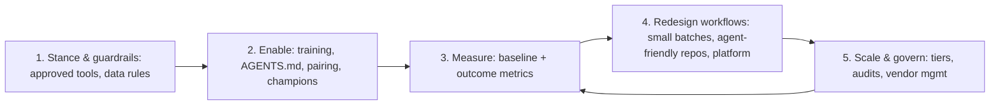

# Leading engineering in the AI era: adoption, productivity, risk

!!! abstract "At a glance"
    **Priority:** P0 · **Complexity:** 3/5 · **Est. time:** 2 h · **Phase:** 4 · **Prereqs:** [Engineering strategy](technical-strategy.md), [AI-assisted development](../agentic-ai/ai-assisted-development.md), [Guardrails & security](../agentic-ai/guardrails-security.md)
    **You're done when:** you've written an AI adoption & governance playbook (coding-agent policy, measurement plan, vendor scorecard, risk tiers) that a CTO could adopt with light edits.

## Why it matters

This is the topic where your two goals — Staff/Principal and AI architect — meet. Every engineering org is now answering the same questions: *Which AI tools do we allow? How do we know they help? How do we stop them leaking data or shipping bugs faster? How do we build AI products responsibly? What happens to roles and skills?* Leadership wants someone who can answer with evidence rather than hype or fear.

The evidence is genuinely mixed, which is why judgement matters:

- **DORA's State of AI-assisted Software Development (2025)** frames AI as an **amplifier**: it magnifies an organisation's existing strengths and weaknesses. The companion **DORA AI Capabilities Model** names seven capabilities that determine whether AI helps: a clear and communicated AI stance, healthy data ecosystems, AI-accessible internal data, strong version control practices, working in small batches, user-centric focus, and quality internal platforms.
- **METR's randomised controlled trial (July 2025)** found experienced open-source developers took **19% longer** on tasks in their own repos when using early-2025 AI tools — while believing they were faster. It's a snapshot of one setting, not a universal law, but it's a strong argument to **measure outcomes rather than trust perception**.
- Vendor studies (e.g., GitHub's Copilot research) report speed and satisfaction gains, typically on bounded tasks.

A Staff leader holds all three at once: real gains exist, they are uneven, and the org system determines who gets them.

## Core concepts

### The two halves of AI leadership

| | AI **for** engineering (coding agents) | AI **in** products (agents/LLM features) |
|---|---|---|
| Question | How do our engineers build with AI? | How do we build AI systems for customers/ops? |
| Key risks | Code quality, security, IP/licensing, data leakage via prompts, skill atrophy, review overload | Wrong outputs, prompt injection, data protection, regulatory exposure, cost, reputational harm |
| Controls | Approved tools, repo agent rules (AGENTS.md), CI gates, review norms, sandboxing | Gateway, evals, guardrails, HITL, observability, risk tiers |
| Measures | DORA metrics, DX Core 4 / SPACE, review time, incident rate | Task success, eval scores, override rate, cost per task, CSAT |

### Adoption strategy: a staged model



1. **Clear stance** (DORA's first capability): what's allowed, with which data, in which tools. Ambiguity produces either shadow AI or fear.
2. **Enablement:** agent fluency is a skill; train it. Champions per team, pair sessions, repo instructions (AGENTS.md / CLAUDE.md), shared prompt/skill libraries.
3. **Measure before scaling:** baseline DORA metrics and developer experience *before* rollout; compare cohorts; avoid vanity metrics (acceptance rate, lines generated).
4. **Redesign the system:** AI amplifies system quality — invest in fast CI, good tests, small PRs, clear docs, internal platforms, AI-accessible internal knowledge.
5. **Govern proportionally:** risk tiers, audit logs, vendor reviews.

### Coding-agent policy (skeleton)

```markdown
# Coding agents — engineering policy v1 (owner: <Staff eng>, approver: <CTO>)
1. Approved tools: <list> via SSO with enterprise data controls (no training on our data; retention terms).
2. Data rules: no customer PII/secrets in prompts; agents run with repo-scoped access; secrets scanning on commits and prompts where possible.
3. Autonomy levels:
   L1 suggest/complete · L2 edit in local workspace · L3 run commands in sandbox · L4 open PRs autonomously (background agents)
   Default L1–L3; L4 only in repos with CI gates + branch protection; never direct pushes to main.
4. Accountability: the human who merges owns the code. Same review bar for AI-written code.
5. Repo readiness: AGENTS.md with build/test commands, architecture rules, do-not-touch areas.
6. Quality gates: tests required on changed code; SAST/dependency/license scans; PR size limits.
7. Security: MCP servers and agent tools must be from an approved registry; least-privilege tokens.
8. Measurement: quarterly review of DORA + DX metrics by team; incident tagging for AI-related causes.
9. Learning: juniors complete fundamentals tasks; review norms require explaining the change.
```

### Measuring productivity honestly

- **Outcome metrics:** lead time for changes, deployment frequency, change-failure rate, failed-deployment recovery time (DORA); DX Core 4 dimensions (speed, effectiveness, quality, business impact).
- **Leading indicators:** PR review time, PR size, CI duration, developer-reported friction.
- **Guardrail metrics:** incidents per change, security findings, rework rate.
- **Avoid:** lines of code, number of AI suggestions accepted, "hours saved" self-reports as primary evidence (METR shows perception can diverge from reality).
- **Method:** baseline → staggered rollout by team (natural control group) → compare over 1–2 quarters.

### Evaluating AI vendors (scorecard)

| Criterion | Weight | Questions to ask |
|---|---|---|
| Quality on *our* tasks | 25% | Results on our eval set / pilot repos, not vendor benchmarks |
| Security & data protection | 20% | Data retention, training use, residency, SOC 2/ISO 27001, SSO/SCIM, audit logs |
| Integration & openness | 15% | Works with our identity, repos, CI; MCP/OTel support; API access |
| Governance controls | 10% | Admin policies, model allow-lists, autonomy controls, usage analytics |
| Total cost | 15% | Per-seat vs usage pricing, overage behaviour, cost at 2x adoption |
| Vendor viability & exit | 10% | Roadmap, financial health, data export, contract terms, lock-in |
| Support & SLAs | 5% | Enterprise support, uptime commitments, incident communication |

Rules: run a time-boxed pilot on real work with your own evals; include security and procurement from day one; negotiate 12-month terms in a fast-moving market; re-evaluate annually.

### Risk and governance for AI products

**Risk tiers** (proportional controls):

| Tier | Example | Required controls |
|---|---|---|
| Low | Internal summarisation of non-sensitive docs | Gateway, logging, basic evals |
| Medium | Internal agent with read-only tools on business data | + data classification checks, eval thresholds, access control, monitoring |
| High | Customer-facing assistant; agent with write actions | + HITL for writes, red-teaming (OWASP LLM/Agentic Top 10), kill switch, incident runbooks, legal review |
| Restricted | Decisions affecting individuals' rights, regulated use (e.g., employment, credit) | + formal risk assessment, regulatory classification (EU AI Act), human oversight, documentation |

Anchor frameworks: **NIST AI RMF** (govern, map, measure, manage), **ISO/IEC 42001** (AI management system), **OWASP Top 10 for LLM Applications and for Agentic Applications (2026)**, and the **EU AI Act** for EU exposure (phased obligations — check the current timeline as of your review date). For agents, Simon Willison's **lethal trifecta** (private data + untrusted content + external communication) is the most practical design heuristic.

### Leading teams with coding agents: what changes day to day

- **Work shape:** more parallel, smaller tasks; engineers become reviewers and orchestrators of agent work. Plan for review capacity as the bottleneck.
- **Specs matter more:** well-written issues, acceptance criteria and design notes directly improve agent output.
- **Repo as interface:** AGENTS.md, clear module boundaries, fast tests make codebases "agent-friendly" — which also makes them human-friendly.
- **Roles:** Staff engineers set patterns (skills, prompts, tool registries), own evals for AI features, and coach judgement.
- **Culture:** normalise talking about failures of agent output; blameless handling of AI-related defects.

### Senior-level nuance

- **Avoid both hype and denial.** Your credibility comes from measured claims and data from your own org.
- **AI adoption is change management.** Engineers' concerns (job security, quality ownership, deskilling) are legitimate — address them openly.
- **The platform is the multiplier.** Gateway, eval harness, tool registry, observability: invest once, benefit everywhere.
- **Date-stamp everything.** Tool capabilities change quarterly; policies should have a review cadence.

## Resources

| Resource | Type | Why this one | Level | Cost |
|---|---|---|---|---|
| [State of AI-assisted Software Development 2025 (DORA)](https://dora.dev/research/2025/dora-report/) | report | Largest research base on AI in software orgs; "AI as amplifier" | advanced | free |
| [DORA AI Capabilities Model](https://dora.dev/ai/capabilities-model/report/) :gem: | report | The seven capabilities that determine AI's impact | advanced | free |
| [METR: early-2025 AI and experienced developer productivity (RCT)](https://metr.org/blog/2025-07-10-early-2025-ai-experienced-os-dev-study/) :gem: | study | Rigorous counterweight to perception-based claims | advanced | free |
| [NIST AI Risk Management Framework](https://www.nist.gov/itl/ai-risk-management-framework) | framework | Govern/map/measure/manage; widely used in enterprises | advanced | free |
| [OWASP GenAI Security Project](https://genai.owasp.org/) | docs | LLM and Agentic Top 10s for risk reviews | advanced | free |
| [The lethal trifecta (Simon Willison)](https://simonwillison.net/2025/Jun/16/the-lethal-trifecta/) :gem: | article | The most useful single heuristic for agent risk | intermediate | free |
| [How Anthropic teams use Claude Code](https://www.anthropic.com/news/how-anthropic-teams-use-claude-code) | article | Concrete patterns of coding-agent use across functions | intermediate | free |
| [Claude Code best practices](https://code.claude.com/docs/en/best-practices) | docs | Practical agent workflows: context files, planning, verification | intermediate | free |
| [Measuring developer productivity with the DX Core 4](https://getdx.com/research/measuring-developer-productivity-with-the-dx-core-4/) | article | A balanced measurement framework to use alongside DORA | advanced | free |
| [EU AI Act (explorer site)](https://artificialintelligenceact.eu/) | reference | Navigable text and timelines for EU obligations | advanced | free |

## Hands-on lab

**Produce: AI adoption & governance playbook (Staff artifact #7). 2 h.**

1. **Stance (20 min):** adapt the coding-agent policy skeleton to your org; define autonomy levels and data rules.
2. **Measurement plan (20 min):** choose 4–6 metrics (DORA + DX + guardrails), baseline method, staggered rollout design, review cadence.
3. **Vendor scorecard (30 min):** apply the scorecard to two real coding-agent tools or two agent platforms, using public documentation for security/data terms. Mark unknowns as questions for the vendor.
4. **Risk tiers (20 min):** map 5 real or planned AI use cases in a logistics company (e.g., customs-doc extraction, customer-service assistant, internal knowledge search, booking-amendment agent, coding agents) to tiers and required controls.
5. **Rollout plan (20 min):** 2-quarter plan with champions, training, AGENTS.md rollout to top repos, and checkpoints.
6. **Review:** have an LLM critique as a CISO and as a sceptical principal engineer; revise.

**Expected output:** `docs/log/ai-adoption-playbook.md` (4–6 pages) — reuse in interviews as a talking piece.

## Questions

### L1 — Recall

??? question "Q1. What does DORA mean by 'AI is an amplifier'?"
    ??? success "Answer"
        DORA's 2025 research finds AI magnifies existing organisational strengths and weaknesses: teams with good practices (small batches, strong version control, quality platforms, clear goals) get more benefit, while teams with weak foundations may see more instability. The returns come from the organisational system, not the tools alone.

??? question "Q2. Summarise METR's 2025 finding and its limits."
    ??? success "Answer"
        In an RCT with experienced open-source developers working on their own mature repos, allowing early-2025 AI tools made tasks take ~19% longer, while developers believed they were faster. Limits: a specific population and setting (expert devs, familiar large codebases), early-2025 tools; not generalisable to all tasks or later tools. The key lesson is to measure outcomes rather than rely on perception.

??? question "Q3. What is the lethal trifecta?"
    ??? success "Answer"
        Simon Willison's term for an agent that has (1) access to private data, (2) exposure to untrusted content, and (3) the ability to communicate externally. Together they allow prompt injection to exfiltrate data. Mitigation: remove at least one leg for any given flow, or add strong controls (HITL, isolation, allow-lists).

### L2 — Apply

??? question "Q4. Design a measurement plan for rolling out a coding agent to 300 engineers."
    ??? success "Answer"
        Baseline one quarter of DORA metrics (lead time, deploy frequency, change-failure rate, recovery time), PR review time and size, and a developer experience survey. Roll out in waves by team to create comparison groups. Track guardrails (incidents per change, security findings, rework). Review at 6 and 12 weeks per wave; interview teams with outliers. Report outcomes to leadership, not acceptance rates. Adjust enablement where gains lag (often repo readiness or review bottlenecks).

??? question "Q5. An engineer pastes a customer manifest into a public chatbot to debug a parsing error. What controls prevent recurrence without banning AI?"
    ??? success "Answer"
        Provide an approved enterprise tool with data protections so people don't need public tools; clear data rules in training; DLP/browser controls on unapproved AI domains where appropriate; synthetic/test data tooling for debugging; secret/PII scanning; and a blameless incident review focusing on why the approved path wasn't used (friction? awareness?). Treat it as a system issue.

??? question "Q6. Map these use cases to risk tiers: internal policy Q&A bot, customs declaration pre-fill with human sign-off, autonomous rebooking agent for delayed containers."
    ??? success "Answer"
        Policy Q&A: low–medium (internal, read-only; needs groundedness evals, access control if documents are restricted). Customs pre-fill with sign-off: medium–high (regulated data, errors have legal impact; HITL mitigates; needs field-level evals, audit logs). Autonomous rebooking: high (external actions affecting customers and cost; requires HITL or strict policy limits, kill switch, red-teaming, audit, cost controls) until proven safe in shadow mode.

### L3 — Design & trade-offs

??? question "Q7. One approved coding agent vs letting teams choose — trade-offs?"
    ??? success "Answer"
        One tool: simpler security/procurement, consistent training and conventions, better negotiating leverage, easier measurement; but risks lock-in and may not fit all stacks. Open choice: fits team needs, encourages experimentation; but fragments security review, costs and knowledge, and creates shadow AI. Common middle ground: one or two approved tools with enterprise controls, an evaluation path to add new ones, repo conventions (AGENTS.md) that work across tools, and annual re-evaluation.

??? question "Q8. How much autonomy should background coding agents get in your repos?"
    ??? success "Answer"
        Proportional to repo readiness and risk: agents may open PRs autonomously in repos with strong CI (tests, scans), branch protection, and clear AGENTS.md; never merge or push to main without human review; run in sandboxes with least-privilege tokens; restricted from sensitive areas (auth, payments, infra) unless supervised. Start with low-risk task types (dependency updates, test backfills, docs) and expand based on measured rework and incident rates.

??? question "Q9. Central AI governance committee vs embedded controls in the platform — which and why?"
    ??? success "Answer"
        Embed as much as possible into the platform (gateway policies, approved models, logging, eval gates, tool registries) so compliance is the default path and fast. Keep a small committee for high-risk/restricted use cases and policy updates. Committees alone become bottlenecks and get bypassed; platform controls alone miss context-dependent risks (e.g., legal/ethical implications). Combine them, with clear risk tiers deciding which path applies.

### L4 — Staff-level ambiguity

??? question "Q10. The CEO mandates '50% of code written by AI by year end'. As the AI architect, how do you respond?"
    ??? success "Answer"
        Understand the goal behind the metric (speed? cost? competitive signal?). Explain respectfully that "% of code by AI" is easy to game and doesn't correlate with outcomes; offer outcome-based targets instead: lead time reduction, more features delivered per quarter, maintained change-failure rate, developer satisfaction. Propose a plan with enablement and measurement, and report "AI-assisted share" as a secondary indicator if leadership wants it. Frame it as protecting the CEO from a metric that could drive bad behaviour (bloated code, lower quality).

??? question "Q11. Your company must choose between two enterprise agent platforms. Security prefers vendor A; engineering prefers vendor B; procurement wants the cheaper one. How do you lead the decision?"
    ??? success "Answer"
        Align stakeholders on criteria and weights before comparing (scorecard). Run a time-boxed pilot on 1–2 real use cases with the same eval set; security performs its assessment on both in parallel. Model total cost at realistic adoption (not list price). Assess exit costs and open standards support (MCP, OTel, A2A). Present a decision memo with scores, key trade-offs, risk mitigations for the recommended option, and a phased commitment. Name the decider (often CTO/CIO). Record as ADR with revisit date.

??? question "Q12. (Behavioral) Tell me about a time you led adoption of a new technology or practice across teams."
    ??? success "Answer"
        For an AI-era story: situation (ad-hoc AI tool use, risks, no measurement), task (make adoption safe and effective), actions (stance/policy with security, champions, AGENTS.md templates, training, staggered rollout with baseline metrics, addressing concerns openly), results (adoption %, lead time change, no data incidents, developer satisfaction), lessons (e.g., review capacity became the bottleneck; invested in CI and PR size norms).

## Real-world use cases

- **Global logistics coding-agent rollout:** policy + champions + AGENTS.md in top 50 repos; measured lead-time improvement in some teams, none in others with slow CI — which funded CI investment.
- **Customer-service AI assistant:** high-tier controls, HITL, eval thresholds, phased regions.
- **Vendor consolidation:** four AI tools reduced to one enterprise contract with data protections and audit logs.
- **AI risk register** aligned to NIST AI RMF, reviewed quarterly by CTO staff.

## Pitfalls & anti-patterns

- Mandating usage metrics ("% AI code") instead of outcomes.
- Banning AI outright — drives shadow usage.
- Rolling out tools without baselines.
- Ignoring review capacity as the new bottleneck.
- Treating vendor benchmarks as evidence for your context.
- One-size-fits-all governance (heavy process for low-risk use cases).
- Dismissing engineers' concerns about deskilling and accountability.

## Checklist

- [ ] I can summarise DORA 2025, the AI Capabilities Model, and METR's finding with appropriate caveats without notes
- [ ] I wrote a coding-agent policy, measurement plan, vendor scorecard and risk tiers
- [ ] I can explain the lethal trifecta and how it shapes agent design reviews
- [ ] I answered all L3 questions out loud in < 3 min each
