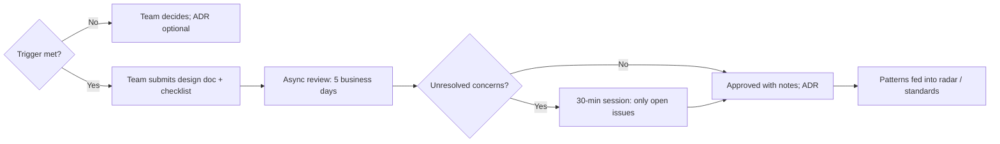

# Running architecture reviews & guilds

!!! abstract "At a glance"
    **Priority:** P1 · **Complexity:** 2/5 · **Est. time:** 1 h · **Phase:** 4 · **Prereqs:** [Design docs & RFCs](design-docs-rfcs.md), [Decision-making](decision-making.md), [Documenting architecture](../architecture/documenting-architecture.md)
    **You're done when:** you've written a one-page charter for a lightweight architecture review forum (with triggers, SLA and an AI-system checklist) and used it to review your capstone design.

## Why it matters

Large enterprises almost always have an Architecture Review Board (ARB) — and engineers almost always hate it. Done badly, it's a slow gate staffed by people who don't carry the pager. Done well, it's the fastest way to spread good patterns, catch expensive mistakes early, and build a shared technical direction across dozens of teams.

As a Staff/Principal engineer or AI architect, you'll either run such forums or be a senior voice in them. Running them well is a high-leverage Staff skill: every good review improves a design *and* teaches the presenting team.

AI-specific: agentic systems introduce new review concerns (tool permissions, prompt injection, evals, data flows to providers, cost runaways) that most existing ARB checklists don't cover. Someone has to add them — ideally you.

## Core concepts

### Review models compared

| Model | How it works | Pros | Cons | Good for |
|---|---|---|---|---|
| **Gatekeeping ARB** | Board approves/rejects designs | Consistency, compliance | Slow, adversarial, disempowers teams | Highly regulated, irreversible decisions |
| **Advisory review** | Teams present; reviewers advise; team decides | Fast, educational | Advice may be ignored | Most designs |
| **Advice process** (Harmel-Law) | Anyone can decide if they seek advice from affected parties + experts; ADRs record it | Scales, empowers, fast | Needs trust and good ADR discipline | Mature, decentralised orgs |
| **Async RFC review** | Doc comments with deadline | Time-zone friendly | Can stall | Global orgs |
| **Guild / community of practice** | Voluntary cross-team group for a domain | Spreads knowledge, builds standards bottom-up | No authority; can fizzle | Standards, learning, AI practices |

Andrew Harmel-Law's "Scaling the Practice of Architecture, Conversationally" (on martinfowler.com) describes the **advice process**: decentralised decisions + ADRs + an advisory forum + a tech radar + principles. It's the model most worth studying for modern orgs.

### A lightweight review forum that works



**Triggers** (review only when one applies): new external dependency or vendor; data crossing a trust/residency boundary; new public API or shared schema; tier-1 service change; AI system with tool/write access or customer-facing output; cost > threshold; deviation from a published standard.

**SLA:** 5 business days async; decision within 10. Publish the metric.

### Charter template

```markdown
# Architecture Review Forum — charter v1
## Purpose: improve designs early, spread patterns, make decisions fast. Not a gate for routine work.
## Scope & triggers: <list above>
## Roles: rotating chair (Staff+), 3–5 reviewers incl. SRE + security; presenting team owns the decision unless the change is Type 1 or violates a standard
## Process: doc + checklist → async 5 days → optional 30-min session → outcome logged as ADR
## Outcomes: Approved | Approved with conditions | Needs rework (with specific asks) | Escalate (Type 1, to <CTO delegate>)
## SLA & metrics: time-to-decision, % designs reviewed before build, survey score from presenting teams
## Standards feedback loop: quarterly tech-radar update; recurring issues become guidance
```

### Review checklist (including AI systems)

**General:** problem & goals clear; NFRs with numbers; alternatives real; failure modes; data model & ownership; security (authn/z, secrets); observability & SLOs; cost; rollout & rollback; operational ownership.

**AI / agentic additions:**

- [ ] Eval plan: offline dataset, metrics, launch thresholds, online monitoring
- [ ] Data flows: what data goes to which model/provider/region; classification; retention
- [ ] Prompt-injection threat model: untrusted inputs × sensitive data × external actions (lethal trifecta)
- [ ] Tool permissions: least privilege, scoped credentials, allow-lists; HITL for irreversible actions
- [ ] Kill switch, versioned prompts/models, non-AI fallback
- [ ] Cost controls: per-request budget, iteration caps, caching
- [ ] Observability: traces of LLM/tool calls, token/cost metrics
- [ ] Gateway usage (no direct provider keys); approved models only
- [ ] Regulatory classification (e.g., EU AI Act risk category where relevant)

### Being a good reviewer

- Ask questions before making statements: "What happens when the provider times out?"
- Distinguish **must-fix** (safety, security, compliance, standards) from **suggestions**.
- Review the problem framing first — a perfect design for the wrong problem is the most expensive mistake.
- Credit good decisions explicitly; people repeat what gets praised.
- Don't redesign the system in the meeting. Offer a follow-up.
- Your review should make the team *more* capable, not more dependent on you.

### Guilds / communities of practice

A guild (e.g., "AI Engineering Guild") works when it has: a clear purpose (share patterns, maintain a few standards), a small core group, a regular rhythm (bi-weekly demos, monthly deep dive), artifacts (radar, reference implementations, AGENTS.md templates), and a leadership sponsor who treats contributions as real work. It dies when it's just a meeting.

### Senior-level nuance

- **Measure the forum.** If time-to-decision creeps above two weeks, teams will route around you.
- **Shift left.** The best review happens at the one-pager stage, not after the build.
- **Codify recurring advice** into paved roads, templates and automated checks (fitness functions) so reviews focus on novel problems.
- **Beware the "architecture astronaut" reviewer** who adds complexity. Simplicity is a review criterion.
- **Power dynamics:** junior teams may not push back on a Principal. Invite disagreement explicitly.

## Resources

| Resource | Type | Why this one | Level | Cost |
|---|---|---|---|---|
| [Scaling the Practice of Architecture, Conversationally (Harmel-Law)](https://martinfowler.com/articles/scaling-architecture-conversationally.html) :gem: | article | The advice-process model; the best modern alternative to gatekeeping ARBs | advanced | free |
| [Architecture Decision Records](https://adr.github.io) | docs | The recording backbone of any review process | intermediate | free |
| [Thoughtworks Technology Radar](https://www.thoughtworks.com/radar) | radar | Model for publishing adopt/trial/assess/hold guidance internally | intermediate | free |
| [AWS Well-Architected](https://aws.amazon.com/architecture/well-architected/) | framework | Structured review pillars; useful checklist source even off AWS | intermediate | free |
| [OWASP GenAI Security Project](https://genai.owasp.org/) | docs | LLM and agentic Top 10s for the AI review checklist | advanced | free |
| [Google engineering practices (code review)](https://google.github.io/eng-practices/) | docs | Reviewer etiquette that generalises to design review | intermediate | free |
| [The Architect Elevator (Gregor Hohpe)](https://architectelevator.com/) :gem: | blog/book | How enterprise architects add value without becoming a bottleneck | advanced | free/paid |
| [C4 model](https://c4model.com) | docs | Shared diagram language makes reviews faster | intermediate | free |

## Hands-on lab

**Produce: review forum charter + AI checklist, applied to your capstone (bonus artifact). 45–60 min.**

1. Write the one-page charter using the template, adapted to a 300–600 engineer enterprise.
2. Customise the AI checklist for your context (add residency rules, approved model list, gateway requirement).
3. Review your own capstone design doc against the checklist. Record findings as must-fix vs suggestions.
4. Write one ADR for a finding you resolved.
5. Draft a one-paragraph proposal for an "AI Engineering Guild": purpose, cadence, first three artifacts.

**Expected output:** `docs/log/arch-review-charter.md` + checklist findings on your capstone.

## Questions

### L1 — Recall

??? question "Q1. What is the architecture advice process?"
    ??? success "Answer"
        A decentralised decision model (described by Andrew Harmel-Law): anyone can make an architectural decision, provided they seek advice from everyone meaningfully affected and from people with relevant expertise. Advice isn't binding, but it's recorded (typically in an ADR). Supporting elements: an advisory forum, principles, and a tech radar.

??? question "Q2. Name four triggers that should require an architecture review."
    ??? success "Answer"
        New external vendor/dependency; data crossing trust or residency boundaries; new public API or shared schema; changes to tier-1 services; AI systems with tool/write access or customer-facing output; significant cost; deviation from standards.

??? question "Q3. What makes a guild or community of practice succeed?"
    ??? success "Answer"
        A clear purpose, a committed core group, a regular rhythm, tangible artifacts (standards, reference implementations, radar), and leadership recognition that contributing is real work. Without artifacts and sponsorship, guilds become optional meetings and fade.

### L2 — Apply

??? question "Q4. Teams complain your ARB takes 6 weeks. Redesign it."
    ??? success "Answer"
        Introduce triggers so only significant designs come to review; switch to async-first with a 5-day SLA and optional 30-minute sessions for open issues; make most outcomes advisory (team decides) except Type 1/standards violations; publish a checklist so teams self-review; add pre-approved reference architectures that skip review; measure and publish time-to-decision; rotate reviewers to avoid bottlenecks.

??? question "Q5. Review this design briefly: an agent reads inbound customer emails, looks up bookings, and can amend booking dates automatically."
    ??? success "Answer"
        Must-fix: it combines untrusted input (emails), private data (bookings) and an external action (amend) — the lethal trifecta for prompt injection. Require HITL approval for amendments (or strict limits: only within policy, low-value changes, verified sender), least-privilege tool credentials scoped to the customer's own bookings, audit logs, kill switch, and an eval set including adversarial emails. Also: data flow to the model provider and region, cost caps, fallback to human queue.

??? question "Q6. Write three principles for an AI architecture guideline that reviewers can apply consistently."
    ??? success "Answer"
        (1) "All model access goes through the gateway; no direct provider keys." (2) "No AI feature reaches production without an offline eval suite and online quality monitoring with defined thresholds." (3) "Agents may not take irreversible or external actions without human approval unless the action is reversible, low-risk and within an explicitly approved policy." Each is checkable and has a clear rationale.

### L3 — Design & trade-offs

??? question "Q7. Gatekeeping ARB vs advice process — when is each appropriate?"
    ??? success "Answer"
        Gatekeeping is appropriate for irreversible, regulated or safety-critical decisions where consistency and audit are mandatory (e.g., data residency, payment systems). The advice process fits most other decisions in a mature org, because it's faster and builds capability. Many enterprises need a hybrid: advice process by default, with a small set of Type 1 decisions requiring formal approval.

??? question "Q8. How do you prevent the review forum becoming a bottleneck that depends on a few senior people?"
    ??? success "Answer"
        Rotate chairs and reviewers, train new reviewers by shadowing, codify recurring advice into checklists, templates, paved roads and automated fitness functions, set an SLA, allow async review, and let teams approve their own designs when they meet published standards. Track reviewer load and time-to-decision.

??? question "Q9. Should AI systems have a separate review board?"
    ??? success "Answer"
        Usually no — a separate board fragments review and slows teams. Better: add AI-specific checklist items and include an AI-experienced reviewer (and security) in the normal forum, plus a responsible-AI/legal escalation path for high-risk use cases (e.g., those affecting individuals' rights or regulated decisions). A separate board may be justified if regulation or scale demands it, but keep it fast and integrated.

### L4 — Staff-level ambiguity

??? question "Q10. You're asked to establish architecture governance for AI across a 5,000-person company where teams are already building independently. Plan the first quarter."
    ??? success "Answer"
        Month 1: inventory AI systems; interview teams; draft 5–7 principles and the AI checklist with security and legal; identify high-risk systems. Month 2: pilot the review process with 3–4 teams (including a sceptical one); publish reference architectures that pre-approve common patterns; set SLA. Month 3: launch the forum with triggers; start the AI guild; publish a radar (adopt/trial/assess/hold for models, frameworks, tools); report metrics to leadership. Throughout, emphasise enablement (faster approvals for conforming designs) over policing.

??? question "Q11. A powerful product team ships an AI feature that bypassed review and violates the gateway standard. How do you respond?"
    ??? success "Answer"
        First assess risk: is there active exposure (data, security)? If yes, escalate immediately for containment. If not, go 1:1 with the team lead: understand why they bypassed (review too slow? unaware? deadline?). Agree on a remediation plan with a date. Fix the systemic cause (if review was the bottleneck, improve it). Record the exception. If there's pushback on remediation, escalate jointly to the decider with a clear risk statement. Avoid public shaming; do make exceptions visible in governance reporting.

??? question "Q12. (Behavioral) Tell me about a time you improved an engineering process that people disliked."
    ??? success "Answer"
        Show diagnosis (data on delays, survey), stakeholder involvement, changes made (triggers, async, SLA, checklists), how you piloted and measured (time-to-decision from 6 weeks to 8 days), and adoption. Mention resistance and how you addressed it.

## Real-world use cases

- **Enterprise ARB modernisation:** from monthly gate meetings to async advice process with a 5-day SLA.
- **AI Engineering Guild:** shared AGENTS.md templates, eval harness, and monthly demos across product teams.
- **Pre-approved reference architectures** for RAG over internal docs and HITL agents, cutting security review time.
- **Internal tech radar** for models/frameworks, updated quarterly.

## Pitfalls & anti-patterns

- Reviewing everything; no triggers.
- Reviews after the build is done.
- Reviewers who don't operate systems.
- Redesigning systems live in the meeting.
- No SLA; no metrics.
- AI systems reviewed with a checklist that ignores prompt injection, evals and data flows.
- Guilds with no artifacts.

## Checklist

- [ ] I can compare gatekeeping ARB vs advice process vs guild without notes
- [ ] I wrote a review charter with triggers, SLA and an AI checklist
- [ ] I reviewed my capstone against the checklist and recorded an ADR
- [ ] I answered all L3 questions out loud in < 3 min each
