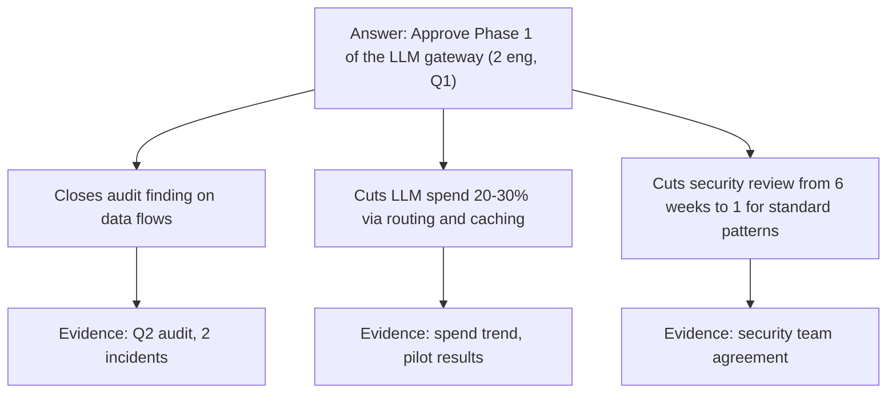

# Communicating with executives & stakeholders

!!! abstract "At a glance"
    **Priority:** P0 · **Complexity:** 3/5 · **Est. time:** 2 h · **Phase:** 3 · **Prereqs:** [Influence without authority](influence-without-authority.md), [Design docs & RFCs](design-docs-rfcs.md)
    **You're done when:** you've written a monthly exec update and a 1-page decision memo for a real (or capstone) initiative, each readable in under 2 minutes, and can deliver a 3-minute verbal version.

## Why it matters

Executives decide funding, priorities and mandates. Staff engineers who can communicate with them get their initiatives funded; those who can't get their best ideas lost in translation. Execs aren't less smart — they have less time, broader context, and different questions: *What's the decision? What's the risk? What does it cost? What happens if we don't?*

AI makes this more important. Leadership in 2026 is under pressure to "do AI" and flooded with vendor claims. A Staff engineer who can give a calm, evidence-based, two-minute answer to "should we use agents for X?" becomes the person they call.

## Core concepts

### How executives read

| They want | They don't want |
|---|---|
| The decision or ask, first | A chronological story |
| Impact in business terms (cost, revenue, risk, customer) | Technical detail unless asked |
| Options with a recommendation | "It depends" with no answer |
| Confidence levels and what would change your mind | False certainty |
| Bad news early, with a plan | Surprises |
| One page | Twelve slides |

### BLUF and the Pyramid Principle

**Bottom Line Up Front**: state the conclusion/ask in the first sentence. Then supporting points (the Pyramid Principle, Barbara Minto): answer → 3 key arguments → evidence under each. The reader can stop at any level and still have the essential message.



### Translate technical → business

| Technical statement | Exec translation |
|---|---|
| "p99 latency is 2.3 s" | "1 in 100 customers waits over 2 seconds for a quote; industry benchmark is under 1 s; we estimate X% abandonment" |
| "We need to migrate off Java 11" | "Unsupported runtime in production — audit/security finding risk; 6 weeks of work, can be done alongside Q1 features" |
| "Our RAG hallucinates" | "The assistant gives wrong answers to ~8% of policy questions; we'll get it under 2% before external launch by adding evaluation and human review" |
| "Agent evals are missing" | "We can't tell if a model update makes the system worse until customers complain" |

### Exec update template (monthly, one page)

```markdown
# <Initiative> — Monthly update — <Month YYYY>   Status: On track | At risk | Off track
**BLUF:** On track for Q1 goal; one risk needs your help (see Asks).
## Outcomes this month (business terms)
- 3 of 7 services migrated to gateway; 100% of their LLM traffic now logged and attributed
- LLM spend −18% on migrated services (caching + routing)
## Metrics (target / actual / trend)
| Metric | Target Q1 | Now | Trend |
## Risks & mitigations
- Booking team migration slips to Feb (Q4 freeze) — mitigation: adapter; impact on goal: none
## Asks / decisions needed
1. Approve second provider contract by 15 Dec (procurement blocked)
## Next month
```

Use words for status rather than colours, so it survives email, print and screen readers.

### Decision memo (1–2 pages)

```markdown
# Decision: <question> — needed by <date> — decider: <name>
## Recommendation (1–2 sentences)
## Context (why now; what happens if we don't decide)
## Options
| Option | Cost | Time | Risk | Reversibility | Notes |
## Recommendation rationale & key trade-off
## What would change my recommendation
## Next steps if approved
```

### Delivering bad news

1. **Early.** A risk flagged in week 2 is a plan; the same risk in week 10 is a failure.
2. **Own it, briefly.** No excuses, no blame.
3. **Impact + options + recommendation.** Never bring a problem without options.
4. **Say what you need.**

Script:
> "The EU launch of the customs agent will miss the March date by ~4 weeks. The extraction accuracy on German documents is at 91% against our 97% bar; shipping now would put ~1 in 10 declarations through manual review. Options: (a) launch in March for NL/BE only, DE in April; (b) launch everywhere with human review on all DE docs, adding ~2 FTE of reviewers for a month; (c) hold everything to April. I recommend (a). I need your decision by Friday to brief customer teams."

### The three-minute verbal brief

Structure: **Headline (15 s) → Why it matters (30 s) → Status/evidence (60 s) → Ask (30 s) → Q&A.** Practise out loud; record yourself. If interrupted, answer the question directly, then return to your ask.

### Communicating about AI with executives

- Separate **hype, capability and value**: "Agents can do X in demos; in our pilot on Y, they achieved Z; the business value is W."
- Always pair capability with **risk and controls** (data, errors, compliance) and **cost per unit** (per document, per conversation).
- Quote evidence with context: e.g., the METR (July 2025) RCT found experienced developers took ~19% longer on tasks with early-2025 AI tools despite expecting speed-ups; DORA 2025 frames AI as an amplifier of existing strengths and weaknesses. Use these to argue for measurement, not for or against AI.
- Avoid jargon (RAG, embeddings, MCP) unless the exec uses it.

### Senior-level nuance

- **Know what each exec is measured on** and frame accordingly (CFO: cost/predictability; COO: operations; CISO: risk; CPO: customer outcomes).
- **Pre-read culture varies.** Some execs read docs; some only listen. Adapt — ask their chief of staff.
- **Never surprise an exec in front of their peers.** Pre-brief privately.
- **Consistency builds trust.** A reliable monthly update, even when boring, earns you credibility for the time you need a big ask.
- **Staff engineers present to execs to help them decide**, not to show how much work was done.

## Resources

| Resource | Type | Why this one | Level | Cost |
|---|---|---|---|---|
| [Present to executives (StaffEng)](https://staffeng.com/guides/present-to-executives/) | article | Larson's concise guide to exec communication for ICs | intermediate | free |
| [Getting in the room (StaffEng)](https://staffeng.com/guides/getting-in-the-room/) | article | How to become someone execs want in decision meetings | intermediate | free |
| [How to write email with military precision (HBR)](https://hbr.org/2016/11/how-to-write-email-with-military-precision) :gem: | article | BLUF in practice; fast, memorable | intermediate | free |
| [The Architect Elevator (Gregor Hohpe)](https://architectelevator.com/) :gem: | blog/book | Riding between engine room and penthouse — the architect's communication job | advanced | free/paid |
| [Engineering Leadership (Gregor Ojstersek)](https://newsletter.eng-leadership.com/) :gem: | newsletter | Practical pieces on communicating upward | intermediate | freemium |
| [The Staff Engineer's Path (Tanya Reilly)](https://www.oreilly.com/library/view/the-staff-engineers/9781098118723/) | book | Communicating project status and making the case | advanced | paid |
| [State of AI-assisted Software Development 2025 (DORA)](https://dora.dev/research/2025/dora-report/) | report | Evidence to cite when talking AI productivity with execs | advanced | free |
| The Pyramid Principle (Barbara Minto) | book | The classic structure for top-down communication | intermediate | paid |

## Hands-on lab

**Produce: monthly exec update + decision memo (Staff artifact #3, with the stakeholder map). 60–90 min.**

1. Pick your capstone or a real initiative. Write the exec update using the template for "last month". ≤ 1 page. Include at least one risk and one ask.
2. Write a decision memo for a real open decision (e.g., "Managed agent runtime vs self-hosted LangGraph service for the pilot"). Three options, a table with reversibility, a clear recommendation, and "what would change my mind".
3. Two-minute test: give both to someone non-technical (or an LLM prompted as "a COO of a logistics company with 2 minutes") and ask them to state the ask and main risk. Revise until they can.
4. Record a 3-minute verbal brief on your phone. Watch it. Cut filler and technical detours.

**Expected output:** `docs/log/exec-update-<month>.md` and `docs/log/decision-memo-<topic>.md`.

## Questions

### L1 — Recall

??? question "Q1. What is BLUF and why does it work for executives?"
    ??? success "Answer"
        Bottom Line Up Front: put the conclusion or ask in the first sentence. Executives have little time and many inputs; BLUF lets them grasp the essential message immediately and decide how much further to read.

??? question "Q2. Describe the Pyramid Principle."
    ??? success "Answer"
        Start with the governing answer, support it with a small number (typically 3) of key arguments, and put evidence beneath each. The reader can stop at any level with a coherent message. It contrasts with chronological or "build-up" narratives.

??? question "Q3. What four things should accompany any bad news you bring to an executive?"
    ??? success "Answer"
        Clear impact (in business terms), options, your recommendation, and what you need from them (decision, resources, air cover) — delivered early and without blame or excuses.

### L2 — Apply

??? question "Q4. Rewrite for a CFO: 'We should adopt semantic caching and model routing in the gateway to reduce token usage.'"
    ??? success "Answer"
        "We can cut LLM spend by about 20–30% (~$X/month at current volume) with no customer-visible change by reusing answers to repeated questions and sending simple requests to cheaper models. It's two engineers for six weeks; payback in under three months. We'll report savings monthly."

??? question "Q5. The CEO forwards an article: 'Company X replaced 50% of engineers with AI agents. What's our plan?' Draft a 5-line reply."
    ??? success "Answer"
        "Short answer: we're capturing real gains, but claims like this rarely hold up at our scale and risk level. Where we are: coding agents rolled out to N engineers; early measures show faster delivery on routine work, with review and quality controls in place. Evidence is mixed — independent studies show both speed-ups and slowdowns depending on context — so we measure outcomes, not usage. Plan: expand where metrics show gains, invest in the platform/controls that make gains safe. Happy to brief you with our numbers in 15 minutes."

??? question "Q6. Your initiative moved from on track to at risk. Write the BLUF of this month's update."
    ??? success "Answer"
        "**BLUF:** At risk — the Q1 gateway goal will likely slip ~4 weeks because procurement of the second provider is blocked; I need your help to unblock it by 15 Dec, otherwise we'll launch with a single provider and accept higher outage risk until Feb."

### L3 — Design & trade-offs

??? question "Q7. Written memo vs slide deck for an exec decision — trade-offs?"
    ??? success "Answer"
        Memos force clear reasoning, carry nuance and trade-offs, can be read async, and leave a record (Amazon's 6-pager logic). Decks are good for visual data and live storytelling but hide weak reasoning behind bullet fragments. Default: a 1–2 page memo with one or two charts; use a small deck only if that exec/forum expects it, and keep the memo as the source of truth.

??? question "Q8. How do you present uncertainty to execs without seeming indecisive?"
    ??? success "Answer"
        Give a recommendation *and* a confidence level, with the key assumptions and what would change your view: "I recommend A (≈70% confident). The main uncertainty is extraction accuracy on German docs; we'll know in 3 weeks from the pilot; if it's below 95%, we switch to B." Use ranges for estimates. Decisiveness is about committing to a path with a plan to learn, not claiming certainty.

??? question "Q9. Your VP wants weekly status updates; your teams find them a burden. What do you do?"
    ??? success "Answer"
        Understand why the VP wants them (anxiety about risk? reporting upward?). Offer a lighter mechanism that meets the need: a dashboard auto-updated from the tracker, a weekly 3-line note (status, risk, ask) that you write rather than the teams, and a monthly full update. Agree on "exception-based" communication: you'll alert immediately if status changes. Reduce burden without reducing trust.

### L4 — Staff-level ambiguity

??? question "Q10. You have 10 minutes with the executive committee to argue for a central AI platform investment of 12 engineers. Several members are sceptical of AI hype. How do you structure it?"
    ??? success "Answer"
        Minute 0–1: the ask and the one-sentence why ("12 engineers for 3 quarters to make every product team's AI features safe, measurable and 30% cheaper"). 1–4: the problem in their terms — incidents, audit findings, duplicated spend, slow security reviews; no AI hype. 4–6: evidence from pilots (cost savings, review time, quality). 6–8: options (do nothing / federated / central platform) with cost and risk; recommendation. 8–10: measures and checkpoints, including kill criteria ("if by Q2 we haven't migrated 5 services and reduced spend 15%, we stop"). Pre-brief the most sceptical member beforehand.

??? question "Q11. Two executives give you conflicting direction on the AI roadmap. How do you handle it?"
    ??? success "Answer"
        Don't pick a side silently or play them off each other. Clarify each one's goal and constraints 1:1. Write a short doc framing the conflict neutrally (options, trade-offs, what each achieves). Ask your management chain who the decider is, and request that the executives align, or that their common manager decides. Until then, avoid irreversible commitments. Document the final decision.

??? question "Q12. (Behavioral) Tell me about a time you had to explain a complex technical issue to a non-technical senior stakeholder."
    ??? success "Answer"
        Show translation: the situation (e.g., why a model upgrade couldn't be done "next week"), how you reframed in business terms (risk of wrong customs declarations, need for evals), an analogy or visual if used, the options you gave, the decision they made, and the outcome. Mention how you checked understanding ("what would you tell your team about this?").

## Real-world use cases

- **Monthly AI platform update to the CTO**, with cost attribution per business unit.
- **Decision memo to a COO** on automating part of customs documentation with HITL, with risk and staffing impact.
- **Board-level briefing prep** on AI risk (data, regulatory such as the EU AI Act) for a CIO.
- **Incident exec brief** during a peak-season outage.

## Pitfalls & anti-patterns

- Chronological storytelling; the ask on slide 11.
- Technical jargon; no business translation.
- Watermelon status (green outside, red inside).
- Surprising execs in group settings.
- Presenting problems without options.
- Overclaiming AI capabilities or quoting vendor numbers uncritically.
- Inconsistent update cadence.

## Checklist

- [ ] I can explain BLUF and the Pyramid Principle and apply them without notes
- [ ] I wrote a one-page exec update and a decision memo that pass the 2-minute test
- [ ] I recorded and improved a 3-minute verbal brief
- [ ] I answered all L3 questions out loud in < 3 min each
